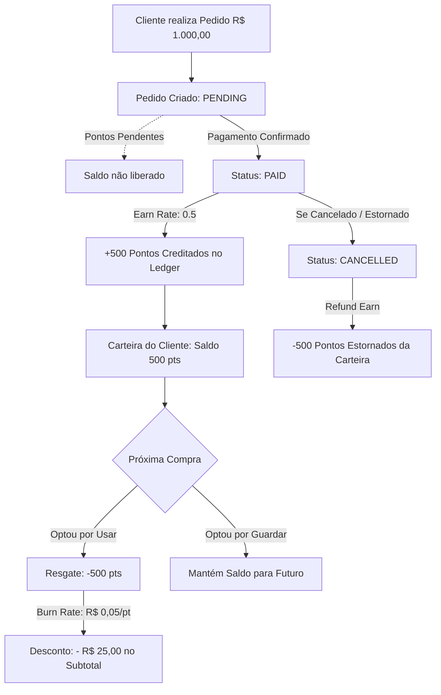

# 🏛️ Documento de Arquitetura e Planejamento Estrutural
## Sistema de Fidelidade & Bonificação por Pontos (Loyalty Engine)

**Data:** 31 de Agosto de 2026  
**Status:** Planejamento Arquitetural / Aprovado para Roadmap  
**Autor:** Engenharia de Software & Arquitetura de Sistemas  
**Escopo:** Módulo de Pontos, Acúmulo, Resgate, Segurança Transacional e Multi-Tenancy  

---

## 1. Contexto & Visão Geral

### 1.1. Solicitação do Cliente
> *"Boa tarde meus amigos, gostaria que no site implemente uma bonificação pra cada compra feita, por exemplo: um cliente compra 1.000 reais em produtos metade ele ganha em pontos tipo 500 pontos e cada ponto equivale a 5 centavos, claro somente a quantidade de pontos vai aparecer pro cliente e ele vai poder usar na proxima compra ou não fica a critério dele"*

### 1.2. Desafios Arquiteturais & Diretrizes de Engenharia
Em sistemas de e-commerce e plataformas de pagamento, bonificações monetárias e pontos **nunca devem ser tratados como uma coluna escalar editável diretamente no banco de dados**. Isso causaria vulnerabilidades graves:
1. **Condições de Corrida (*Race Conditions*) & *Double-Spending*:** O cliente abrindo múltiplas abas e aplicando o mesmo saldo em checkouts concorrentes.
2. **Fraude de Pontos Infinitos por Cancelamento:** Pontos concedidos em compras canceladas ou não pagas.
3. **Falta de Rastreabilidade / Auditoria Contábil:** Impossibilidade de reconciliar passivo financeiro da loja caso não haja histórico de movimentações.
4. **Vazamento Multi-Tenant (Cross-Tenant):** Pontos de uma loja sendo visualizados ou resgatados em outra loja da plataforma.

A solução desenhada utiliza o padrão **Double-Entry Ledger (Extrato Imutável)** integrado diretamente à **Máquina de Estados de Pedidos (FSM)** e ao **Pipeline de Checkout Autoritativo com ACID Transactions**.

---

## 2. Regras de Negócio e Fórmulas Matemáticas



### 2.1. Regras Padrão Parametrizadas
* **Taxa de Acúmulo (*Earn Rate*):** A cada R$ 1,00 gasto em produtos $\rightarrow$ **0,5 ponto** concedido (ou seja, 1 ponto a cada R$ 2,00).  
  $$\text{Pontos Ganhos} = \lfloor \text{Subtotal Elegível} \times \text{loyaltyEarnRate} \rfloor$$
  *Exemplo:* Compra de R$ 1.000,00 em produtos $\rightarrow$ $\lfloor 1000 \times 0.5 \rfloor = \mathbf{500\text{ pontos}}$.
* **Taxa de Resgate (*Burn Rate*):** 1 ponto = **R$ 0,05** de desconto monetário (5 centavos).  
  $$\text{Desconto (R\$)} = \text{Pontos Resgatados} \times \text{loyaltyPointValue}$$
  *Exemplo:* 500 pontos $\times$ R$ 0,05 = **R$ 25,00 de desconto** (Cashback efetivo de 2,5%).
* **Teto e Limites de Segurança:**
  * Desconto de pontos não pode abater frete (abate exclusivamente o subtotal de produtos).
  * Desconto não pode deixar o subtotal do pedido negativo.
  * O lojista pode configurar um percentual máximo de abatimento por pedido (ex: no máximo 50% do carrinho pago com pontos).

---

## 3. Modelagem de Dados & Schema Relacional (Prisma ORM)

### 3.1. Alterações no Modelo de Tenant (`Loja`)
Configurações isoladas e customizáveis para cada loja da plataforma:

```prisma
model Loja {
  // ... campos existentes ...
  
  // Módulo de Fidelidade / Pontos
  loyaltyEnabled          Boolean   @default(false)
  loyaltyEarnRate         Decimal   @default(0.5) @db.Decimal(5, 2)  // Multiplicador de ganho (0.5 = 1 pt a cada R$ 2)
  loyaltyPointValue       Decimal   @default(0.05) @db.Decimal(5, 4) // Conversão em R$ (0.05 = R$ 0,05 por ponto)
  loyaltyMinPointsRedeem  Int       @default(100)                    // Saldo mínimo para permitir resgate
  loyaltyMaxDiscountPct   Decimal   @default(50.0) @db.Decimal(5, 2) // Limite de % de desconto no subtotal
  loyaltyPointsExpiryDays Int?      @default(365)                    // Validade dos pontos em dias (ex: 365 dias)
  
  loyaltyWallets          LoyaltyWallet[]
  loyaltyTransactions     LoyaltyTransaction[]
}
```

### 3.2. Carteira do Usuário (`LoyaltyWallet`)
Agregação de saldo por usuário dentro de uma loja específica, otimizada para consultas de alta performance $O(1)$:

```prisma
model LoyaltyWallet {
  id           String   @id @default(uuid())
  lojaID       String
  loja         Loja     @relation(fields: [lojaID], references: [id], onDelete: Cascade)
  userID       String
  user         User     @relation(fields: [userID], references: [id], onDelete: Cascade)
  
  balance      Int      @default(0) // Saldo disponível e confirmado para uso
  pending      Int      @default(0) // Pontos aguardando confirmação de pagamento
  lifetimeEarn Int      @default(0) // Histórico acumulado vitalício
  
  version      Int      @default(0) // Lock de concorrência / integridade
  createdAt    DateTime @default(now())
  updatedAt    DateTime @updatedAt

  @@unique([lojaID, userID])
  @@index([lojaID])
  @@index([userID])
}
```

### 3.3. Livro-Razão Contábil (`LoyaltyTransaction`)
Histórico imutável de todas as movimentações de crédito, débito, estorno e expiração:

```prisma
enum LoyaltyTxType {
  EARN             // Pontos creditados por pedido concluído/pago
  REDEEM           // Pontos resgatados como desconto no checkout
  REFUND_EARN      // Estorno de pontos creditados (devido a cancelamento de pedido)
  REFUND_REDEEM    // Devolução de pontos resgatados (pedido cancelado)
  EXPIRATION       // Expiração periódica por decurso de prazo
  ADMIN_ADJUSTMENT // Ajuste manual realizado pelo administrador da loja
}

model LoyaltyTransaction {
  id             String        @id @default(uuid())
  lojaID         String
  loja           Loja          @relation(fields: [lojaID], references: [id], onDelete: Cascade)
  userID         String
  user           User          @relation(fields: [userID], references: [id], onDelete: Cascade)
  orderId        String?
  order          Order?        @relation(fields: [orderId], references: [id], onDelete: SetNull)
  
  type           LoyaltyTxType
  points         Int           // Positivo para crédito (+500), negativo para débito (-500)
  balanceAfter   Int           // Saldo consolidado após esta operação
  monetaryValue  Decimal?      @db.Decimal(10, 2) // Valor em R$ correspondente no momento da operação
  description    String
  expiresAt      DateTime?
  
  createdAt      DateTime      @default(now())

  @@index([lojaID, userID])
  @@index([orderId])
  @@index([createdAt])
}
```

### 3.4. Alterações no Modelo de Pedido (`Order`)
```prisma
model Order {
  // ... campos existentes ...
  
  // Auditoria de Pontos no Pedido
  pointsEarned          Int                  @default(0) // Pontos previstos/gerados por este pedido
  pointsRedeemed        Int                  @default(0) // Pontos consumidos como desconto
  pointsDiscountValue   Decimal              @default(0) @db.Decimal(10, 2) // Valor monetário abatido em R$
  
  loyaltyTransactions   LoyaltyTransaction[]
}
```

---

## 4. Arquitetura de Segurança, Concorrência e Anti-Fraude

```
                      PREVENÇÃO DE DOUBLE-SPENDING NO CHECKOUT

   Requisição A (Aba 1) ────┐
                            ├────► [ Transação ACID: Prisma $transaction ]
   Requisição B (Aba 2) ────┘               │
                                            ▼
                           UPDATE LoyaltyWallet 
                           SET balance = balance - 500
                           WHERE lojaID = :lojaID 
                             AND userID = :userID 
                             AND balance >= 500;
                                            │
                     ┌──────────────────────┴──────────────────────┐
                     ▼                                             ▼
             [ 1ª Requisição ]                             [ 2ª Requisição ]
            1 registro alterado                          0 registros alterados
             ► Pedido APROVADO                           ► Erro: Saldo Insuficiente
                                                         ► Rollback imediato
```

### 4.1. Prevenção de *Double-Spending* & *Race Conditions*
* O resgate de pontos no checkout é executado dentro de uma transação `$transaction` do Prisma.
* A dedução na tabela `LoyaltyWallet` é feita de forma atômica com predicado de saldo mínimo (`balance: { gte: pointsToRedeem }`).
* Caso duas requisições concorrentes tentem gastar o mesmo saldo, apenas uma terá êxito; a segunda disparará uma violação de condição e sofrerá *rollback* completo antes da criação do pedido.

### 4.2. Cálculo Estritamente Autoritativo no Backend
* O cliente não envia o valor em reais do desconto nem o seu saldo. Envia apenas `{ usePoints: 500 }`.
* O backend:
  1. Carrega as regras da loja (`loyaltyEnabled`, `loyaltyPointValue`, `loyaltyMaxDiscountPct`);
  2. Consulta a carteira real do cliente no banco;
  3. Valida se `pointsToRedeem <= wallet.balance` e `pointsToRedeem >= loyaltyMinPointsRedeem`;
  4. Calcula o desconto em R$ (`pointsToRedeem * loyaltyPointValue`);
  5. Aplica a trava do teto percentual permitido;
  6. Abate do subtotal de produtos para compor o `total` final.

### 4.3. Ciclo de Vida dos Pontos na FSM de Pedidos
| Transição de Pedido | Ação no Sistema de Pontos | Registro no Ledger |
| :--- | :--- | :--- |
| **Criação (`PENDING`)** | Se usou pontos: debita da carteira.<br>Se vai ganhar pontos: registra como pendente no pedido. | `REDEEM` (se houver resgate) |
| **Confirmação (`PENDING -> PAID`)** | Credita oficialmente os pontos ganhos na carteira do cliente. | `EARN` (+pontos) |
| **Cancelamento (`PAID -> CANCELLED`)** | 1. Estorna os pontos ganhos pela compra.<br>2. Devolve à carteira os pontos resgatados. | `REFUND_EARN` (-pontos)<br>`REFUND_REDEEM` (+pontos) |
| **Cancelamento (`PENDING -> CANCELLED`)** | Devolve os pontos que haviam sido bloqueados/resgatados. | `REFUND_REDEEM` (+pontos) |

---

## 5. Estrutura de Código e Novos Componentes

```
app/
├── api/
│   ├── loyalty/
│   │   ├── wallet/route.ts          # GET: Consulta saldo e extrato paginado do cliente
│   │   └── simulate/route.ts        # POST: Simulação autoritativa de desconto para checkout
│   └── admin/
│       └── loyalty/
│           ├── config/route.ts      # GET/PUT: Configurações do programa na Loja
│           ├── adjust/route.ts      # POST: Ajuste manual auditado de saldo de cliente
│           └── reports/route.ts     # GET: Métricas e passivo financeiro da loja
components/
├── checkout/
│   └── LoyaltyPointsWidget.tsx      # Componente de aplicação de pontos no checkout
└── profile/
    └── LoyaltyHistoryView.tsx       # Extrato de pontos no painel do cliente
services/
├── loyalty.service.ts               # Motor de cálculo e operações contábeis de pontos
├── checkout.service.ts              # Pipeline de checkout integrado com desconto de pontos
└── order.service.ts                 # Transições de status com hooks de crédito/estorno
```

---

## 6. Interface do Usuário (UX/UI Specification)

### 6.1. Experiência no Checkout
1. O usuário visualiza um card com acabamento refinado (*glassmorphism* / tema da loja):
   > 🎁 **Programa de Fidelidade**  
   > Você possui **500 pontos** disponíveis.  
   > `[ Toggle / Checkbox ]` **Usar 500 pontos para abater R$ 25,00 desta compra**
2. Ao ativar:
   * **Subtotal dos Produtos:** R$ 1.000,00
   * **Desconto Fidelidade (500 pts):** - R$ 25,00
   * **Frete:** R$ 20,00
   * **Total a Pagar:** **R$ 995,00**
   * *Informativo:* *"Você acumulará +497 pontos após o pagamento deste pedido!"*

### 6.2. Extrato no Perfil do Cliente (`/perfil/fidelidade`)
* Card de destaque com **Saldo Disponível**, **Pontos Pendentes** e **Economia Total Acumulada (R$)**.
* Tabela de histórico detalhada com badges:
  * `[+500 pts]` Compra #1004 — Concluída em 31/08/2026
  * `[-200 pts]` Desconto no Pedido #1089 em 15/09/2026
  * `[+50 pts]` Bônus de Cadastro

### 6.3. Painel Administrativo do Lojista (`/admin/fidelidade`)
* **Controle de Parâmetros:** Switch para Ativar/Desativar, Taxa de Acúmulo, Valor do Ponto em Reais e Validade em Dias.
* **Indicadores Financeiros:** Total de Pontos em Circulação vs. Passivo Financeiro Projetado em R$.

---

## 7. Roteiro de Implementação & Estratégia de Testes

### 7.1. Fases de Execução
* [ ] **Fase 1: Persistência** — Atualização do `schema.prisma` com `LoyaltyWallet`, `LoyaltyTransaction` e migração PostgreSQL.
* [ ] **Fase 2: Motor de Negócio** — Criação do `services/loyalty.service.ts` com validações Zod e funções puras de cálculo.
* [ ] **Fase 3: Integração Transacional** — Acoplamento no `services/checkout.service.ts` e máquina de estados em `services/order.service.ts`.
* [ ] **Fase 4: APIs & Guards** — Implementação dos Route Handlers com validação de sessão e isolamento de tenant.
* [ ] **Fase 5: Frontend & UI** — Construção do widget de checkout e visualização de extrato.
* [ ] **Fase 6: Suíte de Testes Automatizados (Vitest)**.

### 7.2. Cenários de Teste Automatizado
1. **Cálculo de Pontos:** Validação de precisão decimal de conversão (R$ 1.000,00 $\rightarrow$ 500 pts; 500 pts $\rightarrow$ R$ 25,00).
2. **Concorrência / Double-Spending:** Disparo simultâneo de 2 checkouts concorrentes com o mesmo saldo; assert que apenas 1 é aprovado.
3. **Ciclo de Vida / FSM:** Pedido criado $\rightarrow$ Pedido pago $\rightarrow$ Saldo creditado $\rightarrow$ Pedido cancelado $\rightarrow$ Saldo revertido.
4. **Isolamento Multi-Tenant:** Garantia de que usuário com pontos na Loja A não consegue consultá-los ou usá-los na Loja B.

---
*Documento aprovado pela Engenharia de Software. Pronto para execução das fases do projeto.*
