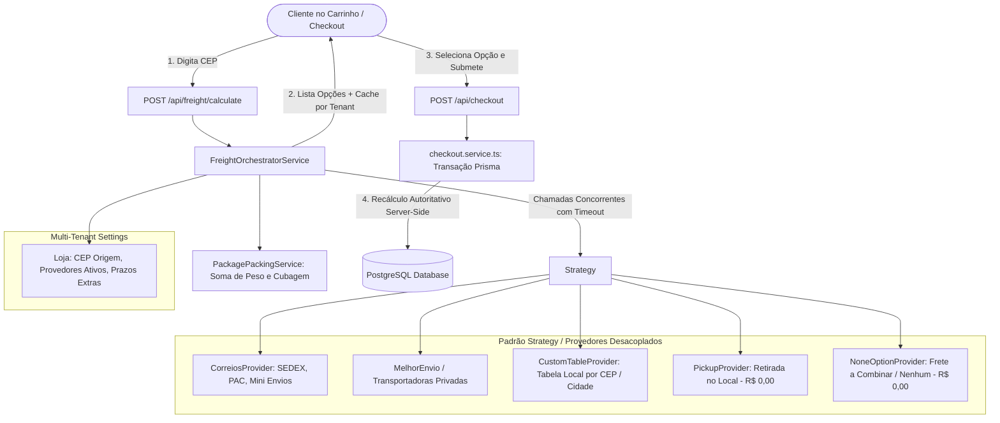

# 🚚 Roadmap & Arquitetura do Sistema de Fretes Multi-Provedor

Documento técnico com a arquitetura completa, modelagem de dados, diretrizes de segurança e roteiro de implementação passo a passo para o sistema de fretes da plataforma.

---

## 📌 1. Visão Geral e Objetivos do Sistema

O objetivo deste subsistema é fornecer uma infraestrutura de cotação e seleção de frete **modular, resiliente, segura e escalável**.

### Principais Diretrizes:
1. **Integração com Correios e Múltiplos Provedores**: Suporte nativo a Correios (SEDEX, PAC, Mini Envios) e arquitetura desacoplada (via *Strategy Pattern*) pronta para plugar transportadoras privadas (Melhor Envio, Jadlog, Loggi, Lalamove), tabelas próprias por região/CEP e retirada no local.
2. **Cálculo Adaptado à Localização**: Cotação em tempo real baseada no CEP de destino do cliente, CEP de origem da loja e peso/dimensões somadas dos produtos do carrinho.
3. **Liberdade de Escolha do Cliente**: O cliente pode selecionar o frete desejado (comparando preço e prazo) ou optar por **NÃO ESCOLHER NENHUM FRETE** (ex: Retirada na Loja física ou Frete a Combinar via WhatsApp).
4. **Reflexão Imediata no Valor Final**: O valor do frete escolhido é integrado ao resumo financeiro (Subtotal + Frete = Total).
5. **Segurança Autoritativa (Server-Side Authority)**: O backend valida e recalcula autoritativamente o valor do frete no ato da criação do pedido (`checkout.service.ts`), impedindo manipulação de preços via frontend.

---

## 🏗️ 2. Diagrama Arquitetural



---

## 🧩 3. Design Patterns & Estrutura de Código

### A. Contrato Unificado de Provedores (`IFreightProvider`)

Cada provedor de transporte implementa a mesma interface, permitindo plugar novas transportadoras sem alterar o núcleo do sistema:

```typescript
// types/freight.ts

export interface PackageDimensions {
  weightInGrams: number; // Peso total em gramas
  lengthCm: number;      // Comprimento em cm
  widthCm: number;       // Largura em cm
  heightCm: number;      // Altura em cm
}

export interface FreightQuoteRequest {
  lojaID: string;
  originCep: string;
  destinationCep: string;
  packages: PackageDimensions;
  cartTotal: number;
  itemsCount: number;
  storeSettings?: Record<string, any>;
}

export interface FreightOption {
  providerId: string;         // 'CORREIOS' | 'MELHOR_ENVIO' | 'LOCAL_TABLE' | 'STORE_PICKUP' | 'NONE'
  serviceCode: string;        // '04014' (SEDEX), '04510' (PAC), 'PICKUP', 'NONE'
  serviceName: string;        // 'SEDEX', 'PAC', 'Retirada na Loja', 'A Combinar via WhatsApp'
  price: number;              // Valor final do frete em R$
  originalPrice?: number;     // Valor original antes de regras promocionais
  deliveryTimeInDays: number; // Prazo estimado em dias úteis
  description?: string;       // Informações adicionais
  isRecommended?: boolean;
}

export interface IFreightProvider {
  readonly id: string;
  readonly name: string;
  isAvailableForStore(lojaID: string): Promise<boolean>;
  calculateQuotes(request: FreightQuoteRequest): Promise<FreightOption[]>;
}
```

### B. Provedores Planejados:
1. **`CorreiosProvider`**: CWS / API dos Correios com cálculo de tarifas oficiais para PAC e SEDEX.
2. **`CustomTableProvider`**: Tabela própria por cidade ou faixa de CEP gerenciada pelo lojista.
3. **`PickupProvider`**: Retirada na loja física (Custo R$ 0,00, prazo 0 dias).
4. **`NoneFreightProvider`**: Opção explícita de "Frete a Combinar / Sem Frete" (Custo R$ 0,00 imediato, permitindo acordar envio por fora).

---

## 📦 4. Algoritmo de Cubagem & Empacotamento (`PackagePackingService`)

Para cotar múltiplos itens de um carrinho nos Correios e transportadoras:
1. **Soma de Pesos**: $\text{Peso Total} = \sum (\text{peso\_unitário} \times \text{quantidade})$.
2. **Cálculo Cúbico Equivalente**: Calcula o volume cúbico acumulado ($\text{Comprimento} \times \text{Largura} \times \text{Altura}$) e ajusta a uma caixa virtual padrão.
3. **Limites Operacionais dos Correios**:
   - Comprimento mínimo: 15 cm | máximo: 100 cm
   - Largura mínima: 10 cm | máxima: 100 cm
   - Altura mínima: 1 cm | máxima: 100 cm
   - Soma das dimensões ($C + L + A$): mín. 26 cm e máx. 200 cm.

---

## 🔒 5. Segurança, Resiliência & Performance

### 1. Prevenção de Fraudes e Manipulação de Preços
* O frontend envia apenas o identificador da opção escolhida (`providerId`, `serviceCode`).
* O `checkout.service.ts` executa a validação server-side dentro da transação atômica (`prisma.$transaction`), recalculando o frete antes de persistir o `Order`.

### 2. Tolerância a Falhas e Timeouts (Circuit Breaker)
* Consultas a serviços externos utilizam `Promise.allSettled` com timeout máximo de 3.5 segundos.
* Se a API dos Correios estiver indisponível ou lenta, o sistema não trava o checkout: retorna as opções locais (Retirada, Tabela Própria, Frete a Combinar) com aviso informativo.

### 3. Cache Multi-Tenant
* Resultados de cotações para a chave `lojaID:origem:destino:hash_dimensoes` são cacheados em memória/Redis via `tenantCache` por 30 a 60 minutos, garantindo resposta em sub-milissegundos para consultas repetidas.

---

## 🗄️ 6. Alterações no Banco de Dados (Schema Prisma)

```prisma
// 1. Dimensões físicas no Produto
model Product {
  // ... campos existentes ...
  weightInGrams   Int?      @default(300) // Peso em gramas
  lengthCm        Int?      @default(16)  // Comprimento em cm
  widthCm         Int?      @default(11)  // Largura em cm
  heightCm        Int?      @default(4)   // Altura em cm
  freeShipping    Boolean   @default(false)
}

// 2. Configurações de Frete da Loja
model Loja {
  // ... campos existentes ...
  originCep            String?   // CEP de saída dos produtos
  originState          String?
  originCity           String?
  originStreet         String?
  originNumber         String?
  
  // Provedores e flags
  enableCorreios       Boolean   @default(false)
  correiosContractCode String?   // Opcional para contratos corporativos
  correiosPassword     String?
  
  enablePickup         Boolean   @default(true) // Retirada na loja
  enableNoFreight      Boolean   @default(true) // Frete a combinar / nenhum
  additionalDays       Int       @default(0)    // Dias extras de manuseio/expedição
}

// 3. Atualização do Enum de Entrega e Pedido
enum DeliveryType {
  DELIVERY
  PICKUP
  NONE // Cliente optou por "Nenhum frete / A combinar"
}

model Order {
  // ... campos existentes ...
  deliveryType            DeliveryType
  shippingProvider        String?  // ex: "CORREIOS", "LOCAL_TABLE", "STORE_PICKUP", "NONE"
  shippingServiceName     String?  // ex: "SEDEX", "PAC", "Retirada", "A Combinar"
  shippingCost            Decimal  @default(0) @db.Decimal(10, 2)
  shippingEstimatedDays   Int?     // Prazo prometido na compra
  trackingCode            String?  // Código de rastreamento (ex: "AA123456789BR")
}
```

---

## 🚀 7. Roadmap de Implementação Passo a Passo

### 📍 FASE 1: Modelo de Dados & Migração
* [x] Adicionar campos de dimensões (`weightInGrams`, `lengthCm`, `widthCm`, `heightCm`, `freeShipping`) no modelo `Product` do [schema.prisma](file:///c:/Diversos/TI/Trabalhos/2026/Sistemas/Projeto/prisma/schema.prisma).
* [x] Adicionar dados de CEP de origem e configurações de frete no modelo `Loja`.
* [x] Atualizar o enum `DeliveryType` e incluir metadados de envio no modelo `Order`.
* [x] Executar migration segura no banco de dados (`prisma migrate dev` ou `prisma db push`).

### 📍 FASE 2: Núcleo do Motor de Frete (`services/freight/`)
* [x] Criar arquivo de interfaces e contratos unificados (`types/freight.ts`).
* [x] Desenvolver `PackagePackingService` para cálculo de peso total e cubagem do carrinho.
* [x] Implementar `CorreiosProvider` (integração HTTP resiliente com a API de preços e prazos dos Correios).
* [x] Implementar `CustomTableProvider` (cálculo por regras locais / faixas de CEP).
* [x] Implementar `PickupProvider` (retirada física com valor R$ 0,00).
* [x] Implementar `NoneOptionProvider` (opção explícita de sem frete / a combinar).
* [x] Desenvolver `FreightOrchestratorService` para coordenar chamadas paralelas, aplicar cache do tenant e consolidar a lista de opções.

### 📍 FASE 3: Endpoints de API & Cache
* [x] Criar/atualizar a rota `POST /api/freight/calculate` com validação Zod (`destinationCep`, `items`, `lojaID`).
* [x] Conectar o `tenantCache` para respostas ultra-rápidas e proteção contra rate-limits das transportadoras.

### 📍 FASE 4: Blindagem do Checkout Server-Side
* [x] Atualizar [checkout.service.ts](file:///c:/Diversos/TI/Trabalhos/2026/Sistemas/Projeto/services/checkout.service.ts) para receber a opção de frete selecionada (`shippingProvider`, `serviceCode`).
* [x] Incluir validação/recálculo autoritativo dentro da transação atômica do pedido.
* [x] Garantir que opções `PICKUP` ou `NONE` resultem estritamente em `shippingCost = 0` e persistam os metadados corretos.

### 📍 FASE 5: Interface do Usuário (Carrinho & Checkout)
* [x] Atualizar [CheckoutForm.tsx](file:///c:/Diversos/TI/Trabalhos/2026/Sistemas/Projeto/components/checkout/CheckoutForm.tsx) na etapa de entrega:
  - Input de CEP com busca automática de endereço via ViaCEP.
  - Gatilho automático de cotação de frete ao preencher o CEP.
  - Exibição de cards de opções (PAC, SEDEX, Retirada e "Sem frete / A combinar pelo WhatsApp").
  - Seleção interativa com atualização dinâmica do valor total no Resumo do Pedido.

### 📍 FASE 6: Painel Administrativo do Lojista
* [x] Adicionar seção de **Configurações de Envio** no painel admin para o lojista cadastrar seu CEP de origem, ativar os Correios e configurar prazos adicionais de expedição.
* [x] Adicionar campo de preenchimento de **Código de Rastreio** na visualização detalhada do pedido para envio automático ao cliente.
