# Plano de Implementação Multi-Etapas: Remediação da Auditoria de Segurança

**Projeto**: E-Commerce Multi-Tenant  
**Data do Plano**: 19 de agosto de 2026  
**Documento Base**: [Auditoria Técnica](./auditoria/auditoria.md)  
**Veredito Inicial da Auditoria**: 22/100 (Inadequado para Produção)  
**Objetivo**: Estabelecer um roteiro modular, sequencial e detalhado para implementar 100% das correções e elevar o sistema ao nível de prontidão para produção com isolamento multi-tenant real e checkout seguro.

---

## 🎯 Instruções para Execução pelo Agente

1. **Abordagem Passo a Passo (One Step at a Time)**:
   - Implemente estritamente **uma etapa por vez**.
   - Não tente agrupar várias etapas em um único comando ou contexto grande.
   - Ao iniciar uma etapa, leia os arquivos citados e aplique as mudanças focadas.
   - Ao concluir a etapa, execute a verificação daquela etapa antes de passar para a próxima.
2. **Sem Credenciais em Arquivos**: Nenhuma credencial ou URL de conexão real deve ser escrita em código-fonte ou versionada.
3. **Não-Regressão**: Cada etapa deve manter o build, typecheck e testes existentes verdes.

---

## 🗺️ Visão Geral do Roadmap

```mermaid
flowchart TD
    subgraph FASE_0["Fase 0: Preparação, Harness & Contenção Imediata"]
        E01["Etapa 0.1: Remediação de Credenciais & Segredos"] --> E02["Etapa 0.2: Isolamento de Testes & Configuração Vitest"]
        E02 --> E03["Etapa 0.3: Atualização do Next.js & Dependências Críticas"]
        E03 --> E04["Etapa 0.4: Blindagem Supabase / Data API / RLS"]
    end

    subgraph FASE_1["Fase 1: TenantContext & Hardening de Autenticação"]
        E04 --> E11["Etapa 1.1: TenantContext & IdentityContext Fail-Closed"]
        E11 --> E12["Etapa 1.2: Consolidação de Guards e Eliminação de Código Duplicado"]
        E12 --> E13["Etapa 1.3: Hardening de Sessão, DTOs e Sanitização de Respostas"]
        E13 --> E14["Etapa 1.4: Isolamento de Usuários, Roles e Endereços"]
    end

    subgraph FASE_2["Fase 2: Banco de Dados, Schema & Invariantes"]
        E14 --> E21["Etapa 2.1: Reconciliação do Schema Prisma e Migrations"]
        E21 --> E22["Etapa 2.2: Invariantes Monetárias (Decimal) & Constraints CHECK"]
        E22 --> E23["Etapa 2.3: Otimização de Índices & Singleton Prisma Pooler"]
    end

    subgraph FASE_3["Fase 3: Core de E-Commerce & Checkout Seguro"]
        E23 --> E31["Etapa 3.1: Paginação e Proteção de Catálogo contra DoS"]
        E31 --> E32["Etapa 3.2: Refatoração do Carrinho e Isolamento Multi-Tenant"]
        E32 --> E33["Etapa 3.3: Pipeline Canônico de Checkout Autoritativo"]
        E33 --> E34["Etapa 3.4: Idempotência Transacional e Controle de Concorrência"]
    end

    subgraph FASE_4["Fase 4: Admin, Prevenção BOLA/IDOR & Contratos"]
        E34 --> E41["Etapa 4.1: Eliminação de BOLA/IDOR em Pedidos, Clientes e Produtos"]
        E41 --> E42["Etapa 4.2: Saneamento de Contratos de API/UI e Server Actions"]
    end

    subgraph FASE_5["Fase 5: Borda, Rate Limiting, Performance & CI/CD"]
        E42 --> E51["Etapa 5.1: Security Headers, CSRF e Rate Limiting Distribuído"]
        E51 --> E52["Etapa 5.2: Cache Distribuído Tenant-Aware"]
        E52 --> E53["Etapa 5.3: Pipeline de CI/CD, Gates Automatizados e Observabilidade"]
    end

    subgraph FASE_6["Fase 6: Validação Final & Gate de Produção"]
        E53 --> E61["Etapa 6.1: Matriz de Testes Cross-Tenant & Gate de Prontidão"]
    end
```

---

# Detalhamento Completo por Etapas

---

## 🧱 FASE 0: Preparação, Harness & Contenção Imediata

### 📌 Etapa 0.1: Remediação de Credenciais & Higiene de Segredos
* **Finding**: `SEC-001` (Crítico)
* **Objetivo**: Eliminar credenciais PostgreSQL/Supabase hardcoded e blindar arquivos de configuração contra vazamentos acidentais.
* **Arquivos Alvo**:
  * `test_db_conn.js`
  * `.gitignore`
  * `.env.example`
* **Tarefas de Implementação**:
  1. Refatorar `test_db_conn.js` para ler estritamente `process.env.DATABASE_URL` e `process.env.DIRECT_URL`, removendo qualquer string de conexão hardcoded.
  2. Adicionar em `.gitignore` regras estritas: `test_db_conn.js`, `.env*`, `*.pem`, `*.key`, `*.dump`.
  3. Criar `.env.example` limpo com placeholders sem credenciais reais.
  4. Adicionar nota de instrução para rotação de senhas do banco no painel administrativo do Supabase.
* **Critério de Validação**:
  * Executar varredura local: nenhuma credencial ou URI postgresql com senha em arquivos rastreados pelo repositório.

---

### 📌 Etapa 0.2: Isolamento do Harness de Testes & Configuração Vitest
* **Finding**: `TST-001` (Alto)
* **Objetivo**: Permitir a execução automatizada das suítes de teste (Vitest), corrigir resolução do alias `@/*` e proibir operações destrutivas em bancos compartilhados.
* **Arquivos Alvo**:
  * `vitest.config.ts`
  * `tsconfig.json`
  * `package.json`
  * `tests/setup/db.ts`
  * `tests/**/*.test.ts`
* **Tarefas de Implementação**:
  1. Criar `vitest.config.ts` configurando `plugins`, `resolve.alias` (`@` -> `./`) e ambiente `node`.
  2. Adicionar scripts no `package.json`: `"test": "vitest run"`, `"test:watch": "vitest"`.
  3. Modificar `tests/setup/db.ts` para exigir variável `TEST_DATABASE_URL` e barrar a execução se a URL não apontar para banco de teste explícito (contendo `_test` ou `localhost`).
  4. Corrigir contratos e tipagens nas fixtures de teste para restabelecer a coleta das 7 suítes existentes.
* **Critério de Validação**:
  * `npm test` executa e coleta todas as suítes de teste sem falha de importação.
  * Execução sem `TEST_DATABASE_URL` aborta com erro claro e seguro.

---

### 📌 Etapa 0.3: Atualização do Next.js & Dependências Críticas de Produção
* **Finding**: `SEC-004` (Alto)
* **Objetivo**: Mitigar vulnerabilidades de DoS em Server Actions (CVE-2026-64641 / GHSA-m99w-x7hq-7vfj) e pacotes com vulnerabilidades conhecidas (`postcss`, `nanoid`, `ws`).
* **Arquivos Alvo**:
  * `package.json`
  * `package-lock.json`
  * `next.config.js`
* **Tarefas de Implementação**:
  1. Atualizar `next` para versão segura suportada (linha 15.x / 16.x ou versão corrigida com patches GHSA).
  2. Atualizar dependências diretas de `react` e `react-dom` correspondentes.
  3. Atualizar pacotes vulneráveis transitivos (`postcss`, `nanoid`, `ws`).
  4. Executar `npm audit --omit=dev` para confirmar que o pacote de produção está livre de alertas críticos/altos.
  5. Testar compilação com `npm run build`.
* **Critério de Validação**:
  * `npm audit --omit=dev` com 0 vulnerabilidades críticas e altas.
  * `npm run build` conclui com sucesso.

---

### 📌 Etapa 0.4: Blindagem Supabase / Data API / RLS
* **Finding**: `DB-004` (Crítico)
* **Objetivo**: Garantir que as tabelas do PostgreSQL não estejam acessíveis anônima ou diretamente via REST Data API do Supabase sem passar pela aplicação.
* **Arquivos Alvo**:
  * `lib/supabase/server.ts`
  * `prisma/migrations/sql/rls_hardening.sql` (ou nova migration)
* **Tarefas de Implementação**:
  1. Avaliar uso do cliente Supabase SSR (`lib/supabase/server.ts`). Caso a persistência seja 100% Prisma, desativar Data API pública no Supabase.
  2. Gerar migration/script SQL aplicando `ALTER TABLE ... ENABLE ROW LEVEL SECURITY;` e `REVOKE ALL ON SCHEMA public FROM anon, authenticated;` em todas as entidades sensíveis (`User`, `Session`, `Order`, `Loja`, `Address`, etc.).
  3. Garantir que o usuário Prisma possua permissão direta/bypass apropriada para a aplicação.
* **Critério de Validação**:
  * Teste de chamada REST direta na Data API do Supabase com anon key recebe 401/403/Empty em todas as tabelas privadas.

---

## 🛡️ FASE 1: TenantContext & Hardening de Autenticação

### 📌 Etapa 1.1: TenantContext & IdentityContext Canônicos Fail-Closed
* **Findings**: `TEN-003` (Alto), `SEC-006` (Médio)
* **Objetivo**: Forçar o isolamento estrito de tenant baseado no Host, eliminando fallbacks inseguros e removendo variáveis públicas globais do frontend.
* **Arquivos Alvo**:
  * `lib/tenant.ts`
  * `lib/context/tenant-context.ts`
  * `app/checkout/page.tsx`
  * `middleware.ts`
* **Tarefas de Implementação**:
  1. Refatorar `lib/tenant.ts` para comportamento **Fail-Closed**: se o host não for reconhecido, retornar 404 (eliminando o `findFirst()` que entregava a primeira loja aleatória).
  2. Criar `TenantContext` contendo `{ id, slug, nome, status, customDomain }`.
  3. Normalizar cabeçalho `Host` (remover portas, caracteres inválidos, sanitizar trailing dot).
  4. Remover o uso de `NEXT_PUBLIC_LOJA_SLUG` no checkout (`app/checkout/page.tsx`), derivando o tenant exclusivamente do contexto resolvido no servidor.
* **Critério de Validação**:
  * Requisição com cabeçalho `Host: invasor.com` resulta em 404 (Loja não encontrada).
  * O checkout da Loja B não herda variáveis estáticas da Loja A.

---

### 📌 Etapa 1.2: Consolidação de Guards e Eliminação de Código Duplicado
* **Finding**: `ARC-001` (Alto)
* **Objetivo**: Unificar árvores divergentes de serviços (`services/**` e `lib/services/**`) e centralizar os guards de autorização em um único módulo canônico.
* **Arquivos Alvo**:
  * `lib/auth/guards.ts`
  * `lib/auth-admin.ts` (descontinuar)
  * `services/**` e `lib/services/**`
* **Tarefas de Implementação**:
  1. Definir uma única árvore de serviços canônica em `services/**` (monólito modular).
  2. Implementar em `lib/auth/guards.ts` funções padronizadas:
     * `requireSession(req)`
     * `requireTenant(req)`
     * `requireAdmin(req)` -> valida se `session.user.role === 'ADMIN'` E `session.user.lojaID === currentTenant.id`.
  3. Migrar todas as rotas `/api/**` para consumirem os novos guards.
  4. Remover arquivos legados duplicados.
* **Critério de Validação**:
  * Todas as rotas de API utilizam a mesma biblioteca de guards.
  * Zero divergência estrutural entre `services` e `lib/services`.

---

### 📌 Etapa 1.3: Hardening de Sessão, DTOs e Sanitização de Respostas
* **Findings**: `SEC-005` (Alto), `SEC-006` (Médio)
* **Objetivo**: Proteger o ciclo de vida da sessão, garantir hash em tokens de sessão no banco e impedir vazamento de hashes de senha em respostas JSON.
* **Arquivos Alvo**:
  * `lib/session.ts`
  * `services/auth.service.ts`
  * `app/api/auth/register/route.ts`
  * `app/api/auth/login/route.ts`
  * `app/api/auth/logout/route.ts`
* **Tarefas de Implementação**:
  1. Em `services/auth.service.ts`, garantir que respostas de registro/login usem `select` estrito (nunca retornar `password`, `resetToken`, etc.).
  2. Implementar dummy hash bcrypt com tempo de execução idêntico para e-mails inexistentes, evitando enumeração de usuários por timing attack.
  3. Em `lib/session.ts`, permitir login/validação apenas para status `ACTIVE` (rejeitar `PENDING` e `BLOCKED`).
  4. Armazenar token de sessão com hash SHA-256 no banco (comparando hash na validação).
  5. Garantir que `logout` revogue o registro no banco antes de expirar o cookie.
* **Critério de Validação**:
  * Respostas de login/registro não possuem propriedade `password` no JSON.
  * Sessão `PENDING` ou `BLOCKED` recebe 401.

---

### 📌 Etapa 1.4: Isolamento de Usuários, Roles e Endereços
* **Findings**: `TEN-001` (Crítico), `SEC-003` (Alto)
* **Objetivo**: Eliminar takeover de roles entre tenants e proteger endpoints de alteração de endereço.
* **Arquivos Alvo**:
  * `app/api/admin/users/route.ts`
  * `services/admin.service.ts`
  * `services/user.service.ts`
  * `app/api/address/set-default/route.ts`
  * `services/address.service.ts`
* **Tarefas de Implementação**:
  1. Em `app/api/admin/users/route.ts` e `services/admin.service.ts`, forçar filtro `{ lojaID: session.user.lojaID }` em todas as consultas.
  2. Em `services/user.service.ts`, na alteração de role de usuário, exigir cláusula atômica `where: { id: targetUserId, lojaID: session.user.lojaID }` e retornar 404 se pertencer a outro tenant.
  3. Calcular contagem de "último admin" estritamente por tenant.
  4. Em `app/api/address/set-default/route.ts`, exigir autenticação via sessão. Ignorar qualquer `userId` enviado no corpo e usar `session.user.id`.
  5. Retornar DTO enxuto em `services/address.service.ts`.
* **Critério de Validação**:
  * Admin da Loja A não visualiza nem altera usuário da Loja B (retorna 404).
  * Chamada anônima a `/api/address/set-default` retorna 401.

---

## 🗄️ FASE 2: Banco de Dados, Schema & Invariantes

### 📌 Etapa 2.1: Reconciliação do Schema Prisma e Migrations
* **Finding**: `DB-001` (Crítico)
* **Objetivo**: Sincronizar o schema Prisma com as migrations SQL para garantir que restores e deploys em banco limpo ocorram sem falhas.
* **Arquivos Alvo**:
  * `prisma/schema.prisma`
  * `prisma/migrations/**`
* **Tarefas de Implementação**:
  1. Mapear divergências de colunas (`Loja.primaryColor`, `secondaryColor`, `customDomain`, `Product.galleryUrls`).
  2. Mapear divergências de nulabilidade (`Order.addressID`, `OrderItem.productId`).
  3. Gerar migration de reconciliação de baseline com `prisma migrate diff`.
  4. Validar o replay de todas as migrations em banco PostgreSQL vazio.
* **Critério de Validação**:
  * `npx prisma migrate status` reporta conformidade total sem drift.

---

### 📌 Etapa 2.2: Invariantes Monetárias (Decimal) & Constraints CHECK
* **Finding**: `DB-003` (Alto)
* **Objetivo**: Padronizar valores monetários em `Decimal(10,2)` e aplicar constraints `CHECK` no PostgreSQL para integridade de estoque e preços.
* **Arquivos Alvo**:
  * `prisma/schema.prisma`
  * `prisma/migrations/**`
* **Tarefas de Implementação**:
  1. Alterar campos de preço em `Product`, `ProductVariant`, `CartItem` e `Freight` de `Float` para `Decimal(10, 2)`.
  2. Criar migration adicionando constraints `CHECK`:
     * Preços, subtotal, frete e total `>= 0`.
     * Estoque e quantidades no carrinho `>= 0`.
  3. Criar constraint de unicidade parcial: no máximo 1 carrinho `ACTIVE` por usuário (`CREATE UNIQUE INDEX ... WHERE status = 'ACTIVE'`).
  4. Adicionar constraint de unicidade em `ProductVariant(productId, size, color)`.
* **Critério de Validação**:
  * Tentativa de inserir preço negativo ou estoque negativo gera erro de constraint no PostgreSQL.

---

### 📌 Etapa 2.3: Otimização de Índices & Singleton Prisma Pooler
* **Findings**: `DB-003` (Alto), `SCL-002` (Alto)
* **Objetivo**: Otimizar índices compostos para consultas frequentes e assegurar uma única instância singleton do Prisma Client com suporte a connection pooler.
* **Arquivos Alvo**:
  * `lib/prisma.ts`
  * `lib/services/freight.service.ts`
  * `prisma/schema.prisma`
  * `prisma/migrations/**`
* **Tarefas de Implementação**:
  1. Eliminar `new PrismaClient()` duplicado em `lib/services/freight.service.ts`, consumindo `lib/prisma.ts`.
  2. Configurar timeouts e suporte a `DIRECT_URL` / `DATABASE_URL` no Prisma Client.
  3. Declarar índices multi-tenant no `schema.prisma`:
     * `Order(lojaID, status, createdAt DESC)`
     * `Order(userID, createdAt DESC)`
     * `Product(lojaID, createdAt DESC)`
     * `Cart(userID, status)`
     * `Session(expiresAt)`
  4. Gerar e aplicar migration correspondente.
* **Critério de Validação**:
  * Apenas uma fábrica de Prisma Client presente no projeto.
  * Queries de pedidos e catálogo utilizam os índices multi-tenant criados.

---

## 🛒 FASE 3: Core de E-Commerce & Checkout Seguro

### 📌 Etapa 3.1: Paginação e Proteção de Catálogo contra DoS
* **Finding**: `SCL-001` (Alto)
* **Objetivo**: Limitar consultas de catálogo e vitrine no servidor, implementando paginação e projeções enxutas de dados.
* **Arquivos Alvo**:
  * `app/page.tsx`
  * `app/api/products/route.ts`
  * `services/product.service.ts`
* **Tarefas de Implementação**:
  1. Em `services/product.service.ts`, estabelecer limite padrão (`take: 24`, limite máximo `take: 100`) em consultas de listagem.
  2. Implementar paginação estável por cursor/offset na API pública de produtos.
  3. Criar projeção específica para cards de produtos na vitrine (evitando carregar variantes completas na homepage).
  4. Ajustar consumo no componente de frontend para suportar paginação.
* **Critério de Validação**:
  * Requisição `/api/products` sem parâmetros retorna no máximo 24 itens com envelope paginado.

---

### 📌 Etapa 3.2: Refatoração do Carrinho e Isolamento Multi-Tenant
* **Findings**: `ARC-001` (Alto), `DB-003` (Alto)
* **Objetivo**: Assegurar que carrinhos pertençam estritamente à loja da sessão do usuário e que os preços sejam derivados exclusivamente do banco de dados.
* **Arquivos Alvo**:
  * `app/api/cart/**`
  * `services/cart.service.ts`
* **Tarefas de Implementação**:
  1. Validar que o produto/variante adicionado ao carrinho pertença à mesma `lojaID` da sessão.
  2. Rejeitar adição de produto cross-tenant com 404/400.
  3. Buscar o preço unitário do produto diretamente na base de dados (nunca aceitar preço enviado pelo cliente).
  4. Garantir atomicidade na atualização de quantidades de itens.
* **Critério de Validação**:
  * Tentativa de adicionar produto da Loja B no carrinho da Loja A falha.
  * O preço gravado no carrinho reflete o valor cadastrado no banco.

---

### 📌 Etapa 3.3: Pipeline Canônico de Checkout Autoritativo
* **Findings**: `SEC-002` (Crítico), `ARC-001` (Alto)
* **Objetivo**: Eliminar o endpoint público vulnerável de checkout e estabelecer um pipeline seguro e autoritativo no servidor.
* **Arquivos Alvo**:
  * `app/api/checkout/route.ts` (descontinuar/redirecionar)
  * `app/api/orders/route.ts`
  * `lib/validators/checkout.validators.ts`
  * `services/order.service.ts`
  * `components/checkout/CheckoutForm.tsx`
* **Tarefas de Implementação**:
  1. Redesenhar o validador de checkout para aceitar somente:
     * `items: [{ variantId, quantity }]` (ou referência ao carrinho ativo)
     * `addressId` (ou dados de entrega validados)
     * `paymentMethod: 'PIX'`
  2. **Bloquear completamente** campos manipuláveis: `unitPrice`, `subtotal`, `freightPrice`, `total`, `lojaID`.
  3. No serviço de checkout:
     * Obter `lojaID` via `TenantContext` do servidor.
     * Consultar preços de cada item no banco de dados.
     * Calcular subtotal e calcular frete pelo serviço oficial de CEP.
     * Calcular `total = subtotal + frete`.
     * Obter chave Pix configurada na loja resolvida.
  4. Tratar identidade do comprador com vínculo à sessão ou criação segura de guest sem senha vazia.
* **Critério de Validação**:
  * Requisição com item adulterado para R$ 0,01 persiste o pedido com o valor real cadastrado no banco de dados.

---

### 📌 Etapa 3.4: Idempotência Transacional e Controle de Concorrência
* **Finding**: `DB-002` (Alto)
* **Objetivo**: Evitar criação de pedidos duplicados por duplo clique/replay e assegurar baixa atômica de estoque sem race conditions.
* **Arquivos Alvo**:
  * `prisma/schema.prisma`
  * `services/order.service.ts`
  * `services/stock.service.ts`
* **Tarefas de Implementação**:
  1. Adicionar campo `idempotencyKey` em `Order` com índice único `@@unique([lojaID, idempotencyKey])`.
  2. No checkout, receber cabeçalho `Idempotency-Key` (ou gerar hash determinístico do payload/usuário). Se a chave já existir, retornar a resposta do pedido original.
  3. Executar o checkout dentro de `prisma.$transaction`:
     * Checagem e decremento atômico de estoque (`quantity: { decrement: item.quantity }`).
     * Criação de `Order` e `OrderItem`.
     * Atualização do carrinho para `COMPLETED`.
  4. Na alteração de status (ex: `PENDING` -> `PAID`), aplicar *Compare-And-Set* (`where: { id, status: 'PENDING', lojaID }`).
* **Critério de Validação**:
  * 20 requisições simultâneas com a mesma `Idempotency-Key` geram exatamente 1 pedido e 1 decremento de estoque.

---

## 🏢 FASE 4: Admin, Prevenção BOLA/IDOR & Contratos

### 📌 Etapa 4.1: Eliminação de BOLA/IDOR em Pedidos, Clientes e Produtos
* **Finding**: `TEN-002` (Crítico)
* **Objetivo**: Garantir que todas as rotas e mutações administrativas filtrem estritamente por `lojaID`.
* **Arquivos Alvo**:
  * `app/api/orders/[id]/**`
  * `app/api/admin/orders/**`
  * `app/api/customers/**` e `app/api/admin/customers/**`
  * `app/api/products/[id]/route.ts`
  * `services/order.service.ts`
  * `services/customer.service.ts`
  * `services/product.service.ts`
* **Tarefas de Implementação**:
  1. Atualizar todas as funções de serviço administrativo para exigirem `lojaID`:
     * `getOrderById(id, lojaID)`
     * `updateOrderStatus(id, status, lojaID)`
     * `getCustomerById(id, lojaID)`
     * `updateProduct(id, data, lojaID)`
     * `deleteProduct(id, lojaID)`
  2. Substituir `prisma.update` por `prisma.updateMany` com `{ id, lojaID }` ou validar a propriedade do registro antes da mutação.
  3. Desativar rotas legadas globais (`/api/customers` sem escopo de tenant).
  4. Retornar 404 em caso de recurso inexistente ou pertencente a outra loja.
* **Critério de Validação**:
  * Admin da Loja A tentando obter ou alterar pedido/cliente/produto da Loja B recebe 404.

---

### 📌 Etapa 4.2: Saneamento de Contratos de API/UI e Server Actions
* **Findings**: `ARC-002` (Médio), `SEC-006` (Médio)
* **Objetivo**: Eliminar botões/chamadas de frontend para rotas inexistentes e autenticar Server Actions.
* **Arquivos Alvo**:
  * `app/profile/actions.ts`
  * `components/admin/freight/**`
  * `components/admin/orders/**`
* **Tarefas de Implementação**:
  1. Em `app/profile/actions.ts` (upload de avatar), adicionar autenticação obrigatória via sessão, validação de tipo de imagem e limite de tamanho (2MB).
  2. Implementar handlers reais ou remover chamadas da UI para endpoints não implementados (`PATCH/DELETE` de frete, `/notes`, `/tracking`).
  3. Limpar propriedades mockadas criadas no client-side.
* **Critério de Validação**:
  * Server Action de avatar rejeita requisições anônimas.
  * Navegação no painel administrativo não gera erros 404 no console do navegador.

---

## ⚡ FASE 5: Borda, Rate Limiting, Performance & CI/CD

### 📌 Etapa 5.1: Security Headers, CSRF e Rate Limiting Distribuído
* **Findings**: `SEC-005` (Alto), `SEC-006` (Médio)
* **Objetivo**: Adicionar cabeçalhos de segurança HTTP, validação de Origin e rate limiting em endpoints sensíveis.
* **Arquivos Alvo**:
  * `next.config.js`
  * `middleware.ts`
  * `lib/rate-limit.ts`
* **Tarefas de Implementação**:
  1. Em `next.config.js`, configurar security headers:
     * `Content-Security-Policy`
     * `X-Frame-Options: DENY`
     * `X-Content-Type-Options: nosniff`
     * `Referrer-Policy: strict-origin-when-cross-origin`
     * `Strict-Transport-Security: max-age=63072000; includeSubDomains; preload`
  2. Validar cabeçalho `Origin` em requisições de mutação (POST/PUT/DELETE).
  3. Criar utilitário `lib/rate-limit.ts` e aplicar nas rotas `/api/auth/login`, `/api/auth/register` e `/api/orders`.
  4. Configurar limites máximos de tamanho de payload no Next.js.
* **Critério de Validação**:
  * `curl -I` confirma presença de headers de segurança.
  * Disparos sucessivos de login retornam `429 Too Many Requests`.

---

### 📌 Etapa 5.2: Cache Distribuído Tenant-Aware
* **Finding**: `SCL-003` (Médio)
* **Objetivo**: Configurar tags de cache por tenant para evitar invalidações globais de dados estáticos de lojas vizinhas.
* **Arquivos Alvo**:
  * `lib/tenant.ts`
  * `services/product.service.ts`
  * `app/api/loja/settings/route.ts`
* **Tarefas de Implementação**:
  1. Adicionar tags de cache com prefixo de tenant: `tenant:${lojaId}:settings`, `tenant:${lojaId}:products`.
  2. Assegurar que mutações em configurações da Loja A revalidem apenas as tags da Loja A.
* **Critério de Validação**:
  * Invalidação de configurações da Loja A não causa cache miss nas páginas da Loja B.

---

### 📌 Etapa 5.3: Pipeline de CI/CD, Gates Automatizados e Observabilidade
* **Finding**: `OPS-001` (Alto)
* **Objetivo**: Estabelecer scripts automatizados de qualidade, logging estruturado JSON e endpoint de health check.
* **Arquivos Alvo**:
  * `package.json`
  * `lib/logger.ts`
  * `app/api/health/route.ts`
* **Tarefas de Implementação**:
  1. Configurar scripts padronizados no `package.json`:
     * `"lint": "next lint"`
     * `"typecheck": "tsc --noEmit"`
     * `"audit": "npm audit --omit=dev"`
     * `"check:all": "npm run lint && npm run typecheck && npm run test && npm run build"`
  2. Implementar `lib/logger.ts` com formato JSON estruturado (`requestId`, `tenantId`, `route`, `status`), com mascaramento automático de PII e senhas.
  3. Criar rota de verificação de integridade `/api/health`.
* **Critério de Validação**:
  * `npm run check:all` roda 100% verde de forma não interativa.
  * `/api/health` retorna `200 OK` com status do banco de dados.

---

## 🏆 FASE 6: Validação Final & Gate de Produção

### 📌 Etapa 6.1: Matriz de Testes Cross-Tenant & Gate de Prontidão
* **Objetivo**: Executar suíte completa de testes automatizados de segurança, confirmando a eliminação de todos os bloqueadores da auditoria.
* **Arquivos Alvo**:
  * `tests/security/cross-tenant.test.ts`
  * `tests/security/checkout-tampering.test.ts`
  * `tests/security/concurrency.test.ts`
* **Tarefas de Implementação**:
  1. Criar e executar suíte de testes de isolamento multi-tenant:
     * **Teste A**: Admin Loja A tentando promover usuário Loja B -> 404.
     * **Teste B**: Admin Loja A consultando pedidos da Loja B -> 404.
     * **Teste C**: Modificação de preço no checkout -> Preço do banco mantido.
     * **Teste D**: 20 requisições simultâneas de compra do último item -> 1 sucesso, 19 erro 409.
     * **Teste E**: Acesso anônimo a `/api/address/set-default` -> 401.
  2. Validar conformidade contra a lista de impeditivos de produção da seção 15 da auditoria.
* **Critério de Validação**:
  * 100% dos testes de segurança aprovados.
  * Sistema apto para implantação em ambiente demonstrável / beta controlado.

---

## 📋 Matriz de Rastreabilidade (Finding vs Etapa)

| Finding ID | Severidade | Título | Etapa Responsável |
| :--- | :--- | :--- | :--- |
| **SEC-001** | Crítico | Credencial PostgreSQL em claro | **Etapa 0.1** |
| **TST-001** | Alto | Testes não coletam e typecheck falha | **Etapa 0.2, Etapa 5.3** |
| **SEC-004** | Alto | Next.js fora de suporte / DoS Server Actions | **Etapa 0.3** |
| **DB-004** | Crítico | Supabase Data API exposta sem RLS | **Etapa 0.4** |
| **TEN-003** | Alto | Tenant resolver fail-open e slug global | **Etapa 1.1** |
| **ARC-001** | Alto | Serviços e guards duplicados | **Etapa 1.2, Etapa 3.3** |
| **SEC-005** | Alto | Registro/login expõem dados e sofrem abuso | **Etapa 1.3, Etapa 5.1** |
| **SEC-006** | Médio | Hardening de sessão, CSRF e headers | **Etapa 1.3, Etapa 4.2, Etapa 5.1** |
| **TEN-001** | Crítico | Promoção global de role (Takeover) | **Etapa 1.4** |
| **SEC-003** | Alto | Endpoint anônimo de endereço altera usuário | **Etapa 1.4** |
| **DB-001** | Crítico | Migrations não reproduzem schema Prisma | **Etapa 2.1** |
| **DB-003** | Alto | Schema com Float, sem CHECKs e índices | **Etapa 2.2, Etapa 2.3** |
| **SCL-002** | Alto | PrismaClient duplicado e pool não controlado | **Etapa 2.3** |
| **SCL-001** | Alto | Catálogo sem limite / DoS de memória | **Etapa 3.1** |
| **SEC-002** | Crítico | Checkout público confia no cliente | **Etapa 3.3** |
| **DB-002** | Alto | Replay e race conditions em pedidos/estoque | **Etapa 3.4** |
| **TEN-002** | Crítico | BOLA/IDOR cross-tenant em pedidos/clientes | **Etapa 4.1** |
| **ARC-002** | Médio | Contratos UI/API incompletos/falsos | **Etapa 4.2** |
| **SCL-003** | Médio | Cache não coordenado entre réplicas | **Etapa 5.2** |
| **OPS-001** | Alto | Sem CI/CD, observabilidade e gates | **Etapa 5.3** |
