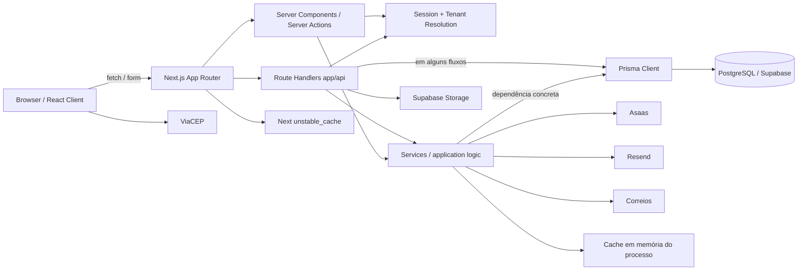

# Auditoria de Arquitetura e Estrutura — Etapa 01/15

**Data da análise:** 2026-09-25  
**Escopo:** arquitetura, estrutura, dependências, contratos, módulos, estados, testes e deploy  
**Repositório analisado:** estado local disponível na data acima  
**Regra desta etapa:** nenhum código de produto foi alterado; este relatório é o único artefato criado.

## 1. Resumo executivo

O sistema é um monólito full-stack em Next.js App Router, com React no frontend, Route Handlers e Server Components no backend, Prisma sobre PostgreSQL, sessão opaca própria persistida em banco, storage Supabase e integrações HTTP com Asaas, Resend, ViaCEP e Correios. Há uma tentativa de arquitetura em camadas e alguns contratos de porta/adaptador, especialmente em pagamento e frete, mas a direção das dependências não é aplicada de forma consistente: serviços dependem diretamente de Prisma e de tipos de apresentação, handlers acessam o banco diretamente e existem caminhos paralelos para as mesmas regras de negócio.

O estado inspecionado **não está apto para publicação**. Foram confirmados dois bloqueios imediatos: o checkout do navegador não alcança nem satisfaz o contrato da API existente; e o histórico de migrations não reconstrói o schema Prisma atual. Também há riscos críticos de perda financeira ou inconsistência por frete controlável pelo cliente, criação de pedido cross-tenant pelo fluxo alternativo de carrinho, webhook marcado como processado antes dos efeitos de domínio e transições concorrentes sem compare-and-set.

### Contagem de achados

| Severidade | Quantidade |
|---|---:|
| BLOCKER | 2 |
| CRITICAL | 4 |
| HIGH | 4 |
| MEDIUM | 3 |
| LOW | 0 |
| INFORMATIONAL | 0 |
| **Total** | **13** |

### Bloqueios de publicação

1. **ARCH-001:** checkout navegador → API está rompido em rota, payload e envelope de resposta.
2. **ARCH-002:** migrations versionadas não reproduzem o schema usado pelo código.
3. Antes de publicar, também devem ser tratados os achados críticos **ARCH-003 a ARCH-006**, pois afetam valor cobrado, isolamento de tenant, confirmação de pagamentos, estoque e pontos.

## 2. Metodologia e limites

### 2.1 Procedimento

- Leitura de `AGENTS.md`, `package.json`, lockfile, configurações TypeScript/Vitest/Next, documentação técnica e relatório arquitetural legado.
- Inventário de `app/`, `components/`, `hooks/`, `lib/`, `services/`, `store/`, `types/`, `prisma/`, `tests/`, scripts e workflow de CI.
- Rastreamento estático dos fluxos navegador → Route Handler/Server Component → guard/tenant → serviço → Prisma → PostgreSQL e serviços externos.
- Busca de imports de Prisma e de framework por camada, acessos diretos ao banco em controllers, dependências reversas e implementações duplicadas.
- Inspeção das máquinas de estado de pedido, pagamento, pontos e estoque, incluindo caminhos que contornam a função central de transição.
- Comparação do schema Prisma com todo o histórico SQL de migrations.
- Inspeção das suítes unitária, integração e carga e do que efetivamente é executado pela CI.
- Tentativa de executar verificações locais sem instalar dependências, acessar rede, banco real ou serviços externos.

### 2.2 Comandos reproduzíveis e resultados

| Comando/consulta | Resultado observado |
|---|---|
| `rg --files app components hooks lib services store types prisma tests .github` | Inventário de 72 arquivos TS/TSX em `app`, 76 em `components`, 38 em `lib`, 29 em `services` e 58 testes auxiliares/suítes. |
| `rg -n 'lib/prisma|PrismaClient' app components hooks services store lib` | Prisma é importado por quase todos os serviços e também por layouts, server actions e múltiplos Route Handlers. |
| `rg -n 'from .(next|react|react-dom|next/)' services lib store types` | Dependência de framework fora da apresentação, inclusive `services/loja.service.ts` → `next/cache`. |
| Busca de modelos/campos do schema em `prisma/migrations/**/*.sql` | `Brand`, `CategoryTag`, `JtExpressGeocom`, `JtExpressRate`, `SyncStatus` e vários campos usados pelo código não aparecem no histórico SQL. |
| Contagem `tests/**/*.test.ts` | 49 suítes unitárias, 3 de integração e 1 de carga. |
| `node --version` | `v24.16.0`. |
| `npm.cmd --version` | `11.13.0`. |
| `npm.cmd run test:unit` | Não executado: `vitest` ausente. |
| `npm.cmd run test:integration` | Não executado: `vitest` ausente. |
| `npm.cmd run lint` | Não executado: `eslint` ausente. |
| `npm.cmd run build` | Não executado: `prisma` ausente. |
| `git status --short` antes da escrita | Árvore limpa. |

### 2.3 Limitações

- `node_modules/` não existe. Por isso, os guias versionados de Next.js exigidos em `AGENTS.md` (`node_modules/next/dist/docs/`) não estavam disponíveis e os quality gates não puderam iniciar.
- Dependências não foram instaladas porque a etapa autoriza criar somente este relatório. Isso também evitou acesso de rede ou alterações massivas fora do artefato permitido.
- Nenhum banco de teste descartável, `TEST_DATABASE_URL` ou servidor local estava disponível. Concorrência e migrations foram avaliadas estaticamente; onde não houve execução real, a confiança foi marcada como `HIGH CONFIDENCE` ou `SUSPECTED`, não como prova dinâmica.
- Nenhuma chamada foi feita a Asaas, Resend, Supabase, ViaCEP, Correios ou qualquer serviço externo.
- Não foi possível confirmar configuração existente apenas na plataforma de deploy, agendadores externos, políticas RLS efetivamente aplicadas ou o schema do banco atualmente em produção.
- Não foram exibidos valores de segredo, credenciais ou dados pessoais encontrados na documentação/código.

## 3. Stack e topologia observadas

| Área | Implementação observada | Evidência principal |
|---|---|---|
| Runtime/framework | Node.js; Next.js 16.3.5, App Router, Route Handlers, Server Components | `package.json:35`, `package-lock.json:6727-6763`, `app/` |
| Frontend | React 18, Tailwind 3, Radix UI, Lucide, Sonner, React Hook Form | `package.json:20-43` |
| Estado cliente | Zustand para carrinho; estado local React no checkout/admin | `store/cart.store.ts:1-125`, `components/checkout/CheckoutForm.tsx` |
| Backend | Route Handlers em `app/api/**/route.ts`, Server Actions e serviços TypeScript | `app/api/`, `app/profile/actions.ts`, `services/` |
| Banco/ORM | PostgreSQL via Prisma 5.22; URLs de pool/direct connection | `prisma/schema.prisma:4-12`, `.env.example:8-11` |
| Autenticação | Sessão opaca própria, ID aleatório em cookie HTTP-only e tabela `Session`; Supabase Auth não participa do fluxo observado | `lib/session.ts:16-52,83-130`, `lib/auth/guards.ts:12-48` |
| Multi-tenancy | Tenant por host/subdomínio/custom domain; `lojaID` aplicado na aplicação | `lib/tenant.ts:25-152` |
| Cache | `unstable_cache` do Next para tenant e `Map` em memória para settings/dashboard/frete | `lib/tenant.ts:41-72`, `lib/cache.ts:14-113` |
| Rate limiting | `Map` em memória por processo | `lib/rate-limit.ts:8-89,138-166` |
| Storage | Supabase Storage com service role, feature gate para upload direto | `lib/supabase/storage.ts:18-78`, `app/api/upload/route.ts:18-25` |
| Pagamento | Porta `PaymentGateway`, adapter/client Asaas, campos de pagamento embutidos em `Order`, webhook HTTP | `types/payment-gateway.types.ts:106-126`, `services/asaas/`, `app/api/webhooks/asaas/route.ts` |
| E-mail | Porta própria; providers Resend e desenvolvimento | `lib/email/index.ts:11-38` |
| Frete | Orquestrador com J&T (tabelas locais), Correios HTTP, tabela local, retirada e sem frete | `services/freight/orchestrator.service.ts:17-141` |
| Filas/outbox | Não há broker, fila durável, job table ou outbox observável | busca no repositório; efeitos são síncronos ou fire-and-forget |
| Jobs | Endpoints HTTP protegidos por segredo para timeout de pedidos e expiração de pontos | `app/api/cron/**/route.ts` |
| Testes | Vitest: unitários majoritariamente mockados, integração com DB/servidor externos e carga | `vitest.config.ts`, `tests/` |
| CI | npm ci, Prisma validate, typecheck, apenas testes unitários e build | `.github/workflows/ci.yml:19-42` |
| Deploy | `output: 'standalone'`; nenhum Dockerfile, `vercel.json`, manifesto de runtime ou workflow de deploy versionado | `next.config.js`, inventário do repositório |

## 4. Fluxo arquitetural real



O desenho é de **monólito modular em camadas**, não de arquitetura hexagonal completa. Existe uma porta real para `PaymentGateway` e uma interface para provedores de frete, mas os casos de uso continuam acoplados a Prisma, singletons concretos e, em alguns casos, APIs do Next. O relatório legado declara separação rigorosa, porém o código não sustenta essa propriedade.

## 5. Mapa de módulos e responsabilidades

| Módulo | Entrada/apresentação | Aplicação/domínio | Infraestrutura/persistência | Avaliação |
|---|---|---|---|---|
| Product | catálogo, admin products, `/api/products` | `services/product.service.ts` | Prisma `Product`/`ProductVariants` | Existe; regras e persistência estão misturadas no serviço. |
| Brand/Categorias | home/filtros, `/api/brands` | `services/brand.service.ts` | Prisma `Brand`/`CategoryTag` | Existe no schema/código, mas não nas migrations versionadas. |
| Customer/Auth | login/register/profile/admin customers | `auth.service`, `customer.service`, guards/session | Prisma `User`/`Session`/`Address` | Autenticação própria; não usa Supabase Auth no fluxo real. |
| Cart | componentes + Zustand, `/api/cart` | `services/cart.service.ts` | Prisma `Cart`/`CartItem` | Persistente e autenticado, mas não vincula tenant na raiz do agregado. |
| Order | checkout, profile, admin, webhook e cron | `checkout.service`, `order.service`, `orders.service`, `admin.service` | Prisma `Order`/`OrderItem`/`AuditLog` | Fragmentado em caminhos com invariantes diferentes. |
| Payment | checkout/confirmation/webhook | porta `PaymentGateway`, adapter Asaas | HTTP Asaas + campos em `Order` + `PaymentWebhookEvent` | Não há agregado/tabela de pagamento nem inbox/outbox com estado de processamento. |
| Coupon | — | — | — | **Não aplicável:** nenhum modelo, serviço, rota ou teste de cupom foi encontrado. |
| Points | checkout, perfil, admin e cron | `services/loyalty.service.ts` | `LoyaltyWallet`/`LoyaltyTransaction` | Existe; saldo, ledger e expiração, com lacunas de idempotência e clawback. |
| Cashback | — | — | — | **Não aplicável:** o recurso implementado é pontos; não há saldo monetário de cashback. |
| Inventory | checkout/cancelamento | `InventoryService` | contadores em Product/Variant; `StockSyncLog` apenas no schema | Reserva/estorno existem; não há ledger de movimentos em uso. |
| Shipping | checkout, calculadora, admin freight | orquestrador/provedores | Correios HTTP e tabelas locais | Boa separação de providers, mas o fechamento aceita cotação manipulável. |
| Storage | upload/avatar | helper Supabase | Supabase Storage | Implementado e desabilitado por padrão fora de teste. |
| Queue/jobs | endpoints cron | serviços de varredura | nenhum scheduler/fila versionado | Não há fila; agenda externa não verificada. |

## 6. Máquinas de estado observadas

### 6.1 Pedido

FSM declarada em `lib/order-transitions.ts:1-20`:

```text
PENDING   -> PAID | CANCELLED
PAID      -> SHIPPED | CANCELLED
SHIPPED   -> DELIVERED
DELIVERED -> terminal
CANCELLED -> terminal

Exceção declarada: PAID -> DELIVERED para PICKUP/NONE
```

Na execução real, a exceção não chega ao validador porque `updateOrderStatus` não seleciona nem passa `deliveryType`. A confirmação pelo cliente executa update direto para `DELIVERED`, fora da FSM. `OrderStatusHistory` não recebe gravações no código de produção; o serviço central grava apenas `AuditLog`. Transições concorrentes não usam versão, lock explícito nem update condicional pelo status anterior.

### 6.2 Pagamento

Não existe FSM formal de pagamento. `asaasPaymentStatus` é `String?` em `Order` (`prisma/schema.prisma:280-293`), e eventos são mapeados assim:

| Evento Asaas | Estado de pedido aceito | Efeito observado |
|---|---|---|
| `PAYMENT_RECEIVED` / `PAYMENT_CONFIRMED` | `PENDING` | tenta `PAID` |
| os mesmos eventos | `CANCELLED` | mantém cancelado e tenta registrar alerta |
| `PAYMENT_REFUNDED` | `PAID` | tenta `CANCELLED` |
| `PAYMENT_OVERDUE` / `PAYMENT_DELETED` | `PENDING` | tenta `CANCELLED` |
| `PAYMENT_AWAITING_RISK_ANALYSIS` | qualquer | apenas nota administrativa |

Estados ilegais/não tratados: refund após `SHIPPED`/`DELIVERED`, confirmação após timeout com reconciliação automática, eventos falhos já marcados como processados e divergência entre `asaasPaymentStatus` e `Order.status`.

### 6.3 Pontos

Não há enum de estado da carteira. Os movimentos do ledger são `EARN`, `REDEEM`, `REFUND_EARN`, `REFUND_REDEEM`, `EXPIRATION` e `ADMIN_ADJUSTMENT` (`prisma/schema.prisma:417-424`). O fluxo observado é:

```text
checkout PENDING: REDEEM (débito imediato)
pedido PAID: EARN (crédito imediato)
cancelamento: REFUND_EARN e/ou REFUND_REDEEM
cron: EXPIRATION
admin: ADMIN_ADJUSTMENT
```

`pending` existe na carteira, mas só é inicializado/lido; não há transição que o use. Não há unicidade por `(orderId, type)` e o clawback de `EARN` pode levar o saldo abaixo de zero se os pontos já tiverem sido gastos.

### 6.4 Estoque

```text
disponível -> reservado no checkout/PENDING -> confirmado implicitamente em PAID
reservado -> restaurado em CANCELLED (quando origem era PENDING ou PAID)
```

O estoque é representado por contadores em produto e variante. Há constraints SQL de não negatividade para esses contadores, e a reserva ocorre dentro da transação do pedido. Porém, cancelamentos concorrentes podem restaurar mais de uma vez. `StockSyncLog` está apenas no schema e não é gravado por serviço algum, logo não funciona como ledger de inventário.

## 7. Achados

### ARCH-001 — Checkout navegador → API está integralmente incompatível

- **Severidade:** BLOCKER
- **Confiança:** CONFIRMED
- **Arquivo e linhas:** `components/checkout/CheckoutForm.tsx:397-437`; `lib/validators/checkout.validators.ts:24-45,87-108`; `app/api/checkout/route.ts:10-118`; `lib/api-response.ts:3-5`; `app/checkout/page.tsx:90-123`.
- **Fluxo e condição de manifestação:** qualquer tentativa de finalizar uma compra pela tela `/checkout`.
- **Evidência observada:** o cliente chama `POST /api/checkout/create-order`, mas só existe `app/api/checkout/route.ts`, que publica `/api/checkout`. O cliente envia `customerName/customerEmail/customerPhone/customerCpfCnpj`, `cardData` e itens com `productID`; o schema exige `customer`, `creditCard` e `productId`. Mesmo que rota e payload fossem ajustados, a API responde `{ success, data: { success, order } }`, enquanto o cliente passa o envelope inteiro para `onOrderCreated` e a página lê campos no nível raiz.
- **Impacto:** o fluxo comercial principal retorna 404 ou 400 e não consegue chegar à confirmação/pagamento. Ajustar apenas um dos três pontos ainda deixa o checkout quebrado.
- **Correção proposta:** definir um único contrato compartilhado e versionado para request/response; fazer a UI chamar `/api/checkout`; mapear diretamente `CartItemType.productID/variantID` para o DTO canônico; eliminar envelope duplicado; derivar tipos do schema sem `as any` na página.
- **Teste de regressão:** teste E2E real do navegador adicionando item, calculando frete e concluindo PIX/cartão/boleto; contract test importando o handler real e validando o payload produzido por `CheckoutForm`; assert de redirecionamento e conteúdo de `sessionStorage`.
- **Risco residual:** integrações externas ainda exigem sandbox e reconciliação; um teste mockado isolado não valida roteamento App Router nem serialização no navegador.

### ARCH-002 — Histórico de migrations não reconstrói o schema atual

- **Severidade:** BLOCKER
- **Confiança:** CONFIRMED
- **Arquivo e linhas:** `prisma/schema.prisma:14-61,121-176,250-330,397-413,469-562`; `prisma/migrations/20260513203715_/migration.sql:18-58`; `prisma/migrations/20260522000000_monetary_decimal_and_check_constraints/migration.sql:6-15`; `prisma/migrations/20260916000000_add_asaas_and_delivery_confirmation/migration.sql:1-30`; `.github/workflows/ci.yml:29-42`.
- **Fluxo e condição de manifestação:** provisionamento de banco novo, disaster recovery, ambiente efêmero de CI/staging ou execução de `prisma migrate deploy` desde zero.
- **Evidência observada:** não há SQL versionado para modelos `Brand`, `CategoryTag`, `ProductCategoryTag`, `JtExpressGeocom`, `JtExpressRate` e `StockSyncLog`, nem para vários campos de Loja/Product/Order e enum `SyncStatus`. `DeliveryType` foi criado apenas com `DELIVERY` e `PICKUP`, enquanto o schema usa também `NONE`. A migration converte `Cart.shippingCost` para `DECIMAL(10,2)`, mas o schema atual declara `Float?`. A CI executa apenas `prisma validate`, que valida o arquivo de schema e não aplica o histórico em banco vazio.
- **Impacto:** um deploy limpo pode compilar o client Prisma, porém falhar em runtime com tabelas/colunas/enum ausentes; recuperação e escala horizontal deixam de ser reproduzíveis.
- **Correção proposta:** gerar e revisar migration de reconciliação completa (ou baseline formal, caso o banco já exista), incluindo dados/backfill e constraints; resolver o tipo de `Cart.shippingCost`; executar `prisma migrate deploy` em PostgreSQL efêmero e comparar schema gerado (`migrate diff`) na CI.
- **Teste de regressão:** subir PostgreSQL vazio, aplicar exclusivamente as migrations versionadas, rodar `prisma migrate status`, `prisma validate`, seed mínimo e smoke tests de catálogo, frete, checkout, loyalty e webhook.
- **Risco residual:** uma baseline correta não prova compatibilidade com dados existentes; o rollout precisa ensaiar cópia anonimizada ou estrutura equivalente e plano de rollback.

### ARCH-003 — Frete final pode ser definido pelo cliente

- **Severidade:** CRITICAL
- **Confiança:** CONFIRMED
- **Arquivo e linhas:** `app/api/freight/calculate/route.ts:7-24,56-63,88-117`; `components/checkout/CheckoutForm.tsx:397-430`; `services/checkout.service.ts:345-386`.
- **Fluxo e condição de manifestação:** entrega para cidade sem `FreightRule` local, especialmente cotação Correios/J&T; cliente altera request ou valores usados pela calculadora.
- **Evidência observada:** a API de cotação aceita `lojaID`, preço, peso e dimensões do body e preserva valores enviados com `??` mesmo quando o produto existe. No fechamento, se não houver regra local, `createOrder` aceita `shippingCost` ou `freightValue` enviados pelo cliente e não recalcula/não valida `shippingProvider`/serviço contra uma cotação autoritativa.
- **Impacto:** frete pode ser reduzido a zero ou subcotado, gerando perda financeira e promessa logística incoerente. O comentário de checkout “autoritativo” não corresponde ao fluxo real.
- **Correção proposta:** receber apenas IDs/quantidades/CEP; carregar preço/dimensões/tenant do banco; recalcular no backend no momento da compra ou emitir `quoteId` assinado, curto e persistido contendo tenant, itens, CEP, provider, preço e expiração; rejeitar modalidade/serviço não habilitado.
- **Teste de regressão:** integração com banco em que body envia peso/preço/frete zero para produto real; confirmar que total usa dados oficiais e quote válida; testar troca de tenant, CEP, itens, provider e quote expirada.
- **Risco residual:** tarifas externas podem mudar entre cotação e fechamento; a política de validade e absorção de diferença deve ser explícita.

### ARCH-004 — Fluxo alternativo de carrinho permite pedido cross-tenant e contorna invariantes

- **Severidade:** CRITICAL
- **Confiança:** CONFIRMED
- **Arquivo e linhas:** `app/api/cart/route.ts:18-50`; `services/cart.service.ts:63-147`; `app/api/orders/route.ts:14-57`; `services/order.service.ts:17-108`.
- **Fluxo e condição de manifestação:** usuário autenticado de uma loja conhece um `productID/variantID` de outra loja, começa com carrinho vazio e usa `/api/cart` seguido de `/api/orders`.
- **Evidência observada:** `/api/cart` exige autenticação, mas não resolve/valida tenant. `addToCart` aceita o primeiro produto de qualquer loja e só impede misturar lojas após já haver item. `/api/orders` escolhe `lojaID` do host/sessão, mas `createOrderFromCart` valida apenas posse do carrinho/endereço; não valida que itens pertencem ao mesmo tenant informado. Em seguida decrementa o estoque dos produtos e cria o pedido com o `lojaID` recebido. Esse caminho também usa preço/frete snapshot do carrinho e não aplica pagamento, idempotência ou loyalty do checkout canônico.
- **Impacto:** alteração de estoque entre tenants, pedido associado à loja errada e desvio das regras financeiras/pagamento/pontos.
- **Correção proposta:** colocar `lojaID` em `Cart` e em todas as consultas do agregado; validar usuário, cart, address, product e variant contra o mesmo tenant dentro de uma única transação; desativar/remover o endpoint alternativo ou fazê-lo delegar ao mesmo caso de uso canônico do checkout.
- **Teste de regressão:** integração com duas lojas reais no mesmo banco; tentar adicionar produto B no host/sessão A e criar pedido A com cart B; verificar 404/403 e nenhuma mutação em estoque/pedido/carrinho.
- **Risco residual:** isolamento só na aplicação continua vulnerável a novas consultas sem filtro; considerar chaves compostas/constraints e estratégia RLS verificável.

### ARCH-005 — Webhook é marcado como processado antes dos efeitos de domínio

- **Severidade:** CRITICAL
- **Confiança:** CONFIRMED
- **Arquivo e linhas:** `app/api/webhooks/asaas/route.ts:133-169,171-239,341-349`; `prisma/schema.prisma:552-562`.
- **Fluxo e condição de manifestação:** falha de banco, FK/auditoria, transição, timeout ou processo interrompido após criar `PaymentWebhookEvent` e antes de concluir a atualização do pedido.
- **Evidência observada:** o handler insere o evento “idempotente” antes de localizar/atualizar o pedido e executar `updateOrderStatus`. Qualquer retry encontra `eventId` e retorna `ALREADY_PROCESSED`, embora o modelo não tenha status, tentativas, erro ou payload processado. `processedAt` é preenchido na recepção, não na conclusão.
- **Impacto:** pagamento confirmado no gateway pode permanecer `PENDING`, sem crédito de pontos/e-mail, ou evento de refund/expiração pode ser perdido permanentemente.
- **Correção proposta:** implementar inbox durável com `RECEIVED/PROCESSING/PROCESSED/FAILED`, `attempts`, `lastError` e timestamps; executar claim condicional e efeitos locais transacionais; somente marcar `PROCESSED` após sucesso; permitir retry de falhas e reconciliação por `asaasPaymentId/externalReference`.
- **Teste de regressão:** injetar falha após criação do inbox e antes/depois da transição; reenviar o mesmo evento e provar processamento único concluído; testar duas entregas concorrentes do mesmo `eventId`.
- **Risco residual:** side effects externos, como e-mail, ainda precisam de outbox própria para entrega ao menos uma vez com consumidor idempotente.

### ARCH-006 — Transições concorrentes não são atômicas e podem duplicar estoque/pontos

- **Severidade:** CRITICAL
- **Confiança:** HIGH CONFIDENCE
- **Arquivo e linhas:** `services/order.service.ts:265-310,312-356,359-413`; `services/loyalty.service.ts:304-369,445-529`; `prisma/schema.prisma:446-467`.
- **Fluxo e condição de manifestação:** webhook, cron, admin ou retry processam o mesmo pedido simultaneamente partindo do mesmo status observado.
- **Evidência observada:** `updateOrderStatus` lê `fullOrder` fora da transação; dentro dela faz `order.update({ where: { id } })`, sem condição `status = estadoAnterior` nem versão. Duas chamadas podem validar o mesmo `PENDING` e ambas executar `PAID`/crédito, ou ambas cancelar/restaurar estoque. O ledger não possui unicidade por pedido/tipo; refunds também selecionam o primeiro movimento sem impedir repetição. Testes denominados de concorrência simulam atomicidade em mocks, não no PostgreSQL.
- **Impacto:** estoque inflado, pontos duplicados/estornados mais de uma vez, auditoria duplicada e resultado dependente da ordem entre timeout, pagamento e operação administrativa.
- **Correção proposta:** claim por compare-and-set (`updateMany` com `id + status`, validando `count=1`) ou lock de linha dentro da mesma transação; chave de idempotência por comando/evento; constraints únicas adequadas no ledger, por exemplo chave de origem/movimento, sem impedir ajustes legítimos.
- **Teste de regressão:** teste concorrente real em PostgreSQL com `Promise.all` para dois `PAID`, dois `CANCELLED` e corrida `PAID` versus `CANCELLED`; afirmar uma única transição, um único movimento de loyalty e estoque exatamente uma vez.
- **Risco residual:** compare-and-set resolve concorrência local, mas eventos externos fora de ordem ainda exigem regras de reconciliação explícitas.

### ARCH-007 — Checkout distribuído não possui saga/outbox recuperável e a idempotência retorna cedo demais

- **Severidade:** HIGH
- **Confiança:** HIGH CONFIDENCE
- **Arquivo e linhas:** `services/checkout.service.ts:115-168,410-478,480-520,522-665`; `prisma/schema.prisma:309`; `app/api/checkout/route.ts:84-94`.
- **Fluxo e condição de manifestação:** processo cai após commit do pedido/estoque e antes da cobrança; timeout do gateway após a cobrança ter sido aceita; retry com a mesma chave; reutilização da chave entre tenant/usuário.
- **Evidência observada:** pedido, reserva e pontos são commitados antes da chamada Asaas. Ao encontrar `idempotencyKey`, o método retorna imediatamente sem verificar/criar/reconciliar a cobrança. A chave é única global, e a busca não confere `lojaID` ou usuário. Em erro do gateway há compensação best-effort; um timeout ambíguo pode cancelar localmente uma cobrança aceita externamente.
- **Impacto:** pedido reservado sem cobrança, resposta de retry sem dados de pagamento, pagamento capturado para pedido cancelado ou possível exposição cruzada por colisão/reuso de chave.
- **Correção proposta:** modelar saga de checkout/payment attempt com estados duráveis (`ORDER_CREATED`, `CHARGE_REQUESTED`, `CHARGE_CREATED`, `FAILED`, `RECONCILIATION_REQUIRED`); escopar idempotência por tenant/usuário/operação; usar idempotência do provedor quando disponível; worker/reconciliador retomar etapas incompletas.
- **Teste de regressão:** fault injection em cada fronteira de commit/chamada/update; retry da mesma chave deve continuar a etapa pendente sem nova reserva/cobrança; chave igual em tenants distintos não pode devolver pedido alheio.
- **Risco residual:** não há transação ACID entre banco e gateway; o desenho precisa assumir entrega ao menos uma vez e reconciliação operacional.

### ARCH-008 — FSM de pedido, histórico e tracking têm múltiplas fontes de verdade

- **Severidade:** HIGH
- **Confiança:** CONFIRMED
- **Arquivo e linhas:** `lib/order-transitions.ts:3-20`; `services/order.service.ts:268-295`; `services/admin.service.ts:24-32`; `components/admin/orders/OrderStatusManager.tsx:23-29,69-77`; `app/api/orders/[id]/confirm-delivery/route.ts:41-107`; `app/api/admin/orders/[orderId]/status/route.ts:14-35`; `lib/validators/order.validators.ts:15-17`.
- **Fluxo e condição de manifestação:** retirada/sem frete indo de pago a entregue; admin informa tracking ao marcar envio; consulta de timeline/auditoria.
- **Evidência observada:** há tabelas de transição duplicadas no domínio, serviço admin e UI. A exceção `PAID -> DELIVERED` depende de `deliveryType`, mas o serviço não o seleciona nem passa ao validador. A confirmação do cliente contorna o serviço e atualiza o status diretamente. O UI envia `trackingCode` junto com `newStatus`, mas o schema da rota o remove e o serviço não o grava. Não há qualquer `orderStatusHistory.create` no código de produção, embora a tabela seja lida na tela admin e testes de integração esperem registros.
- **Impacto:** comportamento divergente entre canais, tracking perdido ao marcar despacho, timeline vazia e futuras regras aplicadas apenas em alguns endpoints.
- **Correção proposta:** uma única máquina de estado no domínio, recebendo snapshot necessário e executando transição/histórico/efeitos numa transação; todos os endpoints delegam a ela; tracking deve ser comando separado atômico ou parte explícita do comando `SHIP`.
- **Teste de regressão:** matriz de todos os estados por delivery type via API admin, confirmação do cliente e webhook; afirmar histórico imutável com ator/origem; `SHIPPED` exige/persiste tracking conforme regra definida.
- **Risco residual:** mudanças de regra precisarão versionar transições e preservar semântica histórica dos pedidos existentes.

### ARCH-009 — Clawback e idempotência do ledger de pontos não preservam saldo

- **Severidade:** HIGH
- **Confiança:** CONFIRMED
- **Arquivo e linhas:** `prisma/schema.prisma:426-467`; `services/loyalty.service.ts:304-369,445-520`; `prisma/migrations/20260831000000_add_loyalty_engine/migration.sql:36-84`.
- **Fluxo e condição de manifestação:** pedido pago credita pontos; cliente gasta esses pontos; o pedido original é cancelado. Também se manifesta em retry/concorrência de crédito ou refund.
- **Evidência observada:** `creditEarnedPoints` disponibiliza os pontos diretamente em `balance`; `pending` nunca é usado além de inicialização/leitura. `refundOrderPoints` decrementa todo o `EARN` sem testar saldo atual, podendo torná-lo negativo. Não há CHECK de saldo não negativo nem unicidade que impeça mais de um `EARN/REFUND_*` para a mesma origem.
- **Impacto:** carteira negativa ou ledger duplicado, desconto futuro inconsistente e dificuldade de conciliação financeira.
- **Correção proposta:** definir política explícita: vesting em `pending` até janela de devolução, dívida controlada em campo separado, ou clawback limitado com cobrança operacional; adicionar chave idempotente de movimento/origem e invariantes de banco compatíveis com a política.
- **Teste de regressão:** cenário pago → crédito → resgate em outro pedido → cancelamento do original; retries do mesmo evento; cancelamentos concorrentes; conferir saldo, pending, lifetime e soma do ledger.
- **Risco residual:** expiração e refunds fora de ordem exigem algoritmo contábil documentado; apenas um CHECK não resolve a semântica.

### ARCH-010 — Separação em camadas é nominal e favorece desvio de invariantes

- **Severidade:** MEDIUM
- **Confiança:** CONFIRMED
- **Arquivo e linhas:** `services/orders.service.ts:1-4`; `services/loja.service.ts:1-3`; `app/admin/layout.tsx:1-18,35-46`; `app/api/admin/loyalty/reports/route.ts:1-61`; `app/api/freight/calculate/route.ts:1-5,65-84`; `lib/services/*.service.ts`.
- **Fluxo e condição de manifestação:** evolução/manutenção de qualquer módulo, especialmente Order, Loyalty, Freight e Loja.
- **Evidência observada:** serviços importam Prisma diretamente; `orders.service` importa tipo de `app/profile` (dependência da aplicação para apresentação); `loja.service` depende de `next/cache`; layouts e handlers acessam Prisma; existem serviços duplicados (`order`/`orders`, customer em `services` e reexports deprecated em `lib/services`) e controllers com regra/query própria.
- **Impacto:** regras não têm um único ponto de entrada, testes dependem de mocks estruturais frágeis e correções em um caminho não protegem os demais — causa arquitetural direta de ARCH-003, ARCH-004 e ARCH-008.
- **Correção proposta:** organizar por módulo/feature com casos de uso explícitos; portas de repositório/gateway no núcleo; adapters Prisma/Next na borda; DTOs fora de `app`; composition root para injeção; remover shims e caminhos duplicados após migração.
- **Teste de regressão:** testes de arquitetura com regras de imports (por exemplo, serviço/domínio não pode importar `app`, `next/*` ou adapter concreto) e contract tests por porta.
- **Risco residual:** abstrair cada query simples aumenta cerimônia; aplicar portas primeiro nos agregados com invariantes e integrações externas.

### ARCH-011 — Cache e rate limiting locais não suportam o modelo horizontal declarado

- **Severidade:** MEDIUM
- **Confiança:** HIGH CONFIDENCE
- **Arquivo e linhas:** `lib/cache.ts:14-25,40-113`; `lib/rate-limit.ts:8-35,45-89`; `services/freight/orchestrator.service.ts:71-128`; `RELATORIO_ARQUITETURAL.txt:243-246`.
- **Fluxo e condição de manifestação:** duas ou mais instâncias, serverless cold starts, reinícios ou autoscaling.
- **Evidência observada:** cache e contadores de rate limit vivem em `Map` por processo; invalidar em uma instância não invalida as demais. Timers de limpeza dependem da vida do processo. O relatório legado declara escalabilidade horizontal/serverless como evolução suave, mas a semântica atual muda nesse cenário.
- **Impacto:** configurações/frete/dashboard podem divergir entre instâncias e limites podem ser multiplicados pelo número de réplicas; reinício zera proteção e cache.
- **Correção proposta:** para dados críticos, cache compartilhado ou cache do framework com tags consistentes; rate limiter atômico compartilhado/edge; tornar o fallback local explicitamente apenas desenvolvimento/single-instance.
- **Teste de regressão:** teste com duas instâncias apontando ao mesmo backend de cache: invalidar em A e ler em B; exceder limite alternando instâncias; testar cold start.
- **Risco residual:** indisponibilidade do cache exige política fail-open/fail-closed por endpoint e métricas operacionais.

### ARCH-012 — Quality gates não cobrem os fluxos e o banco que mais importam

- **Severidade:** HIGH
- **Confiança:** CONFIRMED
- **Arquivo e linhas:** `package.json:5-15`; `.github/workflows/ci.yml:29-42`; `vitest.config.ts:4-10`; `tests/integration/status-transitions.test.ts:24-47`; `app/api/admin/orders/[orderId]/status/route.ts:14-20`; `tests/unit/loyalty-security-concurrency.test.ts:7-45,54-115`.
- **Fluxo e condição de manifestação:** pull request/deploy contendo drift de rota, migration, concorrência ou integração navegador/API.
- **Evidência observada:** a CI executa `npm test`, que aponta apenas para `tests/unit`; não há PostgreSQL service, `migrate deploy`, integration/load ou E2E. Testes de integração estão defasados: enviam `toStatus` enquanto a rota exige `newStatus` e esperam `OrderStatusHistory`, que o código não grava. Testes unitários de concorrência mockam Prisma e implementam no mock a atomicidade que deveriam provar no banco.
- **Impacto:** a pipeline pode ficar verde mesmo com ARCH-001, ARCH-002, ARCH-005 e ARCH-006; a nomenclatura “Quality Gates & Security Pipeline” transmite garantia maior que a verificada.
- **Correção proposta:** matriz CI com banco PostgreSQL efêmero, migrations do zero, testes unitários, integração real e E2E mínimo de checkout; testes de concorrência sem mocks; exigir todos os jobs antes do merge.
- **Teste de regressão:** introduzir propositalmente drift de migration, rota de checkout errada e transição duplicada em branch de teste; cada falha deve derrubar um gate específico.
- **Risco residual:** testes externos podem ser instáveis; separar contract tests determinísticos de smoke tests de sandbox e usar retries controlados apenas na borda.

### ARCH-013 — Jobs periódicos e efeitos assíncronos não têm execução durável versionada

- **Severidade:** MEDIUM
- **Confiança:** SUSPECTED
- **Arquivo e linhas:** `app/api/cron/orders-timeout/route.ts:66-119`; `app/api/cron/loyalty-expiration/route.ts:66-135`; `services/order-timeout.service.ts:51-145`; `services/loyalty.service.ts:768-828`; `app/api/webhooks/asaas/route.ts:241-247`; inventário de arquivos de deploy.
- **Fluxo e condição de manifestação:** produção sem scheduler externo corretamente configurado; muitos wallets; término de função serverless após responder ao webhook.
- **Evidência observada:** existem endpoints cron, mas não há `vercel.json`, workflow `schedule`, manifesto ou IaC no repositório que os acione. A expiração carrega todas as carteiras com saldo sem paginação. O e-mail pós-pagamento é disparado por promessa não aguardada e não há fila/outbox.
- **Impacto:** pedidos podem não expirar, estoque/pontos ficarem presos, expiração exceder limite de execução e e-mails serem perdidos. A ausência de configuração no repositório não prova que não exista scheduler fora dele, por isso a confiança é `SUSPECTED`.
- **Correção proposta:** versionar scheduler/IaC e ownership operacional; paginar/claimar lotes com cursor e lock; usar outbox + worker para e-mail e demais efeitos; dashboards/alertas de atraso e dead-letter.
- **Teste de regressão:** ambiente efêmero que instala agenda, executa job com múltiplos lotes e simula interrupção/retry; provar retomada sem duplicação; teste de e-mail a partir da outbox.
- **Risco residual:** serviços gerenciados e configurações fora do repo precisam de auditoria separada de ambiente/deploy.

## 8. Dívida técnica priorizada

1. **P0 — Restaurar um único checkout executável:** contrato compartilhado, rota correta, resposta única e E2E.
2. **P0 — Tornar banco reproduzível:** migration/baseline completa e gate em PostgreSQL vazio.
3. **P0 — Fechar invariantes financeiras/tenant:** frete autoritativo e unificação do caminho de pedido/carrinho.
4. **P0 — Processamento idempotente real:** inbox de webhook e compare-and-set da FSM.
5. **P1 — Saga de pagamento e outbox:** retomada de charge, reconciliação e side effects duráveis.
6. **P1 — Consolidar Order/Inventory/Loyalty:** uma única FSM, histórico e chaves idempotentes de ledger.
7. **P1 — CI realista:** migrations, integração, concorrência e E2E.
8. **P2 — Modularização:** fronteiras por feature, portas nos agregados críticos e remoção de serviços duplicados.
9. **P2 — Operação horizontal:** cache/rate limit compartilhados e agendadores versionados/observáveis.

## 9. Itens não aplicáveis ou não verificados

- **Arquitetura hexagonal declarada:** não aplicável como conformidade global. Há referências a Clean Architecture/DIP em comentários e uma porta de pagamento, mas a documentação principal declara arquitetura em camadas. A direção hexagonal não é sustentada no restante do código.
- **Coupon:** não aplicável; não encontrado.
- **Cashback monetário:** não aplicável; somente pontos foram encontrados.
- **Fila/message broker:** não aplicável ao estado atual; nenhum foi encontrado.
- **Supabase Auth:** não participa do fluxo de autenticação observado; o pacote SSR existe, mas sessão real é Prisma/cookie próprio.
- **Nuvemshop/ERP:** somente campos no schema e referências de UI/scripts; não há adapter, webhook ou sincronizador implementado. `StockSyncLog` também não é usado.
- **RLS em produção:** não verificado. Existe SQL avulso `prisma/migrations/supabase_rls_hardening.sql`, mas ele não está em uma pasta de migration Prisma e não há evidência local de aplicação.
- **Deploy e cron externos:** não verificados fora do repositório.
- **Comportamento específico de Next.js 16:** não verificado além do código/lockfile, pois os docs locais obrigatórios e o pacote instalado não estavam presentes.

## 10. Riscos residuais e verificações pendentes

Mesmo após os P0, permanecerão riscos que exigem etapas posteriores ou ambiente controlado:

- aplicar migrations do zero e sobre snapshot estrutural compatível com produção;
- rodar lint, typecheck, 49 suítes unitárias, 3 de integração, 1 de carga e build após instalação reprodutível;
- executar checkout E2E em sandbox Asaas para PIX, cartão, boleto, timeout, refund e eventos fora de ordem;
- validar concorrência real em PostgreSQL para estoque, pedido, webhook e loyalty;
- confirmar scheduler, runtime, número de réplicas, limites serverless e política de retry no ambiente de deploy;
- confirmar RLS/permissões do banco e políticas/buckets do Supabase Storage;
- revisar observabilidade e tratamento de dados pessoais em etapa de segurança/privacidade, sem expor valores reais;
- validar recuperação de desastre e reconciliação entre Asaas e pedidos locais.

## 11. Conclusão limitada ao escopo

A base possui módulos reconhecíveis, validação de entrada, tentativas de isolamento multi-tenant, transações locais, providers de frete e uma porta de pagamento. Contudo, a arquitetura efetiva é um monólito acoplado à persistência/framework, com regras duplicadas e múltiplos caminhos para os mesmos agregados. As falhas encontradas não são apenas ausência de testes: há incompatibilidades e desvios observáveis no código que impedem o checkout e tornam banco, pagamentos, estoque, pontos e tenant inconsistentes sob fluxos reais ou concorrentes.

**Decisão desta etapa:** publicação bloqueada até correção e verificação dos achados BLOCKER e CRITICAL. Nenhuma conclusão é emitida sobre etapas de auditoria posteriores.
