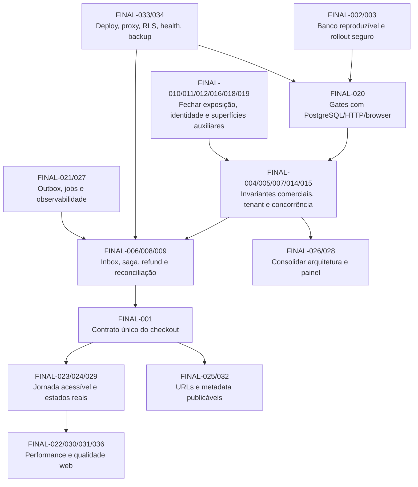

# Auditoria de Consolidação Final

**Etapa:** 15/15  
**Relatório:** `docs/audits/FINAL-AUDIT.md`  
**Revisão consolidada:** `0c7ef7d`  
**Data:** 2026-09-26  
**Escopo:** consolidação das auditorias 01–14 e revalidação amostral no repositório local  
**Publication Status:** **BLOCKED**

## 1. Resumo executivo

Os 14 relatórios obrigatórios existem e foram lidos. Eles contêm **198 IDs de origem**, somando **7 BLOCKER, 28 CRITICAL, 85 HIGH, 70 MEDIUM, 7 LOW e 1 INFORMATIONAL**. Essa soma não representa 198 defeitos independentes: as etapas observaram repetidamente os mesmos fluxos sob ângulos diferentes. A consolidação agrupa os IDs em **36 causas/riscos consolidados**, sem eliminar os IDs originais: **2 BLOCKER, 11 CRITICAL, 18 HIGH, 4 MEDIUM e 1 LOW**.

O veredito é **BLOCKED**. Dois impedimentos são diretos e reproduzíveis no código versionado:

1. o checkout do navegador chama uma rota inexistente e usa DTO/envelope incompatíveis com a API real;
2. o histórico de migrations não reconstrói o schema Prisma canônico.

Onze grupos CRITICAL adicionam risco de cobrança, perda de integridade, tomada de conta, vazamento de credenciais, cancelamento sem reembolso e destruição acidental de banco de testes. Em particular, continuam confirmados por amostragem direta: frete/valores parcialmente controláveis fora de uma autoridade única, caminho alternativo de pedido, evento de webhook consumido antes dos efeitos, transições sem compare-and-set, restauração de estoque com exceções suprimidas, configuração secreta devolvida por APIs públicas, checkout convidado que reutiliza conta por e-mail, reset baseado em `Origin`/`Referer`, cancelamento de pedido pago sem refund e cleanup que aceita uma URL apenas por conter `test`.

Há controles positivos: sessão opaca com cookie defensivo, guards administrativos no servidor, validação Zod em rotas centrais, preço relido no checkout canônico, reserva local transacional, Prisma sem SQL raw encontrado, autenticação fail-closed de webhook/cron reais, alguns headers defensivos, logging estruturado parcial e integridade no lockfile. Eles reduzem superfícies específicas, mas não fecham as cadeias críticas banco → gateway → webhook → pedido → estoque → pontos.

Nenhum fluxo da aplicação foi validado dinamicamente nesta consolidação. `node_modules` e `.next` não existem; testes, lint e build registrados nas etapas anteriores falharam antes de iniciar (`vitest`, `eslint` e `prisma` indisponíveis). Não houve conexão a banco, chamada a serviço externo, leitura de segredo ou acesso a produção. O status é fundamentado principalmente em inspeção estática e em verificações locais somente leitura.

## 2. Pré-requisito dos 14 relatórios

Todos os relatórios exigidos estão presentes; portanto, o veredito não foi interrompido.

| Etapa | Relatório | Achados de origem | B | C | H | M | L | I |
|---:|---|---:|---:|---:|---:|---:|---:|---:|
| 01 | `ARCHITECTURE-AUDIT.md` | 13 | 2 | 4 | 4 | 3 | 0 | 0 |
| 02 | `DATABASE-AUDIT.md` | 17 | 1 | 4 | 6 | 6 | 0 | 0 |
| 03 | `BACKEND-AUDIT.md` | 17 | 1 | 5 | 6 | 5 | 0 | 0 |
| 04 | `COMMERCE-TRANSACTIONS-AUDIT.md` | 16 | 1 | 5 | 9 | 1 | 0 | 0 |
| 05 | `AUTH-AUDIT.md` | 15 | 0 | 3 | 10 | 2 | 0 | 0 |
| 06 | `SECURITY-AUDIT.md` | 21 | 0 | 3 | 13 | 5 | 0 | 0 |
| 07 | `FRONTEND-UX-AUDIT.md` | 15 | 1 | 0 | 5 | 6 | 2 | 1 |
| 08 | `PERFORMANCE-AUDIT.md` | 10 | 0 | 0 | 5 | 5 | 0 | 0 |
| 09 | `TESTING-AUDIT.md` | 10 | 0 | 1 | 4 | 5 | 0 | 0 |
| 10 | `CODE-QUALITY-AUDIT.md` | 11 | 0 | 0 | 1 | 7 | 3 | 0 |
| 11 | `INFRASTRUCTURE-AUDIT.md` | 14 | 1 | 1 | 6 | 6 | 0 | 0 |
| 12 | `OBSERVABILITY-AUDIT.md` | 14 | 0 | 1 | 4 | 8 | 1 | 0 |
| 13 | `ADMIN-AUDIT.md` | 12 | 0 | 1 | 6 | 5 | 0 | 0 |
| 14 | `WEB-QUALITY-AUDIT.md` | 13 | 0 | 0 | 6 | 6 | 1 | 0 |
| **Total bruto** |  | **198** | **7** | **28** | **85** | **70** | **7** | **1** |

Os hashes SHA-256 completos foram calculados localmente com `Get-FileHash`; os prefixos para identificação do conjunto lido são: `25936879880f` arquitetura, `d30d0d4bdd2b` banco, `588e0c48de9d` backend, `cdb75e7a3ff9` transações, `0f74ab2c978d` auth, `5e42b5acd6f9` segurança, `24c0f52bae8b` frontend, `7de0dbd6c338` performance, `09edf2bcbabd` testes, `d979633c5d05` qualidade, `75ccd8504b25` infraestrutura, `75898f9d2adf` observabilidade, `bef8498fc8b2` admin e `d79b10ceb4c3` web.

## 3. Metodologia de consolidação

1. Confirmar presença e integridade legível dos 14 relatórios.
2. Extrair títulos, severidade, confiança, arquivos/linhas, publication blockers, lacunas e riscos residuais de todos os 198 IDs.
3. Agrupar duplicatas por fluxo, condição de manifestação e causa raiz — não apenas por palavras semelhantes.
4. Manter cada ID de origem no grupo consolidado; o apêndice fornece cobertura completa.
5. Revalidar no código uma amostra dos bloqueios e dos grupos de maior risco.
6. Usar a maior severidade confirmada entre duplicatas, salvo contradição observada. Nenhuma contradição que removesse um bloqueio foi encontrada.
7. Separar fato observado de hipótese de runtime/infraestrutura e não transformar ausência de teste em vulnerabilidade comprovada.

### 3.1 Comandos e resultados reproduzíveis

| Verificação | Resultado |
|---|---|
| `Get-ChildItem docs/audits -Filter *-AUDIT.md` + lista exigida | 14/14 relatórios presentes. |
| Parser local de headings `ARCH-001...WEB-013` e campos de severidade/confiança | 198 IDs; 164 CONFIRMED, 28 HIGH CONFIDENCE, 4 SUSPECTED e 2 NOT VERIFIED. |
| `Get-FileHash -Algorithm SHA256 docs/audits/*-AUDIT.md` | conjunto identificado na seção 2. |
| Busca de contrato em `CheckoutForm`, validator e route | UI usa `/api/checkout/create-order`, campos flat e `cardData/productID`; API existente é `/api/checkout` e exige `customer/creditCard/productId`. |
| Comparação somente leitura `model` × `CREATE TABLE` | 22 modelos e 16 tabelas criadas; seis modelos sem migration versionada. |
| Leitura de webhook, pedido e inventário | evento criado antes dos efeitos; status atualizado por `id` sem compare-and-set; restore captura e ignora erro. |
| Leitura de checkout, reset, produto/loja pública e admin status | impersonação por e-mail, origem de reset controlável, DTOs públicos com segredo e cancelamento sem refund confirmados. |
| Leitura de `tests/setup/db.ts` | allowlist aceita substring `test`; cleanup executa `deleteMany` amplo. |
| `Test-Path node_modules`, `Test-Path .next` | ambos `False`. |
| Tentativas anteriores: unit, integration, load, lint e build | nenhuma iniciou; binários locais ausentes. |

Não há `README.md` na raiz. Existe `DOCUMENTACAO_TECINICA/README.md`; sua seção de credencial foi tratada como dado sensível e não é reproduzida. A documentação local do Next exigida por `AGENTS.md` não existe sem `node_modules`; nenhum código de produto foi alterado.

### 3.2 Natureza da evidência

- **Inspecionado estaticamente:** todos os relatórios, código/validators/schema/migrations/configurações/testes citados e amostras críticas.
- **Executado localmente sem serviços:** inventários, parsers, hashes, buscas, comparação schema/migrations e `npm audit --offline` registrado na etapa 06.
- **Testado dinamicamente na aplicação:** nenhum fluxo; servidor, browser, banco e suites não iniciaram.
- **Dependência externa:** Asaas, PostgreSQL real/pooler, Supabase/RLS/storage, Resend, Correios, J&T, ViaCEP, scheduler, proxy/CDN, backup e telemetria.
- **Não verificado:** estado de produção, validade/rotação de credenciais, deploy, RLS/ACL reais, restore, comportamento concorrente no PostgreSQL, sandboxes, acessibilidade/SEO/browser e SLOs.

## 4. Arquitetura consolidada e causas raiz

O sistema observado é um monólito full-stack Next.js App Router com React, Route Handlers/Server Components, Prisma/PostgreSQL, sessão opaca própria, Supabase Storage e integrações Asaas/Resend/frete. A arquitetura em camadas é nominal: handlers, services, Prisma e tipos de UI se atravessam; há caminhos paralelos para pedido, múltiplas representações de estado e contratos duplicados.

As causas raiz que conectam a maior parte dos achados são:

1. **Contratos não compartilhados:** frontend, route handlers, validators e testes evoluem separadamente.
2. **Migrations não tratadas como artefato canônico:** schema, SQL e deploy divergem.
3. **Autoridade de negócio fragmentada:** pedido/frete/pagamento/estoque/pontos possuem caminhos alternativos e snapshots aceitos do cliente.
4. **Máquinas de estado sem atomicidade condicional:** validação ocorre antes da transação e efeitos não têm chave idempotente comum.
5. **Fronteiras externas sem inbox/outbox/reconciliação:** sucesso remoto e commit local podem divergir.
6. **Tenant e identidade não formam uma fronteira única:** host, sessão, body e relações de banco nem sempre se confirmam mutuamente.
7. **Quality gates não exercitam o sistema real:** CI unitária/mockada não prova migrations, HTTP, browser ou concorrência.
8. **Operação não está versionada de ponta a ponta:** agenda, deploy, rollback, restore, health, alertas e retenção dependem de estado externo não demonstrado.

## 5. Findings consolidados

### FINAL-001 — Contrato do checkout navegador/API está rompido

- **Severidade:** BLOCKER
- **Confiança:** CONFIRMED
- **IDs de origem:** ARCH-001, BE-001, CTR-001, FUX-001
- **Arquivo e linhas:** `components/checkout/CheckoutForm.tsx:397-446`; `lib/validators/checkout.validators.ts:24-45,87-108`; `app/api/checkout/route.ts:45-118`; `lib/api-response.ts:3-11`; `app/checkout/page.tsx:90-123`.
- **Fluxo e condição:** qualquer tentativa de finalizar compra pela UI.
- **Evidência observada / fato:** o cliente chama `/api/checkout/create-order`, inexistente, e envia nomes/estrutura incompatíveis; a resposta também é consumida no nível errado.
- **Hipótese delimitada:** nenhuma infraestrutura externa é necessária para o primeiro erro; rota e DTO já divergem estaticamente.
- **Impacto:** checkout retorna 404/400 e o fluxo de receita não chega de forma confiável a pedido/pagamento/confirmação.
- **Correção proposta:** um contrato tipado/versionado único, rota canônica e envelope único; remover casts que ocultam drift.
- **Teste de regressão:** contract test com handler real e E2E browser para PIX, cartão e boleto, incluindo confirmação/session storage.
- **Risco residual:** gateway e webhooks ainda exigem sandbox/reconciliação após o contrato funcionar.

### FINAL-002 — Histórico de migrations não reproduz o schema canônico

- **Severidade:** BLOCKER
- **Confiança:** CONFIRMED
- **IDs de origem:** ARCH-002, DB-001, INF-001
- **Arquivo e linhas:** `prisma/schema.prisma:14-562`; `prisma/migrations/**/migration.sql`.
- **Fluxo e condição:** banco novo, restore, CI ou deploy baseado no histórico versionado.
- **Evidência observada / fato:** 22 modelos existem no schema, mas somente 16 são criados; faltam `StockSyncLog`, `Brand`, `CategoryTag`, `ProductCategoryTag`, `JtExpressGeocom` e `JtExpressRate`.
- **Hipótese delimitada:** ambientes existentes podem ter drift/manual SQL; seu estado real não foi consultado.
- **Impacto:** deploy/restore falha ou inicia com estrutura incompatível com o código.
- **Correção proposta:** inventariar ambientes, criar baseline/migration corretiva segura e tornar migration-from-zero + diff um gate.
- **Teste de regressão:** PostgreSQL efêmero, `migrate deploy` do zero, comparação estrutural e smoke de queries de todos os modelos.
- **Risco residual:** reconciliar checksums e dados de ambientes já existentes exige plano operacional próprio.

### FINAL-003 — Migrations destrutivas e constraints residuais não têm rollout seguro

- **Severidade:** CRITICAL
- **Confiança:** CONFIRMED
- **IDs de origem:** DB-002, DB-010, INF-002
- **Arquivo e linhas:** `prisma/migrations/20260513203715_/migration.sql:1-100`; `prisma/migrations/20260513004039_order_update/migration.sql:1-11`.
- **Fluxo e condição:** aplicação sobre banco preenchido ou pedido com duas variantes do mesmo produto.
- **Evidência observada / fato:** migrations removem/adicionam colunas obrigatórias sem backfill e mantêm unicidade `(orderId, productId)`, incompatível com variantes.
- **Hipótese delimitada:** volume/locks reais não foram medidos; o SQL já demonstra incompatibilidade estrutural.
- **Impacto:** deploy indisponível, perda de dados ou rejeição de pedidos válidos.
- **Correção proposta:** estratégia expand/backfill/contract, remoção controlada de constraint residual e rehearsal sobre snapshot anonimizado.
- **Teste de regressão:** migrar fixtures preenchidas, validar duas variantes do mesmo produto e ensaiar forward rollback.
- **Risco residual:** DDL/locks variam com volume e pooler; exige janela e observabilidade.

### FINAL-004 — Frete, parcelas e invariantes monetárias não têm autoridade única

- **Severidade:** CRITICAL
- **Confiança:** CONFIRMED
- **IDs de origem:** ARCH-003, DB-009, BE-003, CTR-006, CTR-010, CTR-015, FUX-002, ADM-002
- **Arquivo e linhas:** `app/api/freight/calculate/route.ts:7-24,56-140`; `services/checkout.service.ts:345-390`; `lib/validators/checkout.validators.ts:87-108`; `prisma/schema.prisma:264-330`; `app/api/admin/freight/route.ts:14-24`.
- **Fluxo e condição:** cliente altera frete/cotação/parcelas ou admin cadastra regra negativa.
- **Evidência observada / fato:** caminhos aceitam custo/cotação do cliente, parcelamento não é recalculado integralmente e regra administrativa negativa não é bloqueada; tipos monetários misturam Decimal/Float/number.
- **Hipótese delimitada:** exploração financeira final depende do caminho que se tornar alcançável após FINAL-001.
- **Impacto:** total subcobrado, frete zero/negativo, juros divergentes e reconciliação incorreta.
- **Correção proposta:** quote assinado/server-side com expiração e fingerprint; recálculo autoritativo de total/parcelas; constraints não negativas e centavos/Decimal coerentes.
- **Teste de regressão:** adulterar todos os campos financeiros, repetir quote vencida e validar rounding/parcelas no servidor e banco.
- **Risco residual:** tabelas/taxas do provider mudam e exigem versionamento/reconciliação.

### FINAL-005 — Caminhos paralelos de pedido e identidade de tenant permitem incoerência cross-tenant

- **Severidade:** CRITICAL
- **Confiança:** HIGH CONFIDENCE
- **IDs de origem:** ARCH-004, DB-006, DB-011, BE-004, CTR-002, AUTH-005, SEC-006
- **Arquivo e linhas:** `app/api/orders/route.ts:8-58`; `app/api/cart/route.ts:18-50`; `lib/session.ts:83-123`; `prisma/schema.prisma:63-99,178-350`.
- **Fluxo e condição:** sessão de um tenant é usada sob host de outro ou `POST /api/orders` cria pedido a partir de carrinho/snapshots.
- **Evidência observada / fato:** há segundo criador de pedido sem as invariantes do checkout; sessão não é vinculada ao host e relações centrais não garantem coerência composta de tenant.
- **Hipótese delimitada:** exploração HTTP A/B não foi executada; a cadeia de dados é alcançável no código.
- **Impacto:** pedido, usuário, carrinho ou valor podem atravessar lojas e contornar pagamento/recalculo.
- **Correção proposta:** uma única porta de checkout; contexto tenant autenticado obrigatório; chaves/constraints compostas e remoção do endpoint alternativo.
- **Teste de regressão:** contas/objetos A/B, todos os métodos, host trocado e constraints reais no PostgreSQL.
- **Risco residual:** dados legados precisam de auditoria e reconciliação antes de ativar constraints.

### FINAL-006 — Webhook é consumido antes dos efeitos e não é retomável

- **Severidade:** CRITICAL
- **Confiança:** CONFIRMED
- **IDs de origem:** ARCH-005, DB-004, BE-005, CTR-003, CTR-009, SEC-013, OBS-001
- **Arquivo e linhas:** `app/api/webhooks/asaas/route.ts:133-240,326-349`; `prisma/schema.prisma:552-562`.
- **Fluxo e condição:** falha ou pedido ausente depois de inserir `PaymentWebhookEvent`; provider reentrega o evento.
- **Evidência observada / fato:** evento é criado antes de localizar/atualizar pedido; qualquer registro existente retorna `ALREADY_PROCESSED`; valor/identidade financeira não são reconciliados de forma completa.
- **Hipótese delimitada:** frequência real depende de falhas/provider; perda lógica é determinística quando a condição ocorre.
- **Impacto:** cobrança confirmada sem pedido pago/estoque/pontos e replay descartado permanentemente.
- **Correção proposta:** inbox com estados RECEIVED/PROCESSING/PROCESSED/FAILED, lease/tentativas, transação dos efeitos e job de reconciliação.
- **Teste de regressão:** falhar após cada efeito, reentregar, receber fora de ordem e provar conclusão exatamente uma vez.
- **Risco residual:** eventos sem pedido/duplicados exigem fila operacional e resolução manual auditável.

### FINAL-007 — Transições de pedido não usam compare-and-set e repetem efeitos

- **Severidade:** CRITICAL
- **Confiança:** HIGH CONFIDENCE
- **IDs de origem:** ARCH-006, DB-003, DB-012, BE-006, CTR-005
- **Arquivo e linhas:** `services/order.service.ts:265-438`; `services/loyalty.service.ts:442-527`.
- **Fluxo e condição:** duas transições concorrentes para PAID/CANCELLED/SHIPPED.
- **Evidência observada / fato:** status é lido e validado antes da transação; update usa somente `id`, sem predicado do estado anterior; efeitos seguem o snapshot antigo.
- **Hipótese delimitada:** corrida não foi executada em PostgreSQL, por isso a confirmação do interleaving é alta, não dinâmica.
- **Impacto:** pontos/estoque duplicados, pedido pago e cancelado em combinações incoerentes e trilha enganosa.
- **Correção proposta:** compare-and-set (`where id + expectedStatus`), versão/lock, resultado idempotente e efeitos com chave única.
- **Teste de regressão:** barreira concorrente real com dezenas de requests, uma vencedora e invariantes finais de pedido/ledger/estoque.
- **Risco residual:** efeitos externos ainda exigem inbox/outbox, não apenas CAS local.

### FINAL-008 — Operação banco/gateway não tem saga, idempotência completa ou estado incerto

- **Severidade:** CRITICAL
- **Confiança:** HIGH CONFIDENCE
- **IDs de origem:** ARCH-007, BE-007, CTR-004, CTR-007, CTR-011, CTR-012, SEC-012, OBS-003, OBS-010
- **Arquivo e linhas:** `services/checkout.service.ts:115-168,410-665`; `app/api/checkout/route.ts:84-94`; `services/order-timeout.service.ts:40-105`; `services/asaas/asaas.client.ts:53-68`.
- **Fluxo e condição:** timeout/falha após criação remota, retry sem chave, chave reutilizada em tenant/payload diferente ou gateway sem configuração.
- **Evidência observada / fato:** idempotência é opcional e sem fingerprint/tenant; resultado ambíguo pode cancelar localmente; ausência de chave pode ser tratada como sucesso; timeout não consulta o gateway.
- **Hipótese delimitada:** resposta real do Asaas não foi simulada; a ausência da máquina de reconciliação é confirmada.
- **Impacto:** cobrança duplicada, cobrança ativa com pedido cancelado ou pedido aceito sem cobrança.
- **Correção proposta:** operação financeira durável com fingerprint, chave tenant-scoped obrigatória, estado PAYMENT_UNKNOWN, consulta/reconciliação e compensações idempotentes.
- **Teste de regressão:** sandbox/mock stateful cortando a conexão antes/depois de aceitar cobrança; retry e reconciliação devem convergir.
- **Risco residual:** indisponibilidade prolongada exige runbook, alertas e intervenção auditada.

### FINAL-009 — Cancelamento, refund e restauração de estoque podem concluir parcialmente

- **Severidade:** CRITICAL
- **Confiança:** CONFIRMED
- **IDs de origem:** DB-005, BE-012, CTR-008, CTR-014, CQ-001, OBS-002, OBS-005, ADM-001
- **Arquivo e linhas:** `services/inventory.service.ts:88-129`; `services/order.service.ts:359-413`; `app/api/webhooks/asaas/route.ts:278-311`; `app/api/admin/orders/[orderId]/status/route.ts:7-35`.
- **Fluxo e condição:** cancelamento de PENDING/PAID, refund tardio ou falha ao recompor um item.
- **Evidência observada / fato:** restore captura erro e continua; admin marca PAID como CANCELLED sem chamar refund; handlers ignoram alguns resultados de transição.
- **Hipótese delimitada:** commit parcial específico depende do erro/driver, mas o contrato fail-open e ausência de refund são confirmados.
- **Impacto:** cliente cobrado com pedido cancelado, estoque não recomposto e pontos divergentes.
- **Correção proposta:** separar cancelamento, refund e compensação; estado pendente/reconciliável; falha atômica local e workflow remoto idempotente.
- **Teste de regressão:** falhar no segundo item, refund duplicado/tardio e cancelamento concorrente; validar gateway, pedido, estoque e ledger.
- **Risco residual:** compensação remota nunca é atômica com banco e requer reconciliação contínua.

### FINAL-010 — APIs públicas serializam credenciais e configuração operacional

- **Severidade:** CRITICAL
- **Confiança:** CONFIRMED
- **IDs de origem:** BE-002, AUTH-001, SEC-001, ADM-007
- **Arquivo e linhas:** `app/api/products/[id]/route.ts:25-32`; `services/product.service.ts:101-113`; `services/loja.service.ts:63-94,189-224`; `app/api/loja/[slug]/route.ts`.
- **Fluxo e condição:** requisição anônima a produto/loja por ID/slug.
- **Evidência observada / fato:** produto inclui `loja: true`; DTO da loja seleciona credencial dos Correios, configuração Asaas/endereço operacional e retorna o objeto.
- **Hipótese delimitada:** validade dos valores não foi testada; exposição do campo no JSON é confirmada.
- **Impacto:** segredo operacional e topologia interna podem ser coletados anonimamente.
- **Correção proposta:** DTO público allowlist estrito; DTO admin separado; retirar/rotacionar todos os valores já expostos.
- **Teste de regressão:** snapshots negativos de todas as respostas públicas e teste que falha ao surgir nova chave sensível.
- **Risco residual:** caches/logs/clientes podem conservar valores antigos; rotação é indispensável.

### FINAL-011 — Checkout convidado assume conta existente por igualdade de e-mail

- **Severidade:** CRITICAL
- **Confiança:** CONFIRMED
- **IDs de origem:** AUTH-002, SEC-002
- **Arquivo e linhas:** `app/api/checkout/route.ts:70-82`; `services/checkout.service.ts:251-330`.
- **Fluxo e condição:** visitante informa o e-mail de cliente existente e solicita resgate de pontos.
- **Evidência observada / fato:** sem `userId`, o serviço faz `upsert` por `email_lojaID`, atualiza telefone/CPF e usa o ID resultante para fidelidade; posse do e-mail não é provada.
- **Hipótese delimitada:** saldo real não foi consultado; a autorização lógica é suficiente para o risco.
- **Impacto:** alteração de PII e gasto de pontos de terceiro.
- **Correção proposta:** guest separado de conta; autenticação/OTP para vincular conta e resgatar pontos; nunca atualizar cadastro autenticado a partir de guest checkout.
- **Teste de regressão:** contas A/B; checkout anônimo com e-mail de A não altera A nem acessa saldo; OTP/sessão válida permite explicitamente.
- **Risco residual:** account linking e e-mails reciclados exigem política antifraude e trilha.

### FINAL-012 — Link de reset deriva de origem controlada pelo solicitante

- **Severidade:** CRITICAL
- **Confiança:** HIGH CONFIDENCE
- **IDs de origem:** BE-009, AUTH-003, SEC-003
- **Arquivo e linhas:** `app/api/auth/forgot-password/route.ts:52-80`; `services/auth.service.ts:146-201`.
- **Fluxo e condição:** atacante envia `Origin`/`Referer` próprio ao solicitar reset da vítima.
- **Evidência observada / fato:** rota usa a origem do request para construir o link enviado por e-mail e ainda possui fallback de primeira loja.
- **Hipótese delimitada:** entrega real depende do provedor de e-mail; composição do link é confirmada.
- **Impacto:** token pode ser enviado em link para domínio do atacante e levar à tomada de conta.
- **Correção proposta:** origem canônica allowlisted por tenant, nunca header do solicitante; tenant fail-closed; rotação de tokens potencialmente expostos.
- **Teste de regressão:** headers hostis, hosts desconhecidos e dois tenants; link sempre usa domínio cadastrado e não vaza token.
- **Risco residual:** DNS/domínio configurado incorretamente continua sendo dependência operacional.

### FINAL-013 — Cleanup de integração pode apagar banco aceito por allowlist permissiva

- **Severidade:** CRITICAL
- **Confiança:** CONFIRMED
- **IDs de origem:** TST-005
- **Arquivo e linhas:** `tests/setup/db.ts:11-34,149-179`.
- **Fluxo e condição:** suite recebe `TEST_DATABASE_URL` ou `DATABASE_URL` cujo texto contém `test`.
- **Evidência observada / fato:** validação aceita substring ampla; cleanup executa `deleteMany` de sessões, pedidos, usuários e lojas sem namespace/run ID.
- **Hipótese delimitada:** nenhum banco foi tocado; risco depende de alguém configurar URL perigosa.
- **Impacto:** perda massiva de dados em ambiente indevido e interferência entre execuções.
- **Correção proposta:** banco/container efêmero criado pela suite, allowlist exata de host/database, flag dupla e isolamento por schema/run; remover fallback para `DATABASE_URL`.
- **Teste de regressão:** matriz de URLs maliciosas/ambíguas deve falhar antes de conectar; cleanup só remove registros do run.
- **Risco residual:** credencial com privilégio excessivo continua perigosa; menor privilégio e backup são camadas adicionais.

### FINAL-014 — Fidelidade não possui fronteira uniforme de autorização, idempotência e contabilidade

- **Severidade:** HIGH
- **Confiança:** CONFIRMED
- **IDs de origem:** ARCH-009, DB-007, BE-008, CTR-013, AUTH-004, SEC-005, ADM-003
- **Arquivo e linhas:** `app/api/loyalty/simulate/route.ts:6-40`; `services/loyalty.service.ts:34-49,196-251,442-599`; `prisma/schema.prisma:426-467`.
- **Fluxo e condição:** simulação pública com IDs arbitrários, pagamento/refund repetido ou ajuste administrativo repetido.
- **Evidência observada / fato:** simulação aceita `userID/lojaID`; ledger carece de chave idempotente geral; bases de projeção/crédito divergem; ajuste manual é ilimitado/repetível.
- **Hipótese delimitada:** saldo negativo/duplicado não foi reproduzido no banco; controles ausentes e fórmulas divergentes estão no código.
- **Impacto:** leitura/escrita BOLA, saldo incorreto e crédito/débito duplicado.
- **Correção proposta:** identidade da sessão, policy tenant, ledger append-only com idempotency key/origem única, limites/aprovação e reconciliação wallet = soma do ledger.
- **Teste de regressão:** A/B, retries, refunds fora de ordem e concorrência real; saldo e lifetime invariantes.
- **Risco residual:** saldos existentes precisam de recálculo e tratamento manual de discrepâncias.

### FINAL-015 — Estoque, variante e carrinho têm fontes divergentes e mutações concorrentes

- **Severidade:** HIGH
- **Confiança:** CONFIRMED
- **IDs de origem:** DB-008, BE-011, CTR-016, FUX-003, ADM-010
- **Arquivo e linhas:** `prisma/schema.prisma:121-176`; `services/cart.service.ts:10-20,63-180`; `store/cart.store.ts:4-12,33-59,102-123`; `components/admin/ProductForm.tsx:21-36,284-400`.
- **Fluxo e condição:** produto com variantes, add concorrente/reload ou edição administrativa de estoque.
- **Evidência observada / fato:** produto pai e variantes têm saldos independentes; frontend descarta `variantID`; carrinho pode criar/incrementar sob corrida e possui estados cliente/servidor divergentes.
- **Hipótese delimitada:** oversell depende de interleaving e dados; divergência de modelagem é confirmada.
- **Impacto:** baixa no saldo errado, disponibilidade inconsistente e carrinho perdido/duplicado.
- **Correção proposta:** uma fonte de estoque por SKU, variant ID obrigatório quando aplicável, upsert/constraints atômicos e modelo único de carrinho.
- **Teste de regressão:** última unidade, duas variantes, duas abas, guest→login e edição admin concorrente.
- **Risco residual:** migração de saldos atuais exige reconciliação física.

### FINAL-016 — Tokens/sessões/reset e logout têm ciclo de vida fail-open ou recuperável em claro

- **Severidade:** HIGH
- **Confiança:** HIGH CONFIDENCE
- **IDs de origem:** AUTH-006, AUTH-007, AUTH-009, SEC-007, SEC-008, SEC-009, SEC-021, INF-006
- **Arquivo e linhas:** `lib/session.ts:16-73,83-123`; `services/auth.service.ts:146-253`; `prisma/schema.prisma:63-76`; `lib/email/index.ts:13-25`.
- **Fluxo e condição:** corrida de reset, falha de revogação/logout, leitura indevida do banco/log ou e-mail sem provider.
- **Evidência observada / fato:** reset token e session bearer persistem em claro; consumo do reset não é CAS; logout pode responder sucesso após falha; fallback de e-mail registra conteúdo.
- **Hipótese delimitada:** acesso ao banco/log não foi demonstrado e tokens reais não foram lidos.
- **Impacto:** reutilização de reset, sessão não revogada e tomada de conta após exposição de storage/log.
- **Correção proposta:** hashes de tokens, consumo atômico, logout fail-closed/telemetria, provider obrigatório em produção e rotação/revogação.
- **Teste de regressão:** duas trocas concorrentes, falha DB no logout, dump/log fixture sem token bruto e invalidação de todas as sessões.
- **Risco residual:** roubo do cookie no endpoint continua possível; TLS, CSP e detecção de sessão são complementares.

### FINAL-017 — Limites e caches locais não protegem escala horizontal nem abuso de entradas

- **Severidade:** HIGH
- **Confiança:** HIGH CONFIDENCE
- **IDs de origem:** ARCH-011, AUTH-008, SEC-010, SEC-015, PERF-005, PERF-008
- **Arquivo e linhas:** `lib/cache.ts:14-25,40-113`; `lib/rate-limit.ts:8-166`; `lib/validators/checkout.validators.ts:22-107`; `services/checkout.service.ts:178-390`.
- **Fluxo e condição:** múltiplas réplicas/cold starts ou bodies/carrinhos/buscas grandes.
- **Evidência observada / fato:** cache/rate limit usam `Map` por processo; parte da chave IP confia em headers; arrays/strings públicos não têm máximos suficientes e checkout processa itens sequencialmente.
- **Hipótese delimitada:** topologia e capacidade reais não foram verificadas; amplificação é inferida do custo por entrada.
- **Impacto:** bypass de limite, divergência entre instâncias e exaustão de CPU/memória/DB/provider.
- **Correção proposta:** rate limit compartilhado/atômico com proxy confiável; limites de schema/body; paginação/batch e cache compartilhado com política de falha.
- **Teste de regressão:** duas instâncias, IP spoof, inputs no limite/acima e contagem de queries/calls sem carga destrutiva.
- **Risco residual:** limites exigem ajuste por tráfego e métricas reais.

### FINAL-018 — Rotas auxiliares de simulação e upload ampliam privilégio fora de produção estrita

- **Severidade:** HIGH
- **Confiança:** HIGH CONFIDENCE
- **IDs de origem:** BE-010, AUTH-010, AUTH-011, SEC-011, SEC-014, INF-009
- **Arquivo e linhas:** `app/api/webhooks/asaas/simulate/route.ts:5-108`; `app/api/upload/route.ts:12-88`.
- **Fluxo e condição:** ambiente público cujo `NODE_ENV` não é exatamente `production` ou upload direto habilitado.
- **Evidência observada / fato:** simulador mutável não exige identidade nesse caso; upload aceita bucket informado e usa service role.
- **Hipótese delimitada:** exposição de staging/preview e políticas reais de bucket não foram verificadas.
- **Impacto:** alteração fraudulenta de pedidos e escrita/leitura indevida em storage.
- **Correção proposta:** remover do artefato público ou exigir admin + segredo/allowlist; bucket/path server-side fixos e credencial de menor privilégio.
- **Teste de regressão:** anônimo/customer/admin em production/preview; bucket/path arbitrário sempre negado.
- **Risco residual:** URLs assinadas e ACLs externas requerem auditoria própria.

### FINAL-019 — Administração pode perder o último admin e existe credencial determinística versionada

- **Severidade:** HIGH
- **Confiança:** HIGH CONFIDENCE
- **IDs de origem:** AUTH-012, AUTH-015, SEC-004, SEC-020, INF-005, ADM-004
- **Arquivo e linhas:** `services/user.service.ts:4-74`; `app/api/admin/users/[id]/role/route.ts:47-74`; `scripts/create_test_admin.ts:4-18`; `DOCUMENTACAO_TECINICA/README.md:38-42`.
- **Fluxo e condição:** duas despromoções concorrentes, admin secundário inativo ou execução do script/documentação exposta.
- **Evidência observada / fato:** proteção é check-then-write e não garante ADMIN ACTIVE; credencial literal/determinística está versionada e o script pode elevar conta.
- **Hipótese delimitada:** validade atual da credencial não foi testada nem reproduzida.
- **Impacto:** lockout administrativo ou acesso privilegiado indevido.
- **Correção proposta:** revogar/rotacionar, remover do histórico quando apropriado, bootstrap one-time secreto e invariante transacional de pelo menos um admin ativo.
- **Teste de regressão:** duas despromoções concorrentes e admin inativo; exatamente uma operação falha.
- **Risco residual:** abuso por admin legítimo requer segregação, reautenticação e alertas.

### FINAL-020 — Quality gates não provam migrations, contratos, browser, autorização ou concorrência

- **Severidade:** HIGH
- **Confiança:** CONFIRMED
- **IDs de origem:** ARCH-012, DB-017, BE-017, FUX-015, TST-001, TST-002, TST-003, TST-004, TST-006, TST-007, TST-008, TST-009, TST-010, PERF-010, CQ-005, CQ-006, ADM-011, OBS-014
- **Arquivo e linhas:** `.github/workflows/ci.yml:8-42`; `package.json:5-15`; `vitest.config.ts:4-10`; `tests/setup/db.ts:42-145`; `tests/integration/status-transitions.test.ts:24-99`.
- **Fluxo e condição:** merge/release introduz drift de schema/API/UI/concorrência.
- **Evidência observada / fato:** CI roda somente unitários; não provisiona PostgreSQL/migrations, browser ou E2E; integrações têm contratos antigos; concorrência é provada por mocks; não há cobertura gate.
- **Hipótese delimitada:** ausência de teste não prova cada defeito, mas os bloqueios confirmados passaram fora desses gates.
- **Impacto:** pipeline verde transmite garantia incompatível com o sistema real.
- **Correção proposta:** jobs obrigatórios para lock/install, lint/typecheck, migration-from-zero, integração HTTP/PostgreSQL, concorrência, E2E checkout/auth/admin e a11y; advisories e cobertura com política.
- **Teste de regressão:** mutações deliberadas de rota, migration, auth e CAS devem quebrar gates específicos.
- **Risco residual:** sandbox externo pode ser flaky; separar testes determinísticos de smoke controlado.

### FINAL-021 — Jobs e efeitos assíncronos não possuem execução durável e supervisão versionada

- **Severidade:** HIGH
- **Confiança:** HIGH CONFIDENCE
- **IDs de origem:** ARCH-013, INF-007, OBS-006, OBS-007
- **Arquivo e linhas:** `app/api/cron/orders-timeout/route.ts:9-119`; `app/api/cron/loyalty-expiration/route.ts:66-135`; `services/order-timeout.service.ts:120-160`; `app/api/webhooks/asaas/route.ts:10-85,241-247`.
- **Fluxo e condição:** scheduler ausente/interrompido, lote parcial ou processo termina após resposta.
- **Evidência observada / fato:** endpoints existem sem agenda versionada; e-mail é fire-and-forget; jobs podem sinalizar sucesso com falhas parciais.
- **Hipótese delimitada:** scheduler externo pode existir; isso requer verificação de infraestrutura.
- **Impacto:** expiração/estoque/pontos atrasados, e-mails perdidos e operação acreditando em sucesso falso.
- **Correção proposta:** scheduler/IaC versionado, claim por lote, outbox/worker, DLQ e métricas/alertas de atraso/falha parcial.
- **Teste de regressão:** interromper worker entre lotes/efeitos, retomar sem duplicar e validar status operacional não 200-success em falha.
- **Risco residual:** disponibilidade do provedor de jobs e limites serverless continuam externos.

### FINAL-022 — Catálogo, relatórios e histórico não têm paginação/índices alinhados à escala

- **Severidade:** HIGH
- **Confiança:** HIGH CONFIDENCE
- **IDs de origem:** DB-013, DB-014, DB-015, BE-015, FUX-007, FUX-009, PERF-001, PERF-007, PERF-009
- **Arquivo e linhas:** `app/page.tsx:14-38`; `services/product.service.ts:51-98`; `hooks/useProductFilters.ts:329-399`; `services/customer.service.ts:60-133,200-282`; `app/profile/page.tsx:16-25`.
- **Fluxo e condição:** catálogo/loja cresce, dashboard consulta histórico vitalício ou cliente possui mais de dez pedidos.
- **Evidência observada / fato:** home usa `all: true` e hidrata todo catálogo; filtros/paginação são client-side; relatórios materializam conjuntos e há ordenação/paginação não total; histórico corta em dez.
- **Hipótese delimitada:** latências e planos não foram medidos; crescimento de custo é inferido, não benchmark.
- **Impacto:** TTFB/payload/memória/DB degradam e dados ficam inacessíveis.
- **Correção proposta:** paginação/filtros server-side, selects mínimos, cursores totais, agregações SQL, jobs em lote e índices justificados por EXPLAIN.
- **Teste de regressão:** seeds de cardinalidade crescente, limites constantes de linhas/bytes, planos e navegação sem duplicata/perda.
- **Risco residual:** busca textual/facetas podem exigir mecanismo especializado.

### FINAL-023 — Catálogo e checkout têm barreiras determinísticas para teclado/leitor de tela

- **Severidade:** HIGH
- **Confiança:** CONFIRMED
- **IDs de origem:** FUX-004, WEB-005, WEB-006, WEB-007
- **Arquivo e linhas:** `components/home/HomeClient.tsx:414-452`; `components/checkout/CheckoutForm.tsx:495-584,605-804,837-982`.
- **Fluxo e condição:** usuário navega por teclado ou tecnologia assistiva.
- **Evidência observada / fato:** card é `div onClick`; frete é `div onClick`; labels do checkout não vinculam campos e seleções não expõem estado de radio/pressed.
- **Hipótese delimitada:** anúncio exato depende do browser, mas ausência de foco/semântica é estática.
- **Impacto:** produto, frete e pagamento podem ficar inacessíveis, impedindo compra.
- **Correção proposta:** links/controles nativos, fieldset/radios, `label`/ID/autocomplete, estado/erro acessível e foco no primeiro inválido.
- **Teste de regressão:** jornada completa só com teclado, snapshot da árvore acessível e leitor de tela em browsers suportados.
- **Risco residual:** contraste/reflow/autofill ainda precisam de validação visual cross-browser.

### FINAL-024 — Menu mobile e dialogs customizados não contêm/restauram foco

- **Severidade:** HIGH
- **Confiança:** CONFIRMED
- **IDs de origem:** FUX-005, WEB-008
- **Arquivo e linhas:** `components/MobileMenu.tsx:13-104`; `components/catalog/BrandBottomSheet.tsx:21-100`; `components/catalog/CatalogFreeSidebar.tsx:318-362`.
- **Fluxo e condição:** viewport mobile, menu/filtro/marca aberto ou fechado.
- **Evidência observada / fato:** menu fechado permanece renderizado/focável fora da tela; overlays customizados não implementam foco inicial/trap/retorno e alguns não têm Escape/nome.
- **Hipótese delimitada:** árvore real não foi inspecionada em browser; comportamento DOM/CSS sustenta o risco.
- **Impacto:** foco desaparece ou escapa atrás do overlay e navegação fica bloqueada/confusa.
- **Correção proposta:** reutilizar Dialog/Sheet Radix ou implementar padrão modal completo; desmontar/inertizar quando fechado.
- **Teste de regressão:** Tab/Shift+Tab/Escape/retorno de foco e ausência de controles fechados na ordem de tabulação.
- **Risco residual:** overlays aninhados exigem teste de composição.

### FINAL-025 — Produtos não têm URLs rastreáveis nem infraestrutura básica de descoberta

- **Severidade:** HIGH
- **Confiança:** CONFIRMED
- **IDs de origem:** FUX-006, WEB-001, WEB-002
- **Arquivo e linhas:** `app/page.tsx:8-53`; `components/home/HomeClient.tsx:50-55,177-180,374-420`; `app/layout.tsx:10-20`; ausência de `app/robots.ts` e `app/sitemap.ts`.
- **Fluxo e condição:** crawler/visitante abre produto, filtro, categoria, marca ou página do catálogo.
- **Evidência observada / fato:** produto e facetas são estado React sob `/`; não existem rotas públicas por entidade, canonical, sitemap, robots ou `metadataBase`.
- **Hipótese delimitada:** comportamento de crawler/domínios externos não foi observado; ausência de URL estável é confirmada.
- **Impacto:** baixa descoberta/indexação, compartilhamento impossível por produto e history/reload inadequados.
- **Correção proposta:** rotas server-rendered por slug, links reais, query strings de faceta, canonical/robots/sitemap tenant-aware com host allowlisted.
- **Teste de regressão:** HTML sem JavaScript, deep link/reload/back, sitemap válido e fixtures multi-tenant sem URLs privadas.
- **Risco residual:** facetas podem criar crawl traps; política de indexação precisa ser explícita.

### FINAL-026 — FSM, histórico, catálogo e auditoria administrativa têm fontes paralelas

- **Severidade:** HIGH
- **Confiança:** CONFIRMED
- **IDs de origem:** ARCH-008, BE-013, ADM-005, ADM-006, ADM-008, ADM-009, ADM-012
- **Arquivo e linhas:** `lib/order-transitions.ts:3-20`; `services/order.service.ts:327-435`; `components/admin/orders/OrderStatusManager.tsx:62-78,161-197`; `services/product.service.ts:116-213`; `components/admin/ProductForm.tsx:79-137`.
- **Fluxo e condição:** edição/exclusão de produto vendido, mudança de status/tracking ou manutenção de taxonomia.
- **Evidência observada / fato:** variantes são apagadas/recriadas apesar de FKs históricas; delete é físico; UI de histórico não recebe gravações canônicas; tracking é descartado; marcas/categorias não têm CRUD suportado.
- **Hipótese delimitada:** seeds/integração externa podem suprir taxonomia, mas nada versionado foi encontrado.
- **Impacto:** operação do catálogo falha, histórico/auditoria não representa ações e dados precisam de intervenção direta.
- **Correção proposta:** FSM/timeline única, audit log transacional, update de variantes por ID, arquivamento e CRUD tenant-scoped de taxonomia.
- **Teste de regressão:** editar produto vendido, persistir tracking/status e CRUD A/B sem apagar histórico.
- **Risco residual:** dados legados/duplicados exigem migração e deduplicação.

### FINAL-027 — Logs, erros e correlação expõem dados e não sustentam investigação minimizada

- **Severidade:** HIGH
- **Confiança:** CONFIRMED
- **IDs de origem:** BE-014, BE-016, SEC-018, OBS-004, OBS-008, OBS-012, OBS-013
- **Arquivo e linhas:** `lib/logger.ts:8-59,88-113`; `services/checkout.service.ts:633-644`; `app/api/checkout/route.ts:96-118`; `prisma/schema.prisma:378-413`.
- **Fluxo e condição:** erro de checkout/provider/reset/webhook e investigação de incidente.
- **Evidência observada / fato:** e-mail, payload/erro e token podem chegar a logs; mensagens internas voltam em APIs; correlation ID é parcial e aceita valor do cliente; webhook guarda payload bruto sem política observável.
- **Hipótese delimitada:** coletor, RBAC e retenção externos não foram vistos; exposição efetiva fora do processo depende deles.
- **Impacto:** vazamento de PII/segredo e investigação dependente de produção/dados pessoais.
- **Correção proposta:** allowlist de contexto, sanitização recursiva, taxonomia de erro público, correlation ID gerado/propagado e timeline sanitizada com retenção.
- **Teste de regressão:** fixtures com PII/token em objetos/erros; logs/respostas não contêm valores e ID liga ponta a ponta.
- **Risco residual:** operadores ainda precisam de acesso controlado a evidências, com minimização e auditoria.

### FINAL-028 — Camadas, tipagem e módulos centrais mantêm acoplamento e duplicação

- **Severidade:** MEDIUM
- **Confiança:** CONFIRMED
- **IDs de origem:** ARCH-010, CQ-003, CQ-004, CQ-007, CQ-008, CQ-009, CQ-010
- **Arquivo e linhas:** `services/order.service.ts:141-438`; `services/orders.service.ts:1-65`; `components/checkout/CheckoutForm.tsx:81-1176`; `tsconfig.json:8-10`; `components/providers/CartProvider.tsx:3-34`.
- **Fluxo e condição:** mudança de pedido/checkout/cron/carrinho.
- **Evidência observada / fato:** serviços paralelos têm semânticas distintas; checkout concentra responsabilidades; casts/strictness reduzem verificação; há ciclo e autenticação de cron duplicada.
- **Hipótese delimitada:** tamanho/complexidade não é defeito isolado; foi classificado pelo risco concreto de drift já materializado.
- **Impacto:** regressão transversal e correções parciais que preservam caminhos antigos.
- **Correção proposta:** modularizar por agregado após estabilizar invariantes; contratos compartilhados; strictness incremental; remover módulos/ciclos/duplicatas comprovadamente sem uso.
- **Teste de regressão:** characterization tests antes da extração e contract tests nas novas fronteiras.
- **Risco residual:** refatoração ampla antes dos P0 aumenta risco; sequência importa.

### FINAL-029 — Falhas e latência do frontend são mascaradas por estado vazio/zero ou processamento sequencial

- **Severidade:** HIGH
- **Confiança:** HIGH CONFIDENCE
- **IDs de origem:** FUX-008, FUX-010, PERF-004, PERF-006, CQ-002
- **Arquivo e linhas:** `components/profile/LoyaltyHistoryView.tsx:21-44,118-208`; `store/cart.store.ts:37-123`; `app/checkout/page.tsx:1-59`; `services/checkout.service.ts:478-666`; `services/orders.service.ts:4-65`.
- **Fluxo e condição:** API de pontos/pedidos/carrinho falha ou checkout carrega/processa gateway.
- **Evidência observada / fato:** erros viram saldo/histórico vazio, adição/carrinho não apresentam falha consistente, checkout busca configuração após hydration e aguarda chamadas sequenciais.
- **Hipótese delimitada:** tempos reais não foram medidos; perda de distinção erro/vazio é confirmada.
- **Impacto:** usuário toma decisão com estado falso, repete ação e abandona checkout lento.
- **Correção proposta:** estados discriminados loading/empty/error/retry, erro observável, prefetch/server data e paralelismo seguro fora da transação.
- **Teste de regressão:** falhas 4xx/5xx/offline/timeout não aparecem como zero/vazio; retries não duplicam efeitos.
- **Risco residual:** UX de contingência precisa alinhar-se à idempotência do backend.

### FINAL-030 — Hero, imagens e animações elevam LCP e ignoram redução de movimento

- **Severidade:** HIGH
- **Confiança:** HIGH CONFIDENCE
- **IDs de origem:** FUX-011, PERF-002, PERF-003, WEB-010
- **Arquivo e linhas:** `components/home/HeroVideo.tsx:16-162`; `app/globals.css:12-47,92-263`; `lib/utils.ts:8-26`; usos de `` em catálogo/checkout.
- **Fluxo e condição:** primeira visita, rede/dispositivo lento ou preferência `reduce`.
- **Evidência observada / fato:** vídeo ~3,8 MB é preload/autoplay; conteúdo aguarda vídeo/timer/GSAP; imagens frequentemente contornam pipeline responsivo; não há `prefers-reduced-motion`.
- **Hipótese delimitada:** elemento LCP e métricas não foram medidos sem browser/build.
- **Impacto:** conteúdo principal tardio, bytes/CPU altos e desconforto por movimento.
- **Correção proposta:** poster/conteúdo imediato, vídeo não crítico/lazy, imagens responsivas e ramo `reduce` sem autoplay/GSAP/scroll suave.
- **Teste de regressão:** trace Lighthouse/Web Vitals em perfis de rede, budget de bytes e emulação de reduced motion.
- **Risco residual:** imagens remotas/tenant exigem política de tamanhos e CDN real.

### FINAL-031 — Semântica, landmarks, feedback e foco visível são inconsistentes

- **Severidade:** MEDIUM
- **Confiança:** CONFIRMED
- **IDs de origem:** FUX-012, WEB-009, WEB-011
- **Arquivo e linhas:** `app/layout.tsx:35-46`; `components/home/HomeClient.tsx:376-507`; `components/forms/LoginForm.tsx:78-159`; `components/catalog/BrandMinimalistCarousel.tsx:43-120`; `app/globals.css:182-355`.
- **Fluxo e condição:** navegação por headings/landmarks/teclado e erro de autenticação.
- **Evidência observada / fato:** não há skip link/main em páginas centrais; hierarquia salta níveis; alguns controles removem outline; feedback de forms nem sempre se vincula ao campo.
- **Hipótese delimitada:** contraste/anúncio exato não foi medido em browser.
- **Impacto:** orientação e recuperação de erro mais difíceis para tecnologia assistiva.
- **Correção proposta:** landmarks e headings coerentes, skip link, `focus-visible` contrastante e erros associados/anunciados.
- **Teste de regressão:** axe + teclado + leitor de tela, zoom/reflow e screenshots de foco.
- **Risco residual:** cores configuráveis do tenant requerem validação contínua.

### FINAL-032 — Metadata social/noindex, CSP e recuperação web estão incompletas

- **Severidade:** MEDIUM
- **Confiança:** CONFIRMED
- **IDs de origem:** SEC-016, SEC-017, WEB-003, WEB-004, WEB-012, WEB-013
- **Arquivo e linhas:** `app/layout.tsx:10-20`; `next.config.js:37-48`; `lib/email/templates/password-reset.template.ts:3-15,112-134`; ausência de `app/not-found.tsx`, `app/error.tsx`, `app/global-error.tsx`.
- **Fluxo e condição:** compartilhamento/crawl de rotas privadas, injeção em template, XSS preexistente ou erro/404.
- **Evidência observada / fato:** sem OG/Twitter/JSON-LD/noindex; CSP permite `unsafe-inline/eval`; campos persistidos entram em HTML de e-mail sem escape; telas de erro são defaults.
- **Hipótese delimitada:** não foi comprovado XSS web nem header runtime; rich result nunca é garantido.
- **Impacto:** índice poluído, previews pobres, defesa em profundidade reduzida e recuperação genérica.
- **Correção proposta:** metadata por rota, noindex privado, JSON-LD coerente, escape de template, nonce/hash progressivo e boundaries acessíveis.
- **Teste de regressão:** parse de metadata/JSON-LD, marcador HTML literal, CSP report-only/enforced e respostas 404/erro.
- **Risco residual:** CDN e providers podem sobrescrever headers/metadata.

### FINAL-033 — Deploy, ambiente, backup, health e telemetria não são reproduzíveis no repositório

- **Severidade:** HIGH
- **Confiança:** HIGH CONFIDENCE
- **IDs de origem:** INF-003, INF-008, INF-010, INF-011, INF-012, INF-013, INF-014, OBS-009, OBS-011, CQ-011
- **Arquivo e linhas:** `.github/workflows/ci.yml:1-42`; `.env.example:7-48`; `next.config.js:1-4`; `lib/tenant.ts:75-87`; `lib/prisma.ts:17-35`; `package.json:1-68`.
- **Fluxo e condição:** build/promote/migrate/rollback, processo unhealthy, perda de dados ou proxy não confiável.
- **Evidência observada / fato:** workflow termina no build; sem deploy/migration/smoke/rollback/IaC; env incompleto; sem health/métricas/traces; Node/npm não pinados; confiança em forwarded host sem contrato versionado.
- **Hipótese delimitada:** plataforma externa pode suprir controles; estado é REQUIRES INFRASTRUCTURE VERIFICATION.
- **Impacto:** releases/recuperação não repetíveis, falhas não detectadas e tenant resolvido por header fora da boundary esperada.
- **Correção proposta:** pipeline de artefato imutável e promoção, preflight/migrate/smoke/rollback, schema de env, proxy trust, health, shutdown, telemetry e runbooks de backup/restore.
- **Teste de regressão:** deploy efêmero, rollback, restore drill e headers forjados através/fora do proxy confiável.
- **Risco residual:** evidência externa precisa ser auditada periodicamente, não apenas documentada.

### FINAL-034 — RLS/ACL não fazem parte da cadeia canônica de migrations

- **Severidade:** HIGH
- **Confiança:** HIGH CONFIDENCE
- **IDs de origem:** DB-016, INF-004
- **Arquivo e linhas:** `prisma/migrations/supabase_rls_hardening.sql:1-87`; inventário de migrations; modelos novos em `prisma/schema.prisma`.
- **Fluxo e condição:** acesso ao PostgreSQL/Supabase por roles diferentes do backend ou criação de nova tabela.
- **Evidência observada / fato:** hardening é SQL solto fora de pasta Prisma, não tem executor versionado e omite tabelas atuais.
- **Hipótese delimitada:** RLS/ACL reais são NOT VERIFIED; podem ter sido aplicados externamente.
- **Impacto:** restauração/deploy pode perder políticas e novas tabelas herdar grants inadequados.
- **Correção proposta:** versionar grants/RLS/default privileges, cobrir todas as tabelas e testar roles reais.
- **Teste de regressão:** consultar `pg_policies`/ACL após migration e executar tentativas negativas por role.
- **Risco residual:** owner/superuser/backend pode ignorar RLS; menor privilégio continua necessário.

### FINAL-035 — Política de senha e respostas de login permitem downgrade/enumeração parcial

- **Severidade:** MEDIUM
- **Confiança:** CONFIRMED
- **IDs de origem:** AUTH-013, AUTH-014, SEC-019
- **Arquivo e linhas:** `lib/validators/auth.ts:4-39`; `services/auth.service.ts:92-133`.
- **Fluxo e condição:** reset para senha mais fraca ou tentativas contra conta bloqueada/inexistente.
- **Evidência observada / fato:** reset e cadastro não aplicam a mesma política; resposta/tempo diferencia conta bloqueada e equalização é frágil.
- **Hipótese delimitada:** enumeração remota por timing não foi medida.
- **Impacto:** enfraquecimento de credencial e descoberta de estado de conta.
- **Correção proposta:** política única, resposta indistinguível, trabalho de hash constante e rate limit confiável.
- **Teste de regressão:** matriz de senhas e distribuição temporal estatística local controlada sem carga.
- **Risco residual:** timing de rede é ruidoso; monitoramento e MFA, se adotado, complementam.

### FINAL-036 — Inconsistências menores de idioma, moeda e retorno pós-login degradam a navegação

- **Severidade:** LOW
- **Confiança:** CONFIRMED
- **IDs de origem:** FUX-013, FUX-014
- **Arquivo e linhas:** `components/cart/CartDrawer.tsx:42-63`; `app/profile/fidelidade/page.tsx:13-18`; fluxo de login.
- **Fluxo e condição:** usuário abre carrinho ou é redirecionado ao login a partir de fidelidade.
- **Evidência observada / fato:** carrinho mistura inglês/português e formatação monetária; login não preserva consistentemente `next`.
- **Hipótese delimitada:** impacto de conversão não foi medido.
- **Impacto:** experiência inconsistente e retorno manual ao contexto desejado.
- **Correção proposta:** i18n/formatador BRL central e validação segura de `next` relativo.
- **Teste de regressão:** locale pt-BR e redirect apenas para caminhos internos allowlisted.
- **Risco residual:** demais strings podem continuar fora do catálogo de tradução.

## 6. Mapa completo de deduplicação

Cada ID de origem aparece em exatamente um grupo consolidado abaixo. A severidade consolidada usa o maior impacto confirmado do grupo; isso não altera a classificação histórica dentro do relatório de origem.

| Grupo | IDs de origem preservados |
|---|---|
| FINAL-001 | ARCH-001, BE-001, CTR-001, FUX-001 |
| FINAL-002 | ARCH-002, DB-001, INF-001 |
| FINAL-003 | DB-002, DB-010, INF-002 |
| FINAL-004 | ARCH-003, DB-009, BE-003, CTR-006, CTR-010, CTR-015, FUX-002, ADM-002 |
| FINAL-005 | ARCH-004, DB-006, DB-011, BE-004, CTR-002, AUTH-005, SEC-006 |
| FINAL-006 | ARCH-005, DB-004, BE-005, CTR-003, CTR-009, SEC-013, OBS-001 |
| FINAL-007 | ARCH-006, DB-003, DB-012, BE-006, CTR-005 |
| FINAL-008 | ARCH-007, BE-007, CTR-004, CTR-007, CTR-011, CTR-012, SEC-012, OBS-003, OBS-010 |
| FINAL-009 | DB-005, BE-012, CTR-008, CTR-014, CQ-001, OBS-002, OBS-005, ADM-001 |
| FINAL-010 | BE-002, AUTH-001, SEC-001, ADM-007 |
| FINAL-011 | AUTH-002, SEC-002 |
| FINAL-012 | BE-009, AUTH-003, SEC-003 |
| FINAL-013 | TST-005 |
| FINAL-014 | ARCH-009, DB-007, BE-008, CTR-013, AUTH-004, SEC-005, ADM-003 |
| FINAL-015 | DB-008, BE-011, CTR-016, FUX-003, ADM-010 |
| FINAL-016 | AUTH-006, AUTH-007, AUTH-009, SEC-007, SEC-008, SEC-009, SEC-021, INF-006 |
| FINAL-017 | ARCH-011, AUTH-008, SEC-010, SEC-015, PERF-005, PERF-008 |
| FINAL-018 | BE-010, AUTH-010, AUTH-011, SEC-011, SEC-014, INF-009 |
| FINAL-019 | AUTH-012, AUTH-015, SEC-004, SEC-020, INF-005, ADM-004 |
| FINAL-020 | ARCH-012, DB-017, BE-017, FUX-015, TST-001, TST-002, TST-003, TST-004, TST-006, TST-007, TST-008, TST-009, TST-010, PERF-010, CQ-005, CQ-006, ADM-011, OBS-014 |
| FINAL-021 | ARCH-013, INF-007, OBS-006, OBS-007 |
| FINAL-022 | DB-013, DB-014, DB-015, BE-015, FUX-007, FUX-009, PERF-001, PERF-007, PERF-009 |
| FINAL-023 | FUX-004, WEB-005, WEB-006, WEB-007 |
| FINAL-024 | FUX-005, WEB-008 |
| FINAL-025 | FUX-006, WEB-001, WEB-002 |
| FINAL-026 | ARCH-008, BE-013, ADM-005, ADM-006, ADM-008, ADM-009, ADM-012 |
| FINAL-027 | BE-014, BE-016, SEC-018, OBS-004, OBS-008, OBS-012, OBS-013 |
| FINAL-028 | ARCH-010, CQ-003, CQ-004, CQ-007, CQ-008, CQ-009, CQ-010 |
| FINAL-029 | FUX-008, FUX-010, PERF-004, PERF-006, CQ-002 |
| FINAL-030 | FUX-011, PERF-002, PERF-003, WEB-010 |
| FINAL-031 | FUX-012, WEB-009, WEB-011 |
| FINAL-032 | SEC-016, SEC-017, WEB-003, WEB-004, WEB-012, WEB-013 |
| FINAL-033 | INF-003, INF-008, INF-010, INF-011, INF-012, INF-013, INF-014, OBS-009, OBS-011, CQ-011 |
| FINAL-034 | DB-016, INF-004 |
| FINAL-035 | AUTH-013, AUTH-014, SEC-019 |
| FINAL-036 | FUX-013, FUX-014 |

## 7. Resumo por domínio

### 7.1 Arquitetura

O monólito é reconhecível e possui alguns serviços/ports úteis, mas a autoridade do domínio não está concentrada. Pedido, checkout, frete, estoque e pontos têm caminhos paralelos; contratos de UI/API/teste divergem; Prisma/framework atravessam camadas. Prioridade: estabilizar contratos e invariantes antes de refatoração estrutural ampla (`FINAL-001`, `FINAL-005`, `FINAL-026`, `FINAL-028`).

### 7.2 Segurança e autorização

Guards administrativos e cookies defensivos são pontos positivos. Os blockers de segurança, porém, estão em fronteiras públicas: segredo serializado, checkout guest vinculado por e-mail, reset com origem solicitada, BOLA de fidelidade, tokens em claro, debug/upload condicionais e credencial administrativa versionada (`FINAL-010` a `FINAL-019`, `FINAL-027`, `FINAL-034`, `FINAL-035`).

### 7.3 Banco e integridade

PostgreSQL/Prisma, Decimal em valores centrais, FKs e transações locais fornecem base útil. O banco não é reproduzível pelas migrations e não impõe várias invariantes multi-tenant/ledger/estoque. Concorrência e rollback real nunca foram provados (`FINAL-002`, `FINAL-003`, `FINAL-005`, `FINAL-007`, `FINAL-014`, `FINAL-015`, `FINAL-034`).

### 7.4 Transações comerciais

O caminho canônico relê preço e reserva estoque localmente, mas não é chamado pela UI. Entre banco e gateway faltam saga, estado incerto e reconciliação. Webhook, cancelamento, refund e pontos não convergem sob falha/repetição (`FINAL-001`, `FINAL-004`, `FINAL-006` a `FINAL-009`, `FINAL-014`, `FINAL-015`).

### 7.5 Frontend, UX e web

Há SSR inicial, Radix em alguns overlays e alt text em imagens principais. Contudo, produto não possui URL, catálogo/checkout não são integralmente operáveis por teclado, overlays quebram foco e estados de erro são mascarados. SEO básico e metadata também estão incompletos (`FINAL-023` a `FINAL-025`, `FINAL-029` a `FINAL-032`, `FINAL-036`).

### 7.6 Performance e escalabilidade

Sem benchmark, não se inventou capacidade para 10/100/1.000/10.000 usuários. Estaticamente, catálogo completo, loops/relatórios ilimitados, gateway sequencial, vídeo hero e caches locais crescem mal. O risco materializa-se antes em catálogo grande e múltiplas réplicas (`FINAL-017`, `FINAL-022`, `FINAL-029`, `FINAL-030`).

### 7.7 Testes e qualidade

Existem cerca de 53 arquivos e centenas de casos, mas o gate real cobre unitários; integrações estão desatualizadas, concorrência é mockada e não há browser/E2E. O cleanup de banco merece correção imediata antes de executar integração (`FINAL-013`, `FINAL-020`).

### 7.8 Infraestrutura e observabilidade

O repositório não prova promoção, migration, rollback, scheduler, backup/restore, health, métricas ou alertas. Logs têm estrutura parcial, mas correlação e minimização não são ponta a ponta. A infraestrutura externa pode suprir controles, porém permanece não verificada (`FINAL-021`, `FINAL-027`, `FINAL-033`, `FINAL-034`).

### 7.9 Manutenção e painel

Painel possui autorização server-side consistente na inspeção, mas cancelamento financeiro, variantes, delete físico, tracking, auditoria e taxonomia são incompletos. Componentes/serviços centrais concentrados tornam correções parciais prováveis (`FINAL-009`, `FINAL-019`, `FINAL-026`, `FINAL-028`).

## 8. Grafo de dependências de correção

Leitura: não é seguro “corrigir a tela” antes de reconstruir contrato e invariantes; não é seguro “adicionar retry” antes de idempotência/inbox; e não é seguro refatorar amplamente antes de criar gates que preservem comportamento.

## 9. Ondas de correção

### Onda 0 — bloqueios e contenção imediata

- corrigir `FINAL-001` e `FINAL-002`;
- desabilitar/fechar rotas e DTOs expostos (`FINAL-010`, `FINAL-018`);
- revogar/rotacionar credenciais versionadas/expostas (`FINAL-019`);
- impedir execução do cleanup perigoso até corrigir `FINAL-013`;
- criar gate mínimo PostgreSQL + contract test antes de qualquer release (`FINAL-020`).

**Saída exigida:** build reproduzível, banco criado do zero sem diff, checkout contract test verde e nenhuma credencial sensível em resposta pública.

### Onda 1 — segurança e integridade

- migrations destrutivas/constraints e tenant (`FINAL-003`, `FINAL-005`, `FINAL-034`);
- guest identity, reset, sessão/tokens e administração (`FINAL-011`, `FINAL-012`, `FINAL-016`, `FINAL-019`, `FINAL-035`);
- fidelidade, estoque/variante, limites e logs (`FINAL-014`, `FINAL-015`, `FINAL-017`, `FINAL-027`).

**Saída exigida:** matriz A/B negativa, segredos rotacionados, tokens hashed/CAS, constraints reais e logs sem PII/token.

### Onda 2 — transações

- autoridade monetária/frete (`FINAL-004`);
- inbox/webhook e CAS de estado (`FINAL-006`, `FINAL-007`);
- saga/idempotência/reconciliação (`FINAL-008`);
- refund/cancelamento/restore (`FINAL-009`).

**Saída exigida:** testes de concorrência e falha parcial em PostgreSQL/sandbox convergem sem cobrança, estoque ou pontos duplicados.

### Onda 3 — arquitetura e operação

- jobs/outbox/scheduler (`FINAL-021`);
- FSM, catálogo e auditoria admin (`FINAL-026`);
- reduzir duplicação/acoplamento com characterization tests (`FINAL-028`);
- pipeline, env, deploy, backup, health e telemetria (`FINAL-033`).

**Saída exigida:** artefato promovível, rollback/restore ensaiado, jobs retomáveis e uma fonte de verdade por agregado.

### Onda 4 — UX, SEO e performance

- paginação/queries (`FINAL-022`);
- acessibilidade do funil/overlays (`FINAL-023`, `FINAL-024`, `FINAL-031`);
- URLs/SEO/metadata (`FINAL-025`, `FINAL-032`);
- estados, imagens/movimento e ajustes de navegação (`FINAL-029`, `FINAL-030`, `FINAL-036`).

**Saída exigida:** E2E browser mobile/desktop, axe/Lighthouse, budgets medidos e deep links/canonical/sitemap corretos por tenant.

### Onda 5 — manutenção contínua

- remover código morto/ciclos e elevar strictness incremental;
- ampliar coverage/advisory policy e mutation/contract tests úteis;
- revisar dependências/Node/npm de forma versionada;
- consolidar runbooks, ownership, retenção e auditoria periódica.

**Saída exigida:** quality gates sustentáveis, dívida rastreada por owner/SLO e auditoria de regressão antes de cada promoção.

## 10. Publication Blockers

O status permanece **BLOCKED** até, no mínimo:

1. `FINAL-001` e `FINAL-002` estarem corrigidos e testados dinamicamente;
2. todos os CRITICAL `FINAL-003` a `FINAL-013` terem correção, regressão e evidência operacional quando aplicável;
3. segredos expostos/versionados terem rotação confirmada, não apenas remoção do código;
4. migrations e concorrência serem testadas em PostgreSQL descartável;
5. pagamento/webhook/refund serem validados em sandbox ou simulador stateful autorizado;
6. a jornada browser checkout ser exercitada ponta a ponta;
7. infraestrutura externa crítica — proxy/tenant, scheduler, backup/restore, RLS/ACL e alertas — ser verificada.

`CONDITIONALLY READY` só pode ser reconsiderado depois desses gates. `READY WITH KNOWN RESIDUAL RISKS` não é suportado pela evidência atual.

## 11. Verificações pendentes

### Aplicação e banco

- instalar dependências de forma reprodutível sem alterar lockfile; executar lint, typecheck, unit, integration, load e build;
- aplicar migrations do zero e em snapshot anonimizado; comparar schema/checksums;
- executar concorrência real para estoque, status, webhook, ledger, último admin e carrinho;
- reconciliar dados legados: estoque pai/variantes, wallet/ledger, pedido/pagamento e tenant.

### Pagamento e integrações

- sandbox Asaas para PIX/cartão/boleto, timeout, retry, evento duplicado/fora de ordem, late payment e refund;
- verificar contratos e timeouts de Correios/J&T/ViaCEP/Resend/Supabase sem usar dados reais;
- confirmar rotação das credenciais identificadas de forma mascarada.

### Browser e web

- E2E home → produto → carrinho → checkout → confirmação → pedidos;
- contas A/B e matriz anônimo/customer/admin por método/objeto;
- axe, Lighthouse, teclado, leitor de tela, contraste, zoom/reflow e reduced motion;
- hydration/console, headers/status/cache/redirects, robots/sitemap/canonical/JSON-LD.

### Infraestrutura

- topologia de hosting/réplicas/pooler/CDN/proxy confiável;
- agenda/retry dos crons, observabilidade, retenção e alertas;
- backup, PITR, restore drill, RPO/RTO, rollback e graceful shutdown;
- grants, default privileges, RLS e buckets/policies reais.

## 12. Itens não aplicáveis e justificativas

- **Cupons:** nenhum modelo/serviço/fluxo foi encontrado; regras de cupom não podem ser auditadas nesta revisão.
- **Cashback monetário separado:** não existe; fidelidade/pontos foi auditada.
- **IA/prompt injection:** nenhuma integração de IA/LLM foi encontrada.
- **SQL injection por SQL raw:** não foi encontrado SQL raw de runtime; Prisma não prova segurança universal, mas o eixo específico não gerou finding.
- **CAPTCHA:** não existe implementação; não se auditou validação de um controle ausente. Rate limit permanece aplicável.
- **Fila/broker:** não existe; ausência vira lacuna somente nos efeitos que requerem durabilidade.
- **PWA/hreflang:** sem requisito PWA nem variantes internacionais observadas.
- **Ações administrativas em lote e cupons:** endpoints/controles inexistentes, portanto sem comportamento a testar.

## 13. Dependências externas e estado de verificação

| Dependência | Evidência no repositório | Estado final |
|---|---|---|
| PostgreSQL/Prisma | schema/migrations/services | estático; runtime/isolamento/locks NOT VERIFIED |
| Asaas | client/adapter/webhook | estático; sandbox e reconciliação NOT VERIFIED |
| Supabase Storage/RLS | client, upload, SQL avulso | políticas/buckets/RLS REQUIRES INFRASTRUCTURE VERIFICATION |
| Resend/e-mail | adapter/template/fallback | entrega, domínio e retenção NOT VERIFIED |
| Correios/J&T/ViaCEP | providers/config | credenciais/SLAs/respostas reais NOT VERIFIED |
| Scheduler/hosting/CDN/proxy | não versionados de ponta a ponta | REQUIRES INFRASTRUCTURE VERIFICATION |
| Logs/métricas/traces/alertas | logger local parcial | backend, RBAC, retenção e alertas NOT VERIFIED |
| Backup/PITR/restore | sem evidência executável local | NOT VERIFIED |

## 14. Riscos residuais

Mesmo após as ondas propostas:

- banco e gateway nunca compartilham transação; resultado incerto exige reconciliação permanente;
- eventos externos podem atrasar, duplicar ou chegar fora de ordem;
- dados legados podem permanecer inconsistentes e precisam de migration/reconciliation específica;
- multi-tenancy depende também de DNS/proxy/configuração e menor privilégio do banco;
- testes não eliminam falhas de provider, volume, browser ou operação;
- SEO/rich results e métricas de performance dependem de comportamento externo e dados reais representativos;
- acessibilidade exige validação humana além de ferramentas automáticas;
- rotação de segredo, restore e incident response são processos, não apenas patches.

Nenhum relatório ou esta consolidação certifica o sistema como universalmente seguro, conforme, escalável ou livre de defeitos.

## 15. Resumo consolidado por severidade

| Severidade | Grupos consolidados | IDs |
|---|---:|---|
| BLOCKER | 2 | FINAL-001, FINAL-002 |
| CRITICAL | 11 | FINAL-003 a FINAL-013 |
| HIGH | 18 | FINAL-014 a FINAL-027, FINAL-029, FINAL-030, FINAL-033, FINAL-034 |
| MEDIUM | 4 | FINAL-028, FINAL-031, FINAL-032, FINAL-035 |
| LOW | 1 | FINAL-036 |
| INFORMATIONAL | 0 | — |
| **Total** | **36** | — |

## 16. Conclusão e Publication Status

**Publication Status: BLOCKED.**

O estado versionado não oferece um checkout executável pelo navegador nem um banco reproduzível pelas migrations. Além disso, a cadeia financeira e de identidade contém falhas críticas confirmadas ou de alta confiança: autoridade monetária fragmentada, pedido alternativo, webhook não retomável, transições concorrentes, compensação parcial, segredo público, guest impersonation, reset com origem controlável, cancelamento sem refund e cleanup destrutivo permissivo.

A decisão é limitada ao commit `0c7ef7d`, aos 14 relatórios identificados e à revalidação estática descrita. Não houve teste em produção, dado real ou serviço externo. O sistema não deve ser descrito como APPROVED ou SAFE; uma futura mudança de status exige evidências dinâmicas dos blockers/critical, verificação da infraestrutura externa e aceitação explícita dos riscos residuais.

Nenhum código de produto foi corrigido e nenhuma etapa adicional foi iniciada.
