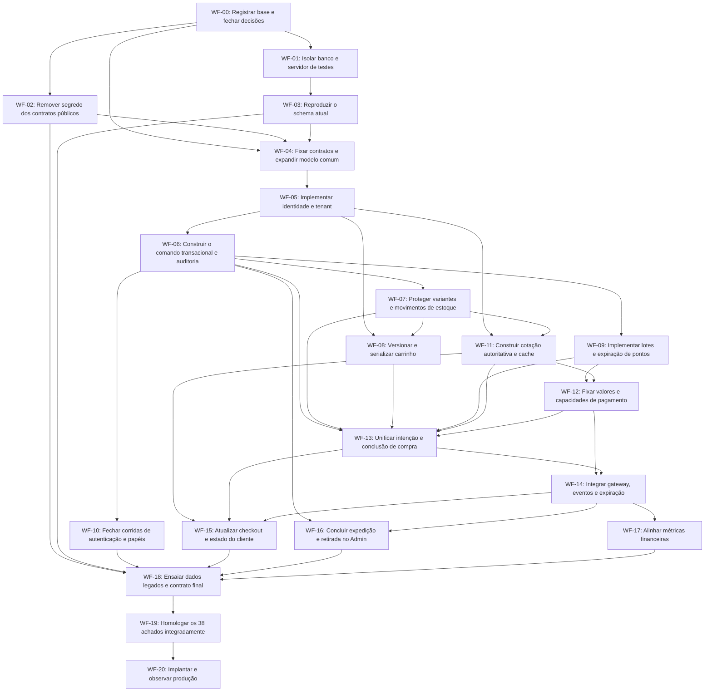

# Workflow de implementação das correções de lógica

## 1. Objetivo, origem e estado deste documento

**Data:** 03/10/2026.  
**Base de planejamento:** [Propostas de correção e prontidão para produção](../Propostas/PROPOSTAS_CORRECAO_PRONTIDAO_PRODUCAO.md).  
**Evidência de origem:** [Auditoria de lógica](../../relatorio_geral/logic-audit-report.md).  
**Abrangência:** implementação das 38 propostas, de LA-001 a LA-038.  
**Estado atual:** **EM EXECUÇÃO — atualizado em 08/10/2026: WF-18 segue aberto para reconciliação/aceite dos legados; WF-19 tem regressões técnicas locais e ensaios de PIX no Preview/Sandbox aprovados para confirmação com e-mail, evento duplicado e notificação antiga sintética; homologação integral do candidato e operação continuam pendentes; WF-20 NÃO INICIADO e projeto ainda sem liberação para produção**. O fechamento atual e as pendências estão na seção 12 e nas seções 61/65/70 do [registro de execução](REGISTRO_EXECUCAO_CORRECOES_LOGICAS.md). Os checkpoints anteriores de módulos, duas instâncias e Linux permanecem como evidência histórica. O modelo/contratos estão em [contratos comuns](CONTRATOS_COMUNS_CORRECOES_LOGICAS.md).

Este workflow organiza a execução em **21 etapas, WF-00 a WF-20**, com dependências explícitas, entregáveis, pontos de validação e checklist individual por achado. Não substitui as propostas: os critérios de aceite, cenários de teste e cuidados com dados descritos nelas continuam obrigatórios. Se uma tarefa resumida aqui não repetir um detalhe da proposta, isso não o dispensa.

Na elaboração original houve somente planejamento. A execução alcançou os módulos de WF-05/WF-07/WF-08/WF-09/WF-10/WF-11/WF-12/WF-13/WF-14/WF-15/WF-16/WF-17 e a base de WF-06: existem alterações de código/testes/configuração e treze migrations novas, ensaiadas exclusivamente em PostgreSQL descartável, incluindo clone restaurado do banco existente. A origem foi acessada em modo somente leitura para metadados/backup em 04/10; os ensaios de 05/10 reutilizaram esse backup, sem nova conexão. Não houve migration/limpeza em banco persistente, operação financeira externa, commit ou deploy. Comandos e checklists adiante continuam sendo requisitos; sua presença não comprova execução.

No início desta elaboração, HEAD era `1d513c2`, havia modificação preexistente em `next-env.d.ts` e documentos não rastreados no diretório da correção. Isso foi preservado. Ao iniciar uma implementação futura, registrar novamente o estado real: o workflow não autoriza descartar alterações posteriores nem presume que o código continuará igual à auditoria.

## 2. Como executar o workflow futuramente

### 2.1. Unidade de trabalho e estados

Usar cada WF como pacote de integração e cada LA como item rastreável. Uma etapa pode conter mais de um PR, mas todos devem referenciar os LA correspondentes e o contrato comum definido em WF-04.

| Estado futuro | Quando atribuir | O que não significa |
|---|---|---|
| NÃO INICIADO | Situação inicial deste documento | Nenhum checkbox marcado demonstra implementação. |
| EM EXECUÇÃO | Trabalho autorizado, pré-requisitos satisfeitos e responsável definido | Não autoriza ativação do fluxo em produção. |
| IMPLEMENTADO NO MÓDULO | Código e testes locais do componente concluídos | Não fecha dependências com consumidores posteriores. |
| INTEGRADO | Consumidores/escritores pertinentes usam o contrato e ensaios cruzados passaram | Não substitui homologação do candidato completo. |
| VALIDADO | Critérios e evidências do LA passaram no candidato em WF-19 | Não significa que já foi implantado. |
| ENCERRADO EM PRODUÇÃO | Implantação e observação de WF-20 confirmaram o comportamento | Não elimina monitoramento nem requisitos de reconciliação. |
| BLOQUEADO | Falta decisão, infraestrutura, evidência ou dependência | Registrar motivo e próximo requisito concreto; não marcar concluído por falta de tempo. |

**WF-01/WF-03 têm ensaios locais integrados; WF-02/WF-05/WF-07/WF-08/WF-09/WF-10/WF-11/WF-12/WF-13/WF-14/WF-15/WF-16/WF-17 têm módulos implementados; WF-04 tem base comum e WF-06 tem comando transacional ensaiado.** LA-001/003/004/005/006/007/008/009/010/011/012/013/014/015/016/017/018/019/020/021/022/023/024/025/026/027/028/029/030/031/032/034/035/036/037/038 têm evidência de módulo ou integração local (36 itens); LA-002/033 continuam parciais até legado/integração final/homologação. Não resta LA sem implementação principal, mas nenhum achado está VALIDADO em WF-19 ou ENCERRADO EM PRODUÇÃO. WF-18 está EM EXECUÇÃO: ensaio técnico de clone/restauração/backfill/contrato passou, mas exceções históricas ainda exigem conciliação/aceite. Evidências nas seções23/24/25/26 do registro e nas matrizes de compatibilidade/homologação. WF-19 está EM EXECUÇÃO:627 unitários/77 arquivos e289 testes selecionados/24 arquivos passaram; regressão repetida em duas instâncias next start e em dois pacotes standalone independentes, incluindo sete cenários entre processos, dois de assets e11 de navegador real. Nenhum LA foi promovido a VALIDADO somente por esse ensaio. WF-19 deve ser concluída antes de WF-20; o fechamento de dados de WF-18 continua obrigatório. Candidato imutável, dados atuais, sandbox, carga e serviços externos continuam pendentes.

### 2.2. Regra de entrada em cada etapa

Antes de começar um WF:

- [ ] Conferir se as dependências da tabela da seção4 estão integradas no ambiente de desenvolvimento/homologação necessário.
- [ ] Identificar executor, revisor e responsável pelo aceite; os papéis indicados não designam pessoas automaticamente.
- [ ] Ler os achados e propostas dos LA associados e confirmar que o comportamento ainda existe na revisão que será alterada.
- [ ] Mapear todos os escritores e consumidores envolvidos, inclusive endpoints alternativos, cron, scripts e integrações.
- [ ] Confirmar que a decisão de domínio e o contrato de dados necessários estão definidos.
- [ ] Definir teste que reproduza a falha e cenário positivo que não pode regredir.
- [ ] Identificar mudança de schema, compatibilidade, legado e reversibilidade antes da primeira alteração.

Se houver divergência entre o código atual e o relatório, registrar a diferença e ajustar o plano do item sem presumir que o bug desapareceu. Não repetir correção já comprovadamente existente nem alterar a regra de negócio apenas para simplificar o teste.

### 2.3. Sequência interna de cada entrega

1. Reproduzir o problema de forma segura no ambiente permitido.
2. Estabelecer contrato, invariantes e comportamento esperado.
3. Introduzir expansão de schema/DTO, quando necessária, mantendo leitores compatíveis.
4. Implementar regra de domínio e atualizar todos os escritores.
5. Adaptar consumidores e estados de UI.
6. Executar testes de regressão e de falha/concorrência proporcionais ao risco.
7. Conferir dados e efeitos, não apenas status HTTP.
8. Registrar evidências, limitações e contingência; integrar somente quando o ponto de saída do WF estiver atendido.

Não iniciar chamadas reais ou limpeza de banco para “ver se funciona”. Ensaios destrutivos só podem ocorrer no ambiente descartável comprovado em WF-01. Gateway usa adapter controlado e sandbox; produção não é ambiente de reprodução dos bugs.

### 2.4. Restrições que acompanham toda implementação

- Ler os guias relevantes de `node_modules/next/dist/docs/` antes de escrever código Next.js; verificar versão/modo efetivamente instalados.
- Preservar as regras de variantes de AGENTS.md: Único/Padrão, normalização compartilhada, IDs persistidos separados da chave do formulário, combinação única e reconciliação após lock do produto.
- Não confundir cache, React, Server Actions ou desabilitação de botão com exclusão mútua no banco.
- Usar uma TransactionClient por operação interna; não chamar gateway, transportadora ou email mantendo locks.
- Retentar transação de banco e retentar cobrança são decisões distintas. Timeout financeiro não comprova recusa.
- Manter identidade de comando/efeito; repetição não pode duplicar estoque, pontos, histórico ou dinheiro.
- Não persistir PAN/CVV nem segredos em logs/DTOs, fixtures compartilhadas, inbox/outbox ou relatórios.
- Não apagar dados para fazer testes/constraints passarem. Saneamento exige evidência, auditoria de vínculos e backup restaurável.
- Preservar alterações preexistentes, não atualizar dependências incidentalmente e não misturar refatorações não necessárias com uma correção.

## 3. Decisões de entrada — WF-00

Registrar as decisões abaixo antes dos blocos que dependem delas. As recomendações da proposta são a referência inicial; não foram aprovadas como mudanças de produto apenas por estarem neste workflow.

| ID | Decisão a registrar | Recomendação de partida | Etapas que dependem |
|---|---|---|---|
| D01 | Compra convidada e titularidade | Comprador separado da conta, com recuperação autorizada própria; exigir login é alternativa de escopo explícita. Email declarado não prova identidade. | WF-04, WF-05 e checkout/recuperação |
| D02 | Significado de estoque agregado, reserva, retirada e devolução | Auditar relação Product/Variant; retirada não é estoque zero; restituição pode ir para indisponível. | WF-04, WF-07, WF-13, WF-14 |
| D03 | Total financeiro, parcelas, aprovação comercial e métricas | Cálculo no servidor e snapshot; aprovação integral do contrato de cartão não é recebimento de um boleto parcial; LTV por fatos conciliados. | WF-12, WF-14, WF-17 |
| D04 | Validade externa, reserva, cancelamento e resultado incerto | Prazo por método; consulta inconclusiva não autoriza recriação; pagamento tardio tem revisão/estorno explícitos. | WF-04, WF-14 |
| D05 | Base, validade, devolução e déficit de pontos | Lotes por origem, consumo por vencimento, política congelada; disponível não negativo com tratamento de pontos já gastos. | WF-04, WF-09, WF-12 |
| D06 | Autoridade e validade de frete | Dados do servidor, revisão/cotação vinculada, modalidades habilitadas e regra local geograficamente válida. | WF-11, WF-15 |
| D07 | Identidade da compra e compatibilidade de APIs | Intenção ligada à versão consumível e dono; mesma compra converge entre abas; contrato antigo não conserva bypass. | WF-04, WF-08, WF-13 |
| D08 | Atores, transições, histórico e expedição | Usuário/sistema distintos; comando único; rastreio por modalidade/provedor; retirada conclui sem expedição artificial. | WF-04, WF-06, WF-10, WF-16 |
| D09 | Executor de inbox/outbox e reconciliação | Consumidor durável com lease/retry/monitoramento; não depende de request aberto ou Promise solta. | WF-04, WF-14, WF-19 |
| D10 | Capacidade, operação e liberação | Volume-alvo, limites de latência/locks, alertas, RPO/RTO, responsáveis e janela de observação definidos antes de produção. | WF-19, WF-20 |

**Entregáveis de WF-00:**

- [ ] Registrar revisão de código, estado Git, ambientes e versões efetivas.
- [ ] Inventariar writers de status, estoque, carteira, carrinho, papel de usuário e dados financeiros.
- [ ] Registrar as decisões D01–D10 com alternativas descartadas e impacto em dados.
- [ ] Mapear credenciais/contas de sandbox sem expor seus valores no documento.
- [ ] Fixar responsáveis por revisão técnica, regra de negócio, dados e operação.
- [ ] Definir evidências de fechamento e local de registro para a futura execução.

### 3.1. Como resolver as dependências circulares das propostas

As referências cruzadas entre LA-003/004/005/009/010/011/012 não significam que cada correção deva esperar todas as outras prontas. A execução fica dividida em:

1. **WF-04:** fechar contratos comuns e modelo de persistência, inclusive estados de tentativa e DTO de replay.
2. **WF-06 a WF-12:** construir invariantes locais, autoridade dos valores e interfaces testáveis.
3. **WF-13:** implementar intenção/compra usando adapter controlado e estado persistido. Essa etapa não comprova integração financeira real.
4. **WF-14:** ligar gateway, eventos, recuperação, timeout e executor durável; repetir regressões de WF-13.
5. **WF-15:** ligar a experiência de cliente aos estados completos e repetir os fluxos ponta a ponta.
6. **WF-19:** validar cada LA no candidato completo.

Da mesma forma, WF-06 estabelece o protocolo transacional, mas seus efeitos reais de estoque e carteira só ficam totalmente integrados após WF-07/WF-09. Usar mocks para construir o contrato não permite fechar LA-002 como corrigido em produção.

As fases F0–F4 da proposta continuam sendo marcos de fechamento. Os WF fornecem uma ordem mais detalhada de construção; por isso um mesmo tema pode ser integrado e revalidado em mais de um WF sem duplicar sua responsabilidade principal.

## 4. Ordem de execução e dependências

**Ordem segura padrão:** WF-00 → WF-01 → WF-02 → ... → WF-20, respeitando também os pré-requisitos de cada linha. A ordem numérica é uma ordenação válida do grafo; não pressupõe execução paralela. Frentes independentes podem ser organizadas futuramente pela equipe, com integração de migrations e contratos coordenada.

Na tabela, “saída” significa prontidão para o próximo bloco no ambiente controlado. O encerramento final dos achados exige WF-19 e WF-20.

| Etapa | Trabalho | Pré-requisitos | LA sob responsabilidade principal | Responsável sugerido |
|---|---|---|---|---|
| WF-00 | Registrar base e fechar decisões | Nenhum | Transversal | Responsável técnico + produto/operação |
| WF-01 | Isolar banco e servidor de testes | WF-00 | LA-006 | Backend + QA/infraestrutura |
| WF-02 | Remover segredo dos contratos públicos | WF-00 | LA-038 | Backend + frontend + operação |
| WF-03 | Reproduzir o schema atual | WF-01 | LA-030 | Backend responsável por dados + QA |
| WF-04 | Fixar contratos e expandir modelo comum | WF-00, WF-02, WF-03 | Transversal | Responsável técnico + backend + frontend |
| WF-05 | Implementar identidade e tenant | WF-04 | LA-020, LA-014, LA-032 | Backend + frontend |
| WF-06 | Construir o comando transacional e auditoria | WF-05 | LA-033, LA-027, LA-002 | Backend + QA |
| WF-07 | Proteger variantes e movimentos de estoque | WF-06 | LA-018, LA-019 | Backend + frontend Admin + operação |
| WF-08 | Versionar e serializar carrinho | WF-05, WF-07 | LA-017 | Backend + QA |
| WF-09 | Implementar lotes e expiração de pontos | WF-06 | LA-021, LA-022 | Backend + responsável pela política de fidelidade |
| WF-10 | Fechar corridas de autenticação e papéis | WF-06 | LA-028, LA-029 | Backend + QA |
| WF-11 | Construir cotação autoritativa e cache | WF-05, WF-07 | LA-031, LA-008 | Backend logística + QA |
| WF-12 | Fixar valores e capacidades de pagamento | WF-09, WF-11 | LA-035, LA-009, LA-023 | Backend + produto/financeiro |
| WF-13 | Unificar intenção e conclusão de compra | WF-06, WF-07, WF-08, WF-09, WF-11, WF-12 | LA-011, LA-004, LA-001, LA-015, LA-013, LA-012 | Backend + frontend checkout + QA |
| WF-14 | Integrar gateway, eventos e expiração | WF-12, WF-13 | LA-005, LA-003, LA-010 | Backend pagamentos + operação + QA |
| WF-15 | Atualizar checkout e estado do cliente | WF-11, WF-13, WF-14 | LA-034, LA-007, LA-024, LA-016, LA-025 | Frontend + backend de contratos + QA |
| WF-16 | Concluir expedição e retirada no Admin | WF-06, WF-14 | LA-026, LA-037 | Frontend Admin + backend + QA |
| WF-17 | Alinhar métricas financeiras | WF-14 | LA-036 | Backend de indicadores + produto/financeiro |
| WF-18 | Ensaiar dados legados e contrato final | WF-02, WF-03, WF-10, WF-15, WF-16, WF-17 | Transversal | Backend de dados + operação + QA |
| WF-19 | Homologar os 38 achados integradamente | WF-18 | Transversal | QA + responsáveis técnicos e operacionais |
| WF-20 | Implantar e observar produção | WF-19 | Transversal | Operação + responsável pela liberação |

### 4.1. Grafo de dependências de construção

## 5. Entregáveis e pontos de saída por etapa

Cada linha abaixo representa um ponto de validação futuro. Se o resultado não for atingido, registrar o bloqueio e corrigir antes de avançar pelo caminho dependente.

| Etapa | Entregável obrigatório | Ponto de saída |
|---|---|---|
| WF-00 | Baseline, inventário de escritores, decisões D01–D10 e critérios de teste registrados; nada executado nesta etapa documental. | Toda decisão que afeta o bloco seguinte tem escolha explícita; alterações preexistentes identificadas. |
| WF-01 | Cliente de teste, provisionamento efêmero, sentinela e configuração do servidor sob teste. | Ensaios de configuração maliciosa/divergente não alcançam banco externo nem executam seed/cleanup. |
| WF-02 | DTO público explícito, contratos administrativos mascarados e plano de rotação quando aplicável. | Canários ausentes de JSON, renderização e caches públicos; dependências de frete continuam funcionais. |
| WF-03 | Trajetórias de migrations para banco vazio e clone existente, diff e restauração ensaiados. | Ambos os caminhos chegam ao schema esperado sem perda de dados ou resolução ad hoc não documentada. |
| WF-04 | Contratos versionados de comando/resultado; modelos de intenção, tentativa, reserva, atores, lotes e revisões; migrations expansivas em ambiente isolado. | Modelo revisado como conjunto, consumidores antigos compatíveis e grafo de locks sem inversões conhecidas. |
| WF-05 | Comprador/conta separados, contexto de tenant/dono e simulação pública versus personalizada. | IDs/email/chaves declarados não concedem acesso a conta ou carteira alheia; leitores suportam a opção de convidados adotada. |
| WF-06 | Ator tipado, histórico e transição única sob lock/versão; interface de efeitos transacionais. | Comando repetido/conflitante não duplica efeitos; falha interna reverte status e registros obrigatórios. |
| WF-07 | Retirada explícita, destino indisponível da restituição e ajuste auditado/versionado de estoque. | Retirada não reativa por estorno; salvar metadado antigo não desfaz reserva; todos os escritores mapeados. |
| WF-08 | Unicidade de ACTIVE por escopo, revisão e identidade de mutação; protocolo de lock compartilhado com consumo futuro. | Incrementos concorrentes se preservam, retries não repetem e PATCH antigo conflita. |
| WF-09 | Lotes/alocações/ledger, déficit separado quando aplicável e expiração idempotente. | Saldo/lotes/ledger fecham sob concorrência; créditos válidos não expiram e estorno financeiro não é bloqueado por pontos gastos. |
| WF-10 | Consumo atômico de recuperação e proteção transacional de administrador ativo. | Uma redefinição por token; nunca zero administradores ativos por alteração concorrente autorizada. |
| WF-11 | Dados autoritativos, revisões de cotação/cache e assinatura integrada ao contrato. | Mudança relevante invalida cotação; nenhuma omissão/manipulação autoriza frete arbitrário. |
| WF-12 | Preflight de métodos, cálculo de parcelas/encargos e snapshot da política de pontos. | Valores consentidos e persistidos fecham em centavos; indisponibilidade não retorna emissão fictícia. |
| WF-13 | Compra por intenção e revisão, resolução de variante, consumo único de carrinho e DTO de replay; adapters de entrada convergentes. | Com gateway controlado, um pedido/reserva por intenção e nenhuma leitura fora do escopo; dados incompletos retornam estado incompleto. |
| WF-14 | Tentativas, conciliação, consumidor durável de inbox/outbox, estorno e timeout por método. | Falha em qualquer fronteira é retomável; não há recriação de cobrança por resultado incerto nem perda de evento recebido. |
| WF-15 | Revisões assíncronas, envelope de frete, cobrança/entrega separadas, bootstrap do carrinho e confirmação completa. | E2E de compra/reload/cancelamento/endereço funciona e nenhuma resposta antiga desfaz estado atual. |
| WF-16 | Status/rastreio atômicos e ações de modalidade vindas da política central. | Expedição grava o que promete; retirada conclui sem rastreio/expedição artificiais. |
| WF-17 | Definição de LTV/ticket e projeções baseadas em fatos conciliados. | Lista e perfil usam mesma população/fórmula; tentativa não paga e evento duplicado não inflam receita. |
| WF-18 | Backfills simulados e aplicados somente em clone, reconciliação de exceções, constraints finais ensaiadas, matriz de compatibilidade. | Contagens/vínculos/saldos conferidos, ambiguidades separadas e nenhum dado inventado para passar constraint. |
| WF-19 | Evidências E01–E14, contratos externos homologados, build e testes, carga, recuperação e runbooks. | Todos os critérios aplicáveis aprovados; cada LA tem evidência final no build candidato, não apenas teste de módulo. |
| WF-20 | Implantação futura controlada, reconciliação e observação dos ciclos completos, encerramento ou contingência. | Sem regressões das invariantes; pendências tratáveis; rollback/roll-forward e recuperação disponíveis. |

### 5.1. Sequência interna de WF-04 — contrato e expansão comum

- [ ] Definir DTOs de item canônico, contexto tenant/dono, cotação, plano financeiro e resultado de compra/replay.
- [ ] Definir estados e transições de intenção, pedido, tentativa/contrato financeiro e reserva, sem fundi-los em um booleano de sucesso.
- [ ] Definir identidade e unicidade de intenção, comando, evento e efeito. Contemplar múltiplos estornos parciais legítimos, sem índice simplista que os bloqueie.
- [ ] Modelar atores humanos/sistema e sua relação com histórico/auditoria.
- [ ] Modelar comprador convidado/endereço conforme D01, revisando previamente os leitores que exigem User.
- [ ] Modelar versões de carrinho/inventário/configuração e lotes/alocações da carteira.
- [ ] Enumerar novas constraints, índices, FKs e backfills; registrar quais só podem ser ativados depois da reconciliação de legados.
- [ ] Desenhar ordem de locks a partir de todos os writers e FKs. Ordem sugerida nas propostas deve ser validada, não copiada sem verificar inversões.
- [ ] Definir interface do gateway e executor durável, incluindo resposta ambígua e recuperação; um teste local não comprova garantia externa.
- [ ] Introduzir migrations expansivas e leitores compatíveis somente no ambiente isolado nesta fase de construção.
- [ ] Registrar contratos de erro, conflito de versão, pendência e rejeição. Frontend não deve interpretar qualquer 2xx como “pagamento confirmado”.
- [ ] Testar contratos com adapters controlados e liberar a base para WF-05 em diante.

Não exigir uma única migration gigante. Dividir por compatibilidade e responsabilidade, mantendo um modelo revisado em conjunto. Constraints finais e remoção de campos/caminhos antigos aguardam evidência de compatibilidade e saneamento.

### 5.2. Sequência interna de WF-13 — compra única

Executar os itens na ordem: **LA-011 → LA-004 → LA-001 → LA-015 → LA-013 → LA-012**.

O resultado local deverá ser: contexto autorizado → intenção/revisão → validação autoritativa → reserva/pontos/pedido/consumo do carrinho em transação → tentativa financeira persistida → resposta com estado real. A chamada remota acontece depois do commit e será integrada em WF-14.

Até WF-14/WF-15, não liberar a nova compra ao público apenas porque os testes com gateway controlado passaram. O serviço ainda precisa provar recuperação real e representação correta no cliente.

### 5.3. Sequência interna de WF-14 — financeiro recuperável

1. Implementar LA-005 com tentativas e consultas de conciliação; validar primeiro respostas controladas.
2. Implementar LA-003 com inbox/outbox e consumidor efetivo. Disponibilizar mecanismo de retomada antes de confirmar recebimento assíncrono.
3. Integrar resposta síncrona e webhook como fontes concorrentes dos mesmos fatos/efeitos; ambos usam comando e identidades comuns.
4. Implementar LA-010 após poder distinguir validade do método, resultado incerto e confirmação concorrente.
5. Injetar falhas entre todas as fronteiras e executar sandbox dos métodos e planos permitidos, preservando IDs das operações.
6. Confirmar que cancelamento pago aciona estorno rastreável; estoque enviado/entregue depende de devolução física, não apenas de reembolso.
7. Revalidar LA-002, LA-004, LA-009, LA-011, LA-012, LA-023, LA-033 e LA-035 com os consumidores reais.
8. Validar supervisão de backlog, lease e tentativas incertas antes de encaminhar o bloco à UI e homologação.

Uma consulta vazia ao gateway após timeout não será tratada automaticamente como prova de inexistência da cobrança. Se a ambiguidade não puder ser resolvida, a operação permanece identificada para revisão e não libera uma nova cobrança da mesma intenção.

### 5.4. Integração e tamanho das entregas

Cada PR futuro deve declarar LA/WF, contrato alterado, writers/consumidores migrados, impacto de dados, validação executada e reversibilidade. Código removido só pode ser retirado depois de conferir consumidores; código compatível temporário não pode manter uma brecha de autorização, preço ou estado.

Coordenar explicitamente estes conjuntos:

| Conjunto | Entrega coordenada necessária |
|---|---|
| LA-002/027/033 | Transição, histórico e atores; não inserir ator de sistema num campo que ainda exige User. |
| LA-014/020/032 | Dono/tenant, convidado e consulta personalizada; email declarado não substitui identidade. |
| LA-018/019/001 | Retirada, ajuste de estoque e venda; não publicar writer que ignore novo estado/revisão. |
| LA-021/022/023 | Origem/validade dos pontos, expiração e crédito; CHECK não pode inviabilizar estorno legítimo. |
| LA-004/011/012/013/015 | Intenção, escopo, replay, entrada única e carrinho consumido. |
| LA-005/003/010 | Tentativa financeira, recebimento/processamento de eventos e expiração. |
| LA-008/031/007/034 | Cotação, cache/revisão e consumo assíncrono pelo formulário. |
| LA-024/025/035 | Dados necessários, estados da confirmação e capacidade real do método. |
| LA-026/037 | Expedição/rastreio e modalidade de retirada. |

## 6. Rastreabilidade e controle inicial dos 38 achados

Os itens começaram pendentes; a tabela acompanha a execução local registrada. “Etapa principal” identifica onde construir o núcleo; integração, legado e fechamento são transversais em WF-18/WF-19/WF-20.

| LA | Proposta | Fase de origem | Etapa principal | Estado |
|---|---|---|---|---|
| LA-001 | Preservar e validar a variante até a reserva e o pedido | F2 | WF-13 | IMPLEMENTADO NO MÓDULO — ensaios locais; integração/aceite final pendentes |
| LA-002 | Centralizar transições e executar seus efeitos uma única vez | F1 | WF-06 | EM EXECUÇÃO — efeitos novos/reservas/lotes/financeiro ensaiados; legado/devoluções/candidato pendentes |
| LA-003 | Transformar webhooks em eventos duráveis e recuperáveis | F2 | WF-14 | IMPLEMENTADO NO MÓDULO — inbox/lease/ack/outbox ensaiados; scheduler/sandbox/WF-19 pendentes |
| LA-004 | Dar identidade durável à intenção de checkout | F2 | WF-13 | IMPLEMENTADO NO MÓDULO — ensaios locais; integração/aceite final pendentes |
| LA-005 | Separar pedido, reserva e estado financeiro com reconciliação | F2 | WF-14 | IMPLEMENTADO NO MÓDULO — consulta/fatos/operações retomáveis ensaiados; sandbox/legado/WF-19 pendentes |
| LA-006 | Isolar de forma verificável o banco de testes | F0 | WF-01 | INTEGRADO — ensaios locais; WF-19 pendente |
| LA-007 | Unificar o contrato da cotação consumido pelo formulário | F3 | WF-15 | IMPLEMENTADO NO MÓDULO — serviço/HTTP/navegador locais; WF-19 pendente |
| LA-008 | Tornar a cotação de frete autoritativa e vinculada à compra | F2 | WF-11 | IMPLEMENTADO NO MÓDULO; integração final pendente |
| LA-009 | Calcular e conciliar parcelamento no servidor | F2 | WF-12 | IMPLEMENTADO NO MÓDULO |
| LA-010 | Expirar por método e estado remoto, com proteção contra corrida | F2 | WF-14 | IMPLEMENTADO NO MÓDULO — prazos/corridas/dryRun ensaiados; política real/ativação/WF-19 pendentes |
| LA-011 | Escopar idempotência à identidade autorizada e ao conteúdo | F2 | WF-13 | IMPLEMENTADO NO MÓDULO — ensaios locais; integração/aceite final pendentes |
| LA-012 | Retornar e retomar o estado real no replay | F2 | WF-13 | IMPLEMENTADO NO MÓDULO — ensaios locais; integração/aceite final pendentes |
| LA-013 | Fazer todos os caminhos de compra usarem o mesmo comando | F2 | WF-13 | IMPLEMENTADO NO MÓDULO — ensaios locais; integração/aceite final pendentes |
| LA-014 | Aplicar isolamento de loja a todos os recursos da compra | F1 | WF-05 | IMPLEMENTADO NO MÓDULO — serviço/HTTP/FKs ensaiados; integração final pendente |
| LA-015 | Consumir um carrinho somente uma vez | F2 | WF-13 | IMPLEMENTADO NO MÓDULO — ensaios locais; integração/aceite final pendentes |
| LA-016 | Sincronizar o ciclo persistido do carrinho com o cliente | F3 | WF-15 | IMPLEMENTADO NO MÓDULO — serviço/HTTP/navegador locais; WF-19 pendente |
| LA-017 | Serializar mutações do carrinho e garantir um ativo por dono/loja | F1 | WF-08 | IMPLEMENTADO NO MÓDULO — concorrência/replay/consumo ensaiados; intenção/UX final pendentes |
| LA-018 | Separar retirada de variante de quantidade disponível | F1 | WF-07 | IMPLEMENTADO NO MÓDULO — retirada/restituição/reativação ensaiadas; procedência/legados/integração final pendentes |
| LA-019 | Separar edição de catálogo de ajuste de estoque | F1 | WF-07 | IMPLEMENTADO NO MÓDULO — comando/revisão/auditoria e Admin ensaiados; navegador/candidato integrado pendentes |
| LA-020 | Separar comprador convidado de conta autenticada | F1 | WF-05 | IMPLEMENTADO NO MÓDULO — identidade/recuperação ensaiadas; intenção/UX final pendentes |
| LA-021 | Rastrear a origem e o prazo de cada crédito de fidelidade | F1 | WF-09 | IMPLEMENTADO NO MÓDULO — lotes/FEFO/déficit ensaiados; legado/consumidor/WF-19 pendentes |
| LA-022 | Tornar expiração idempotente por crédito e transacional por carteira | F1 | WF-09 | IMPLEMENTADO NO MÓDULO — expiração/lease/retry ensaiados; ativação/WF-19 pendentes |
| LA-023 | Fixar a política de ganho no snapshot aceito da compra | F2 | WF-12 | IMPLEMENTADO NO MÓDULO |
| LA-024 | Separar endereço de cobrança de modalidade de entrega | F3 | WF-15 | IMPLEMENTADO NO MÓDULO — serviço/HTTP/navegador locais; WF-19 pendente |
| LA-025 | Exibir o estado completo do pedido e do pagamento na confirmação | F3 | WF-15 | IMPLEMENTADO NO MÓDULO — serviço/HTTP/navegador locais; WF-19 pendente |
| LA-026 | Persistir rastreio na mesma operação que confirma expedição | F3 | WF-16 | NÃO INICIADO |
| LA-027 | Registrar histórico no mesmo commit da transição | F1 | WF-06 | IMPLEMENTADO NO MÓDULO — histórico/versionamento/rollback ensaiados; integração final pendente |
| LA-028 | Consumir token de recuperação atomicamente | F1 | WF-10 | IMPLEMENTADO NO MÓDULO — disputa/deadline/reemissão/rollback/sessão ensaiados; rollout/WF-19 pendentes |
| LA-029 | Proteger existência de administrador ativo sob concorrência | F1 | WF-10 | IMPLEMENTADO NO MÓDULO — lock/reautorização/auditoria/rollback ensaiados; recuperação operacional/WF-19 pendentes |
| LA-030 | Reconstituir uma trajetória de migrations reproduzível | F0 | WF-03 | INTEGRADO — vazio/sintético/clone passaram; WF-19/20 pendentes |
| LA-031 | Fazer a chave de cache representar todos os determinantes do frete | F2 | WF-11 | IMPLEMENTADO NO MÓDULO; integração final pendente |
| LA-032 | Restringir carteira à identidade da sessão e tornar simulação leitura | F1 | WF-05 | IMPLEMENTADO NO MÓDULO — serviço/HTTP ensaiados; integração final pendente |
| LA-033 | Modelar atores de sistema e registro financeiro sem FKs fictícias | F1 | WF-06 | EM EXECUÇÃO — atores/fato financeiro/inbox/alerta tardio ensaiados; legado/candidato integrado pendentes |
| LA-034 | Aplicar respostas assíncronas somente à revisão correspondente | F3 | WF-15 | IMPLEMENTADO NO MÓDULO — serviço/HTTP/navegador locais; WF-19 pendente |
| LA-035 | Validar capacidade real de cada método antes de reservar | F2 | WF-12 | IMPLEMENTADO NO MÓDULO |
| LA-036 | Definir LTV por fatos financeiros reconhecidos | F3 | WF-17 | IMPLEMENTADO NO MÓDULO; ensaios locais na seção22 |
| LA-037 | Usar a política única de transições com modalidade | F3 | WF-16 | NÃO INICIADO |
| LA-038 | Separar DTO público de configurações secretas da loja | F0 | WF-02 | IMPLEMENTADO NO MÓDULO — ensaios locais; operação/WF-19 pendentes |

## 7. Checklists individuais em ordem de execução

Os checklists seguem a ordem dos pacotes, não a numeração dos achados. Itens marcados têm execução local registrada; itens abertos e validação final não são dispensados por testes de módulo.

### [LA-006] Isolar de forma verificável o banco de testes

**Etapa principal:** WF-01. **Estado:** INTEGRADO nos ensaios locais; homologação final pendente.  
**Responsabilidade sugerida:** Backend + QA/infraestrutura.  
**Ponto principal atual:** `tests/setup/db.ts`. Mapear também os componentes relacionados no finding e na proposta antes de editar.  
**Pré-requisitos de construção:** WF-00. Integração final também depende dos consumidores posteriores e de WF-19.

#### Checklist de implementação futura

- [x] Criar provisionamento efêmero e cliente explicitamente conectado à URL de teste, incluindo servidor HTTP sob teste.
- [x] Validar identidade real do banco/usuário e sentinela pelo cliente que fará as escritas; eliminar fallback para conexão da aplicação.
- [x] Substituir limpeza global por descarte do ambiente/fixtures da execução e restringir privilégios da credencial.
- [x] Testar destinos falsos e divergentes em ambientes controlados antes de liberar qualquer suite de integração/carga.

#### Validação específica

- [x] TEST_DATABASE_URL seguro combinado com DATABASE_URL proibido não produz conexão/escrita neste último; servidor e fixtures devem usar o mesmo banco isolado.
- [ ] Executar os demais testes do item LA-006 na proposta e repetir os cenários cruzados no candidato integrado.

#### Dados e compatibilidade

Não executar cleanup existente para verificar segurança. Testar rejeições com substitutos de conexão ou dois bancos descartáveis.

#### Critério para validar o achado

Testes de integração/carga só podem escrever no banco efêmero verificado; a proteção é demonstrada antes de habilitar essas suites.

- [ ] Registrar evidência, revisão, ambiente, resultado e contingência; não encerrar o LA antes da validação integrada.

### [LA-038] Separar DTO público de configurações secretas da loja

**Etapa principal:** WF-02. **Estado:** IMPLEMENTADO NO MÓDULO; ensaios HTTP locais passaram, operação/WF-19 pendentes.  
**Responsabilidade sugerida:** Backend + frontend + operação.  
**Ponto principal atual:** `services/loja.service.ts`. Mapear também os componentes relacionados no finding e na proposta antes de editar.  
**Pré-requisitos de construção:** WF-00. Integração final também depende dos consumidores posteriores e de WF-19.

#### Checklist de implementação futura

- [x] Criar seleção/serialização pública explícita e separar configurações privadas da integração.
- [ ] Revisar JSON, props server→client, hidratação, caches, logs e respostas Admin com credenciais-canário.
- [x] Impedir campo mascarado de sobrescrever segredo na edição; manter segredo somente no servidor.
- [ ] Na execução futura, avaliar exposição e planejar rotação/purga quando aplicável, confirmando continuidade da cotação.

#### Validação específica

- [ ] Nenhum contrato público contém nome/valor sensível; canário não aparece em respostas/renderização e integração continua operante.
- [ ] Executar os demais testes do item LA-038 na proposta e repetir os cenários cruzados no candidato integrado.

#### Dados e compatibilidade

Não rotacionar credenciais nesta etapa de planejamento; proteção contra vazamento não pode ser revertida em rollback.

#### Critério para validar o achado

Nenhum contrato público entrega segredo; integração continua funcional com credencial gerida no servidor.

- [ ] Registrar evidência, revisão, ambiente, resultado e contingência; não encerrar o LA antes da validação integrada.

### [LA-030] Reconstituir uma trajetória de migrations reproduzível

**Etapa principal:** WF-03. **Estado:** INTEGRADO nos ensaios locais; banco vazio/sintético/clone restaurado e reaplicação passaram; WF-19/20 pendentes.  
**Responsabilidade sugerida:** Backend responsável por dados + QA.  
**Ponto principal atual:** `prisma/schema.prisma`. Mapear também os componentes relacionados no finding e na proposta antes de editar.  
**Pré-requisitos de construção:** WF-01. Integração final também depende dos consumidores posteriores e de WF-19.

#### Checklist de implementação futura

- [x] Comparar schema real de clone, Prisma e histórico completo, incluindo índices/checks/FKs/defaults/sequências.
- [x] Projetar trajetórias banco vazio e existente; completar história sem editar migration já aplicada nem apagar histórico.
- [x] Ensaiar aplicação, reaplicação, consulta dos objetos e restauração; registrar equivalência antes de qualquer resolve/baseline.
- [x] Incluir detecção de drift em CI e definir o processo para migrations das etapas seguintes.

#### Validação específica

- [x] Banco vazio e clone atualizado convergem preservando dados; nenhuma correção depende de comando avulso não versionado.
- [ ] Executar os demais testes do item LA-030 na proposta e repetir os cenários cruzados no candidato integrado.

#### Dados e compatibilidade

Não usar reset/db push em banco com dados como reparo; comandos exatos serão revisados para a versão instalada na execução.

#### Critério para validar o achado

Provisionamento novo e atualização de existente são reproduzíveis, verificáveis e convergem sem comandos ad hoc não versionados.

- [ ] Registrar evidência, revisão, ambiente, resultado e contingência; não encerrar o LA antes da validação integrada.

### [LA-020] Separar comprador convidado de conta autenticada

**Etapa principal:** WF-05. **Estado:** IMPLEMENTADO NO MÓDULO; intenção/recuperação após resposta perdida, UX e homologação final pendentes.  
**Responsabilidade sugerida:** Backend + frontend.  
**Ponto principal atual:** `services/checkout.service.ts`. Mapear também os componentes relacionados no finding e na proposta antes de editar.  
**Pré-requisitos de construção:** WF-04. Integração final também depende dos consumidores posteriores e de WF-19.

#### Checklist de implementação futura

- [ ] Registrar escolha D01: convidado com comprador separado ou escopo com login obrigatório; não manter comportamento intermediário inseguro.
- [x] Remover autorização implícita por email e upsert que atualiza User; implementar snapshot e credencial de recuperação no desenho escolhido.
- [x] Adaptar leitores de order.user, endereços, emails, Admin, auditoria e fidelidade antes de gravar pedidos sem usuário. Renderização em navegador e envio externo ainda precisam de homologação.
- [x] Vincular conta somente após autenticação/verificação apropriada; testar coincidência de email sem alteração de perfil/histórico.

#### Validação específica

- [x] Convidado com email de usuário existente não muda CPF/telefone/carteira nem ganha acesso à conta; leitores de serviço/HTTP foram ensaiados com vínculo opcional.
- [ ] Executar os demais testes do item LA-020 na proposta e repetir os cenários cruzados no candidato integrado.

#### Dados e compatibilidade

Não nulificar FK isoladamente. Histórico de alteração indevida de cadastro precisa investigação, não restauração presumida.

#### Critério para validar o achado

Identidade declarada de comprador não autoriza mutação de conta; histórico e dados pessoais pertencem ao sujeito verificado.

- [ ] Registrar evidência, revisão, ambiente, resultado e contingência; não encerrar o LA antes da validação integrada.

### [LA-014] Aplicar isolamento de loja a todos os recursos da compra

**Etapa principal:** WF-05. **Estado:** IMPLEMENTADO NO MÓDULO; serviço/HTTP/FKs ensaiados, integração final pendente.  
**Responsabilidade sugerida:** Backend + frontend.  
**Ponto principal atual:** `services/cart.service.ts`. Mapear também os componentes relacionados no finding e na proposta antes de editar.  
**Pré-requisitos de construção:** WF-04. Integração final também depende dos consumidores posteriores e de WF-19.

#### Checklist de implementação futura

- [x] Definir escopo de carrinho/pedido por tenant e dono no modelo comum, com política coerente para convidados.
- [x] Validar sessão/contexto e pertencimento de produto, variante e endereço em rotas e serviços, incluindo InventoryService.
- [x] Adicionar tenant/relações/índices com backfill ensaiado; migration rejeita vínculos contaminados sem reassociar dados, e leitura/compra falham de forma fechada.
- [x] Testar acesso direto aos serviços e caminho alternativo de pedidos, além da rota principal.

#### Validação específica

- [x] UsuárioA/produtoB, variante de outro produto e endereço alheio falham sem efeitos em chamadas de serviço/HTTP ensaiadas.
- [ ] Executar os demais testes do item LA-014 na proposta e repetir os cenários cruzados no candidato integrado.

#### Dados e compatibilidade

Não transferir automaticamente carrinhos/pedidos misturados para a loja escolhida apenas para satisfazer constraints.

#### Critério para validar o achado

Nenhuma escrita de compra/estoque cruza tenant; manipular IDs não contorna isolamento.

- [ ] Registrar evidência, revisão, ambiente, resultado e contingência; não encerrar o LA antes da validação integrada.

### [LA-032] Restringir carteira à identidade da sessão e tornar simulação leitura

**Etapa principal:** WF-05. **Estado:** IMPLEMENTADO NO MÓDULO; HTTP/serviço ensaiados; WF-19 e integração dos demais fluxos pendentes.  
**Responsabilidade sugerida:** Backend + frontend.  
**Ponto principal atual:** `app/api/loyalty/simulate/route.ts`. Serviço, GET wallet, widget e testes também foram tratados.  
**Pré-requisitos de construção:** WF-04. Integração final também depende dos consumidores posteriores e de WF-19.

#### Checklist de implementação futura

- [x] Separar simulação pública de ganho e consulta personalizada de saldo/resgate.
- [x] Resolver usuário/tenant no servidor e retirar fallback de userID fornecido por anônimo.
- [x] Trocar getOrCreate por leitura na simulação; ausência de carteira própria retorna zero sem INSERT.
- [x] Atualizar widget/consumidores e testar sessão alheia, anônimo com IDs e carteira própria ausente. Revisão visual/E2E em navegador permanece pendente.

#### Validação específica

- [ ] Simular publicamente não lê saldo de terceiro nem cria carteira; simulação autorizada continua consistente com checkout.
- [ ] Executar os demais testes do item LA-032 na proposta e repetir os cenários cruzados no candidato integrado.

#### Dados e compatibilidade

Carteiras vazias criadas antes não serão apagadas como efeito colateral desta correção.

#### Critério para validar o achado

Somente o titular autorizado obtém dados da carteira; consultar não cria nem modifica saldo.

- [ ] Registrar evidência, revisão, ambiente, resultado e contingência; não encerrar o LA antes da validação integrada.

### [LA-033] Modelar atores de sistema e registro financeiro sem FKs fictícias

**Etapa principal:** WF-06. **Estado:** EM EXECUÇÃO; atores, FinancialFact/inbox/reconciliação ensaiados localmente em WF-14; legado/candidato/homologação pendentes.  
**Responsabilidade sugerida:** Backend + QA.  
**Ponto principal atual:** `app/api/webhooks/asaas/route.ts`. Mapear também os componentes relacionados no finding e na proposta antes de editar.  
**Pré-requisitos de construção:** WF-05. Integração final também depende dos consumidores posteriores e de WF-19.

#### Checklist de implementação futura

- [x] Adicionar ator discriminado e separar usuário afetado de entidade pedido no modelo comum.
- [x] Migrar writers de pedido em AuditLog/OrderStatusHistory para referências válidas e convenção consistente; gateway/cron/compensação não são User fictício.
- [x] Registrar pagamento tardio em pedido cancelado como ocorrência financeira/revisão durável, transacionada com efeito do evento; ensaio local WF-14.
- [x] Completar integração com inbox em WF-14; testar falha de notificação sem perder registro financeiro. Evidência local: seção19 do registro; envio externo permanece em WF-19.

#### Validação específica

- [x] Pagamento em cancelado grava ocorrência sem FK inválida; reentrega não duplica; ator humano inexistente é rejeitado nos ensaios locais.
- [ ] Executar os demais testes do item LA-033 na proposta e repetir os cenários cruzados no candidato integrado.

#### Dados e compatibilidade

Não remover FKs indiscriminadamente nem criar conta de login técnica; preservar autoria histórica comprovada.

#### Critério para validar o achado

Ações automáticas são rastreáveis sem usuários inventados; exceção financeira nunca se perde por modelagem de auditoria.

- [ ] Registrar evidência, revisão, ambiente, resultado e contingência; não encerrar o LA antes da validação integrada.

### [LA-027] Registrar histórico no mesmo commit da transição

**Etapa principal:** WF-06. **Estado:** IMPLEMENTADO NO MÓDULO; rollback/versionamento ensaiados, candidato final pendente.  
**Responsabilidade sugerida:** Backend + QA.  
**Ponto principal atual:** `services/order.service.ts`. Mapear também os componentes relacionados no finding e na proposta antes de editar.  
**Pré-requisitos de construção:** WF-05. Integração final também depende dos consumidores posteriores e de WF-19.

#### Checklist de implementação futura

- [x] Integrar escritor de histórico ao comando central e registrar origem, ator tipado e versão/identidade de transição.
- [x] Fazer histórico e status commitar juntos; manter AuditLog com semântica própria.
- [x] Adaptar timeline para ordem por versão/data/ID e atores não humanos, sem atribuir ação automática ao cliente; revisão visual permanece pendente.
- [x] Verificar escritores conhecidos de status e idempotência; falha real no histórico obrigatório reverte operação nos testes PostgreSQL.

#### Validação específica

- [x] Cada transição nova aceita grava histórico; replay não duplica e actor SYSTEM funciona sem usuário fictício nos cenários ensaiados.
- [ ] Executar os demais testes do item LA-027 na proposta e repetir os cenários cruzados no candidato integrado.

#### Dados e compatibilidade

Reconstruir passado somente com evidência e rótulo de reconstrução; timeline vazia não autoriza inventar eventos.

#### Critério para validar o achado

Timeline representa todas as transições futuras efetivas, sem sucesso de status desacompanhado do histórico correspondente.

- [ ] Registrar evidência, revisão, ambiente, resultado e contingência; não encerrar o LA antes da validação integrada.

### [LA-002] Centralizar transições e executar seus efeitos uma única vez

**Etapa principal:** WF-06. **Estado:** EM EXECUÇÃO; comando/concorrência/rollback e efeitos novos de WF-07/09/14 ensaiados; legado/devoluções/homologação pendentes.  
**Responsabilidade sugerida:** Backend + QA.  
**Ponto principal atual:** `services/order.service.ts`. Mapear também os componentes relacionados no finding e na proposta antes de editar.  
**Pré-requisitos de construção:** WF-05. Integração final também depende dos consumidores posteriores e de WF-19.

#### Checklist de implementação futura

- [x] Mapear e redirecionar escritores conhecidos de status: Admin, webhook, cron e confirm-delivery. O adapter Admin propaga rejeição do domínio.
- [x] Implementar comando com leitura de estado/modalidade/dono dentro da transação, lock e predicado de versão; conferir resultado da escrita.
- [x] Integrar reserva/liberação, ledger, histórico e auditoria pela mesma TransactionClient e por identidade única de efeito no protocolo novo (WF-07/09/13/14); legado permanece em WF-18.
- [x] Repetir cancelamento/aprovação e injetar falha entre efeitos após WF-07/09/14 nos ensaios locais; repetir no candidato em WF-19.

#### Validação específica

- [x] Com duas conexões de banco, cancelar duas vezes restitui uma vez; PAID×CANCELLED e entrega×cancelamento não deixam efeitos do perdedor nos cenários locais de WF-06/14.
- [ ] Executar os demais testes do item LA-002 na proposta e repetir os cenários cruzados no candidato integrado.

#### Dados e compatibilidade

Inicializar reservas/efeitos legados só com evidência; tabelas novas não devem interpretar todos os PENDING como reservas comprovadas.

#### Critério para validar o achado

Nenhum caminho muda estado sem a validação protegida; cada reserva, débito/crédito e histórico possui uma única aplicação verificável.

- [ ] Registrar evidência, revisão, ambiente, resultado e contingência; não encerrar o LA antes da validação integrada.

### [LA-018] Separar retirada de variante de quantidade disponível

**Etapa principal:** WF-07. **Estado:** IMPLEMENTADO NO MÓDULO; ensaios locais aprovados, candidato integrado/produção pendentes.  
**Responsabilidade sugerida:** Backend + frontend Admin + operação.  
**Ponto principal atual:** `services/product.service.ts`. Mapear também os componentes relacionados no finding e na proposta antes de editar.  
**Pré-requisitos de construção:** WF-06. Integração final também depende dos consumidores posteriores e de WF-19.

#### Checklist de implementação futura

- [x] Introduzir retirada explícita preservando ID/vínculos e atualizar todos os filtros de disponibilidade.
- [x] Na reconciliação Admin, manter lock do produto, rejeitar reativação implícita por formulário velho e excluir fisicamente só sem vínculos.
- [x] Registrar liberação de reserva retirada para destino indisponível sem incrementar vendável do pai/variante indevidamente.
- [x] Implementar reativação explícita com validação física/combinação e testar retirada×compra×estorno.

#### Validação específica

- [x] Reservar→retirar→cancelar conserva histórico e unidade contabilizada, mas variante não volta a poder ser comprada.
- [ ] Executar os demais testes do item LA-018 na proposta e repetir os cenários cruzados no candidato integrado.

#### Dados e compatibilidade

Stock0 não prova retirada; auditar antes do backfill e definir função de estoque agregado sem presumir soma.

#### Critério para validar o achado

Cancelamento preserva disponibilidade administrativa e contabilidade da unidade, sem perda dos vínculos.

- [ ] Registrar evidência, revisão, ambiente, resultado e contingência; não encerrar o LA antes da validação integrada.

### [LA-019] Separar edição de catálogo de ajuste de estoque

**Etapa principal:** WF-07. **Estado:** IMPLEMENTADO NO MÓDULO; ensaios locais aprovados, candidato integrado/produção pendentes.  
**Responsabilidade sugerida:** Backend + frontend Admin + operação.  
**Ponto principal atual:** `services/product.service.ts`. Mapear também os componentes relacionados no finding e na proposta antes de editar.  
**Pré-requisitos de construção:** WF-06. Integração final também depende dos consumidores posteriores e de WF-19.

#### Checklist de implementação futura

- [x] Separar comando de edição de metadados de ajuste intencional de estoque.
- [x] Versionar inventário em todos os escritores; atribuição absoluta exige revisão, reposição delta exige identidade/motivo.
- [x] Atualizar Admin para preservar rascunho e exibir conflito sem reenviar estoque antigo automaticamente.
- [x] Auditar scripts/integrações que escrevem stock e executar regressão de edição durante venda.

#### Validação específica

- [x] Admin abre10, venda deixa9, edição de nome mantém9; dois ajustes absolutos da mesma revisão não vencem juntos.
- [ ] Executar os demais testes do item LA-019 na proposta e repetir os cenários cruzados no candidato integrado.

#### Dados e compatibilidade

Movimentos novos são auditáveis; estado inicial exige inventário, não uso de snapshots de formulários como verdade.

#### Critério para validar o achado

Metadados nunca sobrescrevem estoque; todo ajuste intencional é verificável, idempotente e detecta snapshot obsoleto.

- [ ] Registrar evidência, revisão, ambiente, resultado e contingência; não encerrar o LA antes da validação integrada.

### [LA-017] Serializar mutações do carrinho e garantir um ativo por dono/loja

**Etapa principal:** WF-08. **Estado:** IMPLEMENTADO NO MÓDULO; ensaios locais aprovados, candidato integrado/produção pendentes.  
**Responsabilidade sugerida:** Backend + QA.  
**Ponto principal atual:** `services/cart.service.ts`. Mapear também os componentes relacionados no finding e na proposta antes de editar.  
**Pré-requisitos de construção:** WF-05, WF-07. Integração final também depende dos consumidores posteriores e de WF-19.

#### Checklist de implementação futura

- [x] Impor unicidade parcial de ACTIVE por owner/tenant e tratar colisão de criação com recuperação controlada.
- [x] Serializar mutações sob lock do carrinho, conferir limites e incrementar revisão.
- [x] Distinguir incremento idempotente de inclusão de PATCH absoluto com versão esperada; retry não soma novamente.
- [x] Retornar snapshot coerente/revisão e disponibilizar contrato para conclusão e UI.

#### Validação específica

- [x] Duas inclusões sobre quantidade1 produzem3; repetir a mesma inclusão mantém3; duas criações iniciais deixam um ativo.
- [ ] Executar os demais testes do item LA-017 na proposta e repetir os cenários cruzados no candidato integrado.

#### Dados e compatibilidade

Reconciliar duplicidades antes do índice; violação SQL abortada requer nova tentativa após rollback, não continuidade da transação.

#### Critério para validar o achado

Existe um único carrinho ativo por escopo; operações legítimas não se perdem e retries não se somam duas vezes.

- [ ] Registrar evidência, revisão, ambiente, resultado e contingência; não encerrar o LA antes da validação integrada.

### [LA-021] Rastrear a origem e o prazo de cada crédito de fidelidade

**Etapa principal:** WF-09. **Estado:** IMPLEMENTADO NO MÓDULO; integração local ensaiada, legado/consumidor/WF-19 pendentes.  
**Responsabilidade sugerida:** Backend + responsável pela política de fidelidade.  
**Ponto principal atual:** `services/loyalty.service.ts`. Mapear também os componentes relacionados no finding e na proposta antes de editar.  
**Pré-requisitos de construção:** WF-06. Integração final também depende dos consumidores posteriores e de WF-19.

#### Checklist de implementação futura

- [x] Fechar política de validade/consumo/devolução/déficit e representar créditos por origem e remanescente.
- [x] Implementar lotes/alocações associados a ledger imutável e consumo por vencimento/ordem estável.
- [x] Representar devolução e pontos ganhos já gastos sem tornar disponível negativo ou impedir estorno financeiro.
- [x] Construir conciliação por carteira e adaptar cada escritor de ganho/resgate/ajuste/devolução.

#### Validação específica

- [x] Ajuste100 sem EARN não expira; créditos parcialmente consumidos e devolvidos fecham com ledger e validade da política.
- [ ] Executar os demais testes do item LA-021 na proposta e repetir os cenários cruzados no candidato integrado.

Evidências locais: seção 14 do [registro de execução](REGISTRO_EXECUCAO_CORRECOES_LOGICAS.md). Contas legadas não foram ativadas nem expiradas; consumidor de pendências, conciliação/ativação e QA em navegador continuam nos gates posteriores.

#### Dados e compatibilidade

Origem desconhecida não expira automaticamente; correção de saldo é compensatória e auditada, nunca edição do ledger original.

#### Critério para validar o achado

Todo ponto disponível tem origem/validade explicáveis; só unidades efetivamente vencidas são removidas.

- [ ] Registrar evidência, revisão, ambiente, resultado e contingência; não encerrar o LA antes da validação integrada.

### [LA-022] Tornar expiração idempotente por crédito e transacional por carteira

**Etapa principal:** WF-09. **Estado:** IMPLEMENTADO NO MÓDULO; integração local ensaiada, legado/consumidor/WF-19 pendentes.  
**Responsabilidade sugerida:** Backend + responsável pela política de fidelidade.  
**Ponto principal atual:** `services/loyalty.service.ts`. Mapear também os componentes relacionados no finding e na proposta antes de editar.  
**Pré-requisitos de construção:** WF-06. Integração final também depende dos consumidores posteriores e de WF-19.

#### Checklist de implementação futura

- [x] Mover cálculo final de expiração para transação com lock/releitura da carteira e dos lotes.
- [x] Consumir somente remanescente vencido com identidade de efeito e atualizar lote/ledger/saldo juntos.
- [x] Adicionar CHECK apenas após resolver déficit/estorno e compatibilizar todos os escritores.
- [x] Implementar job por lote com lease/retry e testar concorrência com resgate e outro job.

#### Validação específica

- [x] Saldo150 com100 vencidos e50 válidos termina50 após dois jobs; falha no ledger reverte baixa e retry não repete.
- [ ] Executar os demais testes do item LA-022 na proposta e repetir os cenários cruzados no candidato integrado.

Evidências locais: seção 14 do [registro de execução](REGISTRO_EXECUCAO_CORRECOES_LOGICAS.md). Contas legadas não foram ativadas nem expiradas; consumidor de pendências, conciliação/ativação e QA em navegador continuam nos gates posteriores.

#### Dados e compatibilidade

Não corrigir saldo negativo por clamp; identificar divergência e compensar com origem rastreável.

#### Critério para validar o achado

Expiração não duplica movimentos nem consome saldo válido e permanece correta com várias instâncias do job.

- [ ] Registrar evidência, revisão, ambiente, resultado e contingência; não encerrar o LA antes da validação integrada.

### [LA-028] Consumir token de recuperação atomicamente

**Etapa principal:** WF-10. **Estado:** IMPLEMENTADO NO MÓDULO; integração local ensaiada, revisão/rollout/WF-19 pendentes.  
**Responsabilidade sugerida:** Backend + QA.  
**Ponto principal atual:** `services/auth.service.ts`. Mapear também os componentes relacionados no finding e na proposta antes de editar.  
**Pré-requisitos de construção:** WF-06. Integração final também depende dos consumidores posteriores e de WF-19.

#### Checklist de implementação futura

- [x] Aplicar predicado de token válido/não consumido e prazo na escrita definitiva, não só na busca inicial.
- [x] Transacionar senha, consumo e revogação de sessões; hash de senha pode ser calculado antes, com revalidação depois.
- [x] Cobrir corrida de reemissão/expiração e adotar hash de token se incluído no desenho, sem reduzir entropia ou prazo.
- [x] Executar duas redefinições com senhas diferentes e mesmo token usando conexões independentes.

#### Validação específica

- [x] Só uma requisição tem sucesso e a senha final é a da vencedora; falha na revogação reverte a troca.
- [ ] Executar os demais testes do item LA-028 na proposta e repetir os cenários cruzados no candidato integrado.

Evidências locais: seção 15 do [registro de execução](REGISTRO_EXECUCAO_CORRECOES_LOGICAS.md). Links plaintext exigem reemissão; código/DDL e writers devem ser ativados coordenadamente. Nenhuma senha foi migrada.

#### Dados e compatibilidade

Se mudar formato do token, planejar reemissão/compatibilidade limitada; não atualizar senhas só para migrar tokens.

#### Critério para validar o achado

Um token autoriza exatamente uma redefinição válida; nenhuma segunda resposta de sucesso sobrescreve a primeira.

- [ ] Registrar evidência, revisão, ambiente, resultado e contingência; não encerrar o LA antes da validação integrada.

### [LA-029] Proteger existência de administrador ativo sob concorrência

**Etapa principal:** WF-10. **Estado:** IMPLEMENTADO NO MÓDULO; integração local ensaiada, revisão/rollout/WF-19 pendentes.  
**Responsabilidade sugerida:** Backend + QA.  
**Ponto principal atual:** `services/user.service.ts`. Mapear também os componentes relacionados no finding e na proposta antes de editar.  
**Pré-requisitos de construção:** WF-06. Integração final também depende dos consumidores posteriores e de WF-19.

#### Checklist de implementação futura

- [x] Escolher lock transacional por loja para mudanças de elegibilidade administrativa.
- [x] Sob lock, reler ator/alvo/status e contar administradores ativos, conferindo autorização novamente.
- [ ] Aplicar o mesmo protocolo a despromoção, bloqueio, exclusão e transferência de loja, com auditoria.
- [ ] Ensaiar duas despromoções cruzadas e combinação de bloqueio/exclusão com perda de papel do ator.

Cobertura local desses dois requisitos: despromoção/bloqueio e disputa com perda do papel do ator foram implementados e ensaiados. Exclusão/transferência não possuem writers operacionais e são recusadas; sua implementação e os cenários de exclusão não foram executados. Conferir o inventário novamente no candidato integrado. Os checkboxes completos permanecem abertos para não representar recusa como implementação de funcionalidade inexistente.

#### Validação específica

- [x] Cada loja permanece com administrador ativo; apenas alterações efetivamente aceitas geram auditoria de sucesso.
- [ ] Executar os demais testes do item LA-029 na proposta e repetir os cenários cruzados no candidato integrado.

Evidências locais: seção 15 do [registro de execução](REGISTRO_EXECUCAO_CORRECOES_LOGICAS.md). ROLE/STATUS usam protocolo comum; DELETE/TRANSFER não existem como writers e são recusados. Não houve implementação/homologação dessas novas funcionalidades. Recuperação de loja sem admin está no [runbook](RECUPERACAO_ADMINISTRATIVA_WF10.md), ainda sujeita a revisão/ensaio operacional.

#### Dados e compatibilidade

Lojas já sem admin precisam recuperação explícita; não promover automaticamente um usuário qualquer.

#### Critério para validar o achado

Toda loja operacional mantém administrador ativo; autorizações são válidas no instante da mudança.

- [ ] Registrar evidência, revisão, ambiente, resultado e contingência; não encerrar o LA antes da validação integrada.

### [LA-031] Fazer a chave de cache representar todos os determinantes do frete

**Etapa principal:** WF-11. **Estado:** IMPLEMENTADO NO MÓDULO, com ensaios locais; candidato integrado e homologação externa pendentes.  
**Responsabilidade sugerida:** Backend logística + QA.  
**Ponto principal atual:** `services/freight/orchestrator.service.ts`. Mapear também os componentes relacionados no finding e na proposta antes de editar.  
**Pré-requisitos de construção:** WF-05, WF-07. Integração final também depende dos consumidores posteriores e de WF-19.

#### Checklist de implementação futura

- [x] Construir fingerprint canônico com todos os determinantes de preço e revisão de regras/dados.
- [x] Versionar namespace e invalidar/revisar cotação entre processos; não depender apenas do Map local que recebeu a alteração.
- [x] Separar cache de cálculo e autorização: token novo só com dados/revisões atuais.
- [x] Ensaiar valores diferentes no mesmo pacote, mudança de configuração em outra instância e falha de provedor.

#### Validação específica

- [x] Carrinhos de valores 100 e 1000 não compartilham seguro incorreto; instância B não autoriza regra revogada na instância A.
- [ ] Executar os demais testes do item LA-031 na proposta e repetir os cenários cruzados no candidato integrado.

#### Dados e compatibilidade

Namespace novo abandona cache antigo, mas não altera frete de pedido já aceito; TTL não substitui revisão.

Evidências locais na seção16 do [registro](REGISTRO_EXECUCAO_CORRECOES_LOGICAS.md). Cache por instância guarda a lista de serviços do conjunto fixo de providers, com namespace v2/modalidade/fingerprint; revisão persistida é relida antes da emissão e do aceite. Tokens, identidade e preços de serviço não vêm de entradas públicas livres. Ensaios de duas instâncias do serviço não substituem teste da topologia real em WF-19.

#### Critério para validar o achado

Caches só reutilizam resultados economicamente equivalentes e não autorizam regras revogadas.

- [ ] Registrar evidência, revisão, ambiente, resultado e contingência; não encerrar o LA antes da validação integrada.

### [LA-008] Tornar a cotação de frete autoritativa e vinculada à compra

**Etapa principal:** WF-11. **Estado:** IMPLEMENTADO NO MÓDULO, com ensaios locais; candidato integrado e homologação externa pendentes.  
**Responsabilidade sugerida:** Backend logística + QA.  
**Ponto principal atual:** `services/checkout.service.ts`. Mapear também os componentes relacionados no finding e na proposta antes de editar.  
**Pré-requisitos de construção:** WF-05, WF-07. Integração final também depende dos consumidores posteriores e de WF-19.

#### Checklist de implementação futura

- [x] Emitir cotação assinada usando apenas dados autoritativos; incluir token no schema de checkout e versionar o payload.
- [x] Vincular token a loja, destino, itens/quantidades, valor declarado, pacote, serviço e revisões relevantes.
- [x] Validar assinatura/prazo/revisões/modalidades habilitadas na conclusão; eliminar fallback de valor livre e exigir recotação para mudança de total no fluxo DELIVERY.
- [x] Persistir o frete aceito; executar testes de adulteração e troca de município/UF, sem chamada de transportadora sob lock.

#### Validação específica

- [x] Manipular shippingCost, token, tenant, CEP, serviço ou itens não reduz frete; gratuidade autorizada continua válida.
- [ ] Executar os demais testes do item LA-008 na proposta e repetir os cenários cruzados no candidato integrado.

#### Dados e compatibilidade

Tokens antigos precisam de recotação; não aplicar cotação atual retrospectivamente a pedidos aceitos.

Evidências locais na seção16 do [registro](REGISTRO_EXECUCAO_CORRECOES_LOGICAS.md). DELIVERY exige cotação v2 persistida/assinada e comprador autorizado. PICKUP/NONE sem token usam exclusivamente política gratuita habilitada e relida no servidor; omissão não autoriza DELIVERY. Regras locais sem UF/IBGE permanecem preservadas e indisponíveis. Confirmação integral de todos os valores, intenção canônica, estados assíncronos e QA do cliente continuam em WF-12/13/15/19; o checkbox de frete não encerra esses requisitos.

#### Critério para validar o achado

O total usa exclusivamente frete autorizado para a versão da compra; não há caminho público de entrega gratuita por omissão/manipulação de campo.

- [ ] Registrar evidência, revisão, ambiente, resultado e contingência; não encerrar o LA antes da validação integrada.

### [LA-035] Validar capacidade real de cada método antes de reservar

**Etapa principal:** WF-12. **Estado:** IMPLEMENTADO NO MÓDULO; integração final/homologação/ativação pendentes.  
**Responsabilidade sugerida:** Backend + produto/financeiro.  
**Ponto principal atual:** `services/checkout.service.ts`. Mapear também os componentes relacionados no finding e na proposta antes de editar.  
**Pré-requisitos de construção:** WF-09, WF-11. Integração final também depende dos consumidores posteriores e de WF-19.

#### Checklist de implementação futura

- [x] Definir capacidades por ambiente/tenant e DTO público sem segredo.
- [x] Validar método, configuração, piso e plano antes da reserva; separar explicitamente PIX manual de automático.
- [x] Exigir tentativa/artefatos condizentes com resposta de sucesso e usar gateway injetado explicitamente nos testes.
- [ ] Exercitar falha entre preflight e chamada e preparar suspensão de novas vendas sem interromper conciliação.

#### Validação específica

- [x] Chave ausente não gera sucesso de cartão/boleto nem reserva; falha ambígua depois da chamada segue UNKNOWN.
- [ ] Executar os demais testes do item LA-035 na proposta e repetir os cenários cruzados no candidato integrado.

Evidências locais na seção 17 do [registro](REGISTRO_EXECUCAO_CORRECOES_LOGICAS.md). Capacidade configurada não equivale a homologação externa. Métodos remotos permanecem desabilitados por padrão. Worker/eventos/estornos e integração completa continuam em WF-13/14/19/20.

#### Dados e compatibilidade

Não fazer fallback silencioso para outro método; readiness não deve criar cobrança de cliente para testar credencial.

#### Critério para validar o achado

Todo método exibido tem um caminho homologado; capacidade/configuração ausente é detectada antes de produzir sucesso ilusório.

- [ ] Registrar evidência, revisão, ambiente, resultado e contingência; não encerrar o LA antes da validação integrada.

### [LA-009] Calcular e conciliar parcelamento no servidor

**Etapa principal:** WF-12. **Estado:** IMPLEMENTADO NO MÓDULO; integração final/homologação/ativação pendentes.  
**Responsabilidade sugerida:** Backend + produto/financeiro.  
**Ponto principal atual:** `services/checkout.service.ts`. Mapear também os componentes relacionados no finding e na proposta antes de editar.  
**Pré-requisitos de construção:** WF-09, WF-11. Integração final também depende dos consumidores posteriores e de WF-19.

#### Checklist de implementação futura

- [x] Consolidar cálculo existente no servidor com Decimal/centavos, limites e configuração validada; cobrir taxa zero e arredondamento.
- [x] Persistir preço comercial, encargo, total financeiro e plano aceito; cliente escolhe plano permitido, não installmentValue autoritativo.
- [ ] Implementar mapeamento do contrato e das cobranças parceladas no adapter, conforme homologação do endpoint/conta.
- [ ] Comparar valores enviados/retornados e validar condição de liberação comercial; repetir verificação com webhook em WF-14.

#### Validação específica

- [x] Pedido1000 com duas parcelas10 não é cobrado como tal; total100/3 fecha centavos; primeira parcela não é confundida com todo o contrato.
- [ ] Executar os demais testes do item LA-009 na proposta e repetir os cenários cruzados no candidato integrado.

Evidências locais na seção 17 do [registro](REGISTRO_EXECUCAO_CORRECOES_LOGICAS.md). Capacidade configurada não equivale a homologação externa. Métodos remotos permanecem desabilitados por padrão. Worker/eventos/estornos e integração completa continuam em WF-13/14/19/20.

#### Dados e compatibilidade

Não recalcular pedidos antigos pela taxa atual; conciliar diferenças antes de qualquer reparação financeira.

#### Critério para validar o achado

Valor consentido, snapshot interno e contrato externo coincidem em centavos; parcelas não podem ser escolhidas fora das regras válidas.

- [ ] Registrar evidência, revisão, ambiente, resultado e contingência; não encerrar o LA antes da validação integrada.

### [LA-023] Fixar a política de ganho no snapshot aceito da compra

**Etapa principal:** WF-12. **Estado:** IMPLEMENTADO NO MÓDULO; integração final/homologação/ativação pendentes.  
**Responsabilidade sugerida:** Backend + produto/financeiro.  
**Ponto principal atual:** `services/order.service.ts`. Mapear também os componentes relacionados no finding e na proposta antes de editar.  
**Pré-requisitos de construção:** WF-09, WF-11. Integração final também depende dos consumidores posteriores e de WF-19.

#### Checklist de implementação futura

- [x] Unificar função de ganho com base líquida elegível e regra de arredondamento aprovada.
- [x] Persistir no aceite base, taxa, revisão e pontos previstos separados dos efetivamente creditados.
- [x] Creditar snapshot uma única vez na aprovação financeira correta; não usar configuração vigente no dia do webhook.
- [ ] Mapear devoluções parciais/integrais ao crédito original e testar alteração de configuração entre compra e confirmação.

#### Validação específica

- [x] Subtotal100, resgate20, taxa0,5 produz40 na compra e carteira; frete/encargos não aumentam a base proposta.
- [ ] Executar os demais testes do item LA-023 na proposta e repetir os cenários cruzados no candidato integrado.

Evidências locais na seção 17 do [registro](REGISTRO_EXECUCAO_CORRECOES_LOGICAS.md). Capacidade configurada não equivale a homologação externa. Métodos remotos permanecem desabilitados por padrão. Worker/eventos/estornos e integração completa continuam em WF-13/14/19/20.

#### Dados e compatibilidade

Não recalcular saldo histórico silenciosamente; política de migração deve identificar pedidos sem snapshot.

#### Critério para validar o achado

Simulação confirmada, pedido e carteira apresentam a mesma regra e o mesmo valor efetivamente creditado.

- [ ] Registrar evidência, revisão, ambiente, resultado e contingência; não encerrar o LA antes da validação integrada.

### [LA-011] Escopar idempotência à identidade autorizada e ao conteúdo

**Etapa principal:** WF-13. **Estado:** IMPLEMENTADO NO MÓDULO — ensaios locais da WF-13 registrados na seção 18 do registro de execução; WF-14/15/19/20 pendentes.  
**Responsabilidade sugerida:** Backend + frontend checkout + QA.  
**Ponto principal atual:** `services/checkout.service.ts`. Mapear também os componentes relacionados no finding e na proposta antes de editar.  
**Pré-requisitos de construção:** WF-06, WF-07, WF-08, WF-09, WF-11, WF-12. Integração final também depende dos consumidores posteriores e de WF-19.

#### Checklist da construção local

- [x] Resolver tenant e identidade autorizada antes de qualquer busca de replay.
- [x] Implementar unicidade por escopo/intent e validação do hash; chave recebida não substitui autenticação.
- [ ] Completar a matriz de chave coincidente entre usuários/lojas e contexto convidado sem credencial de recuperação; os ensaios locais já cobrem negação por outra identidade/loja e chave externa sem autoridade.
- [ ] Versionar leitura de legados para autenticar proprietário antes de devolver qualquer dado; preservar o isolamento existente e concluir a compatibilidade/ativação em WF-18/20.

#### Validação específica

- [ ] Completar a matriz cruzada de chave em outro contexto; ensaios locais confirmaram a negação por dono/loja incompatíveis e conflito por divergência da mesma intenção.
- [ ] Executar os demais testes do item LA-011 na proposta e repetir os cenários cruzados no candidato integrado.

#### Dados e compatibilidade

Migrar escopos antes de remover índice antigo; não autorizar convidado por email declarado.

#### Critério para validar o achado

Replay possui as mesmas garantias de autorização da leitura de pedido e pertence à mesma intenção imutável.

- [ ] Registrar evidência, revisão, ambiente, resultado e contingência; não encerrar o LA antes da validação integrada.

### [LA-004] Dar identidade durável à intenção de checkout

**Etapa principal:** WF-13. **Estado:** IMPLEMENTADO NO MÓDULO — ensaios locais da WF-13 registrados na seção 18 do registro de execução; WF-14/15/19/20 pendentes.  
**Responsabilidade sugerida:** Backend + frontend checkout + QA.  
**Ponto principal atual:** `components/checkout/CheckoutForm.tsx`. Mapear também os componentes relacionados no finding e na proposta antes de editar.  
**Pré-requisitos de construção:** WF-06, WF-07, WF-08, WF-09, WF-11, WF-12. Integração final também depende dos consumidores posteriores e de WF-19.

#### Checklist da construção local

- [x] Implementar emissão/recuperação de intenção vinculada ao dono/tenant e versão consumível do carrinho.
- [x] Persistir hash canônico e unicidade da operação; exigir intenção na conclusão e rejeitar conteúdo divergente sob o mesmo ID.
- [x] Integrar cliente para reutilizar ID em retry/reload e convergir duas abas da mesma versão do carrinho.
- [x] Separar ação de nova compra de repetição; tentativa incerta não permite gerar nova cobrança por troca automática da chave.

#### Validação específica

- [x] Perder resposta após commit e reenviar retorna mesmo pedido; duas abas/chaves sobre a mesma intenção não multiplicam pedido/cobrança.
- [ ] Executar os demais testes do item LA-004 na proposta e repetir os cenários cruzados no candidato integrado.

#### Dados e compatibilidade

Chaves antigas nulas não devem ser preenchidas para fingir deduplicação histórica.

#### Critério para validar o achado

Repetição da mesma intenção cria no máximo um pedido e não inicia nova cobrança enquanto a anterior estiver ativa ou incerta.

- [ ] Registrar evidência, revisão, ambiente, resultado e contingência; não encerrar o LA antes da validação integrada.

### [LA-001] Preservar e validar a variante até a reserva e o pedido

**Etapa principal:** WF-13. **Estado:** IMPLEMENTADO NO MÓDULO — ensaios locais da WF-13 registrados na seção 18 do registro de execução; WF-14/15/19/20 pendentes.  
**Responsabilidade sugerida:** Backend + frontend checkout + QA.  
**Ponto principal atual:** `components/checkout/CheckoutForm.tsx`. Mapear também os componentes relacionados no finding e na proposta antes de editar.  
**Pré-requisitos de construção:** WF-06, WF-07, WF-08, WF-09, WF-11, WF-12. Integração final também depende dos consumidores posteriores e de WF-19.

#### Checklist da construção local

- [ ] Reproduzir o descarte de variantId no trajeto carrinho→formulário→schema→serviço com caso de variante esgotada e produto agregado disponível.
- [x] Preservar o ID no contrato canônico; resolver compatibilidade legada exclusivamente com lib/product-variants.ts e rejeitar combinação ambígua/retirada.
- [x] Na transação do comando único, conferir tenant/vínculo, agregar linhas repetidas, reservar produto/variante e persistir a identidade resolvida.
- [x] Atualizar consumidores e testar produto neutro sem seleção artificial; encerrar fallback antigo somente após verificar quem ainda o usa.

#### Validação específica

- [ ] Capturar uma compra válida com o mesmo ID em todas as camadas e o caso produto10/variante0 rejeitado sem efeitos. Disputa da última unidade deve ter um só vencedor.
- [ ] Executar os demais testes do item LA-001 na proposta e repetir os cenários cruzados no candidato integrado.

#### Dados e compatibilidade

Não impor NOT NULL global ao histórico nem associar itens antigos a variantes por semelhança; realizar reconciliação em WF-18.

#### Critério para validar o achado

Toda nova venda do catálogo identifica uma variante válida e reserva exatamente a opção persistida; compra rejeitada não deixa efeitos.

- [ ] Registrar evidência, revisão, ambiente, resultado e contingência; não encerrar o LA antes da validação integrada.

### [LA-015] Consumir um carrinho somente uma vez

**Etapa principal:** WF-13. **Estado:** IMPLEMENTADO NO MÓDULO — ensaios locais da WF-13 registrados na seção 18 do registro de execução; WF-14/15/19/20 pendentes.  
**Responsabilidade sugerida:** Backend + frontend checkout + QA.  
**Ponto principal atual:** `services/order.service.ts`. Mapear também os componentes relacionados no finding e na proposta antes de editar.  
**Pré-requisitos de construção:** WF-06, WF-07, WF-08, WF-09, WF-11, WF-12. Integração final também depende dos consumidores posteriores e de WF-19.

#### Checklist da construção local

- [x] Relacionar carrinho/versão consumida a uma compra por restrição única.
- [x] Na transação da conclusão, bloquear/reler dono, estado, versão e itens; usar o protocolo de mutação de WF-08.
- [x] Reservar, criar pedido e consumir o carrinho atomicamente; perdedor reencontra resultado autorizado ou recebe conflito.
- [x] Definir novo carrinho para nova compra, sem reabrir COMPLETED automaticamente ao cancelar pagamento.

#### Validação específica

- [x] Duas conclusões com estoque abundante criam um pedido; mutação concorrente de carrinho não mistura versões nem altera o consumido.
- [ ] Executar os demais testes do item LA-015 na proposta e repetir os cenários cruzados no candidato integrado.

#### Dados e compatibilidade

Histórico sem vínculo comprovado permanece desconhecido; não anexar um pedido antigo ao carrinho por aparência.

#### Critério para validar o achado

Cada carrinho concluído corresponde a uma única compra; nenhuma operação perdedora movimenta estoque/pontos.

- [ ] Registrar evidência, revisão, ambiente, resultado e contingência; não encerrar o LA antes da validação integrada.

### [LA-013] Fazer todos os caminhos de compra usarem o mesmo comando

**Etapa principal:** WF-13. **Estado:** IMPLEMENTADO NO MÓDULO — ensaios locais da WF-13 registrados na seção 18 do registro de execução; WF-14/15/19/20 pendentes.  
**Responsabilidade sugerida:** Backend + frontend checkout + QA.  
**Ponto principal atual:** `services/order.service.ts`. Mapear também os componentes relacionados no finding e na proposta antes de editar.  
**Pré-requisitos de construção:** WF-06, WF-07, WF-08, WF-09, WF-11, WF-12. Integração final também depende dos consumidores posteriores e de WF-19.

#### Checklist da construção local

- [x] Inventariar consumidores e contratos de POST /api/checkout, POST /api/orders e chamadas internas equivalentes.
- [x] Convergir para comando único que valida intenção, identidade, preço, variante, frete, carteira e capacidade de pagamento.
- [x] Adaptar contrato antigo só quando contiver todos os dados necessários; caso contrário rejeitar/retirar explicitamente o caminho, sem defaults de compra incompleta.
- [x] Executar a mesma bateria de invariantes por toda entrada e monitorar a descontinuação do contrato antigo.

#### Validação específica

- [x] Carrinho100/produto150 recebe a mesma exigência de novo aceite por ambas as rotas; nenhuma entrada ignora tenant, variante ou frete.
- [ ] Executar os demais testes do item LA-013 na proposta e repetir os cenários cruzados no candidato integrado.

#### Dados e compatibilidade

Preservar valores de pedidos já contratados; compatibilidade temporária não pode conservar bypass inseguro.

#### Critério para validar o achado

Não existe endpoint alcançável que crie uma compra com regras de preço, estoque, frete ou pagamento mais fracas.

- [ ] Registrar evidência, revisão, ambiente, resultado e contingência; não encerrar o LA antes da validação integrada.

### [LA-012] Retornar e retomar o estado real no replay

**Etapa principal:** WF-13. **Estado:** IMPLEMENTADO NO MÓDULO — ensaios locais da WF-13 registrados na seção 18 do registro de execução; WF-14/15/19/20 pendentes.  
**Responsabilidade sugerida:** Backend + frontend checkout + QA.  
**Ponto principal atual:** `services/checkout.service.ts`. Mapear também os componentes relacionados no finding e na proposta antes de editar.  
**Pré-requisitos de construção:** WF-06, WF-07, WF-08, WF-09, WF-11, WF-12. Integração final também depende dos consumidores posteriores e de WF-19.

#### Checklist da construção local

- [x] Criar DTO único de criação/recuperação com estados financeiros e comerciais explícitos.
- [x] Derivar retorno de dados persistidos, incluindo método/instruções válidas; eliminar default implícito para PIX.
- [x] Retomar somente etapa elegível da mesma tentativa; cancelado responde cancelado, incompleto responde processamento/ação necessária.
- [x] Integrar endpoint autorizado de recuperação com reload; completar cenários reais depois de WF-14 e WF-15.

#### Validação específica

- [x] Replay de CANCELLED não retorna compra concluída; replay durante chamada não cria outra cobrança; resposta concluída conserva os dados relevantes.
- [ ] Executar os demais testes do item LA-012 na proposta e repetir os cenários cruzados no candidato integrado.

#### Dados e compatibilidade

Legados sem método/artefato devem exibir pendência/indisponibilidade, nunca um meio de pagamento inventado.

#### Critério para validar o achado

Cliente recebe estado e dados verdadeiros em qualquer repetição; ausência de conclusão não é rotulada como sucesso de pagamento.

- [ ] Registrar evidência, revisão, ambiente, resultado e contingência; não encerrar o LA antes da validação integrada.

### [LA-005] Separar pedido, reserva e estado financeiro com reconciliação

**Etapa principal:** WF-14. **Estado:** IMPLEMENTADO NO MÓDULO — ensaios locais da WF-14 registrados na seção19; sandbox/scheduler/legado/candidato WF-19 e produção WF-20 pendentes.  
**Responsabilidade sugerida:** Backend pagamentos + operação + QA.  
**Ponto principal atual:** `services/checkout.service.ts`. Mapear também os componentes relacionados no finding e na proposta antes de editar.  
**Pré-requisitos de construção:** WF-12, WF-13. Integração final também depende dos consumidores posteriores e de WF-19.

#### Checklist de construção e homologação

- [x] Implementar persistência da tentativa antes da chamada externa e estados distintos de resultado incerto, recusa, aprovação e estorno. Evidência local com porta controlada; repetir contratos reais em WF-19.
- [x] Executar chamada fora de locks; recuperar QR/linha digitável sem recriar cobrança e conciliar falha ambígua antes de permitir nova tentativa. Evidência local com porta controlada; repetir contratos reais em WF-19.
- [x] Construir cancelamento/estorno com identidade própria e histórico; integrar estoque conforme reserva e devolução física, não somente estado financeiro. Evidência local com porta controlada; repetir contratos reais em WF-19.
- [ ] Homologar adapter, retomada e revisão operacional; impedir PAN/CVV em persistência/logs/outbox e manter recuperação mesmo com novas vendas suspensas.

#### Validação específica

- [ ] Injetar morte após aceite remoto e antes da gravação local, perda de resposta e falha de QR: uma cobrança, pendência rastreável e retomada sem liberação indevida. Interrupções/lease abandonada/falha SQL foram simuladas localmente; morte real de processo e sandbox permanecem em WF-19.
- [ ] Executar os demais testes do item LA-005 na proposta e repetir os cenários cruzados no candidato integrado.

#### Dados e compatibilidade

ExternalReference não será tratado como unicidade remota não comprovada. Legados exigem confronto financeiro antes de reemitir ou estornar.

#### Critério para validar o achado

Toda cobrança/estorno fica vinculada e conciliável; UNKNOWN nunca é tratado como recusa; cliente vê o estado verdadeiro e operador pode resolver pendências sem editar banco manualmente.

- [ ] Registrar evidência, revisão, ambiente, resultado e contingência; não encerrar o LA antes da validação integrada.

### [LA-003] Transformar webhooks em eventos duráveis e recuperáveis

**Etapa principal:** WF-14. **Estado:** IMPLEMENTADO NO MÓDULO — ensaios locais da WF-14 registrados na seção19; sandbox/scheduler/legado/candidato WF-19 e produção WF-20 pendentes.  
**Responsabilidade sugerida:** Backend pagamentos + operação + QA.  
**Ponto principal atual:** `app/api/webhooks/asaas/route.ts`. Mapear também os componentes relacionados no finding e na proposta antes de editar.  
**Pré-requisitos de construção:** WF-12, WF-13. Integração final também depende dos consumidores posteriores e de WF-19.

#### Checklist de construção e homologação

- [x] Separar recebido/processando/concluído/falha/revisão no inbox e estabelecer identidade estável por provedor/conta/evento. Evidência local com porta controlada; repetir contratos reais em WF-19.
- [x] Implementar consumidor durável com lease, recuperação, retry limitado e rastreamento; não confirmar recebimento assíncrono antes de ele estar operacional. Evidência local com porta controlada; repetir contratos reais em WF-19.
- [x] Fazer efeitos internos e PROCESSED commitar juntos; encaminhar notificações por outbox e conciliar eventos fora de ordem. Evidência local com porta controlada; repetir contratos reais em WF-19.
- [ ] Exercitar processo morto após recebimento, evento anterior à resposta do gateway, duplicatas simultâneas e falha antes do commit. Interrupções/lease abandonada/falha SQL foram simuladas localmente; morte real de processo e sandbox permanecem em WF-19.

#### Validação específica

- [x] Evento aceito permanece processável ou em revisão visível; replay após falha tenta novamente sem duplicar efeitos já concluídos. Evidência local com porta controlada; repetir contratos reais em WF-19.
- [ ] Executar os demais testes do item LA-003 na proposta e repetir os cenários cruzados no candidato integrado.

#### Dados e compatibilidade

Não apagar marcadores antigos nem tratá-los todos como sucesso: confrontar com pedidos e gateway antes de reprocessar.

#### Critério para validar o achado

Evento aceito é processado ou permanece numa pendência visível com mecanismo de retomada; falha não suprime novas tentativas e repetição não duplica efeitos.

- [ ] Registrar evidência, revisão, ambiente, resultado e contingência; não encerrar o LA antes da validação integrada.

### [LA-010] Expirar por método e estado remoto, com proteção contra corrida

**Etapa principal:** WF-14. **Estado:** IMPLEMENTADO NO MÓDULO — ensaios locais da WF-14 registrados na seção19; sandbox/scheduler/legado/candidato WF-19 e produção WF-20 pendentes.  
**Responsabilidade sugerida:** Backend pagamentos + operação + QA.  
**Ponto principal atual:** `services/order-timeout.service.ts`. Mapear também os componentes relacionados no finding e na proposta antes de editar.  
**Pré-requisitos de construção:** WF-12, WF-13. Integração final também depende dos consumidores posteriores e de WF-19.

#### Checklist de construção e homologação

- [x] Persistir prazos por método/contrato e separar validade externa, reserva comercial e limite de reconciliação. Evidência local com porta controlada; repetir contratos reais em WF-19.
- [x] Fazer job selecionar candidatos e consultar estado externo sem lock; concluir por comando que revalida estado/versão atual. Evidência local com porta controlada; repetir contratos reais em WF-19.
- [x] Impedir cancelamento de candidato que virou PAID; coordenar cancelamento de cobrança ainda pagável e revisão de pagamento tardio. Evidência local com porta controlada; repetir contratos reais em WF-19.
- [x] Ensaiar timezone, vencimento, cartão em análise, provedor indisponível, jobs sobrepostos e recuperação. Evidência local com porta controlada; repetir contratos reais em WF-19.

#### Validação específica

- [x] Boleto válido após uma hora não é cancelado; corrida entre cron e confirmação não desfaz PAID nem libera estoque duas vezes. Evidência local com porta controlada; repetir contratos reais em WF-19.
- [ ] Executar os demais testes do item LA-010 na proposta e repetir os cenários cruzados no candidato integrado.

#### Dados e compatibilidade

Legado sem vencimento comprovado entra em conciliação; ativar primeiro modo de simulação, depois método homologado.

#### Critério para validar o achado

Pedidos válidos não expiram pelo tipo errado; job nunca cancela pagamento confirmado por usar snapshot antigo e deixa pendências recuperáveis.

- [ ] Registrar evidência, revisão, ambiente, resultado e contingência; não encerrar o LA antes da validação integrada.

### [LA-034] Aplicar respostas assíncronas somente à revisão correspondente

**Etapa principal:** WF-15. **Estado:** IMPLEMENTADO NO MÓDULO — ensaios locais; WF-19/20 pendentes.  
**Responsabilidade sugerida:** Frontend + backend de contratos + QA.  
**Ponto principal atual:** `components/checkout/CheckoutForm.tsx`. Mapear também os componentes relacionados no finding e na proposta antes de editar.  
**Pré-requisitos de construção:** WF-11, WF-13, WF-14. Integração final também depende dos consumidores posteriores e de WF-19.

#### Checklist de implementação do módulo

- [x] Versionar entradas CEP/frete, cancelar chamadas anteriores quando possível e aplicar resposta apenas se revisão atual coincidir.
- [x] Separar campos derivados de campos editados pelo usuário e invalidar frete do endereço anterior.
- [x] Serializar mutações locais do carrinho ou usar camada otimista com revisão/identidade; substituir rollback de objeto inteiro por reconciliação específica.
- [x] Invalidar operações antigas ao trocar usuário/tenant e executar testes com respostas deliberadamente fora de ordem.

#### Validação específica

- [x] CEP B permanece coerente quando resposta A chega depois; falha de updateA não desfaz remoçãoB confirmada.
- [ ] Executar os demais testes do item LA-034 na proposta e repetir os cenários cruzados no candidato integrado.

Evidência local: [registro, seção20](REGISTRO_EXECUCAO_CORRECOES_LOGICAS.md#20-wf-15--cliente-carrinho-frete-cobrança-e-confirmação). Marcação local não equivale a aceite do candidato de WF-19. Endereços/métodos em domínio foram ensaiados; matriz visual ampliada de cobrança continua pendente.

#### Dados e compatibilidade

AbortController não basta sozinho; versões locais de entrada e do carrinho persistido têm responsabilidades diferentes.

#### Critério para validar o achado

Ordem de chegada de respostas não altera a intenção mais recente nem desfaz sucesso independente.

- [ ] Registrar evidência, revisão, ambiente, resultado e contingência; não encerrar o LA antes da validação integrada.

### [LA-007] Unificar o contrato da cotação consumido pelo formulário

**Etapa principal:** WF-15. **Estado:** IMPLEMENTADO NO MÓDULO — ensaios locais; WF-19/20 pendentes.  
**Responsabilidade sugerida:** Frontend + backend de contratos + QA.  
**Ponto principal atual:** `components/checkout/CheckoutForm.tsx`. Mapear também os componentes relacionados no finding e na proposta antes de editar.  
**Pré-requisitos de construção:** WF-11, WF-13, WF-14. Integração final também depende dos consumidores posteriores e de WF-19.

#### Checklist de implementação do módulo

- [x] Definir request/response compartilhados e enviar IDs/quantidades, deixando dimensões/preços autoritativos no servidor.
- [x] Corrigir leitura do envelope e distinguir carregamento, opções, indisponibilidade, erro e expiração.
- [x] Exigir cotação autorizada para DELIVERY e invalidar seleção quando itens/endereço/modalidade mudarem.
- [x] Integrar com revisão assíncrona de LA-034 e executar contrato real API→cliente, não fixture com envelope inventado.

#### Validação específica

- [x] E2E com opções válidas deve permitir seleção; lista vazia/erro não conclui entrega por zero; campos e unidades reais chegam ao orquestrador.
- [ ] Executar os demais testes do item LA-007 na proposta e repetir os cenários cruzados no candidato integrado.

Evidência local: [registro, seção20](REGISTRO_EXECUCAO_CORRECOES_LOGICAS.md#20-wf-15--cliente-carrinho-frete-cobrança-e-confirmação). Marcação local não equivale a aceite do candidato de WF-19. Endereços/métodos em domínio foram ensaiados; matriz visual ampliada de cobrança continua pendente.

#### Dados e compatibilidade

Publicar contratos dos dois lados coordenadamente; campo descartado por Zod não pode continuar sendo parte implícita do protocolo.

#### Critério para validar o achado

Opções válidas são exibidas e selecionadas; ausência/erro não vira gratuidade nem preserva seleção incompatível.

- [ ] Registrar evidência, revisão, ambiente, resultado e contingência; não encerrar o LA antes da validação integrada.

### [LA-024] Separar endereço de cobrança de modalidade de entrega

**Etapa principal:** WF-15. **Estado:** IMPLEMENTADO NO MÓDULO — ensaios locais; WF-19/20 pendentes.  
**Responsabilidade sugerida:** Frontend + backend de contratos + QA.  
**Ponto principal atual:** `lib/validators/checkout.validators.ts`. Mapear também os componentes relacionados no finding e na proposta antes de editar.  
**Pré-requisitos de construção:** WF-11, WF-13, WF-14. Integração final também depende dos consumidores posteriores e de WF-19.

#### Checklist de implementação do módulo

- [x] Definir billingAddress separado de shippingAddress no contrato de compra e snapshots.
- [x] Atualizar formulário e schemas condicionais por método/modalidade, antes de criar reserva.
- [x] Passar ao adapter endereço de cobrança mesmo em PICKUP/NONE; não converter retirada em entrega.
- [x] Executar matriz dos quatro métodos × três modalidades em PostgreSQL com gateway controlado. Validação visual ampliada das trocas de método continua em WF-19.

#### Validação específica

- [x] Boleto+retirada com cobrança válida emite normalmente no domínio; cobrança ausente/inválida é rejeitada antes de efeitos persistidos.
- [ ] Homologar a mensagem de cobrança ausente no passo correto na matriz visual de métodos/modalidades do candidato WF-19.
- [ ] Executar os demais testes do item LA-024 na proposta e repetir os cenários cruzados no candidato integrado.

Evidência local: [registro, seção20](REGISTRO_EXECUCAO_CORRECOES_LOGICAS.md#20-wf-15--cliente-carrinho-frete-cobrança-e-confirmação). Marcação local não equivale a aceite do candidato de WF-19. Endereços/métodos em domínio foram ensaiados; matriz visual ampliada de cobrança continua pendente.

#### Dados e compatibilidade

Leitores logísticos devem usar só entrega; legados com endereço único não recebem uma interpretação histórica inventada.

#### Critério para validar o achado

Toda combinação oferecida recolhe os dados que o servidor e o gateway realmente exigem.

- [ ] Registrar evidência, revisão, ambiente, resultado e contingência; não encerrar o LA antes da validação integrada.

### [LA-016] Sincronizar o ciclo persistido do carrinho com o cliente

**Etapa principal:** WF-15. **Estado:** IMPLEMENTADO NO MÓDULO — ensaios locais; WF-19/20 pendentes.  
**Responsabilidade sugerida:** Frontend + backend de contratos + QA.  
**Ponto principal atual:** `store/cart.store.ts`. Mapear também os componentes relacionados no finding e na proposta antes de editar.  
**Pré-requisitos de construção:** WF-11, WF-13, WF-14. Integração final também depende dos consumidores posteriores e de WF-19.

#### Checklist de implementação do módulo

- [x] Usar conclusão persistida e ID/versão consumidos, sem limpeza global do carrinho da conta.
- [x] Carregar carrinho na entrada do checkout/contexto; representar não carregado, carregando, erro e vazio separadamente.
- [x] Na confirmação, invalidar apenas a versão comprada e buscar o ativo atual; preservar itens novos de outra aba.
- [x] Resetar contexto no logout/troca de loja e recuperar pedido pelo backend, deixando sessionStorage como apoio.

#### Validação específica

- [x] Fonte consumida não é readotada no store; reload direto recupera carrinho; reabrir confirmação não apaga produto incluído depois, comprovados por unidade/PostgreSQL/navegador.
- [ ] Repetir compra→abertura do drawer na matriz visual do candidato WF-19 e confirmar que não restaura itens comprados.
- [ ] Executar os demais testes do item LA-016 na proposta e repetir os cenários cruzados no candidato integrado.

Evidência local: [registro, seção20](REGISTRO_EXECUCAO_CORRECOES_LOGICAS.md#20-wf-15--cliente-carrinho-frete-cobrança-e-confirmação). Marcação local não equivale a aceite do candidato de WF-19. Endereços/métodos em domínio foram ensaiados; matriz visual ampliada de cobrança continua pendente.

#### Dados e compatibilidade

Não arquivar todos os ACTIVE legados na implantação sem demonstrar quais foram consumidos.

#### Critério para validar o achado

Cliente e servidor concordam sobre qual carrinho foi consumido; checkout sobrevive a reload e não apaga compras novas.

- [ ] Registrar evidência, revisão, ambiente, resultado e contingência; não encerrar o LA antes da validação integrada.

### [LA-025] Exibir o estado completo do pedido e do pagamento na confirmação

**Etapa principal:** WF-15. **Estado:** IMPLEMENTADO NO MÓDULO — ensaios locais; WF-19/20 pendentes.  
**Responsabilidade sugerida:** Frontend + backend de contratos + QA.  
**Ponto principal atual:** `app/checkout/confirmation/page.tsx`. Mapear também os componentes relacionados no finding e na proposta antes de editar.  
**Pré-requisitos de construção:** WF-11, WF-13, WF-14. Integração final também depende dos consumidores posteriores e de WF-19.

#### Checklist de implementação do módulo

- [x] Consumir DTO discriminado e ações permitidas pelo backend, em vez de reduzir a PENDING/PAID.
- [x] Carregar estado autoritativo antes de habilitar pagamento; esconder ações de pedido cancelado mesmo com sessionStorage antigo.
- [x] Tratar processamento incerto, análise, expiração, cobrança incompleta e estorno pendente com mensagens distintas.
- [x] Ajustar polling/backoff para acompanhar estados ainda mutáveis; erro de rede não reativa ação revogada.

#### Validação específica

- [x] Cancelar com tela aberta/reload remove PIX/boleto; estorno pendente continua atualizável e boleto sem artefato não aparece gerado.
- [ ] Executar os demais testes do item LA-025 na proposta e repetir os cenários cruzados no candidato integrado.

Evidência local: [registro, seção20](REGISTRO_EXECUCAO_CORRECOES_LOGICAS.md#20-wf-15--cliente-carrinho-frete-cobrança-e-confirmação). Marcação local não equivale a aceite do candidato de WF-19. Endereços/métodos em domínio foram ensaiados; matriz visual ampliada de cobrança continua pendente.

#### Dados e compatibilidade

Não ampliar endpoint público para expor dados pessoais de recuperação; aplicar autorização de usuário/convidado.

#### Critério para validar o achado

Nenhuma instrução ativa contradiz o estado autoritativo; recarga não depende de dados antigos da aba.

- [ ] Registrar evidência, revisão, ambiente, resultado e contingência; não encerrar o LA antes da validação integrada.

### [LA-026] Persistir rastreio na mesma operação que confirma expedição

**Etapa principal:** WF-16. **Estado:** IMPLEMENTADO NO MÓDULO — ensaios locais; WF-19/20 pendentes.  
**Responsabilidade sugerida:** Frontend Admin + backend + QA.  
**Ponto principal atual:** `lib/validators/order.validators.ts`. Mapear também os componentes relacionados no finding e na proposta antes de editar.  
**Pré-requisitos de construção:** WF-06, WF-14. Integração final também depende dos consumidores posteriores e de WF-19.

#### Checklist de implementação local

- [x] Adicionar rastreio/provedor ao contrato do comando de expedição, com validação contextual.
- [x] Persistir status e campos prometidos no mesmo commit e refletir erro completo na UI.
- [x] Reutilizar a regra no endpoint de edição de tracking e registrar mudança com versão/histórico.
- [x] Executar chamada do modal real e disputa com cancelamento, sem depender de duas gravações independentes.

#### Validação específica

- [x] Rastreio informado reaparece na leitura; falha no campo obrigatório não deixa SHIPPED parcialmente concluído.
- [ ] Executar os demais testes do item LA-026 na proposta e repetir os cenários cruzados no candidato integrado.

**Evidência local:** seção21 do [registro de execução](REGISTRO_EXECUCAO_CORRECOES_LOGICAS.md). Falhas reais, concorrência, HTTP e modal em Chrome ensaiados. Os checkboxes de candidato/revisão abaixo permanecem abertos.

#### Dados e compatibilidade

Não inserir placeholder em rastreios antigos; obrigatoriedade depende da modalidade/provedor aprovados.

#### Critério para validar o achado

Sucesso do modal corresponde à persistência de tudo que aquela operação promete salvar.

- [ ] Registrar evidência, revisão, ambiente, resultado e contingência; não encerrar o LA antes da validação integrada.

### [LA-037] Usar a política única de transições com modalidade

**Etapa principal:** WF-16. **Estado:** IMPLEMENTADO NO MÓDULO — ensaios locais; WF-19/20 pendentes.  
**Responsabilidade sugerida:** Frontend Admin + backend + QA.  
**Ponto principal atual:** `services/order.service.ts`. Mapear também os componentes relacionados no finding e na proposta antes de editar.  
**Pré-requisitos de construção:** WF-06, WF-14. Integração final também depende dos consumidores posteriores e de WF-19.

#### Checklist de implementação local

- [x] Passar deliveryType persistido à política central dentro da transação.
- [x] Eliminar tabela de ações duplicada na UI e obter ações compatíveis com estado/modalidade/ator.
- [x] Reutilizar comando para confirmação Admin/cliente preservando autoria distinta.
- [x] Testar retirada/sem frete com conclusão direta, DELIVERY sem atalho e corrida com cancelamento.

#### Validação específica

- [x] PICKUP/NONE pago conclui sem SHIPPED artificial; Admin não grava confirmação como se tivesse sido feita pelo cliente.
- [ ] Executar os demais testes do item LA-037 na proposta e repetir os cenários cruzados no candidato integrado.

**Evidência local:** seção21 do [registro de execução](REGISTRO_EXECUCAO_CORRECOES_LOGICAS.md). Falhas reais, concorrência, HTTP e modal em Chrome ensaiados. Os checkboxes de candidato/revisão abaixo permanecem abertos.

#### Dados e compatibilidade

Não reclassificar em massa pedidos antigos SHIPPED usados como contorno sem validação operacional.

#### Critério para validar o achado

Retirada conclui sem expedição artificial e todas as entradas seguem a mesma regra de modalidade/autoria.

- [ ] Registrar evidência, revisão, ambiente, resultado e contingência; não encerrar o LA antes da validação integrada.

### [LA-036] Definir LTV por fatos financeiros reconhecidos

**Etapa principal:** WF-17. **Estado:** IMPLEMENTADO NO MÓDULO, com ensaios locais; WF-19/20 pendentes.  
**Responsabilidade sugerida:** Backend de indicadores + produto/financeiro.  
**Ponto principal atual:** `services/customer.service.ts`. Mapear também os componentes relacionados no finding e na proposta antes de editar.  
**Pré-requisitos de construção:** WF-14. Integração final também depende dos consumidores posteriores e de WF-19.

#### Checklist de implementação local

- [x] Fixar fórmula/população de LTV, ticket, período, fuso e composição de frete/encargos.
- [x] Consolidar agregação sobre fatos financeiros conciliados e deduplicados, incluindo estornos parciais.
- [x] Aplicar à lista e ao perfil e atualizar projeções/cache após confirmação/estorno.
- [x] Comparar resultado com conjunto conhecido de pedidos pendentes, pagos, cancelados e reembolsados.

#### Validação específica

- [x] Tentativa100 não paga contribui0; pago100/estorno30 contribui70 na política proposta; lista e perfil coincidem.
- [ ] Executar os demais testes do item LA-036 na proposta e repetir os cenários cruzados no candidato integrado.

**Evidência local:** seção22 do [registro](REGISTRO_EXECUCAO_CORRECOES_LOGICAS.md) e seção15 dos [contratos](CONTRATOS_COMUNS_CORRECOES_LOGICAS.md). Política LIFETIME_RECOGNIZED_NET_V1: AUTHORIZED/SETTLED contam o mesmo principal uma vez, menos REFUNDED confirmado. Ticket usa pedidos com reconhecimento, inclusive os totalmente estornados; tentativas sem reconhecimento não entram no denominador. Lista e perfil usam a mesma consulta sob RepeatableRead, sem projeção/cache financeiro; UI reconsulta ao retomar e a cada30 segundos enquanto visível. Estorno parcial é ensaiado com fatos identificados no banco isolado; não habilita produtor/API externa de estorno parcial. Checklist local não equivale à validação do candidato.

#### Dados e compatibilidade

Cancelado local não comprova dinheiro devolvido; legado sem fatos suficientes precisa ser sinalizado, não fabricado.

#### Critério para validar o achado

Rótulo, fórmula e fatos agregados coincidem; receita não cresce por mera tentativa de compra.

- [ ] Registrar evidência, revisão, ambiente, resultado e contingência; não encerrar o LA antes da validação integrada.

## 8. Workflow de migrations e saneamento — WF-03, WF-04 e WF-18

### 8.1. Separar reconstrução de base, expansão e aplicação operacional

**WF-03:** reproduzir a estrutura atual esperada a partir de artefatos versionados, tanto em banco vazio quanto em clone. Não misturar correção de drift com suposição de que dados antigos já obedecem às regras novas.

**WF-04 e etapas de domínio:** introduzir schema expansivo no ambiente isolado e integrar writers/leitores. Novas tabelas são estruturas propostas, não evidência de que reservas ou efeitos antigos já existiam.

**WF-18:** ensaiar os backfills, comparar dados, tratar exceções e validar as constraints finais na réplica/clone autorizada.

**WF-20:** aplicar em produção somente a trajetória ensaiada, segundo janela e procedimento operacional definidos. Não houve aplicação ao banco persistente; ensaios locais executados estão no registro de execução.

### 8.2. Checklist de dados por domínio

| Domínio | Inspeção antes de mutar | Critério para backfill | Ação diante de ambiguidade |
|---|---|---|---|
| Item/variante | Produto, combinação normalizada, IDs e vínculos históricos | Correspondência inequívoca e auditável | Manter pendência; não reservar/restituir estoque só porque um vínculo foi preenchido. |
| Reserva/estoque | Movimentos conhecidos, status comercial e evidência física/financeira | Unidade e efeito anterior demonstrados | Conciliar com operação; status PENDING não basta para criar reserva retroativa. |
| Variante retirada | Evidência de remoção administrativa | Intenção de retirada comprovada | Stock0 permanece esgotamento possível; não converter tudo em retirada. |
| Carrinho | Dono/tenant, ACTIVE duplicados, relação com compra | Associação e política de mescla/arquivamento aprovadas | Bloquear checkout contaminado; não transferir dono ou apagar itens por conveniência. |
| Intenção/chave | Escopo autorizado e vínculo real ao pedido | Contexto demonstrável | Chave nula/legada não dá direito de leitura nem prova duplicação. |
| Pagamento/evento | IDs remotos, contratos, resultados e efeitos locais | Conciliação entre fatos externos e internos | Revisão durável; não recriar/estornar por hipótese, nem apagar todos os marcadores. |
| Fidelidade | Ledger, origem, validade, consumo, saldo e déficit | Lotes/alocações reconstruíveis | Preservar origem desconhecida e registrar compensações explícitas; não expirar por ausência de EARN. |
| Comprador/endereço | Titularidade de conta, snapshot e finalidade do endereço | Origem do dado conhecida | Não atribuir conta por email nem inventar endereço histórico de cobrança. |
| História/atores | AuditLog, eventos, autor e instantes comprovados | Transição e autoria demonstráveis | Identificar lacuna; reconstrução comprovada recebe rótulo, não aparência de evento original. |
| Métricas | Pagamentos e estornos confirmados | Fatos financeiros reconciliados | Indicador incompleto/estimado sinalizado; não fabricar receita ou estorno. |

### 8.3. Procedimento de execução em clone

- [x] Identificar fonte, data e permissões do clone; reduzir exposição de dados pessoais conforme a finalidade do ensaio. — evidência local na seção23; limite conforme matriz.
- [x] Criar inventário somente leitura com contagens e invariantes por tenant. — evidência local na seção23; limite conforme matriz.
- [x] Produzir backup e comprovar restauração antes de ensaiar saneamento. — evidência local na seção23; limite conforme matriz.
- [x] Executar simulação do backfill com contagem prevista, decisões e exceções. — evidência local na seção23; limite conforme matriz.
- [x] Conferir vínculos de carrinhos/pedidos antes de qualquer saneamento de variantes, conforme AGENTS.md. — evidência local na seção23; limite conforme matriz.
- [x] Aplicar em lotes identificados somente no clone; uma nova execução do mesmo lote deve ser idempotente. — evidência local na seção23; limite conforme matriz.
- [x] Comparar antes/depois, saldos, FKs e efeitos; divergência suspende os lotes seguintes. — evidência local na seção23; limite conforme matriz.
- [ ] Instalar/testar constraints finais apenas com dados e todos os escritores compatíveis.
- [x] Ensaiar migração interrompida e retomada sem repetir efeitos. — evidência local na seção23; limite conforme matriz.
- [ ] Registrar tempo, locks, tamanho de lote, procedimento de parada e trajetória de recuperação para WF-20.

**Estado WF-18: EM EXECUÇÃO.** Ensaios marcados referem-se ao clone/restauração e ao backfill determinístico de tenant; não significam que os33 vínculos ausentes ou os24 pedidos foram reconciliados. Não houve saneamento de variantes: vínculos/estoques foram inventariados e o saneador antigo continua bloqueado. Constraints existentes passaram, mas contraction/aceite do contrato final e tamanho/tempo de lote em volume operacional ainda não foram aprovados. Ver [matriz de compatibilidade e reconciliação](MATRIZ_COMPATIBILIDADE_E_RECONCILIACAO_LEGADOS.md).

Os números citados na auditoria são um snapshot antigo. Recontar na execução futura. Não preencher os 33 vínculos ou 24 chaves citados apenas para “zerar o relatório”.

### 8.4. Regras de reversibilidade

1. Expandir modelo antes de retirar campos/contratos e manter compatibilidade verificada entre versões.
2. Não editar migration já aplicada para alterar sua história; resolver drift por trajetória revisada e ensaiada.
3. Não usar reset, db push ou limpeza de dados reais como atalho para convergência.
4. Não apagar inbox/outbox, tentativas, ledger ou histórico para voltar o código.
5. Se uma versão antiga ignora retirada, ator novo ou estado financeiro incerto, o rollback do binário não é seguro por si só.
6. Preferir suspender novas operações afetadas mantendo recuperação/reconciliação, seguido de correção adiante.
7. Restauração de backup exige reconciliar operações externas ocorridas após o ponto restaurado; dinheiro movimentado no gateway não volta no tempo com o PostgreSQL.

## 9. Workflow de validação — WF-19

**Estado atual: EM EXECUÇÃO.** Em05/10,627 unitários/77 arquivos e289 testes selecionados/24 arquivos passaram; os289 foram repetidos em dois modos, next start e standalone/server.js, cada um com duas instâncias independentes. São280 integrações existentes (incluindo11 cenários de navegador), sete cenários entre processos e dois de assets. Pacotes standalone foram inspecionados por hash/ausência de links/.env, e a árvore de build foi removida antes do runtime. Build55 páginas e typecheck passaram. Lint direcionado zero erros/avisos; lint geral do checkpoint anterior zero erros/18 avisos. Em06/10, configuração .env corrigida após backup privado: credencial Asaas preservada e segredo de frete gerado; preflight local passou, mantendo flags false. Instalação limpa Linux, duas instâncias standalone, Prisma/assets/restart passaram como ensaio dirigido, sem regressão completa Linux. Ver seção26 do registro. A [matriz de homologação integrada](MATRIZ_HOMOLOGACAO_INTEGRADA_WF19.md) registra revisão/hashes, E01–E14, cobertura dos38 LA e gates restantes. Não há aceite integral do candidato: WF-18, sandbox, carga/infra final, crash entre I/O/commit, matriz ampliada e operação continuam pendentes. Ver seções24/25/26 do registro.

### 9.1. Evidências obrigatórias

**Preparação Sandbox em06/10:** regra compartilhada permite gateway Sandbox no Preview identificado pela Vercel, mesmo em runtime otimizado, conservando produção fora dele.635 unitários/78 arquivos e30 testes dirigidos/3 arquivos passaram, com build e duas instâncias locais. Contrato/configuração privada na seção21 dos contratos comuns; evidência na seção28 do registro e seção12 da matriz. Credenciais disponíveis segundo o usuário, mas banco/tenant/Preview/conta/webhook/scheduler e testes financeiros reais continuam pendentes. Nenhum LA recebeu aceite somente pela mudança de capacidade.

**Complemento de06/10 — capacidade:** a seção27 do registro e a seção11 da matriz acrescentam11 testes/3 arquivos no piloto com30/80 usuários HTTP,2/5 compras manuais por minuto e navegador real. Invariantes passaram; o p95 de prontidão da home ficou perto de6,1s, acima da meta de página. Métodos Asaas, mídias completas, dispositivos/rede e capacidade no candidato Vercel/Neon continuam sem homologação. A decisão sobre a abertura visual está pendente; esse resultado não promove os LA a VALIDADO.

A matriz abaixo operacionaliza os gates G1–G14 das propostas. Cada evidência deve identificar revisão do código/schema, ambiente, entrada, resultado esperado, resultado obtido e estado final do banco/provedor quando pertinente.

| Evidência | Cenário mínimo a executar | Resultado que permite aprovação |
|---|---|---|
| E01 — isolamento | URL divergente, credencial restrita, sentinela ausente e servidor separado das fixtures | Nenhuma escrita fora do ambiente efêmero; recusa anterior a seed/cleanup. |
| E02 — schema/recuperação | Banco vazio, clone atualizado, reaplicação e restauração | Estrutura esperada reproduzida e dados preservados; retomada documentada. |
| E03 — inventário | Última unidade, variante esgotada/retirada, item repetido e edição Admin concorrente | Uma reserva válida, sem estoque artificial e com destino correto da restituição. |
| E04 — intenção/carrinho | Duas abas/chaves, reload, resposta perdida e mudança de carrinho | Uma compra por intenção consumível; versão antiga não apaga/cria compra indevida. |
| E05 — identidade | IDs de outra loja, conta por email, replay alheio, simulação anônima e DTO público | Nenhum acesso/mutação de terceiro e nenhum segredo serializado. |
| E06 — valores/métodos | PIX, boleto, cartão em 1x/parcelado, recusa e estorno | Valores aceitos, contrato e registros coincidem; sem emissão fictícia. |
| E07 — falhas remotas | Morte antes/depois da chamada e da persistência, timeout e falha de QR | Tentativa recuperável sem recriação indevida, perda de efeito ou liberação cega. |
| E08 — eventos/jobs | Duplicados, fora de ordem, evento antes da resposta, lease vencido e cron concorrente | Efeitos únicos, backlog retomável e nenhuma regressão indevida. |
| E09 — carteira | Ajuste sem EARN, lotes mistos, dois jobs, resgate e estorno de pontos gastos | Ledger/lotes/saldo conciliados, créditos válidos preservados e déficit tratado. |
| E10 — frete/cache | Cotação adulterada/expirada, pacote igual com valor diferente, regra alterada em outra instância | Cotação autoritativa e atual; falha não gera entrega grátis. |
| E11 — experiência | CEP fora de ordem, rollback local, confirmação cancelada, cobrança/entrega e reload | Tela representa revisão/estado corretos e não sugere pagar pedido cancelado. |
| E12 — autenticação/Admin | Token consumido/reemitido e papéis alterados concorrentemente | Um consumo e manutenção de administrador ativo autorizado. |
| E13 — operação comercial | Rastreio, retirada, histórico e LTV com estorno parcial | Dados persistidos completos, modalidade correta e indicadores conciliados. |
| E14 — produção técnica | Testes, build, carga, múltiplas instâncias e ensaio de recuperação | Capacidade e segurança no volume-alvo, sem falha dos critérios anteriores. |

Para todos os LA, executar também os testes específicos da respectiva proposta, não apenas esta matriz mínima.

### 9.2. Método de teste

- **Concorrência:** usar conexões PostgreSQL independentes e barreiras para forçar leituras/commits na ordem relevante. Promise.all sobre mocks ou uma só conexão não prova comportamento real do banco.
- **Falhas entre etapas:** pontos controlados de interrupção antes/depois de commits e chamadas externas; reiniciar processo e retomar com outro executor.
- **Gateway:** primeiro adapter determinístico, depois sandbox no método/conta homologados. Conferir contrato e garantias atuais na documentação oficial durante a execução; não presumir idempotência por externalReference.
- **Frontend:** testes de contrato com resposta real, E2E e promessas concluídas fora de ordem. Conferir recarga, múltiplas abas e troca de identidade.
- **Schema/legados:** comparar contagens, FKs, snapshots, saldos e movimentos antes/depois; ausência de erro SQL não prova fidelidade dos dados.
- **Carga:** definir antecipadamente volume, concorrência, latência aceitável, pool e orçamento de locks. Não adotar RPS inventado para declarar aprovação.
- **Cache:** usar pelo menos duas instâncias quando a garantia depender de revisão/invalidação entre processos.

### 9.3. Comandos de verificação previstos — não executados agora

Os scripts abaixo existem no package.json consultado. Conferir novamente antes da execução, porque podem mudar. A autorização de implementação futura não elimina as condições de isolamento.

| Comando/recurso | Momento futuro | Condição de uso |
|---|---|---|
| `npm test` | Baseline e regressão unitária de cada pacote | Revisar setup; não assumir que todos os testes permanecerão sem banco ao longo da implementação. |
| `npx --no-install tsc --noEmit --incremental false` | Após contratos/modelos/consumidores e no candidato | Cliente Prisma coerente com o schema do ambiente de desenvolvimento; não gerar tipos mascarando migrations ausentes. |
| `npm run lint` | Pacote alterado e candidato | Sem autofix amplo não relacionado; classificar e resolver falhas pertinentes antes de liberar. |
| `npm run test:production:isolated` | WF-19, diagnóstico/candidato controlado | Banco próprio/sentinela, build em cópia sem .env e dois next start com mesmo BUILD_ID/caches separados; seleção auditada explícita. Não homologar sandbox/carga/infra final pelo resultado. |
| `npm run test:standalone:linux` | WF-19, compatibilidade dirigida Linux | Instalação limpa em Node22.15.0/Debian Bookworm/OpenSSL3, migrations/banco próprios; builder removido antes de duas instâncias, Prisma/assets/restart. Não substitui regressão completa ou infra final. |
| `npm run test:capacity:isolated` | WF-19, piloto de capacidade com as estimativas recebidas | Build otimizado e duas instâncias locais; PostgreSQL/sentinela/fixtures próprios;30/80 usuários HTTP e2/5 checkouts manuais por minuto, dois minutos por perfil, um navegador desktop com cache desabilitado. Mede resposta HTTP, load e prontidão da página; não certifica página completa com mídias externas, dispositivos reais, sandbox ou Vercel/Neon. |
| `npm run test:standalone:isolated` | WF-19, pacote configurado pelo output=standalone | Build com dependências materializadas; dois pacotes idênticos sem links externos/.env, fontes de build removidos antes de node server.js. Local Windows/x64 ensaiado; Linux/fresh install/infra final pendentes. |
| `node scripts/check-production-environment.mjs` | Preflight local/ambiente de release | Parser/expansão/precedência reais do Next; JSON sem valores secretos, zero chamadas externas/mutações persistentes. configurationPassed não equivale a productionReady. |
| `npm run test:integration` | Depois de WF-01 e da preparação de schema necessária | Destino e servidor sob teste comprovadamente isolados; helper corrigido. |
| `npm run test:load` | Capacidade em WF-19 | Mesmo isolamento, volume-alvo definido e ausência de dados/gateway reais de clientes. |
| `npm run test:all` | Candidato integrado | Pode incluir suites com banco; só após todas as proteções e fixtures necessárias. |
| `npm run build` | Candidato e ensaio de implantação | O script inclui prisma generate e produz artefatos; executar no ambiente de build, sem operar como migration de produção. |
| E2E | WF-15/WF-16 e WF-19 | Harness local Chrome/CDP: `npm run test:browser:isolated`, 11 casos (quatro checkout, quatro fulfillment e três indicadores) sobre Next/PostgreSQL descartáveis. Repetidos sob build/next start por test:production:isolated; Node22 e navegador instalado ou BROWSER_BIN absoluto. Métodos reais, candidato final e matriz ampliada continuam em WF-19. |
| Migrações/backup/restore | WF-03/WF-04/WF-18/WF-20 | Definir comandos exatos conforme versão e trajetória aprovadas; não copiar comando destrutivo genérico deste workflow. |

Os 437 testes aprovados na auditoria não são evidência de que as correções propostas funcionam. Gerar nova evidência para a revisão implementada.

### 9.4. Registro futuro de execução por LA

Preencher durante a implementação, mantendo esta versão inicial sem marcas de conclusão:

| Campo | Preenchimento exigido |
|---|---|
| ID / WF / responsável | LA e etapa principal, executor e revisor. |
| Revisão e ambiente | Commit/build, versão de schema, banco efêmero/sandbox/clone utilizado. |
| Reprodução anterior | Entrada, interleaving ou ponto de falha que demonstrava o problema. |
| Resultado corrigido | Estado final e efeitos observados, além do HTTP/UI. |
| Regressões | Caminhos alternativos, cenário positivo, concorrência e falha aplicáveis. |
| Dados legados | Backfill/compensação/pendência, contagens e evidência de origem. |
| Compatibilidade | Escritores/consumidores atualizados e versões que podem coexistir. |
| Evidências | Testes, logs sanitizados, métricas e artefatos da execução. |
| Contingência | Condição de parada e rollback/roll-forward seguro. |
| Estado | Implementado, integrado, validado ou encerrado, com evidência correspondente. |

Não marcar um LA como validado só porque outro LA do mesmo pacote passou. Uma correção compartilhada pode fechar vários achados, mas deve demonstrar o cenário de cada um.

## 10. Workflow de implantação e operação — WF-20

A preparação de procedimentos está na seção19 dos [contratos comuns](CONTRATOS_COMUNS_CORRECOES_LOGICAS.md). Supervisão, execução de cron e comandos financeiros têm efeitos distintos; hora de consulta do status não equivale a heartbeat. Nada foi agendado ou implantado por essa documentação. WF-20 continua NÃO INICIADO até fechar os gates de WF-18/19.

### 10.1. Checklist anterior à liberação

- [ ] Todos os 38 LA têm evidência final e estados de WF-19 registrados.
- [ ] Decisões de domínio, métodos/modalidades habilitados e capacidades reais estão coerentes entre UI e backend.
- [ ] Migrations e backfills foram ensaiados no clone; backup/restauração e contingência têm responsável.
- [ ] Consumidor de inbox/outbox, cron e reconciliação estão agendados de fato, mesmo sem página aberta.
- [ ] Painel mostra tentativas incertas, eventos recebidos não concluídos, leases abandonados e estornos pendentes.
- [ ] Alertas têm limiares por método/estado, responsável e procedimento de atendimento.
- [ ] Logs correlacionam tenant/intenção/pedido/tentativa/evento/efeito sem segredos ou dados de cartão.
- [ ] Procedimento operacional permite revisar/reenfileirar idempotentemente sem editar banco diretamente.
- [ ] Contratos antigos inseguros estão desativados ou traduzidos com as mesmas garantias.
- [ ] Caminho de rollback foi validado com os dados que a nova versão poderá escrever.

### 10.2. Ordem operacional proposta

1. Registrar janela, revisão a publicar, capacidade esperada e operadores.
2. Executar backup e verificações prévias do procedimento aprovado.
3. Aplicar expansão compatível e backfills autorizados na ordem ensaiada, com pontos de parada.
4. Publicar leitores/writers coordenados; consumidores não podem operar com schema incompatível.
5. Ativar processamento durável e confirmar observabilidade antes de aceitar eventos de forma assíncrona.
6. Liberar métodos/lojas/volume gradualmente conforme escopo validado, mantendo todas as restrições no servidor.
7. Conciliar primeiras operações e monitorar estoque, carteira, cobrança, histórico e backlog.
8. Exercitar o procedimento de operação sem provocar perda ou cobrança indevida; recuperar pendências reais com sua identidade.
9. Acompanhar ciclos completos de confirmação, expiração, cancelamento/estorno e jobs relevantes.
10. Encerrar achados em produção apenas após comportamento e operação confirmados; manter monitoramento contínuo.

### 10.3. Condições para interromper ampliação

Interromper novas operações do escopo afetado se surgir duplicação de cobrança/efeito, vazamento, estoque/saldo divergente, falha de migration, backlog sem consumidor funcional, pendência acima do prazo operacional ou incompatibilidade entre UI e estado financeiro.

A contenção deve preservar consultas, eventos e reconciliação de operações já iniciadas. Não desligar recuperação junto com a entrada de novas vendas. Não apagar evidências nem tentar resolver resultado incerto criando outra cobrança.

### 10.4. Definição de conclusão

Para o **escopo completo pedido**, o workflow só estará concluído quando os 38 achados estiverem implementados, integrados, validados e observados em produção, com dados legados tratados ou exceções explicitamente resolvidas por procedimento seguro.

Uma liberação parcial é uma decisão distinta de escopo: exige bloquear no servidor toda funcionalidade não homologada e seus caminhos alternativos. Ocultar um botão não resolve o finding, e recurso desabilitado não conta como correção concluída.

## 11. Limitações e estado atual da execução

Este documento organiza propostas existentes; não é uma nova auditoria nem certificação da versão atual. A validade de contratos externos, o volume-alvo, as políticas de negócio e a situação dos dados serão reconfirmados durante a execução futura.

O planejamento original foi preservado como sequência de requisitos. A execução está no [registro de execução](REGISTRO_EXECUCAO_CORRECOES_LOGICAS.md), seções23/24/25/26: F0, clone, base comum, módulos WF-05/WF-07/WF-08/WF-09/WF-10/WF-11/WF-12/WF-13/WF-14/WF-15/WF-16/WF-17 e comando transacional WF-06. Treze migrations novas totalizam33; WF-15/16/17 não acrescentaram DDL nem backfill; WF-18 reensaiou o backfill determinístico existente, sem DDL/backfill novo. Ensaios ocorrem exclusivamente em bancos descartáveis/clones. A origem recebeu somente leitura/exportação em04/10, sem nova conexão em WF-18. WF-18 **EM EXECUÇÃO**: ensaio técnico de clone/backup/restore, inventário readonly, interrupção/replay de backfill e compatibilidade passou; conciliação/aceite das exceções e contrato operacional permanecem abertos. **WF-19 está EM EXECUÇÃO:627 unitários e289 testes selecionados; runtime next start e pacote standalone independente ensaiados localmente em duas instâncias por modo. Homologação integral precede WF-20. Fechar WF-18 continua obrigatório.** Trinta e seis LA têm módulo/integração local; LA-002/033 continuam parciais. Nenhum foi VALIDADO em WF-19 ou ENCERRADO EM PRODUÇÃO. WF-17 alinha LTV/ticket entre lista e perfil, separa valores comerciais/financeiros e sinaliza legado/evidência parcial. Métodos remotos/worker/expiração não foram ativados. Legado/contrato final, sandbox, scheduler/heartbeat/alertas, carga/infra e pacote no OS final, provisionamento de segredos no ambiente final (configuração local corrigida em06/10), candidato final e aceites (build/duas instâncias next start e standalone Windows localmente ensaiados), matriz ampliada de navegadores/métodos, datas bancárias/devoluções físicas ou parciais, recuperação administrativa/IAM/MFA e rollout permanecem nos gates posteriores. O projeto **ainda não está pronto para produção**; nenhuma operação externa foi implantada.

**Complemento de06/10:** instalação limpa e standalone dirigido também passaram em Linux/x64, conforme seção26 do registro e seção10 da matriz. Os289 testes por modo permanecem checkpoints Windows; a compatibilidade Linux não certifica a infraestrutura final. WF-18/19 seguem abertos e WF-20 não foi iniciado.

**Capacidade e hospedagem informadas em06/10:**100–300 visitantes/dia,30–80 usuários simultâneos e2–5 checkouts/minuto; menos de1s/1,5s refere-se ao **carregamento completo das páginas**, conforme confirmação do usuário. Vercel Hobby/Fluid Compute/iad1 e Neon Free/0,25 CU/São Paulo/scale to zero/main única são informações recebidas, não configurações inspecionadas. Campanhas, escopo/revisão do deployment, recursos efetivos, homologação separada e propriedade/ambiente das credenciais continuam pendentes. Contrato de medição e implicações de plano comercial, scheduler e regiões na seção20 dos contratos comuns; resultados e limites do piloto na seção27 do registro. **11 testes/3 arquivos passaram no piloto local; home pronta em cerca de6,1s no p95, fora da meta; checkout em0,23–0,26s, indicador parcial.** Mídia externa bloqueada e um navegador por perfil não certificam página completa ou80 browsers na Vercel/Neon. Fornecer metas ou passar invariantes locais não fecha WF-19 nem autoriza carga/ensaio financeiro no banco principal.

## 12. Consolidação de prontidão e pendências — 08/10/2026

**Responsabilidade de implantação atualizada:** **Vanderlei (Que dá idéia errada)** possui acesso ao Google Cloud e coordena/executa o deploy final e a entrada em produção em WF-20. **Leno (Brega)** fornece o aceite e os procedimentos de dados/financeiro e acompanha a conciliação. A janela é combinada após os gates de WF-18/WF-19. Ver [plano de execução em dupla](../trabalho_em_dupla/PLANO_DE_EXECUCAO_EM_DUPLA_PARA_PRODUCAO.md), especialmente L-09/V-09. Essa atribuição não executa o deploy nem confirma recursos provisionados.

Esta atualização combina o workflow, as matrizes WF-18/WF-19 e as evidências posteriores do registro, até a seção 70. Os checkpoints de 05/06 de outubro, inclusive menções de que integrações externas não foram executadas, são históricos: os ensaios de homologação abaixo ocorreram depois. Nenhum teste ou inspeção remota novo foi realizado para produzir esta consolidação.

### 12.1. O que já foi comprovado no ensaio recente

- Confirmação PIX do pedido #1 no Asaas Sandbox, QR/copia e cola recuperados, webhook recebido, processamento retomado, pedido Pago e e-mail entregue (registro 61).
- Repetição do mesmo evento concluído: PROCESSED, filas inalteradas e conferência de pedido/carteira/e-mail sem duplicação (registro 65).
- Notificação antiga sintética entregue depois do pagamento: concluída sem retry/review, carteira preservada e supervisão com duas inbox COMPLETED, três outbox COMPLETED e nenhuma pendência (registro 70).
- Correções de metadado nulo, estabilidade visual e prazo transacional publicadas somente na branch de homologação. Testes locais dirigidos documentados não equivalem à regressão completa do candidato final.

Esses resultados encerram os cenários descritos, sem promover automaticamente todos os critérios de LA-003/005/010 ou a matriz E08 inteira para VALIDADO.

### 12.2. Frentes que faltam para liberação

| Frente | Trabalho restante | Evidência de fechamento |
|---|---|---|
| WF-18 — dados históricos | Atualizar inventário/clone; conciliar variantes/vínculos, reservas/efeitos de estoque, pagamentos, pontos e autoria. Resolver exceções e completar LA-002/033, incluindo devoluções físicas/parciais. | Backup restaurável, decisões por ocorrência, reconciliação antes/depois e trajetória de migration/constraints ensaiada sem efeitos inventados. |
| WF-19 — métodos e ciclo financeiro | Cancelamento, expiração por método, pagamento tardio, estorno e efeitos em estoque/pontos/indicadores; boleto e cartão 1x/parcelado/recusa; valores, descontos, encargos e datas bancárias. | Contratos/métodos da conta Sandbox conferidos e critérios E06/E09/E13/LA aplicáveis aprovados no candidato. |
| WF-19 — recuperação e concorrência | Consumidores simultâneos, lease vencido, evento antes da resposta, morte de processo antes/depois de I/O/commit e retomada por outro executor; sem recriar cobrança ou duplicar efeitos. | Falhas forçadas em ambiente descartável e integrações Sandbox dirigidas, backlog recuperado e invariantes conservadas (E07/E08). |
| WF-19 — fluxos da loja | Frete externo/cache, última unidade e Admin concorrente, carrinho/replay/abas, convidado/tenant, autenticação/reset e papéis, expedição/retirada/rastreio, indicadores e confirmação em métodos/dispositivos reais. | Critérios específicos dos 38 LA, E01–E14 e matriz de UI/operador completos; evidência por revisão/ambiente/revisor. |
| WF-19 — capacidade e operação | Home fora da meta no piloto anterior; repetir página completa e carga na infraestrutura candidata, avaliar pool/locks/custos, agendamento contínuo, heartbeat/alertas e recuperação administrativa/backup. | Metas aprovadas atendidas no volume informado, consumo medido, responsáveis e procedimentos de falha/recuperação demonstrados. |
| WF-19 — candidato final | Versionar a entrega/ferramentas necessárias, congelar commit/schema/configuração de release, repetir regressão/build/typecheck/lint pertinentes e registrar aceite individual dos 38 LA. | Mesmo candidato aprovado nos critérios aplicáveis; decisão operacional de liberação registrada. |
| WF-20 — implantação e observação | Aplicar a trajetória de dados ensaiada, configurar integrações de produção, publicar gradualmente, ativar consumidores com monitoramento e observar ciclos financeiros/comerciais completos. | Reconciliação das primeiras operações, contingência/rollback ou correção adiante, ausência de regressão e encerramento por LA após observação. |

**Dado histórico que exige atenção:** o snapshot de 04/10 continha 24 pedidos anteriores ao protocolo, 33 itens sem vínculo de variante, duas referências remotas sem PaymentAttempt e duas carteiras sem accountingReady, entre outras classes. Contagens se sobrepõem e não descrevem automaticamente a base atual. Sua resolução requer provas por ocorrência e nova conferência, não preenchimento automático para zerar o relatório.

**Capacidade ainda aberta:** o piloto local registrou home pronta em aproximadamente 6,1s no p95, acima da meta informada de 1–1,5s. O resultado é histórico, parcial e não uma medição atual da Vercel. A abertura em HeroVideo ainda aguarda vídeo/animação; corrigir ou decidir formalmente a experiência/meta e medir novamente. Volume informado: 100–300 visitantes/dia, 30–80 simultâneos e 2–5 checkouts/minuto.

### 12.3. Configuração necessária para a operação de produção

- Aplicar a decisão do operador de 08/10: Vercel para homologação e Google Cloud para produção. O serviço Google Cloud, região, empacotamento, publicação, custos e execução dos consumidores ainda precisam ser definidos e ensaiados. Os testes no Preview não certificam a infraestrutura final; a adequação de um plano Vercel para produção deixa de ser uma pendência dessa trajetória.
- Manter Neon Free, conforme decisão do operador, e demonstrar que processamento/armazenamento e frequência do consumidor cabem nas cotas. Testes curtos com cron desligado não validam funcionamento contínuo nem folga mensal. A franquia atual de 100 CU-hours/projeto/mês comporta 400 horas a 0,25 CU; atividade contínua nessa capacidade durante 30 dias exigiria 180 CU-hours. Essa conta ilustrativa não mede o tráfego real ([limites oficiais atualizados em 02/10](https://neon.com/blog/neon-free-plan-1-gb-per-project)).
- Conferir na configuração de produção domínio/TLS/cookies, credenciais/conta Asaas, webhook para produção, autenticação, allowlist de loja e flags consistentes. Preservar isolamento de Preview/Sandbox.
- Configurar ao final o remetente da loja em domínio próprio verificado no Resend, conforme decisão do operador, atualizar EMAIL_FROM no ambiente final e comprovar envio automático a destinatários de teste diferentes da conta Resend. Cadastrar apenas o endereço não substitui a verificação do domínio e dos registros DNS exigidos ([domínios verificados](https://resend.com/docs/dashboard/domains/introduction)). O onboarding@resend.dev usado no Preview só permite o endereço da própria conta Resend ([restrição oficial](https://resend.com/docs/knowledge-base/403-error-resend-dev-domain)). A configuração existente de produção não foi inspecionada; concluir a conferência antes de liberar vendas.
- Definir executor agendado de fato, prazo de atendimento de backlog, alertas, responsável, limites de parada, tempo/perda aceitáveis na recuperação e teste de restauração. A Cloudflare continua desligada no ensaio atual; sua validação temporária não constitui operação permanente.
- Conferir substituição das credenciais anteriormente expostas quando aplicável, sem transcrever valores ou alterar segredos nesta revisão.

### 12.4. Ordem de conclusão

Continuar os ensaios financeiros/recuperação, resolver em paralelo as decisões de dados/infraestrutura, completar fluxos/contratos e capacidade, e então congelar e homologar o candidato. WF-18 deve estar fechado antes do aceite integral de WF-19. Somente com esses critérios e operação definidos avançar ao rollout de WF-20. Ensaios de concorrência/carga/falha usam Docker/clone; contas Sandbox/Preview ficam para integrações dirigidas. Não testar carga ou saneamento no banco principal.

Para concluir o workflow completo, os 38 LA precisam estar integrados, validados no candidato e observados em produção, com legados/exceções resolvidos. Não há porcentagem ou prazo restante comprovado pelos testes de um único pedido PIX; recursos ainda sem homologação não devem ser habilitados apenas porque o caminho positivo passou.

### 12.5. Decisões de infraestrutura recebidas em 08/10/2026

| Componente | Decisão confirmada | Trabalho ainda necessário |
|---|---|---|
| Hospedagem | Vercel nesta homologação; Google Cloud na produção. | Escolher serviço/região e validar o candidato no ambiente final, incluindo domínio, links, cookies, credenciais, webhook, consumidores, logs e recuperação. Nenhum serviço Google Cloud específico foi escolhido ou provisionado. |
| Banco | Continuar no Neon Free. | Medir consumo e latência, configurar pool e processamento durável compatíveis com as cotas e definir alertas/procedimento diante de aproximação do limite. A escolha do plano não equivale à aprovação de capacidade. |
| E-mail | Configurar o remetente da loja no fim da preparação para enviar automaticamente a outros destinatários. | Verificar domínio no Resend, configurar DNS e EMAIL_FROM, conferir autorização da chave e testar entrega e links no ambiente final antes da abertura. |

Mudar a hospedagem não amplia a franquia do Neon. Reduzir consumo exige desenho e medição do trabalho efetivo: o webhook atual persiste a entrada READY, mas o consumidor precisa executar para concluir pagamento e e-mail. Processamento por demanda, eventual fila/executor e rotinas de recuperação/expiração devem preservar durabilidade, idempotência e prazo de atendimento; não basta eliminar o cron ou espaçá-lo sem essas garantias. Não foi escolhido novo intervalo nem ativado executor permanente. Ensaios extensos continuam em Docker/clone, integrações dirigidas no Preview/Sandbox e validação final de infraestrutura no Google Cloud. WF-18/19 permanecem abertos; WF-20 não foi iniciado.

### 12.6. Proposta de economia na madrugada — após 00h

O operador propôs em 08/10 reduzir consumo na madrugada após 00h. Registrar como estratégia a avaliar, sem horário final ou política de processamento aprovados. A referência de horário é America/Sao_Paulo. No Neon Free, o compute suspende automaticamente após cinco minutos de inatividade e volta a funcionar quando acessado; consultas periódicas podem impedir a suspensão ([fonte oficial](https://github.com/neondatabase/website/blob/main/content/docs/introduction/scale-to-zero.md)). A economia depende de inatividade real, não apenas de uma condição baseada no relógio.

Avaliar redução de consultas de supervisão e varreduras sem trabalho, preservando recebimento de webhook e execução durável de pagamentos/efeitos pendentes, além de recuperação e expiração dentro dos prazos. O consumidor atual não é acionado automaticamente pelo webhook; portanto, desligar indiscriminadamente o executor durante a madrugada pode atrasar confirmação de pagamento e e-mail até sua retomada. Não mudar PAYMENT_WORKER_ENABLED ou rejeitar webhooks como mecanismo de economia.

**Limite ilustrativo:** se o banco ficasse realmente suspenso entre 00h e 08h todos os dias, mas ativo continuamente nas outras 16 horas a 0,25 CU, consumiria 120 CU-hours em 30 dias, ainda acima de 100. Para 30 dias, a franquia comportaria no máximo cerca de 13h20 de atividade diária nessa capacidade constante, sem margem para capacidade adicional. Não é preciso fechar a loja nesse intervalo: o objetivo é permitir suspensão entre acessos e executar trabalho necessário por demanda, com medição e folga. Compras, webhooks, consultas de clientes/operadores e rotinas podem acordar o banco. Nenhum horário de suspensão garantida, novo cron ou mudança de código/configuração foi aplicado.
