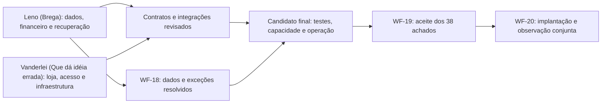

# Plano de execução em dupla para concluir o workflow e preparar produção

**Data:** 08/10/2026.  
**Base inspecionada:** `homologacao_teste`, revisão `f4f936c8e46d40f0310b7930583413c7942d3845`, com documentação e ferramentas locais posteriores ainda não integralmente versionadas.  
**Participantes:** **Leno (Brega)** e **Vanderlei (Que dá idéia errada)**.  
**Acesso e deploy final:** **Vanderlei (Que dá idéia errada)** possui acesso ao Google Cloud e é responsável por executar o deploy final e colocar o projeto em produção após os gates. **Leno (Brega)** entrega o aceite de dados/financeiro e acompanha a implantação nessa frente.  
**Objetivo:** concluir as pendências de WF-18/WF-19, preparar a implantação no Google Cloud e executar WF-20 com evidências e observação.  
**Estado do plano:** execução iniciada por **Leno (Brega)** em 09/10/2026, com blocos locais de L-01 e L-04 aprovados; revisão/integração e demais gates continuam pendentes. A criação original deste documento não executou tarefas, alterou credenciais ou liberou produção.

Os nomes acima são as chaves de identificação dos responsáveis. Um agente deve procurar o nome completo para selecionar atribuições. IDs `L-*` e `V-*` ajudam na rastreabilidade, mas não substituem o campo **Responsável** de cada tarefa.

**Acesso rápido:** [estado e pendências](#3-o-que-já-está-feito-e-o-que-ainda-falta) · [tarefas de Leno (Brega)](#5-pacotes-de-leno-brega) · [tarefas de Vanderlei (Que dá idéia errada)](#6-pacotes-de-vanderlei-que-dá-idéia-errada) · [cobertura dos achados](#7-cobertura-nominal-dos-38-achados-e-dos-critérios-integrados) · [plataformas e variáveis](#9-plataformas-e-uso-correto-das-variáveis) · [prompts para agentes](#104-prompts-de-início-por-responsável) · [gates de liberação](#112-gates-para-produção).

## 1. Divisão principal e como começar

**Entrega de revisão de 09/10/2026:** Leno (Brega) autorizou compartilhar o código/testes atuais de L-01/L-04 e os três documentos em [PACOTE_REVISAO_VANDERLEI](../../../../../PACOTE_REVISAO_VANDERLEI/) pela branch `homologacao_teste`. O [roteiro de revisão](../../../../../PACOTE_REVISAO_VANDERLEI/REVISAO_LENO_L01_L04_PARA_VANDERLEI.md) explica como identificar o commit. Esta publicação prepara a revisão de Vanderlei (Que dá idéia errada); os aceites e gates continuam pendentes. Menções anteriores a entrega local/sem publicação descrevem os checkpoints de testes antes desta autorização.

| Responsável | Frente principal | Primeiro trabalho independente |
|---|---|---|
| **Leno (Brega)** | Núcleo financeiro, checkout no servidor, estoque, pontos, dados legados e coordenação das operações financeiras externas | Preparar L-00 e reproduzir os cenários de recuperação/concorrência de L-01 em Docker |
| **Vanderlei (Que dá idéia errada)** | Experiência da loja, identidade/acesso, frete, fulfillment, métricas, infraestrutura, observabilidade, acesso ao Google Cloud e deploy final de produção | Executar V-00 e iniciar V-01: medir e corrigir a prontidão da home no ambiente local isolado |

Esta divisão usa a continuidade de **Leno (Brega)** com o histórico financeiro e os acessos existentes. Não pressupõe diferença de capacidade técnica entre os participantes. **Vanderlei (Que dá idéia errada)** recebe frentes que podem avançar sobre os contratos atuais, enquanto **Leno (Brega)** fecha as invariantes e a reconciliação do núcleo.

Os dois desenvolvedores podem começar no mesmo momento em clones/worktrees, branches e bancos Docker próprios. O processamento financeiro no Preview compartilhado será uma atividade coordenada, com um operador por janela. Branches diferentes apontadas ao mesmo banco não isolam efeitos.

**Caminho crítico:** resolução dos dados legados e do ciclo financeiro → integração do candidato e validação no ambiente final → aceite integral de WF-19 → implantação/observação de WF-20. Interface, acesso, frete, pacote e infraestrutura podem avançar paralelamente à primeira parte.

## 2. Fontes e ordem de leitura

1. [Workflow principal](../Workflow/WORKFLOW_IMPLEMENTACAO_CORRECOES_LOGICAS.md), especialmente seções 8, 10 e 12.
2. [Registro de execução](../Workflow/REGISTRO_EXECUCAO_CORRECOES_LOGICAS.md), últimas atualizações e seções dos domínios que serão alterados.
3. [Matriz de legados WF-18](../Workflow/MATRIZ_COMPATIBILIDADE_E_RECONCILIACAO_LEGADOS.md).
4. [Matriz integrada WF-19](../Workflow/MATRIZ_HOMOLOGACAO_INTEGRADA_WF19.md), incluindo critérios E01–E14 e LA-001–038.
5. [Contratos comuns](../Workflow/CONTRATOS_COMUNS_CORRECOES_LOGICAS.md).
6. [Guia do agendador e ensaios pontuais](../Workflow/GUIA_AGENDADOR_PAGAMENTOS_HOMOLOGACAO.md).
7. [Relatório histórico de homologação](../../../../HOMOLOGACAO/Relatorio_1/RELATORIO_GERAL_HOMOLOGACAO_E_GUIA_DE_CONTINUIDADE.md).
8. [Estudo de arquitetura de homologação](../../../../HOMOLOGACAO/relatorio_2/ESTUDO_DE_CASO_ARQUITETURA_DE_HOMOLOGACAO_SEGURA_E_REPRODUZIVEL.md).
9. [AGENTS.md](../../../../../AGENTS.md) e código/testes efetivos da revisão atual.

Os checkpoints antigos que dizem “nenhuma integração externa executada” são históricos. As seções posteriores comprovam PIX e e-mail no Sandbox. Da mesma forma, a decisão recente de Google Cloud substitui propostas antigas de produção na Vercel. Havendo conflito aparente, conferir data, revisão e o complemento posterior; não apagar evidências anteriores.

## 3. O que já está feito e o que ainda falta

### 3.1. Base implementada

- Harness com PostgreSQL Docker descartável, identidade/sentinela e recusa de banco/servidor incorretos.
- Migrations ensaiadas em banco vazio, upgrade sintético e clone protegido; 33 migrations nos checkpoints registrados.
- Contratos de tenant, comprador convidado, intenção, revisão, carrinho, reserva, tentativa de pagamento, fatos financeiros, inbox/outbox e efeitos identificados.
- Módulos de estoque/variantes, lotes/pontos, autenticação, frete, checkout, confirmação, expedição/rastreio e indicadores.
- Regressão selecionada em build otimizado e standalone, com duas instâncias; compatibilidade dirigida em instalação Linux limpa.
- Testes de navegador e piloto de capacidade com limites documentados.

Há 36 achados com implementação principal e ensaio de módulo/integração local. **LA-002 e LA-033 continuam parciais.** Implementado não significa validado integralmente no candidato final.

### 3.2. Resultados externos comprovados

| Cenário | Resultado já registrado | Não repetir apenas para obter o mesmo resultado |
|---|---|---|
| Agendador em modo status | Quatro consultas consecutivas corretas no escopo `sandbox-hml` | Critério inicial de acesso/agendamento atendido |
| Consumidor com filas vazias | Três conclusões distintas sem retry/review | Não comprova operação permanente |
| PIX do pedido #1 | Cobrança existente recuperada, QR/copia e cola, pagamento confirmado, pedido Pago e e-mail entregue | Preservar como referência do caminho positivo |
| Mesmo webhook concluído repetido | PROCESSED e filas/efeitos inalterados | Cenário serial de duplicata aprovado |
| Notificação antiga sintética | Entrada consumida sem regressão nem novo efeito | Simulação de aplicação aprovada; não reordenação real do provedor |

Foram corrigidos durante esses ensaios o salvamento de configuração com metadados de imagem, a nulabilidade do contrato Asaas, a alternância visual do QR e a expiração da transação de aplicação de evidência. As revisões foram publicadas apenas na homologação.

**Referência preservada do pedido #1:** Pago; 113 pontos disponíveis; 0 pendentes; quatro movimentações e um crédito de +12; uma confirmação por e-mail. Supervisão de 08/10 às `21:53:02.744Z`: duas inbox COMPLETED, três outbox COMPLETED, sem pendências no agregado apresentado. Isso é estado histórico, não consulta remota realizada ao escrever este plano.

### 3.3. Pendências reais de produção

| Frente | Trabalho restante | Pacotes principais |
|---|---|---|
| WF-18 — dados | Snapshot atual, conciliação de vínculos/estoque/pagamento/pontos, provas e aceite das exceções, backup/restore e trajetória final | L-02, L-03 |
| WF-19 — financeiro | Cancelamento, expiração por método, pagamento tardio, estorno/parcial, boleto/cartão/parcelamento/recusa e efeitos | L-04, L-05 |
| WF-19 — recuperação | Morte antes/depois de I/O/commit, evento antes da resposta, leases e consumidores reais concorrentes | L-01 |
| WF-19 — loja | Identidade, convidado, sessão/reset, carrinho/abas, frete externo, UI/operador, expedição/retirada e métricas | V-02, V-03, V-04, V-05, com L-06 |
| WF-19 — capacidade | Home fora da meta, páginas completas, frio/quente, pool/locks, consumo Neon e infraestrutura final | V-01, V-06, V-07, V-08 |
| WF-19 — operação/candidato | Consumidor permanente, heartbeat/alertas, recuperação, revisão imutável e aceite dos 38 achados | L-07, L-08, V-06, V-07, V-08 |
| WF-20 | Implantação coordenada, integrações de produção, primeiras conciliações e observação | L-09, V-09 |

O snapshot de 04/10 tinha 24 pedidos anteriores ao protocolo, 33 itens sem variante, duas referências remotas sem tentativa e duas carteiras sem contrato contábil pronto, entre outras classes sobrepostas. Não usar essas contagens como inventário atual nem criar fatos retroativos para zerá-las.

O piloto histórico registrou home pronta em cerca de 6,1 s no p95, fora da meta de aproximadamente 1–1,5 s para página completa. Os testes de checkout/HTTP e o build aprovado não encerram essa pendência.

### 3.4. Decisões já recebidas

- Vercel permanece na homologação; produção será no **Google Cloud**.
- **Vanderlei (Que dá idéia errada)** possui acesso ao Google Cloud e assume a coordenação do deploy final e da entrada em produção. **Leno (Brega)** mantém dados, financeiro, migrations e seus respectivos aceites; não se presume acesso dele ao Google Cloud.
- Banco continuará no **Neon Free**; a adequação às cotas precisa ser demonstrada.
- Remetente da loja será configurado em domínio verificado no **Resend** antes da abertura.
- Economia após 00h é uma estratégia a estudar; horário final, executor e política noturna não foram definidos.
- Não há decisão de reduzir o escopo dos 38 achados ou liberar métodos sem homologação. Uma liberação parcial exigiria decisão explícita e bloqueio efetivo no servidor, sem marcar o trabalho omitido como concluído.

## 4. Regras para trabalhar simultaneamente

### 4.1. Baseline comum e branches

**Leno (Brega) — L-00:** preparar uma base de colaboração contendo código, documentação e ferramentas necessárias. Há scripts de homologação/testes de scripts e relatórios ainda locais; um clone remoto do HEAD pode não contê-los. Revisar arquivos individualmente, excluir segredos e registrar o commit escolhido como `BASE_DUPLA`. Não usar `git add .` indiscriminadamente.

**Vanderlei (Que dá idéia errada) — V-00:** trabalhar em clone ou worktree próprio, verificar dependências/Docker e executar o harness existente. Pode iniciar V-01 sobre a revisão de código disponível enquanto **Leno (Brega)** organiza a documentação operacional; não precisa das credenciais remotas para esse trabalho.

Convenção proposta de branches:

| Responsável | Prefixo | Exemplo |
|---|---|---|
| **Leno (Brega)** | `trabalho/leno/` | `trabalho/leno/recuperacao-financeira` |
| **Vanderlei (Que dá idéia errada)** | `trabalho/vanderlei/` | `trabalho/vanderlei/home-prontidao` |

Ambas partem da `BASE_DUPLA` ou de integração posterior identificada. Nenhum trabalho deve ocorrer por troca de branch na mesma pasta usada pelo outro desenvolvedor. Rebase/merge deve preservar commits do colega; não fazer force-push na branch compartilhada.

`homologacao_teste` continua sendo a branch de integração do Preview financeiro. **Leno (Brega)** coordena sua atualização e a reserva de sessão. Branch `main` e publicação de produção permanecem fora dos PRs de implementação; **Vanderlei (Que dá idéia errada)** define e executa o fluxo de produção no Google Cloud em V-09, com preparação e acompanhamento de dados/financeiro de L-09.

### 4.2. Antes de publicar branches pessoais

**Leno (Brega)** deve conferir o escopo das variáveis gerais de Preview, variáveis específicas da branch e deployments automáticos. **Vanderlei (Que dá idéia errada)** deve confirmar esse resultado antes de publicar uma branch com execução externa habilitada.

Variáveis gerais de Preview podem ser aplicadas às branches pessoais; variáveis específicas podem sobrescrevê-las. Uma branch nova não deve herdar silenciosamente o banco financeiro e segredos com flags ativas. Alterações de variáveis exigem um novo deployment para serem aplicadas. [Documentação Vercel](https://vercel.com/docs/environment-variables).

Até essa conferência, usar testes locais e não ativar Preview pessoal com integrações. Para um Preview pessoal necessário, provisionar configuração isolada e desabilitar capacidades externas até a prova de escopo; não apontá-lo ao banco compartilhado apenas por conveniência. Este plano não exige contratar ambientes adicionais.

### 4.3. Propriedade de arquivos e contratos

| Área | Responsável por alterações principais | Regra de integração |
|---|---|---|
| `services/payment/`, `services/asaas/`, operações financeiras e expiração | **Leno (Brega)** | **Vanderlei (Que dá idéia errada)** consome contrato/testes e solicita mudanças por tarefa identificada |
| `lib/commerce/order-command.ts`, intenção/compra no servidor, carteira, estoque, `services/cart.service.ts` | **Leno (Brega)** | Efeitos e invariantes centrais sob uma única autoria de integração |
| `prisma/schema.prisma`, novas migrations, scripts de clone/backfill | **Leno (Brega)** | Mudanças pedidas por **Vanderlei (Que dá idéia errada)** são acordadas antes; não criar migrations concorrentes conflitantes |
| `components/home/`, confirmação/checkout/carrinho no cliente, Admin visual | **Vanderlei (Que dá idéia errada)** | Não redefinir semântica financeira na UI; cenários de estoque/efeitos revisados por **Leno (Brega)** |
| Auth, tenant, comprador convidado, frete/cache, DTOs seguros | **Vanderlei (Que dá idéia errada)** | Contratos usados pelo checkout são revisados com **Leno (Brega)** |
| Fulfillment, rastreio e métricas | **Vanderlei (Que dá idéia errada)** | Comando central e produtores de fatos permanecem com **Leno (Brega)**; mudanças de contrato entram separadas |
| Harness genérico, CI, pacote, observabilidade e infraestrutura | **Vanderlei (Que dá idéia errada)** | **Leno (Brega)** mantém testes específicos financeiros e revisa isolamento do consumidor |
| Scripts externos do caso financeiro e fixtures de replay | **Leno (Brega)** | Não alterar destino/identidade durante uma janela do outro participante |
| Templates/provedor de e-mail e domínio/remetente | **Vanderlei (Que dá idéia errada)** | Contrato/idempotência da outbox pertence a **Leno (Brega)**; ambos integram antes da sessão externa |

A propriedade não impede revisão ou colaboração. Ela evita duas mudanças incompatíveis no mesmo núcleo. Se uma tarefa precisar de arquivo da outra frente, registrar o contrato desejado e combinar quem fará aquele patch; enquanto isso, avançar nos testes, UI ou preparação independentes.

### 4.4. Contratos a preservar antes de paralelizar alterações

| Contrato | Responsável primário | Consumidor/revisor | Evidência exigida para mudar |
|---|---|---|---|
| Resultado da intenção/compra e instruções de pagamento | **Leno (Brega)** | **Vanderlei (Que dá idéia errada)** | Schema/estados, exemplos sanitizados e testes de consumidor |
| Frete, ownership e origem canônica | **Vanderlei (Que dá idéia errada)** | **Leno (Brega)** | Revisão de determinantes, autenticação e aceitação no checkout |
| Transição de pedido, devolução e expedição | **Leno (Brega)** | **Vanderlei (Que dá idéia errada)** | Invariantes de estoque/fatos e comandos permitidos por modalidade |
| Payload de e-mail e identidade do efeito | **Leno (Brega)** | **Vanderlei (Que dá idéia errada)** | Compatibilidade de filas já persistidas, remetente/links e repetição |
| Supervisão, execução e heartbeat | **Vanderlei (Que dá idéia errada)** | **Leno (Brega)** | Separação de consulta/execução, autenticação, prazo e progresso real |
| Schema/migrations | **Leno (Brega)** | **Vanderlei (Que dá idéia errada)** | Expansão compatível, rollback/roll-forward e testes sobre a mesma trajetória |

DTOs e regras atuais são a base inicial. Não é necessário esperar uma reescrita completa do backend para começar frontend, infraestrutura ou testes. Mudanças de contrato novas devem ser pequenas, explícitas e integradas antes dos consumidores dependentes.

### 4.5. Ambiente compartilhado não é fila pessoal

O executor atual usa o escopo da conta e pode consumir trabalho pronto de várias operações. `limit=1` não seleciona “o pedido de quem chamou” e não garante um único efeito externo no lote.

**Leno (Brega)** coordena uma única janela ativa no Preview financeiro, registrando operador, deployment, objetivo, referências, flags, início/fim e trabalho esperado. **Vanderlei (Que dá idéia errada)** solicita essa janela para testes externos de UI, frete/e-mail ou acesso que interfiram nos mesmos dados; continua executando trabalho local durante outra sessão.

Não mudar webhook, segredo, flags, allowlist, remetente ou deployment durante a sessão do colega. Se for necessária uma intervenção, encerrar ou transferir formalmente a janela, preservando trabalho em andamento. Um aviso informal “estou testando” não autoriza dois processadores concorrentes em cenário que não foi preparado como teste de concorrência.

## 5. Pacotes de Leno (Brega)

### L-00 — Base compartilhada e acesso controlado

**Responsável: Leno (Brega).** **Revisor: Vanderlei (Que dá idéia errada).**

- Disponibilizar documentos, scripts e testes locais apropriados sem incluir `.env`, backups ou credenciais.
- Registrar `BASE_DUPLA`, estado do Preview, contas/tenant e regras de publicação de branches pessoais.
- Compartilhar segredos privadamente, separados por plataforma/ambiente; conferir a rotação do bypass exposto anteriormente, cuja conclusão não está comprovada.
- Registrar acesso nominal e procedimento de reserva do Preview; preservar o pedido #1.

**Pode iniciar agora:** sim. **Aceite:** o clone de **Vanderlei (Que dá idéia errada)** contém o material necessário, inicia o harness e não herda destinos financeiros indevidos. A coleta de segredos não deve atrasar V-01 local.

### L-01 — Recuperação financeira, concorrência e falhas entre processos

**Responsável: Leno (Brega).** **Revisor: Vanderlei (Que dá idéia errada).**

**Checkpoint de 09/10/2026:** primeiro bloco local aprovado na branch `trabalho/leno/l01-recuperacao-financeira`, base `e0214e699b71de51696133de19808a1f8dbdc795`: 12 cenários novos entre processos e 40 regressões existentes passaram, além de duas provas negativas de isolamento. Corrigida a resposta atrasada do checkout que regredia o status Asaas após aprovação pelo webhook. [Evidências, reprodução e limites](../../../../../PACOTE_REVISAO_VANDERLEI/L-01-RECUPERACAO_FINANCEIRA_PROCESSOS.md). Revisão de **Vanderlei (Que dá idéia errada)**, integração/publicação e demais pontos de falha continuam pendentes; L-01 não está encerrado. Nenhuma sessão externa foi aberta.

**Segundo checkpoint de 09/10/2026 — Leno (Brega):** adicionados nove casos de interrupção da transação inicial e de cancelamento/estorno integral em transporte controlado. Execução conjunta final: **61 aprovados** (21 entre processos + 40 regressões), TypeScript/lint aprovados. Retomada conserva estoque, fatos e compensação de pontos; operação sem prova gera revisão após o prazo, sem permissão de reenvio pelo replay administrativo. Detalhes na seção 6 da evidência acima. Nenhuma nova correção de produção foi necessária neste bloco. Próxima entrega: revisão/consolidação com **Vanderlei (Que dá idéia errada)** e preparação do ciclo financeiro L-04; contratos externos, métodos restantes, infraestrutura final e aceite integral seguem pendentes.

**WF/critério:** WF-14/19; E07/E08; LA-003/004/005/010/011/012/013 e integração com LA-027/033.

- Completar morte real do processo antes/depois de I/O e commit, evento antes da resposta do checkout e retomada por outro executor.
- Conferir lease vencida, executor antigo, consumidores simultâneos e proteção da conclusão.
- Provar uma emissão quando o contrato permite, resultado incerto recuperável e efeito de negócio único, incluindo outbox.
- Testar conflito de identidade/conteúdo e referências de outra conta, valor ou método.

**Ambiente:** Docker e transporte controlado primeiro; Sandbox apenas para integração dirigida necessária. **Entrega:** testes reproduzíveis, correções pertinentes e evidência por ponto de falha. **Dependência:** nenhuma tarefa de **Vanderlei (Que dá idéia errada)** para começar. **Aceite:** invariantes persistidas após falha/retomada, sem inferir aprovação pela resposta HTTP.

### L-02 — Inventário atual e resolução de legados

**Responsável: Leno (Brega).** **Revisor: Vanderlei (Que dá idéia errada).**

**WF/critério:** WF-18; E02/E03/E09/E13; LA-002/018/019/021/022/027/030/033.

- Atualizar snapshot/clone em procedimento autorizado e proteger o artefato; começar pela releitura do inventário existente.
- Conciliar por ocorrência vínculos de variantes, baixa/reserva/restituição, referências de gateway, fatos financeiros, autoria e carteira.
- Registrar origem demonstrável, decisão de negócio, operações posteriores ao snapshot e tratamento de exceções.
- Não inventar reserva, fato de pagamento, variante ou lote de pontos a partir de status/saldo/nome.

**Entrega:** inventário atualizado, plano de tratamento com antes/depois e bloqueios de escritores coerentes. **Dependência externa real:** provas históricas/físicas/financeiras que não existam no código. **Alternativa enquanto aguarda provas:** avançar L-01/L-04/L-06; não fabricar dados para evitar espera. **Aceite:** casos resolvidos ou exceções operacionais explicitamente tratadas conforme WF-18.

### L-03 — Schema, migrations, restauração e contrato dos dados

**Responsável: Leno (Brega).** **Revisor: Vanderlei (Que dá idéia errada).**

**WF/critério:** WF-03/18/20; E02; LA-030 e contratos dos módulos afetados.

- Consolidar solicitações de schema das duas frentes antes de gerar migrations incompatíveis.
- Ensaiar vazio, upgrade, clone atualizado, interrupção, replay, constraints e preservação de sequências/dados.
- Planejar expansão compatível e eventual contração, volume, locks, janela e caminho de recuperação.
- Fornecer a **Vanderlei (Que dá idéia errada)** o contrato de migration e o comando operacional ensaiado para o pacote Google Cloud.

**Pode iniciar agora:** preparação e testes sintéticos; fechamento depende dos dados/regras efetivamente alterados. **Aceite:** trajetória identificada e restaurável no candidato, sem executar migrations de produção no build genérico nem em teste de terceiro.

### L-04 — Ciclo financeiro completo e métodos

**Responsável: Leno (Brega).** **Revisor: Vanderlei (Que dá idéia errada).**

**Checkpoint local de 09/10/2026:** oito novos casos de prazos/métodos e aplicação financeira com banco lento. Duas regressões de transação expirada no checkout/expiração foram demonstradas e corrigidas com a política existente de aplicação de evidência. Execução final: **90 testes em quatro suítes**, TypeScript/lint aprovados. [Evidência, limites e roteiro externo](../../../../../PACOTE_REVISAO_VANDERLEI/L-04-CICLO_FINANCEIRO_LOCAL_E_ENSAIOS_EXTERNOS.md). [Material de revisão para Vanderlei (Que dá idéia errada)](../../../../../PACOTE_REVISAO_VANDERLEI/REVISAO_LENO_L01_L04_PARA_VANDERLEI.md) preparado; revisão e publicação pendentes. Métodos/capacidades reais da conta, política comercial, estorno de valor parcial, chargeback e devolução física não foram encerrados. Nenhuma operação externa nesta rodada.

**WF/critério:** WF-12/14/19; E06/E07/E08/E13; LA-005/009/010/023/033/035.

- Completar PIX: cancelamento, expiração, pagamento tardio e estorno, com efeitos e corridas pertinentes.
- Ensaiar boleto e cartão 1x/parcelado/recusa conforme capacidades reais da conta; conferir datas, encargos, valores, identidade e contrato.
- Implementar/corrigir produtores reais de fatos para devolução parcial/chargeback quando aplicáveis ao escopo; não encerrar com fato sintético apenas.
- Conferir limites e política comercial; não habilitar parcelamento por presença de botão ou chave.
- Criar casos novos para destruição/estorno/expiração, preservando a evidência do pedido #1.

**Paralelo com:** V-01 a V-06. **Ponto de integração:** UI de método/estado com V-02 e devolução/indicadores com V-05. **Aceite:** contrato externo e efeitos locais demonstrados por método/ciclo; recursos sem aceite seguem bloqueados no servidor e continuam pendentes.

### L-05 — Pontos, devolução física e conservação dos efeitos

**Responsável: Leno (Brega).** **Revisor: Vanderlei (Que dá idéia errada).**

**WF/critério:** WF-06/09/18/19; E09/E13; LA-002/021/022/023/032/033.

- Completar origem/lotes/FEFO, expiração, resgate, ganho congelado, déficit quando o crédito já foi gasto e repetição das compensações.
- Conciliar carteiras antigas e registrar aceite das regras de base/arredondamento/prazo.
- Definir e provar o contrato entre estorno financeiro e devolução física/parcial; um não prova automaticamente o outro.
- Entregar a V-05 estados, fatos, valores e critérios de LTV/ticket após estorno, sem criar duplo reconhecimento.

**Aceite:** movimentos identificados, saldos/lotes/dívida conservados e evidência operacional; leitura não cria carteira/ledger. **Dependências:** dados históricos de L-02 e integração do ciclo financeiro de L-04 para conclusão externa, com testes sintéticos disponíveis desde o início.

### L-06 — Checkout no servidor, estoque e carrinho concorrentes

**Responsável: Leno (Brega).** **Revisor: Vanderlei (Que dá idéia errada).**

**WF/critério:** WF-05/06/07/08/13/19; E03/E04; LA-001/004/011/012/013/015/017/018/019/027.

- Completar disputa da última unidade, catálogo/Admin concorrente, retirada de variante, revisão e restituição indisponível.
- Conferir intenção, consentimento, compra única, consumo do carrinho e inventário final de escritores alternativos.
- Preservar as regras de variantes do AGENTS.md e IDs persistidos; não escolher variante sem estoque nem reassociar vínculos antigos por inferência.
- Integrar os cenários de abas/dispositivo da V-02 e ownership/convidado da V-03.

**Pode iniciar agora:** sim, no Docker. **Aceite:** banco e respostas coerentes entre instâncias e replay, além de conferência final da UI com **Vanderlei (Que dá idéia errada)**.

### L-07 — Integração do consumidor com operação permanente

**Responsável: Leno (Brega).** **Revisor: Vanderlei (Que dá idéia errada).**

- Entregar contrato de processamento, autenticação, limites, retries/review, duração/lease e supervisão para V-06/V-07.
- Integrar eventual acionamento durável por demanda com o executor escolhido; webhook que apenas persiste READY não é consumidor.
- Cobrir recuperação, expiração financeira e expiração de fidelidade; não deixar uma rotina fora do inventário operacional.
- Validar que economia de consultas e cadência não violam prazos de pagamento, reconciliação ou expiração.

**Dependência real:** arquitetura do executor e contrato de autenticação preparados em V-06. Antes disso, trabalhar com adapter de acionamento controlado e contratos, sem criar uma fila fictícia no caminho real. **Aceite:** progresso sem navegador aberto, falha/retomada demonstrada, trabalho durável e atraso compatível com a política aprovada.

### L-08 — Consolidação financeira e aceite de WF-18/WF-19

**Responsável: Leno (Brega).** **Revisor: Vanderlei (Que dá idéia errada).**

- Consolidar critérios de todos os LA atribuídos a **Leno (Brega)**, por revisão e evidência.
- Integrar PRs revisados em `homologacao_teste`, reservar sessões e preservar os contratos acordados.
- Fechar WF-18 e fornecer o aceite de dados/financeiro para o candidato de V-08.
- Confirmar ausência de efeitos duplicados, pendências inexplicadas e exceções sem procedimento.

**Aceite:** dados e cenários pertinentes aprovados no candidato combinado; não converter totais históricos de testes em nova execução.

### L-09 — Prontidão de dados e acompanhamento financeiro da implantação

**Responsável: Leno (Brega).** **Responsável pelo deploy final: Vanderlei (Que dá idéia errada).**

- Entregar a **Vanderlei (Que dá idéia errada)** o parecer de prontidão de dados/financeiro, contas/escopos e restrições depois dos gates anteriores, para compor a decisão de go/no-go da implantação.
- Conduzir a preparação e validação da trajetória de dados, com backup e pontos de parada. Quando a execução depender do Google Cloud, fornecer o procedimento ensaiado para **Vanderlei (Que dá idéia errada)** executá-lo na janela combinada; não pressupor acesso de Leno à nuvem.
- Coordenar com **Vanderlei (Que dá idéia errada)** a habilitação gradual de capacidades financeiras e realizar as primeiras conciliações.
- Acompanhar estoque, pontos, fatos, cobrança, estorno e backlog nos ciclos de observação.
- Encerrar achados somente com resultado operacional; conter novas operações afetadas sem apagar a recuperação das existentes.

**Dependência obrigatória para execução em produção:** aceite integral de WF-18/WF-19 e janela/infraestrutura/contingência preparadas por **Vanderlei (Que dá idéia errada)** em V-09. A entrega do parecer e dos procedimentos acontece antes do deploy; a observação financeira acompanha a publicação. Preparação pode começar antes; ativação de produção não.

## 6. Pacotes de Vanderlei (Que dá idéia errada)

### V-00 — Ambiente local, onboarding e mapa de configuração

**Responsável: Vanderlei (Que dá idéia errada).** **Revisor: Leno (Brega).**

- Ler as fontes e regras locais, conferir revisão/material não versionado e criar clone/worktree próprio.
- Preparar Node, dependências pelo lockfile, Docker e navegador conforme o harness.
- Executar os testes negativos de isolamento e uma seleção dirigida antes de escrever fixtures.
- Classificar a configuração recebida por plataforma sem expor valores; separar execução Docker de acesso ao Preview.

**Pode iniciar agora:** sim, sem credenciais externas. **Aceite:** teste no banco descartável próprio, teardown confirmado e nenhuma conexão implícita ao Neon compartilhado.

### V-01 — Prontidão da home e desempenho percebido

**Responsável: Vanderlei (Que dá idéia errada).** **Revisor: Leno (Brega).**

**WF/critério:** WF-19/E11/E14.

- Reproduzir a espera de vídeo/fallback/animação de `components/home/HeroVideo.tsx` e medir conteúdo/ações prontos.
- Corrigir a experiência para disponibilizar conteúdo e ações no prazo pretendido, mantendo intenção visual e alternativas de mídia.
- Medir condições frias/quentes, mídia efetiva, dispositivos/rede definidos e acessibilidade pertinente.
- Separar HTTP/load/prontidão; não declarar página rápida pelo tempo da API.

**Pode iniciar agora:** sim; não depende de novo backend. **Aceite:** melhoria reproduzida, meta demonstrada nas condições acordadas e regressão visual/funcional controlada; ensaio final no Google Cloud continua em V-08.

### V-02 — Checkout, carrinho e confirmação no navegador

**Responsável: Vanderlei (Que dá idéia errada).** **Revisor: Leno (Brega).**

**WF/critério:** WF-15/19; E04/E11; LA-007/016/024/025/034, integração com LA-001/004/015/017.

- Completar matriz de dispositivos/navegadores, abas, troca de identidade, reload, storage indisponível e respostas fora de ordem.
- Conferir endereços de cobrança/entrega por método/modalidade, falhas de frete e estado persistido do carrinho.
- Preservar a solução validada do QR: atualização discreta, validade limitada, coalescência e suspensão de ações quando necessário.
- Usar fixtures controladas para todos os estados enquanto L-04 valida contratos remotos; depois integrar o mesmo contrato aprovado.

**Aceite:** UI e ações coerentes com DTO/estado real, inclusive recusa/cancelamento/expiração/estorno; não inventar estados de backend para concluir uma tela.

### V-03 — Identidade, acesso, recuperação e segurança de dados expostos

**Responsável: Vanderlei (Que dá idéia errada).** **Revisor: Leno (Brega).**

**WF/critério:** WF-02/05/10/19; E05/E12; LA-014/020/028/029/038.

- Completar tenant/ownership/convidado, domínios/proxy/cookies, reset e revogação de sessão no candidato.
- Ensaiar recuperação administrativa e política de privilégios/IAM/MFA aplicável; impedir bloqueio do último Admin válido.
- Conferir DTOs, canários e exposição de segredos no público/Admin/cache/logs; documentar rotação necessária sem copiar valores.
- Conferir upload/storage quando os fluxos de catálogo/avatar forem exercitados, usando recursos de teste isolados; não sobrescrever mídia de produção.

**Aceite:** testes de leitura/escrita alheia recusados, recuperação real de e-mail/links verificada e acesso administrativo recuperável. **Dependência para fechamento:** domínio final de V-06 e remetente de V-07, sem impedir ensaios locais desde o início.

### V-04 — Frete, cotação e cache distribuído

**Responsável: Vanderlei (Que dá idéia errada).** **Revisor: Leno (Brega).**

**WF/critério:** WF-11/15/19; E10; LA-007/008/031.

- Conferir transportadoras/modalidades realmente usadas e seus contratos, credenciais e endereços de teste.
- Ensaiar cotação autoritativa, preço/geografia/revisão, revogação e falha externa sem entrega grátis fictícia.
- Verificar consistência entre processos, assinatura e segredo compartilhado correto, e integração com aceite do checkout de L-06.
- Exercitar regras de retirada/sem entrega e cobrança separada de endereço.

**Aceite:** transporte real dirigido e casos controlados aprovados; credenciais privadas não aparecem no DTO. Dados de origem/logística necessários são solicitados ao responsável do negócio, não inventados pelo agente.

### V-05 — Operação comercial, Admin e métricas

**Responsável: Vanderlei (Que dá idéia errada).** **Revisor: Leno (Brega).**

**WF/critério:** WF-16/17/19; E03/E13; LA-026/036/037, integração com LA-002/018/019/027/033.

- Completar expedição, rastreio, retirada, confirmação física, autoria e ações do Admin por modalidade.
- Conferir edição concorrente e UI de catálogo/variantes com o contrato de estoque de L-06.
- Completar LTV/ticket, lista/perfil e cobertura parcial de legados; revisar consultas/EXPLAIN no volume pertinente.
- Consumir estados/fatos de estorno e devolução de L-04/L-05, sem escrever reconhecimento financeiro diretamente para fazer um indicador passar.

**Pode iniciar agora:** UI, regras atuais e testes com fatos controlados. **Espera necessária para fechamento:** produtores/parciais e reconciliação de L-02/L-04/L-05. **Aceite:** critério comercial confirmado e métricas coerentes com evidências, não só status do pedido.

### V-06 — Pacote e arquitetura Google Cloud

**Responsável: Vanderlei (Que dá idéia errada).** **Revisor: Leno (Brega).**

- Preparar decisão técnica de serviço, região, custos, limites, domínio/TLS, segredos, conexão/pool e estratégia de publicação.
- Avaliar **Cloud Run** como candidato para o Next/standalone já ensaiado; Google Cloud foi decidido, Cloud Run ainda é proposta técnica. Produzir artefato reproduzível e configuração revisável antes de provisionamento que gere custo.
- Definir consumidor/acionamento/recuperação e compatibilidade de autenticação com L-07; não copiar o Worker de homologação como solução permanente sem análise.
- Conferir build/runtime, assets, Prisma, origem canônica, cookies, proxy, startup, shutdown e comportamento entre instâncias.
- Preparar ensaio no destino final antes de abrir vendas, sem misturar o Sandbox com banco/credenciais de produção.

**Pode iniciar agora:** análise, empacotamento local, teste Linux e IaC/configuração proposta. **Vanderlei (Que dá idéia errada)** já possui acesso ao Google Cloud e verifica projeto, IAM, billing, região e serviço; acesso não comprova que esses recursos já estejam configurados. Custos e domínio são alinhados com seus titulares quando necessário, com **Leno (Brega)** revisando impactos em dados/financeiro. O contrato do consumidor L-07 é dependência para fechamento. A preparação desses itens não depende de todos os testes financeiros terminarem.

### V-07 — Observabilidade, custo Neon e e-mail de produção

**Responsável: Vanderlei (Que dá idéia errada).** **Revisor: Leno (Brega).**

- Implementar/validar heartbeat de execução real, idade do backlog, retries/review, ausência de progresso e procedimento de atendimento.
- Projetar medição de consumo, pool, consultas vazias e acionamento compatível com Neon Free, incluindo eventual redução noturna sem abandonar trabalho.
- Inventariar pagamentos, reconciliação, expiração de pedidos e expiração de pontos; planejar executor de cada rotina e seus prazos.
- Configurar ao final domínio/remetente Resend da loja, destinatários de teste externos, links e autorização da chave; testar confirmação e recuperação de senha.
- Conferir semântica de payloads já persistidos na outbox: trocar `EMAIL_FROM` não altera automaticamente mensagens antigas. Qualquer reprocessamento depende do contrato de L-07.

**Aceite:** alertas testados e responsáveis identificados, consumo/latência medidos e envio externo verificado. **Leno (Brega)** revisa prazo financeiro e recuperação; economia não justifica desligar recepção/consumo de obrigações em andamento.

### V-08 — CI, regressão do candidato e capacidade final

**Responsável: Vanderlei (Que dá idéia errada).** **Revisor: Leno (Brega).**

**WF/critério:** WF-19/E01/E11/E14 e consolidação dos demais critérios.

- Manter seleção auditada, guardas de CI, pacote e duas instâncias; executar testes afetados e regressão pertinente ao candidato combinado.
- Medir páginas completas, fluxo financeiro e carga no ambiente final com plano de ensaio e cotas, sem carga irrestrita no Neon compartilhado.
- Registrar commit/schema/artefato/configuração, versões e evidências; não somar rodadas históricas sobrepostas como novos testes.
- Produzir parecer de infraestrutura/UI/segurança/capacidade; integrar com aceite de dados/financeiro de L-08.

**Pode iniciar agora:** harness/CI/perfis e medições locais; **fechamento depende** das integrações e do candidato congelado. **Aceite:** todos os critérios aplicáveis registrados na mesma revisão e riscos/limites resolvidos para o escopo liberado.

### V-09 — Deploy final, entrada em produção e observação operacional

**Responsável: Vanderlei (Que dá idéia errada).** Possui acesso ao Google Cloud e coordena/executa o deploy final e a entrada em produção. **Responsável pelo aceite de dados/financeiro e acompanhamento dessa frente: Leno (Brega).**

- Consolidar a decisão de go/no-go após os gates e o parecer de dados/financeiro de **Leno (Brega)**; registrar candidato, escopo, janela e responsáveis.
- Usar seu acesso ao Google Cloud para executar o deploy final e colocar o projeto em produção na janela definida, coordenando migrations e capacidades com **Leno (Brega)**.
- Conferir DNS/TLS/cookies, segredos, webhook final, filas, jobs, alertas e links de e-mail.
- Demonstrar backup/restauração/contingência e acompanhar capacidade/consumo e progresso dos consumidores.
- Registrar a revisão implantada, verificações posteriores e critérios para conter ampliação.

**Dependência obrigatória:** L-08/V-08 concluídos, parecer e procedimentos de dados/financeiro de L-09 entregues e janela coordenada por **Vanderlei (Que dá idéia errada)** com **Leno (Brega)**. A atribuição de responsabilidade não dispensa os gates nem inicia um deploy agora. **Aceite:** runtime e operação observados em conjunto com os ciclos financeiros de L-09; deploy Ready sozinho não encerra WF-20.

## 7. Cobertura nominal dos 38 achados e dos critérios integrados

Esta é a matriz de responsabilidade primária. As pendências resumidas não substituem os critérios das propostas e da matriz WF-19. O responsável conduz correção, evidência e fechamento; a outra pessoa revisa. Uma tarefa que cruza frentes pode ter colaboradores, mas não fica sem responsável.

| Achado | Responsável primário | Pacotes | Fechamento ainda necessário |
|---|---|---|---|
| LA-001 | **Leno (Brega)** | L-06; integração V-05 | Identidade da variante, estoque e operação do Admin no candidato |
| LA-002 | **Leno (Brega)** | L-02/L-04/L-05; integração V-05 | Completar transições, legado, devolução física/parcial e efeitos únicos |
| LA-003 | **Leno (Brega)** | L-01/L-07 | Inbox/outbox diante de falha real, concorrência e recuperação |
| LA-004 | **Leno (Brega)** | L-06; integração V-02 | Intenção durável em abas/dispositivos e contrato financeiro real |
| LA-005 | **Leno (Brega)** | L-02/L-04 | Reconciliação de pedido, reserva, financeiro e obrigações antigas |
| LA-006 | **Vanderlei (Que dá idéia errada)** | V-00/V-08 | Isolamento verificável de CI, harness e candidato |
| LA-007 | **Vanderlei (Que dá idéia errada)** | V-04 | Contrato de cotação na UI com transportadora/configuração real |
| LA-008 | **Vanderlei (Que dá idéia errada)** | V-04; integração L-06 | Cotação autoritativa e assinatura válida entre instâncias |
| LA-009 | **Leno (Brega)** | L-04 | Cartão 1x/parcelado, centavos, taxas e contrato da conta |
| LA-010 | **Leno (Brega)** | L-04/L-07 | Expiração por método, corrida com pagamento e executor |
| LA-011 | **Leno (Brega)** | L-06; integração V-03 | Idempotência por identidade/tenant no domínio final |
| LA-012 | **Leno (Brega)** | L-01/L-06; integração V-02 | Replay do estado real após falhas externas e restart |
| LA-013 | **Leno (Brega)** | L-06 | Inventário final de rotas e writers que aceitam compras |
| LA-014 | **Vanderlei (Que dá idéia errada)** | V-03; integração L-06 | Ownership/tenant sob domínio, proxy e dados atuais |
| LA-015 | **Leno (Brega)** | L-06; integração V-02 | Consumo único do carrinho entre instâncias e dispositivos |
| LA-016 | **Vanderlei (Que dá idéia errada)** | V-02 | Ciclo do carrinho com reload, identidade e navegadores |
| LA-017 | **Leno (Brega)** | L-06; integração V-08 | Mutações concorrentes, revisão, pool e locks |
| LA-018 | **Leno (Brega)** | L-02/L-06; integração V-05 | Variante retirada sem perder vínculos ou reabrir estoque |
| LA-019 | **Leno (Brega)** | L-06; integração V-05 | Catálogo e ajustes de estoque sob operação concorrente |
| LA-020 | **Vanderlei (Que dá idéia errada)** | V-03; integração L-06 | Convidado separado de conta, identidade e cadastro histórico |
| LA-021 | **Leno (Brega)** | L-02/L-05 | Origem/prazo de pontos e carteiras legadas conciliadas |
| LA-022 | **Leno (Brega)** | L-05/L-07; integração V-07 | Expiração por lote e rotina operacional observada |
| LA-023 | **Leno (Brega)** | L-04/L-05 | Ganho congelado, arredondamento e política comercial |
| LA-024 | **Vanderlei (Que dá idéia errada)** | V-02/V-04; integração L-04 | Cobrança e entrega separadas em métodos reais |
| LA-025 | **Vanderlei (Que dá idéia errada)** | V-02 | Confirmação completa por estado/método sem regressão do QR |
| LA-026 | **Vanderlei (Que dá idéia errada)** | V-05; integração L-06 | Expedição/rastreio com persistência, autoria e transportadora |
| LA-027 | **Leno (Brega)** | L-02/L-04; integração V-05 | Histórico e autoria no commit, incluindo legado |
| LA-028 | **Vanderlei (Que dá idéia errada)** | V-03/V-07 | Reset atômico, e-mail real, cookies e revogação |
| LA-029 | **Vanderlei (Que dá idéia errada)** | V-03 | Último Admin, privilégios e recuperação administrativa |
| LA-030 | **Leno (Brega)** | L-03 | Trajetória de migrations/restore em clone atual e volume adequado |
| LA-031 | **Vanderlei (Que dá idéia errada)** | V-04/V-06 | Determinantes de cache e revogação no deployment final |
| LA-032 | **Leno (Brega)** | L-05; integração V-03 | Carteira da identidade correta e leitura sem efeitos |
| LA-033 | **Leno (Brega)** | L-02/L-04/L-05 | Completar atores/fatos, legado e devoluções físicas/parciais |
| LA-034 | **Vanderlei (Que dá idéia errada)** | V-02/V-05 | Respostas assíncronas em abas/UI/leitores alternativos |
| LA-035 | **Leno (Brega)** | L-04; integração V-02/V-06 | Capacidade real de cada método/conta antes da reserva |
| LA-036 | **Vanderlei (Que dá idéia errada)** | V-05; integração L-02/L-04 | LTV/ticket por fatos reais, legado e consultas em volume |
| LA-037 | **Vanderlei (Que dá idéia errada)** | V-05; integração L-06 | Transições de entrega/retirada e aceite operacional |
| LA-038 | **Vanderlei (Que dá idéia errada)** | V-03/V-04 | DTO sem segredos, exposição histórica e credenciais de frete |

Os critérios transversais também têm uma pessoa responsável por consolidar a evidência:

| Critério | Responsável pela consolidação | Pacotes e integração |
|---|---|---|
| E01 — isolamento | **Vanderlei (Que dá idéia errada)** | V-00/V-08; todos os ensaios usam o harness |
| E02 — schema/recuperação | **Leno (Brega)** | L-02/L-03 |
| E03 — inventário | **Leno (Brega)** | L-06 com UI/operador de V-05 |
| E04 — intenção/carrinho | **Leno (Brega)** | L-06 com V-02 |
| E05 — identidade | **Vanderlei (Que dá idéia errada)** | V-03 com L-06 |
| E06 — valores/métodos | **Leno (Brega)** | L-04 com V-02 |
| E07 — falhas remotas | **Leno (Brega)** | L-01 |
| E08 — eventos/jobs | **Leno (Brega)** | L-01/L-07 com V-06/V-07 |
| E09 — carteira | **Leno (Brega)** | L-05 |
| E10 — frete/cache | **Vanderlei (Que dá idéia errada)** | V-04 com L-06 |
| E11 — experiência | **Vanderlei (Que dá idéia errada)** | V-01/V-02/V-05 |
| E12 — autenticação/Admin | **Vanderlei (Que dá idéia errada)** | V-03/V-07 |
| E13 — operação comercial | **Vanderlei (Que dá idéia errada)** | V-05, integrado aos fatos e legados de L-02/L-04/L-05 |
| E14 — produção técnica | **Vanderlei (Que dá idéia errada)** | V-06/V-07/V-08, integrado à recuperação de L-03/L-07 |

## 8. Sequência de execução e dependências que não podem ser eliminadas

As ondas abaixo são marcos, não estimativas de dias. Definir prazo após reproduzir a base, medir o esforço das lacunas e obter as decisões externas. Não prometer data de produção contando apenas quantidade de tarefas.

| Onda | **Leno (Brega)** | **Vanderlei (Que dá idéia errada)** | Saída e sincronização |
|---|---|---|---|
| 0 — início paralelo | L-00; inventário L-02; testes locais L-01 | V-00; diagnóstico V-01; desenho V-06 | Base identificada, ambientes próprios e contratos conhecidos |
| 1 — avanços independentes | L-01, L-02/L-03; casos financeiros locais L-04 | V-01, V-03, V-04; pacote local V-06 | PRs pequenos, regressões dirigidas e dúvidas de contrato resolvidas |
| 2 — integração por contrato | L-04/L-05/L-06; sessões Sandbox reservadas | V-02/V-05; V-06/V-07 com contratos vigentes | UI e infraestrutura integradas aos fatos/estados reais |
| 3 — operação e fechamento de dados | L-02/L-03 fechados; L-07 | V-06/V-07; preparação V-08 | WF-18 aceito, consumidor durável e configuração final ensaiável |
| 4 — candidato imutável | L-08: dados/financeiro/LA e revisão operacional | V-08: regressão/segurança/UI/capacidade | Aceite integral de WF-19 na mesma revisão |
| 5 — produção | L-09: aceite/procedimentos de dados, capacidades financeiras e conciliação | V-09: coordenação e execução do deploy final no Google Cloud, entrada em produção, integrações e observação | WF-20 observado, encerramento por evidência |

Não é preciso aguardar toda uma onda para iniciar uma tarefa da seguinte cujo contrato já esteja disponível. Por exemplo, **Vanderlei (Que dá idéia errada)** pode construir e testar a tela de estorno com fixture enquanto **Leno (Brega)** implementa o produtor real. O teste integrado dessa tela precisa esperar o produtor; o desenvolvimento visual não.



**Serializações necessárias:** uma autoria integra migrations; um operador controla o Preview financeiro por janela; o candidato é congelado antes do aceite; a implantação segue a trajetória ensaiada. Transformar essas atividades em concorrência irrestrita prejudicaria a prova e os dados. Fora dessas janelas, cada pessoa continua testes, correções e preparação na sua base isolada.

Limitar o trabalho em andamento a um pacote principal por pessoa, com uma tarefa independente de reserva quando faltar prova externa. **Leno (Brega)** pode avançar em L-01/L-06 enquanto aguarda documentos de legado. **Vanderlei (Que dá idéia errada)** pode avançar em V-01/V-03/V-08 enquanto resolve domínio ou configuração do projeto Google Cloud ao qual já possui acesso.

## 9. Plataformas e uso correto das variáveis

### 9.1. Mapa dos ambientes

| Plataforma/ambiente | Papel | Quem prepara/conduz | Regra para a dupla |
|---|---|---|---|
| Git/repositório | Código, migrations, testes, contratos e evidências sanitizadas | **Leno (Brega)** integra; **Vanderlei (Que dá idéia errada)** entrega/revisa seus pacotes | Credenciais ficam fora do Git |
| Docker local | Banco descartável e instâncias de aplicação para falha, concorrência e regressão | **Leno (Brega)** e **Vanderlei (Que dá idéia errada)** em instalações próprias | Cada pessoa usa banco, portas e execução independentes |
| Vercel Preview | Aplicação de homologação da branch `homologacao_teste` | **Leno (Brega)** coordena; **Vanderlei (Que dá idéia errada)** prepara mudanças | Um deployment financeiro integrado por vez |
| Neon PostgreSQL | Banco persistente de homologação separado da produção; produção continuará no Neon Free | **Leno (Brega)**: dados/schema; **Vanderlei (Que dá idéia errada)**: conexão/capacidade | Projeto/branch/database/role/host conferidos; nome da branch Git não isola banco |
| Asaas Sandbox | Cobrança, consulta, simulação bancária e webhook | **Leno (Brega)** | Credencial Sandbox, escopo e loja permitida; operações dirigidas |
| Cloudflare Workers | Agendador temporário `continental-pagamentos-hml` | **Leno (Brega)** opera; **Vanderlei (Que dá idéia errada)** revisa observabilidade | Fica desligado e sem Cron fora da sessão; não contém acesso direto ao banco |
| Resend | E-mail transacional; remetente de teste atual e domínio futuro da loja | **Vanderlei (Que dá idéia errada)** prepara; **Leno (Brega)** coordena efeitos financeiros | Distinguir aceite do envio de entrega; evitar destinatários reais em ensaios |
| Supabase Storage, se ativo | Uploads de produtos/avatares referenciados no código | **Vanderlei (Que dá idéia errada)** inventaria/isola | Uso e isolamento remotos ainda precisam ser confirmados; não é substituto do Neon |
| Transportadora/provedor de frete | Cotação e operação logística conforme configuração da loja | **Vanderlei (Que dá idéia errada)** | Confirmar fornecedor e ambiente contratados; não inventar credenciais |
| Google Cloud | Destino futuro de produção e ensaio técnico final | **Vanderlei (Que dá idéia errada)** possui acesso, prepara, coordena e executa o deploy final e a entrada em produção; **Leno (Brega)** entrega o aceite e acompanha dados/financeiro | Serviço/região/executor ainda serão decididos e validados; acesso informado não comprova provisionamento |

O Preview de integração é o da branch `homologacao_teste`, no projeto Vercel existente. Os relatórios históricos identificam seus recursos. Antes da sessão, conferir o deployment efetivo; não presumir que uma URL antiga ainda representa a revisão aprovada.

### 9.2. Aplicação: variáveis por grupo

O quadro descreve nomes e finalidade inspecionados no repositório. **Não é um arquivo `.env` pronto para copiar.** Valores, permissões, escopo e consumo efetivo devem constar em um inventário privado por ambiente. Nomes públicos não tornam secreta uma credencial que foi colocada neles.

| Variáveis | Onde usar | Regra de homologação/produção e responsável |
|---|---|---|
| `DATABASE_URL` | Backend da aplicação; conexão do Prisma | URL do banco correto, normalmente com pool no runtime. Secret. **Leno (Brega)** valida identidade/schema; **Vanderlei (Que dá idéia errada)** mede conexões/pool |
| `DIRECT_URL` | Ferramentas/schema conforme configuração Prisma | Conexão direta do mesmo banco para trajetória de dados. Secret. Uso por **Leno (Brega)** em procedimento revisado; não distribuir privilégio de migration a todo executor sem necessidade |
| `ASAAS_API_KEY`, `ASAAS_API_URL` | Backend da aplicação | Chave é Secret; URL Sandbox na homologação. Nunca copiar chave de produção para Preview. **Leno (Brega)** confere contrato/conta/ambiente |
| `ASAAS_WEBHOOK_TOKEN` | Backend e configuração do webhook Asaas correspondente | Mesmo segredo esperado pela autenticação do webhook; diferente da chave da API. **Leno (Brega)** configura/valida |
| `ASAAS_ACCOUNT_SCOPE`, `ASAAS_ENABLED_LOJA_IDS` | Backend | `sandbox-hml` foi o escopo testado; allowlist precisa conter a loja correta. Produção exige identidade própria. **Leno (Brega)** define e registra |
| `PAYMENT_REMOTE_ENABLED` | Backend | Autoriza emissão remota somente junto de configuração/capacidade válidas. **Leno (Brega)** controla; checkbox do Admin não substitui esta verificação |
| `PAYMENT_WORKER_ENABLED` | Backend | Habilita o processamento correspondente; também interfere no recebimento conforme a rota atual. **Leno (Brega)** controla com L-07. Não é interruptor universal de todos os jobs |
| `PAYMENT_EXPIRATION_ENABLED` | Backend | Controla aplicação da expiração na rotina de pagamentos. **Leno (Brega)** ativa somente após critério por método; saída de dry-run não prova cancelamento real |
| `ASAAS_INSTALLMENTS_APPROVED` | Backend | Parcelamento depende de homologação explícita. **Leno (Brega)** controla capacidade |
| `INSTALLMENT_ABSORB_FEES`, `INSTALLMENT_MIN_VALUE`, `INSTALLMENT_MAX_COUNT`, `INSTALLMENT_MONTHLY_RATE`, `BOLETO_DUE_DAYS`, `ASAAS_MIN_VALUE` | Backend | Política financeira do servidor; valores aprovados e testados, não copiados por conveniência. **Leno (Brega)** define; **Vanderlei (Que dá idéia errada)** confere a apresentação |
| `CRON_SECRET` | Backend e chamador autorizado do job | Secret de autenticação do consumidor/consulta. Compartilhar apenas entre componentes do mesmo ambiente. **Leno (Brega)** controla; **Vanderlei (Que dá idéia errada)** integra o executor |
| `RESEND_API_KEY` | Backend da aplicação | Secret de envio; escopo/domínio compatíveis. Não pertence ao navegador ou ao Worker agendador. **Vanderlei (Que dá idéia errada)** configura |
| `EMAIL_FROM` | Backend e payload de e-mail produzido | Configuração do remetente. HML atual usa `onboarding@resend.dev`; produção terá domínio verificado. **Vanderlei (Que dá idéia errada)** prepara; **Leno (Brega)** revisa efeitos já enfileirados |
| `FREIGHT_QUOTE_SECRET` | Backend de todas as instâncias do mesmo ambiente | Secret forte para assinatura; consistente entre instâncias e distinto entre ambientes. **Vanderlei (Que dá idéia errada)** configura e testa com L-06 |
| `PLATFORM_DOMAIN`, `DEFAULT_LOJA_SLUG`, `NEXT_PUBLIC_DEFAULT_LOJA_SLUG`, `NEXT_PUBLIC_APP_URL` | Resolução de tenant/origem e configuração pública correspondente | **Vanderlei (Que dá idéia errada)** valida domínio, links e tenant. `customDomain` persistido pode ter precedência; mudar somente a variável não garante origem correta |
| `TRUSTED_PROXY_PROVIDER` | Backend, resolução confiável de host | **Vanderlei (Que dá idéia errada)** valida o contrato do proxy final. Não aceitar host encaminhado arbitrário |
| `NEXT_PUBLIC_SUPABASE_URL`, `NEXT_PUBLIC_SUPABASE_ANON_KEY` ou `NEXT_PUBLIC_SUPABASE_PUBLISHABLE_KEY` | Integração Supabase quando utilizada | Configuração/chave pública conforme consumidor; autorização depende das políticas. **Vanderlei (Que dá idéia errada)** identifica projeto/bucket e valida isolamento |
| `SUPABASE_SERVICE_ROLE_KEY` | Backend de uploads quando utilizado | Secret privilegiado; nunca em `NEXT_PUBLIC_*`, HTML ou cliente. **Vanderlei (Que dá idéia errada)** confere permissões e separação de arquivos |
| `NODE_ENV`, `VERCEL`, `VERCEL_ENV` | Contexto de runtime/plataforma | **Vanderlei (Que dá idéia errada)** audita build/runtime com **Leno (Brega)**. Não falsificar metadados da Vercel no Google Cloud para contornar proteção financeira |

`SESSION_SECRET`, `NEXTAUTH_SECRET`, `OBSERVABILITY_TOKEN`, `STORAGE_BUCKET_URL` e `NEXT_PUBLIC_LOJA_ID` aparecem no exemplo de configuração, mas este levantamento não os certifica como consumidores ativos do caminho atual. **Vanderlei (Que dá idéia errada)** deve mapear leitura efetiva e mecanismo de autenticação antes de torná-los requisitos ou removê-los. Não introduzir bibliotecas de autenticação ou falsas garantias só porque um nome existe em `.env.example`.

As configurações privadas da loja também podem estar no banco, especialmente integrações de frete. Compartilhar apenas variáveis não substitui revisar tenant, métodos habilitados, domínio, remetente, modalidades e credenciais persistidas. Não exportar a configuração completa da loja para prompts.

### 9.3. Cloudflare: conjunto menor e independente

| Variável/configuração | Tipo/finalidade | Responsável |
|---|---|---|
| `CRON_SECRET` | Secret igual ao esperado pela aplicação de homologação | **Leno (Brega)** |
| `VERCEL_BYPASS_SECRET` | Secret de acesso ao Preview protegido; não é o token do webhook Asaas | **Leno (Brega)** |
| `HML_SCHEDULER_ENABLED` | Config `false` fora da janela; `true` somente em sessão delimitada | **Leno (Brega)** |
| `HML_SCHEDULER_MODE` | Config `status` para consulta ou `process` para processamento | **Leno (Brega)** |
| `HML_RUN_UNTIL_UTC` | Deadline UTC explícito, terminado em `Z`, aceito pelas guardas do script | **Leno (Brega)** |
| Cron triggers | Agenda temporária da sessão; removida no encerramento | **Leno (Brega)** |
| Observability | Evidência de início, conclusão, erro e duração | **Vanderlei (Que dá idéia errada)** define acompanhamento; **Leno (Brega)** confere a sessão |

Não cadastrar `DATABASE_URL`, `DIRECT_URL`, `ASAAS_API_KEY` ou `RESEND_API_KEY` nesse Worker. Ele chama a aplicação autenticada; a aplicação consulta o banco e as integrações. O código restringe destino/escopo e duração; revisar [worker](../../../../../scripts/homologation/payment-scheduler.worker.mjs) e [wrangler.json](../../../../../scripts/homologation/wrangler.json) antes de publicar mudanças.

O arquivo Wrangler versionável parte de `false`, modo `status`, deadline vazio e nenhum Cron. Um redeploy deve ter seu resultado conferido: configuração do painel e arquivo não são uma única fonte automaticamente sincronizada. O resultado histórico informado é desligado/sem Cron; nenhum painel foi consultado para este documento.

### 9.4. Vercel: compartilhamento e aplicação das variáveis

**Leno (Brega)** entrega a **Vanderlei (Que dá idéia errada)** acesso por conta nominal e um inventário sem valores: nome, plataforma, ambiente, branch, finalidade, responsável e data de validação. Valores secretos podem ser compartilhados pelo canal seguro escolhido pela dupla, nunca no documento, Git ou conversa de agente.

No Preview, conferir primeiro a entrada específica de `homologacao_teste` e depois a geral de Preview. Se ambas existirem para o mesmo nome, a específica pode prevalecer. Não excluir duplicatas antes de identificar qual deployment usa cada valor. Após salvar, conferir um novo deployment da branch certa e executar preflight de leitura; possuir o segredo não comprova que ele chegou ao runtime.

**Vanderlei (Que dá idéia errada)** não deve importar todas as variáveis de homologação no ambiente global do computador para rodar testes. O harness local usa recursos descartáveis e identidade própria. Quando precisar de acesso remoto, selecionar explicitamente a configuração da sessão, sem contaminar Docker/CI ou outros projetos.

As chaves `NEXT_PUBLIC_*` podem ser incorporadas ao cliente no build: nunca recebem senha, chave Asaas, chave Resend, token de cron ou service role. Conferir também artefatos, source maps e saída de CI ao fazer a revisão de exposição.

### 9.5. Google Cloud: duas adaptações obrigatórias antes do ensaio financeiro

**Ambiente Asaas:** [a política atual](../../../../../lib/config/asaas-environment.mjs) reconhece Vercel Preview como Sandbox mesmo com build otimizado. Fora da Vercel, `NODE_ENV=production` leva à expectativa de Asaas de produção. Portanto, copiar as variáveis Sandbox para um Next otimizado no Google Cloud não reproduz automaticamente a homologação.

**Leno (Brega)** é responsável por implementar/revisar uma política explícita e testada de ambiente financeiro para a infraestrutura escolhida, caso seja necessária para o ensaio final isolado. **Vanderlei (Que dá idéia errada)** define o contrato de implantação e testa seus casos positivos/negativos. O nome de eventual variável nova será acordado no PR; ela ainda não existe por força deste plano. Manter recusa por padrão, compatibilidade entre URL/chave/conta/escopo e proibição de mistura com produção. Não definir `VERCEL=1` artificialmente nem usar `NODE_ENV=development` como atalho de homologação do build final.

**Proxy e origem:** [a resolução atual de tenant](../../../../../lib/tenant.ts) tem convenções para `vercel`, `cloudflare` e `generic`; não há uma opção `google` automaticamente válida. **Vanderlei (Que dá idéia errada)** verifica quais cabeçalhos a infraestrutura final sobrescreve, bloqueia spoofing e ensaia cookies, redirects, links e domínio de cada loja. Não habilitar confiança genérica em `X-Forwarded-Host` sem demonstrar a fronteira confiável.

Cloud Run é uma opção a avaliar para Next.js, com caminho oficial de implantação, mas ainda não foi escolhido para este projeto. [Guia oficial Google Cloud](https://docs.cloud.google.com/run/docs/quickstarts/frameworks/deploy-nextjs-service).

Se o desenho usar Cloud Scheduler para chamar Cloud Run protegido, **Vanderlei (Que dá idéia errada)** deve compatibilizar IAM/OIDC com a autenticação da aplicação revisada por **Leno (Brega)**. Hoje o cron usa `Authorization: Bearer CRON_SECRET`; não se pode sobrescrever esse cabeçalho com outro token e presumir que as duas camadas continuam satisfeitas. A política IAM do serviço também precisa considerar que a loja tem páginas públicas. [Autenticação do acionamento por Scheduler](https://docs.cloud.google.com/run/docs/triggering/using-scheduler).

### 9.6. Neon Free, madrugada e consumidor permanente

**Vanderlei (Que dá idéia errada)** deve entregar um orçamento de consumo medido e **Leno (Brega)** deve aprovar o impacto nos prazos financeiros. A escolha Neon Free continua válida como requisito, mas precisa caber no uso observado.

Na franquia documentada de 100 CU-hours/projeto/mês, 0,25 CU ativos por 24 h durante 30 dias representariam 180 CU-hours. Mesmo o exemplo de suspensão completa entre 00h e 08h deixaria 16 h/dia, equivalentes a 120 CU-hours. Esses exemplos não representam cobrança ou consumo real; mostram por que apenas escolher uma faixa noturna não demonstra adequação. Revalidar cotas no planejamento da implantação. [Atualização oficial Neon](https://neon.com/blog/neon-free-plan-1-gb-per-project).

O compute pode suspender após inatividade; polling, health checks de banco e jobs vazios frequentes podem impedir isso. **Vanderlei (Que dá idéia errada)** deve medir quais consultas mantêm o banco ativo, e **Leno (Brega)** deve separar trabalho financeiro com prazo de manutenção adiável. [Comportamento de scale to zero](https://github.com/neondatabase/website/blob/main/content/docs/introduction/scale-to-zero.md).

O desenho precisa conter: acionamento durável após trabalho novo, retry com limite/backoff, recuperação de trabalho perdido, expiração por método, expiração de pontos, alertas e limite de atraso aceitável. Um webhook persistido READY não processa a si mesmo. Desligar o cron depois das 00h sem substituição não garante atualização do pagamento ou envio do e-mail.

Se as medições não couberem, **Vanderlei (Que dá idéia errada)** apresenta alternativas e **Leno (Brega)** decide a revisão de capacidade/escopo/arquitetura. Nenhum agente deve trocar o plano pago automaticamente, nem declarar produção pronta com obrigação durável sem executor viável.

### 9.7. Resend e arquivos

**Vanderlei (Que dá idéia errada)** deve concluir domínio/remetente, autenticação DNS exigida pelo provedor e envio para destinatário externo autorizado para o ensaio. `onboarding@resend.dev` é remetente de teste restrito ao endereço da conta; não serve como configuração final da loja. [Restrição oficial](https://resend.com/docs/knowledge-base/403-error-resend-dev-domain). Conferir a [verificação de domínio](https://resend.com/docs/dashboard/domains/introduction) e o domínio permitido pela chave.

**Leno (Brega)** valida que a entrega não depende de repetir pagamento, webhook ou lote de forma indiscriminada. Para cada mensagem, distinguir efeito criado, outbox concluída, aceite do provedor e entrega ao destinatário. Não inserir um novo efeito só porque a caixa de entrada ainda não atualizou.

**Vanderlei (Que dá idéia errada)** também confere Supabase, se usado: projeto, buckets, políticas, limites e capacidade de sobrescrever arquivos. Há upload com sobrescrita no caminho de armazenamento; reutilizar bucket de produção pode modificar imagens reais mesmo que o banco Neon esteja isolado. Só realizar upload/exclusão de teste depois dessa conferência.

## 10. Entrega, revisão e trabalho com Codex/Gemini

### 10.1. Uma entrega por problema verificável

**Leno (Brega)** e **Vanderlei (Que dá idéia errada)** devem abrir PRs pequenos, identificados pelo pacote e LA/E afetados. Não misturar refatoração ampla, migration, aparência e mudança financeira em uma única entrega sem necessidade.

Cada PR deve informar:

1. Responsável nominal, pacote, problema e comportamento resultante.
2. Contratos/arquivos alterados e impacto para o trabalho do colega.
3. Ambiente, commit e comandos de validação; resultados e limites reais.
4. Mudança de schema/configuração, compatibilidade e procedimento de aplicação, quando houver.
5. Evidências sanitizadas e pendências que permanecem abertas.

**Leno (Brega)** revisa os PRs de **Vanderlei (Que dá idéia errada)**; **Vanderlei (Que dá idéia errada)** revisa os PRs de **Leno (Brega)**. A revisão deve verificar a invariante afetada, não apenas o número de testes. **Leno (Brega)** coordena a integração no Preview após essa revisão e conforme a janela vigente; publicar uma branch de trabalho não autoriza disparar um teste financeiro.

Para mudar contrato compartilhado, entregar primeiro uma proposta pequena com estados, schema de entrada/saída, exemplos e compatibilidade. O produtor e o consumidor podem ser implementados paralelamente depois desse acordo. Campos novos ou mudança de significado precisam considerar pedidos, recibos, intenções e mensagens já persistidos; deploy não esvazia a outbox.

### 10.2. Registro operacional sem conflito de edição

**Leno (Brega)** consolida o workflow, o registro principal e as matrizes após integrar as evidências das duas frentes. **Vanderlei (Que dá idéia errada)** fornece seus resultados em notas por pacote/PR, evitando reescrever simultaneamente o fim do mesmo registro.

Sugestão para notas futuras: `trabalho_em_dupla/evidencias/L-01-<assunto>.md` e `trabalho_em_dupla/evidencias/V-01-<assunto>.md`. Os diretórios/arquivos são uma convenção proposta, não evidências já produzidas.

Modelo de passagem de trabalho, a ser preenchido pelo responsável nominal do pacote:

```text
Responsável: <nome completo conforme este plano>
Pacote / LA / E:
Branch / commit / PR:
Estado: não iniciado | em execução | pronto para revisão | integrado | validado
Problema e resultado:
Contrato combinado com o colega:
Arquivos alterados:
Ambiente e identidade verificada (sem segredos):
Testes executados e resultados:
Evidências e limites:
Migração/configuração necessária:
Bloqueio concreto e trabalho independente disponível:
Próximo passo e responsável nominal:
```

“Integrado” não equivale a “VALIDADO” em WF-19. Uma pausa por falta de informação também não autoriza contornar a invariante; registrar a dependência e avançar no trabalho independente disponível.

### 10.3. Regras que ambos os agentes precisam receber

Estas orientações aplicam-se a **Leno (Brega)** e **Vanderlei (Que dá idéia errada)**, independentemente de usar Codex, Gemini ou outro assistente:

- Ler `AGENTS.md`, este plano, contratos e a seção atual do workflow. Antes de escrever código Next, consultar a documentação correspondente em `node_modules/next/dist/docs/`, como exige o repositório.
- Conferir `git status`, branch, revisão e arquivos locais antes de editar. Não descartar o trabalho existente, não recriar uma correção que já está integrada e não assumir que uma aba da IDE prova o conteúdo do deployment.
- Selecionar a tarefa pelo campo **Responsável**, e não por toda ocorrência textual do nome: o nome também aparece como revisor/colaborador de tarefas alheias.
- Trabalhar primeiro com testes/reprodução isolados. Não usar `.env` remoto como padrão de uma suíte nem remover as guardas de sentinela para fazê-la passar.
- Tratar comandos de processamento como operações com efeitos. Erro de rede/timeout não significa que o servidor não recebeu; consultar o estado e correlacionar a identidade antes de uma nova tentativa.
- Não enviar e-mail, criar cobrança, estornar, modificar banco persistente, ativar Cron ou publicar produção por inferência de uma tarefa local. Execução externa deve estar no pacote/sessão coordenado com ambiente e alvo conhecidos.
- Nunca incluir segredo, token de bypass, cookie, conexão completa ou dados pessoais desnecessários em logs, PRs, prompts e relatórios. Um segredo exposto precisa de avaliação/rotação, não apenas remoção do texto.
- Conferir documentação oficial atual quando o trabalho depender de contrato de provedor ou limite de plataforma; registrar data e distinguir evidência local de garantia externa.
- Não chamar um cenário de ponta a ponta de aprovado com transporte simulado, nem usar screenshot como prova única de conservação de estoque/ledger.
- Encerrar cada entrega com comportamento alterado, verificação, limitações e próximo responsável. Não marcar todo WF-19 como concluído pela aprovação de um cenário.

### 10.4. Prompts de início por responsável

**Para Leno (Brega):**

```text
Sou Leno (Brega). Leia o plano em
diversos/CORRECOES/Correcoes_logicas/Correcao_logica_1/trabalho_em_dupla/
PLANO_DE_EXECUCAO_EM_DUPLA_PARA_PRODUCAO.md e as fontes do meu pacote.
Liste minhas responsabilidades primárias, separadas das minhas revisões.
Confira a revisão atual e o que já foi concluído; escolha o primeiro pacote
L-* desbloqueado. Comece por trabalho local isolado, preserve os contratos
e não edite a frente de Vanderlei (Que dá idéia errada) sem coordenação.
Vanderlei possui o acesso ao Google Cloud e fará o deploy final; minha
entrega nessa etapa é o aceite/procedimento de dados e o acompanhamento financeiro.
Execute o trabalho autorizado do pacote, valide-o e registre evidências,
dependências e próximo passo. Não considere este pedido uma janela
financeira externa ou autorização para implantar produção.
```

**Para Vanderlei (Que dá idéia errada):**

```text
Sou Vanderlei (Que dá idéia errada). Leia o plano em
diversos/CORRECOES/Correcoes_logicas/Correcao_logica_1/trabalho_em_dupla/
PLANO_DE_EXECUCAO_EM_DUPLA_PARA_PRODUCAO.md e as fontes do meu pacote.
Liste minhas responsabilidades primárias, separadas das minhas revisões.
Confira a revisão atual e o que já foi concluído; escolha o primeiro pacote
V-* desbloqueado. Comece por V-00/V-01 se ainda pendentes, sem depender
de credenciais remotas. Preserve o núcleo financeiro e as migrations
coordenadas por Leno (Brega). Execute o trabalho autorizado do pacote,
valide-o e entregue evidências, contratos solicitados e próximo passo.
Possuo acesso ao Google Cloud e sou responsável pelo deploy final e pela
entrada em produção após os gates e o aceite de dados/financeiro de Leno.
Não considere este pedido autorização para operar o Preview financeiro
compartilhado ou implantar produção.
```

Os prompts iniciam o direcionamento; ao abrir uma sessão externa concreta, registrar separadamente alvo, cenário, operador, capacidades e encerramento. Não é necessário pedir novamente segredos ou autorização para leituras locais e trabalho já autorizado.

### 10.5. Comandos existentes para iniciar a reprodução local

**Vanderlei (Que dá idéia errada)** mantém o harness genérico; **Leno (Brega)** escolhe as suítes financeiras afetadas. Os scripts abaixo existem no `package.json` inspecionado. Antes da primeira execução em cada máquina, ler os scripts, instalar dependências pelo lockfile e conferir os pré-requisitos de Docker/navegador.

| Comando | Uso dirigido |
|---|---|
| `npm run test:unit` | Regras puras e regressões unitárias |
| `npm run test:isolation:negative` | Demonstrar recusa de destinos/identidades inadequados |
| `npm run test:integration:isolated -- <arquivo-de-teste>` | Integração selecionada em banco descartável |
| `npm run test:browser:isolated` | Suítes existentes de checkout, fulfillment e métricas no navegador |
| `npm run test:legacy:isolated` | Compatibilidade controlada de legados |
| `npm run test:migrations:isolated` | Trajetória de migrations em ambiente descartável |
| `npm run build:isolated` | Build com a preparação isolada prevista pelo repositório |
| `npm run test:production:isolated` | Harness de runtime otimizado; “production” aqui não significa banco de produção |
| `npm run test:standalone:isolated` | Pacote standalone no harness |
| `npm run test:standalone:linux` | Compatibilidade dirigida Linux |
| `npm run test:capacity:isolated` | Piloto isolado; não certifica capacidade do Google Cloud/Neon |

Não executar toda a lista para cada mudança. Selecionar testes proporcionais ao risco; ampliar quando houver alteração transversal, falha ou candidato final. Scripts de clone precisam do procedimento próprio e artefato protegido. Não substituir os wrappers isolados por `test:all`, `test:integration` ou scripts avulsos apontados a um banco persistente.

## 11. Critérios de entrega e de liberação

### 11.1. Conclusão de um pacote

O responsável nominal, **Leno (Brega)** ou **Vanderlei (Que dá idéia errada)**, só apresenta um pacote como concluído quando:

1. A lacuna foi reproduzida ou delimitada com evidência; o código existente foi aproveitado.
2. A correção atende à invariante e ao contrato acordado, incluindo entradas inválidas e falhas relevantes.
3. Testes necessários passaram no ambiente adequado, com revisão/resultado registrados.
4. Mudanças de configuração/schema têm aplicação e compatibilidade documentadas.
5. O colega revisou as interfaces afetadas; não ficou ajuste escondido na máquina do autor.
6. O registro distingue “implementado”, “ensaiado localmente”, “integrado” e “validado no candidato”.

### 11.2. Gates para produção

| Gate | Responsável pela entrega | Revisor | Evidência mínima |
|---|---|---|---|
| Dados de WF-18 | **Leno (Brega)** | **Vanderlei (Que dá idéia errada)** | Inventário atual, exceções/provas, reconciliação, migrations e restore ensaiados |
| Financeiro/efeitos | **Leno (Brega)** | **Vanderlei (Que dá idéia errada)** | Métodos e ciclos aplicáveis, concorrência/falhas, estoque/pontos/fatos e idempotência |
| Loja/acesso/operação comercial | **Vanderlei (Que dá idéia errada)** | **Leno (Brega)** | UI/abas/mobile, identidade/tenant, frete, Admin, fulfillment e indicadores |
| Infraestrutura final | **Vanderlei (Que dá idéia errada)** | **Leno (Brega)** | Candidato no Google Cloud, origem/cookies/proxy, segredos e integrações corretos |
| Consumidores e custo | **Vanderlei (Que dá idéia errada)** | **Leno (Brega)** | Progresso durável com falha/retomada, alertas e consumo compatível com Neon Free |
| E-mail e arquivos | **Vanderlei (Que dá idéia errada)** | **Leno (Brega)** | Remetente/domínio e entrega externos; armazenamento isolado/configurado quando ativo |
| Regressão/capacidade | **Vanderlei (Que dá idéia errada)** | **Leno (Brega)** | Build, tipagem/lint e suítes pertinentes no candidato; metas e limites medidos |
| Aceite integrado WF-19 | **Leno (Brega)** | **Vanderlei (Que dá idéia errada)** | 38 LA/E aplicáveis com evidência e parecer na mesma revisão; WF-18 fechado |
| Janela, deploy final e contingência | **Vanderlei (Que dá idéia errada)** | **Leno (Brega)** | Acesso Google Cloud, gates aceitos, roteiro de publicação, backup, RPO/RTO e recuperação demonstrados; procedimentos de dados fornecidos por Leno |
| Observação WF-20 | **Leno (Brega)**: efeitos/negócio; **Vanderlei (Que dá idéia errada)**: runtime/operação | Revisão recíproca | Primeiros ciclos conciliados, acompanhamento e encerramento individual por LA |

O candidato deve identificar commit, migrations, lockfile, artefato e configuração por **versão/referência**, sem valores secretos. Configuração também muda comportamento: alterar uma flag, origem, remetente, chave ou executor depois do teste pode exigir nova validação pertinente. Uma mudança posterior não mantém automaticamente todo o aceite anterior.

As metas de referência informadas foram 100–300 visitantes/dia, 30–80 usuários simultâneos e 2–5 checkouts/minuto, com carregamento completo das páginas na faixa de 1–1,5 s. **Vanderlei (Que dá idéia errada)** deve registrar percentil, dispositivo, rede, cache, frio/quente e páginas incluídas; **Leno (Brega)** confirma a adequação comercial dessas condições. Uma resposta HTTP rápida não prova página pronta.

Durante WF-20, diante de divergência financeira ou falha sistêmica, **Leno (Brega)** contém novas operações afetadas e preserva obrigações/recebimentos; **Vanderlei (Que dá idéia errada)** executa a contingência técnica ensaiada. Reverter código não desfaz cobrança ou migration. Não restaurar cegamente um snapshot sobre pagamentos ocorridos depois dele: reconciliar o intervalo e escolher recuperação/roll-forward conforme a prova disponível.

## 12. Decisões que precisam ter dono antes de virar bloqueio

| Decisão/insumo | Quem prepara | Quem confirma | Trabalho que continua em paralelo |
|---|---|---|---|
| Serviço Google Cloud, região, projeto/billing e custo | **Vanderlei (Que dá idéia errada)**, V-06, usando seu acesso existente | **Vanderlei (Que dá idéia errada)** verifica recursos/permissões e alinha custos com o titular; **Leno (Brega)** revisa impactos em dados/financeiro | Empacotamento/testes locais e desenho de implantação |
| Domínio da loja, DNS e remetente final | **Vanderlei (Que dá idéia errada)**, V-03/V-07 | **Leno (Brega)** com o titular necessário | Templates, origem e testes com fixture |
| Comprovação de estoque/pagamentos/carteiras históricas | **Leno (Brega)**, L-02 | **Leno (Brega)** com responsável de negócio; revisão de **Vanderlei (Que dá idéia errada)** | Recuperação/concorrência local e demais módulos |
| Política de devolução física/parcial, encargos e pontos | **Leno (Brega)**, L-04/L-05 | **Leno (Brega)** com responsável de negócio | Contratos e testes de invariantes, UI com cenários controlados |
| Fornecedor/conta e dados de origem para frete | **Vanderlei (Que dá idéia errada)**, V-04 | **Leno (Brega)** com responsável da loja | Testes de assinatura/cache/contrato sem chamada real |
| Executor, prazos e eventual redução noturna | **Vanderlei (Que dá idéia errada)**, V-06/V-07; contrato de **Leno (Brega)**, L-07 | **Leno (Brega)** | Medição/implementação local e inventário de rotinas |
| RPO/RTO, volume de campanha e janela de observação | **Vanderlei (Que dá idéia errada)** mede infraestrutura; **Leno (Brega)** mede recuperação de dados | Aceite conjunto; **Vanderlei (Que dá idéia errada)** coordena a janela de implantação/observação e **Leno (Brega)** confirma os critérios de dados/financeiro | Ensaios e documentação das alternativas |
| Mudança de escopo ou adiamento de método | **Leno (Brega)**, com parecer de **Vanderlei (Que dá idéia errada)** | **Leno (Brega)** registra decisão explícita | Restante dos critérios; nada omitido é marcado como encerrado |

Os responsáveis técnicos não devem inventar autorização de DNS, política financeira, prova histórica, orçamento ou acesso de terceiro. Preparar uma proposta concreta e reunir as decisões específicas permite prosseguir sem interromper desnecessariamente a outra frente.

## 13. Primeira reunião e retomada futura

**Leno (Brega)** leva à primeira sincronização a `BASE_DUPLA`, o inventário de recursos/variáveis sem valores, o estado do Preview/consumidor e as exceções de WF-18. **Vanderlei (Que dá idéia errada)** leva o resultado de V-00, o diagnóstico inicial da home, a conferência dos recursos/permissões do Google Cloud ao qual possui acesso e a proposta de pacote/infraestrutura/deploy final. A reunião deve produzir tarefas escolhidas, contratos necessários e próxima janela externa, sem exigir que toda a investigação já tenha terminado.

Em cada retomada, **Leno (Brega)** e **Vanderlei (Que dá idéia errada)** conferem:

1. Qual commit integrado representa a base de hoje.
2. Qual pacote cada um está executando e quais arquivos/contratos serão alterados.
3. Qual evidência mudou desde a última revisão.
4. Se existe reserva ativa do Preview, mutation/migration em andamento ou integração pendente.
5. Qual trabalho independente será usado caso apareça uma dependência real.

Este plano organiza a execução; não altera o estado dos gates. Na data desta análise, WF-18 e WF-19 continuam em execução, WF-20 não foi iniciado e o projeto ainda precisa das entregas acima para ficar pronto para produção.
