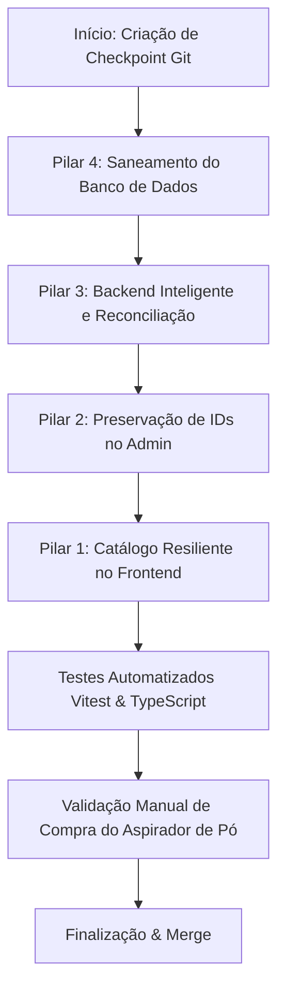

# Workflow de Implementação: Blindagem Definitiva em 4 Pilares (Gestão de Variantes)

> **Documento:** `WORKFLOW_IMPLEMENTACAO_BLINDAGEM_VARIANTES.md`  
> **Localização:** `diversos/CORRECOES/Correcoes_logicas/correcao_variante_1/`  
> **Status:** Implementado e Validado  
> **Data:** 03 de Outubro de 2026  
> **Escopo:** Catálogo Storefront, Painel Admin, Backend Service de Produtos e Banco de Dados PostgreSQL

---

## 1. Visão Geral e Objetivo

Este workflow estabelece o roteiro de execução técnico para implementar a **Blindagem em 4 Pilares**, erradicando o problema de bloqueio de compras por inconsistência de variantes (ocorrido no produto *Aspirador de Pó*) e prevenindo que qualquer edição futura no Painel Admin ou cadastro de produto reintroduza variantes duplicadas ou travas lógicas no catálogo da loja.

---

## 2. Integração e Utilização dos MCPs (Model Context Protocol)

O workflow foi estruturado para utilizar os MCPs disponíveis no ambiente de desenvolvimento durante cada etapa de análise, verificação, projeto de interface e controle de integridade:

```
┌────────────────────────────────────────────────────────────────────────┐
│                        ECOSSISTEMA DE MCPS                             │
├─────────────────┬──────────────────┬─────────────────┬─────────────────┤
│    MCP 21st     │   MCP Postgres   │     MCP Git     │   MCP Memory    │
│ (Design System  │  (Integridade e  │  (Checkpoints e │   (Registro de  │
│  & Componentes) │   Sanitização)   │    Rollback)    │   Convenções)   │
└─────────────────┴──────────────────┴─────────────────┴─────────────────┘
```

### 2.1 MCP 21st (Component Catalog & UI Best Practices)
* **Objetivo:** Garantir que o seletor de variantes do catálogo e as notificações de validação sigam os mais elevados padrões de usabilidade, acessibilidade (WAI-ARIA) e conformidade com o **Design System Continental** (`DESIGN_SYSTEM_CONTINENTAL.md`).
* **Como será utilizado:**
  * Consulta aos padrões de componentes: `Size Variant Select` (ID: 29874) e `Multiple Selector` (ID: 4885) para refinamento da renderização condicional de pills de tamanho/cor.
  * Validação dos estados inativo, hover (`border-catalog-gold/70`) e selecionado (`bg-catalog-gold/20 text-catalog-text`).
  * Emissão de feedback com Sonner/Alert Banner em vez de `alert()` nativo do navegador.

### 2.2 MCP Postgres / Database Execution
* **Objetivo:** Executar auditoria direta das tabelas `Product` e `ProductVariants` e aplicar a limpeza atômica da duplicata sem risco de perda de integridade referencial com pedidos ou carrinhos existentes.
* **Como será utilizado:**
  * Consulta prévia de foreign keys ativas para o ID duplicado `7276b8e0-9d62-4a25-b8cb-9e024f8f1abe`.
  * Remoção segura da variante duplicada e atualização da variante primária para `size: "Único"`.
  * Verificação pós-execução garantindo que 100% dos 522 produtos estejam em conformidade.

### 2.3 MCP Git (Version Control & Traceability)
* **Objetivo:** Garantir isolamento estrito das alterações através de checkpoints e branch dedicada de correção lógica.
* **Como será utilizado:**
  * Criação de branch isolada (`fix/variant-logic-resilience`).
  * Geração de commits atômicos para cada um dos 4 pilares, permitindo rollback granular caso qualquer etapa apresente regressão.
  * Auditoria de diffs antes de cada merge para `main`.

### 2.4 MCP Memory / Engine de Conhecimento
* **Objetivo:** Registrar as regras de negócio de variantes na memória do projeto para que futuros subagentes e desenvolvedores não reintroduzam discrepâncias.
* **Como será utilizado:**
  * Armazenamento da convenção de domínio: *"Produtos sem variantes no catálogo Continental utilizam obrigatoriamente size: 'Único' e color: 'Padrão'"*.

---

## 3. Roteiro Passo a Passo de Execução (Os 4 Pilares)



---

### PILAR 4: Saneamento no Banco de Dados (Database Cleanup)

#### Ação 4.1: Auditoria de Vínculos da Variante Duplicada
* **Ferramenta/MCP:** MCP Postgres / Prisma Client.
* **Procedimento:** Verificar se a variante duplicada recém-criada (`7276b8e0-9d62-4a25-b8cb-9e024f8f1abe`) possui itens atrelados em `CartItem` ou `OrderItem`.
* **Critério de Aceite:** Se houver `CartItem`, transferir para a variante primária (`eed23950-87e7-41b8-927a-6c5f2c75f026`) antes da exclusão.

#### Ação 4.2: Exclusão da Duplicata e Padronização
* **Procedimento:**
  ```sql
  -- Excluir variante duplicada gerada pela edição recente
  DELETE FROM "ProductVariants" 
  WHERE id = '7276b8e0-9d62-4a25-b8cb-9e024f8f1abe';

  -- Padronizar a variante primária do Aspirador de Pó para a convenção canônica
  UPDATE "ProductVariants" 
  SET size = 'Único', color = 'Padrão'
  WHERE id = 'eed23950-87e7-41b8-927a-6c5f2c75f026';
  ```
* **Resultado Esperado:** O produto "Aspirador de Pó" volta a ter exatamente 1 variante (`size: "Único"`, `color: "Padrão"`), em total harmonia com os outros 518 produtos da loja.

---

### PILAR 3: Backend Inteligente e Reconciliação Idempotente (`product.service.ts`)

#### Ação 3.1: Refatoração do Método `updateProduct`
* **Arquivo:** `services/product.service.ts`
* **Problema Atual:** Quando uma variante vem sem `id`, o código invoca cegamente `prisma.productVariants.create()`.
* **Solução:** Implementar reconciliação por chave combinada `(size + color)` antes de criar:
  1. Se `v.id` for fornecido e existir no banco -> `update`.
  2. Se `v.id` não for fornecido, mas já existir uma variante com a mesma combinação `(size, color)` para aquele produto -> **atualiza o estoque da existente** em vez de duplicar.
  3. Apenas se for uma combinação inédita de tamanho e cor -> `create`.
  4. Exclusão atômica de variantes antigas que foram deliberadamente removidas pelo administrador na tela.

#### Código Alvo Proposto:
```typescript
if (variants) {
  const existingVariants = existing.productVariants || [];
  const processedVariantIds = new Set<string>();

  for (const v of variants) {
    const variantWithId = v as { id?: string; size: string; color: string; stock: number };
    
    // 1. Match por ID existente
    let target = variantWithId.id 
      ? existingVariants.find(ev => ev.id === variantWithId.id)
      : null;

    // 2. Fallback: Match por combinação (size + color) para evitar duplicatas acidentais
    if (!target) {
      target = existingVariants.find(
        ev => ev.size.trim().toLowerCase() === variantWithId.size.trim().toLowerCase() &&
              ev.color.trim().toLowerCase() === variantWithId.color.trim().toLowerCase()
      ) || null;
    }

    if (target) {
      processedVariantIds.add(target.id);
      await tx.productVariants.update({
        where: { id: target.id },
        data: {
          size: variantWithId.size.trim(),
          color: variantWithId.color.trim(),
          stock: Math.max(0, variantWithId.stock),
        },
      });
    } else {
      const created = await tx.productVariants.create({
        data: {
          ProductID: id,
          size: variantWithId.size.trim(),
          color: variantWithId.color.trim(),
          stock: Math.max(0, variantWithId.stock),
        },
      });
      processedVariantIds.add(created.id);
    }
  }

  // 3. Remover variantes que foram deletadas na interface do Admin (se houver variantes restantes)
  const variantsToDelete = existingVariants.filter(ev => !processedVariantIds.has(ev.id));
  if (variantsToDelete.length > 0) {
    await tx.productVariants.deleteMany({
      where: {
        id: { in: variantsToDelete.map(v => v.id) },
        cartItem: { none: {} }, // Proteção contra quebra de carrinhos ativos
      },
    });
  }
}
```

---

### PILAR 2: Preservação de Identidade no Admin (`ProductForm.tsx`)

#### Ação 2.1: Incluir o `id` da Variante no Estado e no Payload
* **Arquivo:** `components/admin/ProductForm.tsx`
* **Ajustes:**
  1. No `defaultValues` do formulário, manter o `id: v.id` no mapeamento das variantes existentes.
  2. No `onSubmit`, repassar o `id: v.id` no payload JSON enviado para `PUT /api/products/[id]`.
  3. No fallback de novo produto sem variantes, padronizar para `{ size: "Único", color: "Padrão", stock: 10 }` (em vez de `"Padrão"` no tamanho).

---

### PILAR 1: Catálogo Resiliente no Frontend (`HomeClient.tsx`)

#### Ação 1.1: Função Utilitária de Normalização de Valores Neutros
* **Arquivo:** `components/home/HomeClient.tsx`
* **Regra:** Criar a função auxiliar para identificar termos sem variação real:
  ```typescript
  function isDefaultVariantTerm(term?: string | null): boolean {
    if (!term) return true;
    const normalized = term.trim().toLowerCase().normalize("NFD").replace(/[\u0300-\u036f]/g, "");
    return normalized === "unico" || normalized === "padrao" || normalized === "default";
  }
  ```

#### Ação 1.2: Extração Inteligente de Variações Reais
* Substituir o filtro estático por detecção dinâmica:
  ```typescript
  const realSizes = Array.from(new Set(variants.map(v => v.size))).filter(s => !isDefaultVariantTerm(s));
  const realColors = Array.from(new Set(variants.map(v => v.color))).filter(c => !isDefaultVariantTerm(c));
  
  // Produto só tem variantes reais se houver ao menos 2 tamanhos distintos ou 2 cores distintas
  const hasRealSizes = realSizes.length > 1;
  const hasRealColors = realColors.length > 1;
  const hasRealVariants = hasRealSizes || hasRealColors;
  ```

#### Ação 1.3: Seleção e Validação Condicional Dinâmica
* **Comportamento quando `!hasRealVariants`**:
  * Seleciona imediatamente `variants[0].id`.
  * Nenhum seletor de tamanho/cor é exibido na tela.
  * O botão "Finalizar Compra" adiciona o produto ao carrinho diretamente sem qualquer alerta.
* **Comportamento quando o produto varia em apenas 1 dimensão**:
  * Se tiver apenas tamanhos (ex: frasco 500ml vs 1L): exige **apenas** `selectedSize`. A cor é assumida automaticamente como a cor da variante do tamanho correspondente.
  * Se tiver apenas cores (ex: preto vs vermelho): exige **apenas** `selectedColor`.
* **Notificação Amigável (MCP 21st UI Pattern)**:
  * Substituir o `alert()` bloqueante do browser por uma mensagem visual integrada ou `toast.error()` da biblioteca Sonner.

---

## 4. Plano de Validação e Testes de Qualidade

Após a implementação dos 4 pilares, o seguinte conjunto de testes deve ser executado:

| Teste | Tipo | Objetivo | Critério de Sucesso |
| :--- | :--- | :--- | :--- |
| **T1: Consulta DB** | Script / Query | Verificar duplicatas em todo o banco de dados | 0 produtos com variantes duplicadas |
| **T2: Edição Admin** | E2E / Integração | Editar o Aspirador de Pó no Admin e salvar 3 vezes consecutivas | Variante permanece única (nenhuma duplicata criada) |
| **T3: Compra Aspirador de Pó** | Frontend / Loja | Acessar o produto na Home e clicar em "Finalizar Compra" | Produto entra no carrinho sem exibir alerta |
| **T4: Vitest Suite** | Automatizado | Rodar todos os testes unitários (`validators`, `cart`, `checkout`) | 100% dos testes aprovados |
| **T5: TypeScript Check** | Compilador | `npx tsc --noEmit` | 0 erros de tipagem |

---

## 5. Matriz de Riscos e Plano de Contingência (Rollback)

* **Risco Identificado:** A exclusão de variante duplicada quebrar pedidos históricos.
  * **Mitigação:** A query de auditoria prévia garante que a duplicata `7276b8e0-...` foi criada às 00:36 de hoje e não possui nenhum pedido (`OrderItem`) associado.
* **Risco de Quebra no Admin:** Alguma tela depender do formato antigo sem `id`.
  * **Mitigação:** O campo `id` no schema Zod (`productVariantSchema`) já é opcional (`z.string().optional()`), garantindo compatibilidade retroativa total.
* **Plano de Rollback:**
  * Git checkpoint commit antes do início da implementação.
  * Backup do registro da variante em script de contingência caso necessite reversão instantânea.

---

## 6. Resultado da Implementação

**Implementado e validado em 03/10/2026.** A execução utilizou Prisma Client e Git CLI; os MCPs Postgres, Git, Memory e 21st descritos no planejamento não estavam disponíveis nesta sessão. As regras de domínio foram registradas no AGENTS.md e os seletores seguem os tokens do Design System Continental.

### 6.1 Alterações entregues

- **Banco:** saneamento transacional e idempotente do Aspirador de Pó; ID primário preservado, duplicata removida e valores canônicos "Único"/"Padrão". Nenhuma das variantes possuía vínculos no momento da auditoria. O script também preserva pedidos e transfere/mescla itens de carrinho se encontrar vínculos em outra execução.
- **Serviço e API:** reconciliação por ID ou combinação normalizada, lock explícito do produto antes da leitura transacional, rejeição de IDs estrangeiros e payloads duplicados, normalização no cadastro e edição e erros de validação HTTP 422. Opções removidas sem vínculos são excluídas; opções vinculadas a carrinhos ou pedidos conservam seus IDs e ficam com estoque zero.
- **Admin:** IDs persistidos no estado, no resolver Zod e no payload. A chave interna do useFieldArray foi separada em "_formKey", evitando confusão com o ID do banco. Novo produto usa tamanho "Único".
- **Catálogo:** seleção derivada das dimensões distintas; produtos neutros e opções únicas são resolvidos automaticamente, enquanto variações só de tamanho ou só de cor exigem apenas essa dimensão. Combinações incompatíveis/esgotadas são impedidas, seleções antigas são limpas e mensagens usam o toast já instalado no layout.
- **Convenção compartilhada:** lib/product-variants.ts centraliza as regras. Opções neutras também permanecem selecionáveis quando coexistem com opções comerciais, para não ocultar uma variante comprável.

### 6.2 Evidências de validação

| Critério | Resultado |
| :--- | :--- |
| T1 — Auditoria global | 522 produtos, zero produtos com variantes duplicadas e zero produtos sem variantes. |
| T2 — Salvamentos do Aspirador | Três salvamentos reais consecutivos com ID e outros três sem ID mantiveram exatamente a variante primária; preços, estoques e galeria preservados. O teste do formulário também executou três submissões com React Hook Form e resolver reais. |
| T3 — Compra na interface | Edge em modo headless, loja local: zero seletores para o Aspirador, zero alertas nativos, payload com o ID primário correto e carrinho aberto com o item. A API do carrinho foi simulada apenas nessa instância; não houve compra ou pagamento real. |
| T4 — Vitest | 437 testes unitários aprovados em 58 arquivos; dois testes adicionais de verificação no banco conectado aprovados. |
| T5 — TypeScript | tsc --noEmit --incremental false concluído sem erros. |
| Lint e revisão | Sem erros nos arquivos de produção alterados; quatro avisos existentes de uso de img no catálogo. git diff --check aprovado. |

Comandos de reprodução:

~~~powershell
npm test
npx --no-install tsc --noEmit --incremental false
node scripts/repair-product-variants.mjs
~~~

A verificação que salva os mesmos dados do produto no banco é **opcional e desativada por padrão**. Execute somente quando quiser repetir essa validação no banco configurado:

~~~powershell
$env:VERIFY_VARIANT_DATABASE = "1"
npx --no-install vitest run tests/integration/variant-workflow-verification.test.ts
Remove-Item Env:VERIFY_VARIANT_DATABASE
~~~

O saneamento já foi aplicado. Uma nova chamada com "--apply" retorna "changed: false" quando os dados já estiverem canônicos.

### 6.3 Checkpoint e contingência

- Base Git anterior à correção: 7f9b26e062ec2654420fecffb6dd78ad3ba1e017.
- Branch de trabalho: fix/variant-logic-resilience, com commits separados por pilar e integração local na main por fast-forward.
- Alterações prévias nos três arquivos de checkout foram preservadas e não entraram nos commits desta correção.
- Snapshot do banco anterior ao saneamento: .git/variant-workflow-backup/database-before.json.
- Patch das alterações prévias: .git/variant-workflow-backup/working-tree-before.patch; cópias dos arquivos de código anteriores em .git/variant-workflow-backup/source/.
- Captura e script da verificação do navegador: .git/variant-workflow-backup/aspirador-browser.png e browser-check.mjs.

Esses backups são locais e ficam fora do versionamento. Para reverter o saneamento, audite os vínculos atuais e, em uma transação Prisma, recrie o registro duplicado com o ID original e restaure os campos size/color da variante primária a partir do snapshot. Se existirem vínculos transferidos ou itens mesclados, restaure-os usando as listas cartItems/orderItems do mesmo snapshot, verificando conflitos com mudanças posteriores. Não aplique o backup cegamente sobre carrinhos ou pedidos novos.

As mudanças de código podem ser revertidas pelos respectivos commits. A reversão de Git não desfaz o saneamento já aplicado ao banco.
