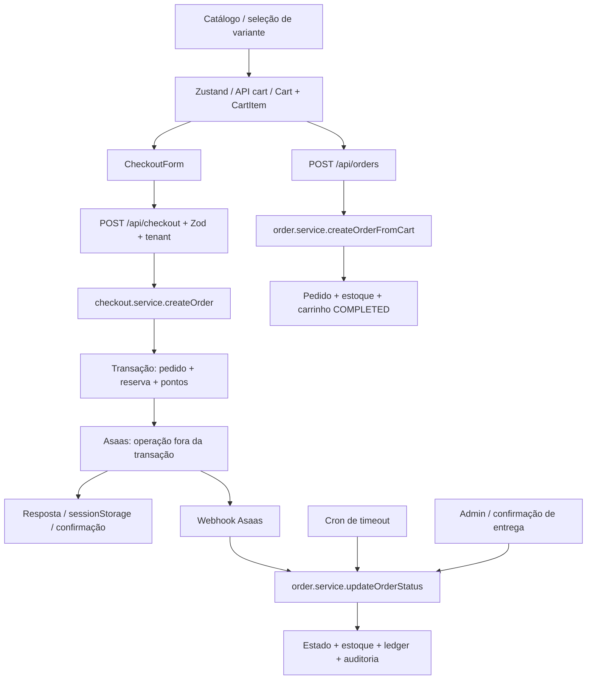

# Auditoria de Lógica do Sistema

## 1. Resumo Executivo

**Data:** 03/10/2026. **Base analisada:** checkout local do repositório em `C:\Diversos\TI\Trabalhos\2026\Sistemas\Projeto`, HEAD `b66cc0d`, incluindo as alterações locais que já existiam no início da auditoria.

Foram identificados **38 findings: 6 CRITICAL, 23 HIGH e 9 MEDIUM; 0 LOW**. Classificação de confiança: **38 CONFIRMED, 0 LIKELY e 0 POTENTIAL**. Neste relatório, CONFIRMED significa que existe um caminho concreto de código capaz de produzir o comportamento descrito, sob a condição indicada. **Não significa que todos os cenários tenham sido executados em produção ou ocorrido no banco consultado.** A evidência distingue leitura de código, diagnóstico com dependências simuladas e observação agregada do banco.

Os maiores riscos são a perda da identidade da variante no checkout, transições concorrentes que repetem efeitos de estoque, eventos de pagamento consumidos antes de concluir o processamento, falta de idempotência no cliente oficial e compensação local sem reconciliação financeira externa. A proteção do ambiente de testes também contém um caminho capaz de executar limpeza no banco diferente daquele validado.

A correção anterior melhorou a seleção no catálogo e a reconciliação administrativa. Entretanto, essas garantias não atravessam todos os caminhos de compra e estorno. Há dois serviços de criação de pedidos com regras distintas, além de contratos incompatíveis entre frontend, validação e integração logística.

**Verificações executadas:** 58 arquivos de testes unitários, **437 testes aprovados**; TypeScript sem erros com `--noEmit --incremental false`; consultas PostgreSQL em transações explicitamente somente leitura; diagnósticos isolados executando módulos existentes com Prisma/gateway simulados em memória. A aprovação dos testes não cobriu os interleavings e falhas entre sistemas descritos neste relatório.

**Preservação:** nenhum código, configuração, schema, migration ou teste foi alterado; nenhuma correção, cobrança, mutation de banco, execução de job ou commit foi realizada. O único arquivo criado intencionalmente é este relatório. As três modificações preexistentes — `app/checkout/page.tsx`, `components/checkout/CheckoutForm.tsx` e `lib/validators/checkout.validators.ts` — foram preservadas.

## 2. Escopo da Auditoria

### 2.1. Plataforma e organização

Versões instaladas consultadas: Node.js 22.15.0, Next.js 16.3.5, React 18.3.1, TypeScript 5.9.3, Prisma Client 5.22.0 e Vitest 4.1.6; banco PostgreSQL. O inventário encontrou **19 arquivos page.tsx e 45 arquivos route.ts** em `app/`.

| Camada | Componentes e responsabilidades examinados |
|---|---|
| Entrada e renderização | `app/layout.tsx`, `app/page.tsx`, catálogo/HomeClient, páginas de checkout/confirmação, perfil e Admin; limites entre componentes de servidor e cliente. |
| Estado de cliente | `store/cart.store.ts`, CartProvider/CartDrawer, formulário de checkout, seleção de variante, formulários de produto, modais de pedido, estado em sessionStorage. |
| APIs | Famílias auth, cart, checkout, orders, products, brands, loja, freight, customers, user/profile, address, loyalty, admin, upload, webhooks e cron. |
| Autorização e tenant | `lib/session.ts`, `lib/auth/guards.ts`, `lib/tenant.ts`, proteção administrativa em proxy/layout e guards nas rotas. |
| Negócio e acesso a dados | `services/` usa Prisma diretamente; `lib/services/` contém reexports de compatibilidade. Não há repository separado unificando todas as invariantes. |
| Validação | Zod nas rotas, `lib/validators/`, schema do formulário administrativo e schemas de fidelidade; diferenças entre tipos TypeScript e dados preservados no parse. |
| Assíncrono | Webhook Asaas, cron de timeout de pedido, cron de expiração de pontos, polling da confirmação, consultas ViaCEP/frete e atualizações otimistas. |
| Integrações | Asaas; Correios; J&T com tabelas no banco; ViaCEP; envio de email; upload/storage e links WhatsApp. Não foram acionadas operações externas com efeitos. |
| Persistência | Schema Prisma, migrations, relações, checks, índices, transações, locks, operações incrementais e agregações; catálogo e contagens do banco configurado. |
| Verificação e histórico | Testes unitários/integração/carga, configuração Vitest, helpers de DB, relatório anterior de variantes, workflow associado e commits recentes. |

O acesso real ao banco foi limitado a metadados e contagens. Não se pressupôs que essa conexão fosse produção. Nenhuma informação pessoal, senha, token ou URL de conexão é reproduzida neste documento.

### 2.2. Mapa dos fluxos críticos

O catálogo é inicialmente carregado no servidor e a interação ocorre no cliente. O checkout usa Route Handler; não há garantia implícita de exclusão mútua entre requisições por ser uma aplicação Next.js. As transações PostgreSQL têm escopo local: não incluem a chamada Asaas posterior. A Server Action de perfil/upload é um caminho distinto e não participa da atomicidade da compra.

A resolução de loja usa domínio/headers e cache; a aplicação também possui cache local de processo em `lib/cache.ts`, cache de cotação de 30 minutos e cache de indicadores. Não foi identificada uma fila/outbox que conclua de forma durável as etapas incompletas do pagamento. Existem campos de integração/ERP, mas não foi comprovado um worker ativo de sincronização nos pontos de entrada examinados.

### 2.3. Entidades, estados e invariantes derivados

Entidades principais: Loja, User, Session, Address, Product, ProductVariants, Brand, CategoryTag, ProductCategoryTag, Cart, CartItem, Order, OrderItem, OrderStatusHistory, AuditLog, FreightRule, LoyaltyWallet, LoyaltyTransaction, PaymentWebhookEvent, tabelas JtExpress e StockSyncLog.

| Entidade | Estados/regra observada | Invariante exigida pelo próprio fluxo |
|---|---|---|
| Pedido | PENDING→PAID/CANCELLED; PAID→SHIPPED/CANCELLED; SHIPPED→DELIVERED; DELIVERED/CANCELLED terminais | Transição válida deve consumir uma única versão anterior e executar efeitos uma única vez. |
| Retirada/sem frete | Exceção PAID→DELIVERED em `lib/order-transitions.ts` | A modalidade deve chegar a todos os validadores de transição. |
| Pagamento | Estados Asaas coexistem com Order.status | Status local e condição financeira externa precisam ser conciliáveis; CANCELLED não comprova reembolso. |
| Estoque | Product.stock e ProductVariants.stock; reserva na criação | A opção vendida deve ser a reservada; estoque não negativo; cancelamento não pode duplicar reposição nem reativar opção retirada. |
| Carrinho | ACTIVE/COMPLETED e itens por variante | Uma intenção deve ser recuperável e consumida uma vez; atualizações concorrentes não devem perder quantidades. |
| Fidelidade | Ledger EARN/REDEEM/REFUND/ADMIN_ADJUSTMENT/EXPIRATION e saldo materializado | Saldo deve corresponder aos movimentos válidos; cada efeito deve acontecer uma vez; pontos válidos não devem expirar por falta de reconhecimento da origem. |
| Identidade/tenant | Sessão→usuário→loja; recursos com dono | Idempotência, compra convidada e consultas auxiliares não podem contornar a autorização. |
| Total da compra | Preços atuais, desconto e frete; parcelas externas | Total interno, frete autorizado e cobrança externa devem representar a mesma compra. |

Não foi encontrado um campo genérico de produto ativo/inativo usado pelo fluxo principal; disponibilidade é governada principalmente por estoque. Não se inventou uma regra de desativação independente. Não foi identificado cálculo autônomo de impostos nem sistema geral de cupons no checkout examinado; o desconto relevante aqui é fidelidade.

### 2.4. Relação com o incidente anterior de variantes

Foram lidos `diversos/CORRECOES/Correcoes_logicas/correcao_variante_1/relatorio/RELATORIO_GERAL_PROBLEMA_VARIANTES.md` e `diversos/CORRECOES/Correcoes_logicas/correcao_variante_1/WORKFLOW_IMPLEMENTACAO_BLINDAGEM_VARIANTES.md`.

A causa anterior combinava perda do ID persistido no Admin com criação/reconciliação inadequada de variantes e uma interface que exigia uma dimensão neutra que não podia ser selecionada. A condição envolvia representações diferentes de produto sem variação, variantes duplicadas e fluxo de edição que tratava variantes existentes como novas. O resultado era impedir a seleção/composição necessária à compra.

O histórico próximo contém a reconciliação transacional (`6a2043c`), preservação de IDs no Admin (`dc01625`), ajustes no catálogo (`7526330`), saneamento do incidente (`0c415ea`) e documentação das regras (`b66cc0d`). Esses commits foram usados como contexto, não como certificação de correção.

As invariantes esperadas são: neutralidade consistente de Único/Padrão/default; exigir somente dimensões distintas; preservar IDs persistidos; impedir combinações repetidas; não selecionar variante sem estoque; reter vínculos históricos e indisponibilidade das removidas.

A nova investigação confirmou que a correção administrativa não cobre a transformação de itens no checkout (**LA-001**), o estorno que reativa variantes retiradas (**LA-018**) e a sobrescrita de estoque por formulário antigo (**LA-019**). São problemas de continuidade das garantias entre componentes, não evidência de que o mesmo patch administrativo deixou de funcionar.

## 3. Metodologia

### 3.1. Procedimento e critérios

1. Inventário de rotas, páginas, serviços, modelos, jobs, integrações e consumidores; leitura das instruções AGENTS.md e das guias instaladas do Next.js, incluindo Route Handlers, cache e Server Actions.
2. Leitura do incidente anterior, workflow e alterações recentes; registro do estado Git inicial para preservar trabalho preexistente.
3. Rastreamento de entradas por validação, transformação, regra, transação, efeito externo, resposta e estado do cliente.
4. Derivação de invariantes reais; comparação dos caminhos principal e alternativo; construção de interleavings para operações concorrentes.
5. Tentativa de refutar suspeitas por guards, schemas, checks, FKs, locks, transações, consumidores e caminhos alternativos.
6. Testes existentes seguros, typecheck, diagnósticos de controle de fluxo em memória e inspeção PostgreSQL em modo somente leitura.
7. Segunda passagem por identidades, exclusões/retenção, retries, estados terminais, cron, atualizações de cache, respostas fora de ordem e diferenças entre código e schema implantado.
8. Classificação por impacto e confiança; documentação sem implementar correções.

A localização usa linhas do checkout local analisado; pode divergir de HEAD porque três arquivos já estavam modificados. Uma ausência estrutural, como falta de DDL ou de escritor de histórico, foi verificada por busca no conjunto relevante, não inferida de um único arquivo.

### 3.2. Verificações executadas e resultados

| Verificação | Resultado | O que demonstra / limite |
|---|---|---|
| Suite unitária via `npm test -- --reporter=dot` | 58 arquivos e 437 testes passaram; cerca de 5,6 s | Comportamentos cobertos pelos testes e mocks existentes; não comprova integração financeira nem isolamento PostgreSQL real. |
| `npx --no-install tsc --noEmit --incremental false` | Exit code 0 | Compatibilidade estática no estado analisado; não prova correção do contrato externo ou dos estados permitidos em runtime. |
| Diagnóstico em memória: schema e estoque | Payload sem variante aceito; token de cotação removido; frete zero aceito; compra gravada sem variante e com variante esgotada | Executou módulos TS existentes transpilados em memória, com dependências controladas; não criou pedido real. |
| Diagnóstico em memória: cancelamento | Duas operações bem-sucedidas, duas restaurações, mesmo serializando as transações simuladas | Demonstra que as leituras anteriores à transação bastam para repetir efeitos; não é teste de carga PostgreSQL. |
| Diagnóstico em memória: webhook | Primeira chamada 500, retry 200 ALREADY_PROCESSED, uma tentativa de escrita de negócio | Demonstra perda da recuperação após falha entre marcador e efeito. |
| Diagnóstico em memória: idempotência | Replay recuperou pedido de outro contexto e aceitou CANCELLED; dados de pagamento ausentes | Demonstra caminho de retorno antecipado e falta de escopo, sem dados de usuários reais. |
| Diagnóstico em memória: expiração | Saldo100 sem EARN resultou em100 pontos expirados | Demonstra tratamento incorreto de saldo cuja origem não é EARN. |
| Diagnóstico em memória: status/rastreio | Parse preservou apenas newStatus | Demonstra descarte do trackingCode pela validação existente. |
| PostgreSQL | Metadados e contagens obtidos em transações somente leitura | Observação do banco configurado acessível; não prova que seja produção nem reconstrói causalidade histórica. |
| Git | Estado e histórico inspecionados; três alterações preexistentes preservadas | Nenhum commit ou checkout realizado; único acréscimo intencional é o relatório. |

Os diagnósticos usaram Node e TypeScript para carregar os módulos existentes, substituindo Prisma/gateway por dependências em memória e injetando falhas específicas. Não foram adicionados arquivos de teste. Valores sintéticos como 100/150, IDs de exemplo e saldos não representam clientes reais.

### 3.3. Evidência PostgreSQL e limites de interpretação

As consultas foram executadas com `SET TRANSACTION READ ONLY` e `SET LOCAL statement_timeout='10000ms'`, dentro de transações Prisma com timeout limitado. Foram consultados catálogos de constraints/índices/triggers e agregados; não se executou saneamento, DDL, seed, reset ou update.

| Observação no snapshot | Resultado |
|---|---|
| Produtos | 522; nenhum sem variantes naquele momento. |
| Pedidos | 24: 4 PAID, 10 PENDING, 10 CANCELLED. |
| Itens de pedido | 33; todos com productVariantsId nulo; 17 ainda apontam a produto que possui variantes. |
| Chave de idempotência | 24 pedidos com idempotencyKey nula. |
| Histórico x auditoria | 0 OrderStatusHistory; 13 AuditLog com action ORDER_STATUS_UPDATED. |
| Indicadores de concorrência já materializados | 0 usuários com múltiplos carrinhos ACTIVE; 0 carteiras negativas; 0 pedidos CANCELLED com status externo CONFIRMED/RECEIVED no snapshot. |
| Proteções de estoque e quantidade | CHECKs não negativos em estoque de Product/ProductVariants; quantidade positiva e preço não negativo nos itens; totais de Order não negativos. |
| Proteções ausentes relevantes | Sem unicidade de um ACTIVE por usuário; sem CHECK de saldo não negativo em LoyaltyWallet; sem unicidade de efeito por pedido/tipo no ledger examinada como prevenção de replay. |
| Auditoria | actorId e targetId de AuditLog referenciam User. |
| Triggers | Nenhuma trigger em public encontrada para suprir os escritores ausentes. |
| Drift de estrutura | Campos de cartão/boleto presentes no Order do banco, sem DDL correspondente nas migrations versionadas. |

Ausência de estado inválido no snapshot **não refuta** um interleaving capaz de produzi-lo. Presença de item sem variante **não prova** que tenha sido criado pela versão atual nem permite atribuir responsabilidade histórica. Os findings usam esses números apenas como evidência complementar.

### 3.4. Escala usada

- **CRITICAL:** ameaça fluxo fundamental, integridade financeira, estoque ou dados em escala relevante.
- **HIGH:** quebra fluxo importante ou produz inconsistência relevante em cenário operacional concreto.
- **MEDIUM:** comportamento incorreto de alcance limitado ou dependente de condição específica.
- **LOW:** impacto menor; nenhum finding desta categoria foi necessário.
- **CONFIRMED:** caminho concreto demonstrável pela implementação; **LIKELY:** evidência forte ainda incompleta; **POTENTIAL:** hipótese a investigar. Não foram incluídas hipóteses apenas para aumentar a contagem.

## 4. Resumo dos Findings

| ID | Severidade | Confiança | Categoria | Localização | Resumo |
|----|------------|-----------|-----------|-------------|--------|
| LA-001 | CRITICAL | CONFIRMED | Variantes / estoque | `components/checkout/CheckoutForm.tsx:427–434` | Checkout perde a identidade da variante e permite vender opção sem estoque |
| LA-002 | CRITICAL | CONFIRMED | Concorrência / máquina de estados | `services/order.service.ts:268–294, 312–417` | Transições concorrentes duplicam estorno e podem sobrescrever o estado do pedido |
| LA-003 | CRITICAL | CONFIRMED | Idempotência / recuperação de falhas | `app/api/webhooks/asaas/route.ts:133–169, 198–238` | Webhook registra o evento como processado antes de aplicar seus efeitos |
| LA-004 | CRITICAL | CONFIRMED | Duplicação de compra / pagamentos | `components/checkout/CheckoutForm.tsx:389–467` | Checkout oficial não fornece chave de idempotência |
| LA-005 | CRITICAL | CONFIRMED | Atomicidade entre sistemas / pagamento | `services/checkout.service.ts:543–686` | Cancelamento local e falha pós-cobrança não reconciliam a operação no gateway |
| LA-006 | CRITICAL | CONFIRMED | Perda de dados / ferramentas de teste | `tests/setup/db.ts:26–40, 149–180` | Proteção dos testes valida uma URL, mas a limpeza usa outro banco |
| LA-007 | HIGH | CONFIRMED | Contrato frontend/backend | `components/checkout/CheckoutForm.tsx:244–280, 324–345` | Formulário não interpreta o contrato da cotação de frete |
| LA-008 | HIGH | CONFIRMED | Validação monetária / modalidades | `services/checkout.service.ts:352–408` | Backend aceita frete declarado pelo cliente sem cotação verificável |
| LA-009 | HIGH | CONFIRMED | Integridade monetária / integração | `services/checkout.service.ts:432–464, 545–564` | Valor de parcela controlado pelo cliente chega ao gateway sem conciliação |
| LA-010 | HIGH | CONFIRMED | Máquina de estados / cron | `services/order-timeout.service.ts:5–8, 53–94` | Timeout de uma hora cancela boleto antes do vencimento e cartão ainda em análise |
| LA-011 | HIGH | CONFIRMED | Autorização / idempotência | `services/checkout.service.ts:119–169` | Idempotency key recupera pedido de outra identidade ou loja |
| LA-012 | HIGH | CONFIRMED | Recuperação de operação / estado parcial | `services/checkout.service.ts:119–169, 495–497` | Replay devolve sucesso para pedido cancelado ou pagamento ainda incompleto |
| LA-013 | HIGH | CONFIRMED | Caminho alternativo / preços | `services/order.service.ts:17–104` | Rota alternativa de pedidos usa preço do carrinho sem atualizar regras da compra |
| LA-014 | HIGH | CONFIRMED | Isolamento entre lojas | `services/cart.service.ts:63–180` | Carrinho e rota alternativa permitem pedido da loja A com produto da loja B |
| LA-015 | HIGH | CONFIRMED | Concorrência / checkout alternativo | `services/order.service.ts:20–41, 100–103` | Duas requisições concluem o mesmo carrinho em pedidos distintos |
| LA-016 | HIGH | CONFIRMED | Persistência / estado cliente-servidor | `store/cart.store.ts:34–39, 75–125` | Carrinho reaparece depois da compra e checkout recarregado não o recupera |
| LA-017 | HIGH | CONFIRMED | Concorrência / read-modify-write | `services/cart.service.ts:114–180` | Operações concorrentes perdem quantidade e podem criar dois carrinhos ativos |
| LA-018 | HIGH | CONFIRMED | Ciclo de vida / estoque | `services/product.service.ts:278–293` | Cancelamento reativa variante removida pelo Admin |
| LA-019 | HIGH | CONFIRMED | Atualização perdida / estoque administrativo | `services/product.service.ts:228–268` | Salvar edição antiga do produto sobrescreve reservas recentes |
| LA-020 | HIGH | CONFIRMED | Identidade / persistência | `services/checkout.service.ts:289–313` | Checkout convidado sobrescreve CPF e telefone de conta existente |
| LA-021 | HIGH | CONFIRMED | Fidelidade / contabilidade | `services/loyalty.service.ts:674–711` | Motor de expiração remove pontos válidos de ajuste administrativo |
| LA-022 | HIGH | CONFIRMED | Concorrência / fidelidade | `services/loyalty.service.ts:717–772, 788–818` | Expiração concorrente pode descontar pontos duas vezes e deixar saldo negativo |
| LA-023 | MEDIUM | CONFIRMED | Regra de fidelidade / valores derivados | `services/order.service.ts:337–350` | Pontos creditados divergem da simulação quando há resgate |
| LA-024 | HIGH | CONFIRMED | Fluxo de checkout / validação | `lib/validators/checkout.validators.ts:118–123` | Boleto com retirada ou sem frete é oferecido, mas sempre rejeitado pelo schema |
| LA-025 | HIGH | CONFIRMED | Máquina de estados / frontend | `app/checkout/confirmation/page.tsx:58, 80–110, 233–257, 299–324` | Confirmação ignora CANCELLED e continua incentivando o pagamento |
| LA-026 | MEDIUM | CONFIRMED | Contrato / perda silenciosa de campo | `lib/validators/order.validators.ts:15–17` | Código de rastreio enviado ao mudar status é descartado |
| LA-027 | MEDIUM | CONFIRMED | Persistência / rastreabilidade | `services/order.service.ts:238, 312–435` | Histórico de status exibido pelo Admin nunca é alimentado pelas transições |
| LA-028 | MEDIUM | CONFIRMED | Autenticação / token de uso único | `services/auth.service.ts:217–253` | Token de recuperação pode ser consumido duas vezes sob concorrência |
| LA-029 | HIGH | CONFIRMED | Autorização / concorrência | `services/user.service.ts:9–53` | Dois administradores podem remover simultaneamente o último acesso administrativo |
| LA-030 | HIGH | CONFIRMED | Confiabilidade de implantação / PostgreSQL | `prisma/schema.prisma:285–297, 470–489, 519–549` | Migrations versionadas não reproduzem o schema exigido pelo aplicativo |
| LA-031 | MEDIUM | CONFIRMED | Cache / cálculo de frete | `services/freight/orchestrator.service.ts:68–77, 127` | Cache de cotação compartilha preço entre carrinhos de valores diferentes |
| LA-032 | MEDIUM | CONFIRMED | Autorização / fidelidade | `app/api/loyalty/simulate/route.ts:26–35` | Simulação pública permite consultar carteira identificada pelo solicitante |
| LA-033 | HIGH | CONFIRMED | PostgreSQL / tratamento de exceção | `app/api/webhooks/asaas/route.ts:248–280` | Alerta de pagamento em pedido cancelado viola FKs de auditoria |
| LA-034 | MEDIUM | CONFIRMED | Assíncrono / estado do cliente | `components/checkout/CheckoutForm.tsx:208–240` | Respostas antigas sobrescrevem endereço e estado otimista mais recente |
| LA-035 | HIGH | CONFIRMED | Configuração / falso sucesso | `services/checkout.service.ts:516–522, 690–716` | Ausência da chave do gateway produz sucesso para cartão e boleto sem cobrança |
| LA-036 | MEDIUM | CONFIRMED | Agregação / indicadores | `services/customer.service.ts:94–110, 205–243` | Métricas de gasto do cliente somam pedidos pendentes e cancelados |
| LA-037 | MEDIUM | CONFIRMED | Máquina de estados / contexto perdido | `services/order.service.ts:268–294` | Admin não consegue concluir retirada diretamente de PAID para DELIVERED |
| LA-038 | HIGH | CONFIRMED | Contrato público / autorização | `services/loja.service.ts:192–224` | Endpoint público de loja serializa credencial dos Correios |

## 5. Findings Detalhados

### [LA-001] Checkout perde a identidade da variante e permite vender opção sem estoque

**Severidade:** CRITICAL  
**Confiança:** CONFIRMED  
**Categoria:** Variantes / estoque  
**Arquivo:** `components/checkout/CheckoutForm.tsx`  
**Linha:** `427–434`  
**Função/componente:** handleSubmit; createOrder; InventoryService.reserveStock  
**Fluxo afetado:** Catálogo → carrinho → checkout → pedido

#### Problema

O formulário envia productId, cor e tamanho, mas omite variantId. O validador admite essa ausência; o serviço só valida e reserva ProductVariants se o ID veio no payload. Cor/tamanho enviados não são resolvidos com lib/product-variants.ts. O pedido pode declarar uma combinação sem consumir seu estoque.

#### Condição para ocorrência

Produto com estoque agregado positivo e uma ou mais variantes; a variante pretendida pode ter estoque zero.

#### Sequência de execução

1. Carrinho contém uma variante selecionada.
2. Checkout transforma o item e descarta seu ID.
3. Backend valida apenas Product.stock, grava productVariantsId nulo e decrementa somente Product.
4. Nova compra pode repetir a mesma opção indisponível.

#### Evidência

`lib/validators/checkout.validators.ts:24–32` torna variantId opcional; `services/checkout.service.ts:198–242` condiciona a verificação ao ID; `services/inventory.service.ts:66–82` condiciona o decremento. Diagnóstico em memória executando esses módulos: success=true, Product.stock 10→9, variante.stock=0, productVariantsId=null. No banco consultado: 33/33 itens sem variante; 17 ainda apontam a produtos que têm variantes. Esses agregados não provam a origem histórica de cada item. Refutação: a normalização do catálogo e a constraint stock>=0 não obrigam o checkout a identificar uma variante.

#### Impacto

Pode vender uma opção esgotada, corromper a correspondência pedido/estoque e impedir reposição correta no cancelamento. É uma quebra central da venda, justificando CRITICAL.

#### Comportamento esperado

Preservar e validar a identidade/composição vendida em todas as camadas e reservar a variante correspondente quando o produto possui variantes.

#### Componentes relacionados

`lib/product-variants.ts`; `store/cart.store.ts`; `services/product.service.ts`; `prisma/schema.prisma` (OrderItem).

### [LA-002] Transições concorrentes duplicam estorno e podem sobrescrever o estado do pedido

**Severidade:** CRITICAL  
**Confiança:** CONFIRMED  
**Categoria:** Concorrência / máquina de estados  
**Arquivo:** `services/order.service.ts`  
**Linha:** `268–294, 312–417`  
**Função/componente:** updateOrderStatus  
**Fluxo afetado:** Pagamento, cancelamento, expedição e estoque

#### Problema

O estado usado para autorizar a transição e decidir seus efeitos é lido antes da transação. As escritas usam apenas o ID, sem revalidar o estado sob bloqueio nem condicionar a atualização ao estado anterior.

#### Condição para ocorrência

Dois agentes processam o mesmo pedido: Admin, webhook, cron ou cliente.

#### Sequência de execução

1. A e B leem PENDING.
2. A cancela e restaura uma unidade.
3. B entra na transação com seu snapshot PENDING, cancela novamente e restaura outra unidade.
4. Em uma disputa PAID/CANCELLED, a última atualização também pode substituir o estado já confirmado pelo concorrente.

#### Evidência

`services/order.service.ts:359–377` restaura com base em fullOrder.status externo à transação. Diagnóstico com transações simuladas serializadas produziu bothSucceeded=true e restorations=2: não exige execução simultânea das escritas. `app/api/orders/[id]/confirm-delivery/route.ts:41–89` também valida antes e escreve por ID. Refutação: a transação agrupa cada operação individual, mas não protege a decisão anterior; constraints de estoque não limitam incrementos nem transições.

#### Impacto

Estoque artificial, devolução repetida de pontos, estado financeiro incompatível e possível venda de unidades inexistentes; CRITICAL.

#### Comportamento esperado

Uma única transição deve consumir o estado anterior e produzir efeitos uma única vez; um concorrente deve observar a transição vencedora.

#### Componentes relacionados

`lib/order-transitions.ts`; `services/inventory.service.ts`; `services/loyalty.service.ts`; webhook Asaas; cron orders-timeout.

### [LA-003] Webhook registra o evento como processado antes de aplicar seus efeitos

**Severidade:** CRITICAL  
**Confiança:** CONFIRMED  
**Categoria:** Idempotência / recuperação de falhas  
**Arquivo:** `app/api/webhooks/asaas/route.ts`  
**Linha:** `133–169, 198–238`  
**Função/componente:** POST  
**Fluxo afetado:** Gateway → webhook → pedido

#### Problema

O registro PaymentWebhookEvent é persistido antes das mudanças no pedido e fora da transação delas. A mera existência desse registro basta para responder ALREADY_PROCESSED em uma repetição, mesmo que a primeira tentativa tenha falhado.

#### Condição para ocorrência

Falha de banco, transição rejeitada ou interrupção após criar o marcador e antes de concluir o processamento.

#### Sequência de execução

1. Evento E é inserido.
2. Atualização do pedido falha; primeira resposta é 500 ou 422.
3. Gateway repete E.
4. Endpoint encontra o marcador, responde 200 e não tenta concluir os efeitos pendentes.

#### Evidência

Diagnóstico em memória com falha injetada na escrita de negócio: primeira resposta 500; retry 200/ALREADY_PROCESSED; apenas uma tentativa da escrita de negócio. `prisma/schema.prisma:552` define PaymentWebhookEvent; não há estado de falha/reprocessamento usado pelo handler. Refutação: a unicidade impede duplicação do marcador, mas não torna marcador e pedido uma operação atômica.

#### Impacto

Pagamento efetivo pode permanecer não reconhecido e posteriormente ser cancelado pelo timeout, sem recuperação por retry. CRITICAL por interromper a convergência financeira.

#### Comportamento esperado

Reconhecer como concluído apenas o evento cujos efeitos terminaram; eventos interrompidos precisam permanecer recuperáveis.

#### Componentes relacionados

`services/order.service.ts`; `services/order-timeout.service.ts`; `prisma/schema.prisma` (PaymentWebhookEvent).

### [LA-004] Checkout oficial não fornece chave de idempotência

**Severidade:** CRITICAL  
**Confiança:** CONFIRMED  
**Categoria:** Duplicação de compra / pagamentos  
**Arquivo:** `components/checkout/CheckoutForm.tsx`  
**Linha:** `389–467`  
**Função/componente:** handleSubmit  
**Fluxo afetado:** Submissão e repetição de checkout

#### Problema

A rota aceita uma chave opcional, mas o cliente oficial nunca a envia. Repetir a mesma intenção cria outro pedido, reserva mais estoque e pode criar outra cobrança.

#### Condição para ocorrência

Resposta perdida após commit, retorno à tela, repetição manual ou envio por duas abas, com estoque suficiente.

#### Sequência de execução

1. Primeiro POST cria pedido e cobrança.
2. Cliente não recebe a resposta ou repete a compra em outra aba.
3. Segundo POST tem idempotencyKey ausente.
4. O serviço cria um segundo pedido e inicia outro pagamento.

#### Evidência

`app/api/checkout/route.ts:84–94` extrai chave opcional; `services/checkout.service.ts:119–169` só deduplica quando existe chave; o fetch nas linhas 437–440 não a envia. No banco consultado, 24/24 pedidos têm chave nula. Refutação: estado isSubmitting reduz cliques na mesma montagem; não resolve resposta perdida, múltiplas abas ou uma nova montagem. Rate limiting também não deduplica.

#### Impacto

Pode duplicar pedidos e pagamentos legítimos do mesmo cliente; CRITICAL pela consequência financeira.

#### Comportamento esperado

Uma intenção de compra repetida deve reencontrar seu pedido e sua cobrança, inclusive após erro de transporte.

#### Componentes relacionados

`app/checkout/page.tsx`; `services/asaas/asaas.client.ts:160–176`; `prisma/schema.prisma` (Order.idempotencyKey).

### [LA-005] Cancelamento local e falha pós-cobrança não reconciliam a operação no gateway

**Severidade:** CRITICAL  
**Confiança:** CONFIRMED  
**Categoria:** Atomicidade entre sistemas / pagamento  
**Arquivo:** `services/checkout.service.ts`  
**Linha:** `543–686`  
**Função/componente:** createOrder; updateOrderStatus  
**Fluxo afetado:** Criação de cobrança, falha e cancelamento

#### Problema

O mesmo catch engloba criar cobrança remota, buscar dados complementares e persistir o resultado. Qualquer erro pode cancelar o pedido e devolver estoque localmente, sem cancelar/reembolsar a cobrança externa nem registrar uma etapa recuperável. Cancelar um pedido PAID pelo serviço administrativo também não solicita reembolso externo.

#### Condição para ocorrência

Gateway aceita a cobrança, mas a resposta se perde; busca do QR falha depois da criação; escrita local falha; ou Admin cancela um pedido já pago.

#### Sequência de execução

1. Pedido e reserva são commitados.
2. Gateway cria/aceita o pagamento.
3. Operação subsequente falha.
4. Catch cancela localmente e restaura estoque.
5. Cobrança continua existindo; retry sem chave pode gerar outra. Alternativamente, PAID→CANCELLED repõe estoque/pontos sem devolver o pagamento.

#### Evidência

`services/asaas/asaas.adapter.ts:44–54` separa criação PIX e obtenção do QR; `services/asaas/asaas.client.ts:53–69` tem timeout; `services/checkout.service.ts:654–686` compensa apenas via updateOrderStatus. `services/order.service.ts:359–411` não chama gateway. Refutação: a transação PostgreSQL termina antes da chamada externa; webhook tardio não constitui rollback da cobrança e o handler de pagamento em cancelado apenas tenta registrar alerta. Não foi feita cobrança real.

#### Impacto

Pode existir pedido cancelado com dinheiro recebido e estoque liberado, além de duplicação por retry. CRITICAL; demonstrada a incompatibilidade dos fluxos, sem afirmar captura financeira ocorrida nesta auditoria.

#### Comportamento esperado

Falha ambígua ou cancelamento deve preservar uma condição financeira rastreável e reconciliável; cancelamento interno não equivale a estorno externo.

#### Componentes relacionados

`app/api/webhooks/asaas/route.ts:248–280`; `services/order.service.ts`; `services/asaas/asaas.adapter.ts`.

### [LA-006] Proteção dos testes valida uma URL, mas a limpeza usa outro banco

**Severidade:** CRITICAL  
**Confiança:** CONFIRMED  
**Categoria:** Perda de dados / ferramentas de teste  
**Arquivo:** `tests/setup/db.ts`  
**Linha:** `26–40, 149–180`  
**Função/componente:** validateTestEnvironment; setupTestDb; cleanupTestDb  
**Fluxo afetado:** Execução de testes de integração/carga

#### Problema

validateTestEnvironment escolhe TEST_DATABASE_URL quando existe, mas o valor retornado não configura o Prisma importado. Esse cliente usa DATABASE_URL. A limpeza executa deleteMany sem escopo de fixture contra a conexão real do singleton.

#### Condição para ocorrência

TEST_DATABASE_URL aponta para um banco considerado seguro e DATABASE_URL aponta para outro banco; executar suite que usa setup/cleanup. A verificação textual por 'test' também não prova que um banco é descartável.

#### Sequência de execução

1. Ambiente contém TEST_DATABASE_URL local e DATABASE_URL de dados reais.
2. Validação aprova a primeira.
3. Prisma conecta à segunda.
4. cleanupTestDb apaga sessões, histórico e itens de pedidos de forma abrangente, antes de possíveis falhas de FK nas etapas seguintes.

#### Evidência

`lib/prisma.ts:8–22` instancia PrismaClient sem override; `prisma/schema.prisma:10` usa DATABASE_URL. `tests/integration/status-transitions.test.ts:13–21` e outras suites chamam esses helpers; `tests/load/customer-load.test.ts:17–49` também. Refutação: não há redirecionamento global em vitest.config.ts; falhas posteriores por FK não revertem deletes anteriores porque a limpeza não é transacional. A suite não foi executada.

#### Impacto

Risco concreto de perda massiva ou parcial de dados ao rodar uma verificação aparentemente protegida; CRITICAL.

#### Comportamento esperado

O banco validado deve ser exatamente o banco utilizado por todas as operações destrutivas e deve ser comprovadamente descartável.

#### Componentes relacionados

`vitest.config.ts`; `tests/integration/route-protection.test.ts`; `tests/integration/metrics-performance.test.ts`; `lib/prisma.ts`.

### [LA-007] Formulário não interpreta o contrato da cotação de frete

**Severidade:** HIGH  
**Confiança:** CONFIRMED  
**Categoria:** Contrato frontend/backend  
**Arquivo:** `components/checkout/CheckoutForm.tsx`  
**Linha:** `244–280, 324–345`  
**Função/componente:** calculateFreight; validateStep2  
**Fluxo afetado:** Endereço → cotação → seleção de entrega

#### Problema

A API responde {success:true,data:{options:...}}, mas o formulário procura data.options na raiz. O payload também usa lojaId e unidades/chaves diferentes das esperadas e omite productId, impedindo recuperar as medidas reais dos produtos.

#### Condição para ocorrência

Checkout DELIVERY com cotação automática, inclusive quando os provedores devolvem opções válidas.

#### Sequência de execução

1. Usuário informa CEP.
2. Formulário envia weightInKg/heightInCm/widthInCm/lengthInCm.
3. Schema da API descarta campos desconhecidos e usa seus defaults.
4. API retorna opções dentro de data.
5. Formulário interpreta como nenhuma opção; validação só exige seleção se options.length>0.

#### Evidência

`app/api/freight/calculate/route.ts:7–29, 83–113, 136` define o contrato e envelope; formulário linhas 265–272 lê outro formato. Refutação: não existe adaptador de resposta nesse fetch; o fluxo pode prosseguir com zero, em vez de necessariamente mostrar um erro bloqueante.

#### Impacto

Entrega cotada incorretamente ou sem frete selecionado, prejudicando cálculo e contratação do envio. HIGH pelo alcance no checkout normal.

#### Comportamento esperado

Usar as opções retornadas e os dados físicos efetivos dos itens; indisponibilidade de cotação deve ser distinguida de frete gratuito.

#### Componentes relacionados

`services/freight/orchestrator.service.ts`; `lib/api-response.ts`; `services/checkout.service.ts:352–408`.

### [LA-008] Backend aceita frete declarado pelo cliente sem cotação verificável

**Severidade:** HIGH  
**Confiança:** CONFIRMED  
**Categoria:** Validação monetária / modalidades  
**Arquivo:** `services/checkout.service.ts`  
**Linha:** `352–408`  
**Função/componente:** createOrder  
**Fluxo afetado:** Validação de frete na compra

#### Problema

Na ausência de regra municipal aplicável, shippingCost fornecido pelo cliente é aceito, inclusive zero. O serviço possui caminho para freightQuoteToken, mas esse campo não existe no schema da rota e é removido no parse. PICKUP/NONE também zeram o frete sem verificar se a loja habilitou essas modalidades.

#### Condição para ocorrência

DELIVERY sem regra municipal aplicável; ou envio direto de modalidade desabilitada na configuração da loja.

#### Sequência de execução

1. Cliente envia entrega e shippingCost=0.
2. Validação aceita número não negativo e remove eventual freightQuoteToken.
3. Serviço não encontra regra local, aceita o valor do payload e cria total sem frete.
4. Outra alternativa é selecionar NONE/PICKUP independentemente das flags da loja.

#### Evidência

`lib/validators/checkout.validators.ts:87–108` não inclui token e permite shippingCost não negativo; `services/checkout.service.ts:383–404` mostra verificação inacessível pelo endpoint e fallback. Diagnóstico do schema: quoteRemoved=true e zeroShippingAccepted=true. Busca dos usos de signFreightQuote não encontrou emissão no fluxo de cotação. Refutação: regras municipais cobrem apenas parte dos casos; recalcular preço dos produtos não recalcula frete.

#### Impacto

Subcobrança de entrega e pedidos com modalidade operacionalmente indisponível. HIGH por afetar valor e execução da compra.

#### Comportamento esperado

O backend deve conhecer e validar o preço/modalidade efetivamente autorizados para o endereço e os itens.

#### Componentes relacionados

`app/api/checkout/route.ts`; `app/api/freight/calculate/route.ts`; `lib/freight-quote.ts`; `services/loja.service.ts`.

### [LA-009] Valor de parcela controlado pelo cliente chega ao gateway sem conciliação

**Severidade:** HIGH  
**Confiança:** CONFIRMED  
**Categoria:** Integridade monetária / integração  
**Arquivo:** `services/checkout.service.ts`  
**Linha:** `432–464, 545–564`  
**Função/componente:** createOrder; AsaasPaymentAdapter.createCreditCardCharge  
**Fluxo afetado:** Checkout com cartão parcelado

#### Problema

installments e installmentValue passam do payload para o pedido e para a cobrança; o serviço recalcula o total dos produtos, mas não vincula o valor de cada parcela a esse total nem às condições autorizadas da loja. Assim, os valores internos e o payload externo podem divergir.

#### Condição para ocorrência

Solicitação parcelada com installmentValue positivo diferente do cálculo para o pedido, por alteração do payload ou estado obsoleto no frontend.

#### Sequência de execução

1. Pedido tem total autoritativo de R$ 1.000.
2. Payload informa duas parcelas de R$ 10.
3. Schema aceita a parcela positiva.
4. Adapter envia installmentCount=2 e installmentValue=10 junto com value=1000, sem rejeitar a inconsistência.

#### Evidência

`lib/validators/checkout.validators.ts:87–108`; `services/asaas/asaas.adapter.ts:138–174`. A documentação oficial define installmentCount+installmentValue ou totalValue para parcelamento, em lugar de value: [Asaas — cobrança parcelada](https://docs.asaas.com/docs/criar-uma-cobranca-parcelada) e [Asaas — installment payments](https://docs.asaas.com/docs/installment-payments). Refutação: os checks de positividade não verificam a relação entre valores; o webhook não concilia soma das parcelas com total do pedido. A aceitação/captura de um payload concreto não foi testada no gateway.

#### Impacto

Contrato financeiro internamente inconsistente, com possibilidade de cobrança divergente ou rejeição de compras parceladas. HIGH; CONFIRMED refere-se à ausência de conciliação e ao payload emitido, não a uma subcobrança real observada.

#### Comportamento esperado

Valores autorizados pelo servidor e enviados ao gateway devem representar o mesmo total e plano de pagamento.

#### Componentes relacionados

`components/checkout/CheckoutForm.tsx:133–166, 415–416`; `services/asaas/asaas.client.ts`; webhook Asaas.

### [LA-010] Timeout de uma hora cancela boleto antes do vencimento e cartão ainda em análise

**Severidade:** HIGH  
**Confiança:** CONFIRMED  
**Categoria:** Máquina de estados / cron  
**Arquivo:** `services/order-timeout.service.ts`  
**Linha:** `5–8, 53–94`  
**Função/componente:** processExpiredOrders  
**Fluxo afetado:** Pedido aguardando pagamento → expiração

#### Problema

Pedidos com asaasPaymentId recebem prazo genérico de 60 minutos, sem considerar método, vencimento do boleto ou análise do cartão. O boleto é emitido com vencimento no dia seguinte.

#### Condição para ocorrência

Cron executado após 60 minutos de um boleto ainda válido ou de um cartão pendente de análise.

#### Sequência de execução

1. Boleto é emitido com dueDate D+1.
2. Após uma hora, consulta do job inclui o pedido PENDING.
3. Pedido é cancelado e reserva devolvida.
4. Cliente ainda pode pagar a cobrança externa antes de vencer; sistema recebe pagamento para pedido cancelado.

#### Evidência

`services/asaas/asaas.adapter.ts:244–259` define vencimento; `services/order-timeout.service.ts:53–78` usa apenas idade e existência de ID remoto. Refutação: não há filtro por paymentMethod nem consulta ao gateway antes da decisão. Não foi comprovada a periodicidade do job no ambiente implantado.

#### Impacto

Compras válidas são canceladas prematuramente; pagamento tardio cria divergência com estoque e pedido. HIGH.

#### Comportamento esperado

Expiração deve corresponder à validade e ao estado da forma de pagamento, com tratamento coerente de confirmações concorrentes.

#### Componentes relacionados

`app/api/cron/orders-timeout/route.ts`; `app/checkout/confirmation/page.tsx`; webhook Asaas.

### [LA-011] Idempotency key recupera pedido de outra identidade ou loja

**Severidade:** HIGH  
**Confiança:** CONFIRMED  
**Categoria:** Autorização / idempotência  
**Arquivo:** `services/checkout.service.ts`  
**Linha:** `119–169`  
**Função/componente:** createOrder  
**Fluxo afetado:** Retry ou colisão de chave de checkout

#### Problema

A busca pela chave é global e retorna o pedido antes de validar loja, usuário ou equivalência do pedido atual. A rota valida o tenant da solicitação, mas não a propriedade do pedido recuperado.

#### Condição para ocorrência

Conhecer ou reutilizar uma chave previamente usada por outra identidade/loja; não se pressupõe adivinhar uma chave aleatória forte.

#### Sequência de execução

1. Loja A/cliente A cria pedido com chave K.
2. Solicitação válida para loja B/cliente B envia K.
3. Serviço encontra o pedido A por K.
4. Retorna dados do cliente e pedido A como sucesso, sem executar as validações posteriores.

#### Evidência

`app/api/checkout/route.ts:49–94` aceita chave do cliente; `services/checkout.service.ts:119–169` consulta apenas idempotencyKey. Diagnóstico isolado com lojas/usuários distintos retornou foreign-order e Other User. Refutação: unicidade global da chave impede dois registros, mas não autoriza a leitura; checagem do tenant atual não compara existingOrder.lojaID.

#### Impacto

Exposição de dados e associação da confirmação à compra de outro cliente; HIGH.

#### Comportamento esperado

Replay precisa pertencer ao mesmo contexto autorizado e à mesma intenção de compra.

#### Componentes relacionados

`prisma/schema.prisma` (Order.idempotencyKey); `app/checkout/page.tsx:90–125`.

### [LA-012] Replay devolve sucesso para pedido cancelado ou pagamento ainda incompleto

**Severidade:** HIGH  
**Confiança:** CONFIRMED  
**Categoria:** Recuperação de operação / estado parcial  
**Arquivo:** `services/checkout.service.ts`  
**Linha:** `119–169, 495–497`  
**Função/componente:** createOrder  
**Fluxo afetado:** Repetição de checkout com chave

#### Problema

O retorno antecipado considera suficiente o pedido existir. Não verifica status nem retoma a fase externa; o objeto retornado omite paymentMethod e dados de PIX/cartão/boleto presentes no retorno normal.

#### Condição para ocorrência

Primeira tentativa grava pedido e falha no gateway; resposta se perde; ou segunda tentativa chega entre commit do pedido e conclusão da criação da cobrança.

#### Sequência de execução

1. Pedido K é gravado.
2. Fase externa falha e pedido é cancelado, ou continua pendente de criação da cobrança.
3. Cliente repete K.
4. Serviço responde success=true sem cobrança recuperada; cliente pode assumir PIX por falta de paymentMethod.

#### Evidência

Diagnóstico isolado retornou success=true para pedido CANCELLED, paymentMethod=null e boleto=null. `app/checkout/confirmation/page.tsx:114–119` assume PIX quando paymentMethod está ausente. Refutação: a unicidade torna o replay estável, mas não garante conclusão do pagamento; o early return impede entrar novamente no gateway.

#### Impacto

Compra aparentemente concluída sem um meio válido de pagamento ou referente a pedido já cancelado. HIGH.

#### Comportamento esperado

Replay deve refletir fielmente o estado e os dados persistidos, distinguindo concluído, cancelado e processamento ainda recuperável.

#### Componentes relacionados

`app/checkout/page.tsx:95–125`; `services/checkout.service.ts:690–733`; `app/checkout/confirmation/page.tsx`.

### [LA-013] Rota alternativa de pedidos usa preço do carrinho sem atualizar regras da compra

**Severidade:** HIGH  
**Confiança:** CONFIRMED  
**Categoria:** Caminho alternativo / preços  
**Arquivo:** `services/order.service.ts`  
**Linha:** `17–104`  
**Função/componente:** createOrderFromCart  
**Fluxo afetado:** POST /api/orders → pedido

#### Problema

A rota autenticada continua criando pedidos a partir do preço salvo em CartItem, sem reconciliar preços atuais nem executar as validações e a fase de pagamento do checkout principal. Constitui um segundo caminho com garantias diferentes.

#### Condição para ocorrência

Preço muda após inclusão no carrinho e o cliente chama POST /api/orders com cartId e addressId próprios.

#### Sequência de execução

1. Item entra no carrinho por R$ 100.
2. Produto passa a custar R$ 150.
3. Endpoint alternativo lê o snapshot do carrinho.
4. Reserva estoque e cria pedido por R$ 100 sem recalcular o preço vigente.

#### Evidência

`services/order.service.ts:34–39, 54–97` calcula a partir de cart.items; `app/api/orders/route.ts:25–62` expõe o caminho. Refutação: InventoryService valida quantidade/estoque, não preço; a validação autoritativa de createOrder não é chamada. Se a intenção fosse garantir o preço de carrinho, o checkout principal não aplicaria a regra oposta: há divergência objetiva entre caminhos.

#### Impacto

Pedidos com preço diferente conforme endpoint utilizado e sem a mesma inicialização de pagamento. HIGH pela integridade da compra.

#### Comportamento esperado

Caminhos que realizam a mesma compra devem aplicar a mesma política de preço e explicitar a condição de pagamento.

#### Componentes relacionados

`services/cart.service.ts`; `services/checkout.service.ts:198–237`; `app/api/orders/route.ts`.

### [LA-014] Carrinho e rota alternativa permitem pedido da loja A com produto da loja B

**Severidade:** HIGH  
**Confiança:** CONFIRMED  
**Categoria:** Isolamento entre lojas  
**Arquivo:** `services/cart.service.ts`  
**Linha:** `63–180`  
**Função/componente:** addToCart; createOrderFromCart  
**Fluxo afetado:** Carrinho → POST /api/orders

#### Problema

O carrinho verifica que seus itens pertencem a uma mesma loja, mas não vincula essa loja ao usuário/tenant autorizado. createOrderFromCart aceita a loja resolvida pela rota sem conferir a loja dos produtos do carrinho.

#### Condição para ocorrência

Usuário da loja A conhece o ID de produto disponível da loja B; carrinho inicialmente vazio.

#### Sequência de execução

1. Usuário A adiciona produto B via API de carrinho.
2. Regra de loja única não encontra outro item conflitante.
3. Usuário chama /api/orders no domínio A com seu carrinho e endereço.
4. Pedido recebe lojaID=A; reserva e item pertencem ao produto B.

#### Evidência

`app/api/orders/route.ts:33–56` escolhe activeLoja.id ou loja da sessão; `services/order.service.ts:20–60` valida dono do carrinho/endereço, mas não tenant dos produtos. InventoryService não usa seu argumento de loja para conferir os itens. Refutação: o checkout principal confere product.lojaID, mas o caminho alternativo não o utiliza. Não requer compartilhar cookie entre domínios, apenas usar IDs externos no domínio da sessão.

#### Impacto

Consumo do estoque de outra loja e mistura de dados financeiros/catálogo entre tenants. HIGH.

#### Comportamento esperado

Usuário, carrinho, produtos, endereço e pedido devem permanecer no mesmo contexto de loja autorizado.

#### Componentes relacionados

`app/api/cart/route.ts`; `services/inventory.service.ts`; `app/api/orders/route.ts`; `services/order.service.ts`.

### [LA-015] Duas requisições concluem o mesmo carrinho em pedidos distintos

**Severidade:** HIGH  
**Confiança:** CONFIRMED  
**Categoria:** Concorrência / checkout alternativo  
**Arquivo:** `services/order.service.ts`  
**Linha:** `20–41, 100–103`  
**Função/componente:** createOrderFromCart  
**Fluxo afetado:** POST /api/orders

#### Problema

A checagem de Cart.status=ACTIVE ocorre antes da transação; a conclusão atualiza o carrinho sem condição de estado nem vínculo único carrinho→pedido.

#### Condição para ocorrência

Duas chamadas concorrentes com o mesmo carrinho e estoque suficiente para ambas.

#### Sequência de execução

1. A lê carrinho ACTIVE.
2. B lê o mesmo ACTIVE.
3. A reserva, cria pedido e marca COMPLETED.
4. B usa seu snapshot, reserva outra vez, cria outro pedido e grava COMPLETED novamente.

#### Evidência

Leitura nas linhas 20–32 e escrita nas linhas 100–103; schema não possui vínculo único que deduplique pedido por carrinho. Refutação: transações e checks de estoque podem rejeitar a segunda compra se faltar estoque, mas não impedem duplicação quando há quantidade disponível.

#### Impacto

Duplicação de intenção de compra e reserva; HIGH. O caminho não cria cobrança remota diretamente, portanto não se atribui duplicação financeira automática a este finding.

#### Comportamento esperado

Somente uma operação deve poder consumir um carrinho ativo.

#### Componentes relacionados

`app/api/orders/route.ts`; `prisma/schema.prisma` (Cart, Order); `services/inventory.service.ts`.

### [LA-016] Carrinho reaparece depois da compra e checkout recarregado não o recupera

**Severidade:** HIGH  
**Confiança:** CONFIRMED  
**Categoria:** Persistência / estado cliente-servidor  
**Arquivo:** `store/cart.store.ts`  
**Linha:** `34–39, 75–125`  
**Função/componente:** clearCart; fetchCart; CheckoutPage  
**Fluxo afetado:** Carrinho → compra → confirmação → nova visita

#### Problema

O checkout principal não conclui nem limpa o carrinho persistido. A confirmação apenas limpa Zustand. Por outro lado, Zustand inicia vazio e o checkout não solicita o carrinho ao montar, dependente da navegação anterior.

#### Condição para ocorrência

Compra pelo checkout oficial; ou recarregamento/acesso direto a /checkout com carrinho existente no servidor.

#### Sequência de execução

1. Carrinho ACTIVE existe no banco.
2. Checkout cria pedido; confirmação executa clearCart local.
3. Reabrir drawer executa fetchCart e repõe os itens já comprados.
4. Em um reload direto do checkout, estado local inicia nulo e a página trata como vazio até outro fluxo carregar o carrinho.

#### Evidência

`app/checkout/confirmation/page.tsx:62–77` limpa apenas store; checkout service não escreve Cart; `components/cart/CartDrawer.tsx:25–29` chama fetchCart ao abrir; `app/checkout/page.tsx:20–22` carrega somente loja. Refutação: não há middleware de persistência do Zustand nem bootstrap global de fetchCart encontrado nos consumidores.

#### Impacto

Recompra involuntária, carrinho incoerente e interrupção do checkout ao recarregar. HIGH por atingir o fluxo normal.

#### Comportamento esperado

A conclusão deve refletir o estado persistido da intenção comprada; recarregamento deve recuperar o carrinho existente antes de classificá-lo como vazio.

#### Componentes relacionados

`services/checkout.service.ts`; `services/cart.service.ts:getCart`; `app/checkout/page.tsx`.

### [LA-017] Operações concorrentes perdem quantidade e podem criar dois carrinhos ativos

**Severidade:** HIGH  
**Confiança:** CONFIRMED  
**Categoria:** Concorrência / read-modify-write  
**Arquivo:** `services/cart.service.ts`  
**Linha:** `114–180`  
**Função/componente:** addToCart  
**Fluxo afetado:** Inclusão concorrente de itens

#### Problema

O serviço busca/cria o carrinho sem unicidade de um ACTIVE por usuário. Para item existente, lê quantidade e grava um valor absoluto sem transação ou versão.

#### Condição para ocorrência

Dois pedidos de inclusão simultâneos pelo mesmo usuário, em abas/dispositivos diferentes ou por chamadas sobrepostas.

#### Sequência de execução

1. Item tem quantidade 1.
2. A e B leem 1 e cada um calcula 2.
3. Ambos gravam 2; quantidade final é 2, não 3.
4. No primeiro uso, A e B podem ler ausência de carrinho e criar dois ACTIVE; leituras futuras usam findFirst.

#### Evidência

`services/cart.service.ts:149–163` usa quantidade calculada; `prisma/schema.prisma` e catálogo PostgreSQL não têm unicidade de carrinho ativo. Refutação: UNIQUE(cartID,variantID) impede alguns itens duplicados dentro do mesmo carrinho, mas não resolve atualização perdida ou dois carrinhos. Não havia usuários com dois ACTIVE no snapshot consultado.

#### Impacto

Itens/quantidades desaparecem ou variam entre leituras, prejudicando a compra. HIGH.

#### Comportamento esperado

Inclusões concorrentes devem preservar a soma das operações e produzir um único carrinho ativo recuperável.

#### Componentes relacionados

`app/api/cart/route.ts`; `store/cart.store.ts`; `prisma/schema.prisma` (Cart, CartItem).

### [LA-018] Cancelamento reativa variante removida pelo Admin

**Severidade:** HIGH  
**Confiança:** CONFIRMED  
**Categoria:** Ciclo de vida / estoque  
**Arquivo:** `services/product.service.ts`  
**Linha:** `278–293`  
**Função/componente:** updateProduct; InventoryService.restoreStock  
**Fluxo afetado:** Remoção de variante com vínculo → cancelamento do pedido

#### Problema

A remoção lógica de uma variante vinculada é representada somente por stock=0. O estorno aumenta esse mesmo estoque sem distinguir indisponibilidade administrativa de esgotamento.

#### Condição para ocorrência

Pedido com productVariantsId válido reserva uma variante; Admin remove essa variante antes de o pedido ser cancelado.

#### Sequência de execução

1. Variante V permanece no banco por ter pedido vinculado, com stock=0.
2. Pedido é cancelado.
3. restoreStock incrementa V pela quantidade original.
4. Consulta pública volta a receber V com estoque positivo; resolvedor pode permitir sua compra.

#### Evidência

`services/product.service.ts:278–293` retém vinculadas zeradas; `services/inventory.service.ts:104–126` repõe qualquer variante vinculada. Refutação: manter FK preserva o histórico, mas não existe flag de remoção considerada no estorno; o resolvedor do catálogo usa estoque para disponibilização.

#### Impacto

Opção retirada do catálogo reaparece e pode ser vendida contra a decisão administrativa. HIGH; há relação direta com a blindagem anterior.

#### Comportamento esperado

Restituir uma reserva não deve desfazer uma retirada administrativa; vínculos históricos precisam continuar preservados.

#### Componentes relacionados

`lib/product-variants.ts`; `services/order.service.ts:359–377`; `prisma/schema.prisma` (ProductVariants).

### [LA-019] Salvar edição antiga do produto sobrescreve reservas recentes

**Severidade:** HIGH  
**Confiança:** CONFIRMED  
**Categoria:** Atualização perdida / estoque administrativo  
**Arquivo:** `services/product.service.ts`  
**Linha:** `228–268`  
**Função/componente:** updateProduct; ProductForm  
**Fluxo afetado:** Admin edita produto enquanto ocorre compra

#### Problema

O formulário envia estoques absolutos carregados no início da edição. O serviço bloqueia a linha durante a atualização, mas não detecta que os números do formulário antecedem uma venda já commitada.

#### Condição para ocorrência

Admin mantém o formulário aberto; ocorre uma compra; Admin salva alteração em outro campo sem intenção de repor estoque.

#### Sequência de execução

1. Admin carrega estoque 10.
2. Checkout reserva 1 e grava estoque 9.
3. Admin altera o nome e envia formulário contendo estoque 10.
4. Atualização substitui 9 por 10, inclusive para variantes enviadas.

#### Evidência

`services/product.service.ts:230–237, 266–268` combina FOR UPDATE com atribuição absoluta. ProductForm mantém stock no estado enviado ao salvar. Refutação: o lock serializa a escrita, mas não verifica a idade do snapshot; não se trata de uma reposição intencional no cenário descrito.

#### Impacto

Restaura unidades já vendidas e pode causar overselling mesmo com reserva transacional correta. HIGH.

#### Comportamento esperado

Uma alteração administrativa não relacionada a estoque não deve desfazer movimentações ocorridas após o carregamento do formulário.

#### Componentes relacionados

`components/admin/ProductForm.tsx:77–84, 115–121`; `services/inventory.service.ts`; `app/api/products/[id]/route.ts`.

### [LA-020] Checkout convidado sobrescreve CPF e telefone de conta existente

**Severidade:** HIGH  
**Confiança:** CONFIRMED  
**Categoria:** Identidade / persistência  
**Arquivo:** `services/checkout.service.ts`  
**Linha:** `289–313`  
**Função/componente:** createOrder  
**Fluxo afetado:** Compra sem sessão → associação do cliente

#### Problema

A identificação do convidado pelo email+loja faz upsert sobre uma conta existente e atualiza cpfCnpj/phone sem demonstrar posse do email ou da conta.

#### Condição para ocorrência

Solicitação sem sessão usa email de usuário já cadastrado na mesma loja e dados válidos, mas de outra pessoa.

#### Sequência de execução

1. Convidado informa email da vítima.
2. Validador aceita CPF e telefone sintaticamente válidos.
3. upsert encontra a conta pelo email e loja.
4. Atualiza seus dados pessoais e vincula a compra a ela.

#### Evidência

`services/checkout.service.ts:289–313` contém update de cpfCnpj e phone; `app/api/checkout/route.ts:73–80` retira userId quando não há identidade compatível, mas não exige login para email existente. Refutação: normalizar email e validar dígitos do CPF não comprova identidade. O branch autenticado tem verificações que não são aplicadas ao upsert convidado.

#### Impacto

Corrupção do cadastro de terceiros e histórico atribuído incorretamente. HIGH; não se afirma tomada de sessão ou alteração de senha.

#### Comportamento esperado

Compra convidada não deve modificar atributos de uma conta existente sem autorização correspondente.

#### Componentes relacionados

`lib/validators/checkout.validators.ts`; `services/auth.service.ts`; `app/api/user/profile/route.ts`.

### [LA-021] Motor de expiração remove pontos válidos de ajuste administrativo

**Severidade:** HIGH  
**Confiança:** CONFIRMED  
**Categoria:** Fidelidade / contabilidade  
**Arquivo:** `services/loyalty.service.ts`  
**Linha:** `674–711`  
**Função/componente:** calculateExpiredPointsForUser  
**Fluxo afetado:** Ledger → cálculo de pontos expirados

#### Problema

O cálculo reconstrói todo o saldo apenas a partir de transações EARN. Pontos existentes sem cobertura nesses créditos, como ADMIN_ADJUSTMENT positivo, são classificados como expirados, mesmo recém-concedidos e sem prazo vencido.

#### Condição para ocorrência

Carteira com pontos concedidos manualmente e saldo não coberto por EARN; execução do job de expiração.

#### Sequência de execução

1. Admin concede 100 pontos.
2. Carteira tem balance=100 e nenhuma EARN.
3. calculateExpiredPointsForUser mantém unexpiredPoints=0.
4. Retorna 100 expirados e job baixa o saldo.

#### Evidência

Diagnóstico isolado da função com saldo 100 e nenhuma EARN retornou 100. `adjustPointsManually:546–610` cria movimentação distinta de EARN. Refutação: os registros são válidos no ledger e não foram expirados por data; não há compensação para ADMIN_ADJUSTMENT na reconstrução.

#### Impacto

Perda de benefício válido do cliente e divergência entre ledger e regra de validade. HIGH.

#### Comportamento esperado

A origem e o prazo de todos os créditos válidos precisam ser considerados; ausência de EARN não prova expiração.

#### Componentes relacionados

`app/api/cron/loyalty-expiration/route.ts`; `app/api/admin/loyalty/adjust/route.ts`; `prisma/schema.prisma` (LoyaltyTransaction).

### [LA-022] Expiração concorrente pode descontar pontos duas vezes e deixar saldo negativo

**Severidade:** HIGH  
**Confiança:** CONFIRMED  
**Categoria:** Concorrência / fidelidade  
**Arquivo:** `services/loyalty.service.ts`  
**Linha:** `717–772, 788–818`  
**Função/componente:** expireUserPoints; processLoyaltyExpirations  
**Fluxo afetado:** Execuções sobrepostas do job

#### Problema

O job calcula pontos expirados antes da transação. Dentro dela, lê saldo e determina um decremento sem bloquear a leitura nem usar versão no predicado. A versão é incrementada, mas não impede conflito.

#### Condição para ocorrência

Dois jobs sobrepostos calculam os mesmos 100 pontos expirados de uma carteira com saldo 150, dos quais 50 válidos.

#### Sequência de execução

1. A e B calculam pointsToExpire=100.
2. Ambos leem balance=150 dentro de suas transações.
3. A decrementa 100: saldo50.
4. B aguarda a escrita e decrementa outros100: saldo−50.
5. Mesmo que B leia depois do commit de A, Math.min limita a50 e pode remover os 50 válidos por usar o cálculo de expiração antigo.

#### Evidência

`services/loyalty.service.ts:734–741` aplica decremento incondicional; o catálogo PostgreSQL consultado não contém CHECK balance>=0 em LoyaltyWallet nem unicidade de lote de expiração. Refutação: a transação torna cada decremento+ledger atômico, mas não deduplica a mesma expiração; diferente do resgate, esta rotina não verifica saldo negativo após atualizar.

#### Impacto

Saldo negativo ou consumo de créditos não vencidos. HIGH; interleaving demonstrado conceitualmente, sem executar jobs concorrentes no banco.

#### Comportamento esperado

Cada crédito vencido deve ser baixado uma única vez e nenhum ponto válido deve ser consumido por um cálculo obsoleto.

#### Componentes relacionados

`app/api/cron/loyalty-expiration/route.ts`; `prisma/schema.prisma` (LoyaltyWallet, LoyaltyTransaction).

### [LA-023] Pontos creditados divergem da simulação quando há resgate

**Severidade:** MEDIUM  
**Confiança:** CONFIRMED  
**Categoria:** Regra de fidelidade / valores derivados  
**Arquivo:** `services/order.service.ts`  
**Linha:** `337–350`  
**Função/componente:** updateOrderStatus; creditEarnedPoints  
**Fluxo afetado:** Simulação → pedido → confirmação de pagamento

#### Problema

A simulação calcula o ganho sobre subtotal após desconto de pontos; a confirmação PAID calcula sobre fullOrder.subtotal antes desse desconto e pode substituir o valor projetado do pedido.

#### Condição para ocorrência

Compra usa resgate de pontos e loja possui taxa positiva de ganho.

#### Sequência de execução

1. Subtotal100, desconto por resgate20, taxa0,5.
2. Simulação projeta floor(80×0,5)=40 pontos.
3. Ao confirmar pagamento, serviço envia subtotal100.
4. Carteira recebe50 pontos.

#### Evidência

`services/loyalty.service.ts:297` usa subtotalAfterDiscount; `services/order.service.ts:342` envia Number(fullOrder.subtotal); `creditEarnedPoints:315–325` recalcula com esse valor. Refutação: ambas as funções usam a mesma regra de arredondamento, mas bases diferentes; não é apenas formatação da tela.

#### Impacto

Saldo e custo do programa diferentes dos apresentados na compra. MEDIUM pelo alcance limitado a compras com resgate.

#### Comportamento esperado

Simulação, snapshot do pedido e crédito efetivo devem obedecer à mesma base de cálculo.

#### Componentes relacionados

`services/checkout.service.ts:330–350, 432–473`; componentes de fidelidade no checkout.

### [LA-024] Boleto com retirada ou sem frete é oferecido, mas sempre rejeitado pelo schema

**Severidade:** HIGH  
**Confiança:** CONFIRMED  
**Categoria:** Fluxo de checkout / validação  
**Arquivo:** `lib/validators/checkout.validators.ts`  
**Linha:** `118–123`  
**Função/componente:** createOrderSchema; CheckoutForm.handleSubmit  
**Fluxo afetado:** PICKUP/NONE + BOLETO

#### Problema

O schema exige endereço para qualquer boleto. O formulário só inclui address quando deliveryType=DELIVERY, embora permita escolher BOLETO nas outras modalidades.

#### Condição para ocorrência

Cliente escolhe retirada ou sem frete e seleciona boleto no formulário.

#### Sequência de execução

1. Cliente completa dados e escolhe PICKUP.
2. Seleciona BOLETO.
3. handleSubmit omite endereço por ser retirada.
4. Rota rejeita antes de criar pedido, sem o formulário oferecer o dado necessário nessa combinação.

#### Evidência

`components/checkout/CheckoutForm.tsx:408` condiciona address; schema linhas118–123 exige-o para BOLETO. Refutação: endereço de cobrança pode ser exigência legítima do gateway; o bug é a interface oferecer a combinação sem recolher/enviar esse endereço, não a existência da exigência.

#### Impacto

Impede concluir uma combinação de compra disponível ao usuário. HIGH.

#### Comportamento esperado

O fluxo deve recolher os dados necessários para a combinação oferecida ou não oferecê-la como realizável.

#### Componentes relacionados

`app/api/checkout/route.ts`; `services/asaas/asaas.adapter.ts:createBoletoCharge`.

### [LA-025] Confirmação ignora CANCELLED e continua incentivando o pagamento

**Severidade:** HIGH  
**Confiança:** CONFIRMED  
**Categoria:** Máquina de estados / frontend  
**Arquivo:** `app/checkout/confirmation/page.tsx`  
**Linha:** `58, 80–110, 233–257, 299–324`  
**Função/componente:** CheckoutConfirmationPage; checkStatus  
**Fluxo afetado:** Polling após criação do pedido

#### Problema

O estado local só representa PENDING ou PAID. O polling recebe CANCELLED, mas não atualiza a tela nem desabilita as instruções de pagamento.

#### Condição para ocorrência

Pedido cancelado pelo Admin, erro de pagamento ou cron enquanto a confirmação permanece aberta ou é revisitada.

#### Sequência de execução

1. Tela carrega last_order.
2. Backend devolve status CANCELLED no polling.
3. Handler não entra no único branch de sucesso e mantém PENDING.
4. Boleto/PIX e instruções para pagar permanecem visíveis.

#### Evidência

`app/api/orders/[id]/status/route.ts:46–55` devolve o status real; componente linhas88–97 só trata PAID/SHIPPED/DELIVERED. Refutação: não se trata de falta de informação na API; o tipo e os branches do cliente descartam o estado terminal.

#### Impacto

Cliente pode pagar pedido cancelado cujo estoque já foi liberado. HIGH.

#### Comportamento esperado

Exibir o estado terminal recebido e impedir orientação de pagamento incompatível com ele.

#### Componentes relacionados

`services/order-timeout.service.ts`; `services/order.service.ts`; sessionStorage last_order.

### [LA-026] Código de rastreio enviado ao mudar status é descartado

**Severidade:** MEDIUM  
**Confiança:** CONFIRMED  
**Categoria:** Contrato / perda silenciosa de campo  
**Arquivo:** `lib/validators/order.validators.ts`  
**Linha:** `15–17`  
**Função/componente:** updateOrderStatusBodySchema; OrderStatusManager  
**Fluxo afetado:** Admin confirma expedição

#### Problema

O modal envia trackingCode junto com newStatus, mas o schema só declara newStatus. O campo é removido e o handler de status não o encaminha para persistência.

#### Condição para ocorrência

Admin informa rastreio no modal de alteração para SHIPPED.

#### Sequência de execução

1. Modal envia {newStatus:'SHIPPED',trackingCode:'...'}.
2. Parse retorna apenas newStatus.
3. Pedido é atualizado para SHIPPED.
4. Resposta de sucesso ocorre sem gravar o rastreio informado.

#### Evidência

`components/admin/orders/OrderStatusManager.tsx:69–77`; `app/api/admin/orders/[orderId]/status/route.ts:18–25`. Diagnóstico do schema retornou somente {newStatus:'SHIPPED'}. Refutação: existe endpoint separado de tracking, mas o modal não o chama nesse caminho.

#### Impacto

Expedição aparece concluída com dado operacional perdido, exigindo nova intervenção. MEDIUM.

#### Comportamento esperado

Uma informação solicitada e enviada nessa operação precisa ser persistida ou sua rejeição precisa ser explícita.

#### Componentes relacionados

`app/api/admin/orders/[orderId]/tracking/route.ts`; `services/order.service.ts`.

### [LA-027] Histórico de status exibido pelo Admin nunca é alimentado pelas transições

**Severidade:** MEDIUM  
**Confiança:** CONFIRMED  
**Categoria:** Persistência / rastreabilidade  
**Arquivo:** `services/order.service.ts`  
**Linha:** `238, 312–435`  
**Função/componente:** getOrderDetailForAdmin; updateOrderStatus  
**Fluxo afetado:** Alteração de status → detalhe do pedido

#### Problema

O detalhe consulta OrderStatusHistory, mas as transições gravam AuditLog e não gravam OrderStatusHistory. Os dois modelos não são intercambiáveis e não há projeção automática entre eles.

#### Condição para ocorrência

Qualquer mudança de status pelos handlers de produção examinados.

#### Sequência de execução

1. Pedido muda de estado e AuditLog registra a ação.
2. Admin abre o histórico do pedido.
3. Query lê statusHistory.
4. Coleção permanece vazia apesar das transições realizadas.

#### Evidência

`components/admin/orders/OrderDetailDrawer.tsx:457` consome statusHistory. Busca por escritores de orderStatusHistory encontrou factory de testes, não escritor no fluxo de produção. Banco: 0 linhas de histórico, 13 AuditLog ORDER_STATUS_UPDATED; nenhuma trigger em public encontrada. Refutação: os logs administrativos existem, mas o painel não os utiliza como histórico do pedido.

#### Impacto

Perda de rastreabilidade na funcionalidade de histórico, dificultando diagnóstico operacional. MEDIUM; não se afirma ausência de qualquer log.

#### Comportamento esperado

Histórico consultado pela funcionalidade deve registrar as transições relevantes com seus dados correspondentes.

#### Componentes relacionados

`prisma/schema.prisma` (OrderStatusHistory, AuditLog); `app/api/orders/[id]/confirm-delivery/route.ts`.

### [LA-028] Token de recuperação pode ser consumido duas vezes sob concorrência

**Severidade:** MEDIUM  
**Confiança:** CONFIRMED  
**Categoria:** Autenticação / token de uso único  
**Arquivo:** `services/auth.service.ts`  
**Linha:** `217–253`  
**Função/componente:** resetPassword  
**Fluxo afetado:** Recuperação de senha

#### Problema

A validade do token é lida antes do hash e da transação. A atualização usa apenas user.id, sem exigir que o token ainda seja válido e corresponda ao que foi lido.

#### Condição para ocorrência

Duas requisições simultâneas com o mesmo token válido e senhas diferentes.

#### Sequência de execução

1. A e B encontram o token válido.
2. A grava senhaA, apaga token e revoga sessões.
3. B termina seu hash, entra na transação e grava senhaB por ID.
4. Ambas respondem sucesso apesar de o token já ter sido consumido.

#### Evidência

`services/auth.service.ts:218–225` valida; `:241` atualiza somente por id. Refutação: revogação de sessões e nulificação do token são atômicas com cada senha, mas não condicionam o consumo concorrente. O cenário pressupõe posse do token, não acesso arbitrário à conta.

#### Impacto

Última requisição define senha diferente daquela cujo sucesso o usuário recebeu; MEDIUM pelas condições específicas.

#### Comportamento esperado

O token deve autorizar um único consumo, e os demais devem observar invalidação ou expiração.

#### Componentes relacionados

`app/api/auth/reset-password/route.ts`; `lib/session.ts`.

### [LA-029] Dois administradores podem remover simultaneamente o último acesso administrativo

**Severidade:** HIGH  
**Confiança:** CONFIRMED  
**Categoria:** Autorização / concorrência  
**Arquivo:** `services/user.service.ts`  
**Linha:** `9–53`  
**Função/componente:** updateUserRole  
**Fluxo afetado:** Administração de papéis

#### Problema

A contagem para proteger o último administrador é feita antes da transação. Duas despromoções de alvos diferentes podem passar pela proteção e deixar zero administradores.

#### Condição para ocorrência

Loja tem exatamente dois administradores A e B; ambos iniciam a despromoção do outro.

#### Sequência de execução

1. A e B passam pelo guard como administradores.
2. Cada chamada lê adminCount=2.
3. A transforma B em CUSTOMER.
4. B, autorizado com snapshot anterior, transforma A em CUSTOMER.
5. Não resta ADMIN na loja.

#### Evidência

`services/user.service.ts:41–47` conta fora da transação; `:51–53` atualiza por ID. Refutação: proibir alterar o próprio papel não impede o cenário cruzado; tenant check restringe à loja, mas não protege a cardinalidade.

#### Impacto

Perda de acesso à administração pela aplicação, exigindo recuperação externa. HIGH.

#### Comportamento esperado

A regra de existência de administrador deve continuar válida mesmo com alterações concorrentes.

#### Componentes relacionados

`app/api/admin/users/[id]/role/route.ts`; `lib/auth/guards.ts`; AuditLog.

### [LA-030] Migrations versionadas não reproduzem o schema exigido pelo aplicativo

**Severidade:** HIGH  
**Confiança:** CONFIRMED  
**Categoria:** Confiabilidade de implantação / PostgreSQL  
**Arquivo:** `prisma/schema.prisma`  
**Linha:** `285–297, 470–489, 519–549`  
**Função/componente:** Modelos Order, Brand e JtExpress; histórico de migrations  
**Fluxo afetado:** Provisionamento, recuperação e implantação

#### Problema

O schema Prisma e o banco consultado contêm campos/tabelas que não têm DDL correspondente em nenhuma migration do repositório. Um banco provisionado exclusivamente pelo histórico não reproduz a estrutura usada pelos serviços.

#### Condição para ocorrência

Novo ambiente ou recuperação de banco utilizando somente prisma migrate deploy a partir deste checkout.

#### Sequência de execução

1. Migrations versionadas são aplicadas a um banco vazio.
2. Nenhuma cria os campos creditCardBrand/asaasBankSlipUrl/parcelamento nem as tabelas Brand/JtExpressRate.
3. Prisma Client é gerado pelo schema atual.
4. Queries que referenciam esses objetos falham por ausência de coluna/tabela.

#### Evidência

Inspeção de todos os SQLs em prisma/migrations e buscas literais pelos identificadores não encontraram o DDL; os modelos constam do schema e os campos de Order foram confirmados no catálogo do banco acessível. Refutação: o banco atual ter os objetos demonstra funcionamento de seu estado atual, não reprodutibilidade pelo histórico. Não foi aplicado migrate/reset/db push nem provisionado banco novo. Eventual bootstrap externo não fornecido limita a conclusão sobre o processo operacional completo.

#### Impacto

Nova instalação/recuperação pode não iniciar os fluxos de catálogo e pagamento, embora o ambiente atual funcione. HIGH.

#### Comportamento esperado

O mecanismo versionado de implantação deve reproduzir o schema consumido pela aplicação, ou o bootstrap adicional deve estar explicitamente versionado.

#### Componentes relacionados

`prisma/migrations/`; `services/checkout.service.ts`; `services/brand.service.ts`; `services/freight/providers/jt-express.provider.ts`.

### [LA-031] Cache de cotação compartilha preço entre carrinhos de valores diferentes

**Severidade:** MEDIUM  
**Confiança:** CONFIRMED  
**Categoria:** Cache / cálculo de frete  
**Arquivo:** `services/freight/orchestrator.service.ts`  
**Linha:** `68–77, 127`  
**Função/componente:** FreightOrchestratorService.calculate  
**Fluxo afetado:** Carrinho → J&T → cache

#### Problema

A chave contém destino, peso e dimensões, mas não cartTotal. O provedor J&T incorpora uma parcela proporcional ao valor dos produtos, logo duas entradas com a mesma chave podem ter preços corretos diferentes.

#### Condição para ocorrência

Dois carrinhos da mesma loja com mesmo pacote/CEP e valores declarados distintos durante os 30 minutos de cache.

#### Sequência de execução

1. Carrinho de valor100 gera cotação com seguro proporcional.
2. Resultado é guardado pela chave física do pacote.
3. Carrinho de valor1000 tem mesmo peso/dimensões/CEP.
4. Recebe o preço calculado sobre100 sem consultar o provedor.

#### Evidência

`services/freight/providers/jt-express.provider.ts:93–98` calcula insuranceFee sobre cartTotal; orchestrator linha72 omite esse valor. Refutação: separar cache por tenant elimina mistura entre lojas, mas não entre carrinhos da mesma loja. Além disso, alterações em settings/freight não invalidam a categoria freight_quote; essa observação reforça dados obsoletos, sem atribuir comportamento de cluster não demonstrado.

#### Impacto

Cotações monetariamente incorretas por até30min. MEDIUM, dependente de coincidência de pacote e uso da transportadora.

#### Comportamento esperado

Entradas que alteram o preço precisam distinguir as cotações reutilizadas; mudanças de regras precisam alcançar o cache correspondente.

#### Componentes relacionados

`lib/cache.ts`; `services/loja.service.ts:173–174`; `services/freight.service.ts`.

### [LA-032] Simulação pública permite consultar carteira identificada pelo solicitante

**Severidade:** MEDIUM  
**Confiança:** CONFIRMED  
**Categoria:** Autorização / fidelidade  
**Arquivo:** `app/api/loyalty/simulate/route.ts`  
**Linha:** `26–35`  
**Função/componente:** POST; simulatePointsRedemption  
**Fluxo afetado:** Consulta pública de benefício

#### Problema

Sem sessão, resolvedUserId recebe data.userID do payload; lojaID também vem do payload. A simulação consulta/cria a carteira e devolve walletBalance sem demonstrar propriedade da identidade consultada.

#### Condição para ocorrência

Solicitante conhece IDs válidos de usuário e loja; fidelidade está habilitada e a simulação alcança a leitura de carteira.

#### Sequência de execução

1. Cliente sem sessão envia userID de terceiro e lojaID.
2. Handler adota essa identidade.
3. Serviço obtém carteira e calcula o resgate.
4. Resposta revela saldo e limites de benefício; carteira inexistente pode ser criada pela consulta.

#### Evidência

`services/loyalty.service.ts:152–179, 207–307` usa getOrCreateWallet e inclui walletBalance na simulação. Refutação: rate limit limita volume, mas não autoriza a identidade; o endpoint não debita pontos, portanto não se afirma roubo de saldo.

#### Impacto

Exposição de informação de benefício e escrita indevida de carteira a partir de uma consulta sem autenticação. MEDIUM.

#### Comportamento esperado

Simulação anônima deve operar sem acessar carteira de terceiros; acesso a benefício individual requer identidade autorizada.

#### Componentes relacionados

`services/loyalty.service.ts` (SimulateLoyaltyRedeemSchema); `prisma/schema.prisma` (LoyaltyWallet).

### [LA-033] Alerta de pagamento em pedido cancelado viola FKs de auditoria

**Severidade:** HIGH  
**Confiança:** CONFIRMED  
**Categoria:** PostgreSQL / tratamento de exceção  
**Arquivo:** `app/api/webhooks/asaas/route.ts`  
**Linha:** `248–280`  
**Função/componente:** POST, branch de pagamento tardio  
**Fluxo afetado:** Gateway confirma pedido CANCELLED

#### Problema

O handler tenta registrar AuditLog com actorId='ASAAS_GATEWAY' e targetId=order.id. Ambos são FKs para User, não identificadores livres de sistema/pedido.

#### Condição para ocorrência

Confirmação de pagamento para pedido já cancelado, sem usuários artificiais que coincidam com esses identificadores.

#### Sequência de execução

1. Webhook registra marcador do evento e atualiza metadados do pagamento.
2. Branch CANCELLED inicia Promise.all para nota e AuditLog.
3. Insert de AuditLog viola FK; nota pode já ter sido gravada por outra operação.
4. Endpoint responde erro; retry é ignorado pelo marcador já existente.

#### Evidência

`prisma/schema.prisma:378–384` relaciona actor/target a User; migration 20260511213657_add_audit_log_model e catálogo PostgreSQL confirmam as FKs. Refutação: entity/entityId são os campos destinados à entidade pedido; usar esses campos não remove a exigência das FKs de actor/target. O fluxo normal de order.service usa o usuário do pedido como fallback, mas esse branch não.

#### Impacto

O caso que mais precisa de reconciliação financeira falha no próprio registro do incidente, com efeito parcial e retry bloqueado. HIGH.

#### Comportamento esperado

Registro de alerta deve respeitar as referências do modelo e sobreviver ao fluxo excepcional de pagamento tardio.

#### Componentes relacionados

`services/order.service.ts:302–310`; PaymentWebhookEvent; LA-003; LA-005.

### [LA-034] Respostas antigas sobrescrevem endereço e estado otimista mais recente

**Severidade:** MEDIUM  
**Confiança:** CONFIRMED  
**Categoria:** Assíncrono / estado do cliente  
**Arquivo:** `components/checkout/CheckoutForm.tsx`  
**Linha:** `208–240`  
**Função/componente:** handleCepChange; cart.store.updateQuantity/removeItem  
**Fluxo afetado:** Consulta de CEP e atualização de carrinho

#### Problema

As operações assíncronas escrevem o estado sem vincular a resposta à versão da entrada. No CEP, uma resposta antiga combina cidade/rua antigos com o CEP atual. No carrinho, respostas e rollback substituem o objeto inteiro, podendo desfazer outra ação bem-sucedida.

#### Condição para ocorrência

Chamadas sobrepostas com conclusão fora de ordem; por exemplo, trocar rapidamente um CEP completo por outro ou alterar/remover itens com latência.

#### Sequência de execução

1. Consulta A para CEP A é iniciada.
2. Usuário informa CEP B; consulta B termina e atualiza endereço.
3. Consulta A termina depois e faz merge em prev.address, preservando CEP B, mas gravando cidade/rua de A.
4. No carrinho, uma resposta antiga ou rollback de operação A pode igualmente substituir o snapshot posterior de B.

#### Evidência

`CheckoutForm:224–234` usa dados da resposta sem comparar raw ao CEP atual; `store/cart.store.ts:75–123` guarda previousCart e faz set({cart:data})/rollback global sem revisão. Refutação: flags de loading não versionam respostas; transações do backend não ordenam a chegada delas no navegador.

#### Impacto

Endereço internamente incompatível, cotação do CEP anterior e tela de carrinho divergente do banco. MEDIUM por depender de sobreposição; não foi executado teste visual em navegador.

#### Comportamento esperado

Somente respostas compatíveis com a entrada/versão corrente devem substituir o estado; rollback de uma ação não deve apagar sucesso de outra.

#### Componentes relacionados

`app/api/cart/route.ts`; `services/cart.service.ts`; API ViaCEP; calculateFreight.

### [LA-035] Ausência da chave do gateway produz sucesso para cartão e boleto sem cobrança

**Severidade:** HIGH  
**Confiança:** CONFIRMED  
**Categoria:** Configuração / falso sucesso  
**Arquivo:** `services/checkout.service.ts`  
**Linha:** `516–522, 690–716`  
**Função/componente:** createOrder  
**Fluxo afetado:** Checkout em ambiente sem ASAAS_API_KEY

#### Problema

A execução inteira de pagamento está condicionada à existência de ASAAS_API_KEY. Se ausente, o serviço segue para success=true com o método solicitado, sem cobrança nem rejeição para cartão/boleto.

#### Condição para ocorrência

Ambiente sem ASAAS_API_KEY, com formulário oferecendo CREDIT_CARD ou BOLETO e payload válido.

#### Sequência de execução

1. Cliente informa cartão ou boleto.
2. Pedido e reserva são gravados.
3. Condição da linha522 é falsa e todas as chamadas de gateway são puladas.
4. Resposta é sucesso; confirmação exibe cartão em análise ou boleto gerado, sem operação remota correspondente.

#### Evidência

`services/checkout.service.ts:690–716` retorna os dados sem exigir paymentId; `app/checkout/confirmation/page.tsx:233–248` produz essas mensagens pelo método. Refutação: pode ser legítimo permitir PIX manual sem chave, mas isso não justifica sucesso dos métodos que precisam de processamento remoto. Não se afirma que a chave esteja ausente no ambiente implantado; nenhum segredo foi exposto ou validado por cobrança.

#### Impacto

Compras bloqueadas em estado aparentemente bem-sucedido e estoque reservado sem meio de pagamento funcional. HIGH.

#### Comportamento esperado

Disponibilidade e resposta de métodos remotos devem refletir a capacidade real de processá-los.

#### Componentes relacionados

`components/checkout/CheckoutForm.tsx`; `app/api/loja/active/route.ts`; `services/order-timeout.service.ts`.

### [LA-036] Métricas de gasto do cliente somam pedidos pendentes e cancelados

**Severidade:** MEDIUM  
**Confiança:** CONFIRMED  
**Categoria:** Agregação / indicadores  
**Arquivo:** `services/customer.service.ts`  
**Linha:** `94–110, 205–243`  
**Função/componente:** listCustomers; getCustomerMetrics  
**Fluxo afetado:** Admin → clientes → LTV

#### Problema

totalSpent soma todos os pedidos da loja, independentemente de status, e é apresentado como Total Gasto (LTV). Pedidos que nunca foram pagos aumentam esse indicador.

#### Condição para ocorrência

Cliente tem pedido PENDING ou CANCELLED com total positivo.

#### Sequência de execução

1. Cliente faz pedido de100 e o cancela sem pagar.
2. Query inclui o pedido na coleção.
3. reduce soma100 a totalSpent.
4. Painel apresenta esse valor como gasto e pode derivar ticket médio dele.

#### Evidência

`components/admin/customers/CustomersTable.tsx:113–114` e `components/admin/customers/CustomerMetricsPanel.tsx:105–116` dão o significado ao número. Refutação: contar tentativas de pedido seria um indicador válido, mas não corresponde ao rótulo de gasto; dashboard financeiro em outro serviço filtra estados pagos, não corrige esta query.

#### Impacto

LTV/ticket usados para análise e atendimento ficam inflados. MEDIUM; não altera diretamente o valor cobrado do pedido.

#### Comportamento esperado

Separar valor de pedidos realizados de gasto efetivamente reconhecido, de acordo com a regra financeira declarada.

#### Componentes relacionados

`services/dashboard.service.ts`; `app/api/admin/customers/[customerId]/metrics/route.ts`.

### [LA-037] Admin não consegue concluir retirada diretamente de PAID para DELIVERED

**Severidade:** MEDIUM  
**Confiança:** CONFIRMED  
**Categoria:** Máquina de estados / contexto perdido  
**Arquivo:** `services/order.service.ts`  
**Linha:** `268–294`  
**Função/componente:** updateOrderStatus; isValidTransition  
**Fluxo afetado:** Conclusão de pedido PICKUP/NONE

#### Problema

A função central permite PAID→DELIVERED para PICKUP/NONE, mas updateOrderStatus não seleciona nem passa deliveryType. O componente administrativo ainda usa uma tabela de transições sem essa exceção.

#### Condição para ocorrência

Pedido pago de retirada ou modalidade sem frete deve ser entregue ao cliente pelo Admin.

#### Sequência de execução

1. Pedido PICKUP está PAID.
2. Admin não encontra DELIVERED como opção direta.
3. Mesmo chamada direta ao endpoint de status envia a transição.
4. Serviço chama isValidTransition sem deliveryType e rejeita a conclusão.

#### Evidência

`lib/order-transitions.ts:11–20` exige contexto da modalidade; `components/admin/orders/OrderStatusManager.tsx:23–29` só oferece SHIPPED/CANCELLED para PAID. Refutação: endpoint confirm-delivery do cliente possui tratamento de modalidade; esse caminho alternativo não torna funcional o fluxo administrativo nem elimina a falsa necessidade de expedição.

#### Impacto

Obriga status de expedição artificial ou intervenção por outro fluxo para concluir retirada. MEDIUM.

#### Comportamento esperado

A política de estados já definida deve ser aplicada com a modalidade do pedido em todos os pontos de transição.

#### Componentes relacionados

`app/api/admin/orders/[orderId]/status/route.ts`; `app/api/orders/[id]/confirm-delivery/route.ts`.

### [LA-038] Endpoint público de loja serializa credencial dos Correios

**Severidade:** HIGH  
**Confiança:** CONFIRMED  
**Categoria:** Contrato público / autorização  
**Arquivo:** `services/loja.service.ts`  
**Linha:** `192–224`  
**Função/componente:** getLojaBySlug; GET /api/loja/[slug]  
**Fluxo afetado:** Consulta pública de configurações da loja

#### Problema

A seleção de dados públicos inclui correiosContractCode e correiosPassword. A rota serializa o objeto integralmente sem autenticação ou sanitização.

#### Condição para ocorrência

Loja possui os campos de contrato/senha preenchidos e seu slug é conhecido, como normalmente ocorre no catálogo.

#### Sequência de execução

1. Cliente chama GET /api/loja/slug.
2. Serviço seleciona inclusive correiosPassword.
3. Handler retorna NextResponse.json(loja).
4. Credencial sai no mesmo payload dos dados públicos.

#### Evidência

`services/loja.service.ts:216–217`; `app/api/loja/[slug]/route.ts:23–32`. Refutação: a rota active usa seleção diferente, mas não substitui nem protege a rota pública por slug. Não foi coletado nem divulgado o conteúdo de qualquer credencial; a existência de credenciais válidas em produção não foi investigada.

#### Impacto

Exposição de segredo de integração, com possível comprometimento da operação logística. HIGH pelo tipo de dado e ausência de autenticação, condicionado ao preenchimento.

#### Comportamento esperado

O contrato público deve conter somente informações destinadas ao consumidor, sem credenciais de integração.

#### Componentes relacionados

`lib/services/loja.service.ts` (reexport); `services/freight/providers/correios.provider.ts`; `app/api/loja/[slug]/route.ts`.

## 6. Fluxos Críticos Analisados

| Fluxo | Cadeia verificada | Resultado e findings |
|---|---|---|
| Cadastro/login/sessão | Validação → usuário por loja → bcrypt → Session/cookie → guards → recursos próprios | Sessão básica e controle de dono têm proteções; recuperação concorrente LA-028; convidado altera perfil LA-020; papéis LA-029. |
| Catálogo/variantes | Modelos → normalização → opções visíveis → resolução → payload de carrinho/checkout | Blindagem administrativa preservada no caminho examinado; perdas e alterações posteriores em LA-001, LA-018, LA-019. |
| Carrinho | Criar → adicionar → alterar/remover → leitura → Zustand → consumo | Concorrência, persistência e loja em LA-014 a LA-017; resposta antiga em LA-034. |
| Checkout principal | Schema → tenant → preço → estoque → pontos → frete → pedido → gateway → confirmação | LA-001, LA-004 a LA-012, LA-020, LA-024, LA-035. |
| Checkout alternativo | POST /api/orders → carrinho/endereço → reserva → pedido → COMPLETED | Políticas diferentes, mistura de loja e consumo concorrente em LA-013 a LA-015. |
| Frete | CEP/medidas → provedores → cache → seleção → total do pedido | Envelope, campos, valor autorizado e chave do cache em LA-007, LA-008, LA-031, LA-034. |
| Cartão/parcelamento | Total interno → parcela → adapter → resposta → status | Inconsistência de parcela LA-009; falha externa/retry LA-003 a LA-006, LA-011, LA-012; indisponibilidade LA-035. |
| PIX/boleto | Emissão → dados para pagamento → prazo → webhook/cron | LA-003, LA-005, LA-010, LA-024, LA-025, LA-033, LA-035. |
| Pedidos | Listar/detalhar → pagar → expedir → entregar/cancelar → histórico | Concorrência LA-002; persistência de rastreio/histórico LA-026/LA-027; retirada LA-037. |
| Estoque | Reserva de produto/variante → rollback → estorno → atualização Admin | Reserva atômica básica correta com variante informada; violações de identidade/ciclo/concorrência LA-001, LA-002, LA-018, LA-019. |
| Fidelidade | Configuração → simulação → débito → crédito → devolução → expiração → extrato | Origem/concorrência/base do crédito LA-021 a LA-023; acesso à carteira LA-032; repetição por transição LA-002. |
| Administração/clientes | Guards → filtros por loja → papéis → métricas | Último Admin LA-029; LTV LA-036; funções antigas sem consumidor de produção não foram tratadas como acesso exposto. |
| Loja/configurações | Resolução de tenant → cache → endpoints públicos/Admin | Rota pública retorna credencial LA-038; atualização de cache de cotação discutida em LA-031. |
| Perfil/endereço/upload | Sessão → validação de dono → persistência → storage | Controles básicos de dono examinados; upload/email reais não exercitados. |
| PostgreSQL | Constraints → transações → locks → reads antes da transação → migrations | LA-001/LA-002/LA-015/LA-017/LA-022/LA-028/LA-029/LA-030/LA-033; schema permite nulidade legítima que não garante identidade de variante na venda. |
| Ferramentas de verificação | Vitest → helper de DB → conexão → limpeza | LA-006; por isso integração/carga não foram executadas. |

**Segunda passagem de completude.** Foram revisitados caminhos alternativos que realizam a mesma operação; operações repetíveis e concorrentes; eliminação versus retenção de variantes; troca de identidade/loja; estados CANCELLED/DELIVERED; falhas entre commit e chamada externa; falhas entre marcador e efeito; recarga/múltiplas abas; origens do ledger; divergência entre schema Prisma, constraints reais e migrations; e cálculos dependentes de valores não presentes no cache. Não se considerou que uma transação isolada ou um guard de entrada cobrissem automaticamente os demais caminhos.

## 7. Áreas Sem Problemas Confirmados

As observações abaixo são restritas ao comportamento indicado; não equivalem a certificação de toda a área.

- **Normalização e seleção do catálogo:** `lib/product-variants.ts` centraliza neutralidade, combinação e resolução; o fluxo de seleção examinado não precisou de uma dimensão com única opção e evita retornar variante sem estoque. Isso não protege o payload posterior do checkout, conforme LA-001.
- **Identidade das variantes no formulário administrativo:** `components/admin/ProductForm.tsx` preserva o ID de domínio e usa chave interna separada para useFieldArray. Não se confirmou recorrência da perda do ID nesse ponto corrigido.
- **Reconciliação administrativa de variantes:** `updateProduct` bloqueia Product, relê variantes na transação, confere pertencimento do ID e rejeita combinações repetidas. Remoção retém variantes vinculadas. Não se registrou a suspeita de recriação cega no caminho corrigido; a reativação por estorno é outro caminho.
- **Reserva básica de estoque:** `InventoryService.reserveStock` faz decrementos atômicos e ordena itens; erros/estoque insuficiente abortam a transação. Com o ID correto e sem atualização administrativa obsoleta, não foi demonstrado o exemplo simplista de dois checkouts decrementarem de1 para−1 e ambos commitarem; os CHECKs reais ajudam a impedir isso.
- **Débito de pontos no resgate:** existe decremento transacional e verificação do saldo atualizado para abortar insuficiência. Não se transferiu indevidamente para esse caminho o finding da expiração, cuja implementação é diferente.
- **Escopo de dono em endereços e leitura individual de pedidos:** os caminhos examinados conferem propriedade/loja. Não se confirmou leitura geral de pedidos de terceiros simplesmente trocando um ID nessas rotas; a exceção de replay é LA-011.
- **Sessão básica:** IDs aleatórios, expiração persistida, cookies com atributos de proteção e recuperação de usuário foram examinados. Não se confirmou falsificação trivial de sessão nem exposição de hash de senha nos DTOs usados pelos caminhos examinados. A recuperação concorrente foi tratada separadamente.
- **Autenticação do webhook e simulação de pagamento:** o handler real exige segredo e compara de forma protegida; o caminho de simulação tem restrições de ambiente/autorização. Não se confirmou aprovação pública irrestrita apenas por chamar a rota de simulação.
- **Tenant do checkout principal e polling:** o handler do checkout resolve a loja pelo contexto e rejeita divergência explícita do body; polling falha fechado quando loja não corresponde. Isso não autoriza o early return global por idempotência.
- **Dashboard financeiro:** filtros de receita reconhecida foram distinguidos das métricas de cliente; não se estendeu LA-036 a todas as agregações do dashboard.
- **Next.js e compilação:** não apareceu erro de tipos no check executado. Não foi confirmado bug de hydration por inspeção; Route Handlers não foram tratados como cacheados por padrão nem Server Actions como lock distribuído.
- **Catches em transações PostgreSQL:** não se concluiu automaticamente que capturar uma falha SQL permita commit parcial dentro da mesma transação; PostgreSQL pode deixá-la abortada. Findings de efeito parcial se apoiam em fronteiras separadas de transação, leituras anteriores ou operações externas, não nessa suposição.

## 8. Limitações da Auditoria

1. **Sem ambiente de produção identificado.** A conexão PostgreSQL disponível foi consultada apenas em modo read-only. Não foram examinados logs de produção, histórico completo de eventos, chargebacks, conciliação bancária ou relatórios do Asaas. Não se atribuem perdas reais aos cenários descritos.
2. **Sem mutation para reprodução.** Os cenários perigosos não foram provocados no banco. Diagnósticos com dependências em memória demonstram controle de fluxo, mas não são ensaio de carga nem prova experimental de isolamento/lock no PostgreSQL implantado.
3. **Integração e carga deliberadamente não executadas.** Os helpers podem validar TEST_DATABASE_URL e limpar DATABASE_URL (LA-006). Executá-los contrariaria a restrição investigativa e poderia alterar dados. Nenhum banco temporário foi criado.
4. **Gateway externo não acionado.** Não foram criadas cobranças, capturados cartões, enviados reembolsos ou reproduzidos webhooks reais. LA-009 usa o contrato oficial publicado para interpretar o payload; comportamento concreto de rejeição/captura de valores contraditórios continua dependente do gateway e da conta.
5. **Sem build ou lint global.** Typecheck e testes unitários atenderam ao diagnóstico pretendido. Build inclui prisma generate e artefatos; não foi necessário executá-lo para comprovar os findings. Não se conclui que o build de produção ou o lint passem.
6. **Sem automação de navegador/E2E.** SSR/hydration, latência real, múltiplas abas e comportamento visual foram analisados pelos consumidores e efeitos, sem sessões de navegador. LA-034 fornece um interleaving de código, não uma gravação de reprodução visual.
7. **Cron e disponibilidade externa.** A frequência efetiva dos crons, o runtime de implantação, as garantias de execução após resposta, o número de workers e a configuração de email/storage/Correios não foram comprovados. Não se inferiu incidente de cache entre workers nem entrega garantida de email a partir da implementação local.
8. **Migrations não reaplicadas.** LA-030 se baseia na ausência de DDL no histórico versionado comparado ao schema e catálogo atual. Não houve migrate deploy, reset, db push ou restore. Scripts/processos de bootstrap externos não fornecidos podem complementar a implantação, mas não foram presumidos.
9. **Estado local em evolução.** O relatório descreve HEAD mais as três modificações locais preexistentes. As referências não certificam outros branches, deploys ou versões posteriores; nenhuma alteração foi revertida para auditar artificialmente um estado limpo.
10. **Cobertura orientada a fluxos.** Foram inventariadas as entradas e investigados os fluxos funcionais e entidades centrais, inclusive caminhos alternativos. Isso não significa leitura exaustiva de cada arquivo de estilo, mídia, documentação antiga ou script operacional nem prova formal de ausência de outros bugs.
11. **Agregados não demonstram causalidade.** Itens sem variante, ausência de histórico e chaves nulas são observações do snapshot; a associação com bugs atuais vem dos caminhos de código demonstrados, não de reconstrução forense de cada registro.
12. **Segredos e dados pessoais preservados.** Não foram impressos valores de credenciais nem dados identificadores de clientes. LA-038 descreve o vazamento possível pelo contrato serializado, sem testar ou divulgar uma credencial efetiva.

Não foram incluídos como findings meros usos de any, casts, arquivos longos, catches, TODOs, código duplicado ou APIs depreciadas sem consequência demonstrável. Não foi implementada qualquer solução sugerida implicitamente pelo comportamento esperado.

## 9. Conclusão

O sistema possui proteções relevantes em autorização, reserva transacional de estoque e reconciliação de variantes, mas ainda permite que diferentes caminhos violem as mesmas invariantes que essas proteções procuram garantir. Os riscos mais importantes atravessam fronteiras: identidade da variante entre carrinho e pedido, estado lido antes da transação, confirmação financeira fora do banco, marcação de webhook antes da conclusão e contratos diferentes entre frontend e API.

Os **38 findings documentados (6 críticos, 23 altos e 9 médios)** são diagnósticos da implementação atual, cada um condicionado ao cenário explicitado. Os testes unitários e o typecheck aprovados não eliminam os riscos de concorrência, recuperação e integração aqui demonstrados. A auditoria termina nesta documentação: **não houve correção, alteração de código/banco/configuração/teste, migration ou commit**.

