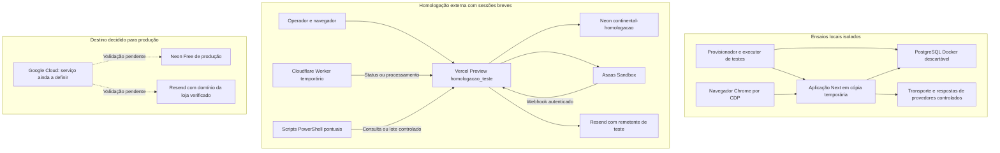

# Relatório geral da homologação e guia de reprodução e continuidade

**Projeto:** Continental — sistema de comércio eletrônico.  
**Período consolidado:** 03 a 08 de outubro de 2026.  
**Data deste relatório:** 08/10/2026, referência local America/Sao_Paulo.  
**Revisão do código no workspace:** `f4f936c8e46d40f0310b7930583413c7942d3845`.  
**Branch de homologação:** `homologacao_teste`.  
**Estado:** homologação em andamento; produção ainda não liberada.

**Atualização de responsabilidades:** **Vanderlei (Que dá idéia errada)** possui acesso ao Google Cloud e será responsável por coordenar/executar o deploy final e colocar o projeto em produção após os gates. **Leno (Brega)** mantém preparação, aceite e acompanhamento de dados/financeiro. A divisão operacional está no [plano em dupla](../../CORRECOES/Correcoes_logicas/Correcao_logica_1/trabalho_em_dupla/PLANO_DE_EXECUCAO_EM_DUPLA_PARA_PRODUCAO.md); esta atribuição não comprova provisionamento nem implantação já realizada.

Este documento reúne o trabalho registrado no repositório e as evidências fornecidas pelo operador durante a sessão. Seu objetivo é permitir que outra pessoa ou agente entenda a arquitetura, reproduza o método, interprete os resultados e continue o trabalho sem depender da memória desta conversa.

Não é um certificado de conclusão nem uma transcrição de logs privados. As contagens de testes pertencem às revisões e aos ambientes em que foram obtidas. A elaboração deste relatório não executou novamente esses testes, não consultou contas autenticadas e não realizou operações financeiras. Foram revisados documentos, código, scripts, histórico Git e evidências já apresentadas.

## Índice

1. [Objetivo e critério de sucesso](#1-objetivo-e-critério-de-sucesso)
2. [Como interpretar as evidências](#2-como-interpretar-as-evidências)
3. [Arquitetura dos ambientes](#3-arquitetura-dos-ambientes)
4. [Arquitetura da compra e do pagamento](#4-arquitetura-da-compra-e-do-pagamento)
5. [Isolamento e proteção dos dados](#5-isolamento-e-proteção-dos-dados)
6. [Trabalho realizado por frente](#6-trabalho-realizado-por-frente)
7. [Histórico do ensaio PIX publicado](#7-histórico-do-ensaio-pix-publicado)
8. [Evidências de testes e limites](#8-evidências-de-testes-e-limites)
9. [Configuração dos ambientes e das sessões](#9-configuração-dos-ambientes-e-das-sessões)
10. [Roteiro para reproduzir a homologação](#10-roteiro-para-reproduzir-a-homologação)
11. [Ferramentas e comandos existentes](#11-ferramentas-e-comandos-existentes)
12. [Diagnóstico e recuperação](#12-diagnóstico-e-recuperação)
13. [Capacidade, custos e decisões de produção](#13-capacidade-custos-e-decisões-de-produção)
14. [Pendências e critérios de liberação](#14-pendências-e-critérios-de-liberação)
15. [Contrato de trabalho para outro agente](#15-contrato-de-trabalho-para-outro-agente)
16. [Modelo de registro de evidência](#16-modelo-de-registro-de-evidência)
17. [Estado de passagem e próximas ações](#17-estado-de-passagem-e-próximas-ações)
18. [Referências e mapa do repositório](#18-referências-e-mapa-do-repositório)

## 1. Objetivo e critério de sucesso

A homologação foi organizada a partir de uma auditoria com **38 achados de lógica**, identificados como LA-001 a LA-038, e de um workflow com etapas WF-00 a WF-20. O problema tratado vai além de verificar se a página abre ou se o provedor cria uma cobrança: uma compra atravessa cadastro, identidade, carrinho, preço, frete, estoque, pontos, pagamento, notificações, expedição e indicadores.

O objetivo é demonstrar que esses componentes conservam a mesma realidade comercial e financeira, inclusive quando ocorrem repetição, concorrência, resposta perdida, evento atrasado, falha de banco e retomada do processamento.

As propriedades buscadas são:

- Uma intenção de compra aceita deve produzir efeitos identificáveis e recuperáveis, sem duplicar pedido ou cobrança por repetição.
- Preço, desconto, frete, parcelas, modalidade e identidade devem ser validados pelo servidor e persistidos no contrato da compra.
- Estoque e pontos devem ter movimentos com origem demonstrável; cancelamento não pode inventar restituição de um débito que nunca foi comprovado.
- Webhooks repetidos ou fora de ordem não podem duplicar crédito, e-mail ou transição comercial, nem fazer um pagamento confirmado regredir indevidamente.
- Falha depois de uma chamada externa deve preservar a incerteza e permitir consultar a operação existente; não autoriza emitir outra cobrança.
- O comprador só deve receber instruções de pagamento autorizadas pelo estado atual, com atualização visual estável e tratamento de expiração.
- Dados de uma loja, usuário ou conta financeira não podem ser utilizados por outro escopo.
- A aplicação deve funcionar no pacote e no ambiente de implantação escolhidos, com capacidade, recuperação e monitoramento demonstrados.

**Conclusão integral:** cada achado precisa ter implementação, integração, evidência no candidato final e observação operacional aplicável. WF-18 trata dados e compatibilidade; WF-19 trata homologação integrada; WF-20 trata implantação e observação. Aprovar o PIX de um pedido não encerra essas três etapas.

## 2. Como interpretar as evidências

### 2.1. Níveis de comprovação

| Evidência | O que permite concluir | O que não permite concluir sozinha |
|---|---|---|
| Inspeção de código | Caminhos, condições e garantias implementadas | Que aquele caminho executou corretamente em um provedor real |
| Teste unitário | Contrato ou regra nas entradas exercitadas | Atomicidade real do banco ou comportamento distribuído |
| Integração com PostgreSQL descartável | Constraints, transações, persistência e interações cobertas | Validade da credencial ou resposta real do Asaas |
| Navegador local com backend real e gateway controlado | Estado visual e ações do usuário nos cenários cobertos | Compatibilidade com todos os dispositivos, redes e contas externas |
| Build otimizado e duas instâncias | Comportamento entre processos, assets e pacote exercitado | Capacidade e operação na infraestrutura final |
| Preview com Sandbox | Integração externa no ambiente e na revisão identificados | Homologação de produção, outros métodos ou todos os casos de falha |
| JSON agregado de filas | Trabalho observado naquele lote ou naquela consulta | Auditoria completa de estoque, carteira e entrega na caixa de entrada |
| Conferência do operador | Resultado visível no painel ou e-mail informado | Inspeção independente do banco pelo agente |

Os registros antigos permanecem como histórico. Por exemplo, declarações de 05/06 de outubro de que não houve pagamento ou envio externo eram verdadeiras naquele checkpoint; foram complementadas pelos testes de 07/08 de outubro. Sempre ler a atualização posterior antes de interpretar uma pendência antiga como atual.

### 2.2. Termos de estado

- **Implementado:** existe a alteração no módulo.
- **Integrado localmente:** foi exercitada com os componentes descritos na evidência local.
- **Cenário aprovado em homologação:** passou o cenário delimitado, com conferências posteriores.
- **LA validado:** todos os critérios daquele achado foram aceitos na revisão candidata, não apenas um cenário relacionado.
- **Encerrado em produção:** implantação e observação aplicáveis foram concluídas.

Nesta data, há 36 achados com implementação principal e ensaio de módulo/integração local; LA-002 e LA-033 permanecem parciais. Os cenários externos descritos neste relatório não promoveram automaticamente nenhum dos 38 achados a encerrado em produção.

## 3. Arquitetura dos ambientes

### 3.1. Três níveis complementares



As ligações de produção representam a decisão de destino, não uma implantação já realizada. O provedor financeiro de produção também precisará de conta, credenciais, escopo e webhook próprios, validados nessa infraestrutura.

### 3.2. Inventário útil para continuidade

| Componente | Identificação ou função |
|---|---|
| Aplicação | Next.js 16.3.5 nos checkpoints registrados, Prisma 5.22.0 e PostgreSQL |
| Ambiente do operador | Windows, PowerShell 5.1; ensaios locais registrados com Node 22.15.0 |
| Branch Git de homologação | `homologacao_teste`; publicação das correções limitada a essa branch |
| Preview utilizado | `https://continental-prototipo-git-homologacaoteste-vinimoias-projects.vercel.app` |
| Banco remoto de homologação | Projeto Neon separado `continental-homologacao` |
| Banco de produção identificado no histórico | `CContinental-DB`; não usar como destino dos testes financeiros/carga |
| Conta lógica dos pagamentos de homologação | `sandbox-hml` |
| Worker temporário | `continental-pagamentos-hml`, na Cloudflare |
| Webhook de homologação | `Continental_Sandbox`, apontado ao Preview pelo operador |
| Remetente do ensaio | `onboarding@resend.dev`, com comprador usando o endereço da própria conta Resend |
| Produção decidida em 08/10 | Google Cloud + Neon Free + remetente da loja verificado no Resend |

O nome `main` de uma branch Neon não é a branch Git `main`. Um Preview não isola o banco por si só: isolamento depende das conexões, do projeto de banco, do tenant e da conta externa realmente configurados.

### 3.3. Separação de responsabilidades

- **Vercel Preview:** executa a aplicação, APIs, validação, transações e consumidores.
- **Neon de homologação:** persiste pedidos, tentativas, filas, fatos, estoque e pontos do ensaio externo.
- **Asaas Sandbox:** cria e expõe a cobrança de teste e entrega notificações ao webhook.
- **Cloudflare Worker:** solicita consultas/lotes no Preview durante janela limitada; não guarda conexão de banco nem precisa da chave Asaas.
- **PowerShell:** oferece ações pontuais com escopo fixo e entradas ocultas, permitindo diagnosticar sem ligar um agendamento permanente.
- **Resend:** recebe a solicitação de envio; a entrega é conferida separadamente pelo operador.
- **Docker local:** absorve os testes extensos, falhas injetadas e concorrência, poupando franquias e protegendo dados persistentes.

## 4. Arquitetura da compra e do pagamento

### 4.1. Fluxo durável

```mermaid
sequenceDiagram
  participant C as Cliente
  participant A as Aplicação
  participant D as Banco de homologação
  participant P as Asaas Sandbox
  participant W as Consumidor financeiro
  participant E as Resend
  C->>A: Aceitar intenção e concluir compra
  A->>D: Persistir contrato, pedido, reserva e tentativa
  A->>P: Criar cobrança da tentativa
  P-->>A: Identidade e contrato da cobrança
  A->>P: Consultar instruções PIX
  A->>D: Persistir evidência e instruções verificadas
  A-->>C: Exibir QR e copia e cola autorizados
  P->>A: Webhook autenticado
  A->>D: Persistir evento na inbox
  A-->>P: Confirmar recepção persistida
  W->>D: Obter trabalho com lease
  W->>P: Consultar estado atual e contrato
  W->>D: Aplicar fatos e efeitos atômicos; concluir inbox
  W->>D: Consumir efeitos pendentes da outbox
  W->>E: Solicitar envio identificado
  E-->>C: Entregar e-mail
  C->>A: Consultar estado da compra
  A-->>C: Pagamento confirmado e acompanhamento
```

O diagrama descreve o caminho positivo. Se a resposta de emissão se perder ou o contrato não puder ser validado, a tentativa deve permanecer recuperável. O consumidor consulta a cobrança existente pela correlação; não repete a emissão como se nada tivesse acontecido.

### 4.2. Contratos que sustentam o fluxo

| Conceito | Função no projeto |
|---|---|
| Intenção de compra e revisão | Fixar a compra consentida, identidade, preços e dependências; rejeitar aceites obsoletos |
| Reserva de estoque | Registrar a origem da baixa e permitir commit/liberação identificados |
| Tentativa de pagamento | Persistir a identidade da operação antes do I/O externo e representar resultado incerto |
| Contrato do gateway | Conferir referência, conta, método, valor, status e parcelamento quando aplicável |
| Inbox | Persistir e deduplicar notificações recebidas |
| Lease e proteção de execução | Permitir concorrência e retomada sem aceitar conclusão de um executor que perdeu sua posse |
| Fatos financeiros | Distinguir evidência de pagamento de um simples status comercial |
| Comando transacional | Coordenar estado, histórico, reserva, pontos e efeitos associados |
| Outbox | Preservar efeitos posteriores ao commit, incluindo notificações, para execução recuperável |
| Supervisão | Mostrar filas, operações, tentativas incertas, vencimentos e leases abandonados |

As consultas ao Asaas ficam fora das transações de aplicação da evidência. A evidência validada é aplicada sob as proteções transacionais do domínio. O webhook não é aceito como prova suficiente para simplesmente marcar o pedido Pago.

### 4.3. Leituras importantes para o diagnóstico

- `POST /api/checkout` com HTTP 202 pode representar resultado financeiro ainda em processamento; não significa QR emitido e persistido com sucesso.
- `POST /api/webhooks/asaas` com HTTP 200 comprova recepção tratada pela aplicação; pode apenas ter criado uma entrada pronta para consumo.
- `POST /api/cron/payments?limit=1` pode responder HTTP 200 e conter `retried > 0`. O resumo precisa ser analisado.
- `claimed` é trabalho obtido; `completed` é trabalho concluído naquela etapa; `retried` e `review` exigem atenção.
- `GET /api/cron/payments/status` é supervisão. O campo `at` é a hora da consulta, não a última execução financeira nem um heartbeat.
- `outbox.completed=1` não identifica sozinho o efeito nem comprova entrega na caixa de entrada.
- Os registros `started`, conclusão e invocação de uma mesma execução não são três execuções diferentes.
- A tela de confirmação consulta o estado persistido. Mantê-la aberta não substitui o consumidor financeiro.

## 5. Isolamento e proteção dos dados

### 5.1. Banco descartável e identidade comprovada

O harness local não se limita a confiar em um nome de banco contendo “test”. Ele provisiona PostgreSQL 16 em container próprio, com porta vinculada a `127.0.0.1`, identidade aleatória, dados temporários e label exclusiva de execução.

O papel de aplicação `ecommerce_test` é restrito. A sentinela pertence ao provisionador e só pode ser lida pelo cliente testado. Antes das operações, o cliente verifica banco, usuário e sentinela. Não há fallback de `TEST_DATABASE_URL` para a conexão privada da aplicação.

O servidor HTTP precisa apresentar o handshake da mesma execução das fixtures. Host externo, redirecionamento ou identidade divergente bloqueiam o teste. O cleanup atua somente sobre fixtures identificadas e dentro de transação; uma FK externa deve impedir e reverter a limpeza, não motivar um delete global.

Foram ensaiadas recusas de URLs enganosas, banco/papel indevidos, parâmetros duplicados, sentinela ausente/divergente, servidor de outra identidade, imports anteriores ao setup e tentativa de alterar a sentinela. O ambiente deve falhar fechado antes de escrever.

### 5.2. Aplicação e pacote isolados

O Next de teste usa cópia temporária dos fontes sem `.env`, saída própria e configuração do executor. Isso preserva o `.next`, o `next-env.d.ts` e o servidor de desenvolvimento do operador.

Além do modo de desenvolvimento, foram criados ensaios com build otimizado e duas instâncias. No standalone, os pacotes são materializados e comparados, e a árvore usada no build é removida antes de iniciar os runtimes. Assim, um teste não passa por depender acidentalmente de arquivos que só existem na máquina de desenvolvimento.

### 5.3. Clone de dados existentes

Em 04/10 foi capturado um backup protegido da origem, em leitura, cujo PostgreSQL era versão 18. Esse artefato foi reutilizado em clones, sem novas conexões à origem nas rodadas descritas. Os ensaios funcionais sintéticos em PostgreSQL 16 e o restore de PostgreSQL 18 são evidências distintas.

O backup e manifestos sensíveis ficam fora do Git, com criptografia AES-GCM, proteção da chave por DPAPI e ACL do usuário Windows. Foram comparados restores, fingerprints, sequências, constraints e histórico; a sanitização ocorreu somente no clone, seguida de nova conferência.

O inventário de legados é somente leitura. Não publica dados pessoais nem cria reparos para tornar o relatório verde. Um restore que funciona não resolve a origem de um saldo, de uma baixa de estoque ou de uma cobrança antiga.

### 5.4. Segredos e papéis das credenciais

| Credencial/configuração | Finalidade | Local do ensaio |
|---|---|---|
| `DATABASE_URL` / `DIRECT_URL` | Conexões do banco de homologação | Preview; valores privados |
| `ASAAS_API_KEY` | Chamadas da aplicação ao Asaas Sandbox | Preview; diagnóstico pontual recebe entrada oculta |
| `ASAAS_WEBHOOK_TOKEN` | Autenticar a notificação recebida | Preview/Asaas; replay recebe entrada oculta |
| `CRON_SECRET` | Autenticar supervisão e executor da aplicação | Preview e solicitante autorizado |
| `VERCEL_BYPASS_SECRET` | Atravessar Deployment Protection do Preview | Worker/scripts; não substitui a autenticação da aplicação |
| `RESEND_API_KEY` | Solicitar envio de e-mail | Preview da branch de homologação |
| `EMAIL_FROM` | Identificar remetente autorizado | Configuração do Preview |

Não colocar valores desses segredos no relatório, Git, capturas, URLs compartilhadas ou saídas de erro. O relatório não contém o bypass que apareceu em um log da conversa; sua substituição precisa ser conferida pelo responsável antes de reutilizar o acesso. A rotação não foi comprovada nesta consolidação.

Para conferir o Neon quando a variável é Secret, o operador comparou privadamente os hostnames com o painel Connect do projeto de homologação; a conexão com pool pode conter `-pooler`. Um marcador `sandbox-hml` no JSON não prova sozinho o destino físico do banco.

## 6. Trabalho realizado por frente

### 6.1. Implementação e integração local que fundamentaram os testes externos

| Frente / achados | Trabalho registrado | Limite atual |
|---|---|---|
| F0 / WF-01, LA-006 | Provisionador isolado, cliente com sentinela, handshake HTTP, fixtures e testes negativos | Revalidar ao alterar harness ou destino |
| WF-02, LA-038 | DTOs públicos/Admin sem credenciais; alteração de segredo por comando explícito; canários de vazamento | Integrações/UI e exposição histórica têm critérios próprios |
| WF-03, LA-030 | Reconciliação de schema monetário, precisão, constraints, migrations em vazio/sintético/clone | Janela e volume real ainda precisam de aceite |
| WF-04 | Base de atores, revisões, locks, recibos e contratos persistidos | Deve permanecer coerente entre todos os escritores |
| WF-05, LA-014/020/032 | Tenant e ownership, comprador convidado, snapshots, leitura pessoal sem escrita indevida | Conferência final de identidade/UX ainda na matriz integrada |
| WF-06, LA-002/027/033 | Comando transacional de estado/histórico/auditoria/outbox, autoria e versão | LA-002/033 ainda parciais por legados e devoluções, entre outros critérios |
| WF-07, LA-018/019 | Variantes, estoque, retirada/restituição identificadas e edição administrativa | Não autoriza corrigir vínculos históricos por inferência |
| WF-08, LA-017 | Unicidade de carrinho ACTIVE, locks, revisão, recibo e consumo serializado | Matriz de concorrência/cliente deve ser concluída |
| WF-09, LA-021/022 | Lotes de pontos, FEFO, alocações, dívida, expiração e retomada | Carteiras legadas exigem reconciliação |
| WF-10, LA-028/029 | Recuperação de acesso, sessão, consumo/revogação atômicos e elegibilidade administrativa | Recuperação operacional/IAM/MFA ainda pendentes |
| WF-11, LA-031/008 | Cotação de frete persistida/assinada, preço/identidade/geografia e revisões de cache | Provedor real e contrato final precisam de ensaio |
| WF-12, LA-035/009/023 | Capacidades por método, plano financeiro, tentativa antes do I/O e regra de ganho congelada | PIX positivo não valida boleto/cartão/parcelamento |
| WF-13, LA-011/004/001/015/013/012 | Intenção canônica, revisão/consentimento, conclusão única, reserva e recuperação | Falhas distribuídas completas ainda abertas |
| WF-14, LA-005/003/010 | Inbox/outbox, conciliação, evidências, cancelamento/estorno e expiração por método | Cenários externos e operação contínua parcialmente comprovados |
| WF-15, LA-034/007/024/016/025 | Carrinho, frete, endereços de entrega/cobrança e confirmação financeira no cliente | Dispositivos/métodos e ambiente final pendentes |
| WF-16, LA-026/037 | Expedição, rastreio, retirada e autoria por modalidade | Aceite operacional completo pendente |
| WF-17, LA-036 | Indicadores por fatos financeiros e cobertura histórica parcial; lista/perfil coerentes | Aceite financeiro e legados pendentes |
| WF-18 | Clone, auditoria de legados, compatibilidade, backfill demonstrável e barreiras de escritores | Dados e contrato operacional não encerrados |
| WF-19 | Regressão selecionada, duas instâncias, standalone/Linux, capacidade e integrações Preview | Em execução |
| WF-20 | Planejamento de implantação, monitoramento, contingência e observação | Não iniciado |

### 6.2. Regras de produto que outro agente deve preservar

Produtos sem variação usam `size: "Único"` e `color: "Padrão"`, com leitura compatível de termos neutros legados. A normalização e resolução usam `lib/product-variants.ts`.

A edição deve preservar o ID da variante e separá-lo da chave interna do formulário. A reconciliação acontece sob lock do produto e valida pertencimento, combinação normalizada, duplicidade, estoque e vínculos. Variantes removidas com carrinhos/pedidos não devem ter seus vínculos apagados. Saneamento exige inventário e backup; o script de reparo é auditoria por padrão.

### 6.3. Achados de dados históricos

No snapshot de 04/10 foram identificados, entre outros:

| Classe | Contagem histórica |
|---|---:|
| Pedidos anteriores ao protocolo de intenção | 24 |
| Itens sem vínculo de variante | 33 |
| Pedidos PENDING históricos | 10 |
| Referências remotas sem tentativa rastreada | 2 |
| Pedidos comercialmente pagos sem fatos financeiros correspondentes | 4 |
| Entregas sem snapshot de cotação | 16 |
| Carteiras ainda sem contrato contábil pronto | 2 |

Essas classes se sobrepõem. Não são um inventário atual da produção. Não foram fabricadas intenções, reservas, fatos financeiros, autoria, datas ou vínculos para eliminar ausências.

Foi bloqueado o caminho que permitia restituir estoque de pedido histórico sem comprovar a baixa anterior. O backfill demonstrável de tenant do carrinho/item foi ensaiado com interrupção, rollback e repetição. A resolução financeira/física das exceções continua pendente.

## 7. Histórico do ensaio PIX publicado

### 7.1. Referência estável do caso

| Campo | Valor do ensaio |
|---|---|
| Pedido | #1 |
| ID interno do pedido | `04e34a9a-70da-4816-b691-3e31c85935b9` |
| Intenção | `f8d25506-d82b-49e8-979b-8b0297d982e5` |
| Cobrança Sandbox | `pay_r4gdsmosa0lh851z` |
| Método / valor | PIX / R$ 24,95 |
| Modalidade de entrega | Retirada no balcão |
| Referência de pontos após aprovação | 113 disponíveis; 0 pendentes; quatro movimentos; um crédito de +12 |

São identificadores históricos de correlação, não credenciais. Não usá-los como fixtures universais em outro ambiente. O preço do item mostrado era R$ 49,90, com débito de 499 pontos equivalente a R$ 24,95 de desconto. O total pago observado foi R$ 24,95. A comprovação desse caso não substitui a matriz financeira de descontos, encargos e estornos.

### 7.2. Agendador: primeiro leitura, depois processamento vazio

1. Foi preparado o Worker `continental-pagamentos-hml`, inicialmente desativado e sem cron, com destino fixo no Preview.
2. O operador configurou os segredos de acesso e uma janela de execução limitada.
3. No modo `status`, foram procuradas conclusões com `state=status_checked`, `mode=status` e `accountScope=sandbox-hml`.
4. A primeira sessão mostrou somente uma consulta comprovada às 17:04:24.808 de 07/10. Registros de GET público, início ou `disabled` não foram contados como novas consultas.
5. Na segunda sessão foram comprovadas quatro consultas consecutivas em 07/10: 18:01:21.491, 18:02:21.355, 18:03:21.340 e 18:04:22.811, horário de Brasília, com contadores zerados.
6. Após o operador conferir os hostnames do banco e habilitar o executor no Preview, o modo `process` produziu três conclusões distintas em 08/10: 11:10:59.543, 11:11:52.202 e 11:14:52.233.
7. Os lotes estavam vazios, sem retry/review; expiração retornou sucesso sem processar pedidos. Isso comprovou o caminho de execução, não o ciclo de uma cobrança.
8. Ao terminar, o operador informou encerramento da sessão: `HML_SCHEDULER_ENABLED=false` e exclusão do Cron Trigger.

“Estimated upcoming events” mostra previsão do agendamento. “Waiting for events” no Live aguarda eventos novos. O contador genérico Success não comprova três conclusões financeiras. A evidência vem dos campos e identidades das execuções.

### 7.3. Preparação do e-mail e do PIX automático

Foi configurada a chave Resend no Preview e o remetente de teste. O operador confirmou que o e-mail do comprador era o da conta Resend, requisito do domínio de teste nesse ensaio. Foram realizados redeploys para aplicar as variáveis à revisão servida.

Ao habilitar PIX automático no painel, a API retornou HTTP 422. A investigação saiu da mensagem genérica do console e foi até o JSON de Response e o campo específico de Payload:

```json
{
  "error": "Validation failed",
  "details": {
    "formErrors": [],
    "fieldErrors": {
      "coverImageUrl": ["Invalid URL"]
    }
  }
}
```

O campo continha `/brand/continental-logo-horizontal.png`. A falha era de validação/metadados do formulário de configurações, não prova de erro na chave PIX do Asaas. Foram corrigidos o tratamento dos campos opcionais e a preservação dos metadados no salvamento. O operador confirmou que conseguiu habilitar PIX automático.

### 7.4. Cobrança criada, mas QR ausente

O primeiro checkout deixou uma cobrança aguardando pagamento no Sandbox e uma tela PENDING/PROCESSING sem QR na loja. A orientação foi preservar o pedido e investigar a cobrança existente.

O log relevante foi localizado em `POST /api/checkout`, às 13:29:31.992 BRT de 08/10, HTTP 202. A aplicação registrou `ASAAS_PIX_ISSUE_FAILED` e `PAYMENT_GATEWAY_FAILED`. Logs de GET `/admin`, `/profile` e `/` enviados anteriormente eram navegação/prefetch e não explicavam a emissão.

O diagnóstico somente leitura da cobrança mostrou:

```json
{
  "externalReferenceMatches": true,
  "installmentField": "absent",
  "installmentNumberField": "null",
  "qrLookupSucceeded": true,
  "hasPayload": true,
  "hasEncodedImage": true
}
```

Foi reproduzida a rejeição local de `installmentNumber:null` em cobrança avulsa. O contrato passou a normalizar apenas os metadados opcionais nulos adequados, preservando as validações de valor, referência, modalidade e parcelamento. A correção não transformou metadados ausentes em prova de contrato parcelado.

Depois da publicação no Preview, a conciliação recuperou as instruções da cobrança já existente. Não foi necessário criar outro pedido ou outra cobrança para resolver o problema.

### 7.5. Alternância visual entre QR e verificação

O operador observou demora de alguns segundos e alternância ao trocar de foco ou capturar a tela. As consultas à intenção retornavam HTTP 200, mas a interface substituía o painel durante revalidação.

Após uma correção intermediária de layout, a solução passou a preservar a última instrução verificada durante consultas breves de foco/visibilidade e atualização periódica, mostrando um indicador discreto. Eventos concorrentes compartilham a consulta em andamento.

A reutilização de instruções acionáveis possui limite de 30 segundos, com medição conservadora. Erro, ausência prolongada, expiração ou resultado sem autorização suspendem as ações até nova verificação. Copiar/abrir instruções também verifica validade no clique. A melhora visual não autorizou manter QR indefinidamente em estado desconhecido.

Testes de navegador verificaram a preservação do mesmo elemento do QR, recuperação, falha, ausência prolongada e vencimento. O operador confirmou o funcionamento após o deploy.

### 7.6. Recebimento no Asaas e falha transacional local

O operador informou “Pagamento recebido” no Sandbox. O webhook chegou ao Preview em 08/10 às 15:53:38.48 BRT, com HTTP 200.

O lote seguinte retornou inbox e conciliação com `claimed=1`, `completed=0`, `retried=1`. O pedido ainda precisava de aplicação local da evidência. O log do executor apontou transação Prisma já encerrada em `order.findUnique`.

Em Docker, a injeção de uma latência de 5.500 ms reproduziu a falha P2028 com o prazo transacional padrão de 5.000 ms. A correção estabeleceu `maxWait=5.000 ms` e `timeout=30.000 ms` somente nas transações de aplicação de evidência/correlação pertinentes. As consultas externas continuaram fora dessas transações; o timeout global não foi ampliado.

O ensaio demonstra um mecanismo compatível com o log remoto, sem fingir que mediu cada consulta do Neon. Após testes e publicação, o mesmo trabalho preservado foi retomado com sucesso.

### 7.7. Pagamento confirmado e e-mail entregue

O lote de retomada concluiu uma inbox e um trabalho de outbox, sem retry/review. O operador confirmou o pedido Pago na tela de confirmação e no painel do usuário, mas o e-mail ainda não havia chegado.

Uma tentativa de supervisão retornou 401 antes do processamento. O script explicitou `processingAttempted=false`; não foi orientada repetição de operação financeira para resolver autenticação. Após reconferir o acesso, a supervisão mostrou:

- Inbox: uma entrada COMPLETED.
- Outbox: duas COMPLETED e uma READY.
- Nenhuma tentativa incerta, vencida, lease abandonada ou operação pendente no agregado informado.

Um lote pontual concluiu a outbox READY. O operador apresentou o e-mail recebido no Gmail, com pedido #1, PIX, total R$ 24,95, retirada no balcão e +12 pontos. Essa conferência encerrou a pendência de entrega do caso, em vez de inferir entrega pelo primeiro contador de outbox.

### 7.8. Evento duplicado após conclusão

Foi preservado o evento original reduzido, sem dados pessoais e sem alterar sua identidade:

- Evento: `PAYMENT_RECEIVED`.
- ID: `evt_d26e303b238e509335ac9ba210e51b0f&21426306`.
- `dateCreated`: `2026-10-08 15:53:37`.
- Cobrança, referência, PIX e R$ 24,95 correspondentes ao pedido #1; status RECEIVED.

O script consultou o estado, enviou uma única repetição ao webhook da aplicação e consultou novamente. Não chamou o processador nem alterou a cobrança no Asaas.

Resultado: `DUPLICATE_ACCEPTED`, `webhookStatus=PROCESSED`, `queuesUnchanged=true`. Inbox manteve uma COMPLETED; outbox manteve três COMPLETED. O operador conferiu pedido Pago, 113 pontos disponíveis, 0 pendentes, quatro movimentos com único crédito de +12 e nenhum novo e-mail, incluindo SPAM.

**Conclusão:** duplicata desse evento já concluído aprovada. Isso não comprova entrega simultânea, crash durante processamento ou todos os critérios de idempotência distribuída.

### 7.9. Notificação antiga sintética após o pagamento

Foi criado um evento explicitamente sintético `PAYMENT_CREATED/PENDING`, com ID fixo `evt_hml_test_order_1_late_pending_v1`, data de teste anterior ao recebimento e a mesma correlação da cobrança paga.

O envio retornou `LATE_EVENT_QUEUED`, `webhookStatus=RECEIVED`, `syntheticEvent=true`, exatamente uma nova inbox READY e outbox inalterada. Em seguida, um único lote concluiu a inbox sem retry/review e sem consumir nova outbox.

A aplicação consulta o estado atual da cobrança e aplica seus contratos; a notificação antiga não deveria ser usada para rebaixar arbitrariamente o pedido. O operador confirmou a preservação dos painéis e do e-mail. A supervisão final foi:

```json
{
  "phase": "scope_check",
  "ok": true,
  "code": "SCOPE_VERIFIED",
  "processingAttempted": false,
  "status": {
    "schemaVersion": 1,
    "at": "2026-10-08T21:53:02.744Z",
    "accountScope": "sandbox-hml",
    "inbox": [{ "_count": 2, "status": "COMPLETED" }],
    "outbox": [{ "_count": 3, "status": "COMPLETED" }],
    "uncertain": 0,
    "overdue": 0,
    "abandonedLeases": 0,
    "operations": [],
    "untrackedLegacyOrders": 0,
    "oldestUnresolvedInboxAt": null
  }
}
```

**Conclusão:** cenário de aplicação com notificação antiga injetada aprovado. Não foi uma reordenação real provocada na infraestrutura do Asaas. Os contadores acima são o checkpoint de 08/10, não uma consulta atual nem um alvo a reproduzir apagando filas.

### 7.10. Revisões relevantes da homologação

| Commit | Alteração |
|---|---|
| `56f3d34` | Preparação das correções de comércio para homologação |
| `b86c232` | Ajustes de cadastro e apresentação de IDs de usuários |
| `cc6c897` | Ações do carrinho preservadas durante atualização |
| `542c7a7` | Navegação do carrinho e disponibilidade dos métodos |
| `a2cbf56` | Salvamento de PIX automático com configurações opcionais |
| `537d6f0` | Preservação dos metadados da loja no salvamento |
| `f23c37d` | Metadados de parcelamento nulos em cobrança avulsa |
| `6bef157` | Layout da confirmação durante revalidação |
| `bcb759f` | Instruções preservadas durante verificação em segundo plano |
| `f4f936c` | Prazo transacional limitado e diagnóstico da aplicação de evidência |

O deployment de `f4f936c` foi registrado como concluído no Preview. Não presumir que uma URL ainda esteja servindo essa revisão em uma ocasião futura; conferir o deployment correspondente antes do ensaio.

## 8. Evidências de testes e limites

### 8.1. Checkpoints registrados

| Etapa | Resultado histórico | Interpretação |
|---|---|---|
| Baseline inicial | 444 unitários / 59 arquivos e typecheck | Referência anterior à sequência de correções |
| WF-18 | 618 unitários / 75 arquivos; 280 integrações / 22 arquivos | Inclui compatibilidade e barreiras de legados |
| Build otimizado e standalone Windows | 289 testes / 24 arquivos em cada modo; 627 unitários / 77 arquivos no checkpoint | Os mesmos 289 foram repetidos por modo; não são 578 casos distintos |
| Linux limpo | Instalação, migrations, pacote e dois runtimes; 627 unitários no checkpoint | Smoke dirigido de compatibilidade; não repetiu os 289 casos completos em Linux |
| Contrato Preview/Sandbox | 635 unitários / 78 arquivos; 30 testes dirigidos / 3 arquivos | Validação controlada da política de ambiente |
| Piloto de capacidade | 11 testes / 3 arquivos | Invariantes passaram; meta de prontidão da home não passou |
| Rodada financeira local de 07/10 | 97 testes / 5 arquivos, 64,10 s | Docker, gateway controlado, sem consumo de Neon/Asaas real |
| Contrato Asaas nulo | 82 unitários / 6 arquivos; 59 integrações / 2 arquivos | Emissão e recuperação sem duplicação com transporte controlado |
| Estabilidade visual final | 32 unitários e cinco testes de navegador | QR preservado quando válido e suspenso nos casos exigidos |
| Prazo transacional | 40 integrações e 20 unitários dirigidos | Antes/depois com falha de latência reproduzida |
| Ferramentas operacionais | 14 testes do Worker; nove do lote PowerShell; 20 do replay | Respostas simuladas; não representam novas chamadas remotas |

Não somar esses totais como testes únicos. São rodadas parcialmente sobrepostas de revisões diferentes. Não registrar os números como resultado de um novo checkout do repositório sem executar e identificar a nova rodada.

### 8.2. Rastreabilidade de algumas execuções

| Ensaio | runId ou referência |
|---|---|
| `next start`, 289 testes | `f2b53823dae68622c51c589f20166d61` |
| Standalone Windows, 289 testes | `6e08bfefecd424146edc6848fcbb5013` |
| Instalação limpa Linux | `95d21e8ebb019a4316bf43b172659d38` |
| Piloto de capacidade | `ea894c7765e03be08da4e6ddeb000df2` |
| Rodada financeira de 07/10 | `a668bf392e7de4a8791fe93f8e2660d2` |
| Integração da correção Asaas nula | `e584bf27e3525ce496a97c7c0f96ff08` |
| Navegador, estabilidade final | `08b8f43131d344f77e68956b12f4bba4` |
| Integração após correção transacional | `6f480dfa2f17f0c2013b18b890fa1ec5` |

Os documentos de execução contêm Build IDs, hashes de fontes/scripts/testes, duração, versões e limitações dos checkpoints. A revisão atual do código não transforma automaticamente os artefatos de revisões anteriores em evidência de um candidato final.

### 8.3. Correção de testes sem mascarar defeitos

Também houve falhas na instrumentação e em fixtures: método HTTP incorreto, dados de fixture inconsistentes, observação de texto afetada por CSS e serialização de referência DOM pelo protocolo do navegador. Esses casos foram corrigidos sem relaxar as invariantes da aplicação, e os cenários pertinentes foram repetidos.

O agente sucessor deve distinguir defeito de produto, defeito de teste e limitação do ambiente, registrando a reprodução e o motivo da alteração. Ajustar um assert apenas para obter resultado verde não constitui validação.

## 9. Configuração dos ambientes e das sessões

### 9.1. Configuração do Preview financeiro

Os nomes abaixo são um mapa; valores secretos devem ser configurados privadamente pelo operador responsável.

| Nome | Condição de homologação |
|---|---|
| `DATABASE_URL` / `DIRECT_URL` | Ambas pertencem ao projeto Neon de homologação conferido |
| `ASAAS_API_URL` | `https://api-sandbox.asaas.com/v3` |
| `ASAAS_ACCOUNT_SCOPE` | `sandbox-hml` |
| `ASAAS_API_KEY` | Chave da conta Sandbox, nunca chave de produção |
| `ASAAS_WEBHOOK_TOKEN` | Mesmo token privado acordado com o webhook Sandbox |
| `ASAAS_ENABLED_LOJA_IDS` | Somente as lojas explicitamente incluídas no ensaio |
| `CRON_SECRET` | Segredo próprio do executor de homologação |
| `RESEND_API_KEY` | Chave autorizada para o ensaio no Preview |
| `EMAIL_FROM` | Remetente autorizado para o destinatário de teste |
| `NEXT_PUBLIC_APP_URL` e domínio canônico | Conferir links, origem e destinos do ambiente; considerar também configuração do tenant |

A regra de ambiente do Asaas reconhece `VERCEL=1` com `VERCEL_ENV=preview` como Sandbox mesmo em build `NODE_ENV=production`. Runtime otimizado fora desse Preview identificado exige produção conforme política atual. Não copiar flags da Vercel para fingir um ambiente no Google Cloud; conferir e adaptar explicitamente o contrato se surgir outro ambiente de testes.

Na configuração local, foi encontrado anteriormente o problema de expansão de `$` na chave pelo loader de `.env`, além de segredo de frete ausente. Houve correção privada registrada em 06/10 e preflight aprovado. Essa regra de escape em arquivo dotenv não deve ser aplicada cegamente ao valor literal cadastrado no painel de um provedor. Nunca imprimir a chave para verificar se o escape funcionou.

### 9.2. Ativação em etapas

| Sessão | `PAYMENT_REMOTE_ENABLED` | `PAYMENT_WORKER_ENABLED` | `PAYMENT_EXPIRATION_ENABLED` | Finalidade |
|---|---|---|---|---|
| Consulta inicial de status | false | false | false | Demonstrar acesso e supervisão |
| Consumidor com filas vazias | false | true | false | Demonstrar execução do lote sem criar cobrança |
| PIX controlado | true | true | false | Emitir, receber evento, conciliar e concluir efeitos do caso |
| Expiração/cancelamento futuros | Conforme cenário validado | Conforme cenário validado | Somente quando o ensaio exigir | Ainda não aprovados externamente por este caso |

O webhook atual exige `PAYMENT_WORKER_ENABLED=true` para aceitar persistência assíncrona. Desabilitar essa flag não é equivalente a pausar apenas o cron: pode fazer a recepção retornar 503. Manter coerência entre recepção, consumidor e trabalhos em andamento.

### 9.3. Worker temporário

| Campo | Uso |
|---|---|
| `HML_SCHEDULER_ENABLED` | Autoriza a sessão quando `true`; desligamento em `false` |
| `HML_SCHEDULER_MODE` | `status` ou `process` |
| `HML_RUN_UNTIL_UTC` | Prazo obrigatório em UTC com `Z`; janela maior que 24h é recusada |
| Cron usado no ensaio breve | `* * * * *` |
| Destino | Hostname fixo do Preview |
| Segredos necessários | `CRON_SECRET` e bypass do Preview |

O GET na URL pública do Worker retorna 404 e não executa pagamento. Cada disparo em modo process consulta primeiro o escopo; só então chama um lote. Redirecionamentos são recusados. Erros e resumos são limitados para não expor respostas privadas.

O arquivo `wrangler.json` inicia desativado e com `crons: []`. Republicá-lo depois de configurar o painel pode restaurar esses valores e remover o cron. Antes de novo deploy, reconciliar configuração desejada e arquivo; não executar publicação repetida como tentativa de corrigir qualquer erro.

Encerramento da sessão: publicar `HML_SCHEDULER_ENABLED=false` e remover o trigger. O prazo impede novos disparos úteis, mas não cancela uma requisição já em execução nem remove o trigger sozinho. O cron de homologação está encerrado conforme relato do operador.

## 10. Roteiro para reproduzir a homologação

Este roteiro deve ser adaptado ao projeto e ao estado real encontrado. Os scripts desta sessão têm destino e algumas fixtures fixos; não são ferramentas genéricas prontas para apontar a outro cliente ou à produção.

### Etapa A — reconstruir o contexto e a base

1. Ler `AGENTS.md`, workflow, contratos comuns, matrizes e registro de execução mais recente.
2. Conferir branch, commit, alterações locais e scripts ainda não versionados. Preservar o trabalho existente.
3. Identificar versões pelo lockfile e instalação, não somente pelos intervalos de versão do package.json.
4. Ler os guias locais relevantes do Next antes de alterar código dessa versão.
5. Montar uma tabela de achado, reprodução, regra esperada, módulos envolvidos, teste e critério de conclusão.
6. Registrar responsáveis, contas/ambientes e o que está autorizado nesta ocasião; uma autorização antiga de produção não deve ser presumida.

**Saída:** baseline identificada, escopo compreendido e nenhuma conexão de teste dependendo implicitamente de produção.

### Etapa B — construir ou verificar o isolamento primeiro

1. Provisionar banco descartável próprio e papel restrito.
2. Verificar sentinela real, metadados e identidade do servidor antes de seed, teste e cleanup.
3. Criar cópia da aplicação sem arquivos privados, com segredos de teste gerados para a execução.
4. Provar recusas de destinos inválidos e falha fechada antes de qualquer mutação.
5. Garantir teardown limitado aos processos, diretórios e containers daquela execução.

**Saída:** testes negativos de isolamento aprovados. Não seguir para carga, migrations ou testes financeiros enquanto isso falhar.

### Etapa C — verificar schema e trajetória dos dados

1. Aplicar migrations em banco vazio.
2. Ensaiar upgrade sintético, replay, constraints e falha no meio da migration.
3. Restaurar backup autorizado em clone protegido e conferir valores, vínculos, sequências, histórico e diferenças de schema.
4. Sanitizar somente o clone e demonstrar que o restore sanitizado preserva o que o teste pretende avaliar.
5. Produzir inventário somente leitura e separar bloqueios técnicos de questões de negócio.
6. Resolver cada exceção com proveniência; não inventar eventos ou vínculos históricos.

**Saída:** trajetória técnica comprovada e lista explícita do que ainda exige reconciliação/aceite.

### Etapa D — corrigir e testar os contratos de domínio

1. Reproduzir cada defeito com o menor cenário que demonstre a regra quebrada.
2. Incluir repetição, rollback, concorrência e falha quando o domínio exigir.
3. Corrigir os escritores e consumidores envolvidos, não apenas o endpoint visível.
4. Manter transações, locks, identidade e evidências de efeito coerentes.
5. Executar testes dirigidos; ampliar regressão diante da abrangência da mudança ou de nova falha.
6. Registrar o que passou e os limites dos mocks/fixtures.

**Saída:** módulos e integrações locais exercitados, com mapeamento dos achados ainda abertos.

### Etapa E — ensaiar runtime e pacote

1. Compilar o mesmo candidato em ambiente isolado.
2. Executar a seleção auditada com duas instâncias compartilhando o banco da execução.
3. Repetir sob standalone independente quando esse for o artefato pretendido.
4. Verificar assets, Prisma, restart e ausência de dependência da árvore de build.
5. Ensaiar instalação limpa no sistema operacional de destino.
6. Identificar commit, Build ID, hashes e versões de cada rodada.

**Saída:** evidência do pacote real. Instalação Linux dirigida não substitui toda a matriz de regressão.

### Etapa F — preparar homologação externa isolada

1. Criar ou conferir branch/Preview, banco separado, loja e contas Sandbox.
2. Comparar privadamente os hosts de `DATABASE_URL` e `DIRECT_URL` com o projeto correto.
3. Configurar os segredos por ambiente e branch, e as capacidades/allowlist do servidor.
4. Preparar remetente e destinatário de e-mail autorizados antes de gerar efeitos de confirmação.
5. Conferir proteção do Preview e autenticação própria de cada endpoint.
6. Fazer o deploy da revisão correta e aguardar a confirmação de conclusão.

**Saída:** ambiente identificado e isolado, sem deduzir isso apenas do nome da branch ou do campo accountScope.

### Etapa G — verificar acesso e execução em duas sessões

1. Rodar primeiro consultas de status com processamento financeiro desabilitado.
2. Conferir três conclusões distintas, escopo e contadores, preservando horários e correlação.
3. Encerrar a janela de status.
4. Habilitar o consumidor no Preview, redeployar e realizar sessão curta com filas vazias.
5. Conferir conclusões `processed`, durações, retries/reviews e eventuais sobreposições.
6. Desligar o Worker e remover o cron ao concluir.

**Saída:** acesso e execução demonstrados. Não confundir fila vazia processada com pagamento homologado.

### Etapa H — executar uma compra controlada até o QR

1. Registrar referência inicial de estoque, carteira, filas e e-mails para o caso.
2. Criar uma única compra com valor e modalidade conhecidos.
3. Conferir pedido, intenção, tentativa e cobrança externa correlacionados.
4. Verificar método, valor, referência e instruções persistidas/autorizadas.
5. Se houver falha após emissão, preservar a compra, inspecionar a cobrança existente e recuperar por conciliação.
6. Conferir QR, copia e cola, validade, foco, atualização e ações de pagamento no navegador.

**Saída:** uma cobrança rastreada e instruções utilizáveis. Não avançar simulando pagamento para esconder falha de emissão.

### Etapa I — confirmar o pagamento e seus efeitos

1. Usar apenas o mecanismo de teste da conta Sandbox; não pagar QR de ensaio com dinheiro real.
2. Conferir a transição no provedor e a entrega autenticada do webhook à revisão correta.
3. Consultar supervisão; executar um lote limitado quando houver trabalho conhecido.
4. Analisar todas as etapas do resumo, mesmo com HTTP 200.
5. Em timeout, consultar o estado antes de decidir nova ação. Em retry/review, localizar a causa e preservar o trabalho.
6. Após conclusão, conferir pedido, histórico, reserva/estoque e carteira conforme os critérios do cenário.
7. Identificar a outbox de confirmação e verificar entrega no provedor de e-mail e na caixa do destinatário, incluindo SPAM.
8. Consultar o estado final e registrar pendências restantes.

**Saída:** resultado comercial/financeiro e efeitos posteriores comprovados no alcance descrito; não apenas uma resposta HTTP bem-sucedida.

### Etapa J — exercitar repetição, ordem e recuperação

1. Registrar a referência anterior de pedido, carteira, filas, estoque e e-mails.
2. Repetir o evento original preservando ID e conteúdo aceito; conferir ausência de novos efeitos.
3. Em cenário separado, injetar notificação sintética antiga com identidade fixa, claramente documentada.
4. Demonstrar recepção, consumo e preservação do estado confirmado.
5. Usar Docker para ampliar concorrência, lease vencido, morte de processo e janelas entre I/O/commit.
6. Ensaiar evento antes da resposta do checkout e retomada por outro executor.
7. Não declarar essas falhas distribuídas aprovadas por um replay serial após conclusão.

**Saída:** evidência por interleaving e ponto de falha, com efeitos contados e identidades preservadas.

### Etapa K — completar métodos, operação e candidato

1. Homologar os demais métodos habilitáveis e seus ciclos de recusa, expiração, pagamento tardio, cancelamento e estorno.
2. Completar frete, identidade, autenticação, carrinho, Admin, expedição, retirada e indicadores.
3. Resolver os dados legados com inventário atualizado e aceite por ocorrência.
4. Medir capacidade e consumo na infraestrutura candidata e corrigir metas não atendidas.
5. Congelar commit, schema e configuração; executar os checks pertinentes desse candidato.
6. Registrar o aceite individual dos 38 achados e o procedimento operacional.
7. Só então seguir para implantação gradual e observação de produção.

## 11. Ferramentas e comandos existentes

### 11.1. Testes locais

Executar a partir da raiz do projeto, após conferir dependências e Docker. Os comandos são referências de reprodução; não foram executados novamente para escrever este relatório.

| Comando | Finalidade e pré-condição |
|---|---|
| `npm run test:unit` | Regras unitárias; não comprova integração externa |
| `npm run test:isolation:negative` | Barreiras contra destino/banco/servidor incorretos |
| `npm run test:migrations:isolated` | Migrations, upgrade sintético e proteções no banco próprio |
| `npm run test:legacy:isolated` | Contratos de compatibilidade de legados em fixtures isoladas |
| `npm run test:production:isolated` | Seleção auditada em build otimizado e duas instâncias |
| `npm run test:standalone:isolated` | Seleção com pacote independente em duas instâncias |
| `npm run test:standalone:linux` | Instalação limpa e smoke dirigido Linux |
| `npm run test:browser:isolated` | Cenários de navegador selecionados sobre aplicação/banco locais |
| `npm run test:capacity:isolated` | Piloto de capacidade definido; não carga livre sobre o Preview |
| `npm run build:isolated` | Build em cópia isolada |
| `npx --no-install tsc --noEmit --incremental false` | Tipagem da revisão local |
| `npm run lint` | Análise estática; distinguir erros de avisos e preservar o escopo |

A seleção auditada está em `scripts/lib/homologation-suites.mjs`; o executor de runtime acrescenta os cenários de `tests/production`. Não descrever suites legadas fora dessa seleção como aprovadas. Comandos diretos de integração/carga/all exigem conferir o isolamento efetivo; não substituir os wrappers por uma conexão persistente.

Rodada financeira local utilizada nesta sessão:

```powershell
node scripts/run-isolated-tests.mjs tests/integration/payment-durable-execution.test.ts tests/integration/payment-plan-authority.test.ts tests/integration/checkout-intent-authority.test.ts tests/integration/checkout-browser-state.test.ts tests/integration/test-environment-isolation.test.ts
```

Reutilização de backup privado já existente, no ambiente autorizado do seu titular:

```powershell
node scripts/verify-restored-clone.mjs --backup-dir '<diretório privado existente>' --audit-legacy
```

O placeholder deve ser substituído pelo diretório realmente protegido e conhecido. Não executar o modo de captura sem compreender sua conexão à origem. A portabilidade do backup protegido por DPAPI exige procedimento próprio; copiar o diretório para outro usuário não comprova possibilidade de restauração.

O preflight `node scripts/check-production-environment.mjs` usa o loader real do Next e pode ler a configuração privada local. Seu resultado é sanitizado e não faz chamadas externas, mas `configurationPassed=true` não significa `productionReady=true`. Não executá-lo apenas para obter valores de segredos.

### 11.2. Ferramentas de homologação externa

| Arquivo | Comportamento |
|---|---|
| `scripts/homologation/payment-scheduler.worker.mjs` | Status/processamento no Preview fixo, prazo obrigatório, sem seguir redirects |
| `scripts/homologation/wrangler.json` | Bootstrap do Worker desativado, sem cron |
| `scripts/homologation/inspect-pix-sandbox.ps1` | Até dois GETs Sandbox para diagnóstico de referência e QR; sem emissão/confirmação |
| `scripts/homologation/process-payments-once.ps1` | GET de escopo seguido, quando aplicável, de um único POST de lote |
| `scripts/homologation/replay-paid-pix-event.ps1` | Replay reduzido validado, supervisão antes/depois e modo sintético específico |
| `scripts/homologation/pix-order-1-received-event.json` | Envelope reduzido original do caso, com identidade preservada |
| `scripts/homologation/pix-order-1-late-pending-test-event.json` | Evento antigo sintético, com identidade fixa de teste |

Consulta somente de leitura:

```powershell
.\scripts\homologation\process-payments-once.ps1 -StatusOnly
```

Um lote de processamento, somente após verificar ambiente e trabalho a consumir:

```powershell
.\scripts\homologation\process-payments-once.ps1
```

O segundo comando pode alterar pedidos/filas e chamar integrações. Não é uma variante equivalente da consulta. Usa `limit=1`, mas executa as etapas de inbox, conciliação, expiração conforme flag e outbox; não significa exatamente um único efeito externo.

Os scripts pedem segredos por entrada oculta. O diagnóstico Asaas pede a chave API; o replay pede o token de webhook. Não confundir as duas credenciais.

**Replays históricos já concluídos — exemplos para entender o roteiro, não próximos comandos desta sessão:**

```powershell
.\scripts\homologation\replay-paid-pix-event.ps1 -EventFile .\scripts\homologation\pix-order-1-received-event.json
.\scripts\homologation\replay-paid-pix-event.ps1 -EventFile .\scripts\homologation\pix-order-1-late-pending-test-event.json -LatePending
```

Não repetir esses comandos para obter novamente as contagens do relatório. No caso sintético, o ID já foi consumido; um novo envio não deve ser interpretado como primeira entrada READY. Para outro ambiente/caso, adaptar e testar explicitamente destino, referências, identidade, pré-condições e expectativas; não remover guardas apenas para aceitar um payload diferente.

### 11.3. Testes das ferramentas operacionais

Existem testes em `tests/scripts/payment-scheduler-worker.test.mjs`, `process-payments-once.test.ps1` e `replay-paid-pix-event.test.ps1`. Exercitam validação, escopo, respostas esperadas, falhas, ausência de repetição automática e preservação de informações privadas, usando respostas substituídas.

Executar esses testes é diferente de executar o script operacional. Um agente novo deve conferir o harness antes de invocar cada arquivo e registrar se houve simulação ou acesso real.

## 12. Diagnóstico e recuperação

### 12.1. Tabela de decisões

| Sinal | Próxima investigação | Ação que não resolve o diagnóstico |
|---|---|---|
| HTTP 422 em settings | Response JSON, fieldErrors e apenas o campo pertinente do Payload | Gerar outra chave PIX sem identificar o campo inválido |
| HTTP 202 no checkout e cobrança existente | Correlacionar tentativa/cobrança e consultar contrato/QR existente | Refazer checkout ou criar nova cobrança |
| `PAYMENT_GATEWAY_FAILED` genérico | Localizar estágio e diagnóstico sanitizado; reproduzir contrato real | Tratar o rótulo local como código oficial Asaas |
| QR alternando com verificação | Observar polling/foco/visibilidade, validade e duração das consultas | Remover toda revalidação ou manter instruções vencidas indefinidamente |
| Webhook HTTP 200, pedido não pago | Conferir inbox, consumidor e fatos aplicados | Marcar Pago apenas pelo HTTP ou pelo envelope recebido |
| Lote HTTP 200 com `retried > 0` | Log seguro da etapa e estado persistido antes de retomar | Declarar sucesso por status HTTP ou repetir em loop |
| Prisma P2028 / transação encerrada | Reproduzir duração/escopo e verificar uso do cliente transacional | Aumentar globalmente todos os timeouts sem diagnóstico |
| 401 ou redirect em scope_check | Credenciais e proteção do Preview; conferir se POST não foi enviado | Repetir pagamento ou desativar autenticação para passar |
| Timeout depois de POST | Consulta de estado e correlação da operação existente | Presumir que nada aconteceu e reenviar automaticamente |
| Pedido Pago sem e-mail | Identificar outbox pendente, efeito, envio e destinatário | Reaprovar pedido para tentar disparar outro e-mail |
| Mesmo ID de evento, conteúdo diferente | Comparar o envelope aceito e preservar o original | Inventar novo ID e chamar isso de teste de duplicata |
| Snapshot antigo com ausências | Inventário atual, provas históricas e conciliação por ocorrência | Preencher variante/reserva/fato por dedução |

### 12.2. Sequência usada para tratar uma falha

1. Congelar a reprodução: registrar horário, endpoint, ambiente, revisão e identificadores de correlação.
2. Determinar o que certamente aconteceu e o que está incerto.
3. Fazer a menor consulta de leitura que reduza essa incerteza.
4. Reproduzir a regra ou falha em ambiente descartável, quando possível.
5. Corrigir preservando identidade, estado durável e demais contratos.
6. Testar o caso que falhava, caminhos adjacentes e efeitos repetidos.
7. Publicar apenas na homologação e conferir a revisão servida.
8. Retomar a operação existente com lote limitado.
9. Conferir efeito persistido, interface e sistemas externos.
10. Registrar limites e só então avançar ao próximo cenário.

## 13. Capacidade, custos e decisões de produção

### 13.1. Metas e resultado do piloto

O operador informou 100–300 visitantes/dia, 30–80 usuários simultâneos e 2–5 checkouts/minuto. A meta de aproximadamente 1–1,5 segundo se refere à página pronta, não apenas à resposta HTTP.

O piloto local usou duas instâncias, dois perfis de 120 segundos, clientes HTTP e um navegador desktop por perfil. A mídia externa foi bloqueada. Houve 736 e 1.960 requisições cronometradas sem falhas nos respectivos perfis, mas o máximo de requests simultâneos observado pelo helper foi dois; portanto, isso não equivale a 80 navegadores reais nem 80 requisições simultâneas.

| Medida | Perfil 30 usuários / 2 compras por minuto | Perfil 80 usuários / 5 compras por minuto |
|---|---:|---:|
| HTTP p95 | 29,0 ms | 24,2 ms |
| Home pronta p95 | 6.116,6 ms | 6.094,9 ms |
| Checkout pronto p95 | 255,6 ms | 227,2 ms |

A home não atendeu à meta. Vídeo/fallback/animação contribuíram para a prontidão tardia. O resultado é histórico e parcial; não certifica mídia real, celular, CDN, rede, escala fria ou Google Cloud. A melhoria/decisão sobre a home e a nova medição permanecem pendentes.

### 13.2. Decisões recebidas em 08/10

| Tema | Decisão | Consequência |
|---|---|---|
| Hospedagem | Vercel na homologação; Google Cloud em produção | Escolher serviço/região/artefato e validar o candidato no destino final |
| Banco | Manter Neon Free | Desenhar e medir a operação dentro das cotas; não presumir capacidade aprovada |
| E-mail | Configurar remetente da loja ao final | Verificar domínio e DNS no Resend e testar outros destinatários antes da abertura |
| Economia noturna | Avaliar redução de consumo depois de 00h | Horário final e política não definidos; nenhuma mudança de agendamento aplicada |

Não foi escolhido um serviço específico do Google Cloud nem provisionada infraestrutura por essas decisões. A proposta anterior de Vercel comercial e Neon Launch foi substituída pela decisão do operador.

### 13.3. Orçamento de compute do Neon

Na referência oficial consultada em 08/10, o Free dispõe de 100 CU-hours por projeto/mês e 1 GB de armazenamento de banco. Um compute constante de 0,25 CU ativo durante 30 dias consumiria:

```text
0,25 CU × 24 h/dia × 30 dias = 180 CU-hours
```

Mesmo uma suspensão completa hipotética entre 00h e 08h, com atividade contínua nas outras 16 horas, resultaria em 120 CU-hours. A cota de 100 corresponderia a 400 horas mensais nessa capacidade, aproximadamente 13h20 por dia em 30 dias, sem margem para capacidade adicional.

Essas contas são cenários, não previsão do tráfego da loja. O Free suspende após cinco minutos de inatividade e volta ao ser acessado. Cron, polling da confirmação, acesso administrativo, compras e webhooks podem manter ou reativar o banco. A hospedagem no Google Cloud não amplia a franquia Neon.

A estratégia a avaliar é reduzir verificações vazias e executar trabalho necessário por demanda, mantendo recuperação, expiração e prazo de atendimento. O webhook atual apenas persiste a inbox; desligar o consumidor à noite pode atrasar confirmação e e-mail. Não há uma solução já implementada de fila/executor por demanda para produção nesta decisão.

### 13.4. E-mail de produção

O remetente de teste `onboarding@resend.dev` foi suficiente para o comprador associado à conta Resend. Para os clientes da loja, será necessário verificar o domínio próprio no Resend, configurar os registros DNS exigidos, `EMAIL_FROM` e a autorização da chave, e testar entrega e links no ambiente final.

A existência de chave Resend no projeto de produção foi informada pelo operador; isso não comprova automaticamente domínio, remetente ou configuração do futuro Google Cloud. Não foi declarada ausência de configuração existente sem inspeção.

### 13.5. Fontes oficiais das decisões de infraestrutura

- [Neon: atualização do Free em 02/10/2026](https://neon.com/blog/neon-free-plan-1-gb-per-project).
- [Neon: documentação oficial de scale to zero](https://github.com/neondatabase/website/blob/main/content/docs/introduction/scale-to-zero.md).
- [Resend: domínios verificados](https://resend.com/docs/dashboard/domains/introduction).
- [Resend: restrição do domínio resend.dev](https://resend.com/docs/knowledge-base/403-error-resend-dev-domain).
- [Vercel Hobby: referência que motivou a discussão de hospedagem](https://vercel.com/docs/plans/hobby).

Planos, limites e interfaces podem mudar. Um agente futuro deve reconferir as fontes oficiais antes de transformar essas referências datadas em configuração ou orçamento.

## 14. Pendências e critérios de liberação

### 14.1. WF-18 — dados e compatibilidade

- Atualizar inventário/clone e tratar operações posteriores ao snapshot de 04/10.
- Conciliar vínculos de variantes, reservas e movimentos físicos de estoque.
- Conciliar referências externas e fatos financeiros ausentes sem inferência por status.
- Resolver origem, consumo, validade e contabilização das carteiras legadas.
- Completar LA-002/033, incluindo devoluções físicas/parciais e contratos pertinentes.
- Ensaiar trajetória de migration, locks, backup/restauração e coexistência de escritores/leitores no volume adequado.
- Registrar decisões por ocorrência e aceite operacional.

### 14.2. WF-19 — homologação integrada

- PIX: ampliar cancelamento, expiração, pagamento tardio, estorno e seus efeitos.
- Boleto/cartão: emissão, recusa, 1x/parcelado, juros/descontos/encargos, valores e datas bancárias conforme os métodos habilitados.
- Recuperação: morte de processo antes/depois de I/O e commit, evento antes da resposta, lease vencido e retomada por outro executor.
- Concorrência: consumidores simultâneos, última unidade, Admin e carrinho/replay/abas.
- Loja: frete externo/cache, tenant, convidado, sessão/reset, papéis, retirada/expedição/rastreio e métricas.
- Interface: matriz de métodos, estados, navegadores, dispositivos e acessibilidade pertinente.
- Capacidade: resolver a home fora da meta e medir páginas completas, pool, locks, escala fria e consumo na infraestrutura candidata.
- Operação: consumidores duráveis, heartbeat real, alertas, recuperação administrativa, responsáveis e orçamento de cotas.
- Candidato: congelar commit/schema/configuração, completar checks pertinentes e registrar aceite por achado.

### 14.3. WF-20 — implantação e observação

**Executor e coordenador do deploy final:** **Vanderlei (Que dá idéia errada)**, com seu acesso ao Google Cloud. **Leno (Brega)** fornece o aceite e os procedimentos ensaiados de dados/financeiro e acompanha a conciliação. A janela é combinada entre ambos após WF-18/WF-19; tarefas que dependam de acesso à nuvem são executadas por Vanderlei, sem presumir acesso de Leno.

1. Definir serviço Google Cloud, região, dimensionamento, domínio/TLS, segredos e custos.
2. Preparar artefato, procedimento de migrations, backup/restauração e contingência.
3. Conferir conta Asaas de produção, escopo, allowlist, flags, webhook e remetente verificado.
4. Coordenar a publicação de escritores/leitores/consumidores compatíveis.
5. Ativar processamento e observabilidade antes de aceitar operações assíncronas sem acompanhamento.
6. Liberar volume/métodos/lojas conforme o escopo homologado.
7. Conciliar primeiras operações e observar os ciclos financeiros/comerciais definidos.
8. Encerrar os achados somente com a evidência operacional correspondente.

Rollback de aplicação ou restore do banco não desfaz uma cobrança ou um pagamento realizado no provedor. A contingência precisa preservar fatos, eventos, identidades e capacidade de recuperação. Bloquear novas operações de um escopo com falha não deve eliminar o acompanhamento das já iniciadas.

## 15. Contrato de trabalho para outro agente

### 15.1. Primeira leitura obrigatória

1. Este relatório para visão geral e estado de passagem.
2. `AGENTS.md` para regras atuais do repositório.
3. Seção 12 do workflow e as últimas entradas do registro de execução.
4. Matrizes WF-18/WF-19 e contratos comuns do domínio que será alterado.
5. Código e testes realmente presentes na revisão atual.

### 15.2. Práticas que deram profundidade ao processo

- Trabalhar por hipótese verificável: identificar entrada, resultado esperado, evidência faltante e menor experimento útil.
- Separar configuração, recepção, processamento, efeito comercial e entrega de e-mail; cada um pode falhar independentemente.
- Reproduzir falha local antes de alterar contrato importante, sempre que viável.
- Conferir invariantes após o processamento, não somente mensagens de sucesso.
- Preservar o mesmo pedido/cobrança durante recuperação de resultado incerto.
- Distinguir contagem de eventos de contagem de execuções e distinguir repetição de cenário de cobertura nova.
- Usar testes extensos locais e chamadas externas breves, delimitadas e observáveis.
- Identificar revisão servida e ambiente em cada evidência.
- Informar ao operador o que foi descoberto e qual observação seguinte resolve a incerteza.
- Registrar pendência como pendência; não preencher lacunas históricas com suposições.
- Manter testes e ferramentas operacionais com validação de escopo, erros sanitizados e ausência de retentativa automática cega.

### 15.3. Limites que precisam ser preservados

- Não ler ou divulgar segredos para montar relatórios; solicitar apenas a confirmação necessária ou usar entrada oculta no fluxo autorizado.
- Não apontar testes de carga, fixtures, limpeza ou migrations experimentais ao banco persistente.
- Não executar scripts de reparo com mutação sem inventário, backup e escopo concretos.
- Não usar estado comercial isolado como prova de pagamento ou movimento de estoque.
- Não enfraquecer valor, conta, referência ou contrato do gateway para aceitar qualquer resposta.
- Não reenviar eventos com novos IDs para ocultar conflito ou resultado incerto.
- Não confundir API key Asaas, token do webhook, segredo do cron e bypass Vercel.
- Não publicar em produção com base na autorização de publicação da homologação.
- Não interpretar um recurso desligado como achado corrigido ou teste aprovado.
- Não repetir rodadas caras ou mutações já concluídas apenas para produzir novamente o mesmo log.

### 15.4. Como adaptar para outro projeto

Conservar o método, não os identificadores desta loja. Substituir explicitamente domínios, bancos, tenant, conta Sandbox, destinatários, versões, metas e referências do pedido; revisar todos os destinos fixos nos scripts. Preparar novas fixtures com proveniência e validar novamente as proteções antes do primeiro POST externo.

Se mudar hospedagem, gateway ou serviço de e-mail, conferir seus contratos oficiais e o comportamento real das respostas. O defeito de `installmentNumber:null` mostrou por que fixtures plausíveis, mas incompletas, não substituem observação do contrato externo.

## 16. Modelo de registro de evidência

Usar uma ficha por cenário ou rodada coerente. Não colocar segredos ou dados pessoais no artefato público.

```text
Identificação do cenário:
LA / WF / critério da matriz:
Objetivo e hipótese:
Data/hora local e UTC:
Executor e responsável pelo aceite:
Commit / estado do workspace / deployment / Build ID:
Versões e sistema operacional:
Ambiente, tenant e conta lógica:
Prova de isolamento e pré-condições:
Fonte de dados: fixture, clone sanitizado ou Sandbox:
Referências de correlação permitidas:
Comando/ação executada e seu alcance:
Estado anterior: pedido, tentativa, filas, estoque, pontos e e-mail:
Falha injetada ou entrada utilizada:
Resultado esperado:
Resultado observado:
Contagens e invariantes verificadas após a ação:
Hashes/runId/artefatos sanitizados:
Falhas encontradas e reprodução:
Correção aplicada e revisão publicada, se houver:
Checks posteriores e resultado:
Recursos temporários descartados / sessão remota encerrada:
Limites da evidência:
Pendências e próxima ação:
Estado: implementado, integrado, cenário aprovado, LA validado ou observado em produção:
```

Exemplo de conclusão adequada: “A repetição do mesmo PAYMENT_RECEIVED já concluído preservou uma inbox concluída, três outbox concluídas, pedido Pago, carteira com crédito único e um único e-mail, neste Preview e neste caso”.

Exemplo de extrapolação indevida: “Todos os pagamentos são idempotentes e a aplicação está pronta para produção”.

## 17. Estado de passagem e próximas ações

### 17.1. O que outro agente encontrará

- Código em `homologacao_teste`, HEAD `f4f936c8e46d40f0310b7930583413c7942d3845` na elaboração do relatório.
- Workflow, registro e matriz WF-19 com alterações locais de acompanhamento.
- Guia do agendador, análise de infraestrutura, scripts de homologação e testes de scripts ainda não rastreados no Git no momento da inspeção. Estão no workspace, mas um clone remoto pode não contê-los.
- Este relatório é uma entrega local nova. Sua criação não publicou arquivos nem alterou serviços.
- `.env` não foi lido nem alterado para esta consolidação.

Antes de transferir o trabalho para outra máquina ou agente sem este workspace, conferir o pacote de documentos/scripts que realmente será disponibilizado e versionar os arquivos apropriados sem incluir segredos. Commit do código sozinho não garante disponibilidade de todo o material operacional desta sessão.

### 17.2. Referência operacional mais recente

| Item | Última evidência registrada |
|---|---|
| Pedido #1 | Pago; acompanhamento disponível no painel |
| PIX | Instruções recuperadas e interface aprovada pelo operador |
| E-mail | Uma confirmação entregue, sem nova confirmação após os replays |
| Carteira | 113 disponíveis, 0 pendentes, quatro movimentos, crédito único de +12; total acumulado exibido 612 |
| Inbox | Duas COMPLETED na consulta de 08/10 às 21:53:02.744Z |
| Outbox | Três COMPLETED na mesma consulta |
| Pendências do agregado | uncertain/overdue/abandonedLeases/untrackedLegacyOrders zerados; operations vazia; oldestUnresolvedInboxAt nulo |
| Agendamento Cloudflare | Encerrado, flag false e cron removido conforme relato do operador |
| Expiração no ensaio PIX | Desabilitada; nenhum cancelamento por expiração aprovado nesse caso |
| Workflow | WF-18 e WF-19 em execução; WF-20 não iniciado |

Esses valores são referência histórica, não estado remoto consultado durante a redação. Mudança legítima posterior não deve ser revertida para fazer o ambiente coincidir com esta tabela.

### 17.3. Continuidade recomendada

1. Preservar o pedido #1 como evidência; não repetir emissão, confirmação ou replays já aprovados sem novo objetivo de teste.
2. Completar recuperação/concorrência em Docker: evento antes da resposta, lease vencido e morte de processo nas janelas relevantes.
3. Preparar casos independentes de cancelamento, expiração, pagamento tardio e estorno, com referência anterior de estoque/pontos e efeitos esperados.
4. Prosseguir com boleto/cartão e os demais fluxos conforme a matriz.
5. Resolver inventário/aceite de legados e capacidade, incluindo a home e o orçamento Neon.
6. Definir e ensaiar a infraestrutura Google Cloud e o remetente de produção.
7. Congelar e validar o candidato completo antes de WF-20.

## 18. Referências e mapa do repositório

Os links relativos abaixo partem da pasta deste relatório. Em caso de divergência, conferir a revisão e a atualização mais recente do documento, preservando a distinção entre histórico e evidência atual.

### 18.1. Documentos principais

- [Workflow de implementação e conclusão](../../CORRECOES/Correcoes_logicas/Correcao_logica_1/Workflow/WORKFLOW_IMPLEMENTACAO_CORRECOES_LOGICAS.md): etapas, critérios e decisões recentes, especialmente seção 12.
- [Registro de execução](../../CORRECOES/Correcoes_logicas/Correcao_logica_1/Workflow/REGISTRO_EXECUCAO_CORRECOES_LOGICAS.md): histórico detalhado; seções 1–33 para base/testes, 34–61 para PIX/e-mail, 62–70 para repetição/ordem e 71–73 para prontidão/infraestrutura.
- [Contratos comuns](../../CORRECOES/Correcoes_logicas/Correcao_logica_1/Workflow/CONTRATOS_COMUNS_CORRECOES_LOGICAS.md): decisões de domínio e contratos compartilhados.
- [Matriz de legados WF-18](../../CORRECOES/Correcoes_logicas/Correcao_logica_1/Workflow/MATRIZ_COMPATIBILIDADE_E_RECONCILIACAO_LEGADOS.md): origem, inventário e procedimentos de conciliação.
- [Matriz integrada WF-19](../../CORRECOES/Correcoes_logicas/Correcao_logica_1/Workflow/MATRIZ_HOMOLOGACAO_INTEGRADA_WF19.md): critérios, checkpoints, runtime, capacidade e integrações.
- [Guia do agendador e ensaios pontuais](../../CORRECOES/Correcoes_logicas/Correcao_logica_1/Workflow/GUIA_AGENDADOR_PAGAMENTOS_HOMOLOGACAO.md): operação Cloudflare/Preview e procedimentos do caso PIX.
- [Análise de infraestrutura](../../ANALISE_DE_INFRAESTRUTURA/ANALISE_LIMITES_VERCEL_HOBBY.md): consumo histórico e decisão posterior Google Cloud/Neon Free.
- [Regras do repositório](../../../AGENTS.md).

### 18.2. Código e ferramentas de referência

| Área | Arquivos |
|---|---|
| Isolamento | [Provisionador PostgreSQL](../../../scripts/lib/disposable-postgres.mjs), [executor isolado](../../../scripts/run-isolated-tests.mjs), [política de banco](../../../lib/testing/database-policy.ts) |
| Runtime | [executor de produção](../../../scripts/run-production-tests.mjs), [pacote standalone](../../../scripts/lib/standalone-package.mjs), [verificação Linux](../../../scripts/verify-linux-standalone.mjs) |
| Seleção auditada | [homologation-suites.mjs](../../../scripts/lib/homologation-suites.mjs) |
| Migrations/clone | [migrations](../../../scripts/verify-runtime-migrations.mjs), [clone](../../../scripts/verify-restored-clone.mjs), [inventário legado](../../../scripts/lib/legacy-commerce-audit.mjs) |
| Ambiente Asaas | [política de ambiente](../../../lib/config/asaas-environment.mjs), [preflight](../../../scripts/check-production-environment.mjs) |
| Emissão e contrato | [executor da tentativa](../../../services/payment/checkout-payment.service.ts), [adapter Asaas](../../../services/asaas/asaas.adapter.ts), [contrato](../../../services/payment/gateway-contract.ts) |
| Execução durável | [inbox](../../../services/payment/payment-inbox.service.ts), [worker](../../../services/payment/payment-worker.service.ts), [outbox](../../../services/payment/payment-outbox.service.ts), [política transacional](../../../services/payment/payment-execution-policy.ts) |
| APIs operacionais | [webhook](../../../app/api/webhooks/asaas/route.ts), [processamento](../../../app/api/cron/payments/route.ts), [supervisão](../../../app/api/cron/payments/status/route.ts) |
| Interface | [confirmação](../../../app/checkout/confirmation/page.tsx), [projeção do resultado](../../../lib/commerce/purchase-result.ts), [contrato do cliente](../../../lib/commerce/purchase-client.ts) |
| Operação de homologação | [Worker](../../../scripts/homologation/payment-scheduler.worker.mjs), [lote pontual](../../../scripts/homologation/process-payments-once.ps1), [replay](../../../scripts/homologation/replay-paid-pix-event.ps1), [diagnóstico PIX](../../../scripts/homologation/inspect-pix-sandbox.ps1) |

O valor deste processo está na combinação de isolamento demonstrado, contratos explícitos, falhas reproduzidas, recuperação da mesma operação e evidências delimitadas. A continuidade deve conservar essa disciplina até os critérios de dados, candidato e operação de produção estarem efetivamente atendidos.
