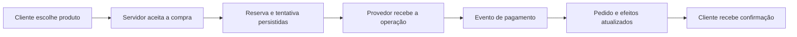
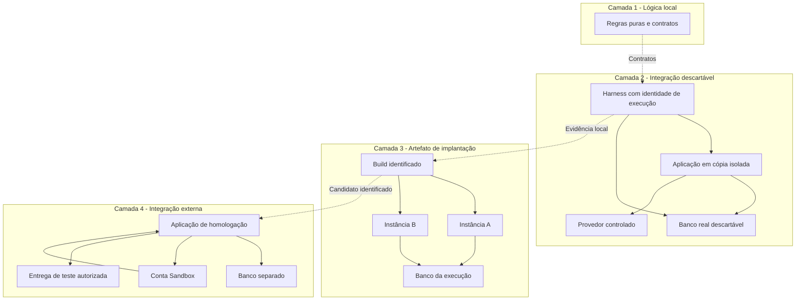
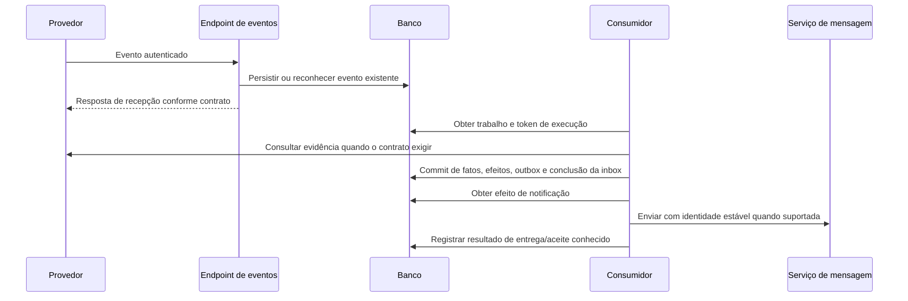
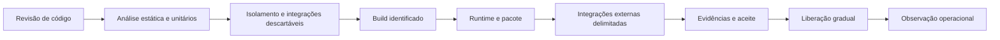

# Como projetar uma homologação segura, reproduzível e escalável

## Estudo de caso prático para desenvolvedores e agentes de software

**Público:** desenvolvedores juniores, pessoas responsáveis por qualidade, líderes técnicos e agentes que implementam ou verificam software.  
**Data:** 08/10/2026.  
**Natureza:** material didático baseado em uma experiência real, com cenário, identificadores e exemplos generalizados.  
**Pré-requisitos:** entender funções, requisições HTTP, tabelas e operações básicas de Git. Os conceitos de transação, idempotência e processamento assíncrono são explicados ao longo do texto.

Este documento ensina a construir um processo de homologação. Ele não depende de um provedor de nuvem, framework, gateway de pagamento ou ferramenta de testes específicos. Os nomes de comandos e arquivos de arquitetura, quando apresentados como propostas, são exemplos a implementar no projeto de destino. O laboratório Python da seção 12 é a exceção: seu código é completo e pode ser executado localmente.

A experiência que originou o estudo incluiu bancos descartáveis, testes com duas instâncias, restauração de backup, integração Sandbox, processamento assíncrono, recuperação de falhas e conferência humana. Na experiência real, cenários delimitados foram aprovados, mas a liberação integral de produção ainda estava pendente. O estudo não apresenta práticas propostas como se todas já tivessem sido implementadas ou validadas naquele sistema.

O histórico específico está no [Relatório 1](../Relatorio_1/RELATORIO_GERAL_HOMOLOGACAO_E_GUIA_DE_CONTINUIDADE.md). Esta leitura é autossuficiente: não é necessário conhecer aquele projeto para estudar o método.

**Nota de continuidade do caso real:** **Vanderlei (Que dá idéia errada)** possui acesso ao Google Cloud e responde pelo deploy final e pela entrada em produção; **Leno (Brega)** entrega o aceite e acompanha dados/financeiro. O [plano em dupla](../../CORRECOES/Correcoes_logicas/Correcao_logica_1/trabalho_em_dupla/PLANO_DE_EXECUCAO_EM_DUPLA_PARA_PRODUCAO.md) detalha essa divisão. Nos demais projetos, atribua nominalmente execução e aceites às pessoas correspondentes; a distribuição deste caso não altera os gates ensinados neste estudo nem significa que o deploy já ocorreu.

## Como estudar

| Percurso | Leitura e prática | Resultado esperado |
|---|---|---|
| Fundamentos | Seções 1–5 e exercício de invariantes | Explicar o que precisa ser comprovado e onde cada teste deve ocorrer |
| Arquitetura | Seções 6–10 e desenho do seu próprio ambiente | Projetar isolamento, dados, identidades, processamento e observabilidade |
| Laboratório | Seções 11–13, executando o exercício local | Observar duplicidade, conflito, rollback e retomada em exemplos concretos |
| Aplicação profissional | Seções 14–20 | Planejar capacidade, pipeline, liberação e continuidade por outra pessoa |

Não tente decorar nomes de serviços. Ao terminar cada seção, responda: **qual falha esta decisão impede, que evidência demonstra isso e o que continua sem comprovação?**

## Índice

1. [O que homologar significa](#1-o-que-homologar-significa)
2. [O caso da loja fictícia Aurora](#2-o-caso-da-loja-fictícia-aurora)
3. [Converter requisitos em invariantes](#3-converter-requisitos-em-invariantes)
4. [Arquitetura dos ambientes](#4-arquitetura-dos-ambientes)
5. [Construir isolamento que possa ser demonstrado](#5-construir-isolamento-que-possa-ser-demonstrado)
6. [Configuração, segredos e contratos externos](#6-configuração-segredos-e-contratos-externos)
7. [Dados, migrations e recuperação](#7-dados-migrations-e-recuperação)
8. [Projetar fluxos assíncronos verificáveis](#8-projetar-fluxos-assíncronos-verificáveis)
9. [Concorrência, leases e limites de transação](#9-concorrência-leases-e-limites-de-transação)
10. [Observabilidade e experiência do usuário](#10-observabilidade-e-experiência-do-usuário)
11. [Roteiro de uma campanha de homologação](#11-roteiro-de-uma-campanha-de-homologação)
12. [Laboratório executável: eventos e efeitos únicos](#12-laboratório-executável-eventos-e-efeitos-únicos)
13. [Laboratórios com o banco e os processos reais](#13-laboratórios-com-o-banco-e-os-processos-reais)
14. [Capacidade e consumo sem conclusões enganosas](#14-capacidade-e-consumo-sem-conclusões-enganosas)
15. [Pipeline e promoção do candidato](#15-pipeline-e-promoção-do-candidato)
16. [Diagnóstico por estudo de caso](#16-diagnóstico-por-estudo-de-caso)
17. [Critérios de aceite e operação](#17-critérios-de-aceite-e-operação)
18. [Escalar o método para outros projetos](#18-escalar-o-método-para-outros-projetos)
19. [Roteiro de trabalho para agentes e equipes](#19-roteiro-de-trabalho-para-agentes-e-equipes)
20. [Exercícios finais, glossário e referências](#20-exercícios-finais-glossário-e-referências)

## 1. O que homologar significa

Homologar é reunir evidências suficientes de que uma revisão identificada do sistema atende a requisitos definidos, em condições relevantes para seu uso, e pode ser operada com consequências conhecidas.

Um site abrir não demonstra que uma compra foi cobrada corretamente. Um teste passar não demonstra que a credencial do provedor funciona. Um pagamento aparecer no provedor não demonstra que o banco local registrou o recebimento. Cada observação responde a uma pergunta diferente.

### 1.1. Termos que não devem ser confundidos

| Termo | Pergunta principal |
|---|---|
| Teste unitário | Esta regra funciona para as entradas exercitadas? |
| Teste de integração | Estes componentes, protocolos e persistências funcionam juntos? |
| Teste de contrato | O consumidor e o produtor concordam sobre formato e significado dos dados? |
| Teste de ponta a ponta | Um fluxo representativo atravessa as fronteiras necessárias e produz o resultado esperado? |
| Teste de aceitação | O comportamento atende ao critério de negócio acordado? |
| Ambiente de staging ou homologação | Onde verificamos a revisão antes da liberação? |
| Homologação | Que conjunto de evidências sustenta o aceite desta revisão e deste escopo? |
| Implantação | Como colocamos o artefato e sua configuração em execução? |
| Observação de produção | O comportamento real após a liberação confirma as expectativas? |

“Ambiente de homologação” é um lugar de execução. “Processo de homologação” é o trabalho de demonstrar propriedades. Ter o primeiro não garante realizar o segundo.

### 1.2. Quatro perguntas para qualquer resultado

1. **O que foi exercitado?** Uma função, um processo, uma integração externa ou um fluxo completo?
2. **Em que revisão e ambiente?** Código, schema, configuração e dependências precisam ser identificáveis.
3. **O que foi observado?** Estado persistido, efeito externo, interface, tempo e efeitos repetidos.
4. **O que o teste não cobre?** Simulações, dados reduzidos, método não exercitado, latência artificial ou infraestrutura diferente.

Uma conclusão útil tem alcance explícito: “Duas entregas do mesmo evento preservaram um único crédito na carteira desta fixture”. Uma conclusão excessiva seria: “O sistema nunca duplica operações”.

## 2. O caso da loja fictícia Aurora

A Aurora vende produtos pela internet. Sua equipe prepara uma versão com reserva de estoque, pontos de fidelidade, pagamento externo e e-mail de confirmação. Dois processos da aplicação podem atender usuários simultaneamente. Um consumidor em segundo plano conclui trabalhos duráveis.

O fluxo normal parece simples:



Mas o sistema precisa responder a situações menos confortáveis:

- Dois clientes disputam a última unidade.
- O navegador repete a requisição depois de perder a resposta.
- O provedor cria a cobrança, mas a aplicação não recebe a confirmação da criação.
- Um webhook chega duas vezes ou fora de ordem.
- O consumidor morre depois de enviar um e-mail, antes de registrar o resultado.
- Uma migration encontra dados históricos incompatíveis.
- O ambiente de testes aponta por engano para o banco de produção.

O estudo usará uma compra fictícia de **R$ 50,00**, identificada por `order-demo`, que concede **10 pontos** após confirmação. Esses números são dados didáticos, não regras recomendadas para um negócio real.

### 2.1. Adaptação a outros domínios

| Na loja Aurora | Em outros sistemas |
|---|---|
| Reserva de estoque | Reserva de vaga, assento ou horário |
| Cobrança externa | Solicitação de assinatura, emissão de documento ou transferência |
| Crédito de pontos | Concessão de benefício, cota ou acesso |
| Webhook | Evento de integração, mensagem de fila ou callback |
| E-mail de confirmação | Notificação, exportação ou atualização de outro sistema |
| Pedido | Processo de negócio cuja identidade deve sobreviver a falhas |

Uma página institucional sem escrita nem integrações exige uma arquitetura de testes menor. Um sistema que move valores, estoque ou direitos exige maior profundidade nas falhas e na recuperação. A escolha deve seguir o risco real do produto.

## 3. Converter requisitos em invariantes

Uma **invariante** é uma propriedade que deve continuar verdadeira nas situações abrangidas pelo contrato do sistema.

“O pagamento funciona” é difícil de testar. “O mesmo recebimento não credita pontos duas vezes” é uma propriedade verificável.

### 3.1. Matriz inicial da Aurora

| ID | Invariante | Como provocar a situação | Como observar |
|---|---|---|---|
| I-01 | Uma intenção repetida não cria outra compra | Repetir a mesma identidade de comando | Mesmo resultado e uma compra persistida |
| I-02 | A última unidade não é reservada duas vezes | Duas tentativas concorrentes | No máximo uma reserva aceita; estoque coerente |
| I-03 | Recebimento repetido não duplica pontos | Dois eventos do mesmo pagamento | Um efeito de crédito identificado |
| I-04 | Notificação antiga não apaga confirmação válida | Entregar evento antigo após confirmação | Fatos preservados e regra de transição aplicada |
| I-05 | Timeout de emissão não provoca cobrança nova às cegas | Perder a resposta após aceite externo | Tentativa incerta e recuperação da mesma operação |
| I-06 | Uma loja não acessa dados da outra | Tentar consultar ou modificar outro escopo | Recusa e ausência de efeito |
| I-07 | Falha transacional não deixa metade dos efeitos | Falhar antes do commit | Estado anterior conservado e trabalho recuperável |
| I-08 | Teste não pode escrever em destino não provisionado | Trocar host, banco ou sentinela | Bloqueio antes de seed, teste e cleanup |

I-04 não significa que um pedido nunca possa mudar depois de pago. Estorno, contestação e devolução podem ser transições válidas. O teste deve distinguir um evento obsoleto de um novo fato financeiro legítimo.

### 3.2. Critério de aceite completo

Para cada invariante, registrar:

```text
Contexto e pré-condições:
Entrada ou ação:
Identidade da operação:
Resultado esperado na resposta:
Resultado esperado no banco:
Resultado esperado no provedor, se houver:
Efeitos que não podem se repetir:
Prazo ou condição de conclusão:
Limites da evidência:
```

**Exemplo:** duas notificações de confirmação da mesma cobrança podem criar duas entradas de transporte quando seus IDs são diferentes. Ainda assim, devem convergir para um único efeito de crédito do pagamento. Contar apenas entradas da inbox não basta para avaliar I-03.

### 3.3. Exercício rápido

Transforme “o reset de senha deve ser seguro” em três invariantes verificáveis. Uma resposta possível inclui token consumido uma única vez, recusa após vencimento e impossibilidade de alterar a conta de outra pessoa por mudar um ID no payload. Acrescente o que deve acontecer com sessões existentes segundo a política do seu produto.

## 4. Arquitetura dos ambientes

### 4.1. Camadas de fidelidade crescente



Cada camada resolve perguntas que as anteriores não resolvem. Um simulador permite provocar uma resposta perdida de maneira determinística. O Sandbox revela nulabilidade, restrições de conta e formato real. O build com duas instâncias revela dependências de memória e cache local. Nenhuma camada elimina a necessidade de declarar o alcance do resultado.

### 4.2. Escolher o lugar de cada cenário

| Cenário | Ambiente preferencial | Motivo |
|---|---|---|
| Cálculo monetário e arredondamento | Unitário | Rápido, determinístico e com muitas combinações |
| Constraint, rollback e última unidade | Banco real descartável | Depende da semântica do banco |
| Resposta de gateway nula, inválida ou ambígua | Adapter com transporte controlado | Permite entradas difíceis de obter manualmente |
| Morte entre I/O e commit | Processos isolados com pontos de falha | Reproduz a janela exata sem atingir operações reais |
| Credenciais e contrato efetivo da conta | Sandbox separado | Só a integração real comprova isso |
| Entrega de e-mail | Serviço real com destinatários de teste autorizados | Aceite de API não equivale a chegada na caixa |
| Carga prolongada | Ambiente destinado a carga | Evita interferência nos ensaios manuais e nos dados de clientes |
| Domínio, TLS, links e política de rede | Infraestrutura candidata | Dependem da implantação real |

### 4.3. Separações necessárias

Uma branch Git separa código, não dados. Um hostname diferente separa acesso, não contas de gateway. Um schema separado pode reduzir colisões, mas não equivale a isolamento de projeto, rede, privilégios ou orçamento.

Documente quais separações existem: conta cloud, projeto, rede, banco, schema, papel, tenant, bucket, cache, fila, conta externa e destinatários. Defina também o raio de impacto residual. Por exemplo, dois bancos de testes na mesma organização ainda podem disputar a mesma cota.

Para testes destrutivos, prefira recursos efêmeros exclusivos. Para Sandbox compartilhado, use identidades de execução e fixtures delimitadas, respeitando limites e impedindo que execuções paralelas apaguem ou consumam o trabalho umas das outras.

## 5. Construir isolamento que possa ser demonstrado

### 5.1. O problema do nome “test”

Uma regra como `if "test" in database_url` é insuficiente. A palavra pode aparecer na senha ou no usuário, enquanto o host é de produção. Mesmo um endereço local pode levar a um proxy do banco errado.

A identidade deve ser comprovada em camadas:

1. O provisionador cria o recurso e registra sua identidade aleatória.
2. O cliente valida o destino permitido e não usa fallback para produção.
3. O cliente consulta metadados reais do banco.
4. Uma sentinela informa a identidade da execução dentro do banco.
5. O servidor HTTP demonstra que usa a mesma identidade das fixtures.
6. O descarte verifica a propriedade dos recursos antes de removê-los.

### 5.2. Sentinela e privilégios separados

Uma **sentinela** é um marcador criado pelo provisionador, como uma linha com `run_id`, que a aplicação de teste lê antes de operar. O papel da aplicação não deve poder forjar esse marcador.

| Papel | Responsabilidade | Acesso típico |
|---|---|---|
| Provisionador | Criar recurso, papel e sentinela | Privilégio temporário limitado ao recurso criado |
| Executor de migrations | Aplicar trajetória de schema | Permissões necessárias de DDL no banco próprio |
| Aplicação sob teste | Exercitar regras e persistência | Privilégios equivalentes ao runtime pretendido |
| Observador de evidências | Conferir efeitos | Leitura suficiente, sem poderes de reparo |

As permissões exatas variam por banco e ferramenta. Se migrations exigem mais privilégios que o runtime, documente a separação; não deixe a aplicação permanentemente com o papel administrativo usado no bootstrap.

### 5.3. Ciclo de vida do harness

**Harness** é o conjunto que prepara, executa e encerra o teste, garantindo suas pré-condições.

```text
Pseudocódigo de arquitetura, não um comando existente:

run_id = gerar_identidade_aleatoria()
recursos = provisionar_recursos_exclusivos(run_id)

tentar:
    aguardar_prontidao_real(recursos)
    aplicar_migrations_com_papel_proprio(recursos)
    criar_sentinela_protegida(recursos, run_id)
    iniciar_aplicacao_isolada(configuracao_permitida(recursos))
    conferir_banco_usuario_sentinela_e_handshake(run_id)
    executar_cenarios_auditados()
    registrar_evidencias_sem_segredos()
finalmente:
    conferir_propriedade_de_cada_recurso(run_id)
    encerrar_somente_processos_e_recursos_desta_execucao()
    registrar_resultado_do_descarte()
```

O ambiente herdado do terminal também precisa de revisão. Excluir `.env` da cópia não impede herdar uma chave de produção presente nas variáveis do processo. Monte uma configuração permitida, injete credenciais locais e bloqueie destinos externos desnecessários.

### 5.4. Testes negativos de isolamento

Antes de testar o negócio, prove que o harness recusa:

- Banco, papel ou `run_id` diferentes dos provisionados.
- Sentinela ausente ou alterada.
- URL com host não permitido ou parâmetros conflitantes.
- Servidor HTTP de outra execução.
- Redirect para um host não autorizado.
- Operação de setup/seed disparada antes da verificação.
- Cleanup de recurso sem a etiqueta de propriedade correta.
- Remoção de diretório cujo caminho resolvido saiu da raiz temporária esperada.

**Critério de aceite:** a tentativa é bloqueada antes da primeira escrita e o recurso alheio permanece intacto. Uma exceção no final do teste, depois de limpar dados, não satisfaz esse critério.

### 5.5. Fixtures e limpeza

Uma **fixture** é o conjunto de dados que prepara o cenário. Cada fixture deve ter proprietário, propósito e identidade de execução.

Não “adote” uma loja ou usuário preexistente porque possui o mesmo nome. Não limpe todas as tabelas de um banco compartilhado. Prefira descartar o banco exclusivo ao final; quando for necessário limpar registros, delimite o conjunto e faça a limpeza transacional, preservando vínculos externos ao cenário.

Na máquina do desenvolvedor, não interrompa indiscriminadamente processos Node ou Docker. Recursos próprios precisam ser identificáveis antes de qualquer encerramento.

## 6. Configuração, segredos e contratos externos

### 6.1. Manifesto de ambiente sem valores secretos

O agente precisa saber o que configurar sem conhecer ou imprimir as credenciais.

```yaml
# Modelo didático: não é configuração pronta de um provedor.
environment: homologacao
release_revision: <commit-identificado>
database_identity: <projeto-e-banco-de-teste>
payment_account_scope: sandbox-a
allowed_tenants:
  - tenant-demo
secrets_required:
  - DATABASE_CONNECTION
  - PAYMENT_API_KEY
  - WEBHOOK_AUTH_SECRET
  - WORKER_AUTH_SECRET
  - EMAIL_API_KEY
external_effects:
  payment_creation: disabled_until_gate
  email_recipients: controlled_test_accounts
execution_window:
  timezone: UTC
  expires_at: <prazo-da-sessao>
```

Um manifesto não deve confundir “segredo existe” com “segredo está correto”. O preflight pode validar presença, formato e compatibilidade de ambiente. A integração delimitada verifica autorização e conta efetiva.

### 6.2. Segredos são capacidades diferentes

Uma chave de gateway autoriza chamadas ao provedor. Um token de webhook autentica notificações. Uma identidade do consumidor permite processar filas. Uma credencial de acesso ao Preview atravessa a proteção da hospedagem. Elas não devem ser intercambiáveis.

Use escopo mínimo, separação de ambientes, armazenamento apropriado, auditoria de acesso e rotação quando necessária. Evite segredos em código, logs e artefatos públicos. A gestão deve considerar todo o ciclo da credencial, não apenas seu cadastro inicial. [Referência: OWASP Secrets Management](https://cheatsheetseries.owasp.org/cheatsheets/Secrets_Management_Cheat_Sheet.html).

### 6.3. Autenticação de webhook

Implemente o mecanismo documentado pelo provedor. Alguns usam token; outros exigem assinatura sobre os bytes originais e uma janela temporal. Não reserializar o corpo antes de verificar uma assinatura que depende do corpo original.

Autenticação, deduplicação e validação de negócio respondem a perguntas diferentes:

- Quem pode entregar a mensagem?
- Essa identidade de evento já foi recebida?
- O conteúdo corresponde à conta, ao pedido, à moeda e ao valor esperados?

Um evento autenticado ainda pode estar atrasado, repetido ou não corresponder à operação que o cliente está tentando concluir.

### 6.4. Testar contratos além do exemplo feliz

Inclua campos ausentes, `null`, enum desconhecido, valor monetário inesperado, moeda divergente, múltiplos resultados para a referência, data sem timezone e resposta parcial.

Defina a semântica de cada situação. Campo opcional nulo pode equivaler a ausência; identificador obrigatório nulo não deve virar string vazia apenas para passar no parser. Correção de compatibilidade não pode remover a verificação de valor ou de identidade.

Os dados de contrato coletados de um Sandbox devem ser reduzidos e sanitizados. Registre a data e a versão observadas: a fixture representa uma observação, não uma promessa de que o provedor nunca mudará.

## 7. Dados, migrations e recuperação

### 7.1. Três ensaios diferentes

| Ensaio | Pergunta |
|---|---|
| Banco vazio | A sequência completa cria o schema pretendido? |
| Upgrade sintético | A migration funciona nas combinações de dados e falhas construídas? |
| Clone autorizado | O histórico existente contém casos não representados pelas fixtures? |

Uma migration que passa no vazio pode falhar com duplicatas antigas. Uma migration que passa num clone pequeno pode manter locks tempo demais num volume maior. Registrar ambos os limites evita converter um teste útil em uma garantia excessiva.

### 7.2. Banco real e significado dos dados

Fidelidade histórica não é sinônimo de saldo atual. Um status Pago não prova sozinho qual valor foi recebido, estornado ou reconhecido. Um item sem variante não deve ser associado à única variante atual apenas porque isso elimina um `NULL`.

Classifique cada ausência:

- É um dado comprovável por vínculo persistido?
- É um dado que exige fonte externa ou documento histórico?
- É uma informação irrecuperável que precisa permanecer explícita?
- É uma incompatibilidade que exige bloquear determinado escritor até a conciliação?

Não criar fatos fictícios para satisfazer uma constraint. Uma reconstrução legítima deve declarar a fonte, a data da reconstrução e a autoria, sem fingir ser o evento original.

### 7.3. Backups e clones protegidos

Prefira dados sintéticos. Quando um clone for necessário, delimite acesso, finalidade, retenção e descarte. Proteja artefato e chave separadamente; sanitize antes de disponibilizar aos testes que não precisam dos dados originais.

Trocar nomes e e-mails não garante anonimização: referências, documentos, texto livre e combinações de atributos podem continuar identificando pessoas. Criptografar um backup também não o torna anônimo. A necessidade de uso e as regras de proteção continuam existindo.

Valide a restauração: contagens pertinentes, valores, vínculos, sequências, constraints e dados necessários ao cenário. Documente a versão do banco de origem e do restore. Homologar em outra versão não prova automaticamente a mesma semântica de runtime.

### 7.4. Migration interrompida e compatibilidade

Prepare uma fixture que provoque falha durante a alteração e confira rollback ou o estado intermediário esperado pelo mecanismo usado. Nem toda ferramenta e operação de DDL têm a mesma transacionalidade. Depois, retome e repita o artefato para provar comportamento seguro.

Quando versões antigas e novas coexistirem, ensaie a matriz:

| Aplicação | Schema | Pergunta |
|---|---|---|
| Antiga | Expandido | Continua lendo e escrevendo corretamente? |
| Nova | Expandido | Usa o novo contrato sem exigir contração prematura? |
| Antiga em rollback | Dados já escritos pela nova | Compreende esses dados ou deve ter escritores limitados? |
| Nova | Contraído | Há evidência de que nenhum consumidor antigo depende do formato removido? |

Adicionar primeiro, migrar com provas e retirar depois é uma estratégia possível. A ordem concreta depende dos contratos. Não prometer rollback de schema sem ensaiá-lo com dados que a versão nova realmente escreveu.

## 8. Projetar fluxos assíncronos verificáveis

### 8.1. A lacuna entre dois sistemas

Considere:

```text
1. Provedor cria uma cobrança.
2. Rede falha antes de a aplicação receber a resposta.
3. Aplicação não sabe se a cobrança existe.
```

A informação correta é “resultado incerto”. Tratar como fracasso definitivo e criar outra cobrança pode duplicar a obrigação. Persistir a identidade antes da chamada e consultar a operação existente permite recuperar o resultado.

Se o provedor oferece chave de idempotência, conferir escopo, validade e semântica dessa chave. Se não oferece, referência e consulta podem ajudar, mas não criam garantia de emissão única por si sós. Após uma resposta ambígua, a política pode exigir conciliação ou revisão antes de reenviar.

### 8.2. Identidades diferentes

| Identidade | Exemplo fictício | O que protege |
|---|---|---|
| Intenção/comando | `checkout-intent-a` | Repetição da solicitação do cliente |
| Tentativa | `attempt-a` | Uma execução financeira rastreável |
| Operação no provedor | `payment-a` | Consulta e correlação externas |
| Evento de transporte | `event-a` | Repetição da entrega |
| Efeito de negócio | `points:payment-a` | Crédito correspondente ao mesmo fato |
| Execução de teste | `run-a` | Propriedade e isolamento do laboratório |

Dois IDs de evento diferentes podem descrever o mesmo recebimento. Por isso, a chave de efeito não deve ser simplesmente o ID da mensagem recebida.

### 8.3. Inbox e outbox

**Inbox** é um registro durável das mensagens recebidas. **Outbox** é um registro durável dos efeitos que precisam ser publicados ou executados depois de uma alteração de negócio.

Gravar o novo estado e sua intenção de publicação na mesma transação evita o caso “pedido atualizado, mas trabalho de notificação perdido antes de ser criado”. Um consumidor executa a publicação depois. Isso não torna a entrega externa automaticamente única; o consumidor e o destinatário precisam lidar com repetição. [Referência: padrão transactional outbox da AWS](https://docs.aws.amazon.com/prescriptive-guidance/latest/cloud-design-patterns/transactional-outbox.html).



O diagrama é uma opção de arquitetura, não uma exigência de consultar o provedor para todo evento de todo sistema. Escolha a fonte de autoridade e a estratégia de validação conforme o contrato; demonstre seus limites para eventos atrasados e mensagens divergentes.

### 8.4. Evento repetido e conteúdo conflitante

Na Aurora, o consumidor identifica evento por conta e ID. Um hash do envelope canônico aceito permite distinguir repetição legítima de reutilização da identidade com conteúdo diferente.

O envelope canônico deve seguir o contrato de campos relevantes e representar corretamente moeda e valor. Não calcular um hash de JSON arbitrário e rejeitar toda variação irrelevante de serialização. Também não excluir um campo financeiro importante do hash apenas para evitar conflitos.

### 8.5. E-mail enviado, confirmação local perdida

Se o envio foi aceito e o consumidor morreu antes de marcar a outbox como concluída, o estado externo pode ser incerto. Marcar concluído antes de enviar arrisca perder a mensagem; reenviar sem identidade arrisca duplicá-la.

Use idempotência e consulta de resultado quando o serviço as oferecer, respeitando o prazo de retenção. Sem esse suporte, documente o compromisso entre perda, repetição e revisão. Não prometa “exatamente uma vez” ponta a ponta apenas porque existe uma constraint local.

### 8.6. Polling, agenda e execução por evento

| Estratégia | Benefício | Trabalho que continua necessário |
|---|---|---|
| Varredura periódica | Simplicidade e recuperação recorrente | Medir consultas vazias, atraso, sobreposição e custos |
| Despertar por mensagem/fila | Reduz espera sem trabalho | Garantir publicação durável, retentativa, deduplicação e consumidor |
| Modelo híbrido | Evento para rapidez e varredura para recuperação | Definir o papel e a frequência de cada caminho |

Não substituir o consumidor por uma promessa em memória iniciada após responder HTTP. Se o runtime encerrar, o trabalho pode desaparecer. O estado necessário à retomada deve sobreviver ao processo.

## 9. Concorrência, leases e limites de transação

### 9.1. Transação não significa ausência de corrida

Uma transação coordena mudanças, mas suas leituras e conflitos dependem do isolamento e das operações usadas. No PostgreSQL, `Read Committed` permite que duas consultas da mesma transação observem snapshots diferentes. Níveis mais fortes têm outras garantias e podem exigir tratamento de falha de serialização. Escolha o protocolo com base na invariante, e teste as disputas. [Referência: isolamento de transações no PostgreSQL](https://www.postgresql.org/docs/current/transaction-iso.html).

Exemplo de atualização condicional para estoque, a executar apenas na fixture preparada:

```sql
-- Fragmento didático PostgreSQL: não é o checkout completo.
UPDATE stock
SET available = available - 1
WHERE product_id = :product_id
  AND available >= 1
RETURNING available;
```

O cliente precisa verificar se houve linha retornada. Reserva, pedido e demais efeitos locais devem compor a transação apropriada. Um `SELECT` anterior mostrando uma unidade não basta para autorizar duas escritas posteriores.

### 9.2. Lease e executor antigo

Uma **lease** concede temporariamente a posse de um trabalho. O término da lease permite retomada, mas o executor antigo pode continuar vivo.

```text
T0: executor A obtém trabalho com geração 7.
T1: A fica lento; sua lease expira.
T2: executor B obtém o mesmo trabalho com geração 8.
T3: A tenta concluir usando geração 7.
```

Uma proteção de geração, também chamada de fencing token, permite recusar a conclusão antiga. A condição precisa ser verificada dentro da transação que aplicaria os efeitos, revertendo-os se a posse não for mais válida. Um teste de posse distante da escrita deixa uma nova janela de corrida.

Isso protege escritas locais. Uma chamada externa feita por A antes da recusa ainda exige identidade/idempotência no provedor. Leases não resolvem sozinhas todos os efeitos distribuídos.

### 9.3. Timeouts e I/O externo

Separe tempo para obter conexão, tempo de transação, timeout HTTP, duração máxima do runtime e prazo da lease. Um limite deve ser compatível com os demais; nenhum deles substitui recuperação.

Evite segurar locks enquanto espera rede externa quando o fluxo permite coletar evidência antes. Ao entrar na transação, revalide a versão e as pré-condições. Se a evidência ou o estado mudou, aplique a política de conflito em vez de forçar o commit.

Ao investigar transação expirada, verifique consultas lentas, locks, pool, cold start e uso do cliente transacional fora de seu escopo. Aumentar um prazo localizado pode ser correto depois da reprodução; aumentar tudo globalmente pode esconder disputa e prolongar bloqueios.

### 9.4. Repetir com controle

Classifique falhas em transitórias, definitivas e incertas. Retentativas automáticas precisam de identidade estável, limite, atraso e observação. Não envolver criação externa não idempotente num retry genérico de banco.

Em falha de serialização, a transação local pertinente pode precisar reiniciar inteira. Isso é diferente de repetir uma operação externa cujo resultado já pode ter sido produzido.

## 10. Observabilidade e experiência do usuário

### 10.1. Logs que respondem perguntas

Um log útil contém a ação, etapa, correlação permitida, revisão, duração e código seguro. Não precisa incluir conexão, token, payload completo ou documento do comprador.

```json
{
  "event": "payment_work",
  "runId": "run-demo",
  "revision": "candidate-demo",
  "workId": "work-demo",
  "phase": "apply_evidence",
  "outcome": "retry_scheduled",
  "errorCode": "TRANSACTION_TIMEOUT",
  "durationMs": 5200
}
```

Esses campos são um modelo. Defina quais IDs podem aparecer em logs e por quanto tempo. Logs sanitizados ainda precisam de acesso e retenção adequados.

### 10.2. Métricas mínimas para trabalho assíncrono

| Medida | Pergunta operacional |
|---|---|
| Quantidade pronta e idade do trabalho mais antigo | Existe fila acumulando além do prazo? |
| Conclusões, retries e revisão por etapa | O consumidor faz progresso ou repete falhas? |
| Última execução concluída | O executor ainda está vivo? |
| Tempo entre evento recebido e efeito aplicado | O usuário recebe confirmação no prazo acordado? |
| Operações com resultado incerto | Há algo que não pode ser reenviado às cegas? |
| Falhas de envio e retorno do provedor | O efeito externo foi aceito ou entregue? |

O horário de uma consulta de status não é heartbeat do consumidor. Uma fila vazia pode significar sucesso, ausência de tráfego ou falha de recepção. Combine sinais antes de concluir.

### 10.3. Não use apenas HTTP 200 como aceite

O endpoint pode responder 200 com um lote parcialmente concluído. Um webhook pode responder 200 porque a mensagem foi persistida, enquanto seu efeito ainda está pendente. Verifique o contrato da resposta e as pós-condições.

Para e-mail, distinguir solicitação criada, aceita pelo serviço, entregue ao servidor de destino e observada na caixa do destinatário. Nenhum estado isolado garante que uma pessoa leu a mensagem.

### 10.4. Interface durante a revalidação

No estudo real, a interface alternava entre instruções e uma tela de verificação. O aprendizado geral é preservar conteúdo verificado durante revalidações breves, com indicador discreto e validade explícita.

Não escolher um prazo de reutilização arbitrário para todos os produtos. Defina o risco de instruções antigas e a fonte de tempo. Falha prolongada, expiração ou resposta que revogue a ação devem impedir pagamento/cópia indevidos. Conferir também no clique, não apenas quando o componente foi renderizado.

Teste foco, retorno à aba, captura de tela, conexão lenta, resposta fora de ordem, timeout, ausência prolongada, expiração e transição final. Coalescer consultas concorrentes pode reduzir alternância e carga, mas não pode esconder uma mudança de estado legítima.

## 11. Roteiro de uma campanha de homologação

### 11.1. A ficha de cenário vem antes da execução

Para a primeira compra da Aurora, registre baseline de estoque, carteira, filas e mensagens. Escolha um produto e destinatário de teste, um método e um valor conhecidos. Identifique o candidato e a conta Sandbox.

Evite testar vários defeitos novos na mesma compra sem pontos de conferência. Se ela ficar em estado incerto, preserve-a e faça a recuperação; criar compras até alguma funcionar esconde a causa e pode multiplicar efeitos.

### 11.2. Sequência recomendada

| Fase | Ação | Critério para avançar |
|---|---|---|
| 1. Contexto | Mapear requisitos, integrações, dados e risco | Invariantes e destinos identificados |
| 2. Isolamento | Provisionar e testar guardas | Recusas antes de escrita demonstradas |
| 3. Dados | Vazio, upgrade sintético e clone quando necessário | Schema e limites de reconciliação conhecidos |
| 4. Domínio | Unitários, banco real, rollback e disputas | Regras centrais exercitadas |
| 5. Runtime | Build e duas instâncias/pacote real | Candidato rastreável e comportamento entre processos |
| 6. Acesso externo | Configuração e consulta autenticada | Conta/escopo corretos e efeito desabilitado até o próximo passo |
| 7. Consumidor | Lote sem trabalho e janela curta | Caminho executado, falhas observáveis e encerramento confirmado |
| 8. Operação positiva | Criar uma compra e conferir instruções | Contrato e correlação externos coerentes |
| 9. Confirmação | Receber evento, processar e conferir efeitos | Pedido, estoque, pontos e notificação no estado esperado |
| 10. Repetição e falhas | Duplicata, ordem, recuperação e concorrência | Invariantes preservadas por cenário |
| 11. Capacidade e operação | Medir carga, custo e recuperação | Metas e procedimento operacional demonstrados |
| 12. Aceite | Congelar candidato e reunir evidências | Escopo aprovado por responsáveis definidos |

Algumas frentes podem ocorrer em paralelo quando os ambientes e dados são independentes. A ordem preserva dependências: não ensaiar efeitos financeiros externos antes de identificar conta, destino e recuperação.

### 11.3. Sessões externas limitadas

Defina um prazo automático, limites de lote, contas/tenants permitidos e condição de parada. Comece com consulta de status; habilite processamento em etapa explícita. Uma janela de teste não deve permanecer ligada por esquecimento.

No encerramento, confira trabalhos em andamento, desative novos disparos da sessão e registre o estado final. Não desligue o recebimento de eventos de operações ainda existentes sem um plano de drenagem e recuperação. Desativar um agendador e desabilitar o endpoint consumidor podem ter consequências diferentes.

### 11.4. Evidência por ação

Antes de repetir um comando, responda: ele é leitura, mutação local, chamada externa ou ação com resultado incerto? O mesmo script pode consultar e depois processar; seu nome não define seu efeito.

Após erro de acesso na fase de consulta, a ação seguinte é resolver acesso. Após timeout de um POST, a ação seguinte é determinar o estado existente. São situações diferentes, mesmo que ambas apareçam ao usuário como “não funcionou”.

## 12. Laboratório executável: eventos e efeitos únicos

### 12.1. Objetivo e limites

Este laboratório permite observar deduplicação, conflito de conteúdo, efeito único de negócio, rollback e persistência após reabrir a conexão. Ele usa somente a biblioteca padrão do Python 3 e um arquivo SQLite dentro de diretório temporário exclusivo.

**Não usa rede, variáveis privadas, credenciais, pagamentos ou e-mails reais.** O “provedor” é uma estrutura de dados local controlada. Não é implementação de autenticação de webhook, prova de concorrência PostgreSQL ou sistema financeiro pronto. O arquivo é removido ao final de cada teste; a reabertura demonstra persistência local durante o teste, não recuperação após queda do host.

Copie o bloco abaixo para `lab_homologacao.py` em uma pasta de estudo e execute `python lab_homologacao.py`. A saída esperada informa sete testes aprovados. Não execute com otimização `-O` como forma de alterar o comportamento dos testes.

```python
import hashlib
import json
import sqlite3
import tempfile
import unittest
from pathlib import Path


class Laboratory:
    def __init__(self):
        self.directory = tempfile.TemporaryDirectory(prefix="hml-study-")
        self.path = Path(self.directory.name) / "study.sqlite"
        self.open()
        self.db.executescript("""
            CREATE TABLE orders (
                id TEXT PRIMARY KEY,
                payment_id TEXT UNIQUE NOT NULL,
                amount_cents INTEGER NOT NULL CHECK (amount_cents > 0),
                currency TEXT NOT NULL,
                state TEXT NOT NULL CHECK (state IN ('PENDING', 'PAID'))
            );
            CREATE TABLE inbox (
                account TEXT NOT NULL,
                event_id TEXT NOT NULL,
                content_hash TEXT NOT NULL,
                order_id TEXT NOT NULL REFERENCES orders(id),
                state TEXT NOT NULL CHECK (state IN ('READY', 'COMPLETED')),
                PRIMARY KEY (account, event_id)
            );
            CREATE TABLE ledger (
                effect_key TEXT PRIMARY KEY,
                order_id TEXT NOT NULL REFERENCES orders(id),
                points INTEGER NOT NULL
            );
            CREATE TABLE outbox (
                effect_key TEXT PRIMARY KEY,
                order_id TEXT NOT NULL REFERENCES orders(id),
                state TEXT NOT NULL CHECK (state = 'READY')
            );
            INSERT INTO orders VALUES
                ('order-demo', 'payment-demo', 5000, 'BRL', 'PENDING');
        """)

    def open(self):
        self.db = sqlite3.connect(self.path)
        self.db.execute("PRAGMA foreign_keys = ON")

    def close(self):
        self.db.close()
        self.directory.cleanup()

    def receive(self, event):
        # Protocolo didático fechado, sem autenticação de rede.
        required = {"account", "id", "order_id", "status"}
        if set(event) != required or not all(isinstance(v, str) for v in event.values()):
            raise ValueError("INVALID_EVENT")
        if (event["account"] != "sandbox-a" or not event["id"]
                or event["order_id"] != "order-demo"
                or event["status"] not in {"PENDING", "RECEIVED"}):
            raise ValueError("INVALID_SCOPE_OR_EVENT")
        canonical = json.dumps(event, sort_keys=True, separators=(",", ":"))
        digest = hashlib.sha256(canonical.encode()).hexdigest()
        with self.db:
            self.db.execute("BEGIN IMMEDIATE")
            existing = self.db.execute(
                "SELECT content_hash, state FROM inbox WHERE account=? AND event_id=?",
                (event["account"], event["id"]),
            ).fetchone()
            if existing:
                if existing[0] != digest:
                    raise ValueError("EVENT_CONTENT_CONFLICT")
                return existing[1]
            self.db.execute(
                "INSERT INTO inbox VALUES (?, ?, ?, ?, 'READY')",
                (event["account"], event["id"], digest, event["order_id"]),
            )
        return "READY"

    def process(self, event_id, evidence, fail_before_commit=False):
        # evidence simula consulta externa já concluída, sem rede/locks externos.
        if evidence["status"] not in {"PENDING", "RECEIVED"}:
            raise ValueError("UNSUPPORTED_PROVIDER_STATE")
        with self.db:
            self.db.execute("BEGIN IMMEDIATE")
            job = self.db.execute(
                "SELECT order_id, state FROM inbox WHERE account=? AND event_id=?",
                ("sandbox-a", event_id),
            ).fetchone()
            if job is None:
                raise ValueError("WORK_NOT_FOUND")
            if job[1] == "COMPLETED":
                return "ALREADY_COMPLETED"
            order = self.db.execute(
                "SELECT payment_id, amount_cents, currency, state FROM orders WHERE id=?",
                (job[0],),
            ).fetchone()
            expected = ("sandbox-a", job[0], order[0], order[1], order[2])
            actual = tuple(evidence[k] for k in
                           ("account", "order_id", "payment_id", "amount_cents", "currency"))
            if actual != expected:
                raise ValueError("CONTRACT_MISMATCH")
            if evidence["status"] == "RECEIVED" and order[3] != "PAID":
                self.db.execute("UPDATE orders SET state='PAID' WHERE id=?", (job[0],))
                self.db.execute(
                    "INSERT INTO ledger VALUES (?, ?, ?)",
                    ("points:" + order[0], job[0], 10),
                )
                self.db.execute(
                    "INSERT INTO outbox VALUES (?, ?, 'READY')",
                    ("confirmation:" + order[0], job[0]),
                )
            if fail_before_commit:
                raise RuntimeError("INJECTED_FAILURE")
            self.db.execute(
                "UPDATE inbox SET state='COMPLETED' WHERE account=? AND event_id=?",
                ("sandbox-a", event_id),
            )
        return "COMPLETED"

    def snapshot(self):
        return {
            "order": self.db.execute("SELECT state FROM orders").fetchone()[0],
            "points": self.db.execute("SELECT COALESCE(SUM(points), 0) FROM ledger").fetchone()[0],
            "credits": self.db.execute("SELECT COUNT(*) FROM ledger").fetchone()[0],
            "outbox": self.db.execute("SELECT COUNT(*) FROM outbox").fetchone()[0],
            "ready": self.db.execute("SELECT COUNT(*) FROM inbox WHERE state='READY'").fetchone()[0],
        }


def event(identity="event-1", status="RECEIVED"):
    return {"account": "sandbox-a", "id": identity,
            "order_id": "order-demo", "status": status}


def provider_evidence(status="RECEIVED"):
    return {"account": "sandbox-a", "order_id": "order-demo",
            "payment_id": "payment-demo", "amount_cents": 5000,
            "currency": "BRL", "status": status}


class HomologationTests(unittest.TestCase):
    def setUp(self):
        self.lab = Laboratory()
        self.addCleanup(self.lab.close)

    def approve(self):
        self.lab.receive(event())
        self.lab.process("event-1", provider_evidence())

    def test_same_event_is_not_applied_twice(self):
        self.approve()
        before = self.lab.snapshot()
        self.assertEqual(self.lab.receive(event()), "COMPLETED")
        self.assertEqual(self.lab.process("event-1", provider_evidence()), "ALREADY_COMPLETED")
        self.assertEqual(self.lab.snapshot(), before)

    def test_different_events_same_payment_have_one_effect(self):
        self.approve()
        self.lab.receive(event("event-2"))
        self.lab.process("event-2", provider_evidence())
        self.assertEqual(self.lab.snapshot(), {
            "order": "PAID", "points": 10, "credits": 1, "outbox": 1, "ready": 0})

    def test_same_identity_with_other_content_is_rejected(self):
        self.lab.receive(event())
        before = self.lab.snapshot()
        with self.assertRaisesRegex(ValueError, "EVENT_CONTENT_CONFLICT"):
            self.lab.receive(event(status="PENDING"))
        self.assertEqual(self.lab.snapshot(), before)

    def test_failure_rolls_back_and_work_can_resume(self):
        self.lab.receive(event())
        before = self.lab.snapshot()
        with self.assertRaisesRegex(RuntimeError, "INJECTED_FAILURE"):
            self.lab.process("event-1", provider_evidence(), fail_before_commit=True)
        self.assertEqual(self.lab.snapshot(), before)
        self.lab.process("event-1", provider_evidence())
        self.assertEqual(self.lab.snapshot()["points"], 10)

    def test_wrong_contract_is_rejected(self):
        self.lab.receive(event())
        before = self.lab.snapshot()
        for field, wrong in [("amount_cents", 5001), ("currency", "USD"),
                             ("account", "other-account"), ("payment_id", "other-payment"),
                             ("order_id", "other-order")]:
            with self.subTest(field=field):
                evidence = provider_evidence()
                evidence[field] = wrong
                with self.assertRaisesRegex(ValueError, "CONTRACT_MISMATCH"):
                    self.lab.process("event-1", evidence)
                self.assertEqual(self.lab.snapshot(), before)

    def test_old_pending_event_does_not_reverse_payment(self):
        self.approve()
        self.lab.receive(event("event-old", "PENDING"))
        # O envelope antigo não substitui a evidência atual do provedor.
        self.lab.process("event-old", provider_evidence("RECEIVED"))
        self.assertEqual(self.lab.snapshot()["order"], "PAID")
        self.assertEqual(self.lab.snapshot()["credits"], 1)

    def test_completed_state_survives_reopening_database(self):
        self.approve()
        before = self.lab.snapshot()
        self.lab.db.close()
        self.lab.open()
        self.assertEqual(self.lab.snapshot(), before)
        self.assertEqual(self.lab.receive(event()), "COMPLETED")


if __name__ == "__main__":
    unittest.main(verbosity=2)
```

### 12.2. O que observar

1. A chave da inbox contém conta e identidade do evento.
2. O mesmo ID com outro conteúdo é recusado.
3. Dois eventos diferentes do mesmo pagamento não geram dois créditos.
4. Pedido, crédito, outbox e conclusão da inbox compõem a transação local.
5. A falha injetada ocorre depois das escritas, mas antes do commit; o rollback deve conservar a entrada READY para retomada.
6. O valor do pagamento é representado em centavos inteiros; a moeda faz parte do contrato.
7. A outbox contém intenção de notificação, não um e-mail realmente enviado.

### 12.3. O que ainda falta para um sistema real

O laboratório omite autenticação HTTP, parser completo de evidência externa, schema multi-tenant, leases, concorrência entre processos, filas de reconciliação, estados de estorno, entregas externas e falhas do host. Ele tem apenas uma ordem e uma conta didáticas.

Em especial, o tratamento de evidência PENDING neste exercício não agenda reconciliação. No produto real, definir como um pagamento pendente volta a ser consultado caso nenhuma notificação posterior chegue. A demonstração de um crédito único não elimina essa obrigação.

SQLite permite estudar persistência e rollback com poucas dependências. Ele não substitui a validação de locks, isolamento, migrations e pool no mesmo mecanismo de banco escolhido para produção.

### 12.4. Modificações para estudar

- Remova temporariamente a falha injetada e explique por que o teste de rollback deixa de exercitar o erro pretendido.
- Crie um teste de conta de evento diferente e prove recusa antes da inserção.
- Adicione um resultado externo ausente e exija que a inbox permaneça recuperável.
- Modele estorno como novo fato com identidade própria; não apague o crédito original para fingir que nunca aconteceu.
- Implemente um envio fictício que aceita a mensagem e perde a resposta. Explique o que faltaria para decidir entre reenviar e conciliar.

Faça essas alterações somente na cópia do laboratório. O objetivo é observar contratos e consequências, não introduzir falhas no produto usado por clientes.

**Verificação editorial:** o bloco acima foi extraído deste Markdown e executado localmente em Python 3.14.3 em 08/10/2026. Os sete testes passaram. Isso valida o exercício didático nessa execução; não certifica uma aplicação, outro banco ou o ambiente do leitor.

## 13. Laboratórios com o banco e os processos reais

Estes laboratórios são roteiros para implementar no harness do seu projeto. Não são comandos prontos e não devem ser executados em banco ou conta de clientes.

### 13.1. Laboratório A — duas pessoas e uma unidade

**Preparação:** estoque disponível de uma unidade; duas identidades de compra distintas; duas conexões independentes ao mesmo banco descartável.

**Experimento:** sincronizar os participantes numa barreira imediatamente antes da disputa e liberar ambos. Uma barreira é um mecanismo do teste que garante o encontro no ponto relevante; apenas iniciar duas promises não prova que as transações se sobrepuseram.

**Conferências:**

- No máximo uma compra recebe a reserva.
- Estoque disponível não fica negativo.
- Cada resposta corresponde ao resultado persistido.
- A compra recusada não ganha cobrança ou pontos.
- Repetir o comando vencedor retorna seu resultado anterior sem nova baixa.

**Extensão:** matar o processo vencedor antes do commit. Depois, repetir com morte depois do commit, antes de a resposta chegar ao cliente. Explicar por que as duas situações exigem tratamentos diferentes.

### 13.2. Laboratório B — posse vencida

**Preparação:** um trabalho READY, duas instâncias e mecanismo controlado de tempo/lease.

**Experimento:** A obtém geração 1 e pausa. O teste provoca vencimento; B obtém geração 2 e conclui. A retorna e tenta concluir.

**Conferências:** A não aplica novo efeito nem sobrescreve B; existe uma conclusão de negócio; logs mostram a rejeição da posse antiga. Se A fez chamada externa, conferir identidade e resultado dessa chamada separadamente.

**Limite:** mudar o relógio apenas no processo de teste pode não mudar o tempo usado pelo banco. O mecanismo de injeção precisa atingir a fonte de tempo realmente utilizada e permanecer restrito ao harness.

### 13.3. Laboratório C — falhas nas fronteiras

| Ponto de falha | Estado que pode ter sobrevivido | Próxima ação esperada |
|---|---|---|
| Antes de persistir a tentativa | Nenhuma intenção externa executada | Reavaliar a mesma solicitação pelo contrato de comando |
| Depois de persistir, antes da chamada externa | Tentativa preparada | Retomar segundo o protocolo de emissão |
| Após aceite externo, antes da resposta | Cobrança pode existir; resultado local incerto | Consultar/reconciliar pela identidade, sem emissão cega |
| Após resposta, antes do commit local | Evidência pode não estar aplicada | Consultar e reaplicar com efeitos identificados |
| Após commit, antes da resposta ao cliente | Compra concluída localmente | Replay devolve resultado persistido |
| Após envio de notificação, antes de concluir outbox | Entrega pode ter sido aceita | Reusar identidade ou conciliar conforme suporte externo |

Instrumente pontos precisos no simulador ou processo de teste. Um `sleep` genérico que ocasionalmente produz erro não identifica a fronteira exercitada. Remova ou bloqueie ganchos de falha no artefato destinado a produção.

### 13.4. Laboratório D — duas instâncias e cache

Inicie A e B a partir do mesmo artefato, com caches locais distintos e banco compartilhado. Alterne leitura e escrita entre elas. Teste revogação de sessão, mudança de capacidade de pagamento, revisão de preço e consumo de intenção.

O teste deve mostrar se decisões críticas dependem de memória local obsoleta. Um cache pode ser adequado para conteúdo público e inadequado como autoridade final de pagamento. Defina invalidação, revisões e confirmação no momento do comando segundo cada domínio.

### 13.5. Laboratório E — autorização e identidade

Prepare usuários com papéis diferentes e dois tenants. Tente ler, modificar e executar ações em recursos do outro tenant, inclusive trocando IDs no corpo, na rota e na query string.

Teste também usuário desativado, sessão revogada, token vencido e ação administrativa repetida. Verifique resposta e ausência de efeito persistido. Esconder um botão não comprova autorização do servidor.

### 13.6. Laboratório F — migration e restore

Execute migration sobre fixture compatível, depois sobre dados que violam sua pré-condição. A segunda deve parar conforme o contrato, preservando evidências do bloqueio. Corrigir a fixture de laboratório é permitido; apagar o dado real para a migration passar exige outro processo de conciliação.

Restaure o backup em destino novo e prove leitura e funcionamento mínimo. Registre tempo, versão, integridade e dados ausentes. Um backup cuja restauração nunca foi exercitada não é evidência suficiente de recuperação operacional.

## 14. Capacidade e consumo sem conclusões enganosas

### 14.1. Começar pela pergunta do usuário

“Quero uma página rápida” precisa ser traduzido em página, dispositivo, rede, estado de cache e ponto de medição. Diferencie:

- Tempo até receber a resposta HTTP.
- Tempo até aparecer o conteúdo principal.
- Tempo até a interface permitir a ação desejada.
- Tempo de uma compra completa.
- Tempo entre evento financeiro e confirmação ao cliente.

Uma API pode responder em dezenas de milissegundos enquanto uma animação mantém o botão inacessível por vários segundos. O indicador precisa corresponder ao problema percebido.

### 14.2. Usuários virtuais, concorrência e taxa de chegada

Em um modelo fechado, os usuários virtuais normalmente aguardam uma iteração terminar para iniciar outra. Quando o sistema desacelera, a taxa efetiva de novas iterações pode cair. Em um modelo aberto, o teste tenta manter a taxa de chegada configurada, respeitando a capacidade do gerador. Escolha o modelo conforme a pergunta e registre iterações não iniciadas ou descartadas. [Referência: modelos aberto e fechado no k6](https://grafana.com/docs/k6/latest/using-k6/scenarios/concepts/open-vs-closed/).

“80 usuários virtuais” não significa necessariamente 80 requests simultâneos. Pense também no intervalo entre ações, nas conexões, nas respostas e no próprio gerador de carga.

### 14.3. Contrato de carga de exemplo

```yaml
# Hipóteses de um exercício; não são metas universais.
scenario: campanha-aurora
duration: definida_com_a_equipe
traffic_mix:
  catalog_reads: proporcao_medida_ou_explicitamente_assumida
  cart_writes: proporcao_medida_ou_explicitamente_assumida
  checkouts: taxa_de_chegada_esperada
conditions:
  cold_start: medir_separadamente
  cache: registrar_estado
  network_and_device: definir
  external_providers: simulados_ou_limites_autorizados
measurements:
  - successful_business_operations
  - errors_by_cause
  - latency_p50_p95_p99
  - queue_age
  - database_pool_and_lock_wait
  - resource_usage
stop_conditions:
  - violated_business_invariant
  - resource_budget_exceeded
  - agreed_error_or_backlog_limit_exceeded
```

Antes da execução, preencher os campos abertos. Caso contrário, o arquivo apenas enumera perguntas e não define um teste reproduzível.

### 14.4. Amostras e limitações

Registre aquecimento, duração, quantidade de amostras, erros excluídos ou incluídos, timeouts e recursos do gerador. Com poucas amostras, um percentil alto pode se aproximar do máximo observado e ser instável.

Uma medição sem imagens ou vídeos externos não certifica página completa com essas mídias. Um navegador desktop não representa todos os celulares. Um ensaio de dois minutos não demonstra comportamento após horas de crescimento de fila ou vazamento de memória.

### 14.5. Escala da aplicação e escala do banco

Mais instâncias podem aumentar conexões, disputa e consumo. Estime o total potencial de conexões: instâncias multiplicadas pelo tamanho do pool, acrescidas dos demais consumidores. Confira limites reais do banco e do proxy; não dimensione cada pool isoladamente.

Teste aumento de carga, estabilidade e recuperação após a retirada da carga. Para consumidores, meça chegada e capacidade de conclusão de trabalho. Se entra mais trabalho do que sai por um período prolongado, o backlog cresce mesmo quando nenhum request retorna erro.

### 14.6. Custo é uma propriedade operacional

Para serviços que cobram capacidade pelo tempo ativo, um modelo genérico é:

```text
consumo = soma(capacidade utilizada no intervalo × duração ativa do intervalo)
```

Acrescente armazenamento, tráfego, logs, chamadas de API, filas e mensagens conforme os provedores utilizados. Esperar rede pode não consumir CPU da mesma forma que executar cálculo, mas isso não significa custo zero em todos os serviços envolvidos.

Se o banco suspende quando ocioso, polling, health checks que consultam tabelas e varreduras vazias podem impedir a economia. Se você reduz a frequência, deve medir o impacto no prazo de confirmação, recuperação e expiração.

Uma janela noturna pode ajudar, mas não promete banco inativo: clientes, webhooks e operadores podem acessá-lo. Não economize recusando fatos financeiros já em trânsito sem um procedimento de recuperação. A solução deve conservar durabilidade e o prazo aceito pelo negócio.

## 15. Pipeline e promoção do candidato

### 15.1. Uma estrutura mínima de repositório

```text
docs/homologacao/
  arquitetura.md
  matriz-de-cenarios.md
  evidencias/
  runbooks/
scripts/testing/
  provisionar-ambiente
  verificar-identidade
  executar-integracao
  verificar-pacote
  encerrar-recursos
tests/
  unit/
  integration/
  contracts/
  browser/
  recovery/
  capacity/
```

São nomes sugeridos. É melhor adaptar a organização existente do que criar uma segunda infraestrutura de testes desconectada. Backups, credenciais e evidências com dados pessoais não pertencem à pasta pública de evidências.

### 15.2. Fluxo de CI proposto



Nem toda mudança precisa executar toda carga e todos os serviços externos. Defina uma política por risco, dependências e alteração de contrato. A revisão candidata final precisa reunir evidências suficientes para o escopo publicado.

### 15.3. Identidade do candidato

Registre commit, estado sujo do workspace, lockfile, schema/migrations, artefato e configuração não secreta. Para segredos, registre a referência/versão do gerenciador apropriado, sem valor ou hash que permita adivinhar um segredo de baixa entropia.

Quando possível, promova o mesmo artefato que foi validado. Se uma plataforma recompila no destino, comprove a origem e a configuração efetivas e repita os checks afetados. Diferenças entre variáveis de build e runtime podem mudar links, código do cliente e capacidades.

Um ambiente temporário pode usar build otimizado e, ao mesmo tempo, credenciais Sandbox. A distinção entre modo de compilação e estágio operacional precisa ser explícita. Uma única variável chamada `production` não deve decidir silenciosamente todos os destinos e permissões.

### 15.4. Segurança do próprio pipeline

- Mudanças de origem não confiável não devem receber segredos de contas externas.
- Credenciais de deploy devem ter escopo compatível com o estágio.
- Jobs concorrentes precisam de banco/namespace próprios ou coordenação explícita.
- Cache de build e artefatos precisam evitar mistura de configuração privada entre execuções.
- O cleanup deve rodar também em falha e ter recuperação para jobs interrompidos.
- Logs de instalação e ferramentas devem ser revisados quanto a exposição de configuração.

### 15.5. O teste passou: o que fazer agora?

Guardar a evidência, resolver falhas pertinentes e seguir para o próximo critério. Repetir a mesma bateria indefinidamente sem mudança nem incerteza não aumenta sua cobertura.

Por outro lado, uma alteração posterior no contrato, no schema ou no runtime pode invalidar parte da evidência. Documente quais checks precisam ser repetidos e por quê. Evite tratar números históricos como resultado da revisão atual.

## 16. Diagnóstico por estudo de caso

Os episódios abaixo foram generalizados da experiência que motivou este material. Cada um ilustra uma técnica que pode ser aplicada em outros projetos.

### 16.1. “Não consigo salvar a configuração de pagamento”

**Observação:** o console mostra HTTP 422 e uma mensagem genérica.

**Investigação:** abrir a requisição correta na aba Rede, ler Response e localizar o campo indicado em `fieldErrors`. Conferir apenas o valor relevante no Payload.

**Descoberta do caso:** uma imagem relativa estava sendo enviada a uma validação incompatível com aquele formato. Não era evidência de defeito no provedor financeiro.

**Lição:** erro apresentado numa tela de pagamentos não é necessariamente um erro de pagamento. Comece na fronteira que rejeitou a entrada; preserve campos não relacionados ao comando e apresente validação útil ao usuário.

### 16.2. “A cobrança existe, mas as instruções não aparecem”

**Observação:** o provedor mostra cobrança criada; a aplicação permanece em processamento.

**Investigação:** correlacionar pedido e cobrança, conferir se o provedor possui as instruções e reproduzir o contrato de resposta recebido.

**Descoberta do caso:** um metadado opcional retornava `null`, enquanto a validação local aceitava apenas ausência. A cobrança existia; a aplicação rejeitava seu retorno.

**Lição:** criar cobrança, obter instruções, validar contrato e persistir resultado são etapas distintas. Corrigir o parser preservando verificações financeiras e recuperar a operação existente.

### 16.3. “Recebi 200, mas o pedido não foi concluído”

**Observação:** o endpoint do lote responde 200; o resumo mostra trabalhos para retentativa.

**Investigação:** localizar a etapa que falhou e reproduzir sua transação com latência controlada.

**Descoberta do caso:** uma transação expirava antes de terminar a aplicação de evidência. O trabalho permanecia recuperável.

**Lição:** transporte bem-sucedido não equivale a operação de negócio concluída. Ajustes de prazo precisam de reprodução, escopo limitado e prova de que a retomada não duplica efeitos.

### 16.4. “O pedido está pago, mas o e-mail não chegou”

**Observação:** a tela foi atualizada, mas a caixa de entrada permanece sem a mensagem.

**Investigação:** conferir qual efeito de outbox terminou, qual ainda está pronto, e o resultado do envio do efeito específico.

**Descoberta do caso:** havia trabalho de outbox ainda pendente; sua conclusão e a conferência da caixa do destinatário fecharam o cenário.

**Lição:** não reaprovar pagamento para provocar e-mail. Identificar e retomar o efeito correto, preservando a identidade da notificação.

### 16.5. “O QR desaparece quando a página verifica o pedido”

**Observação:** a interface substitui o painel durante foco, captura de tela ou atualização.

**Investigação:** correlacionar eventos do navegador, requisições, resposta mais recente e validade da instrução.

**Lição:** estabilizar a apresentação com conteúdo verificado e validade controlada. O teste precisa provar tanto a ausência de alternância desnecessária quanto a suspensão quando a ação deixa de ser autorizada.

### 16.6. O método de diagnóstico em uma página

```text
Observar a falha exata
    ↓
Identificar ambiente, revisão, horário e correlação
    ↓
Separar fatos comprovados de hipóteses
    ↓
Fazer a menor leitura que reduza a incerteza
    ↓
Reproduzir em ambiente controlado
    ↓
Corrigir a causa preservando os contratos
    ↓
Testar falha original, caminhos adjacentes e repetição
    ↓
Publicar na homologação e conferir a revisão servida
    ↓
Retomar a operação existente e conferir todos os efeitos
    ↓
Registrar alcance, pendências e próxima ação
```

## 17. Critérios de aceite e operação

### 17.1. Critérios de saída por frente

| Frente | Evidência necessária para encerrar |
|---|---|
| Isolamento | Destinos indevidos recusados antes da escrita; cleanup limitado demonstrado |
| Dados | Trajetória de migration, restore e exceções históricas resolvidas ou tratadas por procedimento explícito |
| Domínio | Cenários positivos, negativos, repetição e concorrência pertinentes com invariantes preservadas |
| Integrações | Conta, contrato, autenticação, falhas e efeitos externos exercitados no escopo habilitado |
| Runtime | Artefato, instâncias, assets, dependências e configuração efetiva verificados |
| Interface | Ações e estados coerentes, inclusive espera, erro, recuperação e expiração |
| Capacidade | Metas acordadas medidas sob condições descritas, sem esconder erros ou backlog |
| Operação | Executor, alertas, procedimento de recuperação e responsáveis definidos e ensaiados |
| Candidato | Revisão identificada e aceite rastreável dos critérios aplicáveis |

Uma exceção registrada não deve ser uma frase genérica “risco aceito”. Ela precisa dizer qual capacidade será limitada, que dados/operações são afetados, como se detecta falha e como se resolve a situação. Desabilitar uma função pode permitir uma liberação de escopo reduzido, mas não equivale a corrigir seu defeito.

### 17.2. Quando interromper a ampliação

Interromper novas operações do escopo afetado quando houver duplicação financeira, acesso entre tenants, estoque/saldo divergente, migration incompatível, consumidor sem progresso ou pendência além do limite operacional acordado.

Preservar a recuperação das operações já iniciadas. Se a criação está com defeito, pode ser necessário bloquear novas criações e manter consultas, webhooks e conciliação. Um desligamento amplo pode agravar o problema ao impedir o registro dos resultados que continuam chegando.

### 17.3. RPO, RTO e contingência

**RPO** é a perda de dados tolerada em uma recuperação, normalmente expressa como uma janela de tempo. **RTO** é o tempo tolerado para restaurar o serviço. Os valores devem vir das necessidades do negócio e da capacidade demonstrada, não de um número inventado pelo agente.

O procedimento precisa dizer quem age, onde estão os artefatos, como verificar integridade, como tratar operações externas posteriores ao backup e quando retomar novos comandos.

Restore de banco não estorna um pagamento nem recolhe um e-mail. Após restaurar, pode ser necessário conciliar os fatos externos para que o banco volte a representar a realidade.

### 17.4. Janela de observação

Defina quais ciclos precisam ser observados após liberar: confirmação, vencimento, cancelamento, estorno, renovação ou outro ciclo relevante. O período deve cobrir o comportamento do produto; “ficou cinco minutos sem erro” não é critério universal.

Registre limiares de alerta e responsáveis. Alertas sem rota de atendimento ou instrução de diagnóstico não completam a operação.

## 18. Escalar o método para outros projetos

### 18.1. Dimensionar pela consequência

| Tipo de sistema | Profundidade típica necessária |
|---|---|
| Site de conteúdo | Build, links, apresentação, acessibilidade, publicação e cache |
| Formulário com gravação | Validação, autorização, banco isolado, repetição e dados pessoais |
| SaaS multi-tenant | Todas as anteriores, fronteiras de tenant, papéis, sessão, jobs e migrations compatíveis |
| Comércio, reservas e benefícios | Concorrência, identidade de comandos, efeitos únicos e recuperação de integrações |
| Sistema regulado ou crítico | Critérios adicionais de evidência, auditoria e operação definidos pelos responsáveis e exigências aplicáveis |

Não construir uma fila distribuída para um site estático só porque o estudo a apresenta. Também não tratar dinheiro, estoque ou autorização como um simples formulário sem efeitos posteriores.

### 18.2. Reaproveitar componentes, revalidar políticas

É possível reutilizar provisionadores, templates de evidência, bibliotecas de contrato e verificadores de pacote. Não reutilizar cegamente:

- Contas, URLs e identificadores de outro cliente.
- Valor, moeda, prazo e regra de pontos da fixture antiga.
- Tempo de lease, timeout ou frequência do cron.
- Parser de assinatura de outro provedor.
- Metas de capacidade e política de retenção de outro negócio.
- Suposição de que “pago” significa o mesmo estágio financeiro em todos os contratos.

Cada reaproveitamento precisa dizer qual contrato é compartilhado e qual depende do projeto.

### 18.3. Escala da equipe e dos agentes

Use nomes e estrutura previsíveis para cenários e evidências. Separe as frentes por domínios e recursos de teste, evitando dois executores modificarem o mesmo Sandbox sem coordenação.

Um ambiente efêmero por execução permite paralelismo maior, mas aumenta consumo. Um ambiente compartilhado economiza recursos, porém exige reserva de fixtures e limites de concorrência. Escolha conscientemente e registre a política.

O sistema deve permitir que outro agente continue por meio de arquivos, identidades e evidências. A conversa é apoio, não o único lugar onde o estado do trabalho existe.

## 19. Roteiro de trabalho para agentes e equipes

### 19.1. Instrução inicial reutilizável

O texto abaixo é um modelo de tarefa. Substitua os campos antes de delegar.

```text
Objetivo: homologar [fluxo/capacidade] no projeto [nome].

Leia as regras locais, arquitetura e evidências existentes antes de alterar código.
Identifique revisão, schema, runtime, destinos e autorização desta tarefa.
Preserve alterações preexistentes e configurações privadas.

Converta os requisitos em invariantes e critérios observáveis.
Defina quais cenários são unitários, de banco real, de navegador e externos.
Comprove isolamento antes de seed, cleanup, carga ou mutations.
Use recursos descartáveis para falhas e testes extensos.

Reproduza defeitos, corrija a causa e execute checks pertinentes.
Registre cenário, ambiente, revisão, antes/depois e limites de cada evidência.
Em resultado externo incerto, determine o estado existente antes de reenviar.

Não publique produção nem altere planos/contas fora do escopo autorizado.
Ao concluir, entregue arquivos, comandos, evidências, pendências e critérios
para que outra pessoa continue sem depender desta conversa.
```

### 19.2. Quem responde por cada decisão

| Responsabilidade | Exemplo de entrega |
|---|---|
| Produto/negócio | Regras de valor, cancelamento, disponibilidade e prazo aceito |
| Desenvolvimento | Contratos, correções, harness e testes |
| Qualidade/revisão | Casos ausentes, reprodução independente e alcance da evidência |
| Infraestrutura/operação | Recursos, credenciais, observabilidade, orçamento e recuperação |
| Responsável pela liberação | Aceite da revisão e escopo, janela e tratamento das exceções |

Uma equipe pequena pode ter a mesma pessoa em vários papéis. Ainda assim, as decisões precisam ter autoria e motivo. Um agente não deve preencher o nome de um revisor ou declarar aceite humano que não ocorreu.

### 19.3. Modelo de evidência

```yaml
scenario_id: <identidade-estavel-do-cenario>
requirement: <invariante-ou-criterio>
execution:
  run_id: <identidade-desta-rodada>
  timestamp_utc: <horario>
  revision: <commit-ou-hash>
  artifact: <identidade-do-pacote>
  schema: <versao-ou-conjunto-de-migrations>
  environment: <local-descartavel-ou-sandbox>
isolation:
  checked: <sim-ou-nao>
  evidence: <identidade-e-verificacoes-sem-segredos>
input:
  source: <fixture-sintetica-clone-protegido-ou-provedor>
  operation_identity: <referencia-permitida>
before: <estado-inicial-relevante>
action: <comando-ou-acao-e-seu-alcance>
expected: <resposta-e-efeitos>
observed: <resultado-real>
side_effects: <contagens-e-identidades>
cleanup: <resultado-do-encerramento>
limitations: <o-que-nao-foi-comprovado>
decision: <aprovado-falhou-ou-inconclusivo>
next_action: <passo-concreto>
review: <responsavel-e-aceite-quando-existirem>
```

“Inconclusivo” é um resultado legítimo quando a coleta falha ou a operação fica incerta. Não convertê-lo em aprovação nem executar repetidamente até aparecer um sinal favorável.

### 19.4. Passagem entre agentes

O pacote de continuidade deve conter:

- Objetivo, invariantes e critérios ainda abertos.
- Branch, commit, arquivos modificados e materiais não versionados.
- Arquitetura e mapa dos destinos, sem credenciais.
- Comandos diferenciados por leitura, teste descartável e mutação externa.
- Estado inicial/final dos casos preservados e operações incertas.
- Evidências, hashes e limites das rodadas anteriores.
- Rotina de encerramento e recursos que continuam ligados.
- Próxima ação justificável, incluindo o que não deve ser repetido sem novo objetivo.

Antes de executar, o sucessor deve reconferir o estado atual. Uma fila pode ter sido consumida depois do último relatório. Um deployment pode ter mudado. O documento é uma referência datada, não uma ordem para restaurar números antigos.

## 20. Exercícios finais, glossário e referências

### 20.1. Exercícios de revisão

**Exercício 1 — sucesso aparente:** o webhook responde 200, a inbox está READY e o pedido PENDING. O teste passou?

**Resposta comentada:** passou a recepção persistida se esse era o contrato observado. O fluxo comercial ainda exige consumo, aplicação dos efeitos e conferências. Não é necessário reenviar o mesmo pagamento para concluir a etapa pendente.

**Exercício 2 — duas mensagens:** `event-1` e `event-2` confirmam `payment-a`. A inbox tem duas entradas; a carteira ganhou 20 pontos em vez de 10. Qual identidade faltou?

**Resposta comentada:** a identidade do efeito de negócio associado ao recebimento. Deduplicar somente pelo ID do evento não impede dois eventos legítimos produzirem o mesmo crédito.

**Exercício 3 — timeout:** uma requisição de criação expirou; o operador quer clicar novamente com outro identificador. O que conferir antes?

**Resposta comentada:** tentativa persistida, referência/idempotência do provedor e existência da operação externa. O timeout não prova ausência de criação. Preservar a identidade e conciliar o resultado antes de decidir nova emissão.

**Exercício 4 — banco “de testes”:** a URL possui `test` no usuário, mas aponta para o host real. Qual proteção detecta isso?

**Resposta comentada:** validação do destino junto de metadados e sentinela da execução; o teste negativo deve comprovar recusa antes de escrita. O texto da URL isoladamente não é prova de identidade.

**Exercício 5 — capacidade:** 100 usuários virtuais passaram, mas as iterações esperavam a API terminar e a taxa de chegada caiu durante a lentidão. O que o relatório deve dizer?

**Resposta comentada:** descrever o modelo, taxa efetiva, latências, erros e limites do gerador. Não apresentar a execução como atendimento sustentado a uma taxa de chegada que não foi mantida.

**Exercício 6 — economia noturna:** o time quer desligar todos os consumidores à meia-noite, mas pagamentos e eventos continuam chegando. Qual decisão está faltando?

**Resposta comentada:** o prazo aceitável para concluir trabalho e o mecanismo durável de recepção/retomada. Medir economia e atraso, preservando a integração; relógio sozinho não torna o backlog seguro.

**Exercício 7 — restore:** o banco foi restaurado para antes de um pagamento recebido no provedor. O cliente deve pagar novamente?

**Resposta comentada:** não por essa razão. É necessário reconciliar o fato externo já ocorrido e reconstruir os efeitos locais pelo procedimento autorizado, preservando identidade e evitando duplicação.

### 20.2. Trabalho final para o leitor

Escolha um fluxo de outro projeto: reserva de consulta, assinatura, envio de documento ou concessão de acesso. Entregue:

1. Cinco invariantes verificáveis.
2. Diagrama dos ambientes e fronteiras de confiança.
3. Mapa de dados/credenciais e prova de isolamento.
4. Matriz de casos positivos, negativos, concorrentes e de recuperação.
5. Um teste que falha antes da correção e passa depois.
6. Evidência de rollback ou retomada de uma operação interrompida.
7. Contrato de carga proporcional ao risco do fluxo.
8. Critérios de aceite, limitações e instrução de passagem para outro agente.

**Critério de avaliação:** outra pessoa consegue reproduzir o resultado sem usar sua sessão privada, sem arriscar dados alheios e sem adivinhar qual revisão foi testada? Se não consegue, a entrega ainda precisa de contexto ou automação.

### 20.3. Glossário

| Termo | Significado usado neste estudo |
|---|---|
| Aceite | Decisão de que critérios definidos foram atendidos no escopo identificado |
| Artefato | Pacote compilado/imagem/entrega que será executada |
| Backfill | Preenchimento ou transformação de dados existentes por uma regra demonstrável |
| Backlog | Trabalho recebido que ainda precisa ser concluído |
| Candidato | Revisão e configuração propostas para liberação |
| Constraint | Regra de integridade imposta pelo banco |
| Correlação | Vínculo rastreável entre partes da mesma operação |
| Efeito de negócio | Alteração relevante, como crédito, reserva ou notificação identificada |
| Fencing token | Geração usada para rejeitar conclusão de executor com posse antiga |
| Fixture | Dados preparados para um cenário de teste |
| Harness | Infraestrutura que prepara, executa e encerra o ensaio |
| Idempotência | Repetir a mesma operação lógica conserva o efeito definido pelo contrato |
| Inbox | Registro durável das mensagens recebidas |
| Invariante | Propriedade que deve continuar verdadeira nas situações do contrato |
| Lease | Posse temporária de um trabalho |
| Outbox | Registro durável de efeitos a publicar/executar após o commit |
| Preflight | Conferência de pré-condições antes de uma operação |
| Reconciliação | Comparação de evidências para determinar e corrigir o estado pelo procedimento definido |
| Replay | Reapresentação de uma operação/evento preservando a identidade pertinente |
| Rollback | Reversão de mudanças locais ou retorno operacional conforme o mecanismo aplicável |
| Sandbox | Ambiente externo de testes, com contratos e limitações próprios |
| Sentinela | Marcador de identidade do banco/recurso provisionado para o teste |
| Tenant | Escopo de uma organização/loja/cliente dentro de um sistema compartilhado |

### 20.4. Referências para aprofundamento

As fontes externas abaixo foram consultadas em 08/10/2026. Elas aprofundam conceitos específicos; os laboratórios, exemplos e roteiros deste estudo foram elaborados para fins didáticos.

- [PostgreSQL — isolamento de transações](https://www.postgresql.org/docs/current/transaction-iso.html): consultar a documentação da versão efetivamente utilizada ao projetar disputas e retomadas.
- [AWS Prescriptive Guidance — transactional outbox](https://docs.aws.amazon.com/prescriptive-guidance/latest/cloud-design-patterns/transactional-outbox.html): publicação durável coordenada com alterações de negócio.
- [OWASP — gestão de segredos](https://cheatsheetseries.owasp.org/cheatsheets/Secrets_Management_Cheat_Sheet.html): ciclo de vida, acesso e proteção de credenciais.
- [Grafana k6 — modelos abertos e fechados](https://grafana.com/docs/k6/latest/using-k6/scenarios/concepts/open-vs-closed/): interpretação correta de concorrência e taxa de chegada.
- [Relatório 1 — experiência que originou o estudo](../Relatorio_1/RELATORIO_GERAL_HOMOLOGACAO_E_GUIA_DE_CONTINUIDADE.md): decisões, revisões, resultados e limites de um caso concreto.

A arquitetura de homologação deve tornar as afirmações verificáveis: qual operação foi feita, em qual ambiente, com quais efeitos, sob quais falhas e com que limites. Essa disciplina permite aprender com o teste, corrigir sem multiplicar danos e entregar continuidade para outras pessoas e agentes.
