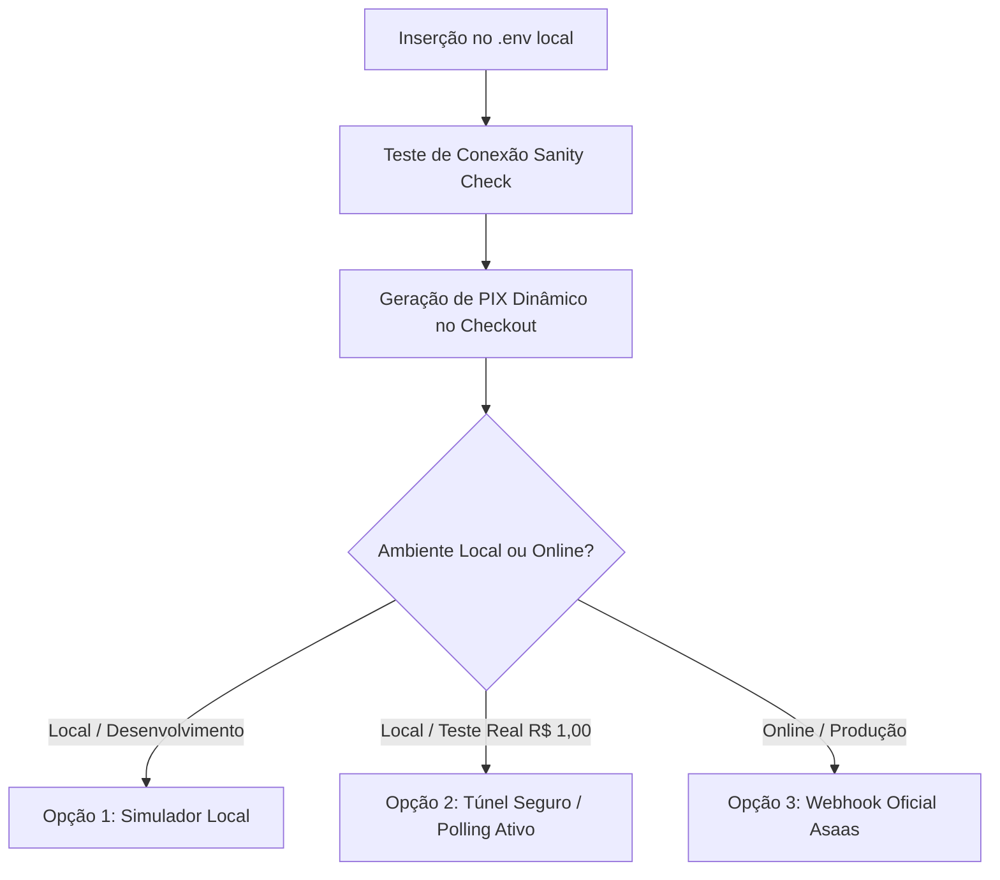

# Plano de Configuração e Integração: API Asaas & Segurança
**E-Commerce Continental - Distribuidora de Produtos Estéticos Automotivos**  
*Data de Criação: 18 de Setembro de 2026*  
*Status: Planejamento & Guia de Execução*

---

## 1. Contexto das Credenciais Obtidas

A chave gerada e fornecida possui a seguinte estrutura e escopo de operação:

* **Chave de API**: `$aact_prod_****************************************************************************************************************`
* **Ambiente**: **PRODUÇÃO (Oficial)**  
  *O prefixo `$aact_prod_` identifica que se trata de uma credencial real do Asaas. Todas as chamadas gerarão cobranças oficiais com registros válidos no Banco Central.*
* **Endpoint Base Oficial**: `https://api.asaas.com/v3`
* **Token de Webhook Sugerido**: `continental_webhook_seguro_2026`

---

## 2. Segurança e Isolamento de Credenciais (`.gitignore`)

Para garantir que a chave de produção e segredos de ambiente nunca sejam expostos em repositórios remotos (GitHub, GitLab, etc.), o projeto já conta com regras estritas no arquivo `.gitignore`:

### Regras Ativas de Proteção
```gitignore
# Arquivos de Variáveis de Ambiente (Nunca versionados)
.env
.env.*
!.env.example
.env.local
.env.development.local
.env.test.local
.env.production.local

# Chaves Criptográficas e Certificados
*.pem
*.key

# Documentações Internas de Negócio e Planejamento Bancário
diversos/
material/
auditoria/
```

> [!IMPORTANT]
> A pasta `diversos/` (onde se encontra este documento e guias bancários) e os arquivos `.env` estão 100% protegidos pelas regras do `.gitignore`. Nenhuma chave ou dado bancário será versionado no Git.

---

## 3. Estado Atual da Arquitetura do Sistema

A infraestrutura necessária para suportar a API do Asaas já foi previamente codificada e testada no projeto:

| Componente | Arquivo de Origem | Responsabilidade |
| :--- | :--- | :--- |
| **Validação de Documento** | `components/checkout/CheckoutForm.tsx` | Coleta de **CPF ou CNPJ** do comprador com formatação automática e validação de dígitos, pré-requisito do Banco Central para emissão do PIX. |
| **Cliente de API Asaas** | `services/asaas/asaas.client.ts` | Comunicação HTTP com a API (`/customers`, `/payments`, `/payments/{id}/pixQrCode`). Sanitização de telefones e documentos. |
| **Checkout Transacional** | `services/checkout.service.ts` | Cadastro automático do cliente no Asaas, criação da cobrança PIX e persistência do ID da transação no banco PostgreSQL/Supabase. |
| **Tela de Pagamento** | `app/checkout/confirmation/page.tsx` | Renderização do QR Code dinâmico em Base64, botão de 1 clique *"Copiar Código PIX"* e contador regressivo. |
| **Recepção de Webhook** | `app/api/webhooks/asaas/route.ts` | Recepção segura com validação de token, idempotência via tabela `PaymentWebhookEvent`, atualização do pedido para `PAID` e baixa no estoque. |
| **Simulador de Teste** | `app/api/webhooks/asaas/simulate/route.ts` | Rota para simulação de baixa de pagamento no ambiente de desenvolvimento local. |

---

## 4. O Que Faremos Agora (Roteiro de Execução)

Mesmo com o projeto rodando em ambiente local (antes do deploy público), **a emissão do PIX já funciona perfeitamente**. Apenas o recebimento passivo de Webhooks necessita de deploy online ou túnel.

Abaixo estão as etapas de execução planejadas:



### Etapa 1: Gravação das Variáveis no `.env`
Inserir as credenciais no `.env` local:
```env
# Gateway de Pagamentos Asaas (Produção)
ASAAS_API_KEY="$aact_prod_****************************************************************************************************************"
ASAAS_API_URL="https://api.asaas.com/v3"
ASAAS_WEBHOOK_TOKEN="continental_webhook_seguro_2026"
```

### Etapa 2: Teste de Comunicação e Validação da Chave (Sanity Check)
* Executar uma consulta leve de leitura à API (ex: `GET /customers?limit=1` ou `GET /myAccount`).
* Validar se o token é aceito sem restrições cadastrais no Asaas.

### Etapa 3: Emissão do PIX no Fluxo de Compra
* **Por que funciona sem Webhook?** A emissão do PIX é uma chamada de *saída* iniciada pelo nosso servidor. 
* Ao finalizar o pedido no checkout, o Next.js envia o valor, nome e CPF do cliente para o Asaas.
* O Asaas retorna imediatamente a string do QR Code e a linha digitável Copia-e-Cola, exibindo-a instantaneamente na tela de confirmação.

### Etapa 4: Como Validar a Confirmação de Pagamento Localmente
Enquanto a loja estiver rodando no computador local:

1. **Abordagem A (Sem Custos - Simulador Interno)**:
   * Na página de confirmação do pedido, clicar no botão *"Simular Pagamento"*.
   * O sistema dispara o evento interno que transita o pedido para `PAID` e baixa o estoque físico, simulando a chegada do webhook.

2. **Abordagem B (Teste Real de R$ 1,00 no Celular)**:
   * Realizar um pedido teste no valor de R$ 1,00.
   * Fazer a leitura do QR Code pelo app do banco e pagar R$ 1,00.
   * Para o computador receber o aviso em tempo real, podemos usar um túnel temporário (ex: Cloudflare Tunnel ou Ngrok apontando para a porta `3000`) ou um polling ativo de verificação da cobrança (`GET /v3/payments/{id}`).

---

## 5. Passos Finais para Quando o Projeto Estiver Online (Deploy)

Assim que o sistema for publicado no provedor final (ex: Vercel / VPS):

1. **Configuração de Variáveis de Produção**:
   * Adicionar no painel da hospedagem: `ASAAS_API_KEY`, `ASAAS_API_URL` e `ASAAS_WEBHOOK_TOKEN`.
2. **Ativação do Webhook no Painel Asaas**:
   * No painel do Asaas ([asaas.com](https://www.asaas.com)), acesse: **Configurações ➔ Integrações ➔ Webhooks de Cobranças**.
   * **URL do Webhook**: `https://seu-dominio.com.br/api/webhooks/asaas`
   * **Email para Notificação de Erros**: email do administrador técnico.
   * **Token de Autenticação**: `continental_webhook_seguro_2026`
   * **Eventos Marcados**:
     * `PAYMENT_RECEIVED`
     * `PAYMENT_CONFIRMED`
     * `PAYMENT_OVERDUE`
     * `PAYMENT_REFUNDED`
3. **Repasse Diário Automático**:
   * Confirmar no app do Asaas a ativação da transferência diária automática para a conta cadastrada do Banco Itaú.

---

## 6. Resumo e Próxima Ação

| Item | Status | Próximo Passo |
| :--- | :---: | :--- |
| **Chave de Produção** | Obtida | Inserir no `.env` sob comando do usuário |
| **Endpoints do Asaas** | Prontos | Testar conectividade de saída |
| **Checkout com CPF** | Pronto | Validar geração do QR Code real |
| **Webhook de Notificação** | Codificado | Configurar no painel web após o deploy |
