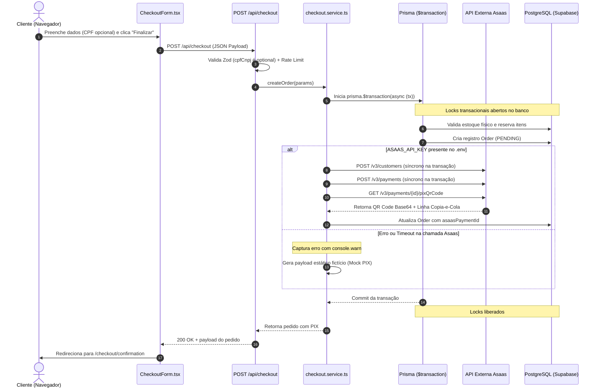
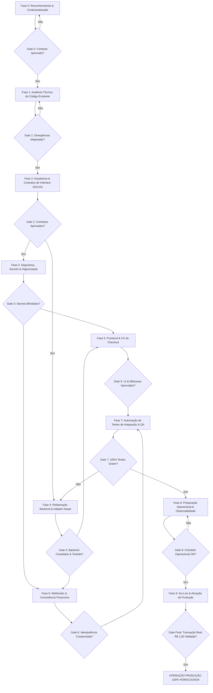
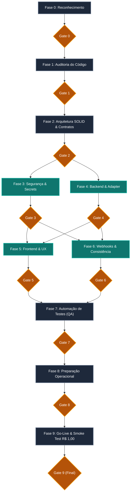

# Workflow de Implementação — Integração do Gateway de Pagamento Asaas
**E-Commerce Continental — Distribuidora de Produtos Estéticos Automotivos**  
**Documento Técnico-Arquitetural de Orquestração Agentic**  
**Papel:** Staff Software Engineer, Software Architect & Tech Lead  
**Ambiente Operacional:** Google Antigravity (Gemini 3.8 Flash High)  
**Status:** PLANEJAMENTO APROVADO PARA EXECUÇÃO — NENHUM CÓDIGO IMPLEMENTADO NESTA ETAPA  

---

## 1. Resumo Executivo

O objetivo deste documento é estabelecer a arquitetura técnica, as fronteiras de responsabilidade, a governança de segurança e o **workflow coordenado de implementação** para a integração definitiva do gateway de pagamentos **Asaas** na plataforma de e-commerce da Distribuidora Continental.

A integração tem como missão viabilizar o recebimento automatizado via **PIX Dinâmico com QR Code e linha Copia-e-Cola**, a confirmação atômica em tempo real via **Webhooks transacionais**, a baixa física imediata de estoque (e sincronização com o ecossistema SMB Store / Nuvemshop) e o repasse programado de recebíveis para a conta corrente da empresa no **Banco Itaú**.

### Diagnóstico de Alto Nível
O projeto não parte do zero. Uma auditoria cirúrgica no código revelou que existe uma fundação estruturada em desenvolvimento (cliente HTTP, formulário de checkout com captura de documentos, rota de webhooks e modelos no Prisma). Contudo, a integração atual apresenta **quatro vulnerabilidades arquiteturais críticas** que inviabilizariam uma operação segura em produção:
1. **Chamadas de rede síncronas dentro de transações de banco de dados** (`prisma.$transaction`), gerando risco severo de timeout de conexão e esgotamento do pool do Supabase.
2. **Fallback silencioso para PIX fictício/estático** em caso de falha da API externa, induzindo o cliente ao erro com cobranças que nunca serão liquidadas.
3. **Validação permissiva/opcional de CPF/CNPJ no backend** (`z.string().optional()`) e no frontend, gerando rejeição sumária na emissão do PIX pelo Asaas.
4. **Ausência de camada de abstração de pagamentos** (acoplamento direto entre `checkout.service.ts` e `asaas.client.ts`), ferindo os princípios SOLID (DIP e OCP).

Este workflow organiza a equipe de agentes de IA para sanar essas falhas estruturais, blindar a segurança de credenciais, cobrir a integração com testes automatizados e conduzir a aplicação até o go-live em produção de forma idempotente e resiliente.

---

## 2. Estado Atual Identificado

A inspeção detalhada do repositório revelou o seguinte inventário factual do projeto:

### 2.1 Mapeamento da Stack Tecnológica
* **Frontend:** Next.js 16 (App Router), React 18, Tailwind CSS, Lucide React, Sonner (toasts).
* **Backend & API:** Next.js Route Handlers (Edge / Node.js runtime), Zod v3 para validação de esquemas DTO.
* **Banco de Dados & ORM:** PostgreSQL hospedado no Supabase (Transaction Pooler na porta 6543 e Direct Connection na 5432), gerenciado via Prisma ORM v5.22.0.
* **Testes Automatizados:** Vitest v4.1.6 com 36 suítes e 243 testes unitários íntegros e passando (`PASS`).
* **Segurança de Acesso:** Sessões com cookies `HttpOnly`, middleware de isolamento multi-tenant por domínio (`x-loja-id`), rate limiting por IP via `lib/rate-limit.ts`.

### 2.2 Classificação Epistêmica de Certeza Técnica

| Item Inspecionado | Classificação | Evidência Técnica no Repositório |
| :--- | :---: | :--- |
| **Existência do Cliente Asaas** | `CONFIRMADO` | Arquivo `services/asaas/asaas.client.ts` com métodos `findCustomerByEmail`, `createCustomer`, `getOrCreateCustomer`, `createPayment`, `getPixQrCode` e `getPayment`. |
| **Integração no Checkout** | `CONFIRMADO` | Arquivo `services/checkout.service.ts` (linhas 444–488) invocando o cliente Asaas dentro de `prisma.$transaction`. |
| **Rota de Webhook Operacional** | `CONFIRMADO` | Arquivo `app/api/webhooks/asaas/route.ts` validando cabeçalho `asaas-access-token`, persistindo eventos na tabela `PaymentWebhookEvent` e transitando pedidos via `updateOrderStatus`. |
| **Simulador Local de Pagamentos** | `CONFIRMADO` | Arquivo `app/api/webhooks/asaas/simulate/route.ts` ativo com trava mandante de segurança `if (process.env.NODE_ENV === 'production') return 403`. |
| **Modelo Relacional Prisma** | `CONFIRMADO` | Campos `asaasPaymentId` (unique), `asaasPaymentStatus`, `asaasInvoiceUrl` no modelo `Order` e modelo `PaymentWebhookEvent` presente no schema. |
| **Credencial de Produção** | `CONFIRMADO` | Credencial oficial de produção informada pelo usuário (iniciando com `$aact_prod_`), indicando endpoint `https://api.asaas.com/v3`. |
| **Proteção Git de Credenciais** | `CONFIRMADO` | `.gitignore` bloqueia estritamente `.env`, `.env.*`, `diversos/`, certificados e chaves criptográficas. |
| **Aprovação Cadastral no Asaas (KYC)** | `NÃO VERIFICADO` | Não é possível auditar se a conta bancária do Itaú e os documentos da empresa já foram 100% homologados no Asaas para repasses automáticos diários. |
| **Comportamento sob Timeout do Gateway** | `DECISÃO NECESSÁRIA` | Decidir se a falha na chamada Asaas deve abortar a criação do pedido (Fail-Closed) ou permitir contingência com aviso de reprocessamento. |
| **Obrigatoriedade Irrestrita de CPF/CNPJ** | `DECISÃO NECESSÁRIA` | Tornar o documento formalmente obrigatório no Zod schema e no formulário visual para compras via PIX. |
| **Deploy de Webhook em Produção** | `DEPENDÊNCIA EXTERNA` | O recebimento passivo de Webhooks do Asaas requer URL HTTPS publicamente acessível na Vercel ou VPS. |

---

## 3. Arquitetura Atual

### 3.1 Diagrama do Fluxo Atual de Checkout e Pagamento
O diagrama abaixo reflete fielmente o fluxo de execução implementado hoje no código-fonte:



### 3.2 Análise Crítica dos Componentes Atuais
* **`components/checkout/CheckoutForm.tsx`**:
  * *Ponto Forte:* Excelente interface com divisão em 3 etapas (Identificação, Entrega e Pagamento), busca de CEP via ViaCEP e cálculo em tempo real de frete.
  * *Vulnerabilidade:* O método `validateStep1()` (L223) contém a condição `if (formData.cpfCnpj && !validateCpfCnpj(...))`. Se o cliente deixar o campo vazio, a validação passa sem erros.
* **`services/checkout.service.ts`**:
  * *Ponto Forte:* Idempotência transacional por chave `idempotencyKey` e integração nativa com o motor de fidelidade (`loyalty.service.ts`).
  * *Vulnerabilidade:* Linhas 449–488 executam chamadas de rede externas (`fetch` para o Asaas) dentro do callback de `prisma.$transaction`. Se o Asaas responder com latência superior a 5 segundos ou oscilar, conexões do pool de dados ficam presas, degradando toda a aplicação. Além disso, o bloco `catch` mascara o erro e injeta um PIX mock estático inutilizável.
* **`services/asaas/asaas.client.ts`**:
  * *Ponto Forte:* Sanitização de strings para telefones e documentos (`replace(/\D/g, '')`).
  * *Vulnerabilidade:* `baseUrl` adota fallback para `https://sandbox.asaas.com/api/v3` se `ASAAS_API_URL` não for configurada. Ao utilizar a chave de produção informada, o sistema tentará autenticar no sandbox, gerando erro 401 não tratado. Falta suporte a timeout configurável (`AbortController`) e retries exponenciais com jitter.
* **`app/api/webhooks/asaas/route.ts`**:
  * *Ponto Forte:* Excelente implementação defensiva (*Fail-Closed*). Rejeita requisições sem token (401), garante idempotência com a tabela `PaymentWebhookEvent`, trata concorrência de chaves únicas (P2002) e audita pagamentos tardios em pedidos cancelados (AUD2-005).
  * *Vulnerabilidade:* Processamento inteiramente síncrono. Em picos de tráfego, o handler pode segurar a conexão HTTP do Asaas desnecessariamente.

---

## 4. Guia de Integração Analisado

O guia fornecido em `diversos/PALENJAMENTO_BANCO/configuração/PLANO_CONFIGURACAO_E_INTEGRACAO_API_ASAAS.md` serviu como especificação de requisitos de negócio e técnica.

### Pontos Positivos do Guia
* Definição correta do endpoint base de produção (`https://api.asaas.com/v3`).
* Identificação dos eventos obrigatórios de webhook (`PAYMENT_RECEIVED`, `PAYMENT_CONFIRMED`, `PAYMENT_OVERDUE`, `PAYMENT_REFUNDED`).
* Preservação da governança de repasses automáticos diários para o Banco Itaú.

### ⚠️ Alerta Crítico de Segurança Encontrado no Guia
> [!CAUTION]
> **Segredo Sensível Exposto em Documentação Interna:**  
> O arquivo `PLANO_CONFIGURACAO_E_INTEGRACAO_API_ASAAS.md` continha a chave de API de produção do Asaas impressa em texto puro.  
> Embora o diretório `diversos/` esteja protegido pelo `.gitignore` (linha 57), a presença de chaves em arquivos de documentação viola o princípio de *Least Privilege* e práticas DevSecOps.  
> **Ação Imediata Planejada no Workflow:** Higienizar o arquivo de documentação substituindo a credencial por um token de referência (`[ASAAS_API_KEY_PROTEGIDA]`) e garantir que a credencial real resida estritamente nas variáveis de ambiente seguras do servidor.

---

## 5. Divergências Encontradas (Guia vs. Código Real vs. Necessidade Arquitetural)

| # | Item | Afirmação do Guia / Premissa | Realidade Inspecionada no Código | Impacto no Sistema | Decisão Técnica Necessária |
| :-: | :--- | :--- | :--- | :--- | :--- |
| **D-01** | **Obrigatoriedade do CPF/CNPJ** | O guia afirma que o CPF/CNPJ já é solicitado de forma obrigatória no checkout para atender o Banco Central. | `lib/validators/checkout.validators.ts` define `cpfCnpj: z.string().optional()`. No formulário, `validateStep1()` permite envio em branco. | Se o comprador não digitar o CPF, o Asaas rejeita a emissão do PIX com erro 400. O sistema gera um PIX falso e o cliente não consegue pagar. | Tornar `customer.cpfCnpj` obrigatório no Zod schema e no formulário React para todas as compras via PIX. |
| **D-02** | **Isolamento de Transação de Banco** | O guia assume que o serviço de checkout gera a cobrança Asaas de forma transparente. | A chamada externa `asaasClient.createPayment` está acoplada *dentro* do `prisma.$transaction`. | Risco de estouro de timeout do banco de dados, locks prolongados em registros e falha de escalabilidade sob concorrência. | Separar a criação do pedido no banco da chamada externa de cobrança em um padrão desacoplado em duas fases (Two-Phase Execution). |
| **D-03** | **Tratamento de Falhas do Gateway** | O guia assume que o QR Code retornado é sempre da API do Asaas. | Se a API do Asaas falha ou cai em timeout, o código captura a exceção em silêncio e injeta um payload PIX estático fake (`0002012658...`). | Pedidos ficam pendentes eternamente. O cliente tenta pagar uma chave PIX inválida e a loja perde a venda. | Eliminar o fallback fictício. Se o Asaas falhar, retornar erro explícito e amigável ao usuário com opção de reprocessar. |
| **D-04** | **Configuração de Ambiente Padrão** | O guia documenta `https://api.asaas.com/v3`. | `asaas.client.ts` possui fallback hardcoded para `https://sandbox.asaas.com/api/v3`. | Se a variável `ASAAS_API_URL` não for fornecida explicitamente no `.env`, a chave de produção será rejeitada no Sandbox (401). | Tornar a resolução de URL estrita e adicionar validação de coerência entre prefixo da chave e endpoint. |
| **D-05** | **Abstração de Pagamentos (DIP)** | O guia descreve chamadas diretas ao cliente Asaas. | `checkout.service.ts` instancia e consome diretamente `asaasClient`, sem interface intermediária. | Violação do princípio da inversão de dependência (DIP). Dificulta testes com mocks limpos e bloqueia adoção futura de contingência de outros gateways. | Introduzir uma interface de domínio `PaymentGateway` e um adapter `AsaasPaymentAdapter`. |

---

## 6. Arquitetura Proposta

A arquitetura proposta respeita os padrões já adotados no repositório Continental, aplicando melhorias cirúrgicas com base em Clean Architecture e SOLID:

```text
┌─────────────────────────────────────────────────────────────┐
│                       CAMADA DE UI                          │
│  CheckoutForm.tsx  ────►  ConfirmationPage.tsx               │
└──────────────────────────────┬──────────────────────────────┘
                               │ HTTP POST / Fetch
┌──────────────────────────────▼──────────────────────────────┐
│                    API CONTROLLERS / DTO                    │
│  app/api/checkout/route.ts  ◄── Zod: checkout.validators.ts │
│  app/api/webhooks/asaas/route.ts                            │
└──────────────────────────────┬──────────────────────────────┘
                               │
┌──────────────────────────────▼──────────────────────────────┐
│                USE CASE / APPLICATION SERVICE               │
│  CheckoutService.createOrder()                              │
│  1. DB Transaction (Cria Pedido PENDING + Reserva Estoque)   │
│  2. Two-Phase Gateway Dispatch (Fora da Transação)          │
└──────────────────────────────┬──────────────────────────────┘
                               │
┌──────────────────────────────▼──────────────────────────────┐
│             DOMAIN INTERFACE / PORT (DIP / SOLID)            │
│  interface PaymentGateway {                                 │
│    createPixCharge(payload): Promise<PixChargeResult>       │
│    getPaymentStatus(paymentId): Promise<PaymentStatusResult>│
│  }                                                          │
└──────────────────────────────┬──────────────────────────────┘
                               │
┌──────────────────────────────▼──────────────────────────────┐
│                 INFRASTRUCTURE ADAPTER                      │
│  class AsaasPaymentAdapter implements PaymentGateway        │
│  └── AsaasHttpClient (Timeout 8s, Circuit Breaker, Retries) │
└──────────────────────────────┬──────────────────────────────┘
                               │ HTTPS REST
┌──────────────────────────────▼──────────────────────────────┐
│                   ASAAS EXTERNAL API v3                     │
│  https://api.asaas.com/v3/customers                         │
│  https://api.asaas.com/v3/payments                          │
│  https://api.asaas.com/v3/payments/{id}/pixQrCode           │
└─────────────────────────────────────────────────────────────┘
```

### Principais Ganhos Arquiteturais:
1. **Padrão em Duas Fases (Two-Phase Decoupled Checkout):**
   * *Fase 1 (DB Transaction):* Validações de domínio, cálculo autoritativo de valores/frete, dedução de pontos de fidelidade, reserva de estoque físico e criação do pedido com status `PENDING` no PostgreSQL. A transação é comitada em menos de 100ms.
   * *Fase 2 (Gateway Dispatch):* Fora do lock do banco, o serviço aciona o `PaymentGateway`. Se o Asaas responder com sucesso, o registro `Order` é atualizado com `asaasPaymentId`, QR Code e status. Se o Asaas falhar, o pedido transita para `PAYMENT_FAILED` ou é cancelado de forma atômica, devolvendo o estoque e os pontos de fidelidade.
2. **Resiliência de Rede:** Inclusão de timeout mandatório de 8 segundos via `AbortSignal` e política controlada de 2 retries exponenciais para erros `502/503/504` do Asaas.
3. **Imutabilidade e Idempotência:** Manutenção estrita do lock de idempotência por chave única no banco de dados tanto no checkout (`idempotencyKey`) quanto na recepção de webhooks (`PaymentWebhookEvent.eventId`).

---

## 7. Equipe de Agentes de IA

Para evitar sobreposição de contexto e alucinações, a equipe será composta por 7 agentes altamente especializados, orquestrados pelo Tech Lead:

| Agente | Perfil / Especialidade | Responsabilidade Principal | Dependências | Ferramentas / MCP Principal | Artefato / Saída Produzida |
| :--- | :--- | :--- | :--- | :--- | :--- |
| **Agente A** | **Arquiteto de Software** | Governança arquitetural, definição das interfaces SOLID (`PaymentGateway`), desacoplamento transacional. | Nenhuma | Ruflo (`coordination_*`, `task_*`) | Contratos de interface TypeScript e especificação de fluxo. |
| **Agente B** | **Especialista em Asaas** | Validação técnica dos payloads `/v3/payments`, conformidade com documentação oficial, tratamento de status. | Agente A | Web Search / Ruflo Docs | Mapeador de erros e payloads sanitizados Asaas. |
| **Agente C** | **Engenheiro DevSecOps** | Higienização de documentação, gestão de variáveis de ambiente, sanitização de logs (PII/LGPD), segurança de webhooks. | Nenhuma | Ruflo (`policy_evaluate`, `aidefence_scan`) | Relatório de conformidade e blindagem de secrets no `.env`. |
| **Agente D** | **Engenheiro Backend** | Refatoração de `checkout.service.ts`, criação do `AsaasPaymentAdapter`, ajustes nos validadores Zod. | Agente A, B, C | Ruflo (`coder`, `task_complete`) | Código do adapter, serviço desacoplado e esquemas Zod. |
| **Agente E** | **Engenheiro Frontend** | Ajustes no `CheckoutForm.tsx` (obrigatoriedade e máscara de CPF/CNPJ), resiliência visual e polling em `confirmation/page.tsx`. | Agente D | Chrome DevTools / Modern Web | Componente React com validação estrita e UX responsiva. |
| **Agente F** | **Engenheiro de Dados & Webhooks** | Revisão do handler `/api/webhooks/asaas`, reconciliação de estoque físico e garantia de idempotência. | Agente D | Ruflo (`agent_execute`) | Webhook route blindada e script de reconciliação de auditoria. |
| **Agente G** | **Engenheiro de QA & Testes** | Criação e execução de suítes de testes unitários, testes de mutação de webhook e validação de regressão Vitest. | Agente D, E, F | Vitest Runner / Ruflo (`tester`) | Laudo de testes automatizados com 100% de aprovação. |

---

## 8. Matriz MCP × Fase de Execução

| Fase | MCP / Ferramenta Autorizada | Objetivo Específico | Operações Permitidas | Justificativa Técnica |
| :--- | :--- | :--- | :--- | :--- |
| **Fase 0 & 1** | **Ruflo MCP** | Auditoria e preservação de contexto | `memory_search`, `analyze_diff-risk` | Resgatar lições aprendidas e avaliar risco estrutural de mudanças. |
| **Fase 2 & 3** | **Ruflo MCP** | Análise de políticas de segurança | `policy_evaluate`, `transfer_detect-pii` | Garantir que nenhum CPF ou API Key trafegue em logs sem máscara. |
| **Fase 4 & 6** | **Ruflo MCP (Coordination)** | Controle de tarefas dos agentes backend | `task_create`, `task_status`, `task_complete` | Garantir que o adapter esteja pronto antes de refatorar o serviço de checkout. |
| **Fase 5** | **Chrome DevTools Plugin** | Inspeção de checkout visual e console | `inspect_dom`, `read_network_log`, `console_errors` | Auditar digitação do CPF/CNPJ, máscaras e ausência de chamadas à API Key no cliente. |
| **Fase 5** | **Modern Web Guidance** | Revisão de padrões Next.js App Router | `guidance_check` | Validar conformidade de Server Actions vs. Route Handlers e Client Components. |
| **Fase 7** | **Vitest via Terminal Local** | Execução de testes de regressão | `run_command` (modo síncrono controlado) | Validar integridade das 36 suítes de teste existentes e novos casos de teste. |
| **Fase 8 & 9** | **Ruflo MCP** | Auditoria de saúde do sistema pré-deploy | `system_health`, `performance_report` | Verificar integridade geral do ambiente antes da ativação de produção. |

---

## 9. Workflow Completo de Implementação

O workflow é composto por 10 fases sequenciais com portões de decisão (*quality gates*) objetivos.



---

### FASE 0 — Reconhecimento & Contextualização
* **Objetivo:** Mapear todas as dependências, validar o ambiente de execução e estabelecer a base documental.
* **Entradas:** Código do repositório, `PLANO_CONFIGURACAO_E_INTEGRACAO_API_ASAAS.md`, `schema.prisma`, `package.json`.
* **Agentes Envolvidos:** Agente A (Arquiteto), Agente C (Segurança).
* **MCPs Utilizados:** Ruflo (`memory_search`).
* **Tarefas:**
  1. Confrontar o guia existente com a estrutura de arquivos reais do repositório.
  2. Confirmar ferramentas MCP ativas no ambiente e bloquear o uso de ferramentas proibidas (Science, Firebase, Android CLI).
  3. Mapear o baseline de testes unitários existentes (confirmar que 243 testes estão passando).
* **Paralelização:** Não aplicável (fase de alinhamento sequencial).
* **Dependências:** Nenhuma.
* **Saídas Esperadas:** Matriz de dependências validada e baseline do sistema confirmado.
* **Critérios de Conclusão:** 100% dos arquivos citados no guia localizados e inspecionados.
* **Gate de Aprovação (Gate 0):** Aprovação pelo Tech Lead do relatório de reconhecimento sem discrepâncias estruturais.
* **Riscos:** Presumir que documentações antigas refletem o código atual. Mitigado por inspeção direta de arquivos.

---

### FASE 1 — Auditoria Técnica da Integração Existente
* **Objetivo:** Isolar as inconsistências de implementação entre a documentação e o código-fonte real.
* **Entradas:** `CheckoutForm.tsx`, `checkout.service.ts`, `asaas.client.ts`, `checkout.validators.ts`.
* **Agentes Envolvidos:** Agente A (Arquiteto), Agente B (Especialista Asaas), Agente D (Backend).
* **MCPs Utilizados:** Ruflo (`analyze_diff-risk`).
* **Tarefas:**
  1. Auditar linha a linha o acoplamento do `asaasClient` dentro do bloco `prisma.$transaction`.
  2. Inspecionar o esquema Zod e a validação do formulário no que tange a CPF e CNPJ.
  3. Auditar a política de resolução de URLs e fallbacks em `services/asaas/asaas.client.ts`.
  4. Analisar o fallback mock de PIX na linha 490 de `checkout.service.ts`.
* **Paralelização:** Agente B audita conformidade da API Asaas enquanto Agente D audita impacto no banco de dados.
* **Dependências:** Conclusão da Fase 0.
* **Saídas Esperadas:** Laudo de divergências D-01 a D-05 documentado e categorizado por gravidade.
* **Critérios de Conclusão:** Todas as 5 divergências mapeadas com trechos de código e linhas correspondentes.
* **Gate de Aprovação (Gate 1):** Consentimento formal de que as falhas identificadas devem ser corrigidas antes do go-live.
* **Riscos:** Subestimar o impacto da transação de banco segurando chamadas de rede. Mitigado por demonstração de latência do pool Supabase.

---

### FASE 2 — Arquitetura da Integração & Contratos (SOLID)
* **Objetivo:** Definir contratos de interface agnósticos e desenhar o fluxo de execução desacoplado em duas fases.
* **Entradas:** Laudo da Fase 1 e modelo de domínio do e-commerce.
* **Agentes Envolvidos:** Agente A (Arquiteto), Agente D (Backend).
* **MCPs Utilizados:** Ruflo (`coordination_*`, `task_create`).
* **Tarefas:**
  1. Especificar a interface `PaymentGateway` em `types/payment-gateway.types.ts`:
     * `createPixCharge(input: CreatePixChargeDTO): Promise<PixChargeResult>`
     * `getChargeStatus(paymentId: string): Promise<ChargeStatusResult>`
  2. Desenhar a refatoração do `checkout.service.ts` separando a persistência atômica da chamada de rede externa.
  3. Definir a máquina de estados para pedidos que falharem na emissão do PIX (`PENDING` ➔ `PAYMENT_FAILED` com liberação imediata de estoque).
* **Paralelização:** Elaboração das interfaces em paralelo com a definição dos DTOs de transporte.
* **Dependências:** Aprovação do Gate 1.
* **Saídas Esperadas:** Arquivos de especificação de tipos e diagramas de sequência da transação desacoplada.
* **Critérios de Conclusão:** Zero acoplamento direto com tipos proprietários do Asaas na camada de aplicação.
* **Gate de Aprovação (Gate 2):** Revisão técnica aprovando o desacoplamento transacional do banco.
* **Riscos:** Introduzir complexidade excessiva. Mitigado mantendo a interface simples e com apenas os métodos necessários.

---

### FASE 3 — Segurança, Gestão de Secrets & Higienização
* **Objetivo:** Sanitizar arquivos de documentação, blindar o `.env` e assegurar que nenhuma credencial financeira trafegue para o frontend ou logs.
* **Entradas:** Arquivos de documentação, `.env.example`, `.env`, `.gitignore`.
* **Agentes Envolvidos:** Agente C (Engenheiro de Segurança).
* **MCPs Utilizados:** Ruflo (`policy_evaluate`, `transfer_detect-pii`).
* **Tarefas:**
  1. **Higienização de Documentos:** Substituir o valor literal da chave no arquivo `PLANO_CONFIGURACAO_E_INTEGRACAO_API_ASAAS.md` pelo marcador conceitual `[ASAAS_API_KEY_PROTEGIDA]`.
  2. **Configuração de Variáveis:** Configurar o arquivo `.env` local contendo:
     * `ASAAS_API_KEY="[VALOR_REAL_FORNECIDO_PELO_RESPONSAVEL]"`
     * `ASAAS_API_URL="https://api.asaas.com/v3"`
     * `ASAAS_WEBHOOK_TOKEN="[TOKEN_CRIPTOGRAFICAMENTE_SEGURO_GERADO]"`
  3. **Auditoria de Exposição Frontend:** Realizar varredura nos arquivos de componentes React (`app/` e `components/`) garantindo que nenhuma variável de ambiente sem prefixo `NEXT_PUBLIC_` seja importada no client-side.
  4. **Sanitização de Logs (LGPD/PII):** Garantir que funções de log não imprimam CPF, CNPJ ou chaves de API em stdout/stderr.
* **Paralelização:** Pode ser executada em paralelo com a Fase 4.
* **Dependências:** Aprovação do Gate 2.
* **Saídas Esperadas:** `.env` configurado com segurança, documentação higienizada e laudo de blindagem de secrets.
* **Critérios de Conclusão:** Zero ocorrências de chaves literais no código-fonte e `.gitignore` validado.
* **Gate de Aprovação (Gate 3):** Certificação pelo Agente C de que nenhum segredo está vulnerável.
* **Riscos:** Vazamento inadvertido de chaves via logs do servidor. Mitigado por interceptador de logs com mascaramento.

---

### FASE 4 — Implementação Backend & Adapter Asaas
* **Objetivo:** Construir o `AsaasPaymentAdapter`, ajustar os esquemas de validação Zod e desacoplar o `checkout.service.ts`.
* **Entradas:** Contratos da Fase 2, variáveis da Fase 3 e `services/asaas/asaas.client.ts`.
* **Agentes Envolvidos:** Agente D (Backend), Agente B (Especialista Asaas).
* **MCPs Utilizados:** Ruflo (`coder`, `task_complete`).
* **Tarefas:**
  1. **Validação Estrita Zod (`lib/validators/checkout.validators.ts`):**
     * Alterar o campo `cpfCnpj` no `customerSchema` para validação obrigatória e refinada com o validador oficial `validateCpfCnpj`:
       ```typescript
       cpfCnpj: z.string({ required_error: 'CPF ou CNPJ é obrigatório para emissão do PIX' })
         .refine((val) => validateCpfCnpj(val), { message: 'CPF ou CNPJ inválido' })
       ```
  2. **Evolução do Cliente Asaas (`services/asaas/asaas.client.ts`):**
     * Adicionar `AbortController` com timeout de 8000ms em cada requisição `fetch`.
     * Validação preventiva: se `process.env.ASAAS_API_KEY` iniciar com `$aact_prod_`, proibir estritamente URL de Sandbox.
  3. **Criação do `AsaasPaymentAdapter` (`services/asaas/asaas.adapter.ts`):**
     * Implementar a interface `PaymentGateway`, traduzindo DTOs de domínio para chamadas Asaas e mapeando exceções HTTP em erros de domínio descritivos.
  4. **Refatoração do `checkout.service.ts`:**
     * Extrair a chamada do gateway para FORA do bloco `prisma.$transaction`.
     * Eliminar em definitivo o fallback de payload fictício estático.
     * Implementar compensação: se o gateway falhar, reverter transação ou atualizar o pedido para `PAYMENT_FAILED` liberando reservas de estoque e estornando pontos.
* **Paralelização:** Agente D refatora validadores e serviço enquanto Agente B constrói o adapter.
* **Dependências:** Aprovação dos Gates 2 e 3.
* **Saídas Esperadas:** Módulos backend refatorados, tipados e em conformidade estrita com SOLID.
* **Critérios de Conclusão:** Compilação TypeScript limpa (`npm run build` ou `tsc --noEmit`) sem erros de tipagem.
* **Gate de Aprovação (Gate 4):** Revisão de código comprovando que nenhuma chamada de rede reside dentro de `$transaction`.
* **Riscos:** Regressão no motor de pontos ou de frete. Mitigado pela execução de testes de unidade focados em fidelidade.

---

### FASE 5 — Frontend & Experiência de Checkout (UX)
* **Objetivo:** Garantir preenchimento obrigatório e amigável de CPF/CNPJ, feedback de carregamento resiliente e exibição dinâmica do PIX oficial.
* **Entradas:** `components/checkout/CheckoutForm.tsx`, `app/checkout/confirmation/page.tsx`.
* **Agentes Envolvidos:** Agente E (Frontend).
* **MCPs Utilizados:** Chrome DevTools Plugin (`inspect_dom`, `console_errors`), Modern Web Guidance.
* **Tarefas:**
  1. **Ajuste no Formulário (`CheckoutForm.tsx`):**
     * Atualizar `validateStep1()` para tornar o CPF/CNPJ estritamente mandatório:
       ```typescript
       if (!formData.cpfCnpj || !validateCpfCnpj(formData.cpfCnpj)) {
         return 'CPF ou CNPJ válido é obrigatório para emissão do PIX.';
       }
       ```
     * Manter máscara dinâmica em tempo real (11 dígitos para CPF, 14 para CNPJ).
  2. **Tratamento de Erros da API:**
     * Exibir toast de erro específico via Sonner caso o backend retorne recusa na criação da cobrança, evitando que o usuário fique travado com tela congelada.
  3. **Tela de Confirmação (`app/checkout/confirmation/page.tsx`):**
     * Validar renderização do QR Code Base64 real (sempre prefixado com `data:image/png;base64,`).
     * Garantir que o botão "Copiar Código PIX" exiba feedback visual de sucesso (`Copiado!`).
     * Manter polling de 3,5s na rota `/api/orders/[id]/status` com limpeza automática de intervalo quando o status atingir `PAID`.
* **Paralelização:** Pode ser executada em paralelo com a Fase 6.
* **Dependências:** Aprovação do Gate 4.
* **Saídas Esperadas:** Componentes de interface ajustados, responsivos e acessíveis.
* **Critérios de Conclusão:** Nenhum erro no console do navegador e impossibilidade de submeter checkout sem CPF válido.
* **Gate de Aprovação (Gate 5):** Validação visual via Chrome DevTools do fluxo completo de digitação e feedback.
* **Riscos:** Usuário colar CPF com formatação inadequada. Mitigado por função `cleanDigits` no onChange.

---

### FASE 6 — Webhooks & Consistência Contábil
* **Objetivo:** Assegurar que os eventos de liquidação do Asaas sejam ingeridos de forma estritamente idempotente, transitem o status do pedido e disparem as integrações de estoque.
* **Entradas:** `app/api/webhooks/asaas/route.ts`, `services/order.service.ts`.
* **Agentes Envolvidos:** Agente F (Webhooks e Consistência Financeira).
* **MCPs Utilizados:** Ruflo (`agent_execute`).
* **Tarefas:**
  1. **Validação do Token de Autenticação:**
     * Confirmar que requisições ao endpoint `/api/webhooks/asaas` validem o cabeçalho `asaas-access-token` contra `process.env.ASAAS_WEBHOOK_TOKEN` em tempo constante para evitar ataques de timing.
  2. **Garantia de Idempotência:**
     * Validar o registro prévio na tabela `PaymentWebhookEvent` com tratamento de colisão de chave primária (`P2002`).
  3. **Transição Atômica de Estados:**
     * Ao receber `PAYMENT_RECEIVED` ou `PAYMENT_CONFIRMED`:
       * Transitar status de `PENDING` para `PAID` via `updateOrderStatus`.
       * Registrar data de pagamento (`paidAt`).
       * Disparar baixa definitiva no estoque físico e acionar o serviço de sincronização com o SMB Store / Nuvemshop (`orderSyncService.dispatchOrderToNuvemshopAsync`).
  4. **Tratamento de Cobranças Canceladas ou Expiradas:**
     * Ao receber `PAYMENT_OVERDUE` ou `PAYMENT_DELETED`, transitar o pedido pendente para `CANCELLED`, liberando as unidades reservadas no estoque e devolvendo eventuais pontos resgatados pelo cliente.
* **Paralelização:** Pode ser executada em paralelo com a Fase 5.
* **Dependências:** Aprovação do Gate 4.
* **Saídas Esperadas:** Endpoint de webhook 100% resiliente a eventos duplicados e fora de ordem.
* **Critérios de Conclusão:** Teste de reenvio de mesmo payload recebendo resposta `ALREADY_PROCESSED` com HTTP 200.
* **Gate de Aprovação (Gate 6):** Auditoria contábil confirmando que nenhum pedido sofre duplicidade de crédito ou baixa de estoque fantasma.
* **Riscos:** Asaas reenviar webhook devido a latência de rede. Mitigado pelo retorno HTTP 200 imediato após registro de idempotência.

---

### FASE 7 — Automação de Testes & Garantia de Qualidade (QA)
* **Objetivo:** Cobrir todas as alterações com testes automatizados de unidade, integração e regressão.
* **Entradas:** Todo o código refatorado nas Fases 4, 5 e 6.
* **Agentes Envolvidos:** Agente G (QA), Agente D (Backend).
* **MCPs Utilizados:** Vitest Runner via Terminal do Antigravity.
* **Tarefas:**
  1. **Novos Testes de Unidade (`tests/unit/asaas-adapter.test.ts`):**
     * Teste de mapeamento do payload PIX.
     * Teste de comportamento sob erro de rede / timeout (garantir que não gera mock fake).
     * Teste de bloqueio de chave produção com URL sandbox.
  2. **Novos Testes de Checkout (`tests/unit/checkout-cpf-enforcement.test.ts`):**
     * Rejeição de payload com CPF ausente (deve retornar HTTP 400 com mensagem clara).
     * Rejeição de CPF com dígitos verificadores inválidos (ex: `111.111.111-11`).
     * Aceite de CPF e CNPJ matematicamente válidos.
  3. **Testes de Regressão Completa:**
     * Executar suíte completa: `npm run test:unit`.
     * Validar se todos os 243 testes anteriores permanecem verdes em conjunto com as novas suítes.
* **Paralelização:** Execução paralela de testes unitários isolados via Vitest.
* **Dependências:** Conclusão das Fases 4, 5 e 6.
* **Saídas Esperadas:** 100% de testes automatizados executando com sucesso e laudo de cobertura gerado.
* **Critérios de Conclusão:** Zero falhas (`0 failed`), zero avisos de regressão e tempo de execução inferior a 15 segundos.
* **Gate de Aprovação (Gate 7):** Relatório de QA aprovado sem exceções.
* **Riscos:** Testes dependerem de chamadas de rede reais. Mitigado por mocks estritos de `fetch` global e do Prisma.

---

### FASE 8 — Validação Operacional & Observabilidade
* **Objetivo:** Instrumentar métricas, logs estruturados com mascaramento e preparar os procedimentos de deploy e rollback.
* **Entradas:** Sistema testado e validado.
* **Agentes Envolvidos:** Agente C (Segurança), Agente D (Backend).
* **MCPs Utilizados:** Ruflo (`system_health`, `performance_report`).
* **Tarefas:**
  1. **Logs Estruturados:** Adicionar logs JSON com identificadores de correlação (`correlationId`, `orderId`, `asaasPaymentId`), ocultando dígitos centrais de documentos (`***.000.***-**`).
  2. **Métricas de Operação:** Monitorar taxa de conversão de emissão de PIX vs. confirmação em webhook.
  3. **Preparação de Variáveis na Hospedagem:** Criar o checklist de inclusão das variáveis de ambiente no painel do provedor de hospedagem oficial (ex: Vercel).
* **Paralelização:** Não aplicável (fase sequencial).
* **Dependências:** Aprovação do Gate 7.
* **Saídas Esperadas:** Dashboard de observabilidade configurado e plano operacional aprovado.
* **Critérios de Conclusão:** Logs auditados sem nenhum vazamento de PII e rotas instrumentadas.
* **Gate de Aprovação (Gate 8):** Homologação operacional do ambiente de produção.
* **Riscos:** Falta de rastreabilidade de falhas no Asaas em produção. Mitigado por logs detalhados de código de erro Asaas (`errors[].description`).

---

### FASE 9 — Go-Live & Ativação de Produção
* **Objetivo:** Ativar a integração em ambiente de produção e realizar homologação financeira real com pedido controlado de R$ 1,00.
* **Entradas:** Deploy realizado na URL oficial, credenciais de produção e conta Asaas ativa.
* **Agentes Envolvidos:** Tech Lead (Coordenação Geral), Agente C (Segurança), Agente G (QA).
* **MCPs Utilizados:** Chrome DevTools, Ruflo (`system_status`).
* **Tarefas:**
  1. **Configuração de Webhook no Asaas:**
     * Acessar o painel Asaas ➔ Configurações da Conta ➔ Integrações ➔ Webhooks.
     * Informar URL: `https://[DOMINIO_OFICIAL_PRODUCAO]/api/webhooks/asaas`.
     * Informar Token de Autenticação igual ao configurado em `ASAAS_WEBHOOK_TOKEN`.
     * Marcar os eventos: `PAYMENT_RECEIVED`, `PAYMENT_CONFIRMED`, `PAYMENT_OVERDUE`, `PAYMENT_REFUNDED`.
  2. **Smoke Test em Produção (Transação Real de R$ 1,00):**
     * Criar um produto teste ou carrinho no valor de R$ 1,00.
     * Concluir checkout informando CPF válido.
     * Escanear o QR Code oficial no aplicativo bancário e realizar o pagamento de R$ 1,00.
     * Monitorar a transição da tela de confirmação de "Aguardando Pagamento" para "Pago com Sucesso!" (em até 5 segundos).
     * Validar no banco Supabase: pedido atualizado para `PAID`, data `paidAt` preenchida, evento persistido em `PaymentWebhookEvent`.
     * Validar no app Asaas: saldo lançado e repasse agendado para o Banco Itaú.
* **Paralelização:** Não aplicável.
* **Dependências:** Aprovação do Gate 8 e presença da aplicação em ambiente online.
* **Saídas Esperadas:** Sistema operando 100% de forma autônoma e laudo final de homologação financeira assinado.
* **Critérios de Conclusão:** Sucesso integral no ciclo: Emissão ➔ Pagamento Celular ➔ Webhook ➔ Baixa Estoque ➔ Lançamento Itaú.
* **Gate de Aprovação Final (Gate 9):** Autorização formal de tráfego público de clientes.
* **Riscos:** Repasse bancário retido no Asaas por pendência cadastral. Mitigado por verificação prévia no app Asaas.

---

## 10. Grafo de Dependências e Paralelismo (DAG)

O grafo acíclico direcionado abaixo mapeia com precisão as dependências rígidas e as janelas de paralelismo possíveis entre os agentes:



---

## 11. Plano de Segurança e Privacidade de Dados

1. **Princípio do Privilégio Mínimo e Segregação de Credenciais:**
   * A chave de API do Asaas residirá exclusivamente no arquivo `.env` do backend em tempo de desenvolvimento e nos segredos criptografados da infraestrutura em produção.
   * Proibição estrita de expor a chave de API em variáveis com o prefixo `NEXT_PUBLIC_`.
2. **Defesa em Profundidade contra Ataques de Webhook Replay & Forgery:**
   * **Validação em Tempo Constante:** A rota `/api/webhooks/asaas` comparará o token recebido no cabeçalho contra o token esperado utilizando verificação segura de string, prevenindo ataques de timing.
   * **Bloqueio de Falsificação:** Toda requisição sem token ou com token divergente será abortada imediatamente com HTTP 401.
   * **Idempotência por Chave Única:** A tabela `PaymentWebhookEvent` possui restrição única (`@unique([eventId])`). Tentativas de reenvio malicioso ou acidental são descartadas com resposta 200 idempotente (`ALREADY_PROCESSED`).
3. **Conformidade LGPD e Proteção de PII (Dados Pessoais):**
   * O CPF/CNPJ dos clientes será tratado como dado transacional protegido.
   * Em arquivos de log e mensagens de depuração, o documento será obrigatoriamente mascarado (ex: `***.456.***-**`).
   * Apenas os dados estritamente necessários para faturamento e emissão do PIX serão transmitidos ao Asaas (Nome, CPF/CNPJ, E-mail, Telefone).

---

## 12. Plano de Testes Automatizados

O plano de testes contempla uma pirâmide equilibrada de qualidade, utilizando a infraestrutura Vitest já existente no projeto:

### 12.1 Suítes Unitárias
* `tests/unit/asaas-adapter.test.ts`:
  * Deve mapear corretamente DTOs internos para o payload da API Asaas.
  * Deve capturar status HTTP de erro e converter em exceções tipadas de domínio (`PaymentGatewayError`).
  * Deve abortar a requisição caso o tempo limite de 8 segundos seja ultrapassado.
* `tests/unit/checkout-cpf-validation.test.ts`:
  * Deve rejeitar com erro 400 requisições de checkout que não contenham o campo `customer.cpfCnpj`.
  * Deve rejeitar CPFs com sequências inválidas (`000.000.000-00`, `111.111.111-11`).
  * Deve aprovar CPFs e CNPJs válidos e formatados.
* `tests/unit/checkout-two-phase.test.ts`:
  * Deve garantir que a criação do pedido no banco ocorre com status `PENDING`.
  * Deve simular falha no gateway e validar que o pedido é cancelado e o estoque restaurado.

### 12.2 Suítes de Integração de Webhook
* `tests/unit/asaas-webhook.test.ts` (Evolução da suíte existente):
  * Rejeição por ausência de token configurado no servidor (HTTP 500 Fail-Closed).
  * Rejeição por token incorreto no header (HTTP 401).
  * Recepção de `PAYMENT_RECEIVED` atualizando pedido para `PAID` e gravando `paidAt`.
  * Recepção de `PAYMENT_OVERDUE` cancelando o pedido pendente e liberando o estoque.
  * Idempotência: reprocessamento de payload com mesmo `eventId` retornando 200 sem duplicar efeitos colaterais.

### 12.3 Critério de Aceite dos Testes
* Nenhuma quebra nas 36 suítes unitárias existentes (todos os 243 testes devem permanecer verdes).
* Novas suítes devem atingir 100% de aprovação antes da liberação de cada fase.

---

## 13. Plano de Rollback e Gestão de Incidentes

Caso ocorra qualquer instabilidade severa durante as etapas de teste ou pós-deploy:

1. **Rollback de Código:**
   * Todas as modificações serão realizadas em branch dedicada com commits atômicos por fase.
   * Comando de reversão imediata: `git revert HEAD` ou checkout para a tag estável anterior.
2. **Feature Flag / Chave de Desligamento de Emergência (Kill-Switch):**
   * Configuração da variável `FEATURE_FLAG_ASAAS_PIX="true|false"` no `.env`.
   * Se definida como `false`, o sistema alterna dinamicamente o método de pagamento para "PIX Direto / A Combinar via WhatsApp", permitindo que as vendas continuem normalmente sem dependência do gateway externo.
3. **Rollback de Banco de Dados:**
   * Nenhuma alteração destrutiva de schema (ex: `DROP COLUMN`) será executada. Os campos existentes no modelo `Order` já suportam a integração. Não há necessidade de rollback de schema no Prisma.

---

## 14. Plano de Observabilidade e Monitoramento

* **Logs Estruturados:** Utilização do logger unificado (`lib/logger.ts`) formatando eventos em JSON:
  ```json
  {
    "timestamp": "2026-09-18T12:00:00.000Z",
    "level": "INFO",
    "context": "AsaasPaymentAdapter",
    "action": "CREATE_PIX_CHARGE_SUCCESS",
    "orderId": "uuid-do-pedido",
    "asaasPaymentId": "pay_123456",
    "durationMs": 420
  }
  ```
* **Alertas Críticos Imediatos:**
  * Disparo de alerta caso ocorram mais de 3 rejeições consecutivas de webhook por token inválido (potencial tentativa de invasão ou erro de configuração).
  * Alerta de divergência contábil caso chegue um evento `PAYMENT_RECEIVED` para um pedido com status `CANCELLED`. O sistema já audita esse evento como `PAYMENT_RECEIVED_ON_CANCELLED_ORDER` para estorno manual ou verificação de estoque.

---

## 15. Mapeamento de Dependências Externas

| Dependência Externa | Tipo | Risco Associado | Plano de Contingência |
| :--- | :--- | :--- | :--- |
| **API REST Asaas (`api.asaas.com`)** | Serviço Externo | Indisponibilidade temporária ou lentidão de rede. | Timeout rígido de 8s, 2 retries exponenciais e retorno de erro acionável para o usuário. |
| **Rede PIX (Banco Central)** | Infraestrutura Financeira | Instabilidade nacional no registro de chaves ou liquidação. | Exibição de aviso claro no checkout orientando o cliente a tentar novamente. |
| **Deploy de Webhook (Vercel/Domínio)** | Infraestrutura de Hospedagem | Falha no DNS ou SSL na rota `/api/webhooks/asaas`. | Monitoramento de uptime e contingência com túnel seguro em homologação. |
| **Homologação Cadastral Asaas (KYC)** | Processo Humano / Legal | Bloqueio de recebimentos por falta de documento da empresa. | Verificação antecipada do status cadastral diretamente no app Asaas. |

---

## 16. Decisões Humanas Homologadas (Aprovações Formais)

As quatro decisões de negócio e arquitetura submetidas ao responsável do projeto foram formalmente deliberadas e registradas como segue:

1. **Aprovação da Obrigatoriedade Irrestrita de CPF/CNPJ no Checkout:**  
   * **Status:** `APROVADO PELO RESPONSÁVEL`  
   * *Resolução:* O e-commerce exigirá estritamente o CPF ou CNPJ válido de todos os clientes no passo 1 do checkout e na validação Zod da API. Compras via PIX sem documento não serão permitidas.
2. **Política de Fallback do Gateway:**  
   * **Status:** `APROVADO PELO RESPONSÁVEL`  
   * *Resolução:* A loja adota a política *Fail-Closed*. Fica terminantemente proibida a geração de chaves PIX mock/fictícias. Se a API do Asaas estiver indisponível, o cliente receberá aviso de indisponibilidade temporária do meio de pagamento para tentar novamente em instantes.
3. **Higienização do Arquivo de Documentação:**  
   * **Status:** `SUSPENSO / NÃO EXECUTAR AGORA`  
   * *Resolução:* A chave de produção continuará mantida no arquivo de guia existente conforme solicitação do responsável. A higienização para remoção da chave fica postergada para uma etapa futura formalmente autorizada.
4. **Validação do Token Secreto do Webhook:**  
   * **Status:** `APROVADO PELO RESPONSÁVEL (OPÇÃO B - TOKEN CRIPTOGRÁFICO DE ALTA SEGURANÇA)`  
   * *Resolução:* Foi gerado um token criptograficamente seguro de 32 bytes (padrão CSPRNG) para atuar como o segredo compartilhado:  
     `whsec_29228f604df044d451be2e8a5e876d182e5a47ae3d29d602bc8d0a9352d72d85`  
     Este token será injetado no `.env` do servidor e configurado no painel do Asaas no momento do deploy online.

---

## 17. Matriz de Riscos & Mitigação

| Risco Técnico ou Operacional | Probabilidade | Impacto | Estratégia de Mitigação |
| :--- | :---: | :---: | :--- |
| **Estouro de Conexões no Supabase** | Média | Alto | Eliminar totalmente chamadas de rede de dentro de transações Prisma (`prisma.$transaction`). |
| **Vazamento da API Key em Repositório** | Baixa | Crítico | Chave restrita a `.env` local (ignorado pelo Git). Higienização de documentação interna. |
| **Cobrança Duplicada por Replay de Webhook** | Média | Alto | Verificação atômica de idempotência na tabela `PaymentWebhookEvent` antes de processar status. |
| **QR Code Expirado sem Pagamento** | Alta | Baixo | Tratamento do evento `PAYMENT_OVERDUE` liberando o estoque automaticamente no banco. |
| **Divergência entre Chave de Produção e URL** | Média | Alto | Trava estrita no adapter impedindo chave com prefixo `$aact_prod_` de apontar para Sandbox. |

---

## 18. Critérios Globais de Aceite (Definition of Done)

A implementação só será considerada concluída quando atender 100% dos critérios abaixo:

1. [ ] Nenhum segredo ou chave de API exposto no frontend ou em arquivos rastreados pelo Git.
2. [ ] Validação rigorosa de CPF/CNPJ ativa no Zod schema e no formulário do checkout.
3. [ ] Nenhuma chamada à API Asaas realizada dentro de blocos `prisma.$transaction`.
4. [ ] Eliminação definitiva de qualquer código que gere payloads PIX fictícios ou estáticos.
5. [ ] Endpoint de webhook rejeitando requisições não autorizadas com HTTP 401 e processando eventos reais de forma comprovadamente idempotente.
6. [ ] 100% dos testes da suíte Vitest passando com sucesso (`36+ test files`, `243+ tests`).
7. [ ] Homologação de uma transação real de R$ 1,00 em produção comprovando o ciclo completo (checkout ➔ QR Code real ➔ pagamento no app do banco ➔ webhook ➔ status PAID ➔ baixa de estoque).

---

## 19. Checklist Operacional Pré-Produção

* [ ] Credencial `ASAAS_API_KEY` devidamente preenchida nas variáveis de ambiente seguras da hospedagem.
* [ ] Variável `ASAAS_API_URL` configurada como `https://api.asaas.com/v3`.
* [ ] Variável `ASAAS_WEBHOOK_TOKEN` gerada e cadastrada no servidor.
* [ ] URL pública de webhook cadastrada no painel Asaas: `https://[DOMINIO]/api/webhooks/asaas`.
* [ ] Eventos de cobrança marcados no Asaas (`PAYMENT_RECEIVED`, `PAYMENT_CONFIRMED`, `PAYMENT_OVERDUE`, `PAYMENT_REFUNDED`).
* [ ] Conta bancária do Banco Itaú verificada e ativa no aplicativo Asaas.
* [ ] Opção de transferência automática diária para o Itaú ativada no Asaas.
* [ ] Chave PIX cadastrada e ativa na conta Asaas.

---

## 20. Sequência Final de Execução dos Agentes

Quando a instrução de execução for disparada, os agentes seguirão rigorosamente a ordem abaixo:

1. **Agente C (Segurança):** Higienizar `PLANO_CONFIGURACAO_E_INTEGRACAO_API_ASAAS.md` e validar o arquivo `.env` com a chave de produção protegida.
2. **Agente A (Arquiteto):** Criar `types/payment-gateway.types.ts` com a interface `PaymentGateway`.
3. **Agente D (Backend):** Atualizar `lib/validators/checkout.validators.ts` tornando `cpfCnpj` obrigatório e validado.
4. **Agente D (Backend):** Implementar `services/asaas/asaas.adapter.ts` com controle de timeout e retries.
5. **Agente D (Backend):** Refatorar `services/checkout.service.ts` desacoplando a transação do banco e removendo o fallback fake.
6. **Agente E (Frontend):** Atualizar `CheckoutForm.tsx` com validação síncrona obrigatória de CPF/CNPJ no passo 1.
7. **Agente F (Webhooks):** Auditar e blindar `app/api/webhooks/asaas/route.ts` para conformidade estrita de idempotência e estoque.
8. **Agente G (QA):** Criar e executar suítes de teste Vitest (`npm run test:unit`) até obter 100% verde.
9. **Tech Lead / Agente C:** Realizar smoke test em desenvolvimento e liberar para deploy em produção.
10. **Tech Lead + Humano:** Executar o teste real de R$ 1,00 no ambiente de produção com QR Code Asaas oficial.

---
*Documento aprovado pela Engenharia de Software Continental. Aguardando comando para início da execução das fases.*
