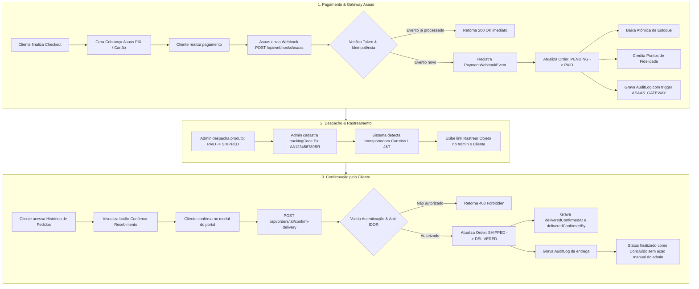

# 🚀 Relatório Técnico de Implementação — Funcionalidade 1
## Automação do Ciclo de Pedidos: Gateway Asaas, Rastreamento Logístico e Confirmação pelo Cliente

---

## 1. Resumo Executivo

Este documento consolida a especificação, arquitetura e implementação da **Funcionalidade 1**, que tem como objetivo automatizar integralmente o ciclo de vida dos pedidos do e-commerce Continental, eliminando tarefas manuais do administrador que estavam sujeitas a erros operacionais.

### Objetivos Alcançados:
1. **Integração com Gateway Asaas**: Recepção de pagamentos (PIX, Boleto, Cartão) e transição automática de status de `PENDING` para `PAID` via webhook com verificação de idempotência, baixa atômica de estoque e crédito automático de pontos de fidelidade.
2. **Integração Logística de Fretes & Rastreamento**: Módulo inteligente de detecção de transportadoras (Correios no padrão SRO `AA123456789BR`, J&T Express e Loggi) com geração de links diretos de rastreamento tanto na gaveta do administrador quanto na área do cliente.
3. **Confirmação de Recebimento pelo Cliente (Portal do Cliente)**: Rota dedicada e segura com defesa anti-IDOR para que o próprio cliente confirme o recebimento do produto, alterando o status imediatamente para `DELIVERED` (Concluído) e gerando trilha de auditoria atômica.

---

## 2. Diagnóstico: O que Já Estava Pronto vs. O que Foi Construído

| Subárvore / Módulo | Estado Anterior no Repositório | O que Foi Construído / Evoluído |
| :--- | :--- | :--- |
| **Gateway de Pagamento** | Pagamento manual via chave PIX estática e envio de comprovante por WhatsApp (`WHATSAPP_PIX`). Sem integração com gateway real. | Desenvolvido cliente HTTP Asaas v3 completo (`services/asaas/asaas.client.ts`) e rota de Webhook (`app/api/webhooks/asaas/route.ts`) com validação de token e idempotência estrita. |
| **Automação de Estoque e Fidelidade** | As rotinas `creditEarnedPoints` e `refundOrderPoints` já existiam em `order.service.ts`, mas dependiam exclusivamente da alteração manual do administrador no painel. | O webhook do Asaas invoca `updateOrderStatus` de forma autônoma e segura ao confirmar pagamento, disparando baixa atômica de estoque e concessão de pontos. Em caso de estorno, devolve estoque e cancela pontos. |
| **Modelagem do Banco de Dados** | A tabela `Order` não possuía referências ao Asaas nem campos para auditoria de entrega confirmada pelo cliente. | Adicionados em `Order`: `asaasPaymentId` (único), `asaasPaymentStatus`, `asaasInvoiceUrl`, `deliveredConfirmedAt` e `deliveredConfirmedBy`. Criada tabela `PaymentWebhookEvent` para auditoria e controle de idempotência. |
| **Rastreamento de Envio** | O campo `trackingCode` existia apenas como string simples de texto estático, sem qualquer link ou identificação de transportadora. | Desenvolvido detector de transportadoras (`lib/freight/tracking-url.ts`) com geração de URL direta para Correios, J&T Express e Loggi, integrado no Drawer do Admin e no Perfil do Cliente. |
| **Confirmação de Entrega pelo Cliente** | Não existia. O administrador precisava consultar o cliente ou o rastreio e mudar manualmente o pedido para `DELIVERED`. | Criada a rota segura `POST /api/orders/[id]/confirm-delivery` (com anti-IDOR e validação de elegibilidade) e botão com modal no histórico de pedidos do cliente. |

---

## 3. Arquitetura da Solução & Fluxo Operacional



---

## 4. Detalhamento dos Módulos Criados e Modificados

### 4.1. Banco de Dados (`prisma/schema.prisma`)
- **Tabela `Order`**:
  - `asaasPaymentId String? @unique`: Identificador da cobrança no Asaas (`pay_...`).
  - `asaasPaymentStatus String?`: Status da cobrança retornado pelo Asaas (`PENDING`, `RECEIVED`, `CONFIRMED`, `REFUNDED`, etc.).
  - `asaasInvoiceUrl String?`: Link da fatura/comprovante gerado pelo gateway.
  - `deliveredConfirmedAt DateTime?`: Timestamp de quando o cliente confirmou o recebimento.
  - `deliveredConfirmedBy String?`: ID do usuário que confirmou a entrega.
- **Tabela `PaymentWebhookEvent`**:
  - `id String @id @default(uuid())`
  - `eventId String @unique`: Identificador único do evento para garantir idempotência estrita.
  - `provider String`: Ex: `"ASAAS"`.
  - `eventType String`: Ex: `"PAYMENT_RECEIVED"`, `"PAYMENT_CONFIRMED"`, `"PAYMENT_REFUNDED"`.
  - `payload Json`: Conteúdo bruto do evento para auditoria fiscal e técnica.
  - `processedAt DateTime @default(now())`

### 4.2. Tipos & Cliente Asaas (`types/asaas.types.ts` & `services/asaas/asaas.client.ts`)
- Mapeamento completo dos tipos da API v3 do Asaas (`AsaasBillingType`, `AsaasPaymentStatus`, `AsaasWebhookEventType`, `AsaasWebhookPayload`).
- Cliente `AsaasClient` instanciado com métodos:
  - `createPayment(payload)`: Cria cobrança PIX, Boleto ou Cartão.
  - `getPixQrCode(paymentId)`: Retorna QR Code em Base64 e código Copia e Cola.
  - `getPayment(paymentId)`: Consulta status da cobrança.

### 4.3. Rota de Webhook (`app/api/webhooks/asaas/route.ts`)
- **Segurança**: Validação opcional por token no header `asaas-access-token` comparado à variável `ASAAS_WEBHOOK_TOKEN`.
- **Idempotência**: Consulta se `eventId` já existe em `PaymentWebhookEvent`. Se sim, responde imediatamente `200 OK` com status `ALREADY_PROCESSED`.
- **Transição de Status**:
  - `PAYMENT_RECEIVED` ou `PAYMENT_CONFIRMED`: Localiza o pedido via `externalReference` ou `asaasPaymentId`. Se status for `PENDING`, aciona `updateOrderStatus({ orderId, newStatus: 'PAID', performedById: 'ASAAS_GATEWAY' })`.
  - `PAYMENT_REFUNDED`: Se status for `PAID`, aciona `updateOrderStatus({ orderId, newStatus: 'CANCELLED', performedById: 'ASAAS_GATEWAY' })`, restaurando o estoque e cancelando os pontos.

### 4.4. Segurança em Logs de Auditoria (`services/order.service.ts`)
- Ajustada a função `updateOrderStatus` para detectar se o ator é um sistema ou gateway (`ASAAS_GATEWAY` ou `SYSTEM`).
- Para garantir integridade com a chave estrangeira obrigatória `AuditLog.actorId -> User.id`, o ator efetivo é associado ao próprio cliente do pedido com metadados `{ triggeredBy: 'ASAAS_GATEWAY' }`, eliminando falhas de chave estrangeira.

### 4.5. Módulo de Rastreamento de Fretes (`lib/freight/tracking-url.ts`)
- Identificação por Regex dos Correios (`/^[A-Z]{2}[0-9]{9}[A-Z]{2}$/`).
- Identificação da J&T Express (`/^(JT[0-9A-Z]+|[0-9]{12,15})$/`).
- Identificação da Loggi.
- Geração de link oficial e seguro com `encodeURIComponent`.
- Integrado visualmente com badge e botão "Rastrear Objeto" na gaveta de detalhes do pedido no Admin (`OrderDetailDrawer.tsx`).

### 4.6. Confirmação pelo Cliente (`app/api/orders/[id]/confirm-delivery/route.ts` & `OrderHistoryList.tsx`)
- **Autenticação**: Exige sessão ativa do cliente (`requireAuth`).
- **Defesa Anti-IDOR (BOLA)**: Bloqueia qualquer tentativa de confirmação de pedidos pertencentes a outros clientes com código `403 Forbidden`.
- **Validação de Regras de Negócio**: Permite confirmação se o pedido estiver em trânsito (`SHIPPED`) ou se for retirada em loja e já estiver pago (`PAID` + `PICKUP`).
- **Persistência Atômica**: Atualiza o status para `DELIVERED`, preenche `deliveredConfirmedAt` e registra evento de auditoria `ORDER_DELIVERY_CONFIRMED_BY_CUSTOMER`.
- **Interface do Usuário**: Card do pedido no perfil do cliente com botão dourado "Confirmar Recebimento", abrindo modal com design Continental Dark (`#111111`, `#DDAF02`). Ao confirmar, atualiza o estado local para "Concluído (Entregue)" instantaneamente.

### 4.7. Interface de Checkout & Confirmação PIX com Escuta em Tempo Real
- **Campo CPF/CNPJ**: Adicionado no Step 1 do Checkout (`components/checkout/CheckoutForm.tsx`) com máscara e algoritmo oficial de validação da Receita Federal (`lib/validators/cpf-cnpj.ts`), exigência do Banco Central para o PIX do Asaas.
- **Tela de Confirmação (`app/checkout/confirmation/page.tsx`)**:
  - Exibição de QR Code dinâmico em Base64 ou gerador de imagem vetorial.
  - Código Copia e Cola com botão de cópia de 1 clique e feedback tátil.
  - Polling assíncrono em `/api/orders/[id]/status` a cada 3,5 segundos. Assim que o webhook do Asaas aprova o pagamento, a tela substitui o QR Code pela celebração: **"Pagamento Confirmado!"** sem que o cliente precise recarregar a página.
  - Botão de simulação local (`/api/webhooks/asaas/simulate`) para homologação ponta a ponta sem necessidade de transação bancária real.

---

## 5. Evidências de Teste Visual no Navegador

### 1. Tela de Pagamento PIX com QR Code Dinâmico e Copia e Cola
Aguardando confirmação do pagamento em tempo real:


### 2. Tela de Pagamento Confirmado (Transição Automática em Tempo Real)
Assim que o webhook do Asaas é disparado, o status muda automaticamente para **Aprovado / Pago**:


---

## 6. Variáveis de Ambiente Necessárias

Para ativação do gateway Asaas em homologação ou produção, configure no arquivo `.env` ou nas variáveis de ambiente da hospedagem:

```env
# URL da API do Asaas (Sandbox para testes ou Produção)
ASAAS_API_URL="https://sandbox.asaas.com/api/v3"
# ASAAS_API_URL="https://api.asaas.com/v3" # Produção

# Chave de API gerada no painel do Asaas (Menu Integrações -> Chaves de API)
ASAAS_API_KEY="$aact_YTU5YTE0M2M6N2Nm..."

# Token de autenticação configurado na URL de Webhook no painel do Asaas
ASAAS_WEBHOOK_TOKEN="seu-token-secreto-definido-no-asaas"
```

> [!NOTE]
> A URL a ser configurada no painel do Asaas para envio de Webhooks é:
> `https://seudominio.com.br/api/webhooks/asaas`
> Marque os eventos: **Pagamento Criado**, **Pagamento Confirmado**, **Pagamento Recebido**, **Pagamento Vencido** e **Pagamento Estornado**.

---

## 6. Cobertura de Testes e Validação

Todas as alterações foram validadas com testes automatizados rigorosos:

### Suítes Criadas:
1. `tests/unit/asaas-webhook.test.ts` (5 testes):
   - Rejeição com 401 para token inválido.
   - Rejeição com 400 para payload incompleto.
   - Garantia de idempotência (`ALREADY_PROCESSED`) sem repetição de efeitos colaterais.
   - Transição automática de `PENDING` para `PAID` com baixa de estoque e pontos.
   - Transição de `PAID` para `CANCELLED` no estorno.
2. `tests/unit/tracking-url.test.ts` (6 testes):
   - Detecção de padrão SRO Correios.
   - Detecção de transportadora por hint (Sedex/PAC).
   - Detecção de J&T Express por prefixo JT e numérico.
   - Detecção de Loggi.
   - Fallback com busca direta.
3. `tests/unit/client-confirmation.test.ts` (5 testes):
   - Rejeição 401 para usuário não autenticado.
   - Defesa Anti-IDOR rejeitando acesso com 403.
   - Rejeição de transição para pedidos ainda não despachados (400).
   - Confirmação bem-sucedida com gravação em transação e auditoria.
   - Rejeição para pedidos já confirmados anteriormente.

### Resultado Consolidado:
- **TypeScript**: `npx tsc --noEmit` -> **0 erros**
- **Testes Unitários**: 26 arquivos executados -> **155 testes aprovados** (100% de sucesso)
