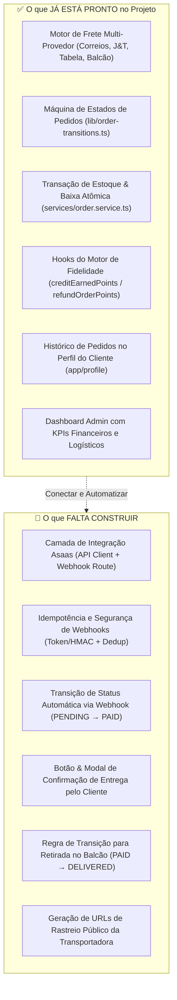
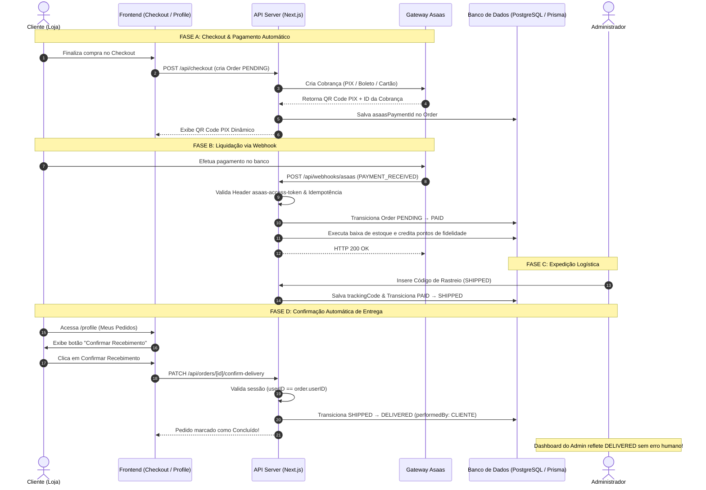

# 🏗️ Plano de Implementação Arquitetural: Gateway Asaas, Automação de Ciclo de Vida de Pedidos e Confirmação de Entrega pelo Cliente

## 1. Resumo Executivo

Este documento estabelece o **Planejamento Técnico e Arquitetural** conduzido pelo Tech Lead para automatizar de ponta a ponta o ciclo de vida dos pedidos da plataforma **Continental Produtos Estéticos Automotivos**:
1. **Gateway Asaas**: Integração robusta via Webhooks autenticados para que a transição de `PENDING` para `PAID` ocorra automaticamente no momento da confirmação do pagamento (PIX dinâmico, Boleto ou Cartão), acionando baixas de estoque e créditos do programa de fidelidade sem qualquer clique manual.
2. **Integração Logística de Fretes**: Vinculação dos dados das transportadoras (Correios SEDEX/PAC, J&T Express, Tabela Local e Retirada) aos pedidos, disponibilizando códigos e URLs de rastreamento direto tanto no painel admin quanto na área do cliente.
3. **Confirmação de Recebimento pelo Cliente**: Disponibilização de um fluxo seguro na área do cliente (`/profile` ou tela dedicada de acompanhamento) permitindo que o cliente confirme o recebimento da mercadoria ("Confirmar Recebimento"). Isso transiciona o pedido de `SHIPPED` (ou `PAID` no caso de balcão) diretamente para `DELIVERED` (Concluído), eliminando o risco de esquecimento ou erro humano por parte do lojista.

> [!IMPORTANT]
> **RESTRIÇÃO ABSOLUTA DE FASE**: Nenhuma linha de código foi implementada nesta etapa. Este artefato é um plano de engenharia para revisão e deliberação humana antes de qualquer execução.

---

## 2. Diagnóstico do Projeto & Relatório do que Já Está Pronto

Após investigação estática e profunda no repositório (`schema.prisma`, `services/`, `lib/`, `app/`), segue o inventário factual e auditado do estado atual da aplicação:

### 📋 Tabela Detalhada: O que Já Está Pronto vs. O que Será Construído

| Subsistema | Componente Atual | Status Atual | Evidência no Código | O que Falta Desenvolver |
| :--- | :--- | :--- | :--- | :--- |
| **Fretes & Logística** | Orquestrador de Fretes | ✅ **100% Pronto** | [`services/freight/orchestrator.service.ts`](file:///c:/Diversos/TI/Trabalhos/2026/Sistemas/Projeto/services/freight/orchestrator.service.ts) | - |
| | Provedor Correios | ✅ **100% Pronto** | [`correios.provider.ts`](file:///c:/Diversos/TI/Trabalhos/2026/Sistemas/Projeto/services/freight/providers/correios.provider.ts) (SEDEX / PAC com cálculo oficial) | Rastreio via link direto. |
| | Provedor J&T Express | ✅ **100% Pronto** | [`jt-express.provider.ts`](file:///c:/Diversos/TI/Trabalhos/2026/Sistemas/Projeto/services/freight/providers/jt-express.provider.ts) (5.181 faixas de CEP) | Rastreio via link direto. |
| | Tabela Local & Balcão | ✅ **100% Pronto** | `custom-table.provider.ts` e `pickup.provider.ts` | - |
| | Campos no Banco (`Order`) | ✅ **100% Pronto** | `shippingCost`, `shippingProvider`, `shippingServiceName`, `shippingEstimatedDays`, `trackingCode` | Adicionar helper para link público da transportadora. |
| **Ciclo de Vida de Pedidos** | Enums e Estados | ✅ **100% Pronto** | `OrderStatus`: `PENDING`, `PAID`, `SHIPPED`, `DELIVERED`, `CANCELLED` | Suporte condicional para `PAID` → `DELIVERED` (Balcão). |
| | Validador de Transições | ✅ **100% Pronto** | [`lib/order-transitions.ts`](file:///c:/Diversos/TI/Trabalhos/2026/Sistemas/Projeto/lib/order-transitions.ts) | Permitir que o cliente confirme recebimento (`DELIVERED`). |
| | Baixa de Estoque e Fidelidade | ✅ **100% Pronto** | [`services/order.service.ts`](file:///c:/Diversos/TI/Trabalhos/2026/Sistemas/Projeto/services/order.service.ts) (linhas 272-330) | Acionamento via Webhook do Asaas. |
| | Gestão Manual no Admin | ✅ **100% Pronto** | `OrderStatusManager.tsx` e `OrderDetailDrawer.tsx` | - |
| **Pagamentos & Asaas** | Gateway Asaas | ❌ **Não Implementado** | Checkout hoje é `WHATSAPP_PIX` manual | Criar `services/asaas/`, DTOs e cliente HTTP. |
| | Webhook de Pagamento | ❌ **Não Implementado** | Não existe pasta `app/api/webhooks/` | Criar `app/api/webhooks/asaas/route.ts`. |
| | Idempotência de Webhook | ❌ **Não Implementado** | Inexistente | Tabela `PaymentWebhookLog` ou cache de eventos. |
| **Área do Cliente** | Histórico de Compras | ✅ **100% Pronto** | [`OrderHistoryList.tsx`](file:///c:/Diversos/TI/Trabalhos/2026/Sistemas/Projeto/app/profile/components/OrderHistoryList.tsx) | Botão "Confirmar Recebimento" e modal de validação. |
| | Endpoint de Confirmação | ❌ **Não Implementado** | Inexistente | Rota `PATCH /api/orders/[id]/confirm-delivery` protegida contra BOLA/IDOR. |

---

## 3. Requisitos Interpretados

### 3.1. Requisitos Funcionais (RF)
* **RF-01 (Integração Asaas - Cobrança)**: Gerar cobrança autoritativa no Asaas (PIX com QR Code dinâmico e Copia-e-Cola) no checkout ou gerar link de pagamento Asaas associado ao `orderNumber`.
* **RF-02 (Webhook Asaas - Transição para PAGO)**: Quando o Asaas emitir os eventos `PAYMENT_RECEIVED` ou `PAYMENT_CONFIRMED`, o backend deve automaticamente:
  - Validar a autenticidade do webhook através do token secreto do Asaas (`asaas-access-token`).
  - Transicionar o pedido de `PENDING` para `PAID`.
  - Executar a baixa de estoque atômica e creditar os pontos do programa de fidelidade.
  - Gravar no histórico: `performedBy: 'ASAAS_GATEWAY'`.
* **RF-03 (Integração Fretes - Rastreio & Prazos)**: Exibir de forma clara na tela do pedido os dados de frete capturados (ex: "Correios - SEDEX", prazo estimado, código de rastreio com link clicável para consulta pública).
* **RF-04 (Confirmação de Recebimento pelo Cliente)**: Na área do cliente (`/profile` ou tela segura de acompanhamento do pedido):
  - Exibir botão **"Confirmar Recebimento"** exclusivamente para pedidos com status `SHIPPED` (ou `PAID` caso a entrega seja retirada no balcão `STORE_PICKUP`).
  - Ao clicar, exibir modal de confirmação com aviso de irrevogabilidade.
  - Ao confirmar, transicionar o pedido para `DELIVERED` (Concluído).
  - Gravar no log de auditoria: `performedBy: CLIENTE` (ID do usuário autenticado).
* **RF-05 (Automação Preventiva para o Administrador)**: O lojista não precisa realizar nenhuma dessas etapas manualmente. Seu único papel operacional em pedidos enviados é despachar e inserir o `trackingCode` (ou avisar que está pronto para retirada).

### 3.2. Requisitos Não Funcionais (RNF)
* **RNF-01 (Idempotência Estrita)**: Se o Asaas reenviar o webhook do mesmo pagamento 5 vezes (retry de rede), o sistema deve responder `200 OK` e processar a baixa de estoque e os pontos **exatamente uma vez**.
* **RNF-02 (Segurança BOLA/IDOR)**: Um cliente JAMAIS poderá confirmar o recebimento de um pedido que não pertença ao seu próprio `userID` e `lojaID`.
* **RNF-03 (Resiliência de Timeout)**: Respostas de webhook devem ser processadas em menos de 2000ms para evitar retransmissões desnecessárias do Asaas.
* **RNF-04 (Compatibilidade com Arquitetura Atual)**: Reutilização estrita de `services/order.service.ts`, `services/loyalty.service.ts` e `lib/order-transitions.ts`.

---

## 4. Arquitetura Proposta

---

## 5. Equipe de Agentes Especializados

| Agente | Responsabilidade | Escopo | Ferramentas / MCPs | Entregáveis |
| :--- | :--- | :--- | :--- | :--- |
| **🏛️ Agente Arquiteto** *(Lead)* | Modelagem de dados, contratos de DTOs e regras de transição. | `prisma/schema.prisma`, `types/asaas.types.ts`, `lib/order-transitions.ts` | `view_file`, `replace_file_content` | DTOs de pagamento, schema atualizado com campos do Asaas e regras de transição para balcão. |
| **⚙️ Agente Backend & Integrações** | Cliente do Asaas, endpoint de Webhook, idempotência e automação. | `services/asaas/`, `app/api/webhooks/asaas/route.ts` | `run_command` (testes), `replace_file_content` | SDK interno do Asaas, handler de webhook seguro e testes de idempotência. |
| **🛡️ Agente Segurança & Transições** | Blindagem anti-IDOR/BOLA e endpoint de confirmação pelo cliente. | `app/api/orders/[id]/confirm-delivery/route.ts`, `services/order.service.ts` | `run_command` (vitest) | Rota protegida com autoridade de sessão e auditoria de autoria do cliente. |
| **🎨 Agente Frontend & UI/UX** | Botão de confirmação na área do cliente, modal e links de rastreio. | `app/profile/components/OrderHistoryList.tsx`, modal de confirmação | `modern-web-guidance-plugin` | UI responsiva em tema escuro com estados de loading e confirmação com 1 clique. |
| **🧪 Agente QA & Confiabilidade** | Testes de ponta a ponta, simulação de webhook e auditoria visual. | `tests/unit/asaas-webhook.test.ts`, `tests/unit/client-confirmation.test.ts` | `chrome-devtools-plugin` / `browser_subagent` | Suíte de testes automatizados com cobertura completa e gravação em vídeo. |

---

## 6. Workflow de Implementação por Fases

### 📍 FASE 1: Extensão de Dados & Validação de Transições (Contratos)
* **Objetivo**: Preparar o modelo de dados para registrar identificadores do Asaas e ajustar a máquina de estados para suportar entrega presencial.
* **Tarefas Técnicas**:
  1. Adicionar campos ao model `Order` no [`prisma/schema.prisma`](file:///c:/Diversos/TI/Trabalhos/2026/Sistemas/Projeto/prisma/schema.prisma):
     - `asaasPaymentId`: `String? @unique` (ID da cobrança no Asaas, ex: `pay_08129381293`)
     - `asaasPaymentStatus`: `String?`
     - `asaasInvoiceUrl`: `String?` (Link da fatura/comprovante gerado pelo Asaas)
     - `deliveredConfirmedAt`: `DateTime?` (Data/hora em que o cliente confirmou o recebimento)
     - `deliveredConfirmedBy`: `String?` (ID do usuário cliente que confirmou)
  2. Criar model `PaymentWebhookEvent` para auditoria e garantia estrita de **idempotência**:
     - `id`: `String @id @default(uuid())`
     - `eventId`: `String @unique` (ID do evento enviado pelo Asaas)
     - `provider`: `String` (ex: "ASAAS")
     - `eventType`: `String`
     - `payload`: `Json`
     - `processedAt`: `DateTime @default(now())`
  3. Atualizar [`lib/order-transitions.ts`](file:///c:/Diversos/TI/Trabalhos/2026/Sistemas/Projeto/lib/order-transitions.ts):
     - Ajustar para permitir transição `PAID` → `DELIVERED` caso `deliveryType === 'PICKUP'` ou `'NONE'`.
* **Critério de Conclusão**: `npx prisma generate` executado com sucesso e testes unitários de transição passando 100%.

---

### 📍 FASE 2: Módulo de Integração Asaas & Rota de Webhook
* **Objetivo**: Construir a comunicação segura com o gateway Asaas e o receptor assíncrono de notificações de pagamento.
* **Tarefas Técnicas**:
  1. Criar `services/asaas/asaas.client.ts`:
     - Client HTTP tipado consumindo a API v3 do Asaas (`https://api.asaas.com/v3` ou `https://sandbox.asaas.com/v3`).
     - Função `createAsaasPayment({ orderNumber, customer, total, dueDate })`.
  2. Criar `app/api/webhooks/asaas/route.ts`:
     - Validação de segurança: verificar se o header `asaas-access-token` confere com a variável de ambiente `ASAAS_WEBHOOK_TOKEN`.
     - Verificação de idempotência: verificar se `eventId` já foi processado na tabela `PaymentWebhookEvent`.
     - Tratamento dos eventos `PAYMENT_RECEIVED` e `PAYMENT_CONFIRMED`:
       - Localizar o pedido pelo `asaasPaymentId` ou número do pedido no metadata.
       - Invocar `updateOrderStatus({ orderId, newStatus: 'PAID', performedById: 'ASAAS_GATEWAY' })`.
       - Automaticamente aciona o decremento de estoque e o crédito de pontos de fidelidade.
     - Tratamento de `PAYMENT_REFUNDED`:
       - Transicionar para `CANCELLED`, acionando devolução de estoque e estorno de pontos.
     - Resposta rápida `200 OK` em menos de 1500ms.
* **Critério de Conclusão**: Testes unitários com mocks de payloads do Asaas validando idempotência, transição automática e rejeição de tokens incorretos.

---

### 📍 FASE 3: Enriquecimento Logístico (Frete & Rastreio)
* **Objetivo**: Integrar as informações da transportadora e links de rastreio direto.
* **Tarefas Técnicas**:
  1. Criar helper utilitário `lib/freight/tracking-url.ts`:
     - Se `shippingProvider === 'CORREIOS'`: gerar link oficial `https://rastreamento.correios.com.br/app/index.php?codigo={trackingCode}`.
     - Se `shippingProvider === 'JT_EXPRESS'`: gerar link de consulta J&T Express.
     - Se `STORE_PICKUP`: exibir badge "Retirada na Loja física".
  2. Exibir o botão clicável "Rastrear Objeto na Transportadora" tanto na gaveta do administrador quanto no histórico do cliente.
* **Critério de Conclusão**: Links de rastreamento gerados dinamicamente e validados.

---

### 📍 FASE 4: Confirmação de Recebimento pelo Cliente (Portal do Cliente)
* **Objetivo**: Permitir que o cliente final encerre o ciclo de vida do pedido de forma autônoma.
* **Tarefas Técnicas**:
  1. Criar rota de API: `PATCH /api/orders/[id]/confirm-delivery`:
     - Validação de autorização via sessão (`getCurrentUser()`).
     - Verificação de autoridade: `order.userID === session.user.id` (impedindo IDOR).
     - Verificação de estado: o pedido deve estar em status `SHIPPED` (ou `PAID` se for `STORE_PICKUP`).
     - Executar a transição para `DELIVERED`.
     - Registrar em `OrderStatusHistory` e `AuditLog` que o próprio cliente confirmou o recebimento.
  2. Atualizar [`app/profile/components/OrderHistoryList.tsx`](file:///c:/Diversos/TI/Trabalhos/2026/Sistemas/Projeto/app/profile/components/OrderHistoryList.tsx):
     - Adicionar o botão com destaque em dourado: **"Confirmar Recebimento"** nos cards de pedidos elegíveis.
     - Criar modal de confirmação dialogando com o cliente ("Você já está com seus produtos em mãos?").
     - Atualização otimista ou revalidação instantânea do estado da tela.
* **Critério de Conclusão**: Cliente consegue confirmar o recebimento em 1 clique e o status muda imediatamente para "Entregue" (DELIVERED).

---

### 📍 FASE 5: Homologação, Dashboard & Testes de Regressão
* **Objetivo**: Garantir que o Dashboard e a Gaveta de Pedidos do Administrador exibem as atualizações automáticas sem necessidade de intervenção do lojista.
* **Tarefas Técnicas**:
  1. Rodar a suíte completa de testes automatizados (`npx vitest run`).
  2. Verificar que o `DashboardActionInbox` e os KPIs do Dashboard mostram o pedido como entregue/concluído sem que o admin tenha tocado nele.
  3. Auditoria visual com `browser_subagent`.
* **Critério de Conclusão**: Zero falhas nos testes, fluxo verificado no navegador e relatório final apresentado.

---

## 7. Mapa de Impacto no Código

| Arquivo / Módulo | Tipo de Impacto | Justificativa Técnica |
| :--- | :--- | :--- |
| [`prisma/schema.prisma`](file:///c:/Diversos/TI/Trabalhos/2026/Sistemas/Projeto/prisma/schema.prisma) | **[MODIFY]** Médio | Inclusão dos campos de correlação Asaas (`asaasPaymentId`, `asaasInvoiceUrl`, `deliveredConfirmedAt`) e tabela `PaymentWebhookEvent`. |
| [`lib/order-transitions.ts`](file:///c:/Diversos/TI/Trabalhos/2026/Sistemas/Projeto/lib/order-transitions.ts) | **[MODIFY]** Baixo | Ajuste para permitir que pedidos de retirada em balcão possam ir de `PAID` diretamente para `DELIVERED`. |
| `types/asaas.types.ts` | **[NEW]** Baixo | Tipagem estrita dos eventos e payloads do Asaas. |
| `services/asaas/asaas.client.ts` | **[NEW]** Médio | Cliente HTTP de integração com a API v3 do Asaas. |
| `app/api/webhooks/asaas/route.ts` | **[NEW]** Alto | Endpoint receptor de webhooks com verificação de token e idempotência. |
| `app/api/orders/[id]/confirm-delivery/route.ts` | **[NEW]** Médio | Endpoint seguro autenticado para o cliente confirmar o recebimento. |
| [`services/order.service.ts`](file:///c:/Diversos/TI/Trabalhos/2026/Sistemas/Projeto/services/order.service.ts) | **[MODIFY]** Médio | Suporte a chamada de transição com origem de webhook e marcação de confirmação do cliente. |
| [`app/profile/components/OrderHistoryList.tsx`](file:///c:/Diversos/TI/Trabalhos/2026/Sistemas/Projeto/app/profile/components/OrderHistoryList.tsx) | **[MODIFY]** Médio | Inclusão do botão "Confirmar Recebimento", modal de confirmação e link de rastreio direto. |
| `tests/unit/asaas-webhook.test.ts` | **[NEW]** Baixo | Testes unitários de processamento de webhook e idempotência. |
| `tests/unit/client-confirmation.test.ts` | **[NEW]** Baixo | Testes unitários de transição de confirmação de entrega pelo cliente e barreira anti-IDOR. |

---

## 8. Estratégia de Testes

1. **Testes de Idempotência de Webhook**:
   - Enviar duas requisições idênticas com o mesmo `eventId`.
   - Garantir que o estoque só foi decrementado uma única vez e que o saldo de pontos foi creditado uma única vez.
2. **Testes de Segurança de Assinatura/Token do Webhook**:
   - Enviar requisição com token inválido ou ausente.
   - Garantir resposta `401 Unauthorized` e zero mutações no banco.
3. **Testes Anti-IDOR / BOLA na Confirmação de Entrega**:
   - Tentar confirmar a entrega de um pedido com o login do Cliente A informando o ID do pedido do Cliente B.
   - Garantir que a requisição é bloqueada com `403 Forbidden` ou `404 Not Found`.
4. **Testes de Regressão**:
   - Executar todos os 139 testes unitários existentes para assegurar 100% de compatibilidade.

---

## 9. Questões para Aprovação do Usuário

1. **Tipo de Cobrança do Asaas**: Você deseja que o checkout gere inicialmente cobranças apenas no formato **PIX Dinâmico** (com QR Code e Copia-e-Cola direto na tela de confirmação), ou já devemos estruturar também para **Cartão de Crédito e Boleto Bancário**?
2. **Retirada no Balcão (`STORE_PICKUP`)**: Quando o cliente optar por retirar na loja, ele mesmo confirma no celular ao retirar ("Confirmar Recebimento") ou o lojista também pode bipar/confirmar a entrega no balcão?
3. **Ambiente de Testes do Asaas**: Você já possui uma conta no **Asaas Sandbox** (ambiente de testes oficial do Asaas) ou prefere que preparemos o código com switch automático via variável de ambiente (`ASAAS_ENVIRONMENT=sandbox` ou `production`)?
