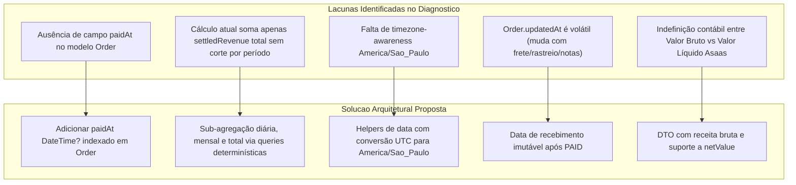
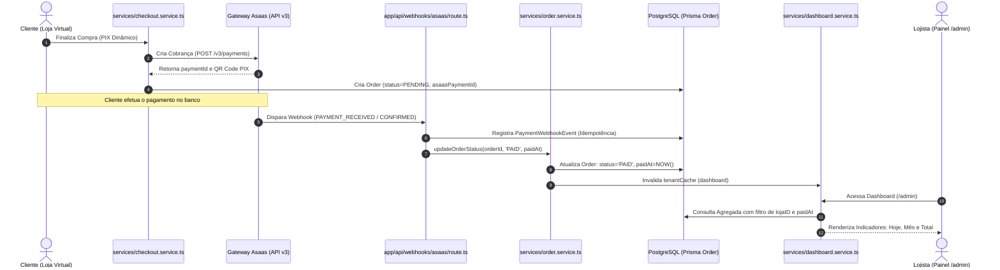
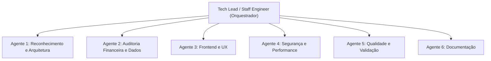
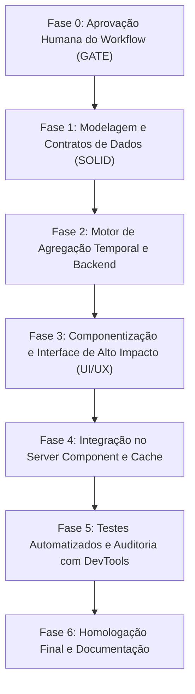
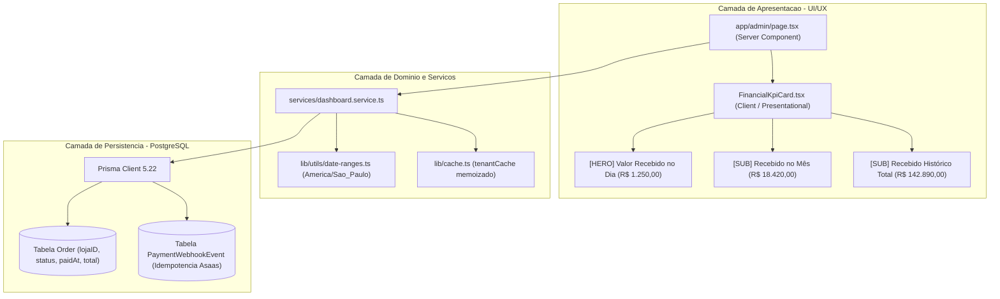

# Workflow de Implementação — Indicadores Financeiros do Dashboard
**Projeto:** Continental Produtos Estéticos Automotivos — Painel Administrativo  
**Módulo:** Gestão Financeira & Dashboard Executivo (`/admin`)  
**Versão do Documento:** 1.0.0  
**Data:** 17 de Setembro de 2026  
**Responsável Técnico:** Staff Software Engineer / Tech Lead  
**Status do Workflow:** Proposta Arquitetural Completa — **AGUARDANDO APROVAÇÃO HUMANA (STRICT READ-ONLY)**  

---

> [!IMPORTANT]
> **RESTRIÇÃO ABSOLUTA DESTA ETAPA:**  
> Nenhuma linha de código de produção, configuração, migração de banco de dados ou instalação de dependências foi executada. Este documento representa o planejamento arquitetural e o workflow operacional completo, pronto para revisão humana e gate de aprovação formal.

---

## 1. Resumo Executivo

O presente documento estabelece a arquitetura, as regras de integridade contábil e o workflow de engenharia para implementar os **Indicadores Financeiros de Recebimentos Reais** no painel administrativo (`/admin`) da plataforma Continental Produtos Estéticos Automotivos.

A necessidade de negócio decorre da imperativa distinção entre **venda criada / faturamento projetado** e **receita financeira efetivamente liquidada (em caixa)**. A plataforma opera com pedidos que transitam por múltiplos estados (`PENDING`, `PAID`, `SHIPPED`, `DELIVERED`, `CANCELLED`) e utiliza o **Asaas** como gateway autoritativo de cobranças (PIX dinâmico, boletos e conciliação bancária).

Os novos indicadores fornecerão visibilidade imediata e auditável sobre os seguintes horizontes temporais de recebimento:
1. **Valor Recebido no Dia:** Total líquido ou bruto liquidado na data civil corrente (horário de Brasília — `America/Sao_Paulo`), ocupando a **posição de maior destaque visual** no painel.
2. **Valor Recebido no Mês:** Total acumulado de recebimentos válidos no mês civil corrente.
3. **Valor Recebido no Total:** Total histórico consolidado de todos os recebimentos válidos e não revertidos já processados pela loja.

A solução foi projetada sob estritos padrões de **imutabilidade contábil, isolamento multi-tenant (`lojaID`), ausência de contagem duplicada, precisão decimal arbitrária (`Prisma.Decimal`), proteção contra race conditions e alinhamento aos princípios SOLID e OWASP Top 10 API Security**.

---

## 2. Requisitos Funcionais e Regras de Negócio

### 2.1. Definição dos Indicadores

| Indicador | Definição Canônica | Destaque Visual | Filtro Temporal |
| :--- | :--- | :--- | :--- |
| **Recebimento do Dia** | Somatório de todos os valores financeiros cujo evento de liquidação ocorreu entre `00:00:00.000` e `23:59:59.999` da data atual no timezone oficial do negócio (`America/Sao_Paulo`). | **MÁXIMO (Hero Card)**: Tipografia expandida, gradiente de destaque dourado/âmbar (`#DDAF02`), badge "Hoje", indicador de pulso em tempo real. | `paidAt >= startOfDay && paidAt <= endOfDay` |
| **Recebimento do Mês** | Somatório de todos os recebimentos válidos ocorridos a partir do primeiro dia do mês civil corrente às `00:00:00.000` até o instante atual (`America/Sao_Paulo`). | **Secundário / Sub-Hero**: Card complementar de suporte, métrica de volume e contexto comparativo. | `paidAt >= startOfMonth && paidAt <= endOfMonth` |
| **Recebimento Total** | Somatório acumulado de todos os recebimentos válidos e confirmados de toda a história operacional da loja ativa (`lojaID`). | **Consolidado / Histórico**: Card executivo de patrimônio financeiro processado. | `paidAt IS NOT NULL && status IN ('PAID', 'SHIPPED', 'DELIVERED')` |

### 2.2. Regras Fundamentais de Integridade Financeira

1. **Invariante de Liquidação:** A existência de um pedido em status `PENDING`, ou a mera emissão de um QR Code PIX, **não constitui recebimento financeiro**. O valor só é computado após a confirmação irrevogável do pagamento.
2. **Status Válidos para Recebimento:**
   - Pedidos elegíveis ao cômputo: `PAID`, `SHIPPED`, `DELIVERED`.
   - Pedidos inelegíveis: `PENDING` (não pago) e `CANCELLED` (cancelado antes do pagamento ou expirado).
3. **Tratamento de Estornos, Devoluções e Reembolsos (`REFUNDED` / `CHARGEBACK`):**
   - No caso de webhook `PAYMENT_REFUNDED` ou chargeback deferido, o status do pedido migra para `CANCELLED` (ou status dedicado de estorno `REFUNDED`).
   - O valor financeiro correspondente deve ser **imediatamente subtraído** do total histórico e do respectivo período caso o estorno ocorra na mesma janela, ou computado como lançamento a débito de conciliação.
4. **Tratamento de Pagamentos Tardios em Pedidos Cancelados (Vulnerabilidade AUD2-005):**
   - Caso um cliente efetue o pagamento de uma cobrança Asaas após o pedido ter sido cancelado por timeout na loja, o webhook registra alerta crítico de auditoria (`PAYMENT_RECEIVED_ON_CANCELLED_ORDER`).
   - Esse valor **não deve ser inflado na receita de pedidos sem revisão humana**, devendo constar em saldo de divergência/pendência operacional até que o lojista confirme o estorno bancário ou reative o pedido.
5. **Precisão Monetária Sem Ponto Flutuante:**
   - Proibição absoluta do uso do tipo numérico primitivo `number` / float em operações de soma contábil no backend.
   - Utilização estrita de `Prisma.Decimal` ou inteiros em centavos (*integer cents*) para garantir precisão exata de 2 casas decimais sem dízimas (`0.1 + 0.2 = 0.3`).
6. **Timezone Oficial e Fechamento Civil:**
   - Timezone canônico: `America/Sao_Paulo` (UTC-3, sem horário de verão atualmente).
   - O banco PostgreSQL opera com instâncias temporais em UTC (`timestamptz`). O cálculo de início e fim do dia deve converter `startOfDay` e `endOfDay` de `America/Sao_Paulo` para os instantes correspondentes em UTC antes de submeter ao banco de dados.
7. **Ausência de Duplicidade:**
   - Cada liquidação financeira deve possuir chave única de conciliação vinculada ao `asaasPaymentId` ou ao identificador único da transação bancária.

---

## 3. Diagnóstico da Arquitetura Atual

### 3.1. Stack Tecnológica e Versões Identificadas

- **Frontend & Backend Framework:** Next.js `16.3.5` (App Router com Server Components e Server Actions).
- **Linguagem & Tipagem:** TypeScript `5.x`, tipagem estrita com Zod `4.4.3`.
- **Camada de Banco & Persistência:** Prisma ORM `5.22.0` conectado a PostgreSQL (Supabase / local test db).
- **Estilização & Design System:** Tailwind CSS `3.4.1`, Radix UI, Lucide React `1.8.0`, paleta Dark Mode Continental (`#DDAF02`, *glass-panel*).
- **Testes Automatizados:** Vitest `4.1.6` com 35 suítes e 222+ testes unitários e de integração aprovados.
- **Cache & Concorrência:** `tenantCache` (`lib/cache.ts`) particionado por `lojaID`.
- **Autenticação & Sessão:** Sessão segura via cookies HTTP-only (`Session` model, `getCurrentUser()` em `lib/session.ts`).

### 3.2. Mapeamento do Dashboard Existente (`app/admin/page.tsx`)

Atualmente, o dashboard administrativo possui a seguinte estrutura de agregação em `services/dashboard.service.ts`:
- Função `getAggregatedDashboardMetrics(lojaID: string)` realiza agrupamento de pedidos via:
  ```typescript
  prisma.order.groupBy({
    by: ['status'],
    where: { lojaID },
    _count: { _all: true },
    _sum: { total: true, shippingCost: true },
  });
  ```
- O cálculo da receita atual é feito por:
  ```typescript
  // Trecho existente em services/dashboard.service.ts (linhas 272-297):
  for (const group of orderGroups) {
    const totalVal = group._sum.total?.toNumber() ?? 0;
    switch (group.status) {
      case OrderStatus.PAID:
      case OrderStatus.SHIPPED:
      case OrderStatus.DELIVERED:
        settledOrdersCount += group._count._all;
        settledRevenue += totalVal;
        break;
      case OrderStatus.PENDING:
        pendingRevenue += totalVal;
        break;
      case OrderStatus.CANCELLED:
        cancelledRevenue += totalVal;
        break;
    }
  }
  ```

### 3.3. Lacunas Técnicas Críticas Diagnosticadas



1. **Ausência de Campo de Liquidação no Modelo `Order`:**
   - O modelo `Order` possui `createdAt` e `updatedAt`.
   - Se utilizarmos `createdAt`, pedidos criados em um dia/mês anterior que foram pagos hoje serão atribuídos retroativamente à data de criação do carrinho, **ocultando a liquidação real do dia de hoje**.
   - Se utilizarmos `updatedAt`, qualquer alteração operacional posterior no pedido (como inclusão de `trackingCode` de Correios/J&T, anotações em `adminNotes` ou confirmação de entrega em `deliveredConfirmedAt`) atualizará o timestamp do pedido, **distorcendo retroativamente o fechamento diário e mensal**.
2. **Inexistência de Quebra Temporal por Período no DTO:**
   - O contrato `DashboardFinancialDTO` em `types/dashboard.ts` possui apenas `settledRevenue`, `pendingRevenue`, `cancelledRevenue` e `averageTicket`. Não há propriedades para `settledToday`, `settledThisMonth` e `settledAllTime`.
3. **Card Visual Não Especializado:**
   - O componente `FinancialKpiCard.tsx` exibe apenas um valor consolidado de receita confirmada, sem dar o **destaque visual prioritário ao recebimento do dia**.

---

## 4. Fluxo de Dados Financeiros

O fluxo de dados da receita real percorre a seguinte esteira autoritativa:



---

## 5. Fonte de Verdade e Estratégia de Cálculo

### 5.1. Identificação da Fonte de Verdade

No ecossistema Continental, a fonte de verdade financeira compõe-se de **dois níveis de soberania**:
1. **Nível de Liquidação Externa (Gateway Soberano):** O gateway Asaas é a entidade financeira soberana que atesta a entrada do recurso bancário via PIX, boleto ou cartão.
2. **Nível de Registro Contábil Interno (Base do E-Commerce):** A tabela `Order` no PostgreSQL é a fonte de verdade operacional do sistema, consolidando o vínculo entre o lojista (`lojaID`), o pedido (`id`, `orderNumber`), o valor total (`total`), o status (`status`) e a data efetiva de pagamento (`paidAt`).

### 5.2. Estratégia Canônica de Resolução Temporal

Para calcular com exatidão as janelas de **Dia**, **Mês** e **Total** sem sofrer distorções de fusos horários:

```typescript
// Estratégia canônica de datas para America/Sao_Paulo
import { toZonedTime, fromZonedTime } from 'date-fns-tz'; // ou implementação nativa via Intl

const TIMEZONE_NEGOCIO = 'America/Sao_Paulo';

export function getBusinessTimeRanges(now = new Date()) {
  // 1. Obter a data civil no fuso de São Paulo
  const formatter = new Intl.DateTimeFormat('en-CA', {
    timeZone: TIMEZONE_NEGOCIO,
    year: 'numeric',
    month: '2-digit',
    day: '2-digit',
  });
  const [year, month, day] = formatter.format(now).split('-').map(Number);

  // 2. Início e fim do dia corrente em São Paulo convertidos para Date (UTC)
  const startOfDaySP = new Date(Date.UTC(year, month - 1, day, 3, 0, 0, 0)); // 00:00:00 SP = 03:00:00 UTC
  const endOfDaySP = new Date(Date.UTC(year, month - 1, day + 1, 2, 59, 59, 999)); // 23:59:59.999 SP

  // 3. Início e fim do mês corrente em São Paulo convertidos para Date (UTC)
  const startOfMonthSP = new Date(Date.UTC(year, month - 1, 1, 3, 0, 0, 0));
  
  return {
    startOfDay: startOfDaySP,
    endOfDay: endOfDaySP,
    startOfMonth: startOfMonthSP,
    currentInstant: now,
  };
}
```

### 5.3. Estratégia de Agregação no Banco de Dados

A consulta no PostgreSQL deve ser executada com isolamento multi-tenant obrigatório (`lojaID`) em uma única rodada otimizada ou chamadas paralelas em lote:

```typescript
// Exemplo arquitetural de agregação sem varredura completa da tabela
const settledStatuses: OrderStatus[] = [
  OrderStatus.PAID,
  OrderStatus.SHIPPED,
  OrderStatus.DELIVERED,
];

// 1. Recebimento do Dia:
const dayAggregate = await prisma.order.aggregate({
  where: {
    lojaID,
    status: { in: settledStatuses },
    paidAt: {
      gte: timeRanges.startOfDay,
      lte: timeRanges.endOfDay,
    },
  },
  _sum: { total: true },
  _count: { _all: true },
});

// 2. Recebimento do Mês:
const monthAggregate = await prisma.order.aggregate({
  where: {
    lojaID,
    status: { in: settledStatuses },
    paidAt: {
      gte: timeRanges.startOfMonth,
      lte: timeRanges.currentInstant,
    },
  },
  _sum: { total: true },
  _count: { _all: true },
});

// 3. Recebimento Total Histórico:
const totalAggregate = await prisma.order.aggregate({
  where: {
    lojaID,
    status: { in: settledStatuses },
  },
  _sum: { total: true },
  _count: { _all: true },
});
```

---

## 6. Equipe de Agentes e Responsabilidades

Para a futura fase de implementação, o Tech Lead orquestrará uma equipe de 6 agentes especializados, garantindo a aplicação estrita dos princípios **SOLID**:



### 1. 🏛️ Agente 1 — Reconhecimento e Arquitetura
- **Objetivo:** Garantir coerência arquitetural e conformidade com os princípios SOLID.
- **Entregáveis:** Atualização de contratos em `types/dashboard.ts` (interfaces segregadas: `DashboardFinancialDTO` enriquecido com breakdown temporal).
- **Critério de Aceite:** DTOs desacoplados, contratos imutáveis sem dependência direta do client Prisma no frontend.

### 2. ⚙️ Agente 2 — Auditoria Financeira e Dados
- **Objetivo:** Implementar a lógica de agregação temporal e campos de liquidação no modelo de dados.
- **Entregáveis:** Atualização da migração/schema (`paidAt` em `Order`), atualização de `services/order.service.ts` e `services/dashboard.service.ts`.
- **Critério de Aceite:** Consultas atômicas com `Prisma.Decimal`, queries com índices compostos `[lojaID, status, paidAt]` e sem arredondamentos de ponto flutuante.

### 3. 🎨 Agente 3 — Frontend e UX
- **Objetivo:** Desenhar e integrar os novos componentes visuais no dashboard.
- **Entregáveis:** Refatoração de `components/admin/dashboard/FinancialKpiCard.tsx` (ou novo componente dedicado `FinancialReceiptsOverview.tsx`) com destaque visual heroico para o **recebimento do dia**.
- **Critério de Aceite:** Estética Dark Mode premium Continental (`#DDAF02`), estados de carregamento (Skeleton), tratamento de zeros (`R$ 0,00`), responsividade e acessibilidade total (WCAG AA).

### 4. 🛡️ Agente 4 — Segurança e Performance
- **Objetivo:** Blindar consultas contra vazamento multi-tenant e assegurar tempos de resposta sub-100ms.
- **Entregáveis:** Validação de tenant via sessão (`lojaID`), políticas de invalidação do `tenantCache`, análise de plano de execução de queries (`EXPLAIN ANALYZE`).
- **Critério de Aceite:** 100% das chamadas protegidas por RBAC (`ADMIN`), zero queries com table-scan em tabelas históricas.

### 5. 🧪 Agente 5 — Qualidade e Validação
- **Objetivo:** Desenvolver a suíte de testes unitários e de integração que comprove a exatidão financeira.
- **Entregáveis:** Novos testes em `tests/unit/financial-indicators.test.ts` e `tests/integration/dashboard-financial-period.test.ts`.
- **Critério de Aceite:** 100% de aprovação na suíte Vitest, cobertura de todos os casos de borda contábeis.

### 6. 📝 Agente 6 — Documentação
- **Objetivo:** Registrar as decisões arquiteturais (ADRs) e atualizar os manuais operacionais.
- **Entregáveis:** ADR de conciliação financeira e atualização do relatório de arquitetura.
- **Critério de Aceite:** Documentação completa, transparente e alinhada à realidade do repositório.

---

## 7. Plano de Utilização dos MCPs

| MCP / Plugin | Agente Responsável | Momento de Uso | Aplicação Prática |
| :--- | :--- | :--- | :--- |
| **`modern-web-guidance-plugin`** | 🎨 Agente Frontend | Fase 3 e 4 | Validação de padrões de Server Components vs Client Components no Next.js 16 para evitar hidratação desnecessária de cards estáticos. |
| **`chrome-devtools-plugin`** / **`browser_subagent`** | 🧪 Agente QA | Fase 5 | Inspeção da renderização em browser real headless, verificação de contrastes visuais do card heroico, ausência de layout shifts (CLS) e gravação de evidência WebP. |
| **`run_command` (CLI / Vitest / Prisma / TSC)** | ⚙️ Backend & 🛡️ Segurança | Fases 1, 2 e 5 | Execução de `npx prisma format`, `npx tsc --noEmit` e suíte de testes `npx vitest run tests/unit/`. |
| **Documentação Técnica MCP** | 📝 Agente Documentação | Fase 6 | Consolidação de registros arquiteturais e padronização com os documentos já existentes em `diversos/`. |

---

## 8. Workflow Detalhado por Fases



### Fase 0 — Gate de Aprovação Humana (ETAPA ATUAL)
- **Atividades:** Apresentação deste workflow completo ao usuário; discussão sobre regras pendentes (valor bruto vs líquido e campo `paidAt`).
- **Bloqueio:** Nenhuma linha de código ou migração pode ser escrita antes do "OK" explícito.

### Fase 1 — Modelagem e Contratos de Dados (SOLID)
- **Agentes:** Agente 1 (Arquiteto) e Agente 2 (Dados).
- **Atividades:**
  1. Definir extensão do contrato `DashboardFinancialDTO` em `types/dashboard.ts`:
     - `settledTodayRevenue: number` (Recebimento do dia em R$)
     - `settledTodayOrdersCount: number` (Contagem de pedidos pagos hoje)
     - `settledMonthRevenue: number` (Recebimento do mês em R$)
     - `settledMonthOrdersCount: number` (Contagem de pedidos pagos no mês)
     - `settledTotalRevenue: number` (Recebimento acumulado histórico)
     - `settledTotalOrdersCount: number` (Total de pedidos pagos histórico)
  2. Planejar a inclusão do campo `paidAt: DateTime?` no modelo `Order` em `prisma/schema.prisma` com índice `@@index([lojaID, status, paidAt])`.
- **Entregável:** Contratos tipados e script de migração SQL idempotente.

### Fase 2 — Motor de Agregação Temporal e Backend
- **Agentes:** Agente 2 (Dados) e Agente 4 (Segurança & Performance).
- **Atividades:**
  1. Criar helper utilitário de fuso horário `lib/utils/date-ranges.ts` para cálculo exato de início/fim de dia e mês em `America/Sao_Paulo`.
  2. Atualizar `services/order.service.ts` para registrar `paidAt = new Date()` sempre que o pedido transitar para `PAID`.
  3. Atualizar `app/api/webhooks/asaas/route.ts` para capturar `paymentDate` do Asaas ou usar o timestamp corrente como `paidAt`.
  4. Atualizar `services/dashboard.service.ts` para computar os agregados de Dia, Mês e Total utilizando `prisma.order.aggregate`.
- **Entregável:** Serviço de agregação financeira atualizado e com cache invalidado adequadamente.

### Fase 3 — Componentização e Interface de Alto Impacto (UI/UX)
- **Agentes:** Agente 3 (Frontend & UX).
- **Atividades:**
  1. Redesenhar o card financeiro em `components/admin/dashboard/FinancialKpiCard.tsx` (ou criar `FinancialReceiptsOverview.tsx`).
  2. **Hierarquia Visual Heroica para o "Valor Recebido no Dia":**
     - Destaque com tipografia ampliada (`text-3xl` ou `text-4xl`), cor de destaque dourado/âmbar Continental (`#DDAF02`), badge visual "Hoje" e ícone com efeito glow.
  3. **Sub-indicadores de Apoio:**
     - Seção lateral/inferior com o "Valor Recebido no Mês" e "Valor Recebido no Total", claramente identificáveis, com formatação BRL rigorosa (`Intl.NumberFormat`).
  4. Estados de loading via Tailwind pulse skeleton e fallback gracioso para dias com R$ 0,00.
- **Entregável:** Componente de interface modularizado, responsivo e em perfeita harmonia com o tema Dark Mode da Continental.

### Fase 4 — Integração no Server Component e Cache
- **Agentes:** Agente 1 (Arquiteto) e Agente 4 (Segurança).
- **Atividades:**
  1. Conectar os novos DTOs em `app/admin/page.tsx` sem causar re-renders ou overhead no Server Component.
  2. Assegurar que o `tenantCache` memoize os indicadores por tenant com TTL de 60 segundos, invalidando-se em eventos de webhook ou atualização manual de status de pedidos.
- **Entregável:** Página `/admin` orquestrando os dados agregados com máxima performance de carregamento (TTFB reduzido).

### Fase 5 — Testes Automatizados e Auditoria com DevTools
- **Agentes:** Agente 5 (QA) e Agente 4 (Segurança).
- **Atividades:**
  1. Criar testes unitários exaustivos em `tests/unit/financial-indicators.test.ts`.
  2. Testar transições temporais: virada de dia às 00:00, virada de mês, pagamentos realizados em diferentes dias do mesmo mês.
  3. Inspeção visual e de console no Chrome via `browser_subagent` / `chrome-devtools-plugin`.
- **Entregável:** Relatório de testes com 100% de aprovação e zero erros de hidratação ou de console.

### Fase 6 — Homologação Final e Documentação
- **Agentes:** Agente 6 (Documentação) e Tech Lead.
- **Atividades:**
  1. Atualização do `WORKFLOW_IMPLEMENTACAO_DASHBOARD.md` e registros arquiteturais.
  2. Apresentação das métricas homologadas ao usuário.
- **Entregável:** Funcionalidade entregue, auditada e documentada.

---

## 9. Mapa de Impacto — Arquivos e Módulos

### 9.1. Arquivos Confirmados pela Investigação

| Arquivo | Tipo de Alteração | Descrição do Impacto |
| :--- | :---: | :--- |
| `types/dashboard.ts` | **[MODIFY]** | Enriquecimento de `DashboardFinancialDTO` com campos de recebimento diário, mensal e total. |
| `prisma/schema.prisma` | **[MODIFY]** | Adição de `paidAt DateTime?` no modelo `Order` e criação de índice composto para performance de agregação. |
| `services/dashboard.service.ts` | **[MODIFY]** | Implementação das queries de agregação temporal com isolamento de `lojaID` e timezone de São Paulo. |
| `services/order.service.ts` | **[MODIFY]** | Gravação atômica de `paidAt` na transição de status para `PAID`. |
| `app/api/webhooks/asaas/route.ts` | **[MODIFY]** | Propagação da data de liquidação do Asaas para o campo `paidAt` do pedido. |
| `components/admin/dashboard/FinancialKpiCard.tsx` | **[MODIFY]** | Reformulação do design para colocar o **Recebimento do Dia** em destaque visual supremo, suportado por Mês e Total. |
| `app/admin/page.tsx` | **[MODIFY]** | Repasse das novas propriedades tipadas do DTO financeiro ao card de exibição. |
| `tests/unit/dashboard-service.test.ts` | **[MODIFY]** | Atualização dos mocks e asserções da agregação do dashboard. |

### 9.2. Novos Arquivos Confirmados

| Arquivo | Tipo de Alteração | Descrição do Impacto |
| :--- | :---: | :--- |
| `lib/utils/date-ranges.ts` | **[NEW]** | Utilitário desacoplado de cálculo de limites de dia e mês no fuso horário `America/Sao_Paulo`. |
| `tests/unit/financial-indicators.test.ts` | **[NEW]** | Suíte de testes unitários dedicada aos cálculos de recebimento diário, mensal, histórico e casos de borda. |

### 9.3. Arquivos Prováveis / Condicionais

| Arquivo | Condição de Impacto | Descrição |
| :--- | :---: | :--- |
| `components/admin/dashboard/FinancialReceiptsOverview.tsx` | Opcional se refatoração do card exigir separação | Caso se decida desacoplar o card de recebimentos do card de PIX / funil de pedidos. |
| `prisma/migrations/*_add_order_paid_at/` | Migração de Banco | Script SQL gerado pelo Prisma para criação da coluna e do índice no PostgreSQL. |

> [!CAUTION]
> **INVARIANTES DE ESCOPO:**  
> Os módulos de **Produtos** (`/admin/products`) e **Usuários** (`/admin/users`) permanecem **estritamente inalterados**. Nenhuma alteração será efetuada em seus contratos, repositórios ou tabelas.

---

## 10. Arquitetura Proposta

### 10.1. Diagrama de Camadas da Solução



### 10.2. Especificação do Card Visual (Wireframe Conceitual)

```text
+---------------------------------------------------------------------------------------------------+
| 💰 RECEBIMENTOS REAIS LIQUIDADOS                                                      [Pedidos ->]|
|                                                                                                   |
|  [ RECEBIMENTO DE HOJE ]  <- DESTAQUE VISUAL MÁXIMO (HERO SECTION)                                |
|  ***********************************************************************************************  |
|  *                                                                                             *  |
|  *   R$ 1.845,50                                                      🟢 Em tempo real (Hoje)  *  |
|  *   5 pedidos recebidos e compensados hoje                           Última atualização: 14:32*  |
|  *                                                                                             *  |
|  ***********************************************************************************************  |
|                                                                                                   |
|  +---------------------------------------------+  +--------------------------------------------+  |
|  | 📅 RECEBIDO NO MÊS (SET/2026)               |  | 🏛️ RECEBIDO NO TOTAL (HISTÓRICO)           |  |
|  | R$ 24.380,00                                |  | R$ 185.940,00                              |  |
|  | • 68 pedidos liquidados no mês              |  | • 492 pedidos liquidados desde o início    |  |
|  | • Ticket Médio do Mês: R$ 358,53            |  | • Base contábil 100% auditada              |  |
|  +---------------------------------------------+  +--------------------------------------------+  |
|                                                                                                   |
|  [!] Status do Gateway Asaas: 🟢 Operacional | Webhook Conectado                                  |
+---------------------------------------------------------------------------------------------------+
```

---

## 11. Estratégia de Segurança

1. **Autorização Rígida de Sessão (Zero Trust):**
   - Os dados financeiros jamais aceitam `lojaID` via parâmetro de requisição ou query string do usuário.
   - O `lojaID` é obtido exclusivamente a partir do cookie criptografado de sessão autenticada (`getCurrentUser()`).
   - Bloqueio imediato se `user.role !== 'ADMIN'`.
2. **Prevenção contra BOLA / IDOR:**
   - Todas as queries do Prisma aplicam impreterivelmente o predicado `{ lojaID: session.lojaID }`. Nenhuma consulta financeira pode ser executada sem escopo do tenant.
3. **Proteção de Webhook do Asaas (Fail-Closed):**
   - Validação criptográfica do header `asaas-access-token` comparado a `process.env.ASAAS_WEBHOOK_TOKEN`.
   - Rejeição com HTTP 401 para requisições sem assinatura válida.
4. **Idempotência Estrita em Webhooks:**
   - Inserção em `paymentWebhookEvent` com chave única `eventId` para impedir que retransmissões do Asaas causem dupla contabilização de status ou eventos duplicados.

---

## 12. Estratégia de Escalabilidade e Performance

1. **Indexação Composta Dedicada no PostgreSQL:**
   - Criação do índice composto otimizado:
     ```prisma
     @@index([lojaID, status, paidAt])
     ```
   - Esse índice viabiliza **Index Only Scans** para queries de somatório (`_sum.total`), evitando varrer linhas desnecessárias da tabela mesmo com dezenas de milhares de pedidos.
2. **Memoização Multi-Tenant com `tenantCache`:**
   - As métricas consolidadas do dashboard são cacheadas em memória por loja (`tenantCache.getOrSet(lojaID, 'dashboard', 'aggregated_metrics_v1', ...)`).
   - TTL de 60 segundos para navegação rápida do lojista entre abas.
   - **Invalidação Reativa (Event-Driven):** O cache é invalidado imediatamente sempre que:
     - Um webhook Asaas confirmar um novo pagamento.
     - O lojista alterar manualmente o status de um pedido para `PAID` ou `CANCELLED`.
3. **Custo de CPU e Conexões:**
   - O agrupamento é executado em lote paralelo (`Promise.all`), reduzindo múltiplos round-trips ao banco a uma única viagem concorrente.

---

## 13. Estratégia de Testes e Validação Financeira

A suíte de validação financeira deve garantir precisão cirúrgica em todos os seguintes cenários de negócio:

| Cenário de Teste | Descrição da Condição | Resultado Esperado |
| :--- | :--- | :--- |
| **TC-FIN-01: Recebimento Único no Dia** | 1 pedido de R$ 100,00 pago hoje às 10:00. | Hoje: R$ 100 \| Mês: R$ 100 \| Total: R$ 100 |
| **TC-FIN-02: Múltiplos Recebimentos no Dia** | 3 pedidos (R$ 50,00, R$ 120,50, R$ 30,00) pagos hoje. | Hoje: R$ 200,50 \| Mês: R$ 200,50 \| Total: R$ 200,50 |
| **TC-FIN-03: Pagamento Pendente (`PENDING`)** | Pedido criado de R$ 500,00 ainda não pago. | Hoje: R$ 0 \| Mês: R$ 0 \| Total: R$ 0 (não computa em recebidos) |
| **TC-FIN-04: Pagamento Cancelado (`CANCELLED`)** | Pedido de R$ 300,00 cancelado sem pagamento. | Hoje: R$ 0 \| Mês: R$ 0 \| Total: R$ 0 |
| **TC-FIN-05: Estorno / Reembolso (`REFUNDED`)** | Pedido pago de R$ 150,00 que sofre estorno. | O valor é debitado/excluído do cômputo dos valores recebidos. |
| **TC-FIN-06: Pagamento Criado no Mês Passado e Pago Hoje** | Pedido gerado dia 31/08 como pendente, pago dia 02/09 via PIX. | Computa em Hoje (02/09) e no Mês (Setembro); **NÃO** computa em Agosto. |
| **TC-FIN-07: Virada de Mês Civil** | Pedidos pagos no último dia do mês anterior vs primeiro dia do mês atual. | O recebimento do dia 01 zera a métrica do mês e computa apenas o novo mês. |
| **TC-FIN-08: Limites de Timezone (23:55 de São Paulo)** | Pagamento às 23:55 em São Paulo (02:55 UTC do dia seguinte). | Deve computar no dia civil corrente de São Paulo, não no dia UTC seguinte. |
| **TC-FIN-09: Ausência Total de Recebimentos** | Loja recém-criada ou dia sem vendas pagas. | Retorna `0.00` formatado como `R$ 0,00` sem quebras de renderização (`NaN` ou `undefined`). |
| **TC-FIN-10: Precisão Decimal com Centavos Complexos** | Soma de 10 pedidos de R$ 19,99. | Soma exata de R$ 199,90, sem resíduos de ponto flutuante (`199.90000000000003`). |
| **TC-FIN-11: Idempotência de Webhook Duplicado** | Asaas envia o mesmo evento `PAYMENT_RECEIVED` 3 vezes. | Apenas uma atualização ocorre; o valor contábil permanece inalterado. |

---

## 14. Plano de Documentação

Durante a execução da futura etapa de implementação, a documentação será mantida de forma contínua:
1. **ADR (Architectural Decision Record) 007:** Documentar a decisão técnica de inclusão da coluna `paidAt` no modelo `Order` e a convenção de cálculo temporal no fuso `America/Sao_Paulo`.
2. **Atualização do `WORKFLOW_IMPLEMENTACAO_DASHBOARD.md`:** Atualizar os diagramas de blocos da interface para refletir o card de recebimentos reais em destaque heroico.
3. **Manual Operacional Financeiro:** Atualizar a documentação para o lojista detalhando a diferença entre vendas criadas e valores efetivamente liquidados em conta.

---

## 15. Riscos e Mitigação

| Risco Identificado | Severidade | Probabilidade | Estratégia de Mitigação |
| :--- | :---: | :---: | :--- |
| **Divergência de fusos horários (UTC vs SP)** | Alta | Média | Utilização mandatória de helpers de data em `lib/utils/date-ranges.ts` com conversão explícita para `America/Sao_Paulo`. |
| **Lentidão em consultas agregadas com crescimento de base** | Média | Baixa | Criação de índice composto `@@index([lojaID, status, paidAt])` e uso de `tenantCache` com TTL de 60s. |
| **Distorção contábil por alteração de pedidos já pagos** | Alta | Média | Tornar o campo `paidAt` imutável após a transição para `PAID`, desvinculando-o de `updatedAt`. |
| **Webhook Asaas recebido sem credenciais ativas em produção** | Baixa | Alta | Estruturar a solução de forma desacoplada: os testes e validações rodam com mocks e dados locais no Sandbox; a ativação em produção dependerá apenas da injeção das variáveis de ambiente reais. |

---

## 16. Critérios de Aceite para Conclusão da Funcionalidade

- [ ] O **Valor Recebido no Dia** possui o maior destaque visual e hierárquico na seção financeira do dashboard (`/admin`).
- [ ] O **Valor Recebido no Mês** e o **Valor Recebido no Total** estão claramente visíveis e discriminados no mesmo bloco financeiro.
- [ ] O cálculo de recebimento do dia e do mês respeita estritamente o timezone `America/Sao_Paulo`.
- [ ] Pedidos pendentes (`PENDING`) ou cancelados (`CANCELLED`) não são computados como valores recebidos.
- [ ] Pedidos criados em dias/meses anteriores que forem liquidados hoje constam com exatidão no cômputo do dia atual.
- [ ] Todos os valores monetários são calculados com precisão decimal exata via `Prisma.Decimal`.
- [ ] 0 erros de hidratação e 0 avisos no console do navegador inspecionado via Chrome DevTools.
- [ ] 100% de aprovação na suíte de testes do Vitest (`npx vitest run`).
- [ ] Isolamento multi-tenant garantido: nenhuma consulta vaza métricas entre lojas distintas.

---

## 17. Dependências e Decisões Pendentes de Aprovação Humana

Antes de iniciar qualquer código na etapa seguinte, o usuário/Tech Lead deve validar as seguintes decisões de arquitetura e negócio:

### Decisão 1: Definição de Valor Bruto vs Valor Líquido Recebido
- **Opção A (Recomendada):** Exibir como valor recebido o **Valor Bruto da Venda Liquidada** (`Order.total`), correspondente ao montante pago pelo cliente (produtos + frete - descontos).
- **Opção B:** Exibir o **Valor Líquido** após desconto das taxas de intermediação do Asaas (`netValue`), caso o lojista deseje ver estritamente o saldo que entrará em sua conta corrente.
- *Recomendação:* Adotar a Opção A como indicador principal e disponibilizar o valor líquido como métrica detalhada quando a integração completa com o Asaas for ativada.

### Decisão 2: Modelo de Persistência da Data de Liquidação
- **Opção A (Recomendada):** Adicionar a coluna `paidAt DateTime?` diretamente na tabela `Order` do Prisma, com índice composto `[lojaID, status, paidAt]`.
  - *Vantagem:* Performance máxima, leitura direta sem joins complexos, retrocompatibilidade simples.
- **Opção B:** Utilizar a tabela `OrderStatusHistory` ou `PaymentWebhookEvent` para derivar a data do recebimento via subquery/join.
  - *Desvantagem:* Menor performance em bases volumosas e complexidade de agregação desnecessária.

---

## 18. Sequência de Execução e Gates de Aprovação

```text
[ WORKFLOW PROPOSTO ] ──► [ GATE: REVISÃO HUMANA (ETAPA ATUAL) ]
                                    │
                                    ├── (Aprovado com Opção A ou B)
                                    ▼
[ FASE 1: Schema & Contratos ] ────► [ FASE 2: Backend & Agregação ]
                                                │
                                                ▼
[ FASE 4: Cache & Server Component ] ◄── [ FASE 3: Componente UI/UX ]
         │
         ▼
[ FASE 5: Testes Vitest & QA DevTools ] ──► [ FASE 6: Homologação Final ]
```

---

## 19. Próximo Passo

> [!IMPORTANT]
> **DECLARAÇÃO DE ESTADO:**  
> O workflow de implementação técnica foi devidamente arquitetado, detalhado e registrado neste documento.  
> **NENHUMA ALTERAÇÃO NO CÓDIGO-FONTE OU NO BANCO DE DADOS FOI EFETUADA NESTA ETAPA.**  
> O sistema permanece 100% íntegro e inalterado.  
>  
> Aguardando sua revisão, definição das decisões pendentes (Seção 17) e autorização explícita em mensagem posterior para iniciar a Fase 1 da implementação.
