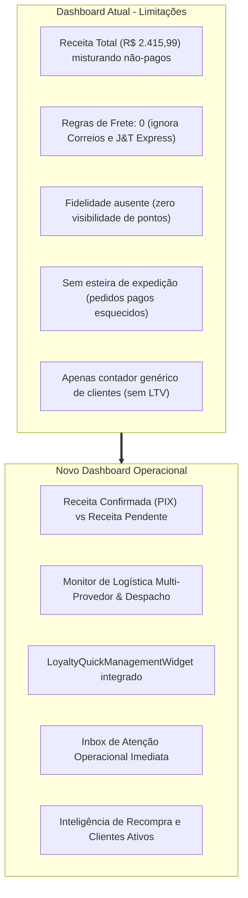
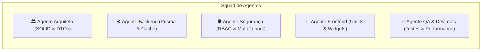
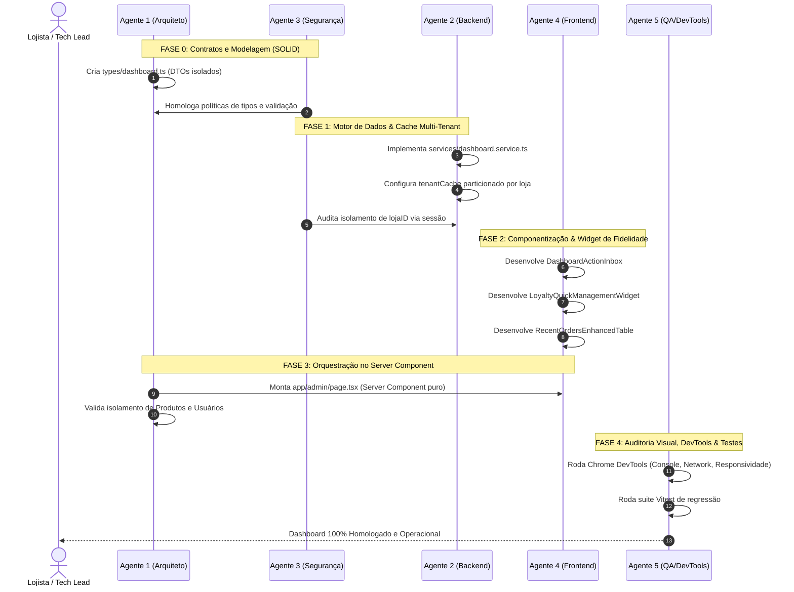

# 🚀 Workflow de Implementação: Reestruturação do Dashboard do Administrador
**Projeto**: Continental Produtos Estéticos Automotivos — Painel Administrativo  
**Versão**: 1.0.0  
**Data**: 14/09/2026  
**Status**: Proposta Arquitetural Aprovada — Aguardando Início da Implementação  

---

## 📋 Sumário Executivo

Este documento estabelece o **Workflow Arquitetural e Operacional** para a reestruturação completa do **Dashboard do Administrador** (`/admin`), alinhando o painel executivo a todas as inovações tecnológicas e subsistemas recentemente integrados à plataforma:
1. **Frete Multi-Provedor**: Correios (SEDEX / PAC), J&T Express (Standard), Tabela Local, Retirada no Balcão (`STORE_PICKUP`) e A Combinar via WhatsApp (`NONE`).
2. **Motor de Fidelidade & Pontos (Loyalty Engine)**: Métricas de saldo, passivo financeiro, resgates e widget de gestão rápida integrado.
3. **Controle Financeiro & PIX**: Receita liquidada vs. pendente, ticket médio e integridade da chave PIX.
4. **Inteligência de Clientes**: LTV, taxa de recompra e clientes fidelizados.
5. **Esteira Logística de Pedidos**: Alertas imediatos de pedidos pagos sem rastreio, status de expedição e atalhos para WhatsApp.

> [!IMPORTANT]
> **Restrição Rígida de Escopo**: Nenhuma alteração será realizada nos painéis ou contratos de dados dos módulos de **Produtos** (`/admin/products`) e **Usuários** (`/admin/users`). Seus indicadores no dashboard permanecem estritamente informativos.

---

## 🔍 1. Diagnóstico do Dashboard Atual

A análise comparativa entre o estado atual do código ([app/admin/page.tsx](file:///c:/Diversos/TI/Trabalhos/2026/Sistemas/Projeto/app/admin/page.tsx)) e as capacidades do ecossistema revelou 5 gargalos críticos:



1. **Distorção de Caixa**: A métrica `Receita Total` soma todos os pedidos não cancelados (incluindo 12 pendentes de pagamento), gerando falsa percepção de liquidez.
2. **Cegueira Logística**: O card `Regras de Frete: 0` monitora apenas a tabela local legada, desconsiderando que a loja possui integração viva com os Correios e matriz de 5.181 tarifas da J&T Express.
3. **Ausência da Fidelidade**: O programa de pontos está em produção, mas o lojista não possui métricas de adoção, passivo em pontos ou atalho gerencial na tela inicial.
4. **Inércia Operacional de Pedidos**: O lojista não visualiza de imediato quais pedidos pagos precisam de código de rastreamento ou quais retiradas no balcão estão aguardando o cliente.

---

## 🏗️ 2. Arquitetura da Informação & Layout Proposto

O novo dashboard é estruturado em **4 Blocos Estratégicos e Priorizados**:

```text
+-------------------------------------------------------------------------------------------------------------------------+
| CONTINENTAL ADMIN   | VISÃO GERAL                                                                                       |
| Painel Lojista      | Dashboard Executivo & Operacional                                                                 |
|                     | Bem-vindo, Vinicius Moia. 521 produtos ativos • 6 clientes cadastrados                            |
+-------------------------------------------------------------------------------------------------------------------------+
|                                                                                                                         |
| [!] INBOX OPERACIONAL DE ATENÇÃO (Ações Imediatas):                                                                     |
|  +-------------------------------+  +--------------------------------+  +--------------------------------------------+  |
|  | 📦 2 PEDIDOS AGUARDANDO ENVIO |  | 🏬 1 RETIRADA NA LOJA PENDENTE |  | 💬 12 PEDIDOS AGUARDANDO PIX (Follow-up)   |  |
|  | Pagos, necessitam rastreio    |  | Aguardando busca do cliente    |  | Contatar via WhatsApp com 1 clique         |  |
|  +-------------------------------+  +--------------------------------+  +--------------------------------------------+  |
|                                                                                                                         |
| KPIS PRINCIPAIS (4 Pilares):                                                                                            |
|  +-------------------------------+  +--------------------------------+  +--------------------------------------------+  |
|  | 💰 RECEITA CONFIRMADA (PIX)   |  | 🛒 FUNIL DE PEDIDOS            |  | 🚚 EXPEDIÇÃO & FRETE                       |  |
|  | R$ 980,00                     |  | 25 Pedidos no Total            |  | R$ 148,50 em fretes cobrados               |  |
|  | • R$ 1.435,99 pendentes       |  | • 3 Pagos (12% conversão)      |  | • Correios/J&T: 70%                        |  |
|  | • Ticket Médio: R$ 326,67     |  | • 12 Pendentes | 10 Cancelados |  | • Retirada/WhatsApp: 30%                   |  |
|  +-------------------------------+  +--------------------------------+  +--------------------------------------------+  |
|  | 🏆 PROGRAMA DE FIDELIDADE     |                                                                                      |
|  | 1.250 pts em circulação       |                                                                                      |
|  | • R$ 62,50 resgatados em desc |                                                                                      |
|  | • 4 carteiras ativas          |                                                                                      |
|  +-------------------------------+                                                                                      |
|                                                                                                                         |
| GESTÃO DE PONTOS & ESTEIRA OPERACIONAL (2 Colunas):                                                                     |
|  +-------------------------------------------------------------+  +---------------------------------------------------+ |
|  | [WIDGET] GERENCIADOR RÁPIDO DE FIDELIDADE                   |  | [WIDGET] DISTRIBUIÇÃO LOGÍSTICA                   | |
|  | [Aba: Métricas] [Aba: Configuração Rápida] [Aba: Ajuste]     |  | SEDEX: 45% | PAC: 25% | J&T: 15% | Balcão: 15%      | |
|  | • Status: ATIVO [Desativar]                                 |  | Tempo médio de expedição: 1.2 dias úteis          | |
|  | • 1 pt a cada R$ 2,00 | Ponto vale R$ 0,05                  |  |                                                   | |
|  +-------------------------------------------------------------+  +---------------------------------------------------+ |
|                                                                                                                         |
| PEDIDOS RECENTES & EXPEDIÇÃO:                                                                              Ver todos -> |
| +-------+------------------------+-------------------------+----------------------+--------------------+--------------+ |
| | #31   | Cliente Teste (Whats)  | 🚚 Correios PAC         | ⚠️ Sem Rastreio      | R$ 49,99           | [ PAGO ]     | |
| | #30   | Vinicius Moia (Whats)  | 🏬 Retirada no Balcão   | - Balcão Loja        | R$ 510,00 (-50pts) | [ PENDENTE ] | |
| | #29   | Vinicius Moia (Whats)  | 💬 A Combinar WhatsApp  | - Aguarda Contato    | R$ 440,00          | [ PENDENTE ] | |
| | #27   | Esdras Freitas (Whats) | 📦 J&T Express Standard | 🟢 JT987654321BR     | R$ 320,00          | [ ENVIADO ]  | |
| +-------+------------------------+-------------------------+----------------------+--------------------+--------------+ |
+-------------------------------------------------------------------------------------------------------------------------+
```

---

## 👥 3. Squad de Agentes Especializados

Para a execução deste projeto, o Tech Lead orquestra 5 agentes autônomos com responsabilidades estritamente delimitadas pelos princípios **SOLID**:



### 1. 🏛️ Agente 1: Arquiteto & Guardião SOLID
* **Princípio S (Single Responsibility)**: Modela DTOs específicos para cada widget (`types/dashboard.ts`), impedindo tráfego de dados supérfluos.
* **Princípio O (Open/Closed)**: Garante que novos provedores de logística ou métricas possam ser agregados sem refatorar a casca do dashboard.
* **Princípio I (Interface Segregation)**: Segrega interfaces por contexto de consumo (`DashboardFinancialDTO`, `DashboardLogisticsDTO`, `DashboardLoyaltyDTO`, `DashboardActionInboxDTO`).
* **Princípio D (Dependency Inversion)**: A camada de visualização depende de abstrações de dados e não de chamadas diretas ao banco.

### 2. ⚙️ Agente 2: Data & Backend Engine
* **Responsabilidade**: Construir `services/dashboard.service.ts` com agregação em lote (`Promise.all`), queries atômicas e particionamento no `tenantCache`.
* **Desempenho**: Redução de requisições N+1 para uma única chamada consolidada no Server Component.

### 3. 🛡️ Agente 3: Segurança & Compliance
* **Responsabilidade**: Impor resolução de autoridade via sessão (`getCurrentUser().lojaID`), validação de payloads via Zod nas mutações de fidelidade e proteção estrita de papéis (`role === 'ADMIN'`).
* **Blindagem**: Prevenção total contra IDOR e vazamento cross-tenant.

### 4. 🎨 Agente 4: UI/UX & Design System
* **Responsabilidade**: Construção dos componentes modulares em `components/admin/dashboard/` utilizando a identidade Dark Mode da Continental (`#DDAF02`, *glass-panel*, bordas translúcidas e badges de status).
* **Interatividade**: Criação do `LoyaltyQuickManagementWidget` para alteração de regras de pontos em tempo real.

### 5. 🧪 Agente 5: QA, DevTools & Performance
* **Responsabilidade**: Validação visual e de rede no navegador via Chrome DevTools, verificação de console livre de erros de hidratação e execução da suite Vitest.

---

## 🛠️ 4. Matriz de Integração dos MCPs e Ferramentas

| MCP / Ferramenta | Agente Responsável | Fase do Workflow | Objetivo Prático |
| :--- | :--- | :--- | :--- |
| **`modern-web-guidance-plugin`** | 🎨 Frontend Specialist | Fase 2 e 3 | Aplicação de padrões modernos de Server Components vs Client Components, evitando JavaScript excessivo no bundle do cliente. |
| **`chrome-devtools-plugin`** / **`browser_subagent`** | 🧪 QA & Reliability | Fase 4 | Abertura do Chrome em headless/recording, verificação de requisições de rede (Network tab), ausência de *layout shifts* e gravação WebP da sessão. |
| **`run_command` (CLI / Vitest)** | ⚙️ Backend & 🛡️ Segurança | Fases 1 e 4 | Execução dos testes automatizados de fidelidade, frete e invariantes monetárias (`npx vitest run`), além de verificação estática de tipos (`npx tsc --noEmit`). |
| **`grep_search` & `view_file`** | 🏛️ Arquiteto | Fase 0 | Mapeamento de campos existentes em `schema.prisma`, `types/freight.ts` e `types/loyalty.types.ts` para reaproveitamento total sem retrabalho. |

---

## 📅 5. Workflow de Execução Passo a Passo



### 📍 FASE 0: Contratos & Modelagem de Dados Segregados
* **Arquivos-Alvo**: `types/dashboard.ts`.
* **Entregas**:
  * Definição de `DashboardFinancialDTO` (receita liquidada, pendente, ticket médio).
  * Definição de `DashboardLogisticsDTO` (envios por transportadora, coletas, frete arrecadado).
  * Definição de `DashboardLoyaltyDTO` (pontos ativos, desconto concedido, settings vigentes).
  * Definição de `DashboardActionInboxDTO` (pedidos sem rastreio, retiradas, follow-ups PIX).

### 📍 FASE 1: Motor de Agregação de Dados & Cache Multi-Tenant
* **Arquivos-Alvo**: `services/dashboard.service.ts`.
* **Entregas**:
  * Função canônica `getAggregatedDashboardMetrics(lojaID: string)`.
  * Execução em batch com `Promise.all` para coletar:
    * `prisma.order.groupBy` por status.
    * Contagem de pedidos com `deliveryType === 'STORE_PICKUP'` e pagos sem `trackingCode`.
    * Agregações de `LoyaltyWallet` e `LoyaltyTransaction`.
    * Configurações de loja (`originCep`, `enableCorreios`, `pixKey`, `loyaltyEnabled`).
  * Armazenamento no `tenantCache` (`ttl: 60000ms`) com invalidação a cada novo pedido.

### 📍 FASE 2: Componentização Modular & Painel de Gerenciamento de Pontos
* **Arquivos-Alvo**: Diretório `components/admin/dashboard/`.
* **Entregas**:
  * `DashboardActionInbox.tsx`: Alertas operacionais com badges de contagem e filtros diretos.
  * `FinancialKpiCard.tsx`: Exibição visual de caixa real vs. receita pendente.
  * `LogisticsKpiCard.tsx`: Monitor de expedição com divisão de provedores de frete.
  * `LoyaltyQuickManagementWidget.tsx`: **O painel completo de gestão de pontos**:
    * Aba 1: Métricas de saldo, passivo e clientes ativos.
    * Aba 2: Formulário rápido para alterar taxas e ligar/desligar o programa.
    * Aba 3: Modal/gaveta de ajuste manual de pontos por cliente para suporte no WhatsApp.
  * `RecentOrdersEnhancedTable.tsx`: Tabela com colunas de transportadora, código de rastreio com status (⚠️ Sem Rastreio vs 🟢 Código) e link direto para WhatsApp.

### 📍 FASE 3: Montagem no Server Component
* **Arquivos-Alvo**: [app/admin/page.tsx](file:///c:/Diversos/TI/Trabalhos/2026/Sistemas/Projeto/app/admin/page.tsx).
* **Entregas**:
  * Transformação de [app/admin/page.tsx](file:///c:/Diversos/TI/Trabalhos/2026/Sistemas/Projeto/app/admin/page.tsx) em um orquestrador limpo.
  * Chamada centralizada a `getAggregatedDashboardMetrics(user.lojaID)`.
  * Distribuição dos DTOs específicos para cada componente via props tipadas.
  * Preservação integral dos links para **Produtos** (521) e **Usuários** (6).

### 📍 FASE 4: Auditoria Visual com Chrome DevTools & Testes Automatizados
* **Ferramentas**: `chrome-devtools-plugin`, `browser_subagent`, `run_command`.
* **Entregas**:
  * Teste E2E da rota `/admin` no navegador Chromium.
  * Inspeção do Network Tab: Verificação de carregamento rápido sem requisições concorrentes duplicadas.
  * Inspeção do Console: Zero avisos de hidratação ou erros React.
  * Execução da bateria de testes (`npx vitest run tests/unit/`) garantindo regressão zero nas regras monetárias e de fidelidade.

---

## 🛡️ 6. Políticas de Segurança e Invariantes Arquiteturais

1. **Isolamento de Tenant**: Nenhuma consulta utiliza `lojaID` vindo de parâmetro de cliente; o identificador é resolvido exclusivamente no servidor a partir da sessão criptografada do usuário autenticado.
2. **Autorização RBAC**: Acesso estrito garantido por validação `role === 'ADMIN'`. Tentativas de acesso não autorizadas resultam em redirecionamento imediato.
3. **Imutabilidade de Escopo**:
   * Arquivos em `app/admin/products/` ➔ **NÃO MODIFICAR**.
   * Arquivos em `app/admin/users/` ➔ **NÃO MODIFICAR**.
4. **Idempotência e Concorrência**: Alterações manuais no saldo de pontos pelo widget utilizam a lógica transacional com bloqueio otimista (`version`) já implementada em [services/loyalty.service.ts](file:///c:/Diversos/TI/Trabalhos/2026/Sistemas/Projeto/services/loyalty.service.ts).

---

## 🎯 7. Critérios de Aceite para Entrega

- [ ] Receita Confirmada e Receita Pendente claramente discriminadas sem sobreposição.
- [ ] Alerta operacional em destaque para pedidos pagos que ainda não possuem código de rastreamento.
- [ ] Presença do `LoyaltyQuickManagementWidget` permitindo visualizar métricas, alterar configurações básicas e conceder pontos manualmente.
- [ ] Exibição das transportadoras reais (Correios, J&T Express, Balcão, WhatsApp) na tabela de pedidos recentes.
- [ ] 0 erros de hidratação no console do navegador e layout 100% responsivo em Dark Mode.
- [ ] 100% de aprovação na suite de testes automatizados existente.

---
*Documento arquivado em: `diversos/PLANEJAMENNTO_DASHBOARD/WORKFLOW_IMPLEMENTACAO_DASHBOARD.md`*
