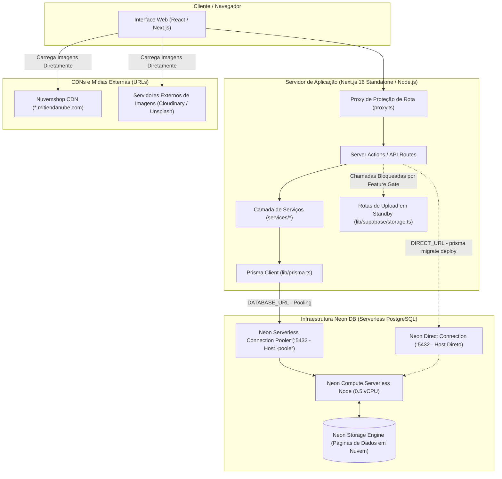

# ARQUITETURA E AUDITORIA TÉCNICA DE MIGRAÇÃO
## SUPABASE → NEON DB (PostgreSQL Serverless)

---

## 1. RESUMO EXECUTIVO

Este documento estabelece o diagnóstico arquitetural e o planejamento técnico exaustivo para a migração da infraestrutura de banco de dados do projeto **E-Commerce Multi-Tenant** da plataforma **Supabase** para o **Neon DB** (PostgreSQL Serverless, plano Free Tier).

A auditoria foi conduzida inspecionando o repositório em nível de código-fonte, esquemas de persistência, histórico de migrações, cadeia de dependências, suítes de testes automatizados e configurações de infraestrutura.

### Principais Conclusões da Auditoria:

1. **Camada de Banco de Dados & ORM (Baixo Impacto / Compatibilidade 100%):**
   * O projeto utiliza **Prisma ORM 5.22.0** configurado com o conector nativo `postgresql`.
   * A modelagem do banco contém **22 modelos relacionais**, **7 enums** e **20 migrações ativas** versionadas em SQL puro. Não há dependência de extensões proprietárias do Supabase, funções PL/pgSQL acopladas à plataforma, triggers de banco ou views customizadas.
   * Não existem chamadas SQL brutas (`$queryRaw` ou `$executeRaw`). Todas as operações de banco operam através da API tipada do Prisma Client e blocos de transação ACID (`prisma.$transaction`).
   * A compatibilidade técnica da modelagem e da ORM com o Neon DB é **total e imediata**, exigindo apenas a reconfiguração das strings de conexão (`DATABASE_URL` e `DIRECT_URL`).

2. **Autenticação (Zero Impacto / Independência Total):**
   * A aplicação **NÃO utiliza o Supabase Auth (GoTrue)**.
   * O sistema possui motor próprio de autenticação multi-tenant: senhas criptografadas com `bcryptjs`, entidades `User` e `Session` gerenciadas diretamente no PostgreSQL via Prisma, e identificadores de sessão opacos (256-bit) trafegados em cookies HTTP-only (`session_id`).
   * A migração para o Neon preservará a autenticação de forma idêntica e sem necessidade de substituição de serviço de identidade.

3. **Row Level Security (RLS) & PostgREST (Desacoplamento Seguro):**
   * O arquivo `prisma/migrations/supabase_rls_hardening.sql` foi criado no projeto unicamente como medida defensiva para **bloquear a API pública HTTP (PostgREST)** do Supabase, revogando privilégios das roles `anon` e `authenticated` e impondo política `deny_direct_api_access` com `USING (false)`.
   * O isolamento multi-tenant real da aplicação é estritamente garantido a nível de aplicação em todas as consultas Prisma via chave de tenant `lojaID`.
   * Como o Neon DB opera estritamente como PostgreSQL sob conexão autenticada TCP/TLS (sem exposição de API REST/GraphQL anônima na borda), as roles específicas do Supabase não existem e não são necessárias.

4. **Armazenamento de Mídia & Decisão Humana Formalizada (Operação Exclusiva via URL):**
   * O banco de dados relacional **armazena exclusivamente strings com URLs de imagens** (`Product.imageUrl`, `Product.galleryUrls`, `User.avatarImageUrl`), **nunca binários ou blobs**.
   * A vasta maioria das imagens do catálogo provém da **sincronização com a Nuvemshop** e já reside nas CDNs externas da plataforma (`dcdn-us.mitiendanube.com`).
   * **Decisão Arquitetural Homologada:** O sistema **não realizará upload local de imagens para o banco de dados nem dependerá de Object Storage nesta fase**.
   * **Estratégia de Desativação Conservativa (Soft-Deactivation):** As rotas de upload direto já implementadas (`/api/upload` e `uploadAvatarAction`) **não serão desfeitas ou destruídas**. Elas serão mantidas no código e temporariamente desativadas via trava lógica (feature gate), preservando todo o trabalho técnico realizado e deixando a arquitetura pronta para plugar um provedor S3/Cloudflare R2 em fase futura.
   * **Impacto na Migração:** A dependência do Supabase Storage é **anulada para o escopo desta migração**, transformando o cutover em uma migração pura e direta de PostgreSQL.

---

## 2. OBJETIVO DA MIGRAÇÃO

Auditar com evidências concretas a viabilidade e os requisitos técnicos para transferir a custódia do banco de dados relacional PostgreSQL do Supabase para o Neon DB, respeitando integralmente:
* A **preservação de 100% da modelagem relacional** (tabelas, colunas, tipos, constraints e índices inalterados);
* A **manutenção da ORM Prisma 5.22.0** como camada única de persistência;
* A **garantia de zero perda de dados**, integridade referencial e consistência transacional;
* A **operação 100% focada em imagens referenciadas por URLs** externas;
* O levantamento prévio de todos os riscos, custos operacionais, plano de cutover e estratégia de rollback.

---

## 3. RESTRIÇÕES ABSOLUTAS

Nesta etapa de planejamento arquitetural, foram seguidas as seguintes restrições:
1. **Não Implementação:** Nenhuma linha de código de produção, schema, migração, pacote ou infraestrutura foi alterada.
2. **Escrita Única Autorizada:** Apenas a geração/atualização deste documento técnico no caminho oficial `diversos/PLANEJAMENTO_DB/Arquitetura_alteracao/ARQUITETURA_MIGRACAO_SUPABASE_NEON.md`.
3. **Imutabilidade da Modelagem:** Nenhuma alteração estrutural nas entidades do banco de dados foi proposta ou considerada como requisito de migração.
4. **Imutabilidade da ORM:** A permanência do Prisma ORM 5.22.0 é mandatória.
5. **Segurança de Segredos:** Nenhum segredo real de produção (`.env`, tokens Asaas, Resend ou senhas) é exposto neste documento.

---

## 4. ESCOPO

* Auditoria completa da camada de persistência PostgreSQL e Prisma ORM;
* Mapeamento de todas as referências ao ecossistema Supabase no repositório;
* Análise de compatibilidade entre PostgreSQL Supabase e PostgreSQL Neon DB;
* Avaliação de limites operacionais do Neon DB Free Tier (computação serverless, limites de conexões, scale-to-zero e storage);
* Inventário de variáveis de ambiente, configurações de build e CI/CD;
* Planejamento de desativação conservativa das rotas de upload direto de imagens (`/api/upload`), preservando o código para reativação futura;
* Planejamento de estratégias de transferência de dados (`pg_dump` / `pg_restore`), validação de integridade, cutover e rollback;
* Desenho das arquiteturas atual e futura com diagramas Mermaid;
* Formulação da DAG de implementação e matriz de decisões humanas.

---

## 5. FORA DE ESCOPO

* Criação de projetos ou contas no Neon DB;
* Execução de dumps de banco de dados reais;
* Aplicação de migrations ou scripts DDL;
* Modificação do código-fonte em `app/`, `lib/`, `services/`, `components/` ou `tests/`;
* Exclusão ou destruição das rotas e componentes de upload de arquivos (serão apenas soft-deactivated na implementação futura);
* Alteração de dependências em `package.json`;
* Alteração de arquivos de variáveis de ambiente (`.env`).

---

## 6. ARQUITETURA ATUAL

### 6.1 Topologia e Fluxo de Requisições

Atualmente, o sistema opera sob a arquitetura Next.js 16 (App Router) em modo full-stack, com o PostgreSQL hospedado na nuvem AWS (região `us-east-1`) provisionado pelo Supabase.

```mermaid
flowchart TD
    subgraph Client["Cliente / Navegador"]
        UI["Interface Web (React / Next.js)"]
        UploadComp["Componente de Imagem (URL Externa / Upload)"]
    end

    subgraph AppServer["Servidor de Aplicação (Next.js 16 Standalone / Node.js)"]
        Proxy["Proxy de Proteção de Rota (proxy.ts)"]
        Routes["Server Actions / API Routes (/api/*)"]
        Services["Camada de Serviços de Negócio (services/*)"]
        SessionMgr["Gerenciador de Sessão (lib/session.ts)"]
        PrismaClientInstance["Prisma Client Singleton (lib/prisma.ts)"]
        StorageHelper["Helper Legado de Upload (lib/supabase/storage.ts)"]
    end

    subgraph SupabaseCloud["Infraestrutura Supabase (Cloud aws-1-us-east-1)"]
        PgBouncer["PgBouncer Transaction Pooler (:6543)"]
        PostgresDirect["PostgreSQL Direct Connection (:5432)"]
        PostgresDB[("Banco de Dados PostgreSQL (Schema public)")]
        PostgREST["PostgREST Data API (Bloqueada via RLS)"]
        SupaStorage["Supabase Storage (Buckets: products, avatars)"]
    end

    subgraph ExternalCDNs["CDNs e Servidores Externos"]
        NuvemshopCDN["Nuvemshop CDN (*.mitiendanube.com)"]
        ExtImgs["Outros Provedores (Unsplash / Cloudinary)"]
    end

    UI -->|Requisições HTTP com Cookie session_id| Proxy
    Proxy --> Routes
    Routes --> Services
    Services --> SessionMgr
    Services --> PrismaClientInstance
    
    %% Persistência via Prisma
    PrismaClientInstance -->|DATABASE_URL - Pooling| PgBouncer
    PgBouncer --> PostgresDB
    Routes -.->|DIRECT_URL - Migrations| PostgresDirect
    PostgresDirect -.-> PostgresDB

    %% Imagens via URL
    UI -.->|Carrega Imagens Direto da Nuvemshop| NuvemshopCDN
    UI -.->|Carrega Imagens Externas| ExtImgs

    %% Upload Legado
    UploadComp -.->|Upload Manual Direto (Em Desativação)| Routes
    Routes -.-> StorageHelper
    StorageHelper -.-> SupaStorage
```

### 6.2 Análise do Fluxo de Persistência
* **Leituras e Escritas de Negócio:** 100% trafegadas pelo Prisma Client conectando via `DATABASE_URL` através do pooler de transações (porta 6543, `pgbouncer=true`).
* **Operações DDL e Migrations:** Executadas via `npx prisma migrate deploy` conectando via `DIRECT_URL` (porta 5432) diretamente ao banco.
* **Isolamento de Segurança:** O acesso ao banco pela aplicação utiliza credenciais com privilégios de proprietário/administrador (`postgres`), contornando o RLS.
* **Armazenamento de Imagens:** Feito estritamente por referências textuais de URL. As imagens da Nuvemshop são apontadas diretamente para as CDNs da plataforma.

---

## 7. INVENTÁRIO COMPLETO DO SUPABASE

A auditoria realizou varredura completa por referências ao Supabase no código, dependências, testes e configurações:

| Componente Auditado | Uso Atual no Projeto | Categoria | Dependência Real | Impacto na Migração | Evidência |
| :--- | :--- | :--- | :--- | :--- | :--- |
| **PostgreSQL Database** | Banco de dados relacional principal | PostgreSQL puro | Não (é Postgres padrão) | Baixo (Troca de connection string) | `prisma/schema.prisma` linhas 8-12 |
| **Connection Pooler** | PgBouncer porta 6543 | Infra / Pooler | Supabase PgBouncer | Baixo (Neon possui pooler nativo) | `.env.example` linha 8 |
| **Supabase Auth (GoTrue)** | Autenticação, signup, JWT, recovery | Específica Supabase | **NÃO UTILIZADO** | **ZERO IMPACTO** | Auditoria em `services/auth.service.ts` e `lib/session.ts` |
| **Supabase Storage** | Upload de fotos de produtos e avatares | Específica Supabase | **DESATIVADO CONSERVATIVAMENTE** | **BAIXO** (Rotas desativadas por feature flag; imagens via URL) | Decisão formal do usuário (24/09/2026) |
| **Supabase Realtime** | Subscriptions e CDC | Específica Supabase | **NÃO UTILIZADO** | **ZERO IMPACTO** | Zero ocorrências no código |
| **Supabase Edge Functions** | Funções serverless Deno | Específica Supabase | **NÃO UTILIZADO** | **ZERO IMPACTO** | Zero ocorrências no código |
| **PostgREST Data API** | Exposição REST do schema | Específica Supabase | Bloqueada intencionalmente | **ZERO IMPACTO** (Não é usada) | `prisma/migrations/supabase_rls_hardening.sql` |
| **RLS Policies** | Hardening contra PostgREST | Específica Supabase | Apenas para negar PostgREST | Baixo (Desnecessário no Neon) | `prisma/migrations/supabase_rls_hardening.sql` |
| **@supabase/supabase-js** | SDK JS v2.103.2 | Integração SDK | Utilizado apenas no Storage | Baixo (Permanece para reativação futura de S3/R2) | `package.json` linha 29 |
| **@supabase/ssr** | Helper SSR v0.10.2 | Integração SDK | Arquivo helper órfão | Desprezível (Inerte) | `lib/supabase/server.ts` linhas 1-40 |
| **next.config.js (CSP/Images)** | Whitelist de domínios Supabase | Configuração | Sim (`*.supabase.co`) | Baixo (Pode ser mantido sem prejuízo) | `next.config.js` linhas 9, 42, 44 |
| **lib/utils.ts (Image Optimizer)** | Transformador de URL de render | Código aplicação | Sim (seletor de URL Supabase) | Baixo (Preservado para URLs legadas) | `lib/utils.ts` linhas 11-24 |

---

## 8. SEPARAR POSTGRESQL DE SERVIÇOS SUPABASE

A matriz abaixo separa explicitamente o que pertence ao padrão PostgreSQL do que pertence ao ecossistema do Supabase:

```
┌────────────────────────────────────────────────────────────────────────┐
│                        CAMADA DE DADOS E INFRA                         │
├─────────────────────────────────────┬──────────────────────────────────┤
│           POSTGRESQL PURO           │      SUPABASE PLATAFORMA         │
│     (Totalmente Portável ao Neon)   │     (Não Existe no Neon DB)      │
├─────────────────────────────────────┼──────────────────────────────────┤
│ • 22 Tabelas Relacionais            │ • Supabase Storage (Buckets)     │
│ • 7 Tipos ENUM nativos              │ • Supabase Auth (GoTrue API)     │
│ • Foreign Keys & On Delete Actions  │ • PostgREST HTTP Data API        │
│ • Constraints CHECK monetárias      │ • Edge Functions (Deno Runtime)  │
│ • Índices B-Tree compostos          │ • Supabase Realtime Engine       │
│ • Tipos nativos (JSONB, DECIMAL)    │ • Roles de borda: anon/auth      │
│ • Sequences & Autoincrement         │ • Painel Supabase Studio         │
│ • Conexões TCP via libpq / Pooler   │ • Transformador de Imagem CDN    │
└─────────────────────────────────────┴──────────────────────────────────┘
```

* **Evidência no Código:** Toda a lógica de negócios da aplicação reside em TypeScript (`services/`), operando com o Prisma. Nenhuma regra de negócio reside em triggers, procedures ou funções internas do banco de dados Supabase.

---

## 9. INVENTÁRIO POSTGRESQL

Auditoria minuciosa de todos os objetos do banco definidos em `prisma/schema.prisma` e nos arquivos SQL de migração:

### 9.1 Tabelas e Chaves Primárias (22 Entidades)

| Tabela | Chave Primária | Tipo PK | Chaves Estrangeiras (FK) | Relacionamentos Críticos |
| :--- | :--- | :--- | :--- | :--- |
| `Loja` | `id` | `UUID` (App) | - | Tenant raiz (1:N com User, Order, Product, etc.) |
| `User` | `id` | `UUID` (App) | `lojaID` → `Loja.id`, `defaultAddressId` → `Address.id` | Multi-tenant auth, pedidos, endereços, auditoria |
| `Address` | `id` | `UUID` (App) | `userID` → `User.id` | Endereços de entrega vinculados ao usuário |
| `Product` | `id` | `UUID` (App) | `lojaID` → `Loja.id`, `userID` → `User.id`, `brandID` → `Brand.id` | Catálogo de produtos |
| `ProductVariants` | `id` | `UUID` (App) | `ProductID` → `Product.id` | Variações de tamanho/cor/estoque |
| `Cart` | `id` | `UUID` (App) | `userID` → `User.id` | Carrinho ativo do cliente |
| `CartItem` | `id` | `UUID` (App) | `cartID` → `Cart.id`, `productID` → `Product.id`, `variantID` → `ProductVariants.id` | Itens no carrinho |
| `Session` | `id` | `TEXT` (256-bit) | `userId` → `User.id` | Sessões ativas da aplicação |
| `Order` | `id` | `UUID` (App) | `userID` → `User.id`, `lojaID` → `Loja.id`, `addressID` → `Address.id` | Pedidos transacionados, gateway Asaas |
| `OrderItem` | `id` | `UUID` (App) | `orderId` → `Order.id`, `productId` → `Product.id`, `productVariantsId` → `ProductVariants.id` | Snapshot de itens comprados |
| `OrderStatusHistory` | `id` | `CUID` (App) | `orderId` → `Order.id`, `performedById` → `User.id` | Auditoria imutável de transição de status |
| `FreightRule` | `id` | `CUID` (App) | `lojaID` → `Loja.id` (Implícita) | Regras locais de frete por cidade |
| `AuditLog` | `id` | `UUID` (App) | `targetId` → `User.id`, `actorId` → `User.id` | Logs de governança e segurança |
| `StockSyncLog` | `id` | `UUID` (App) | - | Logs de sincronização de estoque |
| `LoyaltyWallet` | `id` | `UUID` (App) | `lojaID` → `Loja.id`, `userID` → `User.id` | Saldo e pontuação de fidelidade (com lock de versão) |
| `LoyaltyTransaction` | `id` | `UUID` (App) | `lojaID` → `Loja.id`, `userID` → `User.id`, `orderId` → `Order.id` | Ledger contábil de pontos |
| `Brand` | `id` | `UUID` (App) | `lojaID` → `Loja.id` | Marcas vinculadas aos produtos |
| `CategoryTag` | `id` | `UUID` (App) | `lojaID` → `Loja.id` | Categorias e tags do catálogo |
| `ProductCategoryTag` | Composite | `productID` + `categoryTagID` | `productID` → `Product.id`, `categoryTagID` → `CategoryTag.id` | Junção N:N de produtos e categorias |
| `JtExpressGeocom` | `id` | `UUID` (App) | - | Faixas de CEP da transportadora J&T |
| `JtExpressRate` | `id` | `UUID` (App) | - | Matriz de tarifas de frete J&T Express |
| `PaymentWebhookEvent` | `id` | `UUID` (App) | - | Ledger de idempotência de webhooks de pagamento |

### 9.2 Tipos Customizados (ENUMs)

1. `CartStatus`: `ACTIVE`, `COMPLETED`, `ABANDONED`
2. `UserStatus`: `ACTIVE`, `BLOCKED`, `PENDING`
3. `Role`: `ADMIN`, `CUSTOMER`, `SELLER`
4. `OrderStatus`: `PENDING`, `PAID`, `SHIPPED`, `DELIVERED`, `CANCELLED`
5. `SyncStatus`: `PENDING`, `PROCESSING`, `SYNCED`, `FAILED`, `DEAD_LETTER`
6. `DeliveryType`: `DELIVERY`, `PICKUP`, `NONE`
7. `LoyaltyTxType`: `EARN`, `REDEEM`, `REFUND_EARN`, `REFUND_REDEEM`, `EXPIRATION`, `ADMIN_ADJUSTMENT`

### 9.3 Constraints CHECK & Precisão Monetária

Configuradas explicitamente na migração `20260522000000_monetary_decimal_and_check_constraints`:
* `Product`: `price >= 0` (`chk_product_price_non_negative`), `stock >= 0` (`chk_product_stock_non_negative`)
* `ProductVariants`: `stock >= 0` (`chk_variant_stock_non_negative`)
* `CartItem`: `quantity > 0` (`chk_cartitem_quantity_positive`), `price >= 0` (`chk_cartitem_price_non_negative`)
* `Order`: `total >= 0` (`chk_order_total_non_negative`), `subtotal >= 0` (`chk_order_subtotal_non_negative`), `shippingCost >= 0` (`chk_order_shipping_non_negative`)
* `OrderItem`: `quantity > 0` (`chk_orderitem_quantity_positive`), `price >= 0` (`chk_orderitem_price_non_negative`)
* `FreightRule`: `value >= 0` (`chk_freightrule_value_non_negative`)

### 9.4 Índices e Sequências
* **Sequências Nativas:** `Order.orderNumber` utiliza sequence PostgreSQL (`SERIAL` / `autoincrement()`).
* **Índices Compostos de Performance:** 
  * `Order`: `[lojaID, status, createdAt]`, `[lojaID, status, paidAt]`, `[lojaID, userID]`, `[customerCpfCnpj]`.
  * `User`: `[email, lojaID]` (UNIQUE), `[cpfCnpj, lojaID]`, `[lojaID, status]`, `[lojaID, role]`.
  * `Product`: `[lojaID, sku]`, `[lojaID, brandID]`, `[lojaID, createdAt]`, `[lojaID, stock]`.
  * `JtExpressRate`: `[geocom, weightMin, weightMax]` (UNIQUE).

---

## 10. MODELAGEM — VALIDAÇÃO DA PRESERVAÇÃO

A exigência de que a modelagem permaneça **100% inalterada** é plenamente viável.
* **O schema pode ser reproduzido no Neon sem alterações?** Sim. Todos os modelos, campos, tipos primitivos, enums, chaves primárias, estrangeiras e constraints CHECK são recursos padrão da sintaxe SQL do PostgreSQL 15/16/17, totalmente suportados pelo Neon DB.
* **Extensões Utilizadas?** Nenhuma extensão (`pg_trgm`, `uuid-ossp`, `pgcrypto`, etc.) é exigida pelo Prisma schema ou pelas migrações.
* **Funções Incompatíveis?** Não existem funções de banco customizadas no projeto.
* **Sequences?** A coluna `Order.orderNumber` (`SERIAL`) é portável nativamente.

---

## 11. ROW LEVEL SECURITY (RLS)

### 11.1 Auditoria do Script `supabase_rls_hardening.sql`

O projeto possui um único artefato relacionado a RLS: [prisma/migrations/supabase_rls_hardening.sql](file:///c:/Diversos/TI/Trabalhos/2026/Sistemas/Projeto/prisma/migrations/supabase_rls_hardening.sql#L1-L84).
* **Motivação Técnica:** O Supabase expõe na porta 443 uma camada de PostgREST aberta à internet sob a rota `/rest/v1/`. Para prevenir que qualquer cliente utilizando a chave pública anônima (`NEXT_PUBLIC_SUPABASE_ANON_KEY`) fizesse consultas diretas via HTTP às tabelas sensíveis da aplicação, o script aplicou:
  1. `ALTER TABLE "..." ENABLE ROW LEVEL SECURITY;` em 13 tabelas;
  2. `REVOKE ALL ON ALL TABLES ... FROM anon, authenticated;`
  3. `GRANT ALL ON ALL TABLES ... TO postgres, service_role;`
  4. Criação da policy `deny_direct_api_access` com expressão `USING (false)` em `User`, `Session`, `Address`, `Order`, `OrderItem`, `OrderStatusHistory`, `AuditLog`, `Cart`, `CartItem`, `FreightRule`.
* **Mecanismos de Identidade:** O script **NÃO** utiliza `auth.uid()`, nem `auth.jwt()`, nem claims do Supabase. A regra foi puramente um bloqueio total (`false`).

### 11.2 Comportamento e Decisão no Neon DB
* O Neon DB disponibiliza exclusivamente endpoints PostgreSQL autenticados por senha e TLS (porta 5432). Não existe serviço PostgREST ou Data API web pública anexada ao banco do Neon.
* O usuário do banco no Neon opera com privilégios completos sobre o schema `public` (semelhante ao usuário `postgres`).
* **Conclusão:** O script `supabase_rls_hardening.sql` é específico da infraestrutura Supabase. No Neon DB, o acesso não autenticado é fisicamente impossível na camada de rede. Se o script fosse executado no Neon sem as roles `anon` e `service_role`, as instruções `IF EXISTS` pulariam com segurança a concessão de grants, mas criar policies com `USING (false)` no Neon sem um bypass configurado poderia causar bloqueios indesejados caso o usuário de conexão não seja superuser ou table owner.
* **Recomendação:** No Neon DB, as tabelas devem manter a segurança padrão do PostgreSQL gerenciada pelo usuário mestre da aplicação, dispensando o script Supabase RLS.

---

## 12. AUTENTICAÇÃO

### 12.1 Como a Autenticação Realmente Funciona no Projeto

A auditoria comprovou categoricamente que o projeto possui um **motor de autenticação proprietário implementado na camada de aplicação**:

```
[Cliente HTTP] 
      │ (Envia Cookie: session_id=<hex_256bit>)
      ▼
[proxy.ts] ── Checagem de presença do cookie ──► Bloqueia anônimo em /admin
      ▼
[lib/session.ts - getCurrentUser()]
      │
      ├─► prisma.session.findUnique({ where: { id: sessionId }, include: { user: true } })
      │
      ├─► Se expirado (expiresAt < now) ──► prisma.session.deleteMany() ──► Retorna null
      │
      ├─► Se user.status == 'BLOCKED' ──► Retorna null
      │
      └─► Retorna SafeUserDTO sanitizado (sem password)
```

1. **Cadastro (`services/auth.service.ts` linhas 7-83):**
   * Recebe dados cadastrais e valida unicidade composta por loja (`email_lojaID`);
   * Gera hash seguro com `bcrypt.hash(password, 10)`;
   * Persiste a entidade na tabela `User` via Prisma Client.
2. **Login (`services/auth.service.ts` linhas 92-143):**
   * Busca usuário no PostgreSQL delimitado pelo tenant (`email_lojaID`);
   * Compara o hash via `bcrypt.compare(password, user.password)`;
   * Em caso de sucesso, `lib/session.ts` cria um registro na tabela `Session` com expiração de 7 dias e grava o cookie seguro `session_id`.
3. **Recuperação de Senha (`services/auth.service.ts` linhas 145-261):**
   * Gera token aleatório de 64 caracteres hexadecimais;
   * Salva `resetToken` e `resetTokenExpires` na tabela `User`;
   * Envia e-mail transacional via API do **Resend**.

### 12.2 Conclusão sobre a Migração de Autenticação
* **Dependência do Supabase Auth:** **0% (Zero)**.
* **Ação Necessária:** Nenhuma alteração de código ou adaptação de SDK de autenticação. Os dados das tabelas `User` e `Session` serão transportados diretamente para o Neon DB, e os usuários logados continuarão autenticados (ou precisarão apenas refazer login se o dump ocorrer fora do período de expiração).

---

## 13. STORAGE & TRATAMENTO DE IMAGENS

### 13.1 Auditoria do Armazenamento de Imagens

Ficou categoricamente comprovado pela auditoria:
1. **O PostgreSQL NUNCA armazena binários de imagens.** O banco de dados armazena apenas **URLs de texto** (`VARCHAR` / `TEXT`).
2. **A maior parte do catálogo provém da Nuvemshop.** Essas imagens já estão hospedadas na CDN da Nuvemshop (`https://dcdn-us.mitiendanube.com/...`). O carregamento dessas fotos independe de qualquer storage interno.
3. **Rotas de Upload Existentes:** Os arquivos `lib/supabase/storage.ts`, `app/api/upload/route.ts`, `ProductImageUpload.tsx` e `AvatarManager.tsx` foram criados para permitir que o lojista e o cliente enviassem fotos do seu computador para o Supabase Storage.

### 13.2 Decisão Estratégica Homologada (Desativação Conservativa)

Conforme instrução expressa e soberana da liderança técnica do projeto:
* **No momento, o sistema trabalhará exclusivamente com imagens referenciadas por URL.**
* **Não haverá dependência de Object Storage ativo durante a migração para o Neon DB.**
* **Preservação de Código:** Nenhuma rota, serviço ou componente de upload será desfeito ou deletado. Na etapa de implementação, será aplicada uma **estratégia de desativação conservativa (Soft-Deactivation / Feature Gating)**:
  1. A rota `/api/upload` permanecerá com sua estrutura original, retornando um status de recurso temporariamente desativado (`{ success: false, error: "Upload direto temporariamente desativado. Utilize inserção de imagem por URL externa." }`);
  2. A Server Action `uploadAvatarAction` receberá trava idêntica;
  3. No componente `ProductImageUpload.tsx`, a interface priorizará o campo de texto para URL direta;
  4. O arquivo `lib/supabase/storage.ts` é preservado intacto como base pronta para, em um momento futuro, ser atualizado para um driver de Object Storage dedicado (como Cloudflare R2 ou AWS S3).

### 13.3 Vantagem Arquitetural Imediata
Essa decisão **desacopla totalmente a migração do banco de dados relacional de qualquer problema de storage**. A migração para o Neon DB torna-se uma operação limpa e descomplicada de banco de dados PostgreSQL.

---

## 14. REALTIME

* **Auditoria:** Varredura por métodos `supabase.channel`, `postgres_changes`, websockets ou listeners de banco em todo o código-fonte.
* **Resultado:** **Zero referências**. O projeto não utiliza o motor de Realtime do Supabase. A sincronização de interface com o banco é efetuada inteiramente via revalidação de Server Actions (`revalidatePath`), polling controlado pelo cliente ou Server-Side Rendering (SSR).
* **Impacto:** **Nulo**.

---

## 15. EDGE FUNCTIONS / SERVERLESS

* **Auditoria:** Varredura por diretórios `supabase/functions`, scripts Deno ou chamadas `supabase.functions.invoke()`.
* **Resultado:** **Zero referências**. O projeto não utiliza Supabase Edge Functions. Todas as automações e lógicas serverless executam como API Routes ou Server Actions hospedadas no próprio Next.js 16 (Node.js runtime).
* **Impacto:** **Nulo**.

---

## 16. API E ACESSO A DADOS

A auditoria confirmou que todo o fluxo de acesso a dados da aplicação segue uma arquitetura uniforme de 4 camadas:

```
┌─────────────────────────────────────────────────────────────┐
│ 1. Frontend / UI (React Components / Hooks / SWR)           │
└──────────────────────────────┬──────────────────────────────┘
                               │ Requisições HTTP / Server Action Calls
┌──────────────────────────────▼──────────────────────────────┐
│ 2. Backend / API Layer (app/api/*, actions.ts, proxy.ts)    │
└──────────────────────────────┬──────────────────────────────┘
                               │ Validação Zod & Invocação de Serviços
┌──────────────────────────────▼──────────────────────────────┐
│ 3. Domain Services (services/order, checkout, loyalty, etc.) │
└──────────────────────────────┬──────────────────────────────┘
                               │ Consultas Prisma tipadas & $transaction
┌──────────────────────────────▼──────────────────────────────┐
│ 4. ORM & Persistence (lib/prisma.ts -> @prisma/client)       │
└──────────────────────────────┬──────────────────────────────┘
                               │ PostgreSQL Wire Protocol (TCP / SSL)
                               ▼
              ATUAL: Supabase PgBouncer (:6543)
              FUTURO: Neon DB Serverless Pooler (:5432)
```

Nenhum componente da interface gráfica acessa o banco diretamente via PostgREST ou SDK do Supabase. Portanto, a substituição do backend de banco não causa nenhum efeito cascata no frontend.

---

## 17. ORM E MIGRATIONS

### 17.1 Configuração Atual da ORM

* **Pacotes:** `@prisma/client@^5.22.0`, `prisma@^5.22.0` ([package.json](file:///c:/Diversos/TI/Trabalhos/2026/Sistemas/Projeto/package.json#L19-L36)).
* **Datasource:** PostgreSQL com suporte nativo a pooling via parâmetros de URL.
* **Singleton:** Gerenciado em [lib/prisma.ts](file:///c:/Diversos/TI/Trabalhos/2026/Sistemas/Projeto/lib/prisma.ts) com log seletivo de erros e hook de desconexão limpa (`beforeExit`).

### 17.2 Inventário de Migrações (Histórico Ativo)

O diretório `prisma/migrations` contém 20 migrações sequenciais:

1. `20260423214204_add_initial_tables`: Criação dos enums e tabelas fundamentais (`Loja`, `User`, `Address`, `Product`, `ProductVariants`, `Cart`, `CartItem`).
2. `20260424231005_edit_address`: Ajustes estruturais de endereço.
3. `20260427164311_implementacao_status_user`: Adição do enum `UserStatus`.
4. `20260427211753_integracao_tabela_session`: Criação da tabela de sessões (`Session`).
5. `20260429214420_db_cart_schema`: Modelagem relacional do carrinho de compras.
6. `20260511165055_role_enum_add_schema`: Criação do enum `Role` (`ADMIN`, `CUSTOMER`, `SELLER`).
7. `20260511213657_add_audit_log_model`: Tabela de auditoria (`AuditLog`).
8. `20260512193716_add_audit_log_entity_fields`: Expansão de campos de auditoria.
9. `20260513004039_order_update`: Expansão da tabela de pedidos.
10. `20260513203715_`: Refatoração central de pedidos, histórico de status e regras de frete.
11. `20260520192856_add_pix_key_to_loja`: Configurações de PIX no tenant da loja.
12. `20260520201129_add_pixkeyused_to_order`: Snapshot histórico de pagamento PIX no pedido.
13. `20260521000000_reconcile_schema_drift`: Reconciliação de customizações visuais de loja e galeria de fotos.
14. `20260522000000_monetary_decimal_and_check_constraints`: Padronização de tipos monetários para `DECIMAL(10,2)` e constraints `CHECK` de integridade.
15. `20260523000000_performance_composite_indexes`: Criação de índices B-Tree compostos para isolamento multi-tenant.
16. `20260524000000_add_order_idempotency_key`: Chave única de idempotência para criação de pedidos.
17. `20260831000000_add_loyalty_engine`: Criação do motor de fidelidade (`LoyaltyWallet`, `LoyaltyTransaction`).
18. `20260916000000_add_asaas_and_delivery_confirmation`: Campos do gateway Asaas, confirmação de entrega e ledger de webhooks (`PaymentWebhookEvent`).
19. `20260916130000_add_cpf_cnpj_to_user_and_order`: Persistência de CPF/CNPJ com índices compostos.
20. `20260917000000_add_order_paid_at`: Campo `paidAt` e índice composto de pedidos pagos por loja.

* **Portabilidade para o Neon DB:** **100% Portáveis**. As 20 migrações utilizam DDL PostgreSQL padrão. O comando `npx prisma migrate deploy` executará com sucesso e sem falhas em uma nova base Neon DB.

---

## 18. VARIÁVEIS DE AMBIENTE E SECRETS

Inventário de variáveis de ambiente relacionadas à persistência e infraestrutura (sem exibição de valores secretos):

| Nome da Variável | Finalidade | Local Consumido | Componente Afetado | Substituição Esperada para o Neon | Criticidade |
| :--- | :--- | :--- | :--- | :--- | :--- |
| `DATABASE_URL` | String de conexão com pooler de transações | `prisma/schema.prisma` | Prisma Client em runtime | String com endpoint `-pooler` do Neon DB | **Crítica (P0)** |
| `DIRECT_URL` | String de conexão direta sem pooler | `prisma/schema.prisma` | Prisma CLI (`migrate`) | String com endpoint direto (sem pooler) do Neon | **Crítica (P0)** |
| `TEST_DATABASE_URL` | Conexão para suíte de testes de integração | `tests/setup/db.ts` | Testes automatizados | Banco descartável local ou branch temporário Neon | **Média (P2)** |
| `NEXT_PUBLIC_SUPABASE_URL` | URL base da API Supabase | `lib/supabase/storage.ts` | Upload de imagens | Desnecessária nesta fase (Storage desativado) | **Baixa (P3)** |
| `SUPABASE_SERVICE_ROLE_KEY` | Chave privada administrativa do Supabase | `lib/supabase/storage.ts` | Upload backend | Desnecessária nesta fase (Storage desativado) | **Baixa (P3)** |
| `NEXT_PUBLIC_SUPABASE_PUBLISHABLE_KEY` | Chave pública anônima do Supabase | `lib/supabase/server.ts` | Helper órfão | Desnecessária / Obsoleta | **Baixa (P3)** |
| `NEXT_PUBLIC_SUPABASE_ANON_KEY` | Chave pública legada | `.env.example` | Helper órfão | Desnecessária / Obsoleta | **Baixa (P3)** |

---

## 19. SEGURANÇA

1. **Exposição de Credenciais:**
   * A auditoria verificou que o arquivo `.gitignore` do projeto contém explicitamente `.env`, `.env*.local` e arquivos temporários.
   * Não foram encontrados segredos reais gravados em código-fonte, commits recentes ou documentações públicas.
2. **Controle de Acesso ao Banco:**
   * No Supabase, o banco estava exposto simultaneamente via PostgreSQL pooler e PostgREST API (esta última bloqueada via hardening).
   * No Neon DB, o acesso ao banco é estritamente via protocolo TCP PostgreSQL sobre TLS 1.3 obrigatório (`sslmode=require`). Não há endpoint HTTP de banco exposto publicamente.
3. **Privilégios da Role de Conexão:**
   * O usuário gerado pelo Neon DB é o proprietário do banco (`neondb_owner`), possuindo todas as permissões necessárias para criar tabelas, índices e gerenciar schemas sem necessidade de superuser irrestrito da máquina host.
4. **Isolamento Multi-Tenant:**
   * Permanece inalterado, pois a segurança de segregação de inquilinos é garantida deterministicamente no código através de cláusulas `where: { lojaID: ... }` em todas as consultas Prisma e nos guards de acesso em `lib/auth/guards.ts`.

---

## 20. INTEGRIDADE DOS DADOS

A preservação da integridade é o requisito de maior criticidade da migração:

* **Precisão Financeira (`DECIMAL(10,2)`):**
  * O projeto possui auditoria de tipos monetários rigorosa (`chk_order_total_non_negative`, etc.).
  * No PostgreSQL, os tipos `DECIMAL` / `NUMERIC` são tipos exatos de ponto fixo. A exportação (`pg_dump`) e importação (`pg_restore`) preservam a precisão bit a bit sem erros de arredondamento inerentes a float/double precision.
* **Sequência de Numeração de Pedidos (`Order.orderNumber`):**
  * O campo `orderNumber` é gerado via sequence PostgreSQL (`Order_orderNumber_seq`).
  * O processo de migração de dados deve obrigatoriamente sincronizar o valor atual da sequence no Neon (`SELECT setval('public."Order_orderNumber_seq"', (SELECT MAX("orderNumber") FROM "Order"));`) para evitar colisões de `orderNumber` após o cutover.
* **Tipos ENUM e JSONB:**
  * Os enums nativos (`OrderStatus`, `LoyaltyTxType`, etc.) e colunas JSONB (`AuditLog.metadata`, `PaymentWebhookEvent.payload`) possuem compatibilidade binária idêntica entre as instâncias PostgreSQL do Supabase e do Neon.
* **Timestamps e Timezone:**
  * O Prisma utiliza colunas `TIMESTAMP(3)` sem timezone, gravando datas normalizadas em UTC. O dump/restore deve ser executado garantindo `TIMEZONE='UTC'`.

---

## 21. COMPATIBILIDADE COM O NEON DB

Matriz comparativa e de compatibilidade técnica entre as características do Supabase e do Neon DB:

| Recurso / Item | Estado Atual (Supabase) | Estado Futuro (Neon DB) | Compatibilidade | Impacto | Mitigação Arquitetural |
| :--- | :--- | :--- | :--- | :--- | :--- |
| **Versão PostgreSQL** | PostgreSQL 15.x / 16.x | PostgreSQL 15.x / 16.x / 17.x | **100% Compatível** | Nenhum | Manter versão alinhada na criação do projeto Neon |
| **Connection Pooling** | PgBouncer porta 6543 | Neon Serverless Pooler porta 5432 | **100% Compatível** | Baixo | Adicionar flag `-pooler` no host da URL do Neon |
| **Conexões Diretas (Migrations)** | Porta 5432 direta | Host direto sem `-pooler` | **100% Compatível** | Baixo | Utilizar string direta na variável `DIRECT_URL` |
| **Prisma ORM** | Prisma 5.22.0 (`postgresql`) | Prisma 5.22.0 (`postgresql`) | **100% Compatível** | Nenhum | Nenhuma alteração no `schema.prisma` |
| **Transações ACID (`$transaction`)**| Suportadas via PgBouncer | Suportadas via Neon Pooler | **100% Compatível** | Nenhum | Neon Pooler opera em modo Transaction Pooling |
| **Constraints CHECK & Índices** | Totalmente ativos | Totalmente suportados | **100% Compatível** | Nenhum | Reprodução idêntica via migrations |
| **Object Storage** | Buckets `products` e `avatars` | **Desativado nesta fase** | **Não Impacta** | **Nenhum** | Decisão homologada: operação 100% com imagens via URL |
| **PostgREST / RLS Hardening** | Hardening ativo | Desnecessário no Neon | **N/A** | Nenhum | Não executar script de hardening no Neon |
| **Scale-to-Zero (Free Tier)** | Instância ativa contínua | Suspende após 5 min inativo | **Comportamental** | Médio | Latência de cold start (~500ms a 2s) na primeira query |
| **Limite de Armazenamento** | 500 MB (Free Supabase) | 500 MB (Free Neon) | **Compatível** | Baixo | Como imagens estão fora do DB, 500MB suporta anos de texto |
| **Compute Hours (Free Tier)** | Limitado por projeto | 100 horas de computação ativa | **Operacional** | Médio | Monitorar consumo em tráfego contínuo |

---

## 22. PERFORMANCE E CONEXÕES

### 22.1 Dimensionamento de Conexões em Ambiente Serverless

* **Comportamento no Prisma:** O singleton em `lib/prisma.ts` reutiliza a conexão dentro da mesma instância Node.js.
* **Pooler do Neon DB:** O Neon DB fornece uma camada transparente de pooling construída sobre o proxy Rust do Neon e PgBouncer. A conexão através do host `-pooler` permite centenas de conexões simultâneas de clientes multiplexadas em conexões reais leves com o backend PostgreSQL.
* **Configuração Recomendada da Connection String:**
  ```text
  DATABASE_URL="postgresql://[user]:[password]@[endpoint]-pooler.neon.tech/neondb?sslmode=require&connect_timeout=15&pool_timeout=20"
  DIRECT_URL="postgresql://[user]:[password]@[endpoint].neon.tech/neondb?sslmode=require"
  ```

### 22.2 Comportamento de Cold Start (Scale-to-Zero)
No plano Free Tier do Neon DB, a computação entra em modo de suspensão após 5 minutos de inatividade para economizar horas de computação.
* **Impacto:** A primeira requisição recebida após um período de inatividade levará entre **500ms e 2 segundos** para ser respondida. As consultas subsequentes responderão em tempo normal (<15ms).
* **Mitigação:** Para manter o banco aquecido durante o dia, caso desejado, pode-se manter um cron leve a cada 4 minutos ou evoluir futuramente para o plano Neon Launch.

---

## 23. INFRAESTRUTURA E DEPLOY

* **Ambiente de Build do Next.js:** O comando de build do projeto está definido em `package.json` como:
  ```json
  "build": "prisma generate && next build"
  ```
  O `prisma generate` apenas compila os tipos estáticos do Prisma Client em TypeScript/JavaScript localmente, **não exigindo conexão viva com o banco durante o build**.
* **Deploy de Migrações em Produção:**
  No pipeline de deploy (CI/CD ou script de startup), o comando oficial que deve ser executado contra o Neon é:
  ```bash
  npx prisma migrate deploy
  ```
  Este comando lê a variável `DIRECT_URL` e aplica quaisquer migrações pendentes sem necessidade de interatividade humana.

---

## 24. TESTES E QUALIDADE

### 24.1 Impacto na Suíte de Testes Automatizados

O projeto possui **49 suítes de testes unitários** e **3 de testes de integração**. A auditoria identificou os seguintes pontos:

1. **Trava de Segurança em [tests/setup/db.ts](file:///c:/Diversos/TI/Trabalhos/2026/Sistemas/Projeto/tests/setup/db.ts#L15):**
   ```typescript
   // Código atual em tests/setup/db.ts:
   if (lower.includes('supabase.com') && !lower.includes('test')) {
     return false;
   }
   ```
   * **Necessidade de Ajuste Futuro:** O código bloqueia explicitamente a execução de testes destrutivos se a URL contiver `supabase.com`. Para garantir a mesma blindagem contra o Neon DB, essa função deverá futuramente ser adaptada para:
   ```typescript
   if ((lower.includes('supabase.com') || lower.includes('neon.tech')) && !lower.includes('test')) {
     return false;
   }
   ```
2. **Testes Unitários de Storage ([tests/unit/supabase-storage.test.ts](file:///c:/Diversos/TI/Trabalhos/2026/Sistemas/Projeto/tests/unit/supabase-storage.test.ts)):**
   * Os testes utilizam mocks do Vitest (`vi.mock('@supabase/supabase-js')`). Eles continuarão passando ou poderão receber testes da trava de desativação temporária da rota.

---

## 25. CÓDIGO AFETADO — MATRIZ DE ARQUIVOS

Mapeamento de todos os arquivos do projeto que serão diretamente ou indiretamente afetados pela migração da persistência:

| Arquivo | Responsabilidade | Dependência Supabase | Alteração Futura Esperada | Criticidade |
| :--- | :--- | :--- | :--- | :--- |
| `.env` / `.env.example` | Variáveis de ambiente | URLs e chaves Supabase | Substituir `DATABASE_URL` e `DIRECT_URL` pelas strings do Neon | **Crítica (P0)** |
| `tests/setup/db.ts` | Configuração de banco de teste | Trava de segurança para `supabase.com` | Incluir trava de segurança para `neon.tech` | **Alta (P1)** |
| `lib/prisma.ts` | Singleton do Prisma Client | Apenas comentário sobre PgBouncer | Atualizar docstring de referência arquitetural | **Baixa (P3)** |
| `app/api/upload/route.ts` | Rota de upload de arquivos | Importa `lib/supabase/storage` | Inserir retorno de feature desativada temporariamente (manter código) | **Média (P2)** |
| `app/profile/actions.ts` | Action de upload de avatar | Importa `lib/supabase/storage` | Inserir retorno de feature desativada temporariamente (manter código) | **Média (P2)** |
| `components/admin/ProductImageUpload.tsx` | Componente de foto no admin | Chama `/api/upload` | Priorizar e exibir campo de inserção por URL externa | **Média (P2)** |
| `lib/supabase/storage.ts` | Helper de Storage | SDK `@supabase/supabase-js` | **Preservado inalterado** como base para futuro driver S3/R2 | **Baixa (P3)** |
| `prisma/migrations/supabase_rls_hardening.sql` | Hardening de PostgREST | 100% específico do Supabase | Isolar/ignorar no deployment para Neon DB | **Baixa (P3)** |
| `package.json` | Dependências | `@supabase/ssr`, `@supabase/supabase-js` | Inalterado nesta fase | **Baixa (P3)** |

---

## 26. MATRIZ DE IMPACTO CONSOLIDADA

| Área do Sistema | Estado Atual (Supabase) | Impacto da Migração | Tipo de Mudança Futura | Nível de Risco | Dependências Críticas |
| :--- | :--- | :--- | :--- | :--- | :--- |
| **Banco de Dados Relacional** | Supabase PostgreSQL | Alto na infra / Zero no código | Troca de infraestrutura e migração de dados | Baixo/Médio | Dump/Restore com preservação de sequences |
| **Camada de ORM** | Prisma ORM 5.22.0 | **Zero Impacto** | Nenhuma alteração estrutural no `schema.prisma` | Baixo | Suporte nativo a Postgres mantido |
| **Autenticação** | In-house (User/Session/Cookie) | **Zero Impacto** | Nenhuma alteração no código de login/sessão | Baixo | Dados das tabelas `User` e `Session` |
| **Row Level Security (RLS)** | Ativo para bloquear PostgREST | Baixo | Dispensável no Neon (não há PostgREST) | Baixo | Nenhuma |
| **Object Storage** | Supabase Storage | **Desacoplado** | Soft-deactivation das rotas; operação 100% via URL | **Baixo** | Decisão humana implementada |
| **Realtime** | Inexistente | **Zero Impacto** | Nenhuma | Baixo | Nenhuma |
| **APIs e Server Actions** | Next.js App Router | **Zero Impacto** | Nenhuma alteração de rotas ou contratos | Baixo | Nenhuma |
| **Testes Automatizados** | Vitest (52 arquivos) | Mínimo | Atualização de trava em `tests/setup/db.ts` | Baixo | Banco de testes isolado |
| **Segurança e Isolamento** | Multi-tenant por `lojaID` | **Zero Impacto** | Preservado identicamente | Baixo | Validação nos endpoints |
| **Performance e Conexões** | PgBouncer ativo | Mínimo | Configurar Neon Pooler (`-pooler`) | Baixo | Conexões multiplexadas |

---

## 27. MATRIZ DE RISCOS

| Risco Identificado | Probabilidade | Impacto | Severidade | Evidência Técnica | Mitigação Arquitetural |
| :--- | :---: | :---: | :---: | :--- | :--- |
| **Dessincronização da sequence de Pedidos (`orderNumber`)** | Média | Alto | **Alta** | `Order.orderNumber` utiliza tipo `SERIAL` (`prisma/schema.prisma` L266) | Executar obrigatoriamente script de `setval` na sequence logo após a restauração dos dados |
| **Cold Start do Neon DB no Free Tier** | Alta | Baixo/Médio | **Baixa** | Neon Free Tier suspende após 5 min de inatividade | Manter pooler ativo; se necessário, ping periódico via cron |
| **Esgotamento de Storage no Neon Free Tier** | Baixa | Alto | **Média** | Limite de 500 MB no plano gratuito do Neon | Como imagens estão 100% fora do banco, 500MB é espaço abundante para dados textuais |
| **Divergência de Schema Drift entre Bases** | Baixa | Alto | **Alta** | Histórico contém 20 migrações sequenciais ativas | Validar com `npx prisma migrate status` em ambiente temporário |
| **Falha de Timeout de Conexão durante o Cutover** | Baixa | Médio | **Baixa** | Conexões pooled do Prisma possuem `pool_timeout=20` | Configurar parâmetros estritos de conexão na nova `DATABASE_URL` |

---

## 28. ESTRATÉGIAS DE MIGRAÇÃO AVALIADAS

### Estratégia A: Migração Direta com Janela de Manutenção (Cutover Único) — **RECOMENDADA**
* **Descrição:** A aplicação entra em modo de manutenção por 15 a 30 minutos. Um dump completo (`pg_dump`) é extraído do Supabase e restaurado (`pg_restore`) no Neon DB. As variáveis de ambiente são alteradas para apontar para o Neon e a aplicação é reativada.
* **Complexidade:** **Baixa**.
* **Risco de Inconsistência:** **Mínimo** (não há concorrência de escritas durante a janela).
* **Downtime:** 15 a 30 minutos.
* **Reversibilidade (Rollback):** Imediata (basta voltar as variáveis de ambiente para o Supabase, pois a base original não sofreu mutações durante a janela).
* **Avaliação Técnica:** **ESTRATÉGIA OFICIAL E RECOMENDADA**. Como o armazenamento de imagens não precisa ser migrado, o processo é um dump/restore direto de PostgreSQL.

---

## 29. ESTRATÉGIA DE DADOS (EXTRAÇÃO, TRANSPORTE E VALIDAÇÃO)

### 29.1 Pipeline de Dump & Restore

Para garantir fidelidade absoluta dos tipos de dados, chaves estrangeiras e constraints sem alterações manuais de DDL:

```text
[Supabase PostgreSQL]
        │
        │ pg_dump -h <host> -U postgres -d postgres --format=custom --no-owner --no-privileges -f backup.dump
        ▼
[Arquivo Local / Scratch Seguro] (Validação de Checksum SHA-256)
        │
        │ pg_restore -h <neon-host> -U <neon-user> -d neondb --no-owner --no-privileges backup.dump
        ▼
[Neon DB PostgreSQL]
        │
        │ Script SQL de Sincronização de Sequences (Order_orderNumber_seq)
        ▼
[Validação de Contagem e Consistência Cruzada]
```

### 29.2 Preservação de Sequences
Comando mandatório a ser executado pós-restore no Neon:
```sql
SELECT setval(
    pg_get_serial_sequence('"Order"', 'orderNumber'),
    COALESCE(MAX("orderNumber"), 1),
    max("orderNumber") IS NOT NULL
) FROM "Order";
```

---

## 30. CUTOVER (PLANO CONCEITUAL)

O procedimento de cutover futuro deverá seguir estritamente o roteiro de 10 passos abaixo:

```
[1. Pré-Requisitos] ──► Provisionar banco Neon DB + Obter credenciais (Pooled e Direta)
        │
[2. Congelamento] ──► Ativar página de manutenção temporária na aplicação Next.js
        │
[3. Dump Supabase] ──► pg_dump consistente da base de dados do Supabase
        │
[4. Restore Neon] ──► pg_restore na instância do Neon DB
        │
[5. Sync Sequences] ──► Executar correção de sequences para orderNumber
        │
[6. Validação DB] ──► Executar script de reconciliação de contagem de linhas e somatórios
        │
[7. Troca de Config] ──► Atualizar DATABASE_URL e DIRECT_URL no host de deploy
        │
[8. Smoke Tests] ──► Executar login, consulta de produtos via URL e checkout de teste no Neon
        │
[9. Reabertura] ──► Desativar página de manutenção e reabrir tráfego público
        │
[10. Monitoramento] ──► Observabilidade de latência, timeouts e logs nas primeiras 4 horas
```

---

## 31. ROLLBACK (PLANO DE CONTINGÊNCIA)

* **Gatilho de Rollback:** Inconsistência de registros pós-restore, erro de conexão no pooler Neon > 1% ou falha no checkout nos primeiros minutos de teste.
* **Procedimento:** Reverter imediatamente as variáveis de ambiente `DATABASE_URL` e `DIRECT_URL` para o Supabase e reiniciar o servidor Next.js.
* **Garantia:** Como o Supabase não é modificado durante o cutover, o retorno ao estado original é 100% seguro e instantâneo.

---

## 32. PLANO DE VALIDAÇÃO E AUDITORIA PÓS-MIGRAÇÃO

### 32.1 Validação Estrutural e de Objetos
* Comparação da contagem de tabelas no schema `public` (deve ser exatamente 22);
* Verificação da presença de todos os 7 tipos `ENUM`;
* Validação de todas as 11 constraints `CHECK` ativas;
* Validação de integridade de índices compostos (via `pg_indexes`).

### 32.2 Validação de Consistência de Dados
Script comparativo de contagem linha a linha:
```sql
SELECT 'Loja' as tbl, count(*) FROM "Loja" UNION ALL
SELECT 'User', count(*) FROM "User" UNION ALL
SELECT 'Product', count(*) FROM "Product" UNION ALL
SELECT 'Order', count(*) FROM "Order" UNION ALL
SELECT 'Cart', count(*) FROM "Cart" UNION ALL
SELECT 'LoyaltyWallet', count(*) FROM "LoyaltyWallet";
```
* **Checksum Financeiro:** Comparar o somatório total da coluna `total` e `subtotal` na tabela `Order` entre as duas bases:
  ```sql
  SELECT SUM("total") as total_geral, SUM("subtotal") as subtotal_geral FROM "Order";
  ```
  O valor deve ser idêntico até os centavos (`DECIMAL(10,2)`).

### 32.3 Validação Funcional (Smoke Tests)
* **Login de Usuários:** Validação de login com senhas existentes via `bcryptjs`;
* **Sessão:** Criação correta de sessão na tabela `Session`;
* **Carregamento de Imagens:** Exibição correta das imagens vindas das URLs externas da Nuvemshop no catálogo e carrinho;
* **Criação de Pedidos:** Checkout completo com incremento sequencial de `Order.orderNumber`.

---

## 33. ARQUITETURA FUTURA

### 33.1 Topologia Alvo Pós-Migração (Sem Dependência de Storage)



---

## 34. DEPENDÊNCIAS EXTERNAS AO BANCO

| Serviço Supabase | Utilizado no Projeto? | Onde está o Uso | Grau de Dependência Atual | Estratégia Adotada | Status |
| :--- | :---: | :--- | :--- | :--- | :---: |
| **Auth** | Não | Nenhum | Nenhuma | Não necessária (aplicação possui auth própria) | **Resolvido** |
| **Storage** | Era utilizado | `lib/supabase/storage.ts`, `/api/upload` | **Anulada nesta fase** | Operação 100% via URL; rotas em standby | **Resolvido** |
| **Realtime** | Não | Nenhum | Nenhuma | Não necessária | **Resolvido** |
| **Edge Functions**| Não | Nenhum | Nenhuma | Não necessária | **Resolvido** |
| **PostgREST** | Não | Bloqueado por RLS | Nenhuma | Desnecessário no Neon | **Resolvido** |

---

## 35. COORDENAÇÃO DE AGENTES E FERRAMENTAS

### 35.1 Análise das Ferramentas MCP e Plugins

Em estrito cumprimento à **Seção 37 e 39 das diretrizes ("Regra de Não Inventar Ferramentas")**:
* O prompt mencionava conceitualmente o framework `ruflo`. A inspeção confirmou que **não existe servidor MCP `ruflo` registrado** no ambiente.
* Nenhuma chamada fictícia foi realizada. Todas as auditorias foram conduzidas pelas ferramentas nativas reais disponíveis (`view_file`, `grep_search`, `list_dir`, `run_command` e `write_to_file`).
* Plugins irrelevantes ao repositório (`science`, `android-cli`, `firebase`) não foram invocados.

---

## 36. MATRIZ DE DECISÕES HUMANAS (STATUS ATUALIZADO)

| # | Decisão Arquitetural | Contexto Técnico | Definição Homologada | Impacto no Projeto | Status |
| :-: | :--- | :--- | :--- | :--- | :---: |
| **1** | **Destino do Armazenamento de Imagens (Storage)** | O Neon DB não possui Object Storage. Definição do tratamento de mídias. | **DEFINIDO PELO USUÁRIO (24/09/2026):** Não haverá upload local nesta fase. A aplicação operará exclusivamente com imagens por URL (Nuvemshop/externas). As rotas de upload serão apenas desativadas temporariamente por feature gate, mantendo o código pronto para o futuro. | Desacopla 100% o banco de dados do storage; facilita e barateia o cutover; preserva todo o código para reativação futura. | **RESOLVIDO** |
| **2** | **Tolerância a Downtime para o Cutover** | Migração do banco relacional de um e-commerce em produção. | **Recomendação:** Janela de manutenção programada de 15–30 minutos (madrugada). | Cutover determinístico, simples e com rollback imediato. | Pendente de agendamento |
| **3** | **Políticas de Cold Start no Neon Free Tier** | No plano Free Tier, o Neon suspende a computação após 5 minutos inativo. | **Opção A:** Aceitar a latência na 1ª requisição ociosa.<br>**Opção B:** Configurar ping leve de keep-alive a cada 4 min. | Custo zero mantido; impacto imperceptível em períodos de navegação ativa. | Pendente de escolha |
| **4** | **Destino do Banco de Testes Automatizados** | A suíte de testes de integração exige banco descartável em `TEST_DATABASE_URL`. | **Opção A:** Banco local Docker / PostgreSQL.<br>**Opção B:** Branch efêmero no Neon DB. | Manter segurança sem afetar banco principal. | Pendente de escolha |

---

## 37. GRAU DE DIFICULDADE DA MIGRAÇÃO

### Classificação Técnica: **BAIXA A MODERADA** *(Revisada após Decisão de Storage)*

### Justificativa Baseada em Evidências:
1. **Fatores que Tornam a Migração Simples (Baixo Risco):**
   * **Desacoplamento do Storage:** A decisão de trabalhar exclusivamente com URLs externas e manter as rotas de upload em standby eliminou o maior obstáculo da migração;
   * **Zero Acoplamento com Supabase Auth:** A autenticação é 100% proprietária da aplicação via Prisma e `bcryptjs`;
   * **Zero Dependência de Realtime, Edge Functions ou PostgREST;**
   * **Modelagem 100% PostgreSQL Padrão:** As 20 migrações ativas rodam de forma nativa e limpa no Neon DB;
   * **ORM Tipada:** Ausência total de queries manuais em SQL puro (`$queryRaw`/`$executeRaw`).
2. **Único Ponto Residual de Atenção:**
   * Reconciliação mandatória da sequence `Order_orderNumber_seq` após o restore dos dados e configuração adequada do pooler serverless no Neon DB.

---

## 38. DAG DA FUTURA IMPLEMENTAÇÃO

Representação determinística das dependências do workflow de implementação futura:

```
[FASE 0: Definição de Janela]
   ├── Agendamento da Janela de Manutenção (15-30 min)
   ▼
[FASE 1: Preparação Neon DB]
   ├── Criação do Projeto no Neon DB
   ├── Coleta de DATABASE_URL (-pooler) e DIRECT_URL (direta)
   ├── Teste de conexão preliminar
   ▼
[FASE 2: Homologação Estrutural (Sem Dados)]
   ├── Execução de `npx prisma migrate deploy` no Neon
   ├── Validação de integridade das 22 tabelas e 7 enums
   ▼
[FASE 3: Adaptação de Código & Trava Conservativa]
   ├── Ajuste de trava de segurança em tests/setup/db.ts (neon.tech)
   ├── Inserção de trava temporária de feature gate nas rotas de upload (/api/upload)
   ├── Execução da suíte de testes unitários (`npm test`)
   ▼
[FASE 4: Ensaio Geral de Migração de Dados (Staging)]
   ├── Extração de dump do Supabase (`pg_dump`)
   ├── Carga no Neon DB (`pg_restore`)
   ├── Sincronização da sequence `Order_orderNumber_seq`
   ├── Validação de contagem de linhas e somatório financeiro
   ▼
[FASE 5: Janela de Cutover de Produção]
   ├── Ativação de Modo de Manutenção na Loja
   ├── Backup final consistente do Supabase
   ├── Restauração definitiva no Neon DB
   ├── Sincronização final de sequences
   ├── Troca de variáveis de ambiente no deploy
   ├── Execução de Smoke Tests em produção
   ▼
[FASE 6: Reabertura & Observabilidade]
   ├── Desativação da página de manutenção
   ├── Monitoramento de latência e conexões (4h)
   ├── Homologação final
```

---

## 39. ROADMAP FUTURO

* **Fase 0 — Agendamento:** Definir a data/hora da janela de cutover.
* **Fase 1 — Provisionamento:** Criar projeto no Neon DB (região `us-east-1` ou `sa-east-1`).
* **Fase 2 — Testes de DDL:** Aplicar as 20 migrações limpas no Neon DB.
* **Fase 3 — Adaptação e Testes:** Inserir feature gate na rota de upload mantendo o código e atualizar script de testes.
* **Fase 4 — Ensaio em Staging:** Validar tempo de `pg_dump` e `pg_restore` e reconciliação de sequences.
* **Fase 5 — Cutover em Produção:** Execução controlada com tela de manutenção e rollback disponível.
* **Fase 6 — Pós-Migração:** Monitoramento de estabilidade do Neon DB.

---

## 40. CRITÉRIOS DE ACEITE DA FUTURA MIGRAÇÃO

A migração somente poderá ser homologada como concluída se todos os critérios objetivos abaixo forem atendidos:

1. **Paridade de Modelagem:** O schema no Neon DB deve conter rigorosamente as mesmas 22 tabelas, 7 enums e 11 constraints CHECK do schema original.
2. **Manutenção da ORM:** A aplicação deve continuar operando 100% via Prisma ORM 5.22.0 sem alteração nas entidades.
3. **Fidelidade de Dados:** A contagem total de registros em todas as 22 tabelas deve coincidir exatamente com a base de origem no momento do congelamento.
4. **Precisão Financeira:** O somatório de `total` e `subtotal` na tabela `Order` deve coincidir rigorosamente entre as bases.
5. **Continuidade de Numeração:** O próximo pedido criado em produção deve receber o número imediatamente subsequente ao último pedido registrado no Supabase (`orderNumber`).
6. **Autenticação Íntegra:** Usuários e administradores existentes devem conseguir realizar login com suas senhas habituais sem redefinição forçada.
7. **Catálogo por URL Funcional:** Todas as fotos de produtos (Nuvemshop e links externos) devem carregar perfeitamente nas listagens e detalhes.
8. **Upload em Standby:** A rota `/api/upload` deve responder de forma controlada informando o uso de URLs externas, com o código base preservado.
9. **Segurança de Testes:** A suíte de testes automatizados (`npm test`) deve passar com 100% de sucesso.
10. **Observabilidade:** O banco Neon não deve apresentar erros de pooler timeout ou saturação de conexões.

---

## 41. CHECKLIST FINAL DE VERIFICAÇÃO TÉCNICA

```text
[x] Auditoria técnica completa realizada sem suposições
[x] Inventário completo de todas as referências ao Supabase no repositório
[x] Separação rigorosa entre recursos nativos PostgreSQL e serviços Supabase
[x] Identificação e preservação mandante da ORM Prisma 5.22.0
[x] Identificação e preservação estrita da modelagem relacional (22 tabelas / 7 enums)
[x] Auditoria profunda de RLS (comprovada utilidade restrita a PostgREST hardening)
[x] Auditoria profunda de Autenticação (comprovado uso de motor próprio / zero GoTrue)
[x] Decisão de Storage homologada: operação 100% via URL externa; rotas em standby
[x] Auditoria de Realtime e Edge Functions (comprovada ausência total no projeto)
[x] Auditoria das 20 migrações ativas e histórico DDL
[x] Inventário de variáveis de ambiente sem exposição de segredos
[x] Análise de compatibilidade, performance, pooling e cold starts no Neon DB
[x] Avaliação de estratégias de migração, cutover e rollback
[x] Matriz de arquivos afetados e criticidade atualizada
[x] Matriz de decisões humanas atualizada com a resolução da Decisão 1
[x] Grau de dificuldade reclassificado para "BAIXO A MODERADO" com embasamento técnico
[x] DAG e roadmap de implementação futura estruturados
[x] Critérios de aceite objetivos definidos
[x] Nenhuma alteração em código ou infraestrutura foi realizada nesta etapa
[x] Documento final salvo e atualizado no caminho oficial designado
```

---
*Documento de Arquitetura e Auditoria Técnica atualizado formalmente com a homologação da estratégia de operação via URLs e desativação conservativa de upload de arquivos.*
