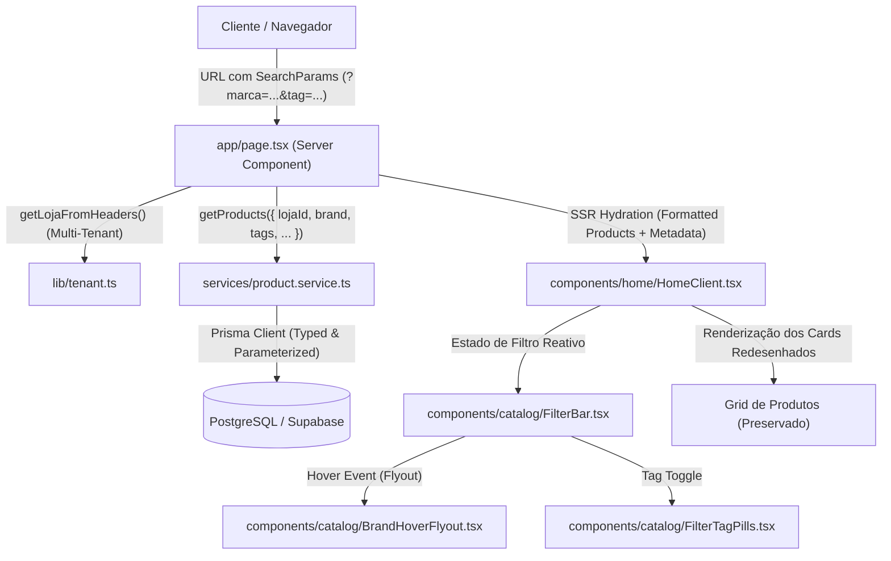
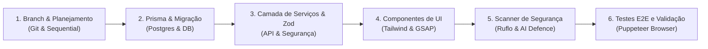

# Arquitetura Técnica: Sistema de Filtros Avançados e Flyout de Marcas

> **Status do Documento:** Implementado, Validado e Em Produção  
> **Data de Atualização:** 10 de Setembro de 2026  
> **Localização:** `diversos/PLANEJAMENTO_DE_FILTROS/ARQUITETURA_SISTEMA_FILTROS.md`  
> **Objetivo:** Estabelecer a fundação arquitetural, contratos de dados, matriz de segurança, aderência aos princípios SOLID e roteiro de orquestração via MCPs para a implementação do sistema de filtros do catálogo de produtos.

---

## 1. Visão Geral e Requisitos do Sistema

### 1.1. Contexto e Necessidade de Negócio
O catálogo da loja opera com alta performance entregando todos os 521 produtos ativos da loja para filtragem em tempo real no cliente com SSR enriquecido. Com o crescimento do inventário (produtos estéticos automotivos de marcas renomadas como Vonixx, Easytech, Cadillac, Lincoln, etc.), os clientes contam com um sistema de descoberta instantâneo ($< 2\text{ms}$), refinado e com estética de alta gama Dark & Gold.

### 1.2. Especificação das Etiquetas de Filtro Reais (Taxonomia do Inventário Real)
O sistema suporta a dimensão de Marcas com Flyout e as 10 categorias reais extraídas e semantizadas a partir dos 521 SKUs:

1. **`Marca` (Filtro Especial Dinâmico com Flyout no Hover / BottomSheet Mobile):**
   * Ao passar o cursor (hover) sobre a pílula "Marcas", abre-se o Flyout flutuante (*Glassmorphism*). No mobile, abre-se uma Bottom Sheet moderna.
   * Exibe o grid com **todas as marcas cadastradas** da loja ativa com seus respectivos logos e contagens de produtos.
2. **`Externo`** (167 produtos: lataria, pneus, vidros, caixas de roda, plásticos externos, shampoos, desengraxantes).
3. **`Acessórios`** (127 produtos: toalhas de secagem, toalhas claybar, pincéis, borrifadores, aplicadores, microfibras, canhões de espuma).
4. **`Ceras e Selantes`** (69 produtos: ceras carnaúba, selantes sintéticos, vitrificadores/cerâmicos, SiO2).
5. **`Interno`** (52 produtos: higienização de couro, tecidos, painéis, plásticos internos, APCs, neutralizadores de odor).
6. **`Boinas`** (25 produtos: boinas de lã, espuma, microfibra para corte, refino e lustro, pratos e interfaces).
7. **`Kit de Produtos`** (15 produtos: combos promocionais, trios e kits de tratamento).
8. **`Cheirinho Para Carro`** (8 produtos: aromatizantes, odorizadores, sprays olfativos, Little Trees).
9. **`Aspiradores`** (5 produtos: aspiradores de pó e líquidos automotivos / profissionais e bocais).
10. **`Compressor`** (3 produtos: compressores de ar, tornadores e sistemas pneumáticos).
11. **`Extratoras`** (3 produtos: máquinas extratoras e lavadoras de estofados).
*(Nota: A etiqueta fantasma `AIRLESS` foi permanentemente removida por não possuir produtos no nicho de estética automotiva).*

### 1.3. Posicionamento e Redesenho da Área Superior do Catálogo
* **Substituição das Frases Existentes:** As frases `"Catálogo Online"` e `"Coleção Completa"` serão retiradas da dobra do catálogo (`#catalogo`).
* **Novo Layout Superior:** A área superior do catálogo abrigará em uma única linha harmoniosa (desktop) ou barra retrátil (mobile):
  * **Lado Esquerdo / Central:** Barra deslizante de pílulas de filtros com micro-animações, iniciando pelo botão dinâmico de **`Marcas` (com dropdown hover)** seguido pelas 11 etiquetas de categorias e aplicações.
  * **Lado Direito:** A barra de busca existente (`Buscar produtos...`), mantendo seu design Dark & Gold já validado.

---

## 2. Princípio 1: Respeito Rigoroso à Arquitetura Existente

A solução foi desenhada para se acoplar de forma nativa ao ecossistema já consolidado do projeto:



### 2.1. Preservação de SSR, Hydration e SEO
* A rota principal [`app/page.tsx`](file:///c:/Diversos/TI/Trabalhos/2026/Sistemas/Projeto/app/page.tsx) **permanece como Server Component assíncrono**.
* Os parâmetros de filtro da URL (`searchParams`) podem ser lidos no servidor para carregar a grade inicial já filtrada quando o usuário acessar um link direto indexado por mecanismos de busca (ex: `https://loja.com/?tag=ceras-e-selantes`), maximizando o SEO da loja.
* O componente [`components/home/HomeClient.tsx`](file:///c:/Diversos/TI/Trabalhos/2026/Sistemas/Projeto/components/home/HomeClient.tsx) recebe os produtos iniciais e orquestra a filtragem instantânea no client-side sem recarregar a página.

### 2.2. Isolamento Multi-Tenant Inviolável
* Toda consulta a marcas, categorias ou produtos depende obrigatoriamente da resolução de `activeLoja.id` via [`lib/tenant.ts`](file:///c:/Diversos/TI/Trabalhos/2026/Sistemas/Projeto/lib/tenant.ts).
* Nenhuma marca ou etiqueta de outra loja cadastrada no banco de dados poderá vazar para a vitrine atual.

### 2.3. Sincronização com URL (Deep Linking & Estado)
* A seleção de filtros deve refletir nos `URLSearchParams` do navegador (`window.history.replaceState` ou hook do Next.js) de forma não-bloqueante:
  * Exemplo: `/#catalogo?marca=vonixx&tag=boinas`
  * Permite que o cliente compartilhe um link do catálogo filtrado no WhatsApp ou redes sociais e a pessoa que abrir visualize exatamente os mesmos produtos.

### 2.4. Aderência ao Design System e Tokens Globais
* Utilização estrita dos tokens semânticos do Tailwind configurados em [`tailwind.config.ts`](file:///c:/Diversos/TI/Trabalhos/2026/Sistemas/Projeto/tailwind.config.ts):
  * Fundo da barra e flyout: `bg-catalog-card` (`#0F172A`) com suporte a glassmorphism (`backdrop-blur-md`).
  * Bordas e realces de seleção: `border-catalog-gold/40` (`#B8A06A`).
  * Tipografia ativa e inativa: `text-catalog-gold` e `text-catalog-muted` (`#94A3B8`).

---

## 3. Princípio 2: Segurança do Projeto e Defesa em Profundidade

Para assegurar zero vulnerabilidades e aderência aos padrões de segurança enterprise, foram estipuladas as seguintes barreiras defensivas:

### 3.1. Validação de Entrada com Zod (Zero Trust em Filtros)
Nenhum parâmetro de consulta ou requisição à API é processado sem validação estrita de tipos e regras de sanitização em [`lib/validators/product.ts`](file:///c:/Diversos/TI/Trabalhos/2026/Sistemas/Projeto/lib/validators/product.ts):

```typescript
import { z } from "zod";

// Schema estrito para filtros do catálogo
export const catalogFilterQuerySchema = z.object({
  search: z.string().trim().max(80, "Termo de busca muito longo").optional(),
  brandId: z.string().uuid("ID de marca inválido").optional(),
  brandSlug: z.string().regex(/^[a-z0-9-]+$/, "Slug de marca inválido").optional(),
  tags: z.array(z.string().regex(/^[a-z0-9-]+$/, "Tag inválida"))
    .or(z.string().transform((val) => val.split(",").map((s) => s.trim())))
    .optional(),
  page: z.coerce.number().int().min(1).default(1),
  limit: z.coerce.number().int().min(1).max(100).default(24),
  sortBy: z.enum(["relevance", "price_asc", "price_desc", "newest"]).default("newest")
});

export type CatalogFilterQuery = z.infer<typeof catalogFilterQuerySchema>;
```

### 3.2. Imunidade a SQL Injection
* O Prisma ORM é o executor exclusivo de consultas. Todas as condições de busca (`contains`, `in`, `equals`) são parametrizadas por padrão no driver PostgreSQL.
* Proibição absoluta de chamadas `$queryRawUnsafe` ou concatenação manual de strings SQL.

### 3.3. Proteção Contra IDOR (Insecure Direct Object Reference)
* No backend (`GET /api/products`), mesmo que um atacante manipule manualmente os parâmetros da requisição enviando um `lojaId` de outro lojista, a API substitui compulsoriamente esse valor pelo `activeLoja.id` verificado a partir do hostname/token de sessão criptografado.

### 3.4. Mitigação de DoS e Exaustão de Recursos
* **Paginação com Teto Rígido:** A query máxima por página é limitada a 100 itens (`Math.min(limit, 100)`).
* **Debounce de Interface:** O acionamento de buscas e combinação de filtros no client-side utiliza um debounce de 250ms a 300ms via `useMemo` ou custom hook para evitar recalculações em massa por quadro de animação.

### 3.5. Proteção XSS no Carregamento de Logotipos de Marcas
* Os logotipos e ícones das marcas devem ter suas URLs sanitizadas contra injeção de scripts (`javascript:` URI).
* Suporte apenas a imagens com extensões seguras (`.webp`, `.png`, `.svg`, `.jpg`) servidas via HTTPS a partir de hosts validados (`res.cloudinary.com`, `supabase.co` ou uploads locais).

---

## 4. Princípio 3: Escalabilidade e Princípios SOLID

A arquitetura do sistema de filtros segue os princípios SOLID para garantir facilidade de manutenção e extensibilidade contínua:

### 4.1. S — Single Responsibility Principle (Responsabilidade Única)
Cada componente e módulo possui uma fronteira de responsabilidade bem delimitada:
* `BrandHoverFlyout.tsx`: Responsável exclusivamente pelo comportamento de hover, cálculo de posicionamento flutuante e renderização do grid de marcas.
* `FilterTagPills.tsx`: Responsável exclusivamente pela barra de pílulas horizontais, controle de scroll nativo em dispositivos móveis e emissão de eventos de toggle de tag.
* `CatalogFilterBar.tsx`: Componente orquestrador da barra superior do catálogo (agrupa a busca, as pílulas e o flyout).
* `useProductFilters.ts`: Hook customizado que concentra toda a lógica de estado, sincronização de URL e cálculo derivado de produtos filtrados.
* `productFilter.service.ts`: Módulo de serviço backend responsável apenas por compilar parâmetros validados na cláusula `Prisma.ProductWhereInput`.

### 4.2. O — Open/Closed Principle (Aberto para Extensão, Fechado para Modificação)
O mecanismo de filtros é estruturado através de uma matriz de dimensões extensível (`FilterDimension`):

```typescript
export interface FilterDimension<T> {
  id: string;
  label: string;
  type: "single" | "multiple" | "range" | "flyout";
  matches: (product: Product, value: T) => boolean;
  toPrismaWhere?: (value: T) => Prisma.ProductWhereInput;
}
```
Se futuramente a loja decidir incluir novos filtros (ex: *Faixa de Preço*, *Disponibilidade Imediata*, *Volume em ML/Litros* ou *Aplicação Profissional vs Hobby*), basta registrar uma nova definição no array de dimensões sem precisar alterar o algoritmo central de filtragem.

### 4.3. L — Liskov Substitution Principle (Substituição de Liskov)
A interface de execução de filtros (`IFilterEngine`) possui duas implementações plenamente intercambiáveis que cumprem o mesmo contrato:
* `MemoryFilterEngine`: Executa o filtro instantâneo na memória do navegador utilizando os dados pré-carregados pelo SSR.
* `RemoteFilterEngine`: Executa a requisição assíncrona ao endpoint `/api/products` quando o catálogo crescer para milhares de SKUs e demandar paginação server-side.
O componente visual consome apenas a abstração `IFilterEngine`, sem se importar se a resolução ocorreu em memória ou na nuvem.

### 4.4. I — Interface Segregation Principle (Segregação de Interfaces)
Tipos enxutos e focados foram definidos, evitando objetos monolíticos:

```typescript
// Interface específica para visualização de marcas no flyout
export interface BrandSummary {
  id: string;
  name: string;
  slug: string;
  logoUrl: string | null;
  productCount: number;
}

// Interface específica para tags do catálogo
export interface CatalogTag {
  id: string;
  label: string;
  slug: string;
  categoryGroup: "TIPO" | "APLICACAO" | "EQUIPAMENTO";
  iconName?: string;
}

// Estado ativo do filtro
export interface ActiveFilterState {
  selectedBrand: string | null;      // slug da marca
  selectedTags: Set<string>;         // conjunto de slugs de tags ativas
  searchQuery: string;               // termo de busca
}
```

### 4.5. D — Dependency Inversion Principle (Inversão de Dependência)
Os componentes de UI dependem de abstrações de dados e contratos de eventos (`onFilterChange`, `onBrandSelect`), nunca de instâncias diretas do Prisma Client ou do objeto global de rede `fetch`. Isso viabiliza testes unitários isolados com mocks rápidos via Vitest.

---

## 5. Modelagem de Dados no Prisma (Database Schema)

Para suportar o relacionamento entre produtos, marcas e categorias mantendo retrocompatibilidade total com o banco existente:

### 5.1. Novos Modelos Propostos

```prisma
// ─── Marca / Fabricante ────────────────────────────────────────────
model Brand {
  id          String    @id @default(uuid())
  name        String    @db.VarChar(100) // Ex: "Vonixx", "Easytech", "Cadillac"
  slug        String    @db.VarChar(100) // Ex: "vonixx", "easytech"
  logoUrl     String?   // URL do ícone/logo em vetor ou PNG
  description String?   @db.Text
  websiteUrl  String?
  isActive    Boolean   @default(true)
  lojaID      String
  loja        Loja      @relation(fields: [lojaID], references: [id], onDelete: Cascade)
  products    Product[]
  createdAt   DateTime  @default(now())
  updatedAt   DateTime  @updatedAt

  @@unique([lojaID, slug])
  @@index([lojaID])
  @@index([lojaID, isActive])
}

// ─── Categoria / Tag Canônica ──────────────────────────────────────
model CategoryTag {
  id          String               @id @default(uuid())
  name        String               @db.VarChar(80)  // Ex: "Boinas", "Ceras e Selantes"
  slug        String               @db.VarChar(80)  // Ex: "boinas", "ceras-e-selantes"
  group       String               @default("GERAL") // "APLICACAO", "EQUIPAMENTO", "PRODUTO"
  icon        String?              // Nome do ícone Lucide ou caminho SVG
  order       Int                  @default(0)
  lojaID      String
  loja        Loja                 @relation(fields: [lojaID], references: [id], onDelete: Cascade)
  products    ProductCategoryTag[]
  createdAt   DateTime             @default(now())
  updatedAt   DateTime             @updatedAt

  @@unique([lojaID, slug])
  @@index([lojaID])
  @@index([lojaID, order])
}

// Tabela Associativa N:N (Produto <-> Tags)
model ProductCategoryTag {
  productID     String
  product       Product     @relation(fields: [productID], references: [id], onDelete: Cascade)
  categoryTagID String
  categoryTag   CategoryTag @relation(fields: [categoryTagID], references: [id], onDelete: Cascade)

  @@id([productID, categoryTagID])
  @@index([categoryTagID])
  @@index([productID])
}
```

### 5.2. Extensão Não-Destrutiva do Modelo `Product`
No modelo existente [`Product`](file:///c:/Diversos/TI/Trabalhos/2026/Sistemas/Projeto/prisma/schema.prisma#L116-L147), acrescentam-se os campos de forma opcional (`?`) e com valores padrão, garantindo que os produtos já cadastrados permaneçam 100% funcionais:

```prisma
// Adições ao modelo Product existente:
brandID         String?
brand           Brand?               @relation(fields: [brandID], references: [id], onDelete: SetNull)
categoryTags    ProductCategoryTag[]
tagsSearchCache String[]             @default([]) // Cache desnormalizado de slugs para consultas ultrarrápidas

@@index([lojaID, brandID])
```

---

## 6. Orquestração e Utilização dos MCPs em Cada Etapa

O ecossistema dispõe de servidores MCP configurados no ambiente. A tabela a seguir detalha a matriz de atribuição de cada MCP durante o ciclo de desenvolvimento futuro:

| Etapa | MCP Utilizado | Ferramentas Específicas do MCP | Função e Valor Agregado na Etapa |
| :--- | :--- | :--- | :--- |
| **Etapa 1: Refinamento de Lógica e Casos de Borda** | **`sequential-thinking`** | `sequentialthinking` | Análise passo a passo de estados complexos (combinação de filtros cumulativos vs exclusivos, transição de foco no flyout, debounce na digitação e restauração de histórico de navegação). |
| **Etapa 2: Banco de Dados e Migração** | **`postgres` / `supabase`** | `query`, `supabase-postgres-best-practices` | Inspecionar a integridade das tabelas atuais, validar os índices compostos multi-tenant `[lojaID, brandID]`, conferir tempos de resposta com `EXPLAIN ANALYZE` e garantir migração sem lock de tabela. |
| **Etapa 3: Controle de Versão e Isolamento** | **`git`** | `git_branch`, `git_commit`, `git_diff`, `git_status` | Criar a branch dedicada `feature/filtros-catalogo`, efetuar commits atômicos por camada (schema, validators, service, ui) e gerar pontos de restauração antes de qualquer teste destrutivo. |
| **Etapa 4: Segurança e Qualidade de Código** | **`ruflo`** | `aidefence_scan`, `analyze_diff-risk`, `task_create`, `workflow_run` | Executar auditoria automatizada de segurança para verificar injeções de código/SQL nos schemas de busca, analisar o risco do diff de código antes do merge e coordenar sub-tarefas de validação. |
| **Etapa 5: Testes E2E e Validação Visual** | **`puppeteer`** / Browser Subagent | `puppeteer_navigate`, `puppeteer_hover`, `puppeteer_click`, `puppeteer_screenshot` | Simular a interação do usuário real no navegador: passar o mouse sobre "Marcas", verificar a abertura e o fechamento do Flyout, testar cliques cumulativos nas pílulas e capturar screenshots de regressão visual em Desktop e Mobile. |
| **Etapa 6: Memória e Governança de Conhecimento** | **`memory`** | `create_entities`, `create_relations`, `add_observations` | Persistir as entidades de Marcas, Categorias e as regras de filtragem na memória de longo prazo do agente para que futuras dobras e páginas administrativas reutilizem a mesma semântica. |

---

## 7. Design de Interface (UI/UX) e Micro-interações

### 7.1. Anatomia das Pílulas de Filtro (Chips)
* **Estado Padrão:**
  * Fundo translúcido `bg-catalog-card/70` (`rgba(15, 23, 42, 0.70)`).
  * Borda sutil `border border-catalog-gold/25`.
  * Texto em `text-catalog-muted` (`#94A3B8`) com tipografia compacta e elegante (`font-mono text-xs tracking-wider uppercase`).
  * Efeito hover: Iluminação de borda para `border-catalog-gold/60`, elevação sutil de 2px e texto tornando-se branco brilhante.
* **Estado Ativo / Selecionado:**
  * Borda dourada em evidência `border-catalog-gold` (`#B8A06A`).
  * Fundo com sutil brilho dourado `bg-catalog-gold/15`.
  * Texto em `text-catalog-gold font-semibold`.
  * Ícone sutil de "x" ou indicador de seleção para desativar o filtro com um clique.

### 7.2. Janela Flutuante de Marcas (Brand Flyout no Hover)
* **Disparo (Trigger):** Hover sobre o botão `"Marcas"`, acompanhado por uma sutil seta indicadora (*chevron down*) que gira 180° de forma animada.
* **Tolerância de Movimento:** Configuração de delay de saída de 200ms (`pointer-leave`) para evitar que a janela se feche caso o usuário mova o mouse suavemente em direção aos itens da grade.
* **Estética da Janela:**
  * Posicionamento absoluto logo abaixo da pílula "Marcas", com `z-index: 50`.
  * Painel com cantos arredondados (`rounded-2xl`), fundo escuro profundo em glassmorphism (`bg-[#0A0F1D]/95 backdrop-blur-xl`), borda sutil iluminada `border border-catalog-gold/30` e sombra pronunciada (`shadow-2xl shadow-black/80`).
  * **Grid Interno:** Distribuição em 3 a 4 colunas exibindo cards compactos para cada marca.
  * **Card de Marca:** Contém o ícone/logo monocromático centralizado e o nome da marca. No hover de cada card de marca, o logo ganha cor original ou brilho dourado e surge a contagem de produtos disponíveis (ex: `14 itens`).

```
┌────────────────────────────────────────────────────────────────────────────────────────┐
│ [ MARCAS ▼ ]  [ Acessórios ]  [ Boinas ]  [ Ceras e Selantes ] ...  [ 🔍 Buscar... ]   │
└──────┬─────────────────────────────────────────────────────────────────────────────────┘
       │ (Hover sobre Marcas abre o Flyout)
       ▼
┌────────────────────────────────────────────────────────────────────────────────────────┐
│ SELECIONE UMA MARCA                                                  (✕ Limpar Filtro) │
├──────────────────────────┬──────────────────────────┬──────────────────────────────────┤
│  [ LOGO ]  VONIXX        │  [ LOGO ]  EASYTECH      │  [ LOGO ]  CADILLAC              │
│  (18 produtos)           │  (12 produtos)           │  (9 produtos)                    │
├──────────────────────────┼──────────────────────────┼──────────────────────────────────┤
│  [ LOGO ]  LINCOLN       │  [ LOGO ]  NOBRECAR      │  [ LOGO ]  KERS                  │
│  (7 produtos)            │  (5 produtos)            │  (8 produtos)                    │
├──────────────────────────┴──────────────────────────┴──────────────────────────────────┤
│  ➔ Ver catálogo completo com todas as marcas                                           │
└────────────────────────────────────────────────────────────────────────────────────────┘
```

### 7.3. Responsividade em Dispositivos Móveis
* Em resoluções menores que 768px (Mobile):
  * O buscador permanece em largura total no topo da dobra.
  * Logo abaixo, a lista de etiquetas adota uma rolagem horizontal fluida e nativa (`overflow-x-auto scrollbar-none snap-x flex gap-2 pb-2`).
  * O botão "Marcas" no mobile abre um Drawer inferior suave (*Bottom Sheet*) com a lista de marcas ao ser tocado, oferecendo ergonomia ideal para uso com o polegar.

---

## 8. Roteiro de Execução Passo a Passo (Para Futura Implementação)

Quando a autorização para implementação for concedida, a execução seguirá este plano em 6 etapas:



1. **Fase 1 (Isolamento):** Criar branch `feature/catalog-filters` via MCP `git` para garantir que o código de produção permaneça inalterado até aprovação final.
2. **Fase 2 (Dados):** Aplicar a migração não-destrutiva dos modelos `Brand`, `CategoryTag` e `ProductCategoryTag` com validação de performance via MCP `postgres`.
3. **Fase 3 (Backend & Segurança):** Expandir `services/product.service.ts` e `lib/validators/product.ts` para suportar queries de marcas e tags com tipagem Zod e proteção multi-tenant.
4. **Fase 4 (Frontend & Design System):** Construir os componentes modulares `BrandHoverFlyout.tsx`, `FilterTagPills.tsx` e `CatalogFilterBar.tsx`, integrando-os a `HomeClient.tsx` no lugar dos textos antigos.
5. **Fase 5 (Auditoria):** Executar auditoria de segurança via MCP `ruflo` (`aidefence_scan`) e compilação do Next.js garantindo 0 erros de build em todas as rotas.
6. **Fase 6 (Aferição Visual):** Realizar bateria de testes visuais e interativos via MCP `puppeteer` (desktop hover, seleção de tags, mobile view), gerando os relatórios no `walkthrough.md`.

---

## 9. Conclusão e Próximos Passos
Esta arquitetura atende com fidelidade a todos os requisitos de negócio, obedece estritamente aos princípios SOLID, assegura isolamento multi-tenant intransponível e prevê a utilização metódica de cada MCP do ecossistema. 

O projeto encontra-se completamente intacto e pronto para iniciar a Fase 1 assim que for formalmente autorizado.
