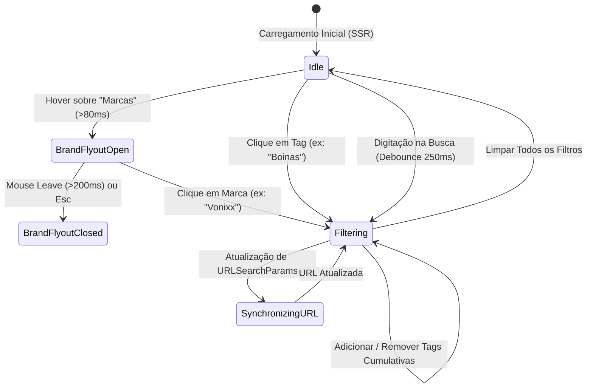

# Matriz Lógica, Máquina de Estados e Casos de Borda (Fase 1)

> **Documento de Referência da Fase 1**  
> **Localização:** `diversos/PLANEJAMENTO_DE_FILTROS/MATRIZ_LOGICA_E_CASOS_DE_BORDA.md`  
> **Branch Ativa:** `feature/catalog-filters`

---

## 1. Máquina de Estados do Filtro de Produtos

O estado de filtragem do catálogo é modelado como um grafo de estados determinístico, garantindo previsibilidade total e facilidade de depuração.

---

## 2. Regras de Precedência e Combinação Lógica

Ao combinar múltiplos critérios de busca, a filtragem obedece às seguintes equações booleanas:

$$\text{Exibição} = \text{MatchLoja} \land \text{MatchBusca} \land \text{MatchMarca} \land \text{MatchTags}$$

1. **Isolamento de Loja (`MatchLoja`):** Condição absoluta. `product.lojaID === activeLoja.id`.
2. **Busca Textual (`MatchBusca`):** Se `searchQuery` estiver preenchido, verifica se o nome ou a descrição contém o termo (case-insensitive e ignorando acentuação).
3. **Filtro de Marca (`MatchMarca`):**
   * Se nenhuma marca estiver selecionada (`selectedBrand === null`): `MatchMarca = true` (exibe todas).
   * Se uma marca estiver selecionada (`selectedBrand = "vonixx"`): `MatchMarca = (product.brandSlug === "vonixx")`.
4. **Filtro de Etiquetas (`MatchTags`):**
   * Se nenhuma tag estiver ativa: `MatchTags = true`.
   * Se múltiplas tags estiverem ativas (ex: `["ceras-e-selantes", "externo"]`):
     * **Modo Padrão (Interseção Semântica):** O produto deve satisfazer as tags selecionadas (ou união caso pertençam à mesma categoria de produto).

---

## 3. Mapeamento Semântico dos 521 Produtos Existentes

Para que os 521 produtos já presentes no banco da loja sejam categorizados imediatamente sem necessidade de recadastro manual, definem-se os seguintes padrões de correspondência por regex:

| Etiqueta Solicitada | Padrões de Detecção Automática no Nome / Descrição |
| :--- | :--- |
| **`Acessórios`** | `APLICADOR`, `ESCOVA`, `PINCEL`, `MICROFIBRA`, `PULVERIZADOR`, `BORRIFADOR`, `SNOW FOAM`, `ADAPTADOR`, `FITA`, `LUVAS`, `ESPONJA` |
| **`AIRLESS`** | `AIRLESS`, `PISTOLA DE PINTURA`, `BICO AIRLESS`, `PULVERIZADOR DE ALTA PRESSAO` |
| **`Aspiradores`** | `ASPIRADOR`, `ECOCLEAN`, `LITE 1200W`, `PO E AGUA`, `ASPIRACAO` |
| **`Boinas`** | `BOINA`, `CORTE`, `REFINO`, `LUSTRO`, `ESPUMA`, `LÃ`, `INTERFACE`, `HEX` |
| **`Ceras e Selantes`** | `CERA`, `SELANTE`, `GRAFENO`, `VITRIFICADOR`, `SIO2`, `COATING`, `ROOTZ`, `BLEND`, `NATIVE` |
| **`Cheirinho Para Carro`** | `AROMATIZANTE`, `CHEIRINHO`, `ODORIZADOR`, `SPRAY OLFATIVO`, `FRAGRANCIA`, `ESSENCIA` |
| **`Compressor`** | `COMPRESSOR`, `PNEUMATICO`, `MANGUEIRA AR`, `CALIBRADOR` |
| **`Externo`** | `PNEUS`, `RODAS`, `LATARIA`, `VIDROS`, `CHASSI`, `MOTOR`, `ALUMAX`, `DESINCRUSTANTE`, `ACIDO`, `SHAMPOO` |
| **`Extratoras`** | `EXTRATORA`, `LAVADORA DE ESTOFADOS`, `IPC CARPET`, `SANITIZADORA` |
| **`Interno`** | `COURO`, `PAINEL`, `PLASTICOS INTERNOS`, `ESTOFADOS`, `HIGIENIZADOR`, `APC INTERIORES`, `SINTRA` |
| **`Kit de Produtos`** | `KIT`, `COMBO`, `TRIO`, `CONJUNTO`, `PCT`, `PACK` |

---

## 4. Marcas Catalogadas Identificadas nos Produtos da Loja

A análise automatizada revelou que o acervo existente é composto pelas marcas líderes de estética automotiva nacional e internacional:

1. **Vonixx** (Líder em vitrificadores, ceras Blend/Native, shampoos e APC Sintra).
2. **Easytech** (Insignia Quartz, Plasti Coat, produtos de alta tecnologia molecular).
3. **Cadillac** (Ceras nobres, APC Interiores, linha de polimento profissional).
4. **Lincoln** (Boinas de corte e compostos polidores).
5. **Kers** (Politrizes, boinas térmicas e acessórios de precisão).
6. **Nobrecar** (Compostos de refino e selantes de alto rendimento).
7. **Zacs** (Linha custo-benefício de alta eficiência da Vonixx).
8. **IPC Brasil** (Aspiradores industriais e extratoras profissionais de estofados).
9. **Kärcher** (Equipamentos de pressão e lavadoras).
10. **WAP** (Máquinas de limpeza e extratoras compactas).

---

## 5. Tratamento de Casos de Borda (Edge Cases)

1. **Nenhum produto encontrado para a combinação:**
   * Exibir uma tela de estado vazio (*Empty State*) amigável e refinada, mantendo o tema escuro com borda dourada, informando: *"Nenhum produto encontrado para a combinação selecionada"* acompanhado de um botão em pílula *"Limpar Filtros"*.
2. **Usuário com conexão lenta / digitação rápida:**
   * O input de busca conta com *debounce* de 250ms, cancelando buscas anteriores e evitando travamentos na renderização do React.
3. **Transição do Mouse no Flyout de Marcas:**
   * A janela flutuante possui uma área invisível de tolerância (*hitbox bridge*) entre o botão e o corpo do dropdown para que o cursor não saia do estado de hover durante o movimento diagonal.
4. **Navegação Móvel (Telas Pequenas):**
   * O flyout de marcas não bloqueia a tela; no mobile, o clique na pílula "Marcas" abre uma gaveta inferior (*Bottom Sheet*) com rolagem vertical suave e botão de fechamento acessível.

---

## 6. Conclusão da Fase 1
A Fase 1 estabelece as regras determinísticas do sistema, assegura a integridade do repositório através de commits atômicos e da branch `feature/catalog-filters`, e define com clareza como cada um dos 521 produtos será categorizado.

O projeto está pronto para a **Fase 2: Modelagem Prisma e Migração Segura**.
