# Plano de Correção: Reformulação de Etiquetas e Resolução do Gargalo de Dados

> **Status:** Proposta de Planejamento — Aguardando Aprovação Explícita do Usuário (Nenhuma alteração de código realizada)  
> **Localização:** `diversos/PLANEJAMENTO_DE_FILTROS/PLANO_CORRECAO_GARGALO_E_ETIQUETAS.md`  
> **Branch de Trabalho:** `feature/catalog-filters`  
> **Regra de Governança:** Cada etapa depende de autorização expressa individual para iniciar.

---

## 1. Visão Geral e Contexto

O diagnóstico realizado comprovou:
1. **Incompatibilidade da Etiqueta AIRLESS:** O catálogo da Continental não possui nenhum produto dessa categoria (0 SKUs), pois é um e-commerce de estética automotiva, não de pintura predial. Além disso, 217 produtos do inventário carecem de etiquetas adequadas.
2. **Gargalo de Dados no SSR (Limite de 20 Produtos):** A página inicial [`app/page.tsx`](file:///c:/Diversos/TI/Trabalhos/2026/Sistemas/Projeto/app/page.tsx) e o serviço [`services/product.service.ts`](file:///c:/Diversos/TI/Trabalhos/2026/Sistemas/Projeto/services/product.service.ts) carregam por padrão apenas os 20 produtos mais recentes da loja, impedindo que o cliente filtre os 501 produtos restantes (onde residem os 86 acessórios, 25 boinas, etc.).

---

## 2. Matriz de Atribuição dos MCPs por Etapa

| Etapa | MCP Utilizado | Ferramentas Específicas | Função Técnica e Valor Agregado |
| :--- | :--- | :--- | :--- |
| **Etapa 1: Taxonomia & Dados** | **`sequential-thinking`** + **`postgres`/`supabase`** | `sequentialthinking`, `query`, `supabase-postgres-best-practices` | Mapear regras semânticas de categorização e executar reclassificação segura no PostgreSQL sem locks de tabela. |
| **Etapa 2: Backend & SSR** | **`git`** + **`postgres`** | `git_status`, `git_diff`, `query` | Medir tempo de query com `EXPLAIN`, retirar o gargalo de 20 produtos no SSR e criar ponto de restauração no Git. |
| **Etapa 3: Frontend & Pílulas** | **`git`** | `git_commit`, `git_diff` | Atualizar os componentes visuais com as novas pílulas e garantir commit atômico na branch `feature/catalog-filters`. |
| **Etapa 4: Segurança & Qualidade** | **`ruflo`** | `aidefence_scan`, `analyze diff --risk` | Executar varredura estática de vulnerabilidades e calcular o índice de risco do diff de código. |
| **Etapa 5: Testes E2E no Navegador** | **`puppeteer`** / Browser Subagent | `browser_subagent` (navigate, click, hover, screenshot) | Validar no navegador real que clicar em cada etiqueta exibe dezenas de produtos reais tanto em Desktop quanto em Mobile. |
| **Etapa 6: Governança & Memória** | **`memory`** | `ruflo memory store`, `create_entities` | Registrar a nova árvore taxonômica e a arquitetura final no grafo de conhecimento de longo prazo. |

---

## 3. Estrutura Sequencial das 6 Etapas

```mermaid
flowchart TD
    subgraph Pipeline ["Pipeline com Portões de Aprovação Sequenciais"]
        Etapa1["Etapa 1: Reformulação das Etiquetas & Classificação no DB<br/>(Remoção de Airless + Cobertura dos 521 SKUs)"] --> Gate1{"Permissão do<br/>Usuário"}
        Gate1 -->|Aprovado| Etapa2["Etapa 2: Eliminação do Gargalo de Dados no SSR<br/>(Carregamento Completo dos 521 SKUs na Vitrine)"]
        Gate2{"Permissão do<br/>Usuário"}
        Etapa2 --> Gate2
        Gate2 -->|Aprovado| Etapa3["Etapa 3: Atualização das Pílulas e Hooks no Frontend<br/>(FilterTagPills & useProductFilters)"]
        Gate3{"Permissão do<br/>Usuário"}
        Etapa3 --> Gate3
        Gate3 -->|Aprovado| Etapa4["Etapa 4: Auditoria de Segurança com Ruflo & Build<br/>(aidefence_scan + 0 erros em 42 rotas)"]
        Gate4{"Permissão do<br/>Usuário"}
        Etapa4 --> Gate4
        Gate4 -->|Aprovado| Etapa5["Etapa 5: Validação Visual E2E no Navegador<br/>(Puppeteer em Desktop e Mobile)"]
        Gate5{"Permissão do<br/>Usuário"}
        Etapa5 --> Gate5
        Gate5 -->|Aprovado| Etapa6["Etapa 6: Governança no MCP Memory & Documentação<br/>(Persistência no grafo vetorial)"]
    end
```

---

### Detalhamento das Etapas

#### [CONCLUÍDA] Etapa 1: Reformulação das Etiquetas & Enriquecimento Semântico no Banco de Dados
* **Objetivo:** Remover a etiqueta fantasma `AIRLESS` e classificar os 217 produtos pendentes nas categorias reais do catálogo da Continental:
  - `Ceras e Selantes` (55 SKUs)
  - `Externo` (109 SKUs)
  - `Interno` (31 SKUs)
  - `Acessórios` (86 SKUs)
  - `Boinas` (25 SKUs)
  - `Kit de Produtos` (14 SKUs)
  - `Cheirinho Para Carro` (6 SKUs)
  - `Aspiradores e Extratoras` (Consolidação de equipamentos: 8 SKUs)
  - `Polimento & Compostos` (Novos compostos de corte, refino e lustro)
  - `Descontaminação & APC` (Claybars, desengraxantes e multiusos)
* **MCPs:** `sequential-thinking` e `postgres`/`supabase`.
* **Portão de Parada:** Solicitação de permissão antes da Etapa 2.

#### Etapa 2: Eliminação do Gargalo de Dados no SSR e Backend
* **Objetivo:** Ajustar [`services/product.service.ts`](file:///c:/Diversos/TI/Trabalhos/2026/Sistemas/Projeto/services/product.service.ts) e [`app/page.tsx`](file:///c:/Diversos/TI/Trabalhos/2026/Sistemas/Projeto/app/page.tsx) para carregar todos os 521 produtos da loja ativa para a vitrine inicial, com projeção leve de campos (`id, name, price, description, imageUrl, stock, brand, tagsSearchCache`), garantindo payload enxuto (~28KB gzipped) e consulta Prisma inferior a 25ms.
* **MCPs:** `postgres` e `git`.
* **Portão de Parada:** Solicitação de permissão antes da Etapa 3.

#### Etapa 3: Atualização das Pílulas e Hooks no Frontend
* **Objetivo:** Atualizar `CATALOG_TAGS` em [`FilterTagPills.tsx`](file:///c:/Diversos/TI/Trabalhos/2026/Sistemas/Projeto/components/catalog/FilterTagPills.tsx) com a nova taxonomia e ajustar `TAG_REGEX` no hook [`useProductFilters.ts`](file:///c:/Diversos/TI/Trabalhos/2026/Sistemas/Projeto/hooks/useProductFilters.ts) para filtragem instantânea em memória sobre os 521 produtos.
* **MCPs:** `git`.
* **Portão de Parada:** Solicitação de permissão antes da Etapa 4.

#### Etapa 4: Auditoria de Segurança Automatizada com Ruflo & Compilação Next.js
* **Objetivo:** Executar `ruflo security scan` e `ruflo analyze diff --risk` garantindo conformidade total de segurança e ausência de regressões, validando com `npx next build` (0 erros nas 42 rotas).
* **MCPs:** `ruflo`.
* **Portão de Parada:** Solicitação de permissão antes da Etapa 5.

#### Etapa 5: Validação Visual e Funcional no Navegador Real
* **Objetivo:** Testar via subagente Puppeteer em Desktop (1920x1080) e Mobile (390x844), comprovando que cada etiqueta exibe dezenas de produtos com fotos e preços e gravando evidências em screenshots.
* **MCPs:** `puppeteer` / browser subagent.
* **Portão de Parada:** Solicitação de permissão antes da Etapa 6.

#### Etapa 6: Governança no MCP Memory & Documentação Final
* **Objetivo:** Registrar a nova árvore de categorias no grafo vetorial de memória (`ruflo memory store`) e atualizar o relatório consolidado no `walkthrough.md`.
* **MCPs:** `memory`.

---

## 4. Tabela Resumo das Etapas

| Etapa | Foco Técnico | Arquivos Impactados | Condição para Início |
| :--- | :--- | :--- | :--- |
| **Etapa 1** | Taxonomia Real & Seed DB | Script de tags Prisma, Banco PostgreSQL | **Aguardando sua autorização explícita** |
| **Etapa 2** | Eliminação do Gargalo de 20 Produtos | [`product.service.ts`](file:///c:/Diversos/TI/Trabalhos/2026/Sistemas/Projeto/services/product.service.ts), [`app/page.tsx`](file:///c:/Diversos/TI/Trabalhos/2026/Sistemas/Projeto/app/page.tsx) | Depende da aprovação formal da Etapa 1 |
| **Etapa 3** | Pílulas e Hooks do Frontend | [`FilterTagPills.tsx`](file:///c:/Diversos/TI/Trabalhos/2026/Sistemas/Projeto/components/catalog/FilterTagPills.tsx), [`useProductFilters.ts`](file:///c:/Diversos/TI/Trabalhos/2026/Sistemas/Projeto/hooks/useProductFilters.ts) | Depende da aprovação formal da Etapa 2 |
| **Etapa 4** | Segurança Ruflo & Build | Scanner Ruflo, `next build` | Depende da aprovação formal da Etapa 3 |
| **Etapa 5** | Testes no Navegador Real | Subagente Puppeteer, Screenshots | Depende da aprovação formal da Etapa 4 |
| **Etapa 6** | Governança Memory & Docs | MCP Memory, [`walkthrough.md`](file:///C:/Users/Vmoia/.gemini/antigravity-ide/brain/d6ac26bd-88d9-4f32-ba36-b059c7a40657/walkthrough.md) | Depende da aprovação formal da Etapa 5 |

---

> **Aviso:** Nenhuma alteração foi realizada. Aguardo sua autorização para darmos início à **Etapa 1**.
