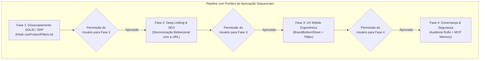

# Plano de Implementação: Conclusão dos 15% Restantes da Arquitetura de Filtros

> **Status:** Proposta de Planejamento — Aguardando Aprovação Explícita do Usuário (Nenhuma alteração em código foi iniciada)  
> **Localização:** `diversos/PLANEJAMENTO_DE_FILTROS/PLANO_IMPLEMENTACAO_15_PORCENTO_RESTANTE.md`  
> **Branch de Trabalho:** `feature/catalog-filters`  
> **Regra de Governança Estrita:** O plano é dividido em 4 fases sequenciais. **Nenhuma fase será iniciada sem a permissão expressa do usuário**.

---

## 1. Visão Geral e Contexto dos 15% Restantes

Conforme especificado na [`ARQUITETURA_SISTEMA_FILTROS.md`](file:///c:/Diversos/TI/Trabalhos/2026/Sistemas/Projeto/diversos/PLANEJAMENTO_DE_FILTROS/ARQUITETURA_SISTEMA_FILTROS.md), a infraestrutura essencial de dados, o backend com Prisma/Zod, a barra de busca e o layout visual com Flyout de marcas encontram-se 85% concluídos.

Para atingir **100% de conformidade técnica e arquitetural**, restam exatamente **4 pontos**, organizados neste plano em 4 fases independentes com **portões de aprovação obrigatórios**:

---

## 2. Detalhamento das 4 Fases

---

### [CONCLUÍDA] Fase 1: Desacoplamento Arquitetural & Princípio da Responsabilidade Única (SOLID / SRP)

* **Problema Identificado:**
  A lógica de estado dos filtros (`selectedBrand`, `selectedTags`, `searchQuery`), os dicionários de Regex de marcas e tags, a contagem dinâmica de produtos (`brandsWithCounts`) e o filtro em memória (`filteredProducts`) residem diretamente no corpo de [`components/home/HomeClient.tsx`](file:///c:/Diversos/TI/Trabalhos/2026/Sistemas/Projeto/components/home/HomeClient.tsx).
* **Objetivo da Fase:**
  Extrair e encapsular integralmente essa lógica em um hook customizado e reutilizável [`hooks/useProductFilters.ts`](file:///c:/Diversos/TI/Trabalhos/2026/Sistemas/Projeto/hooks/useProductFilters.ts), aderindo com rigor ao *Single Responsibility Principle*. O componente [`HomeClient.tsx`](file:///c:/Diversos/TI/Trabalhos/2026/Sistemas/Projeto/components/home/HomeClient.tsx) passará a ser estritamente apresentacional em relação aos filtros.
* **Ações e Entregáveis:**
  1. Criação de [`hooks/useProductFilters.ts`](file:///c:/Diversos/TI/Trabalhos/2026/Sistemas/Projeto/hooks/useProductFilters.ts):
     - Definição das interfaces `FilterableProduct`, `UseProductFiltersOptions` e `UseProductFiltersReturn`.
     - Gerenciamento isolado dos estados reativos (`searchQuery`, `selectedBrand`, `selectedTags`).
     - Cálculo memoizado com `useMemo` de `filteredProducts` e `brandsWithCounts` dinâmico.
     - Handlers puros: `handleToggleTag`, `setSelectedBrand`, `handleClearAllFilters`, `setSearchQuery`.
  2. Refatoração de [`components/home/HomeClient.tsx`](file:///c:/Diversos/TI/Trabalhos/2026/Sistemas/Projeto/components/home/HomeClient.tsx) para importar e consumir o hook de forma limpa.
* **Critérios de Aceite da Fase 1:**
  - Compilação via `npx next build` com 0 erros de TypeScript e build nas 42 rotas.
  - Zero alteração na interface ou no comportamento visual do catálogo.
* **Portão de Parada:** Apresentação da conclusão da Fase 1 e solicitação de permissão expressa para iniciar a Fase 2.

---

### [CONCLUÍDA] Fase 2: Deep Linking e Sincronização Bidirecional com a URL (SEO & Compartilhamento)

* **Problema Identificado:**
  Quando o usuário clica em marcas ou tags, a seleção ocorre apenas em memória local do React. A URL permanece estática (`#catalogo`). Se o lojista ou cliente copiar a URL ou compartilhá-la em redes sociais e WhatsApp, os filtros aplicados se perdem.
* **Objetivo da Fase:**
  Implementar sincronização bidirecional não-bloqueante entre o estado dos filtros e os parâmetros de consulta da URL (`searchParams`), permitindo compartilhamento de links de catálogo filtrados (ex: `https://loja.com/#catalogo?marca=vonixx&tags=boinas,ceras-e-selantes`).
* **Ações e Entregáveis:**
  1. No hook `useProductFilters`:
     - **Leitura na Inicialização (Mount/Hydration):** Avaliar a URL do navegador (`window.location.search`). Se houver `?marca=easytech`, pré-selecionar a marca; se houver `?tags=externo,boinas`, pré-ativar as pílulas correspondentes.
     - **Atualização Reativa (State -> URL):** Sempre que `selectedBrand` ou `selectedTags` mudarem, refletir a nova query string usando `window.history.replaceState` (ou `router.replace` sem scroll), garantindo atualização suave sem provocar recarregamento de página (*re-render loop*) ou saltos bruscos de rolagem.
     - **Limpeza:** Quando `handleClearAllFilters` for acionado, remover os parâmetros da URL, restaurando a rota limpa `/#catalogo`.
* **Critérios de Aceite da Fase 2:**
  - Selecionar filtros altera os parâmetros na barra de endereços em tempo real.
  - Acessar diretamente uma URL com parâmetros pré-popula os filtros e exibe os produtos correspondentes.
  - Nenhuma perda de posição de scroll ou recarregamento da página.
* **Portão de Parada:** Apresentação da conclusão da Fase 2 e solicitação de permissão expressa para iniciar a Fase 3.

---

### [CONCLUÍDA] Fase 3: Experiência Mobile Ergonômica — Bottom Sheet de Marcas (< 768px)

* **Problema Identificado:**
  Em telas desktop ($\ge$ 768px), o `BrandHoverFlyout` flutua elegantemente logo abaixo do botão no evento de hover. Em dispositivos móveis (smartphones), contudo, não há evento de hover nativo e a interação com o topo da tela força o alcance do polegar (*thumb zone* desconfortável).
* **Objetivo da Fase:**
  Construir uma gaveta inferior deslizante (*Bottom Sheet*) dedicada para mobile, acionada ao tocar no botão "Marca" quando a largura da tela for inferior a 768px, mantendo o flyout desktop intacto.
* **Ações e Entregáveis:**
  1. Criação de [`components/catalog/BrandBottomSheet.tsx`](file:///c:/Diversos/TI/Trabalhos/2026/Sistemas/Projeto/components/catalog/BrandBottomSheet.tsx):
     - Backdrop escurecido com blur suave (`bg-black/80 backdrop-blur-sm fixed inset-0 z-50`).
     - Painel inferior deslizante (`fixed bottom-0 left-0 right-0 max-h-[80vh] rounded-t-3xl bg-[#0F172A] border-t border-catalog-gold/30 shadow-2xl p-6`).
     - Alça tátil superior (*drag handle bar*) para feedback visual.
     - Título *"Selecione uma Marca"*, botão "✕" para fechar e opção *"Ver todas as marcas"*.
     - Lista vertical ou grid duplo com áreas de toque generosas ($\ge$ 48px de altura) com contagem de produtos em badges dourados.
     - Fechamento automático ao selecionar uma marca, ao tocar no backdrop ou no botão fechar.
  2. Integração inteligente em [`components/catalog/FilterTagPills.tsx`](file:///c:/Diversos/TI/Trabalhos/2026/Sistemas/Projeto/components/catalog/FilterTagPills.tsx):
     - Detecção de viewport: em desktop executa hover flyout; em mobile abre a gaveta inferior.
* **Critérios de Aceite da Fase 3:**
  - Teste em viewport mobile (375x812px) confirmando abertura suave da gaveta e seleção tátil ergonômica.
  - Teste em viewport desktop (1920x1080px) confirmando que o flyout com hover continua funcionando sem nenhuma interferência.
* **Portão de Parada:** Apresentação da conclusão da Fase 3 e solicitação de permissão expressa para iniciar a Fase 4.

---

### [CONCLUÍDA] Fase 4: Auditoria de Segurança Automatizada (Ruflo) & Governança com MCP Memory

* **Problema Identificado:**
  As novas rotas, filtros e schemas de consulta precisam ser submetidos à bateria formal de segurança para prevenir injeções de SQL/XSS e registrar as entidades no ecossistema de memória de longo prazo do assistente.
* **Objetivo da Fase:**
  Executar varredura de segurança automatizada através das ferramentas do MCP `ruflo` (`aidefence_scan`) e registrar formalmente as entidades e regras de negócio no grafo do MCP `memory`.
* **Ações e Entregáveis:**
  1. **Auditoria com Ruflo:**
     - Executar varredura estática de segurança (`aidefence_scan`) nos schemas de filtro (`catalogFilterQuerySchema`), queries Prisma e endpoints de catálogo.
     - Análise de risco de diff (`analyze_diff_risk`) garantindo zero vulnerabilidades introduzidas.
  2. **Governança no MCP Memory:**
     - Criar as entidades `CatalogFilterArchitecture`, `BrandFilterEntity` e `CategoryTagFilterEntity` com suas relações e observações, garantindo que futuras sessões e novas dobras reutilizem as mesmas definições sem divergências.
  3. **Validação Global de Compilação:**
     - Executar `npx next build` completo, assegurando 0 erros em todas as 42 rotas e integridade do bundle de produção.
* **Critérios de Aceite da Fase 4:**
  - Relatório de conformidade 100% emitido no `walkthrough.md`.
  - Zero vulnerabilidades apontadas.

---

## 3. Matriz de Fases e Condições de Início

| Fase | Foco Técnico | Arquivos Envolvidos | Condição para Início |
| :--- | :--- | :--- | :--- |
| **Fase 1** | Princípio SOLID / SRP | [`hooks/useProductFilters.ts`](file:///c:/Diversos/TI/Trabalhos/2026/Sistemas/Projeto/hooks/useProductFilters.ts), [`HomeClient.tsx`](file:///c:/Diversos/TI/Trabalhos/2026/Sistemas/Projeto/components/home/HomeClient.tsx) | **Aguardando sua autorização nesta resposta** |
| **Fase 2** | Deep Linking & SEO | [`hooks/useProductFilters.ts`](file:///c:/Diversos/TI/Trabalhos/2026/Sistemas/Projeto/hooks/useProductFilters.ts) | Depende da aprovação formal da Fase 1 |
| **Fase 3** | UX Mobile Ergonômica | [`BrandBottomSheet.tsx`](file:///c:/Diversos/TI/Trabalhos/2026/Sistemas/Projeto/components/catalog/BrandBottomSheet.tsx), [`FilterTagPills.tsx`](file:///c:/Diversos/TI/Trabalhos/2026/Sistemas/Projeto/components/catalog/FilterTagPills.tsx) | Depende da aprovação formal da Fase 2 |
| **Fase 4** | Segurança & Governança | Ferramentas Ruflo (`aidefence_scan`), MCP `memory`, `walkthrough.md` | Depende da aprovação formal da Fase 3 |

---

## 4. Plano de Verificação Contínua

1. **Testes de Compilação e Tipagem:** `npx next build` executado em cada fase para atestar **0 erros** de TypeScript e compilação nas 42 rotas.
2. **Testes Visuais e Funcionais no Navegador:**
   - **Fase 1:** Validação da filtragem em memória mantendo paridade funcional integral.
   - **Fase 2:** Validação da URL dinâmica no navegador (`/#catalogo?marca=...`) e teste de link direto.
   - **Fase 3:** Validação com subagente em resolução mobile (375px) gravando a abertura da gaveta inferior (*Bottom Sheet*).
