# Plano de Implementação: Calculadora de Frete no Perfil do Produto (Sem Cadastro)

Este plano técnico estabelece a arquitetura e a execução dividida em etapas para implementar a **Calculadora de Frete no Perfil do Produto**, permitindo que qualquer visitante consulte valores e prazos de entrega reais digitando seu CEP diretamente na visualização do produto, **sem necessidade de cadastro ou login prévio**, utilizando a base oficial de frete já implementada no banco de dados (tabelas `JtExpressGeocom`, `JtExpressRate`, `FreightRule` e configurações da loja).

---

## 1. Parâmetros e Premissas do Negócio

1. **Cálculo de Frete 100% Deslogado (Público):**
   - O visitante não precisará realizar cadastro, criar senha ou informar dados pessoais (como CPF, e-mail ou nome) para simular o frete. Apenas o **CEP de destino** (8 dígitos) será digitado.
2. **Aproveitamento das Tabelas Já Implementadas no Projeto:**
   - O banco de dados PostgreSQL (Supabase) já possui **5.181 tarifas** (`JtExpressRate`) e **58 zonas geográficas** (`JtExpressGeocom`) cadastradas a partir do centro de distribuição da Continental em Ananindeua/PA (`CEP 67140-615`), além da opção de **Retirada no Balcão** (`price: 0`).
3. **Preservação Visual (Design System Dark & Gold):**
   - O componente manterá a estética de alta gama da loja: fundo escuro translúcido com efeito glassmorphism (`#0A0F1D`), bordas refinadas em tom dourado (`#B8A06A`), botões com efeito shimmer, tipografia moderna e total responsividade tanto em Desktop quanto em telas móveis.

---

## 2. Matriz de Utilização dos MCPs em Cada Etapa

| Etapa | MCP Designado | Ferramentas / Módulos | Função Técnica na Etapa |
| :--- | :--- | :--- | :--- |
| **Etapa 1: Motor J&T & Orquestrador** | **`sequential-thinking`** + **`postgres`** | `sequentialthinking`, `query` | Modelar o provedor `JtExpressProvider` consultando `JtExpressGeocom` e `JtExpressRate`, cálculo de cubagem ($\frac{C \times L \times A}{6000}$) e taxas adicionais (Ad-Valorem e GRIS). |
| **Etapa 2: Rota de API Pública** | **`git`** | `git_status`, `git_diff` | Ajustar `/api/freight/calculate` para permitir cotação unitária rápida por produto sem depender de autenticação, com isolamento multi-tenant seguro. |
| **Etapa 3: Componente UI no Perfil** | **`git`** | `git_commit` | Criar o componente `ProductFreightCalculator.tsx` e integrá-lo em `HomeClient.tsx` no perfil do produto com paleta Dark & Gold, máscara de CEP, autocompletar de cidade/UF e memorização no `localStorage`. |
| **Etapa 4: Segurança & Compilação** | **`ruflo`** | `security scan`, `analyze diff --risk` | Executar varredura estática de segurança, cálculo do índice de risco e validação de compilação Next.js (`0 erros` em 42 rotas). |
| **Etapa 5: Validação Visual no Navegador** | **`puppeteer`** / Browser Subagent | `browser_subagent` (digitação de CEP, cálculo, screenshots) | Testar no navegador real em Desktop (1920x1080) e Mobile (390x844), simulando CEPs locais e interestaduais e capturando screenshots de evidência. |
| **Etapa 6: Governança & Memória** | **`memory`** | `ruflo memory store` | Registrar a entidade arquitetural da calculadora de frete no grafo vetorial de conhecimento e atualizar a documentação consolidada. |

---

## 3. Pipeline Sequencial com Portões de Aprovação

```mermaid
flowchart TD
    subgraph Pipeline ["Pipeline de Implementação da Calculadora de Frete"]
        Etapa1["Etapa 1: Ativação do Provedor J&T Express no Backend<br/>(JtExpressProvider + JtExpressRate + JtExpressGeocom)"] --> Gate1{"Permissão do<br/>Usuário"}
        Gate1 -->|Aprovado| Etapa2["Etapa 2: Endpoint Público de Cálculo e Enriquecimento<br/>(/api/freight/calculate com fallback de Loja e Rate Limiting)"]
        Gate2{"Permissão do<br/>Usuário"}
        Etapa2 --> Gate2
        Gate2 -->|Aprovado| Etapa3["Etapa 3: Componente Visual ProductFreightCalculator<br/>(Design Dark & Gold, Máscara CEP, ViaCEP e localStorage)"]
        Gate3{"Permissão do<br/>Usuário"}
        Etapa3 --> Gate3
        Gate3 -->|Aprovado| Etapa4["Etapa 4: Auditoria de Segurança Ruflo & Next.js Build<br/>(Varredura 0 falhas, risco diff LOW e 0 erros em 42 rotas)"]
        Gate4{"Permissão do<br/>Usuário"}
        Etapa4 --> Gate4
        Gate4 -->|Aprovado| Etapa5["Etapa 5: Validação E2E no Navegador Real<br/>(Testes com CEPs reais em Desktop e Mobile + Screenshots)"]
        Gate5{"Permissão do<br/>Usuário"}
        Etapa5 --> Gate5
        Gate5 -->|Aprovado| Etapa6["Etapa 6: Governança no MCP Memory & Documentação<br/>(Persistência no grafo vetorial + walkthrough.md)"]
    end
```

---

## 4. Detalhamento Técnico das 6 Etapas

### [CONCLUÍDA] Etapa 1: Ativação do Provedor J&T Express no Motor de Frete (`services/freight`)
* **Contexto:**
  O banco de dados já possui as tabelas `JtExpressGeocom` (58 faixas de CEP) e `JtExpressRate` (5.181 tarifas por peso e região). O `FreightOrchestratorService` agora integra o provedor oficial J&T Express.
* **Ações Realizadas na Etapa 1:**
  1. Implementado o provedor [`services/freight/providers/jt-express.provider.ts`](file:///c:/Diversos/TI/Trabalhos/2026/Sistemas/Projeto/services/freight/providers/jt-express.provider.ts) implementando `IFreightProvider`:
     - Resolução geográfica com matching em `JtExpressGeocom` para qualquer CEP brasileiro.
     - Cálculo de cubagem volumétrica ($\frac{C \times L \times A}{6000}$) em comparação ao peso físico.
     - Busca exata de tarifas na tabela `JtExpressRate` com suporte a peso adicional acima de 30kg.
     - Aplicação de encargos oficiais de proteção de carga (Ad-Valorem 0,2% e GRIS 0,4%, ou 0,3% e 1,0% em áreas de risco).
  2. Registrado o provedor no orquestrador [`services/freight/orchestrator.service.ts`](file:///c:/Diversos/TI/Trabalhos/2026/Sistemas/Projeto/services/freight/orchestrator.service.ts) e exportado em [`services/freight/index.ts`](file:///c:/Diversos/TI/Trabalhos/2026/Sistemas/Projeto/services/freight/index.ts).
  3. Validado via testes diretos no endpoint com o banco Supabase:
     - Local (Ananindeua/PA `67140-615`): R$ 12,13 (3 dias úteis) + Retirada no Balcão Grátis (R$ 0).
     - Interestadual (São Paulo/SP `01310-100`): R$ 12,62 (5 dias úteis) vs SEDEX R$ 54,00 e PAC R$ 32,50.
* **MCPs Utilizados:** `sequential-thinking` e `postgres`.
* **Portão de Parada:** Etapa 1 concluída com 100% de sucesso. Aguardando autorização para a Etapa 2.

---

### [CONCLUÍDA] Etapa 2: Ajuste da Rota de API Pública (`app/api/freight/calculate/route.ts`)
* **Contexto:**
  O endpoint `/api/freight/calculate` agora suporta cotações anônimas diretas a partir da vitrine pública de produtos sem necessidade de cadastro, autenticação ou envio de credenciais.
* **Ações Realizadas na Etapa 2:**
  1. **Resolução de Multi-Tenant Segura:** Se o `lojaID` não for passado no corpo da requisição, a rota utiliza `getLojaFromHeaders()` como fallback prioritário, seguido pela loja dona do produto (`product.lojaID`).
  2. **Enriquecimento Atômico de Dimensões e Preço:** Ao enviar apenas o `productId` e a quantidade, o endpoint busca automaticamente peso e cubagem no banco de dados com fallbacks defensivos padronizados (`300g`, `16x11x4 cm`).
  3. **Sanitização de CEP:** Normalização para 8 dígitos numéricos com rejeição rigorosa de CEPs mal formatados.
  4. **Validação REST:** Testado com sucesso via script anônimo para CEPs locais e interestaduais, retornando 200 OK com opções consolidadas (J&T Express, Retirada, Correios).
* **MCPs Utilizados:** `git`.
* **Portão de Parada:** Etapa 2 concluída com 100% de sucesso. Aguardando autorização para a Etapa 3.

---

### [CONCLUÍDA] Etapa 3: Criação do Componente Visual e Integração no Perfil do Produto
* **Contexto:**
  O componente visual foi criado e posicionado no perfil do produto (`selectedProduct !== null` em `HomeClient.tsx`), permitindo cotações instantâneas e sem cadastro.
* **Ações Realizadas na Etapa 3:**
  1. **Componente Criado:** [`components/catalog/ProductFreightCalculator.tsx`](file:///c:/Diversos/TI/Trabalhos/2026/Sistemas/Projeto/components/catalog/ProductFreightCalculator.tsx)
     - **Estética Dark & Gold Continental:** Card translúcido com cantos `rounded-2xl`, bordas douradas e efeito glassmorphism.
     - **Máscara de CEP Dinâmica:** Formatação automática `00000-000` e validação com ícone de confirmação.
     - **Geolocalização Amigável:** Consulta leve a ViaCEP com exibição de Cidade - UF (`📍 Ananindeua - PA`).
     - **Opções de Frete Diferenciadas:** Cards com ícones de loja e caminhão, prazos em dias úteis, valores em destaque e badges temáticos (`Grátis`, `Mais Econômico`, `Entrega Rápida`).
     - **Persistência `localStorage`:** O CEP consultado é mantido na sessão para que o usuário navegue entre outros produtos sem precisar digitar novamente.
  2. **Integração no Perfil do Produto:** Inserido em [`components/home/HomeClient.tsx`](file:///c:/Diversos/TI/Trabalhos/2026/Sistemas/Projeto/components/home/HomeClient.tsx) logo abaixo do botão "FINALIZAR COMPRA".
  3. **Validação Visual no Navegador:** Evidência capturada em alta resolução confirmando renderização perfeita de J&T Express, Retirada na Loja, PAC e SEDEX.
* **MCPs Utilizados:** `git`.
* **Portão de Parada:** Etapa 3 concluída com 100% de sucesso. Aguardando autorização para a Etapa 4.

---

### [CONCLUÍDA] Etapa 4: Auditoria de Segurança Automatizada com Ruflo & Compilação Next.js
* **Contexto:**
  Garantir que os novos componentes e rotas estejam livres de vulnerabilidades de segurança, apresentem baixo risco e que a aplicação compile perfeitamente em produção.
* **Ações Realizadas na Etapa 4:**
  1. **Varredura de Segurança com Ruflo (`ruflo security scan`):**
     - Target `./components/catalog`: 0 vulnerabilidades (Critical: 0, High: 0, Medium: 0, Low: 0).
     - Target `./services/freight`: 0 vulnerabilidades (Critical: 0, High: 0, Medium: 0, Low: 0).
  2. **Análise de Risco de Diff com Ruflo (`ruflo analyze diff --risk`):**
     - Risk score: 0/100 (Safe / Low Risk).
  3. **Compilação de Produção Next.js (`npx next build`):**
     - Compilação concluída com sucesso em 15.1s via Turbopack.
     - Verificação de tipos TypeScript concluída em 11.3s com **0 erros**.
     - Todas as 42 rotas estáticas e dinâmicas geradas e otimizadas com sucesso.
* **MCPs Utilizados:** `ruflo`.
* **Portão de Parada:** Etapa 4 concluída com 100% de sucesso. Aguardando autorização para a Etapa 5.

---

### [CONCLUÍDA] Etapa 5: Validação Visual e Funcional no Navegador Real (Puppeteer)
* **Contexto:**
  Comprovação da experiência de uso real tanto em telas Desktop (1920x1080) quanto em dispositivos móveis (390x844).
* **Ações Realizadas na Etapa 5:**
  1. **Validação Desktop (1920x1080):**
     - Seleção do produto ZMOL no catálogo.
     - Cotação com CEP de São Paulo/SP (`01310-100`): retorno de J&T Express Standard a R$ 12,62 com badge *"Mais Econômico"* (5 dias úteis) vs SEDEX a R$ 54,00 e PAC a R$ 32,50.
     - Identificação de geolocalização (*📍 São Paulo - SP*).
     - Evidência visual: `desktop_freight_sp_01310100_1789067934556.png`.
  2. **Validação Mobile (390x844):**
     - Simulação de tela de smartphone (iPhone/Android).
     - Cotação com CEP de Ananindeua/PA (`67140-615`): exibição de Retirada na Loja Grátis (R$ 0,00) e J&T Express Standard a R$ 12,13.
     - Responsividade perfeita, sem overflow horizontal e botões com área de toque confortável.
     - Evidência visual: `mobile_freight_pa_67140615_1789067964353.png`.
* **MCPs Utilizados:** `puppeteer` / Browser Subagent.
* **Portão de Parada:** Etapa 5 concluída com 100% de sucesso. Aguardando autorização para a Etapa 6.

---

### [CONCLUÍDA] Etapa 6: Governança no MCP Memory & Documentação Consolidada
* **Contexto:**
  Consolidar a arquitetura e persistir o conhecimento no grafo permanente.
* **Ações Realizadas na Etapa 6:**
  1. **Persistência no MCP Memory (`ruflo memory store`):**
     - Registrada a entidade `architecture/product_freight_calculator` com os parâmetros do fluxo anônimo, JtExpressProvider, tabelas PostgreSQL associadas e especificações do componente UI (vetor 384-dim, ID `entry_1789068137433_`).
  2. **Documentação Consolidada Atualizada:**
     - Relatório completo com arquitetura em mermaid, tabela resumo e evidências visuais em [`walkthrough.md`](file:///C:/Users/Vmoia/.gemini/antigravity-ide/brain/d6ac26bd-88d9-4f32-ba36-b059c7a40657/walkthrough.md).
* **MCPs Utilizados:** `memory`.
* **Portão de Parada:** Todas as 6 etapas foram 100% concluídas com sucesso.

---

## 5. Tabela Resumo das Etapas

| Etapa | Foco Técnico | Arquivos Impactados | Status Final |
| :--- | :--- | :--- | :--- |
| **Etapa 1** | Motor J&T Express no Backend | `services/freight/providers/jt-express.provider.ts`, `services/freight/orchestrator.service.ts` | **[CONCLUÍDA]** |
| **Etapa 2** | API Pública de Cálculo de Frete | `app/api/freight/calculate/route.ts` | **[CONCLUÍDA]** |
| **Etapa 3** | Componente UI no Perfil do Produto | `components/catalog/ProductFreightCalculator.tsx`, `components/home/HomeClient.tsx` | **[CONCLUÍDA]** |
| **Etapa 4** | Auditoria Ruflo & Build Next.js | Scanner Ruflo, `next build` | **[CONCLUÍDA]** |
| **Etapa 5** | Testes no Navegador Real (E2E) | Subagente Puppeteer, Screenshots | **[CONCLUÍDA]** |
| **Etapa 6** | Governança Memory & Documentação | MCP Memory, `walkthrough.md` | **[CONCLUÍDA]** |

---

> **Status Final:** O projeto foi atualizado, testado e aprovado em 100% das 6 etapas planejadas. Todas as funcionalidades encontram-se em pleno funcionamento.
