# Workflow de Implementação V2: Carrossel de 5 Marcas Soltas & Filtros Livres na Lateral com Grid de 4 Cards (Experimento Reversível)

Este documento estabelece o fluxo de trabalho detalhado, dividido em etapas com portões de aprovação estritos, para a implementação da versão 2 do layout experimental do catálogo da Continental Produtos Estéticos Automotivos:
1. **Região Superior do Catálogo:** Carrossel infinito minimalista exibindo **apenas as logos das marcas de maneira solta** (sem caixas/cards pesados), exatamente **5 marcas visíveis por vez** em proporção idêntica à imagem de referência, fundo escuro nativo do projeto, setas circulares `<` e `>` e filtro interativo por clique.
2. **Barra Lateral Esquerda Livre (Não-Encapsulada):** Filtros e barra de pesquisa organizados de maneira solta/modular na lateral esquerda (semelhante à imagem de referência 3), com a barra de pesquisa no topo, opções "Por preço", "Categorias" e "Marca", ocupando espaço otimizado (~240px).
3. **Preservação Rígida dos 4 Cards por Linha:** Expansão do container do catálogo (`max-w-[1680px]`) para que a coluna lateral não aperte o grid, mantendo rigorosamente **4 cards de produtos por linha horizontal** no Desktop.
4. **Protocolo de Reversibilidade Total:** Tag Git `backup-pre-carrossel-v2` e script `revert-experiment.bat` para restauração imediata em 1 clique caso desejado.

---

## 1. Diretrizes Técnicas e de Design Obrigatórias

* **Carrossel Minimalista de Marcas (Topo do Catálogo):**
  - **Logos Soltas:** Sem cartões, sem molduras pesadas e sem fundos cinzas ou caixas retangulares. As logos oficiais vetorizadas (SVG) flutuam suavemente sobre o fundo escuro `#000000` / `#050505`.
  - **Exatamente 5 Marcas Visíveis:** Distribuição horizontal uniforme em 5 slots idênticos à imagem de referência, com navegação por setas circulares `<` e `>` nos extremos.
  - **Filtro Interativo:** Ao clicar em qualquer logotipo solto, o catálogo filtra instantaneamente os produtos daquela marca com feedback visual sutil (halo dourado sutil e chip ativo). Segundo clique remove o filtro.
* **Barra Lateral de Filtros Livre (Não-Encapsulada):**
  - Inspirada na Imagem 3 da referência: módulos livres e limpos empilhados verticalmente sem caixa monolítica pesada em volta.
  - **Topo:** Barra de busca elegante em Dark & Gold com ícone de lupa.
  - **Módulo "Por Preço":** Faixas clicáveis (até R$50, de R$50 a R$100, de R$100 a R$150, de R$150 a R$200, a partir de R$200).
  - **Módulo "Categorias":** Listagem vertical das 10 categorias com contadores dinâmicos de estoque.
  - **Módulo "Marca":** Links rápidos de marcas.
  - **Módulo Mobile:** Botão retrátil que abre gaveta lateral (off-canvas) para não prejudicar a navegação em telas verticais de smartphones.
* **Preservação dos 4 Cards Horizontais no Catálogo:**
  - O catálogo principal manterá `grid-cols-4` no Desktop (`xl:grid-cols-4 lg:grid-cols-3 sm:grid-cols-2 grid-cols-1`).
  - Container principal ampliado de `max-w-7xl` (1280px) para `max-w-[1680px]` com padding responsivo fluido.
  - Largura da sidebar fixada em ~240px, deixando ~1400px úteis para o grid — mantendo os cards em tamanho perfeito (~320px cada) sem qualquer aperto!
* **Preservação Integral de Recursos:**
  - Calculadora de frete no perfil do produto, 521 SKUs, carrinho Zustand, WhatsApp flutuante e vídeo da Hero continuam 100% intactos.

---

## 2. Matriz de Etapas e Portões de Aprovação

| Etapa | Escopo Técnico | Entregáveis | Critério de Conclusão |
| :--- | :--- | :--- | :--- |
| **Etapa 1** | **Ponto de Restauração & Isolamento Git** | Tag `backup-pre-carrossel-v2`, branch `experiment/brand-carousel-v2`, `revert-experiment.bat` | Repositório isolado e reversibilidade instantânea garantida. |
| **Etapa 2** | **Carrossel Minimalista (5 Marcas Soltas)** | Componente `BrandMinimalistCarousel.tsx` com logos SVGs transparentes soltas no fundo escuro | Renderização de exatamente 5 marcas por vez, setas `<` e `>`, filtro por clique. |
| **Etapa 3** | **Barra Lateral Livre (Não-Encapsulada)** | Componente `CatalogFreeSidebar.tsx` com busca no topo, "Por preço" e "Categorias" | Estrutura limpa e solta sem caixas pesadas, largura compacta de 240px. |
| **Etapa 4** | **Integração no HomeClient com Grid de 4 Cards** | Atualização de `HomeClient.tsx` com `max-w-[1680px]` e `grid-cols-4` | Catálogo exibindo 4 cards por linha sem aperto e carrossel minimalista no topo. |
| **Etapa 5** | **Filtro de Faixa de Preço no Hook** | Extensão de `useProductFilters.ts` para suportar `selectedPriceRange` | Filtros por preço funcionando de forma combinada com marcas e busca. |
| **Etapa 6** | **Auditoria Ruflo, Build Next.js & Validação Visual E2E** | `ruflo security scan`, `next build`, testes no navegador real | 0 falhas, 0 vulnerabilidades, 42 rotas compiladas e screenshots Desktop/Mobile. |

---

## 3. Pipeline Sequencial de Implementação

```mermaid
flowchart TD
    subgraph Pipeline ["Pipeline de Implementação V2"]
        E1["Etapa 1: Ponto de Restauração & Isolamento Git<br/>(backup-pre-carrossel-v2 + revert-experiment.bat)"] --> G1{"Autorização do<br/>Usuário"}
        G1 -->|Aprovado| E2["Etapa 2: Carrossel Minimalista (5 Marcas Soltas)<br/>(BrandMinimalistCarousel.tsx + Fundo Escuro + 5 logos)"]
        E2 --> G2{"Autorização do<br/>Usuário"}
        G2 -->|Aprovado| E3["Etapa 3: Barra Lateral Livre Não-Encapsulada<br/>(CatalogFreeSidebar.tsx com Busca no Topo e Por Preço)"]
        E3 --> G3{"Autorização do<br/>Usuário"}
        G3 -->|Aprovado| E4["Etapa 4: Grid de 4 Cards e Layout Amplo<br/>(HomeClient.tsx max-w-[1680px] e xl:grid-cols-4)"]
        E4 --> G4{"Autorização do<br/>Usuário"}
        G4 -->|Aprovado| E5["Etapa 5: Filtro por Faixa de Preço no Hook<br/>(useProductFilters.ts com selectedPriceRange)"]
        E5 --> G5{"Autorização do<br/>Usuário"}
        G5 -->|Aprovado| E6["Etapa 6: Auditoria Ruflo, Build & Validação E2E<br/>(Scan 0 falhas, 42 rotas OK e Screenshots Desktop/Mobile)"]
    end
```



---

## 4. Detalhamento Técnico das Etapas

### Etapa 1: Ponto de Restauração e Mecanismo de Reversão Total
* **Ações Técnicas:**
  1. Criar tag imutável no commit atual: `git tag backup-pre-carrossel-v2`.
  2. Criar e alternar para a branch: `git checkout -b experiment/brand-carousel-v2`.
  3. Atualizar `revert-experiment.bat` na raiz do projeto com comando de retorno com 1 clique para `feature/catalog-filters`.
* **Portão de Parada:** Confirmação de isolamento Git sem tocar em arquivos de código e solicitação de aprovação para a Etapa 2.

### Etapa 2: Carrossel Minimalista de Marcas Soltas (`BrandMinimalistCarousel.tsx`)
* **Ações Técnicas:**
  1. Desenvolver `components/catalog/BrandMinimalistCarousel.tsx`:
     - Fundo escuro nativo (`bg-[#000000]` ou `bg-[#050505]`) sem cartões, molduras ou caixas retangulares envolventes.
     - Grade/trilho configurado para exibir exatamente **5 marcas de cada vez** no desktop com espaçamento uniforme.
     - Logos transparentes em escala adequada (altura ~44px a ~52px) preservando cores autênticas e nitidez vetorial.
     - Botões circulares discretos `<` e `>` nos extremos esquerdo e direito em Dark & Gold.
     - Animação contínua infinita com `pause on hover` e suporte a scroll manual.
     - Ao clicar na logo, aciona `setSelectedBrand(brand.slug)` com indicador luminoso refinado; segundo clique limpa o filtro.
* **Portão de Parada:** Apresentação do componente e solicitação de aprovação para a Etapa 3.

### Etapa 3: Barra Lateral Livre e Não-Encapsulada (`CatalogFreeSidebar.tsx`)
* **Ações Técnicas:**
  1. Desenvolver `components/catalog/CatalogFreeSidebar.tsx`:
     - Estrutura "livre" (sem encapsulamento pesado, sem cartão gigante englobando tudo). Módulos tipográficos limpos inspirados na Imagem 3.
     - **Topo:** Barra de pesquisa minimalista com lupa dourada e placeholder claro.
     - **Contador:** Indicador "X produtos encontrados".
     - **Filtros Ativos:** Chips discretos com botão "Limpar todos".
     - **Módulo Por Preço:** Links de faixas de preço (até R$50, R$50 a R$100, R$100 a R$150, R$150 a R$200, a partir de R$200).
     - **Módulo Categorias:** Lista vertical com as 10 categorias reais da loja.
     - **Módulo Marca:** Lista vertical complementar das marcas.
     - **Versão Mobile Drawer:** Botão retrátil que abre a gaveta lateral em smartphones via React Portal.
* **Portão de Parada:** Apresentação da Sidebar e solicitação de aprovação para a Etapa 4.

### Etapa 4: Integração no `HomeClient.tsx` Garantindo 4 Cards por Linha
* **Ações Técnicas:**
  1. No catálogo de `components/home/HomeClient.tsx`:
     - Posicionar o `BrandMinimalistCarousel` no topo do catálogo.
     - Configurar o container para largura ampla (`max-w-[1680px]` e `px-6 xl:px-12`).
     - Alocar a barra lateral livre à esquerda com largura otimizada (`w-60` / `w-64`).
     - Alocar o grid de produtos à direita configurado com **`xl:grid-cols-4 lg:grid-cols-3 sm:grid-cols-2 grid-cols-1`**, garantindo que cada linha horizontal exiba rigorosamente **4 cards** com respiro visual e tamanho generoso.
* **Portão de Parada:** Verificação visual e solicitação de aprovação para a Etapa 5.

### Etapa 5: Filtro por Faixa de Preço no `useProductFilters.ts`
* **Ações Técnicas:**
  1. Estender `hooks/useProductFilters.ts`:
     - Adicionar estado `selectedPriceRange: string | null` (ex: `"0-50"`, `"50-100"`, `"100-150"`, `"150-200"`, `"200+"`).
     - Integrar a lógica de filtragem de preço de forma cumulativa com busca, marca e categorias.
* **Portão de Parada:** Validação funcional da filtragem combinada e solicitação de aprovação para a Etapa 6.

### Etapa 6: Auditoria Ruflo, Build Next.js & Validação E2E no Navegador Real
* **Ações Técnicas:**
  1. Executar `ruflo security scan` nos novos componentes (0 vulnerabilidades).
  2. Executar `ruflo analyze diff --risk` (risco Low).
  3. Executar `npx next build` garantindo 0 erros nas 42 rotas.
  4. Executar testes visuais automatizados via browser subagent:
     - Desktop 1920x1080: comprovar visualização de 5 marcas soltas no carrossel superior, sidebar livre e grid com 4 cards por linha horizontal.
     - Mobile 390x844: validar drawer e responsividade.
  5. Salvar evidências visuais no walkthrough e documentar como acionar o rollback caso desejado.
* **Portão de Parada:** Apresentação final das evidências visuais ao usuário.

---

## 5. Garantia de Reversibilidade

Caso o usuário queira descontinuar a experiência e voltar exatamente para este momento:
1. Dar dois cliques no arquivo `revert-experiment.bat` na raiz do projeto, ou rodar:
   ```bash
   git checkout feature/catalog-filters
   ```
2. A interface retornará imediatamente ao estado atual.
