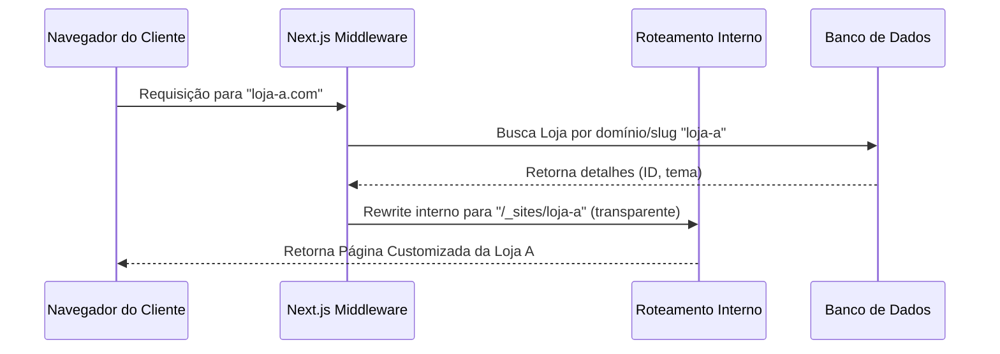

# Relatório de Análise Arquitetural: Desacoplamento e Viabilidade Multi-Tenant

Este relatório apresenta uma análise aprofundada da estrutura atual do e-commerce desenvolvido em Next.js (App Router) e Prisma, avaliando a viabilidade de desacoplá-lo para que possa ser revendido a outras empresas. São apresentadas duas abordagens (Multi-Instância e Multi-Tenant SaaS), seguidas de um plano técnico detalhado com foco em segurança, escalabilidade e boas práticas de engenharia de software.

---

## 1. Diagnóstico da Arquitetura Atual

A base de código atual possui características mistas. Embora o banco de dados tenha sido modelado pensando em múltiplos lojistas, a camada de aplicação e o front-end estão acoplados à marca original ("Pernambuco Confecções").

### Pontos Fortes (Facilitadores)
- **Modelagem de Dados Relacional**: O esquema Prisma (`prisma/schema.prisma`) possui o conceito de `Loja` (com `id`, `name`, `slug`, `coverImageUrl`, `pixKey`, `whatsappNumber`, etc.).
- **Vinculação de Entidades**: Tabelas críticas como `User`, `Product`, `Order` e `FreightRule` já possuem uma coluna `lojaID` e chaves estrangeiras configuradas, facilitando a filtragem por inquilino (tenant).
- **Serviços Parcialmente Isolados**: Arquivos como `lib/services/customer.service.ts` e `services/order.service.ts` implementam filtragem ativa por `lojaID` recebido nas requisições do painel administrativo.

### Pontos de Acoplamento (Impeditivos Atuais)

1. **Vazamento e Falha de Isolamento de Dados na Home**:
   - No arquivo [app/page.tsx](file:///c:/Diversos/TI/Trabalhos/2026/04-Abril/E-comerce/Projeto/app/page.tsx), a chamada para listar produtos é feita via `fetch("/api/products")`.
   - Na API [app/api/products/route.ts](file:///c:/Diversos/TI/Trabalhos/2026/04-Abril/E-comerce/Projeto/app/api/products/route.ts), se o parâmetro `lojaId` não for fornecido nos parâmetros de busca (searchParams), a consulta ao banco de dados no Prisma (`lojaID: lojaId` com `lojaId` sendo `undefined`) trará produtos de **todas** as lojas registradas.
   
2. **Consultas Hardcoded por Atributo de Ordem (First-Fit)**:
   - No layout principal [app/layout.tsx](file:///c:/Diversos/TI/Trabalhos/2026/04-Abril/E-comerce/Projeto/app/layout.tsx#L19), a loja ativa é selecionada através de `prisma.loja.findFirst()`. Em um ambiente com múltiplas lojas, o sistema sempre carregará as informações (como o número de WhatsApp) da primeira loja criada no banco de dados, independentemente do domínio de acesso.

3. **Textos e Identidade Visual Acoplados (Hardcoded)**:
   - O nome *"Pernambuco Confecções"* e o termo *"Pernambuco"* estão fixados diretamente em arquivos HTML/React como [Header.tsx](file:///c:/Diversos/TI/Trabalhos/2026/04-Abril/E-comerce/Projeto/components/Header.tsx#L17), [MobileMenu.tsx](file:///c:/Diversos/TI/Trabalhos/2026/04-Abril/E-comerce/Projeto/components/MobileMenu.tsx), [AdminSidebar.tsx](file:///c:/Diversos/TI/Trabalhos/2026/04-Abril/E-comerce/Projeto/components/admin/AdminSidebar.tsx), além de metadados de SEO (`app/layout.tsx`, `app/register/page.tsx`, `app/login/page.tsx`).
   - A cor primária da identidade visual (`#DDAF02`) está fixada diretamente nas classes do Tailwind CSS e estilos customizados.

4. **Ausência de Rotas Dinâmicas de Tenant**:
   - A aplicação não utiliza middleware de subdomínios ou caminhos dinâmicos (como `/[tenantSlug]`) para carregar a interface da loja específica.

---

## 2. Estratégias de Desacoplamento

Para comercializar este sistema como um produto reutilizável, a empresa de software pode seguir dois caminhos principais.

### Abordagem A: Multi-Instância (White-Label Independente)
Nesse modelo, cada novo cliente recebe uma infraestrutura de banco de dados e hospedagem dedicada. O código-fonte é o mesmo, mas a configuração determina o comportamento.

- **Como funciona**:
  - Cada cliente tem sua própria instância no Vercel/AWS e sua própria base de dados PostgreSQL.
  - A marca, cores e chaves de API são configuradas através de variáveis de ambiente (`.env`) ou uma tabela única de configurações.
- **Vantagens**:
  - **Isolamento Total**: Segurança absoluta de dados. Zero risco de vazamento de dados entre clientes (LGPD/GDPR compliance nativo).
  - **Customização Facilitada**: Permite alterações de código pontuais ou integrações específicas para clientes grandes sem afetar outros.
- **Desvantagens**:
  - **Custo Operacional e Escalabilidade**: Atualizar a aplicação para 50 clientes exige rodar 50 pipelines de CI/CD e manter 50 bancos de dados. Custos de infraestrutura multiplicados.

### Abordagem B: Multi-Tenant SaaS (Single-Instance, Multi-Tenant)
Neste modelo, uma única instância da aplicação Next.js e um único banco de dados PostgreSQL servem a todas as lojas parceiras concorrentemente.

- **Como funciona**:
  - O inquilino (tenant) é identificado dinamicamente através do subdomínio (ex: `cliente1.plataforma.com`) ou domínio próprio (ex: `www.lojadocliente.com`).
  - O sistema filtra todas as consultas de banco de dados baseado no inquilino resolvido.
- **Vantagens**:
  - **Custo Mínimo**: Apenas um servidor e um banco de dados hospedado para manter.
  - **Manutenção Centralizada**: Uma única atualização de código no repositório atualiza todas as lojas instantaneamente.
  - **Escalabilidade**: Novas lojas podem se registrar sozinhas (self-service signup) inserindo um registro na tabela `Loja`.
- **Desvantagens**:
  - **Complexidade de Engenharia**: Requer isolamento de dados rigoroso no nível da aplicação para evitar brechas de segurança.
  - **Limitação de Customização**: Todos os clientes compartilham o mesmo layout base (variando apenas cores, logos e banners dinâmicos).

---

## 3. Arquitetura de Solução Proposta (Foco em SaaS Escalável)

Caso a empresa opte pelo modelo de **Multi-Tenant SaaS** (o modelo mais maduro e escalável de mercado), o projeto precisará de uma reestruturação de arquitetura em quatro pilares fundamentais.

### 3.1. Roteamento Dinâmico de Subdomínio via Middleware (Next.js 14)
Devemos utilizar o Next.js Middleware para interceptar a requisição, ler o cabeçalho `host` e reescrever o caminho interno da URL sem alterar o link exibido no navegador do usuário.



#### Mecanismo de Rewrite no Middleware:
O middleware deverá ler o `hostname`, diferenciar o domínio base de subdomínios ou domínios customizados e realizar o redirecionamento virtual:

```typescript
// Exemplo conceitual de middleware.ts
import { NextRequest, NextResponse } from "next/server";

export async function middleware(req: NextRequest) {
  const url = req.nextUrl;
  const hostname = req.headers.get("host") || "";

  // Ignorar rotas de API estáticas e assets
  if (
    url.pathname.startsWith("/_next") ||
    url.pathname.startsWith("/api") ||
    url.pathname.includes(".")
  ) {
    return NextResponse.next();
  }

  // Identificação do tenant por hostname
  const currentHost = hostname
    .replace(`.seudominio.com.br`, "")
    .replace(`localhost:3000`, "");

  // Se for o painel geral da plataforma de vendas
  if (currentHost === "app" || currentHost === "") {
    return NextResponse.next();
  }

  // Rewrite interno para a pasta dinâmica de tenants
  return NextResponse.rewrite(
    new URL(`/_sites/${currentHost}${url.pathname}`, req.url)
  );
}
```

A estrutura de arquivos do Next.js seria refatorada para comportar a rota `app/_sites/[site]/page.tsx`, onde as páginas públicas passariam a receber o slug da loja dinamicamente.

---

### 3.2. Isolamento de Dados Automatizado com Prisma Client Extension
O maior risco de segurança em sistemas SaaS compartilhados é a falha humana no esquecimento de cláusulas de filtro (`where: { lojaID }`). 

Para resolver isso de forma robusta e transparente, deve-se adotar o **Prisma Client Client Extensions** para injetar automaticamente filtros de inquilino em todas as operações de leitura e escrita.

#### Configuração de um Cliente Prisma Tenant-Aware:
```typescript
// Exemplo conceitual de extensão Prisma (lib/prisma.ts)
import { PrismaClient } from "@prisma/client";

export const getTenantPrisma = (lojaId: string) => {
  const client = new PrismaClient();
  
  return client.$extends({
    query: {
      product: {
        async findMany({ args, query }) {
          args.where = { ...args.where, lojaID: lojaId };
          return query(args);
        },
        async findUnique({ args, query }) {
          // Garante que mesmo buscando por ID único, pertença à loja atual
          args.where = { ...args.where, lojaID: lojaId };
          return query(args);
        }
      },
      order: {
        async findMany({ args, query }) {
          args.where = { ...args.where, lojaID: lojaId };
          return query(args);
        }
      }
      // Repetir a lógica de escopo para Address, User, etc.
    }
  });
};
```
> [!TIP]
> Esse mecanismo garante conformidade de segurança no nível de banco de dados, blindando o sistema contra erros de desenvolvedores que esquecerem de injetar o `lojaID` manualmente nas rotas ou controllers.

---

### 3.3. Tema e Visual Dinâmico via Variáveis de CSS
Em vez de usar classes específicas de cores do Tailwind (como `bg-[#DDAF02]`), o front-end deve usar **Custom CSS Properties** injetadas no elemento raiz (`:root`) com base nas configurações da loja salvas no banco.

#### 1. Mapeamento no Tailwind Config:
```typescript
// tailwind.config.ts
module.exports = {
  theme: {
    extend: {
      colors: {
        primary: "var(--color-primary)",
        secondary: "var(--color-secondary)",
      }
    }
  }
}
```

#### 2. Injeção Dinâmica no Layout Principal:
No `app/layout.tsx` (ou no componente de renderização do tenant), as cores e fontes da loja são buscadas e renderizadas inline na tag `<body>` ou `<html>`:

```tsx
// app/_sites/[site]/layout.tsx
export default async function TenantLayout({ children, params }: { children: React.ReactNode, params: { site: string } }) {
  const loja = await getLojaBySlug(params.site);
  
  if (!loja) return <div>Loja não encontrada</div>;

  const themeStyle = {
    "--color-primary": loja.themeColorPrimary || "#DDAF02",
    "--color-secondary": loja.themeColorSecondary || "#050505",
  } as React.CSSProperties;

  return (
    <html lang="pt-BR" style={themeStyle}>
      <body>
        <CartProvider>
          <Header logoUrl={loja.logoUrl} name={loja.name} />
          {children}
        </CartProvider>
      </body>
    </html>
  );
}
```

---

### 3.4. Gestão de Sessão Isolada
Para garantir que a sessão de um administrador ou cliente na Loja A não dê acesso à Loja B (session hijacking/leak):
1. **Cookie Scoping**: Se as lojas rodam em subdomínios (ex: `loja-a.plataforma.com`), o cookie de sessão (`session_id`) deve ser configurado com o escopo restrito ao subdomínio exato, evitando o uso de cookies coringa (`.plataforma.com`) caso queira isolamento completo das contas de usuários entre as marcas.
2. **Separação de Usuários**: A busca de usuários durante a autenticação em `loginUser` deve sempre incluir a validação do escopo da loja:
   ```typescript
   const user = await prisma.user.findUnique({
     where: { 
       email_lojaID: { email: normalizedEmail, lojaID: currentLojaId } 
     }
   });
   ```
   *Nota: Isso exige a criação de uma chave composta única `@@unique([email, lojaID])` no schema do banco de dados, permitindo que um mesmo e-mail compre em lojas diferentes da plataforma sem colisão de contas.*

---

## 4. Análise de Viabilidade e Recomendações

O projeto atual tem **excelente viabilidade de desacoplamento**. O fato de o desenvolvedor original ter inserido o modelo `Loja` e a coluna `lojaID` nas tabelas principais poupa semanas de refatoração de banco de dados.

### Recomendação Estratégica:
1. **Comece com a Abordagem A (Multi-Instância) para Validação Inicial**: 
   Caso haja urgência comercial em vender o e-commerce para os primeiros 2 ou 3 clientes, configure a aplicação para ler textos e cores a partir de variáveis de ambiente. Isso exige pouquíssimo esforço de código (apenas extrair as constantes do código e movê-las para o arquivo `.env` ou para um arquivo `config/brand.ts`).
2. **Evolua para a Abordagem B (SaaS Multi-Tenant) para Escalar**:
   Conforme a carteira de clientes aumentar para 5 ou mais empresas, inicie a implementação de roteamento por subdomínios e unificação dos bancos de dados, o que reduzirá drasticamente o tempo de manutenção e o custo de hospedagem.
